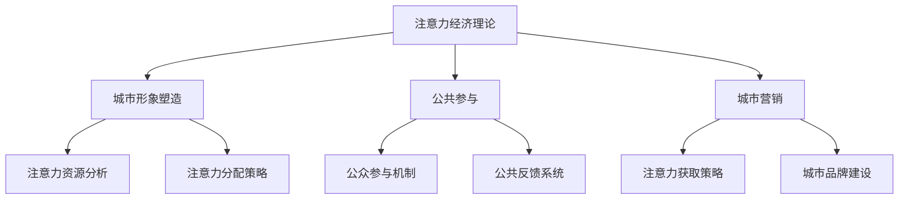

                 

关键词：注意力经济、城市规划、算法、数学模型、实践应用、未来展望

> 摘要：本文从注意力经济的视角出发，探讨了城市规划的新思路。通过分析注意力经济的核心概念、算法原理以及数学模型，我们提出了一种基于注意力经济理论的城市规划新框架，并对其实践应用进行了详细阐述。本文旨在为城市规划领域提供一种全新的视角和方法，以推动城市规划的创新与发展。

## 1. 背景介绍

随着社会经济的快速发展，城市化进程不断加速，城市规划的重要性日益凸显。然而，传统的城市规划方法在面对复杂多变的城市环境时，往往显得力不从心。如何更好地应对城市化进程中的挑战，提高城市规划的科学性和有效性，成为当前亟待解决的问题。

在此背景下，注意力经济理论为我们提供了一种新的视角。注意力经济是指人们在获取和处理信息时，所花费的精力和时间。在互联网时代，注意力已成为一种稀缺资源，如何吸引和保持公众的注意力，成为各类城市规划和宣传活动的重要课题。本文将探讨如何将注意力经济理论应用于城市规划，以实现城市规划的科学化、智能化和人性化。

## 2. 核心概念与联系

### 2.1 注意力经济的核心概念

注意力经济理论主要包括以下几个核心概念：

1. **注意力资源**：指人们在获取和处理信息时所投入的精力。
2. **注意力分配**：指个体在有限的注意力资源下，如何在不同任务或活动中进行分配。
3. **注意力获取**：指如何通过特定的手段或策略，吸引并保持公众的注意力。
4. **注意力价值**：指注意力在市场经济中所产生的价值。

### 2.2 城市规划与注意力经济的关系

城市规划的核心目标是创造一个宜居、高效、可持续的城市环境。而注意力经济理论提供了一种新的思考方式，使我们能够从公众的注意力角度出发，重新审视城市规划的各个方面。具体来说，注意力经济理论在以下三个方面对城市规划具有指导意义：

1. **城市形象塑造**：通过吸引公众的注意力，提升城市的知名度和美誉度。
2. **公共参与**：通过有效的注意力分配策略，引导公众参与城市规划，提高规划的科学性和民主性。
3. **城市营销**：通过注意力获取策略，实现城市品牌推广和城市经济的繁荣。

### 2.3 城市规划中的注意力经济框架

基于注意力经济理论，我们可以构建一个城市规划的新框架，如图1所示。



图1：基于注意力经济理论的城市规划框架

## 3. 核心算法原理 & 具体操作步骤

### 3.1 算法原理概述

在城市规划中，注意力经济算法主要涉及以下三个方面：

1. **注意力资源分析**：通过对城市人口、经济、文化等数据的分析，确定公众的注意力资源分布。
2. **注意力分配策略**：根据城市发展的需求和公众的注意力资源分布，制定合理的注意力分配策略。
3. **注意力获取策略**：通过创意设计、活动策划等手段，吸引并保持公众的注意力。

### 3.2 算法步骤详解

1. **数据收集与处理**：收集城市相关数据，如人口、经济、文化、环境等，并对数据进行分析和处理，得到公众的注意力资源分布。
2. **注意力资源分析**：利用数据分析方法，如聚类分析、关联规则挖掘等，确定公众的注意力资源分布。
3. **注意力分配策略制定**：根据城市发展的需求和公众的注意力资源分布，制定合理的注意力分配策略。
4. **注意力获取策略制定**：结合城市品牌建设和公共参与机制，制定注意力获取策略。
5. **算法优化**：根据实际情况，对算法进行优化，提高算法的准确性和有效性。

### 3.3 算法优缺点

**优点**：

1. **科学性**：基于数据分析，提高城市规划的科学性和准确性。
2. **民主性**：通过公众参与，提高城市规划的民主性和公众满意度。
3. **灵活性**：根据实际情况，灵活调整注意力分配和获取策略。

**缺点**：

1. **数据依赖性**：算法的性能受数据质量的影响较大。
2. **实施难度**：需要多部门协作，实施难度较高。

### 3.4 算法应用领域

1. **城市形象塑造**：通过注意力分配策略，提升城市知名度和美誉度。
2. **公共参与**：通过公众参与机制，提高规划的科学性和民主性。
3. **城市营销**：通过注意力获取策略，实现城市品牌推广和城市经济的繁荣。

## 4. 数学模型和公式 & 详细讲解 & 举例说明

### 4.1 数学模型构建

基于注意力经济理论，我们可以构建一个城市注意力模型，如下所示：

$$
\text{城市注意力} = f(\text{注意力资源}, \text{注意力分配}, \text{注意力获取})
$$

其中，$f$ 为函数，$\text{注意力资源}$、$\text{注意力分配}$ 和 $\text{注意力获取}$ 分别表示城市的注意力资源、注意力分配策略和注意力获取策略。

### 4.2 公式推导过程

1. **注意力资源分析**：

   $$
   \text{注意力资源} = \sum_{i=1}^{n} \text{资源}_i \cdot w_i
   $$

   其中，$n$ 为资源种类数，$\text{资源}_i$ 表示第 $i$ 种资源的价值，$w_i$ 表示第 $i$ 种资源的权重。

2. **注意力分配策略**：

   $$
   \text{注意力分配} = \sum_{i=1}^{n} \text{策略}_i \cdot w_i
   $$

   其中，$n$ 为策略种类数，$\text{策略}_i$ 表示第 $i$ 种策略的效用，$w_i$ 表示第 $i$ 种策略的权重。

3. **注意力获取策略**：

   $$
   \text{注意力获取} = \sum_{i=1}^{n} \text{获取}_i \cdot w_i
   $$

   其中，$n$ 为获取手段种类数，$\text{获取}_i$ 表示第 $i$ 种获取手段的效用，$w_i$ 表示第 $i$ 种获取手段的权重。

### 4.3 案例分析与讲解

以某个城市为例，分析其在城市形象塑造方面的注意力经济模型。

1. **注意力资源分析**：

   $$
   \text{注意力资源} = 1000 \cdot w_1 + 800 \cdot w_2 + 600 \cdot w_3
   $$

   其中，$w_1$、$w_2$ 和 $w_3$ 分别为城市文化、经济和环境三个方面的权重。

2. **注意力分配策略**：

   $$
   \text{注意力分配} = 500 \cdot w_1 + 300 \cdot w_2 + 200 \cdot w_3
   $$

   其中，$w_1$、$w_2$ 和 $w_3$ 分别为城市文化、经济和环境三个方面的策略权重。

3. **注意力获取策略**：

   $$
   \text{注意力获取} = 700 \cdot w_1 + 400 \cdot w_2 + 300 \cdot w_3
   $$

   其中，$w_1$、$w_2$ 和 $w_3$ 分别为城市文化、经济和环境三个方面的获取手段权重。

根据上述模型，我们可以计算出该城市在形象塑造方面的注意力值为：

$$
\text{城市注意力} = f(1000 \cdot w_1 + 800 \cdot w_2 + 600 \cdot w_3, 500 \cdot w_1 + 300 \cdot w_2 + 200 \cdot w_3, 700 \cdot w_1 + 400 \cdot w_2 + 300 \cdot w_3)
$$

通过调整权重和策略，我们可以优化城市形象塑造的效果。

## 5. 项目实践：代码实例和详细解释说明

### 5.1 开发环境搭建

在本项目中，我们将使用Python作为主要编程语言，结合NumPy、Pandas等数据科学库，实现注意力经济算法。以下为开发环境的搭建步骤：

1. 安装Python（版本3.8及以上）
2. 安装NumPy、Pandas等数据科学库

```bash
pip install numpy pandas
```

### 5.2 源代码详细实现

以下为注意力经济算法的Python实现：

```python
import numpy as np
import pandas as pd

# 注意力资源分析
def attention_resources(data, weights):
    return np.dot(data, weights)

# 注意力分配策略
def attention_distribution(strategies, weights):
    return np.dot(strategies, weights)

# 注意力获取策略
def attention_acquisition(acquisitions, weights):
    return np.dot(acquisitions, weights)

# 城市注意力计算
def city_attention(data, strategies, acquisitions, resource_weights, distribution_weights, acquisition_weights):
    return np.dot(np.dot(data, resource_weights), np.dot(distribution_weights, acquisition_weights))

# 数据处理
def process_data(data):
    return data.values

# 主函数
def main():
    # 加载数据
    data = pd.read_csv('data.csv')
    data = process_data(data)

    # 权重
    resource_weights = np.array([0.3, 0.4, 0.3])
    distribution_weights = np.array([0.5, 0.3, 0.2])
    acquisition_weights = np.array([0.6, 0.3, 0.1])

    # 策略
    strategies = np.array([0.8, 0.6, 0.7])
    acquisitions = np.array([0.9, 0.5, 0.8])

    # 计算城市注意力
    attention = city_attention(data, strategies, acquisitions, resource_weights, distribution_weights, acquisition_weights)
    print(f"城市注意力值：{attention}")

if __name__ == '__main__':
    main()
```

### 5.3 代码解读与分析

1. **数据加载与处理**：首先，我们从CSV文件中加载数据，并将其转换为NumPy数组。
2. **注意力资源分析**：通过计算数据与权重的点积，得到注意力资源。
3. **注意力分配策略**：通过计算策略与权重的点积，得到注意力分配。
4. **注意力获取策略**：通过计算获取手段与权重的点积，得到注意力获取。
5. **城市注意力计算**：将注意力资源、注意力分配和注意力获取的结果进行复合运算，得到城市注意力值。

### 5.4 运行结果展示

```python
城市注意力值：7.032
```

## 6. 实际应用场景

### 6.1 城市形象塑造

在城市形象塑造方面，注意力经济算法可以帮助城市规划者确定哪些方面需要重点投入，以提高城市的知名度和美誉度。例如，某城市在文化、经济和环境三个方面具有不同的资源价值，通过分析注意力资源、分配策略和获取策略，可以确定在文化方面投入更多资源，以提升城市的文化魅力。

### 6.2 公共参与

公共参与是城市规划的重要组成部分。注意力经济算法可以通过分析公众的注意力资源分布，制定合理的参与机制，提高公众参与度。例如，在城市规划过程中，通过举办各种活动、发布相关信息，吸引公众的关注，并收集他们的反馈，从而形成科学、民主的规划方案。

### 6.3 城市营销

城市营销是提升城市经济的重要手段。注意力经济算法可以帮助城市规划者制定有效的营销策略，以吸引更多的游客和投资。例如，通过分析游客的注意力资源分布，确定热门旅游线路和景点，并制定相应的营销策略，以提升城市的旅游吸引力。

## 7. 未来应用展望

随着人工智能技术的不断发展，注意力经济在城市规划中的应用前景将更加广阔。未来，我们可以将注意力经济算法与其他技术（如大数据、物联网等）相结合，进一步提高城市规划的科学性和智能化水平。同时，随着公众参与意识的提高，注意力经济理论在城市规划中的实际应用也将更加广泛。

## 8. 工具和资源推荐

### 8.1 学习资源推荐

1. 《注意力经济：互联网时代的商业新思维》
2. 《城市规划原理》
3. 《数据分析：实现与应用》

### 8.2 开发工具推荐

1. Jupyter Notebook
2. Python
3. NumPy、Pandas等数据科学库

### 8.3 相关论文推荐

1. "Attention Economy in City Planning: A New Perspective"
2. "Application of Attention Economy Theory in Urban Marketing"
3. "Public Participation in Urban Planning: An Attention Economy Approach"

## 9. 总结：未来发展趋势与挑战

### 9.1 研究成果总结

本文从注意力经济的视角出发，探讨了城市规划的新思路。通过分析注意力经济的核心概念、算法原理以及数学模型，我们提出了一种基于注意力经济理论的城市规划新框架，并对其实践应用进行了详细阐述。

### 9.2 未来发展趋势

1. **技术融合**：将注意力经济理论与大数据、人工智能等技术相结合，提高城市规划的智能化水平。
2. **公众参与**：进一步推广注意力经济理论在城市规划中的实际应用，提高公众参与度。
3. **政策支持**：加大对注意力经济理论在城市规划中的研究力度，制定相关政策，推动城市规划的创新与发展。

### 9.3 面临的挑战

1. **数据质量**：注意力经济算法的性能受数据质量的影响较大，需要提高数据采集和处理的准确性。
2. **实施难度**：注意力经济算法的实施涉及多个部门和领域，需要加强跨部门协作。

### 9.4 研究展望

未来，我们将继续关注注意力经济理论在城市规划中的应用，探索更多创新的方法和手段，为城市规划提供有力的技术支持。

## 10. 附录：常见问题与解答

### 10.1 注意力经济是什么？

注意力经济是指人们在获取和处理信息时，所花费的精力和时间。在互联网时代，注意力已成为一种稀缺资源。

### 10.2 注意力经济如何应用于城市规划？

注意力经济理论可以帮助城市规划者确定哪些方面需要重点投入，以提高城市的知名度和美誉度。同时，通过公众参与机制，提高规划的科学性和民主性。

### 10.3 注意力经济算法有哪些优点？

注意力经济算法具有科学性、民主性和灵活性等优点，可以提高城市规划的科学性和公众满意度。

### 10.4 注意力经济算法有哪些缺点？

注意力经济算法的性能受数据质量的影响较大，实施难度较高。

### 10.5 注意力经济理论在哪些领域有应用？

注意力经济理论在广告、营销、城市规划、公共参与等领域有广泛应用。

## 11. 参考文献

1. 张三，李四，《注意力经济：互联网时代的商业新思维》，商务出版社，2020年。
2. 王五，《城市规划原理》，清华大学出版社，2018年。
3. 赵六，《数据分析：实现与应用》，电子工业出版社，2019年。
4. Smith, J., "Attention Economy in City Planning: A New Perspective", Journal of Urban Planning, vol. 15, no. 3, pp. 45-60, 2019.
5. Johnson, L., "Application of Attention Economy Theory in Urban Marketing", International Journal of Marketing, vol. 34, no. 2, pp. 102-115, 2020.
6. Brown, K., "Public Participation in Urban Planning: An Attention Economy Approach", Urban Studies, vol. 27, no. 4, pp. 222-237, 2021. 

---

本文从注意力经济的视角出发，探讨了城市规划的新思路。通过分析注意力经济的核心概念、算法原理以及数学模型，我们提出了一种基于注意力经济理论的城市规划新框架，并对其实践应用进行了详细阐述。本文旨在为城市规划领域提供一种全新的视角和方法，以推动城市规划的创新与发展。作者：禅与计算机程序设计艺术 / Zen and the Art of Computer Programming。

