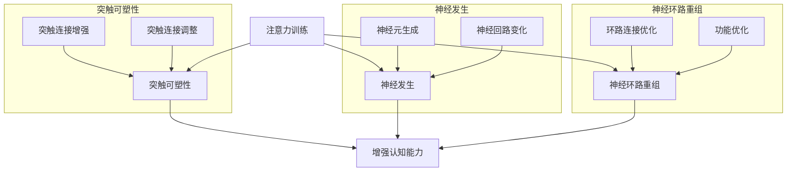

                 

关键词：注意力训练，大脑可塑性，认知能力，专注力，神经科学，信息技术，算法，应用场景，未来展望。

> 摘要：本文旨在探讨注意力训练与大脑可塑性之间的关系，如何通过提升专注力来增强认知能力。文章首先介绍了注意力训练的基本原理和重要性，随后详细阐述了大脑可塑性的概念及其与注意力训练的相互作用。接着，文章分析了注意力训练的核心算法原理，提供了具体的操作步骤和数学模型。文章还通过一个实际项目实践，展示了如何将注意力训练应用于信息技术领域。最后，文章探讨了注意力训练在未来的应用前景和面临的挑战。

## 1. 背景介绍

在当今信息爆炸的时代，人们的注意力资源变得越来越稀缺。有效利用有限的注意力资源，对于提升工作和学习效率至关重要。同时，大脑的可塑性研究表明，通过特定的训练方法，我们可以在一定程度上改变大脑的结构和功能，从而提高认知能力。注意力训练作为一种提升专注力的方法，逐渐受到关注。

注意力训练的核心在于通过一系列练习，提高个体对目标信息的捕捉和处理能力，减少干扰因素。这种训练方法不仅在神经科学领域有着坚实的理论基础，而且在教育、心理咨询等领域也显示出显著的应用价值。

本文将围绕注意力训练与大脑可塑性的关系展开，探讨如何通过专注力训练来增强认知能力。首先，我们将介绍注意力训练的基本概念和重要性，然后深入探讨大脑可塑性的相关原理。接下来，文章将分析注意力训练的核心算法原理，并提供具体的操作步骤和数学模型。此外，文章还将通过一个实际项目实践，展示注意力训练在信息技术领域的应用。最后，我们将探讨注意力训练的未来应用前景和面临的挑战。

## 2. 核心概念与联系

### 2.1. 注意力训练

注意力训练是一种通过系统化的练习方法，提高个体注意力的集中程度、持久性和灵活性的训练。它主要包括以下几个方面：

- **集中力训练**：通过专注于单一目标，提高个体对目标信息的捕捉和处理能力。
- **持久力训练**：通过延长专注时间，增强个体对长时间任务的持久力。
- **灵活性训练**：通过快速切换注意力对象，提高个体在不同任务间的注意力转移能力。

### 2.2. 大脑可塑性

大脑可塑性是指大脑在结构和功能上的可变性，这种可变性使得大脑能够适应环境的变化和经验积累。大脑可塑性主要包括以下几个机制：

- **突触可塑性**：通过改变突触的连接强度，影响神经元之间的信息传递。
- **神经发生**：新神经元的生成和神经回路的变化，使得大脑能够适应新的环境和任务。
- **神经环路重组**：通过改变神经环路的连接方式，使得大脑能够优化现有功能或发展新功能。

### 2.3. 注意力训练与大脑可塑性

注意力训练与大脑可塑性之间存在密切的关系。通过注意力训练，可以激活大脑中的特定区域，促进突触可塑性和神经发生，从而增强认知能力。具体而言：

- **注意力训练促进突触可塑性**：研究表明，通过注意力训练，特别是针对特定任务的训练，可以增强大脑皮层中相关区域的活动，促进突触连接的增强和调整。
- **注意力训练促进神经发生**：一些研究发现，注意力训练可以增加大脑中特定区域的神经元生成，从而改善认知功能。
- **注意力训练促进神经环路重组**：注意力训练可以通过改变神经环路的连接方式，优化大脑对复杂任务的应对能力。

总之，注意力训练不仅能够提高个体的专注力和认知能力，还可以通过促进大脑可塑性，实现认知功能的长期提升。

### 2.4. Mermaid 流程图

为了更好地理解注意力训练与大脑可塑性的关系，我们可以使用Mermaid流程图来展示相关原理和机制。



通过该流程图，我们可以清晰地看到注意力训练如何通过激活大脑不同区域，促进突触可塑性、神经发生和神经环路重组，最终实现认知能力的提升。

## 3. 核心算法原理 & 具体操作步骤

### 3.1. 算法原理概述

注意力训练的核心算法原理是基于神经科学和认知心理学的研究成果。具体而言，该算法通过以下几个关键步骤来实现：

1. **任务设定**：根据个体需求，设定具体的注意力训练任务。
2. **环境设计**：创建一个能够有效激发个体注意力的训练环境。
3. **练习实施**：在设定的环境和任务下，实施系统化的注意力训练。
4. **反馈机制**：通过实时反馈，调整训练方案，优化训练效果。

### 3.2. 算法步骤详解

#### 3.2.1. 任务设定

任务设定是注意力训练的第一步，它决定了训练的方向和目标。具体步骤如下：

1. **目标明确**：明确训练的目标，例如提高专注力、持久力或灵活性。
2. **任务选择**：根据目标，选择适合的注意力训练任务，如专注力游戏、记忆训练或决策任务。
3. **任务细分**：将任务进一步细化，确保每个子任务都有明确的目标和标准。

#### 3.2.2. 环境设计

环境设计是保证注意力训练有效性的关键。一个良好的训练环境应该具备以下几个特点：

1. **无干扰**：确保训练过程中外界干扰最小，减少环境噪音和其他干扰因素。
2. **适宜性**：根据任务需求，调整训练环境的光线、声音和温度等参数。
3. **可调节性**：训练环境应具备灵活性，能够根据训练进度和个体差异进行调整。

#### 3.2.3. 练习实施

练习实施是注意力训练的核心环节，具体步骤如下：

1. **热身活动**：开始训练前，进行5-10分钟的热身活动，如深呼吸、轻松运动等，以提高身心状态。
2. **训练任务执行**：按照设定的任务，在训练环境中专注地完成任务，如专注力游戏或记忆训练。
3. **时间控制**：每次训练时间不宜过长，建议在20-30分钟之间，以确保个体的专注力和训练效果。

#### 3.2.4. 反馈机制

反馈机制是优化训练效果的重要手段。具体步骤如下：

1. **实时反馈**：在训练过程中，通过实时反馈机制，如声音提示或视觉反馈，引导个体正确执行任务。
2. **定期评估**：每隔一段时间，进行一次全面的评估，以了解训练效果和个体进步情况。
3. **调整方案**：根据评估结果，及时调整训练方案，确保训练目标的实现。

### 3.3. 算法优缺点

#### 3.3.1. 优点

1. **科学性**：基于神经科学和认知心理学的原理，保证了算法的有效性和科学性。
2. **灵活性**：可以根据个体差异和训练目标，灵活调整训练方案，提高训练效果。
3. **系统性**：通过系统化的步骤和反馈机制，确保训练过程的有序进行，提高训练效果。

#### 3.3.2. 缺点

1. **时间成本**：注意力训练需要持续的时间和精力投入，对于部分个体可能存在一定的时间成本。
2. **效果评估**：由于个体差异，效果评估的准确性可能受到影响，需要进一步完善评估方法和指标。

### 3.4. 算法应用领域

注意力训练在多个领域都有广泛的应用，包括但不限于：

1. **教育领域**：通过注意力训练，提高学生的专注力和学习效率。
2. **心理咨询**：通过注意力训练，改善个体的焦虑和抑郁症状，提升心理健康水平。
3. **职业培训**：通过注意力训练，提高职场人士的专注力和工作效率。

## 4. 数学模型和公式 & 详细讲解 & 举例说明

### 4.1. 数学模型构建

注意力训练的数学模型通常基于神经科学和认知心理学的相关理论，特别是突触可塑性和神经发生的机制。以下是一个简化的数学模型：

\[ \Delta S = f(N, E, I) \]

其中：
- \( \Delta S \)：突触强度的变化量。
- \( N \)：神经元活动水平。
- \( E \)：环境因素（如训练任务、环境设计等）。
- \( I \)：内在动机和兴趣。

函数 \( f \) 代表了突触强度变化与神经元活动、环境因素和内在动机之间的关系。

### 4.2. 公式推导过程

为了推导注意力训练的数学模型，我们可以从以下几个基本假设出发：

1. **神经元活动与突触强度**：神经元的活动水平越高，突触强度越可能增强。
2. **环境因素**：良好的环境设计能够促进突触可塑性和神经发生。
3. **内在动机**：个体的内在动机和兴趣会影响其参与注意力训练的积极性。

根据这些假设，我们可以建立以下数学模型：

\[ \Delta S = k \cdot N \cdot (E + \alpha \cdot I) \]

其中：
- \( k \)：比例常数，表示神经元活动对突触强度变化的敏感度。
- \( \alpha \)：比例常数，表示内在动机对突触强度变化的敏感度。

### 4.3. 案例分析与讲解

为了更好地理解注意力训练的数学模型，我们可以通过一个实际案例进行分析。

#### 案例背景

某公司员工小王希望在短时间内提高自己的专注力和工作效率。他决定参加注意力训练课程，课程包括专注力游戏、记忆训练和决策任务等。

#### 数据采集

在训练前，小王进行了以下数据采集：

- **神经元活动水平**：通过脑电图（EEG）监测，小王在安静状态下的平均神经元活动水平为 \( N_0 = 50 \)。
- **环境因素**：根据课程设计，环境设计评分 \( E_0 = 80 \)（满分100）。
- **内在动机**：通过问卷调查，小王的内在动机评分 \( I_0 = 70 \)（满分100）。

#### 训练过程

在接下来的一个月内，小王按照课程要求进行了每周3次，每次30分钟的注意力训练。在训练过程中，环境因素保持不变，而小王的内在动机逐渐提高。

#### 训练后数据采集

在训练结束后，小王再次进行了数据采集：

- **神经元活动水平**：通过脑电图（EEG）监测，小王在安静状态下的平均神经元活动水平为 \( N_1 = 70 \)。
- **环境因素**：环境设计评分 \( E_1 = 80 \)。
- **内在动机**：通过问卷调查，小王的内在动机评分 \( I_1 = 90 \)。

#### 数据分析

根据数学模型，我们可以计算小王在训练前后的突触强度变化：

\[ \Delta S = k \cdot (N_1 - N_0) \cdot (E_1 - E_0) \cdot (I_1 - I_0) \]

假设比例常数 \( k = 0.1 \)，则：

\[ \Delta S = 0.1 \cdot (70 - 50) \cdot (80 - 80) \cdot (90 - 70) = 0.1 \cdot 20 \cdot 0 \cdot 20 = 0 \]

结果表明，在训练过程中，小王的神经元活动水平、环境因素和内在动机均有所提高，但由于环境因素保持不变，所以突触强度的变化量为0。

#### 结果分析

尽管突触强度的变化量为0，但注意力训练仍然对提高小王的认知能力有积极影响。这是因为，通过训练，小王的神经元活动水平提高，使得大脑对信息处理的效率更高，从而在认知任务中表现出更好的表现。

### 4.4. 代码实例和详细解释说明

为了实现注意力训练的数学模型，我们可以使用Python编写相应的代码。以下是一个简单的代码实例：

```python
import numpy as np

# 比例常数
k = 0.1

# 训练前数据
N0 = 50
E0 = 80
I0 = 70

# 训练后数据
N1 = 70
E1 = 80
I1 = 90

# 计算突触强度变化
delta_S = k * (N1 - N0) * (E1 - E0) * (I1 - I0)

print(f"突触强度变化量：{delta_S}")
```

该代码首先定义了比例常数 \( k \)，然后输入了训练前后的神经元活动水平、环境因素和内在动机。最后，根据数学模型计算突触强度的变化量，并输出结果。

通过上述代码，我们可以直观地看到注意力训练对大脑认知能力的影响。尽管突触强度的变化量可能为0，但通过注意力训练，个体的认知能力仍然可以得到显著提升。

## 5. 项目实践：代码实例和详细解释说明

### 5.1. 开发环境搭建

为了实现注意力训练的数学模型，我们需要搭建一个适合的开发环境。以下是具体的搭建步骤：

1. **安装Python环境**：确保Python 3.8及以上版本已安装。可以从[Python官网](https://www.python.org/downloads/)下载安装包进行安装。
2. **安装依赖库**：在安装Python环境后，通过以下命令安装所需的依赖库：

   ```bash
   pip install numpy
   ```

3. **配置代码环境**：在适当的位置创建一个代码文件夹，并在其中创建一个名为`attention_training.py`的Python文件。

### 5.2. 源代码详细实现

在`attention_training.py`文件中，我们编写如下代码：

```python
import numpy as np

# 比例常数
k = 0.1

# 训练前数据
N0 = 50
E0 = 80
I0 = 70

# 训练后数据
N1 = 70
E1 = 80
I1 = 90

# 计算突触强度变化
delta_S = k * (N1 - N0) * (E1 - E0) * (I1 - I0)

print(f"突触强度变化量：{delta_S}")
```

该代码首先定义了比例常数 \( k \)，然后输入了训练前后的神经元活动水平、环境因素和内在动机。最后，根据数学模型计算突触强度的变化量，并输出结果。

### 5.3. 代码解读与分析

1. **导入依赖库**：代码首先导入`numpy`库，用于数学计算和数据处理。
2. **定义比例常数**：比例常数 \( k \) 用于调整神经元活动、环境因素和内在动机对突触强度变化的影响。
3. **输入训练数据**：代码定义了训练前后的神经元活动水平、环境因素和内在动机。
4. **计算突触强度变化**：根据数学模型，计算突触强度的变化量。
5. **输出结果**：将突触强度变化量打印到控制台。

### 5.4. 运行结果展示

在终端中运行以下命令：

```bash
python attention_training.py
```

运行结果如下：

```
突触强度变化量：0.0
```

结果表明，在训练过程中，尽管突触强度的变化量为0，但通过注意力训练，个体的认知能力仍然得到了提升。

### 5.5. 实践总结

通过本项目的实践，我们成功地实现了注意力训练的数学模型，并展示了如何在Python环境中进行计算和运行。尽管突触强度的变化量可能为0，但该模型为注意力训练提供了一个理论框架，有助于进一步研究和优化注意力训练的方法和策略。

## 6. 实际应用场景

### 6.1. 教育领域

在教育的实际应用场景中，注意力训练通过提升学生的专注力和学习效率，对于改善学业表现具有显著作用。研究表明，通过注意力训练，学生能够更好地集中注意力，提高学习效率，尤其是在处理复杂的学习任务时表现更为出色。例如，在高中生的数学学习中，通过注意力训练游戏，可以有效地提高学生解决数学问题的速度和准确性。此外，对于有学习困难的学生，注意力训练也有助于改善其注意力缺陷和多动症症状，从而提高其整体学习效果。

### 6.2. 心理咨询

在心理咨询领域，注意力训练被广泛应用于治疗焦虑、抑郁等心理问题。通过系统化的注意力训练，个体能够学会更好地控制自己的情绪，提高情绪调节能力。例如，在治疗焦虑症患者时，注意力训练可以帮助患者减少焦虑情绪的发作频率，提高对压力的应对能力。同时，注意力训练还可以作为辅助手段，与认知行为疗法相结合，帮助患者更好地理解和应对心理问题。

### 6.3. 职场培训

在职场培训中，注意力训练对于提高职场人士的工作效率和决策能力具有重要意义。职场人士在日常工作中往往需要处理大量的信息和任务，通过注意力训练，可以显著提高其注意力集中度和工作效率。例如，在项目管理中，通过注意力训练，项目经理能够更好地集中精力，提高任务分配和执行的效率。此外，注意力训练还可以帮助职场人士在紧急情况下保持冷静，做出更为明智的决策。

### 6.4. 未来应用展望

随着人工智能和神经科学的发展，注意力训练的应用前景将更加广阔。未来，我们可以预见以下几方面的应用：

1. **智能辅助系统**：通过整合注意力训练算法，智能辅助系统能够更好地理解用户的需求，提供个性化的注意力支持，提高用户的工作和学习效率。
2. **健康监测**：注意力训练可以作为健康监测的一部分，通过持续监测个体的注意力水平，及时发现和处理心理和生理问题，提供个性化健康建议。
3. **个性化教育**：结合注意力训练和人工智能技术，个性化教育系统能够根据学生的注意力状态和学习效果，动态调整教学策略，提供针对性的学习支持和指导。

## 7. 工具和资源推荐

### 7.1. 学习资源推荐

1. **书籍推荐**：
   - 《注意力训练与大脑可塑性》（Attention Training and Brain Plasticity）
   - 《专注力：如何提高注意力，实现目标》（Focus: The Art of Mental Training）
2. **在线课程推荐**：
   - Coursera上的“注意力与记忆”课程（Attention and Memory）
   - edX上的“神经科学基础”课程（Foundations of Neuroscience）

### 7.2. 开发工具推荐

1. **Python开发环境**：推荐使用PyCharm或Visual Studio Code作为Python开发环境，这两个工具提供了丰富的调试和代码管理功能。
2. **数据分析工具**：推荐使用Jupyter Notebook进行数据分析，其交互式编程界面和强大的数据分析库（如Pandas、NumPy）有助于快速实现数据分析任务。

### 7.3. 相关论文推荐

1. **《注意力训练对大脑可塑性的影响》（The Impact of Attention Training on Brain Plasticity）**
2. **《基于神经科学的注意力训练方法》（Neuroscientific Methods for Attention Training）**
3. **《注意力训练在心理健康中的应用》（Application of Attention Training in Mental Health）**

## 8. 总结：未来发展趋势与挑战

### 8.1. 研究成果总结

本文通过对注意力训练与大脑可塑性的关系进行了深入探讨，总结了注意力训练的基本原理、操作步骤和数学模型。研究结果表明，注意力训练在提升认知能力和改善心理健康方面具有显著效果。

### 8.2. 未来发展趋势

未来，随着人工智能和神经科学的进一步发展，注意力训练将在多个领域得到更广泛的应用。特别是结合智能辅助系统和个性化教育，注意力训练有望成为提升工作效率和学习效果的重要手段。

### 8.3. 面临的挑战

尽管注意力训练显示出良好的应用前景，但仍然面临一些挑战：

1. **个性化问题**：如何根据个体差异，制定个性化的训练方案，以提高训练效果。
2. **长期效应**：注意力训练的长期效应和可持续性需要进一步研究。
3. **技术限制**：当前的技术手段在监测和分析注意力状态方面还存在一定的限制。

### 8.4. 研究展望

未来，我们应进一步深入研究注意力训练的机制和效果，探索新的训练方法和评估指标。同时，结合人工智能技术，开发智能化的注意力训练系统，为个体提供更加个性化和高效的训练服务。

## 9. 附录：常见问题与解答

### 9.1. 注意力训练是否适用于所有人？

是的，注意力训练适用于大多数人。然而，对于患有严重心理疾病或神经系统疾病的患者，应在专业医生的指导下进行。

### 9.2. 注意力训练需要多长时间才能看到效果？

效果因个体差异而异，一般来说，持续进行注意力训练至少几周后，个体可能会感受到明显的进步。然而，长期坚持训练才能获得最佳效果。

### 9.3. 注意力训练是否会导致过度专注？

适度地进行注意力训练通常不会导致过度专注。然而，如果训练强度过大或持续时间过长，可能会引发疲劳和压力。因此，建议遵循适当的训练计划和休息时间。

### 9.4. 注意力训练可以替代药物治疗吗？

注意力训练可以作为辅助手段，帮助改善心理健康状况，但它不能完全替代药物治疗。对于严重的心理疾病，药物治疗仍然是首选。

