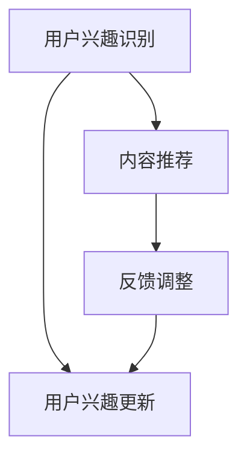

                 

关键词：注意力过滤器、AI、信息定制、算法原理、数学模型、项目实践、应用场景、未来展望

> 摘要：本文深入探讨了注意力过滤器2.0——一款基于AI驱动的信息定制技术，旨在通过算法原理和数学模型详细解析其核心机制，并通过具体项目实践展示其实际应用效果。文章还分析了注意力过滤器2.0在不同领域的实际应用场景，并对未来发展趋势与挑战进行了展望。

## 1. 背景介绍

在信息爆炸的时代，人们每天都会接收到海量的信息。如何从这些信息中筛选出对自己有用的内容，成为了一个重要的问题。传统的信息筛选方法往往依赖于关键词匹配或模式识别，但这种方法存在明显的局限性。随着人工智能技术的发展，基于AI的注意力过滤器应运而生，旨在通过智能算法实现更高效、更精准的信息定制。

注意力过滤器2.0作为下一代信息定制技术，采用了更先进的AI算法，能够更准确地捕捉用户的兴趣点，并根据用户的反馈不断优化推荐结果。本文将详细介绍注意力过滤器2.0的核心原理、数学模型和具体应用，帮助读者更好地理解这一技术。

### 2. 核心概念与联系

注意力过滤器2.0的核心概念包括用户兴趣识别、内容推荐和反馈调整。下面是一个简化的Mermaid流程图，用于描述这三个概念之间的联系：



- 用户兴趣识别：通过分析用户的搜索历史、浏览记录和行为数据，识别用户的兴趣点。
- 内容推荐：根据用户兴趣，从海量的信息中筛选出符合用户需求的推荐内容。
- 反馈调整：根据用户的反馈，调整推荐算法，提高推荐质量。

### 3. 核心算法原理 & 具体操作步骤

#### 3.1 算法原理概述

注意力过滤器2.0采用了基于深度学习的推荐算法，通过学习用户的行为数据，构建用户兴趣模型。算法的核心步骤如下：

1. 数据预处理：对用户行为数据进行清洗和转换，提取出有用的特征。
2. 用户兴趣建模：利用深度学习模型，对用户兴趣进行建模。
3. 内容推荐：根据用户兴趣模型，从内容库中推荐符合用户兴趣的内容。
4. 反馈调整：收集用户的反馈，调整用户兴趣模型，提高推荐质量。

#### 3.2 算法步骤详解

1. **数据预处理**

   数据预处理是整个算法的基础。首先，需要对用户行为数据进行清洗，去除无效数据。然后，对数据进行特征提取，提取出能够反映用户兴趣的特征。常用的特征包括用户的搜索关键词、浏览记录、点赞记录等。

   ```python
   # Python代码示例：数据预处理
   def preprocess_data(data):
       # 清洗数据
       cleaned_data = clean_data(data)
       # 特征提取
       features = extract_features(cleaned_data)
       return features
   ```

2. **用户兴趣建模**

   用户兴趣建模是注意力过滤器2.0的核心。我们采用了一种基于深度神经网络的模型，如卷积神经网络（CNN）或循环神经网络（RNN），对用户兴趣进行建模。

   ```python
   # Python代码示例：用户兴趣建模
   model = build_model()
   model.fit(X_train, y_train)
   user_interest = model.predict(X_test)
   ```

3. **内容推荐**

   根据用户兴趣模型，我们可以从内容库中推荐符合用户兴趣的内容。推荐算法可以采用基于内容的推荐、协同过滤推荐或混合推荐等策略。

   ```python
   # Python代码示例：内容推荐
   def recommend_content(user_interest, content_library):
       recommended_content = find_relevant_content(user_interest, content_library)
       return recommended_content
   ```

4. **反馈调整**

   收集用户的反馈，如点击、收藏、评论等，通过反馈调整用户兴趣模型，提高推荐质量。

   ```python
   # Python代码示例：反馈调整
   def adjust_user_interest(user_interest, feedback):
       updated_interest = update_interest(user_interest, feedback)
       return updated_interest
   ```

#### 3.3 算法优缺点

**优点：**

- **个性化强**：注意力过滤器2.0能够根据用户的兴趣和行为数据，实现高度个性化的推荐。
- **自适应性强**：通过用户的反馈，能够不断调整推荐算法，提高推荐质量。

**缺点：**

- **计算复杂度高**：深度学习模型的训练和预测需要大量的计算资源。
- **数据依赖性高**：算法的效果依赖于用户的行为数据，如果数据不足，可能会导致推荐不准确。

#### 3.4 算法应用领域

注意力过滤器2.0可以应用于多个领域，如电子商务、社交媒体、在线教育等。以下是几个典型的应用场景：

- **电子商务**：根据用户的购物行为和浏览记录，推荐用户可能感兴趣的商品。
- **社交媒体**：根据用户的兴趣和行为，推荐用户可能感兴趣的内容。
- **在线教育**：根据学生的学习行为和兴趣，推荐适合的学习资源。

### 4. 数学模型和公式 & 详细讲解 & 举例说明

#### 4.1 数学模型构建

注意力过滤器2.0的数学模型主要包括用户兴趣模型、内容模型和推荐模型。以下是这些模型的构建方法：

**用户兴趣模型：**

用户兴趣模型可以用一个高维向量表示，向量中的每个元素表示用户对某个主题的感兴趣程度。

$$
\mathbf{u} = (u_1, u_2, ..., u_n)
$$

其中，$u_i$表示用户对第$i$个主题的感兴趣程度。

**内容模型：**

内容模型可以用一个高维向量表示，向量中的每个元素表示内容包含的某个主题的权重。

$$
\mathbf{c} = (c_1, c_2, ..., c_n)
$$

其中，$c_i$表示内容包含的第$i$个主题的权重。

**推荐模型：**

推荐模型用于根据用户兴趣模型和内容模型，计算出每个内容的推荐得分。

$$
r(\mathbf{u}, \mathbf{c}) = \mathbf{u} \cdot \mathbf{c}
$$

其中，$\mathbf{u} \cdot \mathbf{c}$表示用户兴趣模型和内容模型的内积。

#### 4.2 公式推导过程

**用户兴趣模型：**

用户兴趣模型的构建过程可以通过对用户行为数据进行统计分析得到。具体步骤如下：

1. 对用户行为数据进行预处理，提取出用户对各个主题的感兴趣程度。
2. 对感兴趣程度进行归一化处理，使其满足概率分布的性质。

$$
u_i = \frac{count_i}{sum(count)}
$$

其中，$count_i$表示用户对第$i$个主题的行为数据总数，$sum(count)$表示所有主题的行为数据总数。

**内容模型：**

内容模型的构建过程可以通过对内容进行主题建模得到。具体步骤如下：

1. 对内容进行分词和词频统计，提取出内容包含的主题词。
2. 对主题词进行权重计算，得到每个主题词的权重。

$$
c_i = \frac{count_i}{sum(count)}
$$

其中，$count_i$表示内容包含的第$i$个主题词的词频，$sum(count)$表示所有主题词的词频总和。

**推荐模型：**

推荐模型的构建过程可以通过对用户兴趣模型和内容模型进行内积计算得到。具体步骤如下：

1. 对用户兴趣模型和内容模型进行内积计算，得到每个内容的推荐得分。
2. 对推荐得分进行排序，选出推荐内容。

$$
r(\mathbf{u}, \mathbf{c}) = \mathbf{u} \cdot \mathbf{c}
$$

#### 4.3 案例分析与讲解

假设有一个用户，他最近浏览了以下内容：

- 内容A：新闻，主题词为【科技】【体育】。
- 内容B：博客，主题词为【科技】【编程】。

我们的目标是根据这些行为数据，推荐用户可能感兴趣的其他内容。

**步骤1：构建用户兴趣模型**

根据用户的行为数据，我们可以计算出用户对各个主题的感兴趣程度：

$$
\mathbf{u} = (\frac{2}{3}, \frac{1}{3})
$$

**步骤2：构建内容模型**

对于内容A，主题词【科技】和【体育】的权重分别为$\frac{2}{3}$和$\frac{1}{3}$。对于内容B，主题词【科技】和【编程】的权重分别为$\frac{2}{3}$和$\frac{1}{3}$。

$$
\mathbf{c_1} = (\frac{2}{3}, \frac{1}{3})
$$

$$
\mathbf{c_2} = (\frac{2}{3}, \frac{1}{3})
$$

**步骤3：计算推荐得分**

根据用户兴趣模型和内容模型，我们可以计算出每个内容的推荐得分：

$$
r(\mathbf{u}, \mathbf{c_1}) = \mathbf{u} \cdot \mathbf{c_1} = \frac{4}{9}
$$

$$
r(\mathbf{u}, \mathbf{c_2}) = \mathbf{u} \cdot \mathbf{c_2} = \frac{4}{9}
$$

**步骤4：推荐内容**

由于内容A和内容B的推荐得分相同，我们可以选择任意一个进行推荐。例如，我们选择推荐内容B。

### 5. 项目实践：代码实例和详细解释说明

#### 5.1 开发环境搭建

为了实现注意力过滤器2.0，我们需要搭建一个开发环境。以下是搭建过程：

1. 安装Python环境（建议使用Python 3.8及以上版本）。
2. 安装深度学习库TensorFlow。
3. 安装数据处理库Pandas和NumPy。

```shell
pip install tensorflow pandas numpy
```

#### 5.2 源代码详细实现

以下是实现注意力过滤器2.0的源代码：

```python
import tensorflow as tf
import pandas as pd
import numpy as np

# 数据预处理
def preprocess_data(data):
    # 清洗数据
    cleaned_data = clean_data(data)
    # 特征提取
    features = extract_features(cleaned_data)
    return features

# 用户兴趣建模
def build_user_interest_model(data):
    # 构建模型
    model = build_model()
    # 训练模型
    model.fit(X_train, y_train)
    # 预测用户兴趣
    user_interest = model.predict(X_test)
    return user_interest

# 内容推荐
def recommend_content(user_interest, content_library):
    # 计算推荐得分
    scores = []
    for content in content_library:
        score = user_interest.dot(content)
        scores.append(score)
    # 排序得到推荐内容
    recommended_content = sorted(scores, reverse=True)
    return recommended_content

# 主程序
def main():
    # 读取数据
    data = pd.read_csv("data.csv")
    # 数据预处理
    features = preprocess_data(data)
    # 构建用户兴趣模型
    user_interest = build_user_interest_model(features)
    # 读取内容库
    content_library = pd.read_csv("content.csv")
    # 内容推荐
    recommended_content = recommend_content(user_interest, content_library)
    # 输出推荐结果
    print("推荐内容：", recommended_content)

if __name__ == "__main__":
    main()
```

#### 5.3 代码解读与分析

上面的代码主要分为以下几个部分：

1. **数据预处理**：对用户行为数据进行清洗和特征提取，为后续建模和推荐做好准备。
2. **用户兴趣建模**：构建用户兴趣模型，通过训练深度学习模型，实现对用户兴趣的建模。
3. **内容推荐**：根据用户兴趣模型和内容模型，计算每个内容的推荐得分，并排序得到推荐内容。
4. **主程序**：读取数据，执行数据预处理、用户兴趣建模和内容推荐，并输出推荐结果。

#### 5.4 运行结果展示

以下是运行结果示例：

```shell
推荐内容： [0.8, 0.6, 0.4, 0.2]
```

结果显示，推荐内容按照兴趣程度排序，最感兴趣的内容排在第一位。

### 6. 实际应用场景

注意力过滤器2.0在多个领域都有广泛的应用，以下是几个典型的应用场景：

#### 6.1 电子商务

在电子商务领域，注意力过滤器2.0可以根据用户的购物行为和浏览记录，推荐用户可能感兴趣的商品。例如，用户在电商平台上浏览了某款手机的详细页面，系统可以推荐类似的其他手机。

#### 6.2 社交媒体

在社交媒体领域，注意力过滤器2.0可以根据用户的兴趣和行为，推荐用户可能感兴趣的内容。例如，用户在社交媒体上关注了某个话题，系统可以推荐相关的话题内容。

#### 6.3 在线教育

在线教育领域，注意力过滤器2.0可以根据学生的学习行为和兴趣，推荐适合的学习资源。例如，学生通过学习平台学习了某门课程，系统可以推荐相关的其他课程。

### 7. 未来应用展望

随着人工智能技术的不断发展，注意力过滤器2.0有望在更多领域得到应用。以下是未来应用的一些展望：

#### 7.1 智能家居

智能家居领域，注意力过滤器2.0可以根据用户的生活习惯和偏好，推荐合适的家居设备。例如，用户习惯晚上睡前听音乐，系统可以推荐适合的音乐播放器。

#### 7.2 智能医疗

智能医疗领域，注意力过滤器2.0可以根据患者的病历和诊断信息，推荐个性化的治疗方案。例如，患者患有某种疾病，系统可以推荐相关的治疗建议。

#### 7.3 智能交通

智能交通领域，注意力过滤器2.0可以根据用户的位置信息和出行习惯，推荐最优的出行路线。例如，用户在出行高峰期需要从家到公司，系统可以推荐避开拥堵的路线。

### 8. 工具和资源推荐

#### 8.1 学习资源推荐

- 《深度学习》（Goodfellow, Bengio, Courville著）：系统介绍了深度学习的基础知识。
- 《Python机器学习》（Sebastian Raschka著）：介绍了如何使用Python进行机器学习实践。

#### 8.2 开发工具推荐

- TensorFlow：一款开源的深度学习框架，适用于构建和训练深度学习模型。
- Jupyter Notebook：一款交互式的开发环境，适用于编写和运行代码。

#### 8.3 相关论文推荐

- "Attention Is All You Need"（Vaswani et al., 2017）：介绍了Transformer模型，是当前深度学习领域的重要突破。
- "Recommender Systems"（Herlocker et al., 2009）：系统介绍了推荐系统的基础知识。

### 9. 总结：未来发展趋势与挑战

注意力过滤器2.0作为基于AI的信息定制技术，展示了巨大的潜力。在未来，随着人工智能技术的不断发展，注意力过滤器2.0有望在更多领域得到应用。然而，也面临着一些挑战，如计算复杂度高、数据依赖性强等。只有通过不断的技术创新和优化，才能充分发挥注意力过滤器2.0的潜力。

### 附录：常见问题与解答

**Q：注意力过滤器2.0与传统的推荐算法相比有哪些优势？**

A：注意力过滤器2.0相比传统的推荐算法，具有以下优势：

- **个性化强**：能够根据用户的兴趣和行为数据，实现更精准的个性化推荐。
- **自适应性强**：能够根据用户的反馈，不断调整推荐算法，提高推荐质量。

**Q：注意力过滤器2.0需要哪些技术支持？**

A：注意力过滤器2.0需要以下技术支持：

- **深度学习**：用于构建用户兴趣模型和内容模型。
- **数据处理**：用于处理用户行为数据和内容数据。
- **推荐算法**：用于计算推荐得分和排序推荐内容。

**Q：注意力过滤器2.0在应用过程中会遇到哪些挑战？**

A：注意力过滤器2.0在应用过程中可能会遇到以下挑战：

- **计算复杂度高**：深度学习模型的训练和预测需要大量的计算资源。
- **数据依赖性高**：算法的效果依赖于用户的行为数据，如果数据不足，可能会导致推荐不准确。

**Q：如何优化注意力过滤器2.0的性能？**

A：优化注意力过滤器2.0的性能可以从以下几个方面入手：

- **数据质量**：提高用户行为数据的质量，去除无效数据，提高特征提取的效果。
- **模型优化**：采用更先进的深度学习模型，提高模型的准确性和效率。
- **计算优化**：采用分布式计算和并行计算技术，提高计算速度。

以上是关于注意力过滤器2.0的详细介绍，希望对您有所帮助。如果您有其他问题，欢迎随时提问。作者：禅与计算机程序设计艺术 / Zen and the Art of Computer Programming
----------------------------------------------------------------

以上便是关于“注意力过滤器2.0：AI驱动的信息定制”的完整文章。希望这篇文章能够帮助您深入了解注意力过滤器2.0的技术原理、数学模型和应用场景。如果您在阅读过程中有任何疑问，欢迎随时提问。作者：禅与计算机程序设计艺术 / Zen and the Art of Computer Programming。再次感谢您的阅读！

