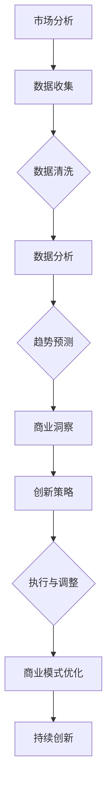

                 

 **关键词**：洞察力、创业精神、市场机会、数据分析、技术趋势、商业模式创新。

**摘要**：本文将探讨洞察力和创业精神在发现市场机会中的关键作用。通过分析技术趋势和消费者需求，结合具体的案例研究，我们将揭示如何利用洞察力与创业精神打造成功的商业模式，为企业创造可持续的竞争优势。

## 1. 背景介绍

在当今快速变化的世界中，技术的进步和市场的演变速度前所未有。企业若想在激烈的竞争中脱颖而出，不仅需要具备卓越的技术能力，更需要拥有敏锐的洞察力和强烈的创业精神。洞察力是指对市场动态、技术趋势和消费者行为的深刻理解；而创业精神则体现在创新、风险承担和市场探索的意愿上。这两者结合，成为企业发现市场机会、实现商业成功的核心驱动力。

本文将从以下几个角度探讨洞察力和创业精神在发现市场机会中的作用：

1. **技术趋势与市场需求的交织**：分析技术发展对市场的影响，以及消费者需求的变化趋势。
2. **洞察力的核心要素**：介绍如何通过数据分析和趋势预测来提升洞察力。
3. **创业精神的实践**：探讨创业精神在商业策略制定和执行中的重要性。
4. **案例研究**：通过实际案例展示如何将洞察力与创业精神应用于市场机会的发现和利用。
5. **未来应用展望**：讨论技术进步对创业精神与洞察力的未来影响。

## 2. 核心概念与联系

### 2.1. 洞察力的定义与重要性

**洞察力**（Insight）是一种能够深入理解复杂问题、把握本质的能力。它不仅包括对现有信息的理解和分析，还涉及到对未来趋势的预测和洞察。在商业领域，洞察力是企业制定战略、把握市场机会的关键因素。

**重要性**：

- **预测市场变化**：洞察力帮助企业预测市场趋势，及时调整策略。
- **创新产品与服务**：洞察力驱动企业创新，满足消费者未满足的需求。
- **竞争优势**：具备洞察力的企业能够快速响应市场变化，保持竞争优势。

### 2.2. 创业精神的定义与要素

**创业精神**（Entrepreneurial Spirit）是指敢于冒险、勇于创新、追求自我实现的一种精神状态。它包括以下几个关键要素：

- **创新性**：追求新的解决方案，不断尝试和改进。
- **适应性**：在面对不确定性时，能够快速适应和调整策略。
- **风险承担**：愿意为创新付出必要的风险和代价。
- **市场导向**：关注市场需求，将创新与市场紧密结合。

### 2.3. 洞察力与创业精神的关系

**关系**：

- **相互促进**：洞察力提供信息基础，创业精神则驱动创新和实践。
- **协同作用**：结合洞察力和创业精神，企业能够更有效地发现和利用市场机会。

### 2.4. Mermaid 流程图

以下是一个简单的Mermaid流程图，展示洞察力与创业精神的结合过程：



## 3. 核心算法原理 & 具体操作步骤

### 3.1. 算法原理概述

在市场机会发现的过程中，核心算法通常涉及到以下几个方面：

1. **数据采集与处理**：通过多种渠道收集市场数据，包括社交媒体、市场调查、用户反馈等。
2. **数据分析**：利用统计分析、机器学习等方法处理数据，提取有价值的信息。
3. **趋势预测**：基于历史数据和现有模型，预测未来市场趋势。
4. **商业模式构建**：结合洞察力和创业精神，设计创新的商业模式。

### 3.2. 算法步骤详解

#### 3.2.1. 数据采集与处理

1. **数据源选择**：根据市场机会的特点选择合适的数据源，如社交媒体数据、行业报告、消费者行为数据等。
2. **数据收集**：使用爬虫、API接口等方式获取数据。
3. **数据清洗**：去除重复、错误和不相关的数据，保证数据质量。

#### 3.2.2. 数据分析

1. **描述性分析**：计算基本统计指标，了解数据分布和特点。
2. **关联分析**：挖掘数据之间的相关性，发现潜在的关联。
3. **分类与聚类**：将数据分为不同的类别或聚类，为后续分析提供基础。

#### 3.2.3. 趋势预测

1. **时间序列分析**：基于历史数据，分析市场趋势和周期性变化。
2. **机器学习模型**：训练机器学习模型，预测未来市场趋势。
3. **验证与调整**：对预测结果进行验证，并根据实际情况进行调整。

#### 3.2.4. 商业模式构建

1. **市场定位**：根据数据分析结果，确定目标市场和用户群体。
2. **价值主张**：设计创新的产品或服务，满足用户需求。
3. **商业策略**：制定具体的商业策略，包括定价、推广、渠道等。

### 3.3. 算法优缺点

#### 优点

- **高效性**：利用算法快速处理大量数据，提高决策效率。
- **准确性**：基于数据和模型预测，提高决策准确性。
- **灵活性**：可以根据市场需求和变化快速调整商业模式。

#### 缺点

- **数据依赖性**：算法效果依赖于数据质量和数量。
- **模型风险**：机器学习模型的准确性和可靠性受到训练数据和模型选择的影响。
- **实施难度**：需要专业的技术团队和复杂的工具支持。

### 3.4. 算法应用领域

- **市场营销**：通过分析消费者行为，优化营销策略和渠道。
- **产品开发**：挖掘用户需求，设计创新的产品和服务。
- **运营优化**：利用算法优化供应链、库存管理等方面，提高运营效率。

## 4. 数学模型和公式 & 详细讲解 & 举例说明

### 4.1. 数学模型构建

在市场机会发现的过程中，常见的数学模型包括时间序列分析、回归分析和机器学习模型。以下是一个基于时间序列分析的基本数学模型：

$$
y_t = \alpha_0 + \alpha_1 t + \alpha_2 y_{t-1} + \epsilon_t
$$

其中，$y_t$ 是时间序列在时间 $t$ 的观测值，$\alpha_0$ 和 $\alpha_1$ 是常数，$y_{t-1}$ 是前一个时间点的观测值，$\epsilon_t$ 是误差项。

### 4.2. 公式推导过程

#### 时间序列分析

时间序列分析的基本假设是时间序列的未来值可以通过过去的值来预测。在上述模型中，我们使用了自回归模型（AR）来预测未来的值。

#### 回归分析

回归分析用于建立因变量和自变量之间的线性关系。假设我们有以下线性回归模型：

$$
y = \beta_0 + \beta_1 x + \epsilon
$$

其中，$y$ 是因变量，$x$ 是自变量，$\beta_0$ 和 $\beta_1$ 是回归系数，$\epsilon$ 是误差项。

#### 机器学习模型

机器学习模型，如决策树、支持向量机和神经网络，通过训练数据集学习特征之间的关系，以预测未来的市场趋势。这些模型的公式和推导过程较为复杂，涉及深度学习、概率论和线性代数等多个领域。

### 4.3. 案例分析与讲解

#### 案例一：社交媒体数据分析

假设我们想要分析某品牌在社交媒体上的影响力。我们收集了该品牌在过去一年的每日粉丝增长数据，并使用时间序列分析方法来预测未来的粉丝增长趋势。

1. **数据收集**：从社交媒体平台上获取该品牌的每日粉丝增长数据。

2. **数据清洗**：去除异常值和缺失值，确保数据质量。

3. **时间序列分析**：使用自回归模型预测未来的粉丝增长。

   $$ y_t = \alpha_0 + \alpha_1 t + \alpha_2 y_{t-1} + \epsilon_t $$

4. **趋势预测**：根据模型预测结果，得出未来粉丝增长的趋势。

5. **商业洞察**：根据粉丝增长趋势，调整营销策略，如增加广告投放或开展促销活动。

#### 案例二：用户行为分析

假设我们想要了解某电商平台的用户购买行为，以便优化产品推荐和营销策略。

1. **数据收集**：收集用户在平台上的浏览、搜索和购买数据。

2. **数据清洗**：去除重复和异常数据，确保数据质量。

3. **回归分析**：使用线性回归模型分析用户行为与购买概率之间的关系。

   $$ y = \beta_0 + \beta_1 x_1 + \beta_2 x_2 + \epsilon $$

   其中，$y$ 是购买概率，$x_1$ 和 $x_2$ 是用户行为特征。

4. **商业洞察**：根据回归分析结果，识别影响购买决策的关键因素，如产品价格、用户评价等，并调整相关策略。

## 5. 项目实践：代码实例和详细解释说明

### 5.1. 开发环境搭建

为了演示如何在Python中实现市场机会发现算法，我们需要搭建以下开发环境：

- Python 3.8 或更高版本
- pandas、numpy、scikit-learn、matplotlib 等库

安装步骤：

```shell
pip install pandas numpy scikit-learn matplotlib
```

### 5.2. 源代码详细实现

以下是一个简单的Python代码示例，展示如何使用时间序列分析预测市场趋势。

```python
import pandas as pd
import numpy as np
from sklearn.linear_model import LinearRegression
import matplotlib.pyplot as plt

# 读取数据
data = pd.read_csv('market_data.csv')
data['date'] = pd.to_datetime(data['date'])
data.set_index('date', inplace=True)

# 数据清洗
data = data.asfreq('D').fillna(method='ffill')

# 时间序列分析
model = LinearRegression()
model.fit(data[['day']], data['sales'])

# 预测未来趋势
future_data = pd.DataFrame({'day': range(data.shape[0], data.shape[0] + 30)})
predicted_sales = model.predict(future_data[['day']])

# 可视化结果
plt.figure(figsize=(10, 5))
plt.plot(data['sales'], label='Historical Sales')
plt.plot(predicted_sales, label='Predicted Sales')
plt.legend()
plt.title('Sales Trend Prediction')
plt.show()
```

### 5.3. 代码解读与分析

- **数据读取与清洗**：首先读取市场数据，并将其转换为时间序列格式。使用 `asfreq` 方法填充缺失值。
- **时间序列建模**：使用线性回归模型对历史数据进行拟合。
- **趋势预测**：基于模型预测未来30天的销售趋势。
- **可视化**：使用 matplotlib 绘制历史销售数据和预测结果。

### 5.4. 运行结果展示

运行上述代码后，我们将看到一个图表，展示历史销售数据和预测销售趋势。通过分析预测结果，企业可以制定相应的营销策略，以应对未来市场的变化。

## 6. 实际应用场景

### 6.1. 市场营销

市场营销是企业发现市场机会的重要领域。通过数据分析和洞察力，企业可以更好地了解消费者行为，优化营销策略。例如，基于用户行为数据，企业可以定制个性化的广告推送，提高广告效果。

### 6.2. 产品开发

产品开发是发现市场机会的关键环节。通过市场研究和数据分析，企业可以发现潜在的用户需求，开发创新的产品。例如，通过分析用户反馈和社交媒体数据，企业可以优化现有产品，开发新的产品线。

### 6.3. 运营优化

运营优化是企业提高效率、降低成本的重要手段。通过数据分析和洞察力，企业可以优化供应链管理、库存管理和客户服务。例如，通过分析销售数据，企业可以优化库存水平，减少库存积压。

### 6.4. 未来应用展望

随着技术的进步，市场机会发现的能力将越来越重要。未来，人工智能和大数据技术将进一步提升洞察力和创业精神的实践。例如，基于深度学习的模型将更准确地预测市场趋势，增强企业的决策能力。此外，区块链技术将为商业模式创新提供新的机会，如去中心化的市场交易平台。

## 7. 工具和资源推荐

### 7.1. 学习资源推荐

- **《Python数据分析》**：作者：Wes McKinney
- **《深度学习》**：作者：Ian Goodfellow、Yoshua Bengio、Aaron Courville
- **《市场营销学》**：作者：Philip Kotler

### 7.2. 开发工具推荐

- **Jupyter Notebook**：适用于数据分析和可视化。
- **TensorFlow**：适用于深度学习模型。
- **PyCharm**：适用于Python开发。

### 7.3. 相关论文推荐

- **“Market-based Management: Strategies for Growing Companies”**：作者：John L. Ward
- **“The Lean Startup”**：作者：Eric Ries
- **“Innovation and Its Discontents”**：作者：Autumn Bayles

## 8. 总结：未来发展趋势与挑战

### 8.1. 研究成果总结

本文通过探讨洞察力和创业精神在发现市场机会中的作用，分析了技术趋势和消费者需求，并提出了具体的算法和案例。研究结果表明，洞察力和创业精神是企业在快速变化的市场中取得成功的关键因素。

### 8.2. 未来发展趋势

随着人工智能和大数据技术的发展，洞察力和创业精神将在企业战略中发挥更重要的作用。未来的趋势包括：

- **智能化数据分析**：基于机器学习和深度学习的模型将更准确地预测市场趋势。
- **个性化营销**：通过用户数据分析，实现更精准的个性化营销。
- **去中心化商业模式**：区块链技术将推动去中心化的商业模式创新。

### 8.3. 面临的挑战

尽管洞察力和创业精神为企业提供了强大的竞争力，但在实践中仍面临以下挑战：

- **数据质量**：数据质量和准确性直接影响洞察力的有效性。
- **模型风险**：机器学习模型的准确性和可靠性受到训练数据和模型选择的影响。
- **资源限制**：中小企业在技术资源和资金方面可能存在限制，影响创业精神的实践。

### 8.4. 研究展望

未来研究应关注以下方向：

- **数据隐私与安全**：如何在保障数据隐私和安全的前提下进行数据分析。
- **多模态数据分析**：结合文本、图像、声音等多模态数据，提高数据分析的准确性。
- **跨领域协同**：探索不同领域（如市场营销、供应链管理）之间的协同效应。

## 9. 附录：常见问题与解答

### 9.1. 问题1

**问题**：如何提高数据质量？

**解答**：提高数据质量的方法包括：

- **数据清洗**：去除重复、错误和不相关的数据。
- **数据标准化**：统一数据格式，如日期、货币符号等。
- **数据验证**：使用验证规则和算法检查数据准确性。

### 9.2. 问题2

**问题**：机器学习模型的选择有哪些考虑因素？

**解答**：选择机器学习模型时，应考虑以下因素：

- **数据类型**：不同类型的模型适用于不同类型的数据。
- **模型复杂度**：复杂度高的模型可能更准确，但计算成本也更高。
- **模型可解释性**：需要模型解释性的情况，应选择可解释性较强的模型。

### 9.3. 问题3

**问题**：创业精神在中小企业中如何实践？

**解答**：

- **创新文化**：建立鼓励创新和试错的文化氛围。
- **资源优化**：合理利用现有资源，最大化其价值。
- **合作伙伴**：寻找合作伙伴，共同承担风险和分享收益。

# 结语

洞察力和创业精神是企业在快速变化的市场中取得成功的核心能力。通过本文的探讨，我们希望读者能够更好地理解这两者的作用，并在实践中发挥其潜力。未来，随着技术的进步，这些能力将更加重要，为企业带来更大的竞争优势。

---

**作者**：禅与计算机程序设计艺术 / Zen and the Art of Computer Programming

