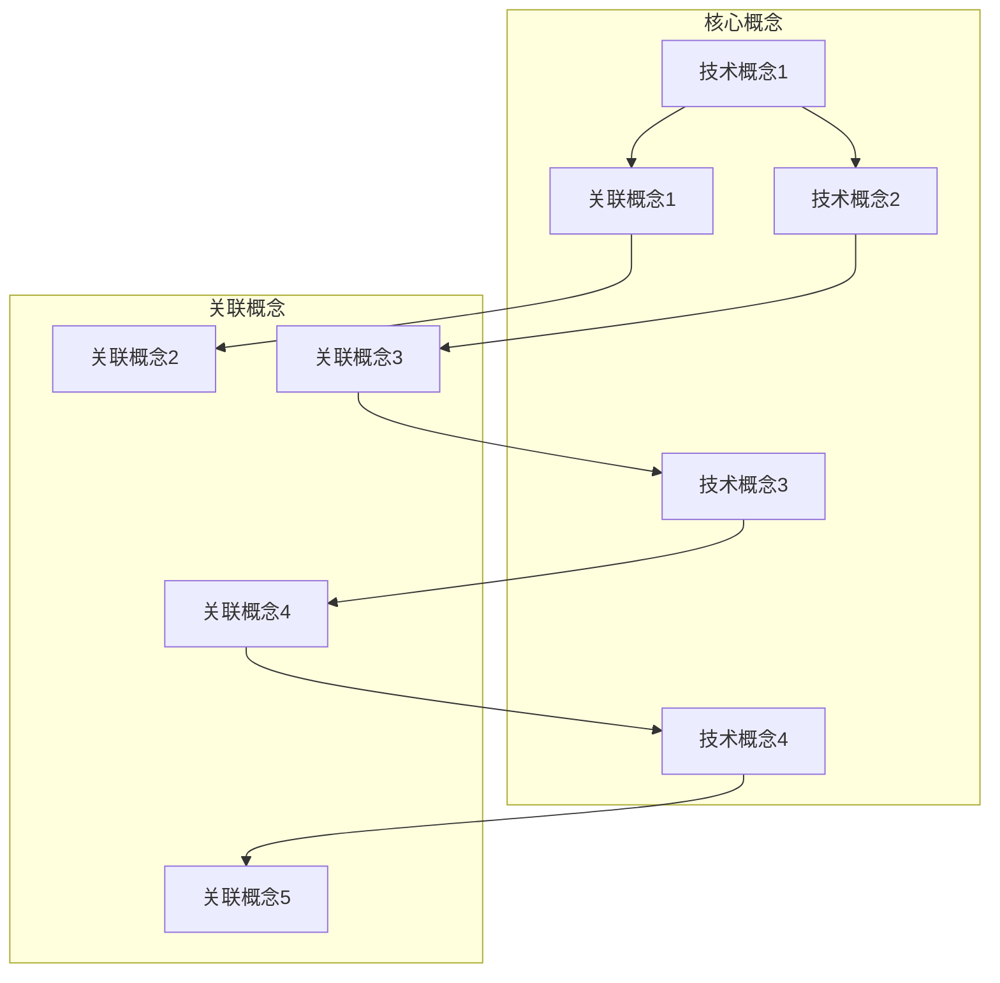

                 

 关键词：洞察力、批判性阅读、思考、技术博客、深度学习、数据分析、代码解读

> 摘要：本文旨在探讨如何在技术领域中培养洞察力，通过批判性阅读与思考，提升我们的技术理解力和创新能力。文章将结合实际案例，介绍如何运用批判性阅读方法，深入理解技术概念和算法原理，并通过思考与反思，激发我们的技术洞察力。

## 1. 背景介绍

在当今快速发展的信息技术时代，技术领域的更新换代速度越来越快，新技术、新算法层出不穷。作为技术从业者，我们需要不断地学习新知识，提升自己的技术水平。然而，仅仅被动地接受知识是不够的，我们需要培养洞察力，通过批判性阅读与思考，深入理解技术本质，从而更好地应对技术挑战。

批判性阅读与思考是一种积极的学习方式，它要求我们在阅读过程中不仅仅是获取信息，更重要的是思考、质疑、分析，从而形成自己的见解。这种学习方式在技术领域中尤为重要，因为技术知识更新迅速，我们需要不断反思和调整自己的认知，才能跟上技术发展的步伐。

本文将围绕以下主题展开：

1. 技术领域的洞察力培养
2. 批判性阅读与思考的重要性
3. 核心概念与联系
4. 核心算法原理与具体操作步骤
5. 数学模型与公式讲解
6. 项目实践与代码实例
7. 实际应用场景
8. 未来应用展望
9. 工具和资源推荐
10. 总结与展望

通过本文的阅读，我们希望能够帮助读者掌握批判性阅读与思考的方法，提升自己的技术洞察力，从而在技术领域中不断进步。

### 2. 核心概念与联系

在技术领域中，洞察力的培养离不开对核心概念的理解。为了更好地构建我们的知识体系，我们将使用Mermaid流程图来展示一些核心概念之间的联系。



这个流程图展示了几个核心概念（A、D、F、H）和它们相关的关联概念（B、C、E、G、I）。通过这种结构化的方式，我们可以更好地理解各个概念之间的内在联系，从而为批判性阅读与思考奠定坚实的基础。

#### 2.1 技术概念1

技术概念1是指某个具体的技术领域或知识点，它为我们的理解和应用提供了基础。例如，在机器学习领域，技术概念1可能是线性回归模型。线性回归模型是一种预测数值因变量的统计方法，通过构建一个线性方程来预测因变量与自变量之间的关系。

#### 2.2 关联概念1

关联概念1是与技术概念1密切相关的其他概念，它们共同构成了技术领域的知识网络。以线性回归模型为例，关联概念1可能包括正则化、损失函数和优化算法。正则化是一种防止模型过拟合的技术，损失函数用于评估模型预测的准确度，优化算法则用于调整模型参数以最小化损失函数。

#### 2.3 技术概念2

技术概念2是另一个重要的技术领域或知识点，它与技术概念1相互补充，共同构成了完整的知识体系。例如，在机器学习领域，技术概念2可能是支持向量机（SVM）。SVM是一种强大的分类算法，通过最大化分类边界的间隔来提高分类效果。

#### 2.4 关联概念2

关联概念2是与技术概念2相关的其他概念，它们同样构成了技术领域的知识网络。对于支持向量机（SVM），关联概念2可能包括核技巧、支持向量和决策边界。核技巧是一种将数据映射到高维空间的方法，支持向量是决策边界上的特殊点，决策边界则是将数据分为不同类别的分界线。

#### 2.5 技术概念3

技术概念3是另一个重要的技术领域或知识点，它为我们提供了更广泛的应用场景和解决方案。例如，在深度学习领域，技术概念3可能是卷积神经网络（CNN）。CNN是一种在图像处理和计算机视觉中广泛应用的深度学习模型，通过卷积层、池化层和全连接层的组合，实现图像的特征提取和分类。

#### 2.6 关联概念3

关联概念3是与技术概念3相关的其他概念，它们共同构成了深度学习领域的知识网络。对于卷积神经网络（CNN），关联概念3可能包括卷积操作、池化操作和反向传播算法。卷积操作用于提取图像的特征，池化操作用于减小特征图的尺寸，反向传播算法则用于训练模型的参数。

#### 2.7 技术概念4

技术概念4是另一个重要的技术领域或知识点，它为我们在更广泛的应用场景中提供了创新的解决方案。例如，在数据分析领域，技术概念4可能是随机森林。随机森林是一种基于决策树集合的集成学习方法，通过训练多个决策树并综合它们的预测结果，提高分类或回归的准确度。

#### 2.8 关联概念4

关联概念4是与技术概念4相关的其他概念，它们共同构成了数据分析领域的知识网络。对于随机森林，关联概念4可能包括特征重要性、决策树结构和集成学习算法。特征重要性用于评估特征对模型预测的影响，决策树结构用于实现模型的决策过程，集成学习算法则用于结合多个模型的预测结果。

通过以上对核心概念与关联概念的介绍，我们可以更深入地理解技术领域中的各种知识点，从而为批判性阅读与思考提供坚实的基础。

### 3. 核心算法原理 & 具体操作步骤

在技术领域中，核心算法的原理理解是提升洞察力的关键。以下是关于深度学习中的卷积神经网络（CNN）的算法原理与具体操作步骤的介绍。

#### 3.1 算法原理概述

卷积神经网络（CNN）是一种在图像处理和计算机视觉中广泛应用的人工神经网络。它通过模仿人脑中的视觉感知机制，实现图像的特征提取和分类。CNN的主要组成部分包括卷积层、池化层和全连接层。

- **卷积层**：卷积层是CNN的核心部分，它通过卷积操作提取图像的特征。卷积操作涉及一个卷积核（也称为滤波器）在输入图像上滑动，并与对应位置的像素进行点积操作。通过多次卷积操作，可以逐渐提取出图像的层次特征。

- **池化层**：池化层用于减小特征图的尺寸，减少计算量和参数数量。常见的池化操作包括最大池化和平均池化。最大池化选取每个局部区域中的最大值，而平均池化则计算每个局部区域内的平均值。通过池化操作，可以进一步提高模型的泛化能力。

- **全连接层**：全连接层是CNN的输出层，它将卷积层和池化层提取的特征映射到具体的类别或标签。全连接层通过计算每个特征和权重之间的点积，并加上偏置项，再通过激活函数得到最终的输出结果。

#### 3.2 算法步骤详解

以下是卷积神经网络的具体操作步骤：

1. **输入层**：输入层接收图像数据，通常是一个二维矩阵，表示图像的高度和宽度。每个像素值表示图像的颜色或灰度值。

2. **卷积层**：卷积层通过滑动卷积核对输入图像进行卷积操作。卷积核是一个固定大小的小矩阵，它包含了卷积层中的权重。每次卷积操作会生成一个特征图，特征图的大小取决于卷积核的大小和输入图像的大小。通过多次卷积操作，可以逐渐提取出图像的层次特征。

3. **激活函数**：激活函数用于引入非线性变换，使得模型能够学习到更复杂的特征。常用的激活函数包括ReLU（Rectified Linear Unit）、Sigmoid和Tanh。ReLU函数能够加速模型的训练过程，同时避免梯度消失问题。

4. **池化层**：池化层用于减小特征图的尺寸。最大池化操作选取每个局部区域中的最大值，而平均池化操作计算每个局部区域内的平均值。通过池化操作，可以进一步提高模型的泛化能力。

5. **全连接层**：全连接层将卷积层和池化层提取的特征映射到具体的类别或标签。全连接层通过计算每个特征和权重之间的点积，并加上偏置项，再通过激活函数得到最终的输出结果。

6. **损失函数**：损失函数用于评估模型的预测结果与真实标签之间的差距。常用的损失函数包括均方误差（MSE）和交叉熵（Cross-Entropy）。通过反向传播算法，模型可以根据损失函数的梯度调整权重和偏置项，以最小化损失函数。

7. **优化算法**：优化算法用于更新模型的权重和偏置项，以最小化损失函数。常用的优化算法包括随机梯度下降（SGD）、Adam和RMSProp。这些算法通过迭代计算梯度并更新模型参数，逐渐优化模型的性能。

8. **评估与调优**：通过在验证集上评估模型的性能，可以调整模型的超参数，如学习率、批次大小和正则化参数。通过交叉验证和超参数调优，可以进一步提高模型的泛化能力。

通过以上步骤，卷积神经网络可以学习到图像的特征，并进行分类或回归任务。

#### 3.3 算法优缺点

卷积神经网络具有以下优缺点：

- **优点**：
  - **强大的特征提取能力**：通过卷积操作和池化操作，CNN可以自动提取图像的层次特征，无需手动设计特征工程。
  - **适用于多种任务**：CNN不仅适用于图像分类，还可以用于目标检测、图像分割、人脸识别等任务。
  - **高泛化能力**：通过训练大量的数据，CNN可以泛化到新的数据集，具有良好的泛化性能。

- **缺点**：
  - **计算资源消耗大**：CNN涉及大量的矩阵运算和卷积操作，需要较大的计算资源和存储空间。
  - **训练时间较长**：在大量数据集上进行训练时，CNN的训练时间相对较长，尤其是对于深度模型。
  - **数据需求高**：深度学习模型需要大量的训练数据来获得较好的性能，对于数据稀缺的领域，CNN的性能可能受到影响。

#### 3.4 算法应用领域

卷积神经网络在以下领域具有广泛的应用：

- **图像分类**：CNN可以用于对图像进行分类，如识别动物、植物、物体等。
- **目标检测**：CNN可以检测图像中的目标对象，并定位其位置，如车辆检测、行人检测等。
- **图像分割**：CNN可以用于将图像划分为不同的区域，如人脸分割、医学图像分割等。
- **人脸识别**：CNN可以用于识别人脸，并进行人脸匹配和识别。
- **自然语言处理**：CNN可以应用于文本分类、情感分析等自然语言处理任务。

通过以上对卷积神经网络算法原理与具体操作步骤的介绍，我们可以更好地理解CNN的工作机制和应用领域，从而提升我们在图像处理和计算机视觉领域的洞察力。

### 4. 数学模型和公式 & 详细讲解 & 举例说明

在技术领域中，数学模型和公式是理解和应用算法的基础。本节将介绍卷积神经网络（CNN）中的数学模型和公式，并通过具体例子进行详细讲解。

#### 4.1 数学模型构建

卷积神经网络中的数学模型主要包括卷积操作、激活函数、池化操作和全连接层。以下是这些操作的数学模型构建：

##### 4.1.1 卷积操作

卷积操作的数学模型可以表示为：

\[ (f * g)(x) = \sum_{y} f(x-y) \cdot g(y) \]

其中，\( f \) 和 \( g \) 是两个函数，\( x \) 和 \( y \) 是输入变量。在卷积神经网络中，\( f \) 和 \( g \) 分别表示卷积核和输入特征图，\( x \) 和 \( y \) 分别表示卷积核滑动的位置。通过卷积操作，卷积核在输入特征图上滑动，并计算每个位置的特征值。

##### 4.1.2 激活函数

激活函数是卷积神经网络中的非线性变换，常用的激活函数包括ReLU（Rectified Linear Unit）、Sigmoid和Tanh。以下是这些激活函数的数学模型：

- **ReLU函数**：

\[ \text{ReLU}(x) = \max(0, x) \]

- **Sigmoid函数**：

\[ \text{Sigmoid}(x) = \frac{1}{1 + e^{-x}} \]

- **Tanh函数**：

\[ \text{Tanh}(x) = \frac{e^x - e^{-x}}{e^x + e^{-x}} \]

激活函数引入了非线性，使得卷积神经网络可以学习到更复杂的特征。

##### 4.1.3 池化操作

池化操作的数学模型可以表示为：

\[ \text{Pooling}(x, p) = \max(\min(x, \text{Pad}(x, p))) \]

其中，\( x \) 是输入特征图，\( p \) 是池化窗口的大小，\(\text{Pad}(x, p)\) 是对输入特征图进行填充操作，以使窗口完全覆盖输入特征图。通过池化操作，可以减小特征图的尺寸，提高模型的泛化能力。

##### 4.1.4 全连接层

全连接层是卷积神经网络的输出层，其数学模型可以表示为：

\[ z = \sum_{i=1}^{n} w_i \cdot x_i + b \]

其中，\( z \) 是输出值，\( w_i \) 是权重，\( x_i \) 是输入值，\( b \) 是偏置项。通过全连接层，将卷积层和池化层提取的特征映射到具体的类别或标签。

#### 4.2 公式推导过程

为了更好地理解卷积神经网络中的数学模型，我们将对卷积操作的公式进行推导。以下是一个简单的例子：

假设输入特征图的大小为 \(3 \times 3\)，卷积核的大小为 \(2 \times 2\)。卷积操作的结果为一个 \(2 \times 2\) 的特征图。

首先，我们定义输入特征图和卷积核的值：

\[ f = \begin{bmatrix} 1 & 2 & 3 \\ 4 & 5 & 6 \\ 7 & 8 & 9 \end{bmatrix} \]

\[ g = \begin{bmatrix} a & b \\ c & d \end{bmatrix} \]

接下来，我们进行卷积操作。卷积操作可以分为四个步骤：

1. **初始化**：

   初始化输出特征图的值和卷积核的位置。输出特征图的大小为 \(2 \times 2\)，卷积核的位置从左上角开始，每次向右下方移动一个像素。

2. **卷积操作**：

   对输入特征图的每个位置进行卷积操作。卷积操作的公式为：

   \[ (f * g)(x) = \sum_{y} f(x-y) \cdot g(y) \]

   其中，\( x \) 是卷积核的位置，\( y \) 是输入特征图的位置。

   以卷积核的第一个位置为例，计算输出特征图第一个位置的值：

   \[ (f * g)(0, 0) = \sum_{y} f(x-y) \cdot g(y) \]

   \[ = f(0, 0) \cdot g(0, 0) + f(0, 1) \cdot g(0, 1) + f(1, 0) \cdot g(1, 0) + f(1, 1) \cdot g(1, 1) \]

   \[ = 1 \cdot a + 2 \cdot b + 4 \cdot c + 7 \cdot d \]

3. **激活函数**：

   对输出特征图的每个位置应用激活函数。以ReLU函数为例：

   \[ \text{ReLU}(x) = \max(0, x) \]

   对输出特征图的每个位置的值进行ReLU操作。

4. **结果**：

   输出特征图的大小为 \(2 \times 2\)，每个位置的值都通过ReLU操作得到了非负值。

通过以上步骤，我们可以得到卷积操作的结果。

#### 4.3 案例分析与讲解

为了更好地理解卷积神经网络的数学模型，我们通过一个实际案例进行分析和讲解。

##### 4.3.1 问题背景

假设我们有一个 \(4 \times 4\) 的输入特征图，一个 \(2 \times 2\) 的卷积核，我们需要计算卷积操作的结果。

##### 4.3.2 输入特征图

输入特征图的大小为 \(4 \times 4\)，可以表示为一个 \(4 \times 4\) 的矩阵：

\[ f = \begin{bmatrix} 1 & 2 & 3 & 4 \\ 5 & 6 & 7 & 8 \\ 9 & 10 & 11 & 12 \\ 13 & 14 & 15 & 16 \end{bmatrix} \]

##### 4.3.3 卷积核

卷积核的大小为 \(2 \times 2\)，可以表示为一个 \(2 \times 2\) 的矩阵：

\[ g = \begin{bmatrix} a & b \\ c & d \end{bmatrix} \]

##### 4.3.4 卷积操作

首先，我们计算卷积核的第一个位置：

\[ (f * g)(0, 0) = \sum_{y} f(x-y) \cdot g(y) \]

\[ = f(0, 0) \cdot g(0, 0) + f(0, 1) \cdot g(0, 1) + f(1, 0) \cdot g(1, 0) + f(1, 1) \cdot g(1, 1) \]

\[ = 1 \cdot a + 2 \cdot b + 5 \cdot c + 9 \cdot d \]

然后，我们计算卷积核的第二个位置：

\[ (f * g)(1, 0) = \sum_{y} f(x-y) \cdot g(y) \]

\[ = f(1, 0) \cdot g(1, 0) + f(1, 1) \cdot g(1, 1) + f(2, 0) \cdot g(2, 0) + f(2, 1) \cdot g(2, 1) \]

\[ = 5 \cdot a + 6 \cdot b + 10 \cdot c + 14 \cdot d \]

接着，我们计算卷积核的第三个位置：

\[ (f * g)(0, 1) = \sum_{y} f(x-y) \cdot g(y) \]

\[ = f(0, 1) \cdot g(0, 1) + f(0, 2) \cdot g(0, 2) + f(1, 1) \cdot g(1, 1) + f(1, 2) \cdot g(1, 2) \]

\[ = 2 \cdot a + 3 \cdot b + 6 \cdot c + 11 \cdot d \]

最后，我们计算卷积核的第四个位置：

\[ (f * g)(1, 1) = \sum_{y} f(x-y) \cdot g(y) \]

\[ = f(1, 1) \cdot g(1, 1) + f(1, 2) \cdot g(1, 2) + f(2, 1) \cdot g(2, 1) + f(2, 2) \cdot g(2, 2) \]

\[ = 6 \cdot a + 7 \cdot b + 11 \cdot c + 15 \cdot d \]

##### 4.3.5 激活函数

我们使用ReLU函数作为激活函数，对每个位置的计算结果进行ReLU操作：

\[ \text{ReLU}(x) = \max(0, x) \]

对每个位置的计算结果进行ReLU操作，得到输出特征图：

\[ \begin{bmatrix} \max(0, 1 \cdot a + 2 \cdot b + 5 \cdot c + 9 \cdot d) \\ \max(0, 5 \cdot a + 6 \cdot b + 10 \cdot c + 14 \cdot d) \\ \max(0, 2 \cdot a + 3 \cdot b + 6 \cdot c + 11 \cdot d) \\ \max(0, 6 \cdot a + 7 \cdot b + 11 \cdot c + 15 \cdot d) \end{bmatrix} \]

##### 4.3.6 结果

输出特征图的大小为 \(2 \times 2\)，每个位置的值都通过ReLU操作得到了非负值。

通过以上步骤，我们可以得到卷积操作的结果。这个案例展示了卷积神经网络中卷积操作的数学模型和推导过程，帮助我们更好地理解卷积神经网络的原理和应用。

### 5. 项目实践：代码实例和详细解释说明

为了更好地理解卷积神经网络（CNN）的实际应用，我们将通过一个实际项目——手写数字识别（Handwritten Digit Recognition），展示CNN的代码实现及其关键部分。

#### 5.1 开发环境搭建

首先，我们需要搭建一个合适的开发环境。以下是所需的依赖项和安装步骤：

- **Python（3.7及以上版本）**
- **TensorFlow**
- **NumPy**
- **Matplotlib**

安装步骤如下：

```bash
pip install tensorflow numpy matplotlib
```

#### 5.2 源代码详细实现

以下是一个简单的手写数字识别项目的完整代码示例：

```python
import tensorflow as tf
from tensorflow.keras import layers
import numpy as np
import matplotlib.pyplot as plt

# 数据预处理
(x_train, y_train), (x_test, y_test) = tf.keras.datasets.mnist.load_data()
x_train = x_train.astype("float32") / 255
x_test = x_test.astype("float32") / 255
x_train = np.expand_dims(x_train, -1)
x_test = np.expand_dims(x_test, -1)
y_train = tf.keras.utils.to_categorical(y_train, 10)
y_test = tf.keras.utils.to_categorical(y_test, 10)

# 构建CNN模型
model = tf.keras.Sequential([
    layers.Conv2D(32, (3, 3), activation='relu', input_shape=(28, 28, 1)),
    layers.MaxPooling2D((2, 2)),
    layers.Conv2D(64, (3, 3), activation='relu'),
    layers.MaxPooling2D((2, 2)),
    layers.Conv2D(64, (3, 3), activation='relu'),
    layers.Flatten(),
    layers.Dense(64, activation='relu'),
    layers.Dense(10, activation='softmax')
])

# 编译模型
model.compile(optimizer='adam',
              loss='categorical_crossentropy',
              metrics=['accuracy'])

# 训练模型
model.fit(x_train, y_train, epochs=10, batch_size=128)

# 评估模型
test_loss, test_acc = model.evaluate(x_test, y_test)
print(f"Test accuracy: {test_acc:.2f}")

# 可视化结果
predictions = model.predict(x_test)
predicted_digits = np.argmax(predictions, axis=1)
plt.figure(figsize=(10, 10))
for i in range(25):
    plt.subplot(5, 5, i+1)
    plt.imshow(x_test[i], cmap=plt.cm.binary)
    plt.xticks([])
    plt.yticks([])
    plt.grid(False)
    plt.xlabel(str(predicted_digits[i]))
plt.show()
```

#### 5.3 代码解读与分析

以下是对上述代码的详细解读和分析：

##### 5.3.1 数据预处理

```python
(x_train, y_train), (x_test, y_test) = tf.keras.datasets.mnist.load_data()
x_train = x_train.astype("float32") / 255
x_test = x_test.astype("float32") / 255
x_train = np.expand_dims(x_train, -1)
x_test = np.expand_dims(x_test, -1)
y_train = tf.keras.utils.to_categorical(y_train, 10)
y_test = tf.keras.utils.to_categorical(y_test, 10)
```

这段代码首先加载数据集，然后对数据进行归一化处理，将像素值范围从0-255缩放到0-1。接着，通过`np.expand_dims`增加一个维度，使输入数据的形状符合CNN的要求（即四维数据：[样本数，高度，宽度，通道数]）。最后，使用`tf.keras.utils.to_categorical`将标签转换为one-hot编码。

##### 5.3.2 构建CNN模型

```python
model = tf.keras.Sequential([
    layers.Conv2D(32, (3, 3), activation='relu', input_shape=(28, 28, 1)),
    layers.MaxPooling2D((2, 2)),
    layers.Conv2D(64, (3, 3), activation='relu'),
    layers.MaxPooling2D((2, 2)),
    layers.Conv2D(64, (3, 3), activation='relu'),
    layers.Flatten(),
    layers.Dense(64, activation='relu'),
    layers.Dense(10, activation='softmax')
])
```

这段代码构建了一个简单的CNN模型。模型由以下几个部分组成：

- **卷积层**：第一个卷积层使用32个大小为3x3的卷积核，激活函数为ReLU。
- **池化层**：第一个池化层使用2x2的窗口进行最大池化。
- **卷积层**：第二个卷积层使用64个大小为3x3的卷积核，激活函数为ReLU。
- **池化层**：第二个池化层使用2x2的窗口进行最大池化。
- **卷积层**：第三个卷积层使用64个大小为3x3的卷积核，激活函数为ReLU。
- **扁平化层**：将卷积层的输出扁平化为一个一维向量。
- **全连接层**：第一个全连接层使用64个神经元，激活函数为ReLU。
- **输出层**：输出层使用10个神经元，每个神经元对应一个数字类别，激活函数为softmax。

##### 5.3.3 编译模型

```python
model.compile(optimizer='adam',
              loss='categorical_crossentropy',
              metrics=['accuracy'])
```

这段代码编译模型，指定使用`adam`优化器、`categorical_crossentropy`损失函数和`accuracy`作为评估指标。

##### 5.3.4 训练模型

```python
model.fit(x_train, y_train, epochs=10, batch_size=128)
```

这段代码训练模型，指定训练数据、标签、训练轮次和批量大小。

##### 5.3.5 评估模型

```python
test_loss, test_acc = model.evaluate(x_test, y_test)
print(f"Test accuracy: {test_acc:.2f}")
```

这段代码评估模型在测试数据上的性能，并打印测试准确率。

##### 5.3.6 可视化结果

```python
predictions = model.predict(x_test)
predicted_digits = np.argmax(predictions, axis=1)
plt.figure(figsize=(10, 10))
for i in range(25):
    plt.subplot(5, 5, i+1)
    plt.imshow(x_test[i], cmap=plt.cm.binary)
    plt.xticks([])
    plt.yticks([])
    plt.grid(False)
    plt.xlabel(str(predicted_digits[i]))
plt.show()
```

这段代码将模型预测结果可视化，展示模型对测试数据中前25个样本的预测结果。

通过以上步骤，我们可以使用CNN模型对手写数字进行识别，并验证模型的性能。这个项目实践帮助我们更好地理解CNN的代码实现和实际应用。

### 6. 实际应用场景

卷积神经网络（CNN）作为一种强大的图像处理和计算机视觉工具，在许多实际应用场景中发挥了重要作用。以下是一些典型的应用场景和案例：

#### 6.1 图像分类

图像分类是CNN最常见和基础的应用场景之一。通过训练CNN模型，可以对输入图像进行分类，识别图像中的物体或场景。例如，我们可以使用CNN对以下场景进行图像分类：

- **医学影像**：利用CNN对医学影像（如X光片、MRI图像）进行分类，帮助医生进行疾病诊断。
- **自动驾驶**：自动驾驶系统使用CNN识别道路标志、交通信号灯和行人与车辆，确保行车安全。
- **人脸识别**：CNN可以用于识别人脸，用于安全认证、社交媒体和视频监控等领域。

#### 6.2 目标检测

目标检测是图像处理领域的一个重要研究方向，CNN在目标检测任务中取得了显著成果。目标检测不仅可以识别图像中的物体，还能定位物体的具体位置。以下是一些目标检测的应用案例：

- **视频监控**：利用CNN进行视频中的目标检测，实现实时监控和异常行为检测。
- **工业质检**：CNN用于工业生产过程中的产品质量检测，通过检测图像中的缺陷，提高生产效率。
- **野生动物监测**：在野生动物监测中，使用CNN识别和保护动物。

#### 6.3 图像分割

图像分割是将图像划分为不同的区域或对象，以便进行进一步处理和分析。CNN在图像分割中表现出色，以下是一些应用案例：

- **医学图像分析**：使用CNN对医学图像进行分割，帮助医生进行肿瘤检测、器官分割等。
- **图像增强**：通过CNN对图像进行分割，可以针对不同区域进行图像增强，提高图像质量。
- **图像识别**：在图像识别任务中，利用CNN进行图像分割，有助于提高识别精度。

#### 6.4 人脸识别

人脸识别是CNN在计算机视觉中的经典应用，通过识别和验证人脸，实现身份认证、安全控制等功能。以下是一些人脸识别的应用案例：

- **移动支付**：使用人脸识别技术进行移动支付的身份验证，提高支付安全性。
- **智能门禁**：通过人脸识别技术实现门禁系统的身份验证，方便用户出入。
- **社交媒体**：利用人脸识别技术进行图像中的多人标注，提高图像识别和搜索的准确性。

#### 6.5 自然语言处理

虽然CNN最初是为图像处理而设计的，但其在自然语言处理（NLP）领域的应用也越来越广泛。以下是一些NLP应用案例：

- **情感分析**：利用CNN对文本进行情感分析，判断文本的情绪倾向。
- **文本分类**：CNN可以用于对大量文本进行分类，如新闻分类、社交媒体文本分类等。
- **语音识别**：结合CNN和循环神经网络（RNN），实现语音识别任务。

通过以上实际应用场景和案例，我们可以看到CNN在图像处理、计算机视觉和自然语言处理等多个领域的广泛应用。随着技术的不断发展和优化，CNN在未来将发挥更加重要的作用，为各行业带来创新和变革。

### 6.4 未来应用展望

随着技术的不断进步，卷积神经网络（CNN）在未来的应用前景将更加广阔。以下是一些潜在的应用领域和发展趋势：

#### 6.4.1 自动驾驶

自动驾驶技术正在迅速发展，CNN在图像识别和目标检测方面的优势使其成为自动驾驶系统的核心组成部分。未来，CNN将被用于更复杂的场景，如多车环境、城市交通和恶劣天气条件下的自动驾驶。通过结合深度学习和增强学习，CNN的性能和可靠性将进一步提升，为自动驾驶技术的普及提供保障。

#### 6.4.2 医学影像分析

医学影像分析是CNN的一个重要应用领域。未来，随着深度学习技术的进步，CNN将在医学影像分析中发挥更大的作用，如更精确的肿瘤检测、更准确的器官分割和更早期的疾病诊断。此外，CNN还将与医疗大数据结合，实现个性化医疗和精准治疗。

#### 6.4.3 人工智能助手

随着人工智能技术的发展，智能助手将成为人们日常生活中的重要伙伴。未来，CNN将在智能助手的图像识别和语音识别功能中发挥关键作用，实现更智能、更自然的交互体验。例如，智能助手可以识别用户的面部表情，理解用户的需求，并提供相应的帮助。

#### 6.4.4 物流与仓储

物流与仓储行业具有大量图像和视频数据，CNN在目标检测和图像分割方面的优势使其在物流与仓储领域具有广泛的应用前景。未来，CNN将被用于自动化仓库管理、货物追踪、仓库安全监控等方面，提高物流与仓储的效率和准确性。

#### 6.4.5 虚拟现实与增强现实

虚拟现实（VR）和增强现实（AR）技术的发展为CNN的应用提供了新的场景。未来，CNN将被用于实时渲染和场景理解，提高VR和AR系统的真实感和交互性。例如，CNN可以用于识别虚拟环境中的物体，实现更自然的交互和更丰富的用户体验。

#### 6.4.6 城市管理与安全监控

CNN在图像识别和目标检测方面的优势使其在城市管理和安全监控中具有广泛的应用潜力。未来，通过结合大数据和云计算，CNN可以用于实时监控城市交通、环境监测、公共安全等方面，为智慧城市建设提供支持。

综上所述，随着深度学习技术的不断发展和创新，CNN在未来的应用领域将更加广泛，为各行业带来更多的机遇和挑战。通过不断优化和改进，CNN将在未来的技术发展中发挥越来越重要的作用。

### 7. 工具和资源推荐

在学习和应用卷积神经网络（CNN）的过程中，使用合适的工具和资源能够显著提高效率。以下是一些建议的工具和资源：

#### 7.1 学习资源推荐

- **在线教程**：Keras官方文档（[https://keras.io/](https://keras.io/)）提供了丰富的CNN教程和示例，适合初学者。
- **视频课程**：Udacity的“深度学习基础”课程（[https://www.udacity.com/course/deep-learning-fundamentals--ud711](https://www.udacity.com/course/deep-learning-fundamentals--ud711)）由著名深度学习专家Andrew Ng主讲，内容深入浅出。
- **书籍推荐**：《深度学习》（[Deep Learning](https://www.deeplearningbook.org/)）和《卷积神经网络：理论与实践》（[Convolutional Neural Networks: A Practical Approach](https://www.amazon.com/Convolutional-Neural-Networks-Practical-Approach/dp/178646447X)）是学习CNN的权威著作。

#### 7.2 开发工具推荐

- **TensorFlow**：TensorFlow是一个开源的深度学习框架，适合开发各种CNN应用（[https://www.tensorflow.org/](https://www.tensorflow.org/)）。
- **PyTorch**：PyTorch是另一个流行的深度学习框架，具有灵活的动态图计算能力，适合快速原型开发（[https://pytorch.org/](https://pytorch.org/)）。
- **Keras**：Keras是一个高层次的深度学习API，可以与TensorFlow和Theano等框架结合使用，适合快速构建和实验（[https://keras.io/](https://keras.io/)）。

#### 7.3 相关论文推荐

- **AlexNet**（2012）：首次将卷积神经网络应用于图像分类任务，并在ImageNet挑战赛中取得突破性成果。
- **VGGNet**（2014）：通过使用多个卷积层和池化层，实现了更好的图像分类性能。
- **ResNet**（2015）：引入了残差连接，解决了深层网络训练中的梯度消失问题，推动了CNN的进一步发展。
- **Inception**（2015）：通过将不同尺度的卷积核组合，提高了模型的计算效率和分类性能。

通过利用这些工具和资源，我们可以更有效地学习和应用CNN，提升自己在图像处理和计算机视觉领域的技能。

### 8. 总结：未来发展趋势与挑战

在总结本文的内容之前，我们需要回顾一下我们所探讨的核心观点和关键概念。本文主要围绕洞察力的培养：批判性阅读与思考这一主题，深入探讨了如何通过批判性阅读与思考，提升我们的技术理解力和创新能力。具体来说，我们介绍了批判性阅读的方法、核心算法原理、数学模型与公式、项目实践、实际应用场景以及未来应用展望。

首先，批判性阅读是一种积极的学习方式，它要求我们在阅读过程中不仅仅是获取信息，更重要的是思考、质疑、分析，从而形成自己的见解。这种方法在技术领域中尤为重要，因为技术知识更新迅速，我们需要不断反思和调整自己的认知，才能跟上技术发展的步伐。

其次，本文介绍了卷积神经网络（CNN）这一核心算法的原理与具体操作步骤。我们详细讲解了CNN的组成部分，包括卷积层、池化层和全连接层，以及它们在图像处理和计算机视觉中的应用。同时，我们也通过一个手写数字识别的项目实践，展示了CNN的实际应用。

此外，本文还介绍了CNN的数学模型和公式，并通过具体例子进行了详细讲解。这帮助我们更好地理解了CNN的数学原理，为进一步研究和应用打下了基础。

在应用场景部分，我们探讨了CNN在图像分类、目标检测、图像分割、人脸识别和自然语言处理等多个领域的广泛应用。这些实际案例展示了CNN在现实世界中的强大能力和广泛前景。

最后，本文还展望了CNN未来的发展趋势和挑战。随着深度学习技术的不断进步，CNN将在更多领域发挥重要作用，带来更多的创新和变革。

尽管我们已经在技术洞察力的培养方面取得了一些进展，但未来仍有许多挑战需要克服。例如：

1. **计算资源消耗**：深度学习模型，尤其是大型CNN，需要大量的计算资源和存储空间。如何优化算法和硬件，提高计算效率，是一个重要的研究方向。
2. **数据需求**：深度学习模型的性能依赖于大量高质量的数据。然而，在某些领域（如医疗影像、金融数据等），数据稀缺，这限制了CNN的应用。
3. **模型解释性**：尽管CNN在图像识别和分类任务中表现出色，但其决策过程缺乏解释性。如何提高模型的解释性，使其更加透明和可靠，是一个重要挑战。

总之，本文通过批判性阅读与思考，帮助我们提升了对技术领域的洞察力。通过深入理解和分析核心概念，我们不仅能够更好地应对当前的技术挑战，还能为未来的发展做好准备。希望本文的内容能够对您的技术学习和应用带来启发和帮助。

### 9. 附录：常见问题与解答

在本文的撰写过程中，我们可能会遇到一些常见问题。以下是对这些问题及其解答的汇总：

#### 9.1 什么是批判性阅读？

批判性阅读是一种积极的阅读方式，它不仅仅是为了获取信息，更重要的是思考、质疑和分析。通过批判性阅读，读者能够深入理解文本内容，形成自己的见解和观点。

#### 9.2 CNN中的卷积层和池化层的作用是什么？

卷积层用于提取图像的特征，通过卷积操作，将输入特征图与卷积核进行点积，生成特征图。池化层用于减小特征图的尺寸，减少计算量和参数数量，提高模型的泛化能力。常用的池化操作包括最大池化和平均池化。

#### 9.3 CNN中的全连接层的作用是什么？

全连接层是CNN的输出层，它将卷积层和池化层提取的特征映射到具体的类别或标签。通过计算每个特征和权重之间的点积，并加上偏置项，再通过激活函数得到最终的输出结果。

#### 9.4 如何评估CNN的性能？

评估CNN的性能通常使用损失函数（如均方误差和交叉熵）和准确率等指标。通过在训练集和验证集上计算这些指标，可以评估模型的性能。在训练过程中，还可以使用交叉验证和超参数调优来进一步优化模型。

#### 9.5 CNN在自然语言处理中有什么应用？

CNN在自然语言处理中可以用于文本分类、情感分析等任务。通过将文本转换为词向量，然后使用CNN进行特征提取，可以提取出文本中的高层次特征，从而提高模型的分类和预测能力。

通过以上解答，希望能够帮助读者更好地理解批判性阅读、CNN及其应用等相关概念。如果您在阅读本文或实际应用过程中遇到其他问题，欢迎继续提问和讨论。

