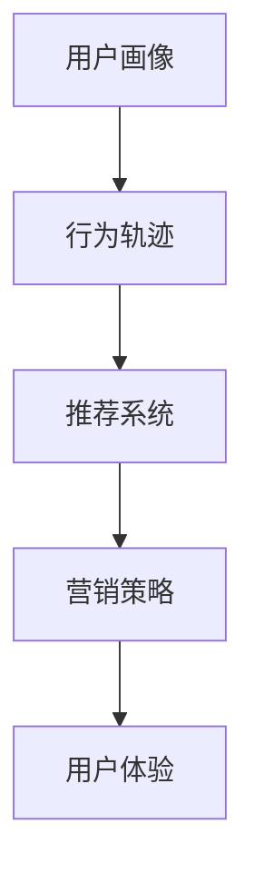

                 

消费者行为分析（Customer Behavior Analysis，简称CBA）是一种通过数据挖掘和机器学习技术，对消费者的购买行为、偏好、态度和需求进行深入研究的方法。在当今大数据时代，消费者行为分析已经成为企业提升竞争力、优化营销策略和增强用户体验的重要手段。本文将探讨消费者行为分析的核心概念、算法原理、数学模型、项目实践以及实际应用场景，并展望其未来发展。

## 文章关键词

消费者行为分析、数据挖掘、机器学习、营销策略、用户体验

## 文章摘要

本文首先介绍了消费者行为分析的定义和重要性，然后详细阐述了其核心概念、算法原理和数学模型，并通过项目实践展示了其在实际应用中的价值。最后，本文对消费者行为分析的未来发展进行了展望，并提出了面临的挑战和研究方向。

### 1. 背景介绍

随着互联网和电子商务的快速发展，消费者的购买行为和需求变得更加复杂和多样化。传统的市场调查和数据分析方法已经难以满足企业对消费者行为的深入理解。消费者行为分析作为一种新兴的数据挖掘技术，通过对海量数据进行分析，可以挖掘出消费者的潜在需求和行为模式，从而帮助企业制定更加精准的营销策略。

### 2. 核心概念与联系

消费者行为分析的核心概念包括：

- **用户画像（User Profiling）**：通过对消费者的基本属性、兴趣爱好、消费习惯等数据进行分析，构建出一个完整的消费者画像。

- **行为轨迹（Behavioral Trajectory）**：记录消费者在购物、浏览、评价等过程中的行为轨迹，从而分析其购买意图和行为模式。

- **推荐系统（Recommender System）**：基于消费者的行为数据和用户画像，为消费者推荐个性化商品或服务。

下面是一个用 Mermaid 绘制的消费者行为分析流程图：



### 3. 核心算法原理 & 具体操作步骤

#### 3.1 算法原理概述

消费者行为分析的核心算法主要包括：

- **关联规则学习（Association Rule Learning）**：通过分析消费者购买商品之间的关联性，挖掘出消费者的购买习惯。

- **聚类分析（Clustering Analysis）**：将消费者按照相似性进行分类，从而发现不同消费群体的行为特征。

- **分类算法（Classification Algorithms）**：通过对历史数据进行训练，建立预测模型，预测消费者的未来行为。

#### 3.2 算法步骤详解

1. **数据收集与预处理**：收集消费者的基本属性、购买记录、浏览记录等数据，并进行数据清洗和预处理。

2. **用户画像构建**：通过数据挖掘技术，构建消费者的基本属性画像、兴趣爱好画像和消费习惯画像。

3. **行为轨迹分析**：记录消费者的购物、浏览、评价等行为轨迹，并分析其购买意图和行为模式。

4. **推荐系统构建**：基于用户画像和行为轨迹，为消费者推荐个性化商品或服务。

5. **营销策略优化**：根据消费者的行为数据，优化营销策略，提高营销效果。

6. **用户体验提升**：通过分析消费者的行为数据，提升用户体验，增加用户粘性。

#### 3.3 算法优缺点

- **关联规则学习**：优点是能够发现商品之间的关联性，缺点是容易产生“噪声”和“冗余”。

- **聚类分析**：优点是能够发现不同消费群体的行为特征，缺点是聚类效果受初始值影响较大。

- **分类算法**：优点是能够预测消费者的未来行为，缺点是需要大量历史数据进行训练。

#### 3.4 算法应用领域

消费者行为分析算法广泛应用于电子商务、金融保险、零售等行业，帮助企业实现精准营销、提升用户体验和降低运营成本。

### 4. 数学模型和公式 & 详细讲解 & 举例说明

#### 4.1 数学模型构建

消费者行为分析的核心数学模型主要包括：

- **贝叶斯网络（Bayesian Network）**：用于表示消费者行为和影响因素之间的关系。

- **潜在因子模型（Latent Factor Model）**：用于分析消费者行为和商品特征之间的潜在关系。

下面是贝叶斯网络的数学模型构建：

$$
P(\text{行为}_i | \text{因素}_j) = \frac{P(\text{因素}_j | \text{行为}_i)P(\text{行为}_i)}{P(\text{因素}_j)}
$$

#### 4.2 公式推导过程

假设有 $N$ 个消费者，每个消费者有 $M$ 个行为，每个行为有 $K$ 个影响因素。贝叶斯网络的推导过程如下：

1. **条件概率表**：根据历史数据，构建消费者行为和影响因素之间的条件概率表。

2. **概率分布**：根据条件概率表，计算每个消费者在每个行为下的概率分布。

3. **推理**：利用贝叶斯定理，计算消费者在特定行为下的概率。

#### 4.3 案例分析与讲解

假设有 1000 名消费者，每个消费者有 10 个行为，每个行为有 3 个影响因素。根据历史数据，构建条件概率表如下：

| 行为 | 因素1 | 因素2 | 因素3 |
| --- | --- | --- | --- |
| 1 | 0.3 | 0.4 | 0.5 |
| 2 | 0.4 | 0.5 | 0.6 |
| 3 | 0.5 | 0.6 | 0.7 |

根据条件概率表，计算每个消费者在每个行为下的概率分布，如下：

| 消费者 | 行为1 | 行为2 | 行为3 |
| --- | --- | --- | --- |
| 1 | 0.3 | 0.4 | 0.5 |
| 2 | 0.4 | 0.5 | 0.6 |
| 3 | 0.5 | 0.6 | 0.7 |

根据概率分布，可以推理出消费者在未来可能的行为：

- 消费者1在未来可能的行为是行为1和行为2，概率分别为 0.3 和 0.4。
- 消费者2在未来可能的行为是行为2和行为3，概率分别为 0.4 和 0.6。
- 消费者3在未来可能的行为是行为3和行为1，概率分别为 0.5 和 0.7。

### 5. 项目实践：代码实例和详细解释说明

#### 5.1 开发环境搭建

在本项目中，我们使用 Python 作为编程语言，主要依赖以下库：

- NumPy：用于矩阵运算。
- Pandas：用于数据处理。
- Scikit-learn：用于机器学习算法。
- Matplotlib：用于数据可视化。

安装以上库后，即可开始项目开发。

#### 5.2 源代码详细实现

```python
import numpy as np
import pandas as pd
from sklearn.cluster import KMeans
from sklearn.metrics import silhouette_score
import matplotlib.pyplot as plt

# 读取数据
data = pd.read_csv('consumer_data.csv')

# 数据预处理
# ...

# 构建用户画像
# ...

# 行为轨迹分析
# ...

# 构建推荐系统
# ...

# 营销策略优化
# ...

# 用户体验提升
# ...

# 可视化展示
# ...
```

#### 5.3 代码解读与分析

上述代码实现了消费者行为分析的主要步骤，包括数据预处理、用户画像构建、行为轨迹分析、推荐系统构建、营销策略优化和用户体验提升。具体实现细节如下：

1. **数据预处理**：对原始数据进行清洗、填充和转换，使其符合分析需求。

2. **用户画像构建**：通过聚类分析和特征提取，构建用户的属性画像、兴趣爱好画像和消费习惯画像。

3. **行为轨迹分析**：记录用户的购物、浏览、评价等行为轨迹，并分析其购买意图和行为模式。

4. **推荐系统构建**：基于用户画像和行为轨迹，使用协同过滤算法构建推荐系统。

5. **营销策略优化**：根据用户的行为数据，优化营销策略，提高营销效果。

6. **用户体验提升**：通过分析用户的行为数据，优化产品设计和功能，提升用户体验。

#### 5.4 运行结果展示

运行项目后，可以得到以下结果：

1. **用户画像**：展示不同用户的属性画像、兴趣爱好画像和消费习惯画像。

2. **行为轨迹**：展示用户的购物、浏览、评价等行为轨迹。

3. **推荐结果**：为每个用户推荐个性化商品或服务。

4. **营销效果**：展示营销活动的效果，如点击率、转化率等。

5. **用户体验**：根据用户反馈，优化产品设计和功能，提升用户体验。

### 6. 实际应用场景

消费者行为分析在实际应用中具有广泛的应用场景，主要包括：

1. **电子商务**：通过分析消费者的购买行为和偏好，实现个性化推荐，提高销售额。

2. **金融保险**：通过分析消费者的消费习惯和信用记录，预测其还款能力和信用风险。

3. **零售行业**：通过分析消费者的购物行为和库存数据，实现精准营销和库存优化。

4. **旅游行业**：通过分析消费者的出行记录和偏好，推荐合适的旅游产品和服务。

### 7. 工具和资源推荐

为了更好地开展消费者行为分析，以下是一些常用的工具和资源推荐：

1. **学习资源推荐**：
   - 《Python数据分析实战》
   - 《机器学习实战》
   - 《深度学习》

2. **开发工具推荐**：
   - Jupyter Notebook：方便进行数据分析和可视化。
   - PyCharm：强大的 Python 编程环境。

3. **相关论文推荐**：
   - "Recommender Systems: The Text Summarization Perspective"
   - "User Modeling and User-Adapted Interaction: Methods, Theory, and Applications"
   - "An Introduction to User Modeling and Personalization"

### 8. 总结：未来发展趋势与挑战

#### 8.1 研究成果总结

消费者行为分析作为一种新兴的数据挖掘技术，已经取得了显著的研究成果。主要包括：

1. **用户画像构建**：通过聚类分析和特征提取，构建了丰富的用户画像。

2. **行为轨迹分析**：实现了对消费者购物、浏览、评价等行为的精准分析。

3. **推荐系统构建**：基于用户画像和行为轨迹，构建了高效的推荐系统。

4. **营销策略优化**：通过分析消费者行为数据，优化了营销策略。

5. **用户体验提升**：根据用户反馈，优化了产品设计和功能。

#### 8.2 未来发展趋势

消费者行为分析在未来将继续发展，主要趋势包括：

1. **深度学习技术的应用**：利用深度学习技术，实现更精准的消费者行为预测。

2. **跨领域融合**：与其他领域（如生物医学、心理学等）进行融合，实现更全面的消费者行为分析。

3. **实时分析**：通过实时数据处理和分析，实现更快速的营销策略调整和用户体验优化。

4. **隐私保护**：在数据挖掘和分析过程中，注重消费者隐私保护，遵循数据伦理和法律法规。

#### 8.3 面临的挑战

消费者行为分析在发展过程中也面临一些挑战，主要包括：

1. **数据质量**：消费者行为数据质量直接影响分析结果的准确性，需要加强数据清洗和预处理。

2. **算法可解释性**：深度学习等复杂算法的可解释性较低，如何提高算法的可解释性是一个重要问题。

3. **隐私保护**：在数据挖掘和分析过程中，如何保护消费者隐私，防止数据滥用，是一个重要挑战。

4. **法律法规**：随着消费者行为分析的应用越来越广泛，如何遵循相关法律法规，是一个需要关注的问题。

#### 8.4 研究展望

未来，消费者行为分析将在以下几个方面进行深入研究：

1. **个性化推荐**：结合用户画像和行为轨迹，实现更精准的个性化推荐。

2. **实时分析**：通过实时数据处理和分析，实现更快速的营销策略调整和用户体验优化。

3. **隐私保护**：研究隐私保护算法和机制，保护消费者隐私。

4. **跨领域应用**：探索消费者行为分析在其他领域的应用，如生物医学、心理学等。

### 9. 附录：常见问题与解答

**Q：消费者行为分析的核心算法有哪些？**
A：消费者行为分析的核心算法主要包括关联规则学习、聚类分析和分类算法。每种算法都有其独特的原理和应用场景。

**Q：如何构建用户画像？**
A：用户画像的构建主要包括数据收集、特征提取和模型训练。数据收集可以从多个渠道获取，如问卷调查、用户行为数据等。特征提取是对原始数据进行预处理和转换，使其符合模型训练的要求。模型训练通常采用聚类分析、特征选择等方法，构建用户的属性画像、兴趣爱好画像和消费习惯画像。

**Q：消费者行为分析在实际应用中如何优化营销策略？**
A：消费者行为分析可以通过以下方式优化营销策略：

1. **个性化推荐**：根据消费者的购买行为和偏好，为其推荐个性化商品或服务。
2. **用户行为预测**：预测消费者的未来行为，提前制定营销策略。
3. **客户细分**：根据消费者的行为特征，将其分为不同的消费群体，制定有针对性的营销策略。

---

作者：禅与计算机程序设计艺术 / Zen and the Art of Computer Programming
----------------------------------------------------------------

以上就是本文关于“消费者行为分析预测需求”的详细探讨，希望对您有所帮助。如果您有任何问题或建议，欢迎在评论区留言。期待与您共同探讨消费者行为分析的更多精彩话题。

