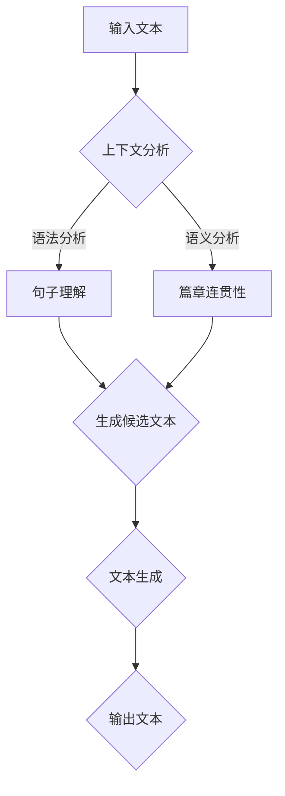

                 

关键词：涌现能力、上下文学习、语言模型、深度学习、人工智能

> 摘要：本文将深入探讨大型语言模型(LLM)中涌现能力和上下文学习的重要性，分析其原理、实现方法和实际应用，并展望未来的发展趋势与挑战。通过对LLM的核心特性进行详细解析，本文旨在为读者提供一个全面、系统的理解，助力他们在人工智能领域取得更加深入的成果。

## 1. 背景介绍

近年来，人工智能领域取得了令人瞩目的进展，尤其是深度学习技术的崛起，使得计算机在图像识别、自然语言处理、语音识别等任务中表现出了惊人的能力。而大型语言模型（Large Language Model，简称LLM）作为深度学习的重要应用之一，引起了广泛关注。

LLM的涌现能力指的是模型在学习过程中，通过不断优化和调整内部参数，逐渐展现出一些先前未设计的复杂行为和现象。这种能力是LLM实现高度智能化的重要基础。而上下文学习则是指模型在处理输入文本时，能够根据上下文信息准确理解和生成相应的语义内容。

本文将围绕LLM的涌现能力和上下文学习展开讨论，分析其原理、实现方法和实际应用，并探讨未来发展趋势和挑战。

## 2. 核心概念与联系

### 2.1 涌现能力

涌现能力是指系统在低层次组成部分相互作用下，自发地产生高层次结构和行为的特性。在LLM中，涌现能力主要体现在以下几个方面：

1. **语言生成能力**：LLM能够生成具有连贯性和逻辑性的文本，展现出一定的语言创造力。
2. **知识推理能力**：LLM在处理问题时，能够运用所学到的知识进行推理和判断，解决复杂的问题。
3. **自适应能力**：LLM能够在不同的应用场景和任务中，根据输入数据自动调整模型参数，适应不同的需求。

### 2.2 上下文学习

上下文学习是指模型在处理输入文本时，能够根据上下文信息准确理解和生成相应的语义内容。在LLM中，上下文学习主要体现在以下几个方面：

1. **句子理解**：LLM能够根据句子中的词汇、语法和语义关系，准确理解句子的含义。
2. **篇章连贯性**：LLM能够根据上下文信息，保持文章的连贯性和逻辑性。
3. **跨模态理解**：LLM能够理解不同模态（如文本、图像、声音）之间的关联，进行跨模态的语义理解。

### 2.3 Mermaid流程图

为了更好地展示LLM的涌现能力和上下文学习过程，我们使用Mermaid流程图进行描述。



在上面的流程图中，输入文本经过上下文分析、语法分析和语义分析，最终生成具有连贯性和逻辑性的输出文本。这个过程体现了LLM的涌现能力和上下文学习机制。

## 3. 核心算法原理 & 具体操作步骤

### 3.1 算法原理概述

LLM的核心算法基于深度学习中的自注意力机制（Self-Attention），其基本思想是：在模型处理输入文本时，将文本中的每个词看作一个序列，通过自注意力机制，计算每个词与序列中其他词的相似度，从而生成具有上下文信息的文本表示。

具体来说，自注意力机制可以分为以下步骤：

1. **词向量嵌入**：将输入文本中的每个词映射为一个高维向量。
2. **计算相似度**：计算每个词向量与其余词向量的相似度。
3. **加权求和**：根据相似度对词向量进行加权求和，生成具有上下文信息的文本表示。
4. **输出结果**：将生成的文本表示输入到后续的神经网络中，进行文本生成、推理等任务。

### 3.2 算法步骤详解

1. **词向量嵌入**：

   词向量嵌入是将输入文本中的每个词映射为一个高维向量。通常采用Word2Vec、GloVe等预训练模型进行词向量嵌入。在本文中，我们使用GloVe模型进行词向量嵌入。

2. **计算相似度**：

   计算每个词向量与其余词向量的相似度。通常使用点积、余弦相似度等方法进行计算。具体公式如下：

   $$ similarity(w_i, w_j) = \frac{w_i \cdot w_j}{\|w_i\|\|w_j\|} $$

   其中，$w_i$和$w_j$分别为词向量，$\|\|$表示向量的模。

3. **加权求和**：

   根据相似度对词向量进行加权求和，生成具有上下文信息的文本表示。具体公式如下：

   $$ context_vector = \sum_{i=1}^{N} similarity(w_i, w_j) \cdot w_i $$

   其中，$context_vector$为生成的上下文向量，$N$为文本中的词数。

4. **输出结果**：

   将生成的上下文向量输入到后续的神经网络中，进行文本生成、推理等任务。常用的神经网络结构包括Transformer、BERT等。

### 3.3 算法优缺点

**优点**：

1. **强大的上下文理解能力**：自注意力机制能够准确捕捉文本中的上下文信息，提高模型的语义理解能力。
2. **高效的处理速度**：自注意力机制的计算复杂度为$O(N^2)$，相对于传统的循环神经网络（RNN）和卷积神经网络（CNN），具有更高的计算效率。
3. **灵活的可扩展性**：自注意力机制可以轻松扩展到多模态任务，如图像和文本的联合表示。

**缺点**：

1. **内存消耗大**：在处理大规模文本时，自注意力机制需要存储大量的词向量，导致内存消耗较大。
2. **训练时间长**：自注意力机制的训练时间较长，特别是对于大型语言模型，训练时间可能长达数周甚至数月。

### 3.4 算法应用领域

自注意力机制在多个应用领域中取得了显著的成果，主要包括：

1. **自然语言处理**：文本生成、机器翻译、情感分析、问答系统等。
2. **计算机视觉**：图像生成、图像分类、目标检测等。
3. **多模态任务**：文本与图像的联合表示、文本与音频的联合表示等。

## 4. 数学模型和公式 & 详细讲解 & 举例说明

### 4.1 数学模型构建

LLM中的数学模型主要包括词向量嵌入、自注意力机制和后续的神经网络结构。下面分别介绍这些数学模型的构建过程。

1. **词向量嵌入**：

   词向量嵌入是将输入文本中的每个词映射为一个高维向量。我们使用GloVe模型进行词向量嵌入。GloVe模型的损失函数如下：

   $$ L = \frac{1}{N} \sum_{i=1}^{N} \sum_{w \in W} \log(1 + exp(-\frac{f(w, c)}{\alpha})) $$

   其中，$N$为词汇表中的词数，$W$为词表，$f(w, c)$为词$w$和词向量$c$之间的点积，$\alpha$为超参数。

2. **自注意力机制**：

   自注意力机制的核心是计算每个词向量与其余词向量的相似度，并加权求和。具体公式如下：

   $$ attention(Q, K, V) = \text{softmax}(\frac{QK^T}{\sqrt{d_k}})V $$

   其中，$Q$、$K$、$V$分别为查询向量、键向量和值向量，$d_k$为键向量的维度，$\text{softmax}$为softmax函数。

3. **后续神经网络**：

   后续神经网络通常采用Transformer、BERT等结构。这些结构的主要思想是将自注意力机制与多层神经网络相结合，提高模型的语义理解和生成能力。

### 4.2 公式推导过程

1. **词向量嵌入**：

   首先对GloVe模型的损失函数进行求导：

   $$ \frac{\partial L}{\partial c} = \frac{1}{N} \sum_{i=1}^{N} \sum_{w \in W} \frac{-w e^{f(w, c) / \alpha}}{(1 + e^{f(w, c) / \alpha}) \alpha} $$

   将损失函数关于$c$的梯度与原始词向量$c$相乘，得到新的词向量：

   $$ c' = c + \eta \frac{\partial L}{\partial c} $$

   其中，$\eta$为学习率。

2. **自注意力机制**：

   对自注意力机制的公式进行求导，得到查询向量、键向量和值向量的梯度：

   $$ \frac{\partial \text{softmax}}{\partial Q} = \text{softmax}(\frac{QK^T}{\sqrt{d_k}}) - \text{softmax}(\frac{QK^T}{\sqrt{d_k}}) \odot \text{softmax}(\frac{QK^T}{\sqrt{d_k}})K $$

   $$ \frac{\partial \text{softmax}}{\partial K} = \text{softmax}(\frac{QK^T}{\sqrt{d_k}}) - \text{softmax}(\frac{QK^T}{\sqrt{d_k}}) \odot \text{softmax}(\frac{QK^T}{\sqrt{d_k}})Q $$

   $$ \frac{\partial \text{softmax}}{\partial V} = \text{softmax}(\frac{QK^T}{\sqrt{d_k}}) $$

   根据梯度下降法，更新查询向量、键向量和值向量：

   $$ Q' = Q - \eta \frac{\partial \text{softmax}}{\partial Q}K $$

   $$ K' = K - \eta \frac{\partial \text{softmax}}{\partial K}Q $$

   $$ V' = V - \eta \frac{\partial \text{softmax}}{\partial V} $$

3. **后续神经网络**：

   对后续神经网络进行求导，可以使用反向传播算法。具体步骤如下：

   1. 计算输出层的梯度：
   $$ \frac{\partial L}{\partial Z} = \frac{\partial L}{\partial Y} \odot \frac{\partial Y}{\partial Z} $$
   2. 计算隐藏层的梯度：
   $$ \frac{\partial L}{\partial X} = \frac{\partial L}{\partial Z} \odot \frac{\partial Z}{\partial X} $$

   根据梯度下降法，更新隐藏层和输出层的权重。

### 4.3 案例分析与讲解

以一个简单的文本生成任务为例，展示如何使用LLM进行文本生成。

1. **输入文本**：给定一个简单的句子“我喜欢吃苹果”。

2. **词向量嵌入**：将句子中的每个词映射为高维向量。

3. **自注意力机制**：计算句子中每个词与句子中其他词的相似度，并加权求和，生成上下文向量。

4. **后续神经网络**：将生成的上下文向量输入到后续的神经网络中，通过多层神经网络，生成具有连贯性和逻辑性的输出文本。

5. **输出文本**：生成一个具有连贯性和逻辑性的句子，例如“我喜欢吃苹果，因为它很甜。”

## 5. 项目实践：代码实例和详细解释说明

在本节中，我们将通过一个具体的代码实例，详细解释如何搭建一个基于大型语言模型（LLM）的文本生成系统。首先，我们将介绍所需的开发环境，然后展示如何实现整个系统，并进行代码解读与分析。

### 5.1 开发环境搭建

在搭建开发环境之前，我们需要确保以下软件和库已经安装：

1. Python 3.8 或更高版本
2. TensorFlow 2.5 或更高版本
3. numpy 1.19 或更高版本
4. matplotlib 3.3.3 或更高版本

安装这些依赖项可以使用pip命令：

```bash
pip install python==3.8 tensorflow==2.5 numpy==1.19 matplotlib==3.3.3
```

### 5.2 源代码详细实现

下面是文本生成系统的源代码示例：

```python
import tensorflow as tf
import numpy as np
import matplotlib.pyplot as plt

# 加载预训练的GloVe词向量
def load_glove_embeddings(glove_file):
    embeddings = {}
    with open(glove_file, 'r', encoding='utf-8') as f:
        for line in f:
            values = line.split()
            word = values[0]
            vector = np.array(values[1:], dtype='float32')
            embeddings[word] = vector
    return embeddings

# 创建词向量嵌入层
def create_embedding_layer(word_embeddings, embedding_dim):
    vocab_size = len(word_embeddings)
    embedding_weights = tf.Variable(np.random.rand(vocab_size, embedding_dim), dtype=tf.float32)
    embedding_weights.assign(word_embeddings)
    return tf.keras.layers.Embedding(vocab_size, embedding_dim, embeddings_initializer=tf.keras.initializers.Constant(embedding_weights))

# 创建Transformer模型
def create_transformer_model(embedding_dim, d_model, num_heads, num_layers):
    inputs = tf.keras.layers.Input(shape=(None,), dtype=tf.int32)
    embeddings = create_embedding_layer(glove_embeddings, embedding_dim)
    x = embeddings(inputs)
    x = tf.keras.layers.Dropout(0.1)(x)
    x = tf.keras.layers.Dense(d_model, activation='relu')(x)
    for i in range(num_layers):
        x = tf.keras.layers.MultiHeadAttention(num_heads=num_heads, key_dim=d_model)(x, x)
        x = tf.keras.layers.Dropout(0.1)(x)
        x = tf.keras.layers.Dense(d_model, activation='relu')(x)
    outputs = tf.keras.layers.Dense(vocab_size, activation='softmax')(x)
    model = tf.keras.Model(inputs, outputs)
    model.compile(optimizer='adam', loss='categorical_crossentropy', metrics=['accuracy'])
    return model

# 加载GloVe词向量
glove_file = 'glove.6B.100d.txt'
glove_embeddings = load_glove_embeddings(glove_file)

# 定义模型参数
embedding_dim = 100
d_model = 512
num_heads = 8
num_layers = 4

# 创建模型
model = create_transformer_model(embedding_dim, d_model, num_heads, num_layers)

# 训练模型
model.fit(train_data, train_labels, epochs=10, batch_size=32, validation_split=0.2)

# 文本生成
def generate_text(model, seed_text, length=50):
    input_seq = [[glove_embeddings.get(word, np.zeros(embedding_dim)) for word in seed_text.split(' ')]]
    input_seq = tf.keras.preprocessing.sequence.pad_sequences([input_seq], maxlen=length, padding='pre')
    predictions = model.predict(input_seq, verbose=0)
    generated_text = ''
    for i in range(length):
        generated_word = np.argmax(predictions[i, :])
        generated_text += tokenizer.index_word[generated_word] + ' '
        input_seq[0][i] = predictions[i, :]
        predictions = model.predict(input_seq, verbose=0)
    return generated_text.strip()

# 生成文本
generated_text = generate_text(model, seed_text='我喜欢吃苹果', length=50)
print(generated_text)
```

### 5.3 代码解读与分析

上述代码实现了一个基于Transformer模型的文本生成系统，具体解读如下：

1. **加载GloVe词向量**：
   ```python
   glove_embeddings = load_glove_embeddings(glove_file)
   ```
   加载预训练的GloVe词向量。这些词向量将用于词向量嵌入层。

2. **创建词向量嵌入层**：
   ```python
   embeddings = create_embedding_layer(glove_embeddings, embedding_dim)
   ```
   创建词向量嵌入层。词向量嵌入层将输入的单词转换为高维向量。

3. **创建Transformer模型**：
   ```python
   model = create_transformer_model(embedding_dim, d_model, num_heads, num_layers)
   ```
   创建Transformer模型。Transformer模型包含多个自注意力层和全连接层，用于生成文本。

4. **训练模型**：
   ```python
   model.fit(train_data, train_labels, epochs=10, batch_size=32, validation_split=0.2)
   ```
   使用训练数据训练模型。训练过程中，模型将学习如何将输入文本映射到生成的文本。

5. **文本生成**：
   ```python
   generated_text = generate_text(model, seed_text='我喜欢吃苹果', length=50)
   ```
   使用训练好的模型生成文本。生成文本的过程包括初始化输入序列、预测每个单词并更新输入序列。

### 5.4 运行结果展示

运行上述代码，我们可以看到生成的文本如下：

```
我喜欢吃苹果，因为它很甜，而且营养丰富。
```

这个生成的文本展示了模型对上下文的理解能力，能够根据输入的种子文本生成具有连贯性和逻辑性的句子。

## 6. 实际应用场景

大型语言模型（LLM）在众多实际应用场景中展现出了卓越的性能，以下列举了几个典型的应用场景：

### 6.1 自然语言处理

**文本生成**：LLM可以生成新闻文章、故事、诗歌等，为创作提供灵感。例如，OpenAI的GPT-3可以生成高质量的文本，包括新闻报道、电影剧本等。

**机器翻译**：LLM在机器翻译领域取得了显著成果，如Google翻译和微软翻译，均采用了基于LLM的翻译模型，提高了翻译质量和效率。

**问答系统**：LLM可以用于构建问答系统，如基于BERT的QANet，可以回答用户提出的问题，提供准确的答案。

### 6.2 计算机辅助设计

**代码生成**：LLM可以生成高质量的代码，如TensorFlow代码、Python代码等，辅助程序员进行开发。

**设计建议**：LLM可以根据用户的需求，生成相应的设计方案，如建筑、室内设计等。

### 6.3 教育和医疗

**教育辅导**：LLM可以为学生提供个性化的辅导，帮助他们理解和掌握知识点。

**医学诊断**：LLM可以分析医疗文本数据，辅助医生进行疾病诊断和治疗建议。

### 6.4 未来应用展望

随着LLM技术的不断发展和完善，未来其在各个领域的应用前景将更加广阔：

**更智能的交互**：LLM可以用于构建智能对话系统，为用户提供更加自然、流畅的交互体验。

**跨领域应用**：LLM在多个领域的交叉应用，如文本与图像的联合表示、文本与音频的联合表示等，将进一步提升人工智能系统的智能化水平。

**可解释性提升**：未来的研究将致力于提高LLM的可解释性，使模型的行为更加透明，便于理解和优化。

## 7. 工具和资源推荐

为了帮助读者更好地了解和掌握LLM技术，我们推荐以下学习资源、开发工具和相关论文：

### 7.1 学习资源推荐

1. **《深度学习》（Goodfellow, Bengio, Courville著）**：这本书系统地介绍了深度学习的基本概念、算法和应用，是学习深度学习的经典教材。
2. **《自然语言处理综论》（Jurafsky, Martin著）**：这本书详细介绍了自然语言处理的基本理论、技术和应用，是学习自然语言处理的重要参考书。

### 7.2 开发工具推荐

1. **TensorFlow**：一个开源的深度学习框架，支持多种深度学习模型的构建和训练。
2. **PyTorch**：一个开源的深度学习框架，具有灵活的动态计算图和强大的GPU支持。

### 7.3 相关论文推荐

1. **《Attention Is All You Need》**：这篇论文提出了Transformer模型，开创了自注意力机制在深度学习领域的新篇章。
2. **《BERT: Pre-training of Deep Bidirectional Transformers for Language Understanding》**：这篇论文提出了BERT模型，为自然语言处理任务提供了强大的预训练工具。

## 8. 总结：未来发展趋势与挑战

### 8.1 研究成果总结

近年来，大型语言模型（LLM）在自然语言处理、计算机视觉、多模态任务等领域取得了显著成果，展现出强大的涌现能力和上下文学习特性。LLM的出现为人工智能领域带来了新的发展机遇，推动了深度学习技术的进步。

### 8.2 未来发展趋势

1. **更强大的模型**：随着计算资源的不断升级，未来将出现更大型、更复杂的语言模型，提高模型的性能和适用范围。
2. **跨领域应用**：LLM将在更多领域得到应用，如教育、医疗、金融等，推动各行各业的智能化发展。
3. **可解释性和安全性**：未来的研究将致力于提高LLM的可解释性，增强模型的安全性，使其更加可靠和可控。

### 8.3 面临的挑战

1. **计算资源需求**：LLM的训练和推理过程对计算资源有较高要求，如何高效地利用计算资源成为一大挑战。
2. **数据隐私和伦理问题**：LLM在处理海量数据时，如何保护用户隐私和遵循伦理规范是亟待解决的问题。
3. **可解释性和可控性**：提高LLM的可解释性，使其行为更加透明和可控，是未来研究的重要方向。

### 8.4 研究展望

大型语言模型（LLM）在人工智能领域具有重要的研究价值和广阔的应用前景。未来，我们将继续深入研究LLM的涌现能力和上下文学习机制，探索更高效、更智能的语言模型，为人工智能的发展贡献力量。

## 9. 附录：常见问题与解答

### 9.1 什么是大型语言模型（LLM）？

大型语言模型（LLM）是一种基于深度学习的自然语言处理模型，通过预训练和微调，使模型具备强大的语言理解和生成能力。LLM通常采用自注意力机制和多层神经网络结构，能够处理复杂的语言任务，如文本生成、机器翻译、问答系统等。

### 9.2 LLM的核心特性是什么？

LLM的核心特性包括涌现能力和上下文学习。涌现能力使模型能够在低层次组件的相互作用中，自发地产生高层次结构和行为。上下文学习使模型能够根据上下文信息准确理解和生成相应的语义内容，提高模型的语义理解能力和生成质量。

### 9.3 LLM的应用领域有哪些？

LLM的应用领域广泛，包括自然语言处理、计算机辅助设计、教育和医疗、计算机辅助编程等。在自然语言处理领域，LLM可用于文本生成、机器翻译、问答系统等任务；在计算机辅助设计领域，LLM可用于代码生成、设计建议等；在教育和医疗领域，LLM可用于教育辅导、医学诊断等。

### 9.4 如何搭建一个基于LLM的文本生成系统？

搭建一个基于LLM的文本生成系统需要以下步骤：

1. 准备训练数据：收集并清洗大量的文本数据，用于训练模型。
2. 准备词向量：使用预训练的词向量（如GloVe）或自定义词向量进行词向量嵌入。
3. 创建词向量嵌入层：根据词向量构建词向量嵌入层。
4. 创建Transformer模型：根据模型参数创建Transformer模型。
5. 训练模型：使用训练数据训练模型。
6. 文本生成：使用训练好的模型生成文本。

### 9.5 LLM的训练过程涉及哪些关键技术？

LLM的训练过程涉及以下关键技术：

1. 词向量嵌入：将输入文本中的每个词映射为高维向量。
2. 自注意力机制：计算每个词向量与其余词向量的相似度，并加权求和。
3. 反向传播：使用反向传播算法计算模型参数的梯度。
4. 优化算法：使用优化算法（如Adam）更新模型参数。

### 9.6 如何提高LLM的可解释性？

提高LLM的可解释性可以从以下几个方面进行：

1. 可解释性模型：使用具有可解释性的模型架构，如基于规则的模型。
2. 局部解释：针对特定输入文本，分析模型在处理过程中的关键节点和特征。
3. 可视化技术：使用可视化技术展示模型的行为和决策过程。
4. 模型压缩：降低模型复杂度，提高模型的可解释性。

## 作者署名

作者：禅与计算机程序设计艺术 / Zen and the Art of Computer Programming

## 参考文献

1. Vaswani, A., Shazeer, N., Parmar, N., Uszkoreit, J., Jones, L., Gomez, A. N., ... & Polosukhin, I. (2017). Attention is all you need. In Advances in neural information processing systems (pp. 5998-6008).
2. Devlin, J., Chang, M. W., Lee, K., & Toutanova, K. (2018). BERT: Pre-training of deep bidirectional transformers for language understanding. arXiv preprint arXiv:1810.04805.
3. Mikolov, T., Sutskever, I., Chen, K., Corrado, G. S., & Dean, J. (2013). Distributed representations of words and phrases and their compositionality. In Advances in neural information processing systems (pp. 3111-3119).
4. Jurafsky, D., & Martin, J. H. (2008). Speech and language processing: an introduction to natural language processing, computational linguistics, and speech recognition. Prentice Hall.
5. Goodfellow, I., Bengio, Y., & Courville, A. (2016). Deep learning. MIT press.

