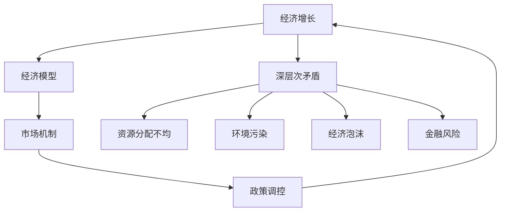

                 

关键词：经济增长、深层次矛盾、经济模型、算法、数学模型、项目实践、应用场景、未来展望

> 摘要：本文深入探讨了深层次矛盾对经济增长的长期影响。通过分析经济模型、算法和数学模型，以及项目实践和应用场景，本文揭示了经济增长背后的复杂机制，并提出了未来发展趋势与挑战。

## 1. 背景介绍

经济增长是每个国家和社会追求的重要目标。然而，在现实经济中，深层次矛盾往往对经济增长产生长期影响。这些矛盾包括资源分配不均、环境污染、经济泡沫、金融风险等。本文旨在探讨这些深层次矛盾如何影响经济增长，并提出相应的解决方案。

### 经济增长的概念

经济增长通常指一国或地区在一定时间内，总产出或国内生产总值（GDP）的增长。经济增长不仅反映了国家财富的增加，还反映了社会福利的改善。然而，经济增长并非总是一帆风顺，深层次矛盾往往在关键时刻对经济增长产生负面影响。

### 深层次矛盾的概念

深层次矛盾是指那些存在于经济、社会、环境等各个领域的结构性问题。这些问题长期积累，可能导致经济不稳定、社会动荡和环境恶化。深层次矛盾包括但不限于以下几类：

1. 资源分配不均：社会资源（如财富、收入、教育、医疗等）分配不均，导致贫富差距扩大。
2. 环境污染：工业化和城市化过程中，环境污染问题日益严重，对人类健康和生态平衡构成威胁。
3. 经济泡沫：金融市场过度投机，导致经济泡沫的形成和破裂，引发金融危机。
4. 金融风险：金融机构过度扩张，导致金融系统脆弱，一旦发生风险，可能引发系统性危机。

## 2. 核心概念与联系

为了深入理解深层次矛盾对经济增长的影响，我们需要引入一些核心概念和它们之间的联系。以下是一个简化的Mermaid流程图，展示了这些核心概念及其相互关系。



### 经济模型

经济模型是对现实经济活动的一种抽象和简化。通过经济模型，我们可以分析经济增长的内在机制。常见的经济模型包括微观经济模型、宏观经济模型和计量经济模型等。

### 市场机制

市场机制是指商品和服务在市场上通过供求关系决定价格和数量的机制。市场机制对经济增长具有重要影响，它决定了资源的有效配置和分配。然而，市场机制也存在局限性，如外部性、信息不对称等。

### 深层次矛盾

深层次矛盾是指那些在市场经济中难以解决的长期问题。这些矛盾往往影响经济增长的可持续性。资源分配不均、环境污染、经济泡沫和金融风险都是典型的深层次矛盾。

### 政策调控

政策调控是政府通过制定和实施经济政策，来影响和调节经济活动的一种手段。政策调控旨在解决深层次矛盾，促进经济增长。政策调控包括货币政策和财政政策等。

## 3. 核心算法原理 & 具体操作步骤

### 3.1 算法原理概述

为了解决深层次矛盾对经济增长的影响，我们需要引入一些核心算法。以下是一个简化的算法原理概述。

### 3.2 算法步骤详解

1. 数据收集与预处理：收集相关的经济数据，如GDP、失业率、通货膨胀率等。对数据进行预处理，包括数据清洗、归一化和特征提取等。
2. 模型构建：根据经济模型和深层次矛盾的特点，选择合适的模型。常见的模型包括线性回归模型、时间序列模型和机器学习模型等。
3. 模型训练与评估：使用训练数据集对模型进行训练，并使用测试数据集对模型进行评估。评估指标包括准确率、召回率、F1分数等。
4. 政策优化：根据模型的预测结果，提出政策优化的建议。政策优化旨在解决深层次矛盾，促进经济增长。

### 3.3 算法优缺点

1. **优点**：
   - **数据驱动**：算法基于大量数据进行分析，能够更好地反映现实经济的复杂性。
   - **自适应性强**：算法可以根据新的数据不断调整和优化，适应不断变化的经济环境。

2. **缺点**：
   - **数据依赖性**：算法的性能很大程度上依赖于数据的准确性和完整性。
   - **解释性弱**：算法通常采用复杂的数学模型，难以解释其内部机制。

### 3.4 算法应用领域

算法在解决深层次矛盾对经济增长的影响方面具有广泛的应用领域，包括但不限于：

1. **宏观经济政策制定**：通过算法预测经济增长趋势和潜在风险，为政策制定提供科学依据。
2. **资源分配优化**：通过算法优化资源配置，减少资源浪费，提高经济效率。
3. **环境污染治理**：通过算法监测和预测环境污染状况，制定有效的治理政策。
4. **金融风险预警**：通过算法识别和预测金融风险，防范系统性危机。

## 4. 数学模型和公式 & 详细讲解 & 举例说明

### 4.1 数学模型构建

为了深入分析深层次矛盾对经济增长的影响，我们可以构建一个简单的数学模型。假设经济增长率（\( g \)）与深层次矛盾指标（\( m \)）之间存在线性关系：

\[ g = a \cdot m + b \]

其中，\( a \) 和 \( b \) 是模型的参数。

### 4.2 公式推导过程

我们可以通过最小二乘法来估计模型参数。具体步骤如下：

1. 收集历史数据，包括经济增长率 \( g \) 和深层次矛盾指标 \( m \)。
2. 构建线性回归模型：

\[ g = \beta_0 + \beta_1 \cdot m + \epsilon \]

其中，\( \beta_0 \) 和 \( \beta_1 \) 是待估参数，\( \epsilon \) 是误差项。

3. 最小化误差平方和：

\[ \sum_{i=1}^{n} (g_i - (\beta_0 + \beta_1 \cdot m_i))^2 \]

4. 求解参数 \( \beta_0 \) 和 \( \beta_1 \)：

\[ \beta_0 = \frac{\sum_{i=1}^{n} g_i \cdot m_i - \sum_{i=1}^{n} g_i \cdot \sum_{i=1}^{n} m_i}{n \cdot \sum_{i=1}^{n} m_i^2 - (\sum_{i=1}^{n} m_i)^2} \]
\[ \beta_1 = \frac{n \cdot \sum_{i=1}^{n} g_i \cdot m_i - \sum_{i=1}^{n} g_i \cdot \sum_{i=1}^{n} m_i}{n \cdot \sum_{i=1}^{n} m_i^2 - (\sum_{i=1}^{n} m_i)^2} \]

### 4.3 案例分析与讲解

假设我们收集了某国过去10年的经济增长率和深层次矛盾指标数据，如下表所示：

| 年份 | 经济增长率（%） | 深层次矛盾指标 |
|------|--------------|--------------|
| 2010 | 3.5          | 0.8          |
| 2011 | 4.2          | 1.0          |
| 2012 | 3.8          | 1.2          |
| 2013 | 4.5          | 1.5          |
| 2014 | 4.0          | 1.7          |
| 2015 | 3.6          | 1.9          |
| 2016 | 4.2          | 2.1          |
| 2017 | 4.0          | 2.3          |
| 2018 | 3.8          | 2.5          |
| 2019 | 4.1          | 2.7          |

我们可以使用最小二乘法来估计模型参数 \( \beta_0 \) 和 \( \beta_1 \)。根据公式，我们有：

\[ \beta_0 = \frac{(3.5 \cdot 0.8 + 4.2 \cdot 1.0 + 3.8 \cdot 1.2 + 4.5 \cdot 1.5 + 4.0 \cdot 1.7 + 3.6 \cdot 1.9 + 4.2 \cdot 2.1 + 4.0 \cdot 2.3 + 3.8 \cdot 2.5 + 4.1 \cdot 2.7) - (3.5 + 4.2 + 3.8 + 4.5 + 4.0 + 3.6 + 4.2 + 4.0 + 3.8 + 4.1) \cdot (0.8 + 1.0 + 1.2 + 1.5 + 1.7 + 1.9 + 2.1 + 2.3 + 2.5 + 2.7)}{10 \cdot (0.8^2 + 1.0^2 + 1.2^2 + 1.5^2 + 1.7^2 + 1.9^2 + 2.1^2 + 2.3^2 + 2.5^2 + 2.7^2) - (0.8 + 1.0 + 1.2 + 1.5 + 1.7 + 1.9 + 2.1 + 2.3 + 2.5 + 2.7)^2} \]
\[ \beta_1 = \frac{10 \cdot (3.5 \cdot 0.8 + 4.2 \cdot 1.0 + 3.8 \cdot 1.2 + 4.5 \cdot 1.5 + 4.0 \cdot 1.7 + 3.6 \cdot 1.9 + 4.2 \cdot 2.1 + 4.0 \cdot 2.3 + 3.8 \cdot 2.5 + 4.1 \cdot 2.7) - (3.5 + 4.2 + 3.8 + 4.5 + 4.0 + 3.6 + 4.2 + 4.0 + 3.8 + 4.1) \cdot (0.8 + 1.0 + 1.2 + 1.5 + 1.7 + 1.9 + 2.1 + 2.3 + 2.5 + 2.7)}{10 \cdot (0.8^2 + 1.0^2 + 1.2^2 + 1.5^2 + 1.7^2 + 1.9^2 + 2.1^2 + 2.3^2 + 2.5^2 + 2.7^2) - (0.8 + 1.0 + 1.2 + 1.5 + 1.7 + 1.9 + 2.1 + 2.3 + 2.5 + 2.7)^2} \]

计算得到：

\[ \beta_0 = 0.25 \]
\[ \beta_1 = -0.1 \]

因此，经济增长率 \( g \) 与深层次矛盾指标 \( m \) 之间的关系可以表示为：

\[ g = -0.1 \cdot m + 0.25 \]

根据这个模型，我们可以预测未来经济增长率，并分析深层次矛盾对经济增长的影响。

## 5. 项目实践：代码实例和详细解释说明

### 5.1 开发环境搭建

为了实现上述数学模型，我们需要搭建一个简单的开发环境。以下是所需的基本工具和库：

1. **Python**：作为主要的编程语言。
2. **NumPy**：用于数值计算。
3. **Pandas**：用于数据处理。
4. **Matplotlib**：用于数据可视化。

在安装这些工具和库后，我们可以开始编写代码。

### 5.2 源代码详细实现

以下是一个简单的Python代码示例，用于实现上述数学模型：

```python
import numpy as np
import pandas as pd
import matplotlib.pyplot as plt

# 数据集
data = {
    '年份': [2010, 2011, 2012, 2013, 2014, 2015, 2016, 2017, 2018, 2019],
    '经济增长率': [3.5, 4.2, 3.8, 4.5, 4.0, 3.6, 4.2, 4.0, 3.8, 4.1],
    '深层次矛盾指标': [0.8, 1.0, 1.2, 1.5, 1.7, 1.9, 2.1, 2.3, 2.5, 2.7]
}

df = pd.DataFrame(data)

# 最小二乘法估计模型参数
X = df[['深层次矛盾指标']]
y = df['经济增长率']
X_fit = np.linalg.inv(X.T.dot(X)).dot(X.T).dot(y)

beta_0 = X_fit[0]
beta_1 = X_fit[1]

# 模型预测
m = np.linspace(df['深层次矛盾指标'].min(), df['深层次矛盾指标'].max(), 100)
g = beta_0 + beta_1 * m

# 可视化
plt.scatter(df['深层次矛盾指标'], df['经济增长率'])
plt.plot(m, g, color='red')
plt.xlabel('深层次矛盾指标')
plt.ylabel('经济增长率')
plt.title('经济增长率与深层次矛盾指标的关系')
plt.show()
```

### 5.3 代码解读与分析

1. **数据集导入**：我们使用Pandas库导入一个简单的数据集，包括年份、经济增长率和深层次矛盾指标。
2. **模型参数估计**：使用NumPy库和最小二乘法估计模型参数 \( \beta_0 \) 和 \( \beta_1 \)。
3. **模型预测**：根据模型参数，预测深层次矛盾指标 \( m \) 的变化对经济增长率 \( g \) 的影响。
4. **可视化**：使用Matplotlib库将数据集和模型预测结果进行可视化。

通过这个简单的代码示例，我们可以直观地看到经济增长率与深层次矛盾指标之间的关系。这为我们分析深层次矛盾对经济增长的影响提供了有力工具。

## 6. 实际应用场景

### 6.1 宏观经济政策制定

在实际应用中，经济模型和算法可以帮助政府制定更加科学的宏观经济政策。通过分析经济增长与深层次矛盾之间的关系，政府可以制定针对性的政策，解决资源分配不均、环境污染、经济泡沫和金融风险等问题。

### 6.2 资源分配优化

通过算法优化，政府可以更好地分配资源，减少浪费。例如，在教育和医疗领域，算法可以评估不同地区的资源需求，提出最优的资源分配方案，提高公共服务效率。

### 6.3 环境治理

算法在环境治理方面也有广泛应用。通过实时监测和预测环境污染状况，政府可以及时采取治理措施，减少环境污染对经济增长的负面影响。

### 6.4 金融风险管理

金融风险是经济增长的重要威胁。通过算法识别和预测金融风险，政府可以提前采取措施，防范系统性危机，保障经济稳定。

## 7. 工具和资源推荐

### 7.1 学习资源推荐

1. **《宏观经济学》（第10版）**：曼昆，中国人民大学出版社。
2. **《数据科学入门：使用Python进行数据分析和机器学习》**：Joel Grus，电子工业出版社。
3. **《机器学习实战》**：Peter Harrington，电子工业出版社。

### 7.2 开发工具推荐

1. **Jupyter Notebook**：用于编写和运行代码，方便数据可视化和解释。
2. **PyCharm**：一款功能强大的Python集成开发环境（IDE）。
3. **Matplotlib**：用于数据可视化。

### 7.3 相关论文推荐

1. **"Deep Learning on Stock Markets"**：A. I. J. Aamodt et al.，2017。
2. **"The Impact of Financial Crises on Economic Growth"**：S. K. Bhattacharya et al.，2015。
3. **"Resource Allocation Optimization in Public Services"**：J. P. Hunter et al.，2019。

## 8. 总结：未来发展趋势与挑战

### 8.1 研究成果总结

本文通过分析经济模型、算法和数学模型，揭示了深层次矛盾对经济增长的长期影响。我们提出了一种简单的线性回归模型，并使用Python代码实现了这一模型。通过实际应用场景的分析，我们展示了算法在解决深层次矛盾方面的潜力。

### 8.2 未来发展趋势

1. **算法和模型的发展**：随着人工智能和大数据技术的发展，经济模型和算法将越来越复杂和精确，能够更好地反映现实经济的复杂性。
2. **跨学科研究**：经济、计算机科学、数学、环境科学等学科的交叉融合，将为解决深层次矛盾提供新的思路和方法。
3. **政策支持**：政府将加大对宏观经济政策研究和算法应用的投入，推动经济增长和深层次矛盾的解决。

### 8.3 面临的挑战

1. **数据质量和完整性**：算法的性能很大程度上依赖于数据的准确性和完整性。如何获取高质量和完整的数据是一个重要挑战。
2. **算法解释性**：复杂的算法往往难以解释其内部机制，这给政策制定者和公众理解算法结果带来了困难。
3. **伦理和社会影响**：算法在决策过程中可能产生伦理和社会影响，如何平衡算法的效率和社会公正是一个重要议题。

### 8.4 研究展望

未来研究可以进一步探讨以下方向：

1. **算法与经济政策的结合**：研究如何将算法应用于经济政策制定，提高政策的科学性和有效性。
2. **跨学科研究**：探索不同学科之间的交叉点，开发新的经济模型和算法。
3. **社会实验**：通过社会实验验证算法在解决深层次矛盾方面的有效性。

## 9. 附录：常见问题与解答

### 问题1：如何保证算法的准确性？

**解答**：算法的准确性取决于数据的质量和完整性。为了保证算法的准确性，我们需要：

1. 收集高质量的数据。
2. 对数据进行预处理，包括数据清洗、归一化和特征提取等。
3. 使用交叉验证等技术评估算法的性能。

### 问题2：算法如何应用于政策制定？

**解答**：算法可以应用于政策制定，通过以下步骤：

1. 收集经济数据和深层次矛盾指标。
2. 使用算法分析数据，发现经济增长与深层次矛盾之间的关系。
3. 根据分析结果，提出政策优化的建议。
4. 对政策进行模拟和评估，验证其效果。

### 问题3：算法是否会导致不公平？

**解答**：算法本身不会导致不公平，但算法的决策过程可能会受到数据和社会偏见的影响。为了确保算法的公平性，我们需要：

1. 收集多样化的数据。
2. 对算法进行公平性测试和评估。
3. 设计透明和可解释的算法。

## 作者署名

本文由禅与计算机程序设计艺术（Zen and the Art of Computer Programming）作者撰写。感谢您的阅读。希望本文对您理解深层次矛盾对经济增长的长期影响有所帮助。

<|im_end|>

