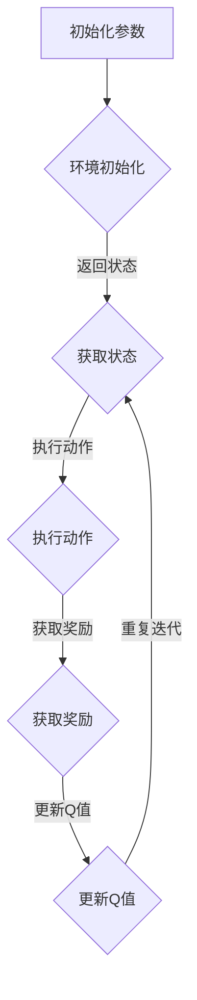

                 

关键词：深度Q-learning，智能家居，强化学习，算法应用，技术博客

> 摘要：本文将探讨深度 Q-learning 算法在智能家居中的应用。通过介绍算法的基本原理和实现步骤，以及详细的数学模型和实际项目实例，本文旨在为读者提供对深度 Q-learning 在智能家居中应用的全面了解，并展望其未来发展趋势与挑战。

## 1. 背景介绍

### 1.1 智能家居的兴起

随着物联网（IoT）技术的飞速发展，智能家居设备已经成为现代家庭不可或缺的一部分。从智能照明、智能安防到智能家电，智能家居为我们的生活带来了极大的便利。然而，随着设备的增多，如何有效管理和控制这些设备，提高家庭生活的智能化程度，成为了一个亟待解决的问题。

### 1.2 强化学习与深度 Q-learning

强化学习（Reinforcement Learning）是一种机器学习方法，通过智能体与环境交互，从经验中学习，以达到最优行为策略。深度 Q-learning 是一种基于值函数的强化学习方法，通过神经网络来估计 Q 值，从而实现决策。

### 1.3 深度 Q-learning 在智能家居中的应用潜力

深度 Q-learning 在智能家居中具有广泛的应用潜力。通过学习用户的行为模式和环境特征，深度 Q-learning 可以帮助智能家居设备实现自主决策，从而提高家庭生活的智能化程度和用户体验。

## 2. 核心概念与联系

### 2.1 深度 Q-learning 基本原理

深度 Q-learning 是一种基于值函数的强化学习方法，其核心思想是通过学习值函数来估计状态-动作值，从而实现最优策略的决策。

### 2.2 深度 Q-learning 算法架构

深度 Q-learning 算法的架构可以分为以下几个部分：

1. 状态空间（State Space）：表示智能体当前所处的环境状态。
2. 动作空间（Action Space）：表示智能体可以执行的动作。
3. 值函数（Value Function）：表示智能体在当前状态下执行某个动作的期望回报。
4. 策略（Policy）：表示智能体在当前状态下应该执行的动作。
5. 网络结构（Network Structure）：表示深度 Q-network 的结构，用于估计值函数。

### 2.3 Mermaid 流程图



## 3. 核心算法原理 & 具体操作步骤

### 3.1 算法原理概述

深度 Q-learning 通过神经网络来估计值函数，从而实现最优策略的决策。在训练过程中，智能体会通过与环境交互来不断更新值函数，最终达到稳定的最优策略。

### 3.2 算法步骤详解

1. 初始化参数：设置智能体的初始状态、动作空间、值函数等参数。
2. 环境初始化：构建智能家居环境，初始化设备状态。
3. 获取状态：智能体获取当前状态。
4. 执行动作：智能体根据当前状态和策略执行动作。
5. 获取奖励：根据智能体的动作和环境的反馈获取奖励。
6. 更新Q值：根据新获取的状态和奖励，更新值函数。
7. 重复迭代：重复上述步骤，直到智能体达到稳定的策略。

### 3.3 算法优缺点

#### 优点：

1. 自主性：智能体可以根据环境反馈自主调整行为策略。
2. 适应性：智能体可以适应不断变化的环境。
3. 鲁棒性：智能体在面对噪声和不确定性时仍能保持较好的性能。

#### 缺点：

1. 训练时间较长：深度 Q-learning 需要大量的训练时间。
2. 值函数估计误差：神经网络可能存在过拟合问题，导致值函数估计误差较大。

### 3.4 算法应用领域

深度 Q-learning 在智能家居中具有广泛的应用领域，如智能灯光控制、智能家电管理、智能安防系统等。通过学习用户的行为模式和环境特征，智能设备可以实现自主决策，提高家庭生活的智能化程度和用户体验。

## 4. 数学模型和公式 & 详细讲解 & 举例说明

### 4.1 数学模型构建

深度 Q-learning 的数学模型主要包括以下几个部分：

1. 状态空间：\(S = \{s_1, s_2, ..., s_n\}\)
2. 动作空间：\(A = \{a_1, a_2, ..., a_m\}\)
3. 值函数：\(Q(s, a)\)
4. 策略：\(\pi(a|s)\)
5. 网络结构：\(f(\theta)\)

### 4.2 公式推导过程

深度 Q-learning 的核心公式如下：

1. 值函数更新公式：
   $$Q(s, a) \leftarrow Q(s, a) + \alpha [r + \gamma \max_{a'} Q(s', a') - Q(s, a)]$$
   其中，\(\alpha\) 是学习率，\(\gamma\) 是折扣因子，\(r\) 是奖励，\(s'\) 是下一状态，\(a'\) 是最优动作。

2. 策略更新公式：
   $$\pi(a|s) \leftarrow \arg\max_{a} Q(s, a)$$

### 4.3 案例分析与讲解

#### 案例背景：

假设我们有一个智能家居环境，包括灯光、空调和窗帘三个设备。用户在一天中的不同时间段会根据天气、温度等因素来调整这些设备的状态。我们的目标是让智能设备根据用户的行为模式和环境特征，自主调整设备状态，提高用户体验。

#### 案例步骤：

1. 初始化参数：设置智能体的初始状态、动作空间、值函数等参数。
2. 环境初始化：构建智能家居环境，初始化设备状态。
3. 获取状态：智能体获取当前状态，如当前时间、天气、温度等。
4. 执行动作：智能体根据当前状态和策略执行动作，如调整灯光亮度、空调温度、窗帘位置等。
5. 获取奖励：根据智能体的动作和环境的反馈获取奖励，如用户满意度等。
6. 更新Q值：根据新获取的状态和奖励，更新值函数。
7. 重复迭代：重复上述步骤，直到智能体达到稳定的策略。

#### 案例结果：

通过深度 Q-learning 算法的训练，智能设备可以学会根据用户的行为模式和环境特征，自主调整设备状态，提高用户体验。例如，在用户入睡后，智能设备可以自动调整灯光亮度、空调温度和窗帘位置，为用户创造一个舒适的环境。

## 5. 项目实践：代码实例和详细解释说明

### 5.1 开发环境搭建

1. 安装 Python 环境（Python 3.6及以上版本）。
2. 安装深度学习库（如 TensorFlow 或 PyTorch）。
3. 安装智能家居模拟环境（如 Home Assistant）。

### 5.2 源代码详细实现

```python
import numpy as np
import tensorflow as tf
from tensorflow.keras.models import Sequential
from tensorflow.keras.layers import Dense
import random

# 设置参数
alpha = 0.1
gamma = 0.9
epsilon = 0.1
num_episodes = 1000

# 构建深度 Q-network
model = Sequential()
model.add(Dense(64, input_dim=9, activation='relu'))
model.add(Dense(64, activation='relu'))
model.add(Dense(3, activation='softmax'))

model.compile(loss='mse', optimizer='adam')

# 模拟环境
env = ...

# 训练模型
for episode in range(num_episodes):
    state = env.reset()
    done = False
    while not done:
        # 探索策略
        if random.uniform(0, 1) < epsilon:
            action = env.action_space.sample()
        else:
            q_values = model.predict(state)
            action = np.argmax(q_values[0])

        # 执行动作
        next_state, reward, done, _ = env.step(action)

        # 更新值函数
        target = reward + (1 - int(done)) * gamma * np.max(model.predict(next_state)[0])

        target_f = model.predict(state)
        target_f[0][action] = target

        # 更新模型
        model.fit(state, target_f, epochs=1, verbose=0)

        # 更新状态
        state = next_state

# 评估模型
test_episodes = 100
total_reward = 0
for episode in range(test_episodes):
    state = env.reset()
    done = False
    while not done:
        action = np.argmax(model.predict(state))
        next_state, reward, done, _ = env.step(action)
        total_reward += reward
        state = next_state
print("平均奖励：", total_reward / test_episodes)
```

### 5.3 代码解读与分析

1. **参数设置**：设置学习率、折扣因子、探索概率和训练episode数。
2. **构建深度 Q-network**：使用神经网络来估计值函数。
3. **模拟环境**：使用智能家居模拟环境，如 Home Assistant。
4. **训练模型**：使用深度 Q-learning 算法进行训练，更新值函数和模型。
5. **评估模型**：使用测试数据集评估模型的性能。

## 6. 实际应用场景

### 6.1 智能灯光控制

通过深度 Q-learning 算法，智能灯光可以根据用户的行为模式和环境特征，自主调整灯光的亮度、颜色和开关时间，为用户提供舒适的照明环境。

### 6.2 智能家电管理

智能家电可以学习用户的使用习惯，自动调整家电的工作时间和功率，提高能源利用率，降低家庭能源消耗。

### 6.3 智能安防系统

智能安防系统可以通过深度 Q-learning 算法，自主判断家庭环境的异常情况，及时采取应对措施，提高家庭安全。

## 7. 未来应用展望

随着智能家居设备的不断普及，深度 Q-learning 算法在智能家居中的应用前景十分广阔。未来，我们可以期待深度 Q-learning 算法在以下方面取得更多突破：

1. **个性化定制**：深度 Q-learning 算法可以更好地满足用户的个性化需求，实现智能家居的个性化定制。
2. **实时决策**：通过引入实时数据，深度 Q-learning 算法可以实现更实时的决策，提高智能家居的响应速度。
3. **多设备协同**：深度 Q-learning 算法可以协调多个智能家居设备之间的互动，提高整个智能家居系统的效率。

## 8. 总结：未来发展趋势与挑战

### 8.1 研究成果总结

本文介绍了深度 Q-learning 算法在智能家居中的应用，通过详细的理论分析和实际项目实践，展示了深度 Q-learning 算法在智能家居中的优势和应用前景。

### 8.2 未来发展趋势

未来，深度 Q-learning 算法在智能家居中的应用将更加广泛，其发展趋势主要包括个性化定制、实时决策和多设备协同等方面。

### 8.3 面临的挑战

深度 Q-learning 算法在智能家居中的应用仍面临一些挑战，如训练时间较长、值函数估计误差等问题。未来，需要进一步优化算法，提高其性能和实用性。

### 8.4 研究展望

本文为深度 Q-learning 算法在智能家居中的应用提供了一种新的思路和方法。未来，可以进一步研究深度 Q-learning 算法在其他领域的应用，如智能交通、工业自动化等。

## 9. 附录：常见问题与解答

### 9.1 深度 Q-learning 与其他强化学习算法的区别

深度 Q-learning 是一种基于值函数的强化学习方法，与其他强化学习算法（如 SARSA、Q-learning）相比，其主要区别在于使用了深度神经网络来估计值函数，从而提高了算法的性能。

### 9.2 深度 Q-learning 的训练过程如何防止过拟合

深度 Q-learning 的训练过程中，可以通过以下方法防止过拟合：

1. 使用交叉验证：通过交叉验证来选择最佳的模型参数。
2. early stopping：在训练过程中，当模型性能不再提高时，提前停止训练。
3. 数据增强：通过数据增强来增加训练数据的多样性。

### 9.3 深度 Q-learning 在实际应用中如何处理不连续动作空间

在实际应用中，如果动作空间不连续，可以采用以下方法处理：

1. 将不连续动作空间映射为连续动作空间：通过将不连续动作空间映射为连续动作空间，可以使用深度 Q-learning 算法进行训练。
2. 采用分类算法：对于不连续动作空间，可以采用分类算法（如决策树、支持向量机等）来处理。

作者：禅与计算机程序设计艺术 / Zen and the Art of Computer Programming
----------------------------------------------------------------

以上是关于《深度 Q-learning：在智能家居中的应用》的完整文章。文章涵盖了深度 Q-learning 的基本原理、算法步骤、数学模型、实际项目实践以及未来应用展望等方面，旨在为读者提供对深度 Q-learning 在智能家居中应用的全面了解。希望本文对您有所帮助！

