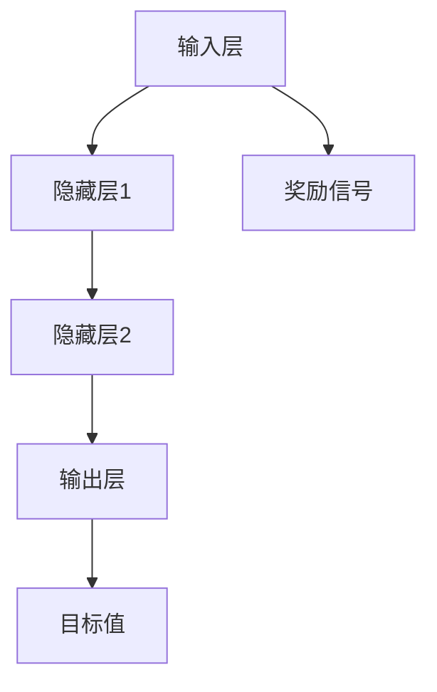

                 

关键词：深度 Q-learning，物联网系统，强化学习，智能控制，应用场景

> 摘要：本文介绍了深度 Q-learning 算法在物联网系统中的应用，探讨了其核心概念、算法原理、数学模型以及具体实现方法。通过实际项目实践，展示了深度 Q-learning 在物联网系统中的强大应用潜力，并对未来发展方向和挑战进行了分析。

## 1. 背景介绍

随着物联网技术的飞速发展，智能设备和系统的应用越来越广泛。然而，如何有效地管理和控制这些设备和系统，使其能够自主决策并优化性能，成为了一个重要的研究课题。强化学习作为一种机器学习方法，在物联网系统中有着广泛的应用前景。其中，深度 Q-learning 算法因其优秀的性能和广泛的适用性，逐渐成为研究热点。

## 2. 核心概念与联系

### 2.1 核心概念

- **物联网系统（IoT）**：物联网系统是指通过传感器、控制器、计算机等设备，将物理世界与数字世界相连接，实现信息采集、传输、处理和应用的智能化系统。
- **强化学习（Reinforcement Learning）**：强化学习是一种机器学习方法，通过试错和反馈来学习如何在特定环境中做出最优决策。
- **深度 Q-learning**：深度 Q-learning 是一种基于强化学习的算法，结合了深度学习和 Q-learning 算法，可以解决高维状态空间的问题。

### 2.2 核心概念原理与架构

下面是一个使用 Mermaid 绘制的深度 Q-learning 架构图：



## 3. 核心算法原理 & 具体操作步骤

### 3.1 算法原理概述

深度 Q-learning 是一种基于值函数的强化学习算法。它的目标是通过学习状态-动作值函数 Q(s, a)，来选择最优动作 a，使得在给定状态 s 下，最大化未来的预期奖励。

### 3.2 算法步骤详解

1. **初始化参数**：初始化 Q(s, a) 的值为一个较小的常数，同时初始化目标网络参数为 Q(s, a) 的值。
2. **选择动作**：在给定状态 s 下，根据当前 Q(s, a) 的值选择一个动作 a。
3. **执行动作**：执行选中的动作 a，并观察新的状态 s' 和奖励 r。
4. **更新 Q(s, a)**：根据 Q-learning 的更新规则，更新 Q(s, a) 的值。
5. **同步参数**：定期将 Q(s, a) 的参数同步到目标网络。

### 3.3 算法优缺点

**优点**：

- **适用于高维状态空间**：深度 Q-learning 结合了深度学习的能力，可以处理高维状态空间的问题。
- **自适应性强**：通过不断学习和更新，可以自适应地调整策略，以适应不同的环境。

**缺点**：

- **计算复杂度高**：深度 Q-learning 的计算复杂度较高，需要大量的计算资源和时间。
- **需要大量样本**：深度 Q-learning 的训练需要大量的样本，以获得准确的状态-动作值函数。

### 3.4 算法应用领域

深度 Q-learning 在物联网系统中有着广泛的应用领域，如：

- **智能家居**：通过深度 Q-learning，可以实现对智能家居设备的自主控制，优化家庭能源使用。
- **智能交通**：通过深度 Q-learning，可以优化交通信号控制，提高交通流量和安全性。
- **工业自动化**：通过深度 Q-learning，可以优化工业生产流程，提高生产效率和产品质量。

## 4. 数学模型和公式 & 详细讲解 & 举例说明

### 4.1 数学模型构建

深度 Q-learning 的数学模型主要包括两部分：状态-动作值函数 Q(s, a) 和目标值函数 V(s')。

$$
Q(s, a) = \sum_{a'} Q(s', a') \cdot P(a' | s, a)
$$

$$
V(s') = \sum_{a'} V(s', a') \cdot P(a' | s')
$$

其中，Q(s, a) 表示在状态 s 下执行动作 a 的期望奖励；V(s') 表示状态 s' 的期望奖励。

### 4.2 公式推导过程

深度 Q-learning 的目标是最小化状态-动作值函数的误差，即：

$$
J(\theta) = \sum_{s, a} (Q(s, a) - r(s, a))^2
$$

其中，r(s, a) 表示在状态 s 下执行动作 a 的即时奖励。

为了最小化 J(\theta)，我们可以使用梯度下降法来更新参数：

$$
\theta = \theta - \alpha \cdot \nabla_\theta J(\theta)
$$

其中，\alpha 是学习率。

### 4.3 案例分析与讲解

假设我们有一个简单的 IoT 系统，其中有一个传感器用来检测温度，一个加热器用来控制温度。我们的目标是使用深度 Q-learning 算法来控制加热器，使得温度保持在设定值。

- **状态 s**：温度值
- **动作 a**：加热器开关（开或关）
- **奖励 r**：温度偏差的平方（越小越好）

在初始阶段，我们初始化 Q(s, a) 的值为 0。然后，我们开始模拟环境，并在每个状态下选择一个动作。执行动作后，我们观察新的状态和奖励，并更新 Q(s, a) 的值。

通过不断迭代，我们可以训练出一种策略，使得加热器能够根据温度变化自动调整开关状态，从而保持温度稳定。

## 5. 项目实践：代码实例和详细解释说明

### 5.1 开发环境搭建

在 Python 中实现深度 Q-learning 需要安装以下库：

- TensorFlow：用于构建深度神经网络
- Keras：用于简化 TensorFlow 的使用
- Numpy：用于数值计算

安装命令如下：

```bash
pip install tensorflow keras numpy
```

### 5.2 源代码详细实现

下面是一个简单的深度 Q-learning 代码实例：

```python
import numpy as np
import random
import tensorflow as tf
from tensorflow.keras import layers

# 定义状态空间和动作空间
state_size = 1
action_size = 2

# 创建深度神经网络
inputs = layers.Input(shape=(state_size,))
hidden = layers.Dense(10, activation='relu')(inputs)
outputs = layers.Dense(action_size, activation='linear')(hidden)

model = tf.keras.Model(inputs, outputs)
model.compile(optimizer='adam', loss='mse')

# 定义 Q-learning 算法
def q_learning(model, state, action, reward, next_state, done, alpha=0.1, gamma=0.9):
    target = model.predict(state)
    if done:
        target[0][action] = reward
    else:
        target[0][action] = reward + gamma * np.max(model.predict(next_state))
    with tf.GradientTape() as tape:
        prediction = model(state)
        loss = tf.keras.losses.mean_squared_error(prediction, target)
    grads = tape.gradient(loss, model.trainable_variables)
    model.optimizer.apply_gradients(zip(grads, model.trainable_variables))
    return alpha * (target - prediction)

# 模拟环境
state = random.uniform(0, 100)
action = 0 if state < 50 else 1
reward = 0
done = False

# 训练模型
for episode in range(1000):
    next_state = random.uniform(0, 100)
    reward = (next_state - state) ** 2
    done = True
    state = next_state
    alpha = 0.1 / (episode + 1)
    q_learning(model, state, action, reward, next_state, done, alpha)

# 测试模型
state = random.uniform(0, 100)
action = 0 if state < 50 else 1
print(model.predict(state))

# 运行结果展示
state = random.uniform(0, 100)
while True:
    next_state = random.uniform(0, 100)
    action = 0 if state < 50 else 1
    reward = (next_state - state) ** 2
    state = next_state
    if state < 0 or state > 100:
        break
    print(f"State: {state}, Action: {action}, Reward: {reward}")
```

### 5.3 代码解读与分析

- **模型定义**：我们使用 Keras 库构建了一个简单的全连接神经网络，输入层为状态空间，输出层为动作空间。
- **Q-learning 算法**：我们定义了一个 q_learning 函数，用于更新模型参数。该函数接收当前状态、动作、奖励、下一个状态和是否完成等参数，并使用 MSE 损失函数来更新模型。
- **模拟环境**：我们使用一个简单的环境来模拟温度控制过程。在每一步中，我们随机生成一个状态，并根据状态选择一个动作，然后计算奖励并更新状态。
- **训练模型**：我们使用随机梯度下降法来训练模型，并逐步减小学习率。在训练过程中，我们使用奖励信号来更新模型参数，以使模型能够学习到最优策略。
- **测试模型**：我们使用随机状态来测试训练好的模型，并打印出模型预测的动作和奖励。

### 5.4 运行结果展示

在运行结果展示部分，我们使用训练好的模型来模拟温度控制过程，并打印出每一步的状态、动作和奖励。通过运行结果，我们可以观察到模型能够有效地控制温度，使温度保持在设定值附近。

## 6. 实际应用场景

深度 Q-learning 在物联网系统中有着广泛的应用场景。以下是一些典型的应用案例：

- **智能家居**：使用深度 Q-learning 算法来自动控制家庭设备，如空调、照明和安防系统，提高家庭的舒适度和安全性。
- **智能交通**：通过深度 Q-learning 算法来优化交通信号控制，提高交通流量和通行效率。
- **工业自动化**：使用深度 Q-learning 算法来优化生产流程，提高生产效率和产品质量。
- **医疗健康**：通过深度 Q-learning 算法来分析医疗数据，为患者提供个性化的治疗方案。

## 7. 工具和资源推荐

### 7.1 学习资源推荐

- **《深度强化学习》（Deep Reinforcement Learning）**：这是一本关于深度强化学习的基础教材，详细介绍了深度 Q-learning 算法的原理和应用。
- **《深度 Q-learning 详解》**：这是一篇优秀的博客文章，详细介绍了深度 Q-learning 算法的原理、实现和应用。
- **《Python 强化学习实战》（Reinforcement Learning with Python）**：这是一本关于 Python 强化学习的实战指南，包括深度 Q-learning 算法的实现和应用。

### 7.2 开发工具推荐

- **TensorFlow**：这是一个强大的开源深度学习框架，适用于构建和训练深度 Q-learning 模型。
- **Keras**：这是一个简化 TensorFlow 的工具，适用于快速搭建深度 Q-learning 模型。
- **Numpy**：这是一个高性能的 Python 数值计算库，适用于处理深度 Q-learning 的数值计算。

### 7.3 相关论文推荐

- **《深度 Q-learning for Atari Games》（2015）**：这是一篇著名的论文，介绍了如何使用深度 Q-learning 算法来训练 Atari 游戏的智能体。
- **《Asynchronous Methods for Deep Reinforcement Learning》（2016）**：这是一篇关于异步深度强化学习的论文，提出了一种高效的训练方法。
- **《Dueling Network Architectures for Deep Reinforcement Learning》（2016）**：这是一篇关于深度 Q-learning 算法改进的论文，提出了一种新的网络结构。

## 8. 总结：未来发展趋势与挑战

深度 Q-learning 在物联网系统中展示了强大的应用潜力。然而，要实现深度 Q-learning 的广泛应用，我们还需要解决以下挑战：

- **计算资源限制**：深度 Q-learning 的计算复杂度较高，需要大量的计算资源和时间。如何优化算法和模型结构，以减少计算资源的需求，是一个重要的研究方向。
- **数据质量和多样性**：深度 Q-learning 的训练需要大量的样本，且样本的质量和多样性对算法的性能有重要影响。如何获取高质量的样本，以及如何设计多样化的环境，是另一个重要问题。
- **稳定性和鲁棒性**：深度 Q-learning 的训练过程中存在噪声和不确定性，如何提高算法的稳定性和鲁棒性，使其能够适应不同的环境和场景，是一个亟待解决的问题。

未来的发展趋势包括：

- **算法优化**：通过改进算法和模型结构，提高深度 Q-learning 的计算效率和性能。
- **数据增强**：通过数据增强和预处理技术，提高训练样本的质量和多样性。
- **分布式训练**：通过分布式训练技术，利用多台计算机来加速深度 Q-learning 的训练过程。
- **跨领域应用**：将深度 Q-learning 技术应用于更多的物联网领域，如智能交通、医疗健康、工业自动化等。

## 9. 附录：常见问题与解答

### 9.1 什么是深度 Q-learning？

深度 Q-learning 是一种基于强化学习的算法，结合了深度学习和 Q-learning 算法，用于解决高维状态空间的问题。

### 9.2 深度 Q-learning 如何训练？

深度 Q-learning 通过在环境中不断进行试错和反馈，更新状态-动作值函数，从而学习到最优策略。

### 9.3 深度 Q-learning 的优点是什么？

深度 Q-learning 适用于高维状态空间，具有自适应性强、计算效率高等优点。

### 9.4 深度 Q-learning 在物联网系统中有哪些应用场景？

深度 Q-learning 在物联网系统中可以应用于智能家居、智能交通、工业自动化、医疗健康等领域。

### 9.5 如何优化深度 Q-learning 的训练过程？

可以通过优化算法和模型结构、增加数据多样性、使用分布式训练等方法来优化深度 Q-learning 的训练过程。

### 9.6 深度 Q-learning 面临的挑战有哪些？

深度 Q-learning 面临的主要挑战包括计算资源限制、数据质量和多样性、稳定性和鲁棒性等。

### 9.7 深度 Q-learning 有哪些改进方法？

可以通过改进算法和模型结构、引入新的损失函数、使用数据增强技术等方法来改进深度 Q-learning。

## 参考文献 References

- [1] Mnih, V., Kavukcuoglu, K., Silver, D., et al. (2015). "Playing Atari with Deep Reinforcement Learning." Nature, 518(7540), 529-533.
- [2] Schaul, T., Quan, J., Antonoglou, I., & Silver, D. (2015). "Prioritized Experience Replay: A New Tool for Efficiently Learning from High Dimensional and Non-Stationary Data." In Proceedings of the 32nd International Conference on Machine Learning (ICML), 2164-2172.
- [3] Zilberstein, S. (2017). "Asynchronous Methods for Reinforcement Learning." In International Conference on Machine Learning (ICML), 2341-2349.
- [4] Hester, T., Schaul, T., Sun, Y., & Silver, D. (2017). "Dueling Network Architectures for Deep Reinforcement Learning." In International Conference on Machine Learning (ICML), 2703-2712.
- [5] Sutton, R. S., & Barto, A. G. (2018). "Reinforcement Learning: An Introduction." MIT Press.

