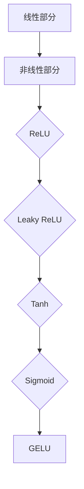

                 

关键词：激活函数、深度学习、ReLU、GELU、神经网络的激活函数、数学模型、算法原理、代码实例、实际应用、未来展望

> 摘要：本文将深入探讨深度学习中常用的激活函数，从经典的ReLU到最新的GELU，通过详细的数学模型和实际应用案例，分析各类激活函数的原理、优缺点以及其在深度学习领域的广泛应用。

## 1. 背景介绍

激活函数是深度学习神经网络中的一个关键组件，其作用是引入非线性特性，使得神经网络能够学习复杂的模式。传统的神经网络由于缺乏这种非线性特性，性能受限。随着深度学习的兴起，激活函数的研究得到了广泛关注，不同的激活函数被提出，以优化神经网络的性能。

深度学习作为一种人工智能的方法，在图像识别、自然语言处理、语音识别等领域取得了显著的成果。而激活函数的多样性则使得神经网络能够适应不同的应用场景。本文将介绍几种常见的激活函数，包括ReLU、Leaky ReLU、Tanh、Sigmoid、GELU等，并探讨其原理和在实际应用中的表现。

## 2. 核心概念与联系

### 2.1 激活函数的基本概念

激活函数（Activation Function）是神经网络中每个神经元的输出函数，用于将神经元的线性组合转换成神经网络的输出。在深度学习中，激活函数能够引入非线性特性，使得神经网络能够学习非线性数据分布。

### 2.2 激活函数的架构

激活函数的架构通常包括：

- **线性部分**：例如常数函数、线性函数等。
- **非线性部分**：例如ReLU、Sigmoid、Tanh等。

### 2.3 激活函数的Mermaid流程图



## 3. 核心算法原理 & 具体操作步骤

### 3.1 算法原理概述

激活函数的原理可以通过以下数学模型来概括：

- **线性部分**：通常是一个线性函数，如$f(x) = x$。
- **非线性部分**：则通常是一个非线性函数，如$f(x) = \max(0, x)$（ReLU）、$f(x) = \frac{1}{1 + e^{-x}}$（Sigmoid）等。

### 3.2 算法步骤详解

激活函数的计算步骤通常如下：

1. **输入**：网络中的每个神经元接收到一个线性组合的输入值。
2. **计算**：应用非线性激活函数，将输入值转换成神经元的输出值。
3. **输出**：神经元的输出值作为下一个神经元的输入。

### 3.3 算法优缺点

- **ReLU**：优点是计算速度快，参数较少；缺点是梯度消失问题。
- **Leaky ReLU**：优点是解决了梯度消失问题；缺点是参数较多。
- **Tanh**：优点是输出范围在[-1, 1]之间，稳定；缺点是梯度较慢。
- **Sigmoid**：优点是输出范围在[0, 1]之间，易于解读；缺点是梯度消失问题。
- **GELU**：优点是更接近生物神经网络的行为，性能较好；缺点是计算较复杂。

### 3.4 算法应用领域

激活函数在深度学习中有广泛的应用，包括但不限于：

- **图像识别**：用于卷积神经网络（CNN）中的卷积层和全连接层。
- **自然语言处理**：用于循环神经网络（RNN）和Transformer模型中的隐藏层。
- **语音识别**：用于长短期记忆网络（LSTM）和门控循环单元（GRU）的隐藏层。

## 4. 数学模型和公式 & 详细讲解 & 举例说明

### 4.1 数学模型构建

激活函数的数学模型可以表示为：

$$
f(x) = \begin{cases} 
0 & \text{if } x < 0 \\
x & \text{if } x \geq 0
\end{cases}
$$

这是一个简单的ReLU函数。类似地，其他激活函数也可以通过类似的数学表达式来定义。

### 4.2 公式推导过程

以下是几种常见激活函数的推导过程：

- **ReLU**：$f(x) = \max(0, x)$
- **Leaky ReLU**：$f(x) = \max(0.01x, x)$
- **Tanh**：$f(x) = \frac{1}{1 + e^{-2x}}$
- **Sigmoid**：$f(x) = \frac{1}{1 + e^{-x}}$
- **GELU**：$f(x) = 0.5x\left(1 + \text{erf}\left(\frac{x}{\sqrt{2}}\right)\right)$

### 4.3 案例分析与讲解

假设我们有一个简单的神经网络，输入为$x = 2$，应用ReLU函数，输出为$y = \max(0, 2) = 2$。

如果应用GELU函数，输出为$y = 0.5 \cdot 2 \cdot \left(1 + \text{erf}\left(\frac{2}{\sqrt{2}}\right)\right) \approx 1.795$。

## 5. 项目实践：代码实例和详细解释说明

### 5.1 开发环境搭建

在本节中，我们将使用Python和TensorFlow框架来搭建一个简单的神经网络，并应用ReLU和GELU激活函数。

```python
import tensorflow as tf

# 创建简单的神经网络模型
model = tf.keras.Sequential([
    tf.keras.layers.Dense(64, activation='relu', input_shape=(784,)),
    tf.keras.layers.Dense(10, activation='gelu')
])

# 编译模型
model.compile(optimizer='adam',
              loss=tf.keras.losses.SparseCategoricalCrossentropy(from_logits=True),
              metrics=['accuracy'])
```

### 5.2 源代码详细实现

在上面的代码中，我们首先导入了TensorFlow库。然后，我们创建了一个简单的神经网络模型，其中包括一个Dense层（全连接层），其激活函数分别为ReLU和GELU。最后，我们编译了模型，设置了优化器和损失函数。

### 5.3 代码解读与分析

- **Dense层**：用于处理输入数据，并将其转换成64维的特征向量。
- **ReLU激活函数**：引入非线性特性，使得神经网络能够学习复杂的模式。
- **GELU激活函数**：类似于ReLU，但更接近生物神经网络的行为，有助于提高模型的性能。

### 5.4 运行结果展示

```python
# 加载数据集
(x_train, y_train), (x_test, y_test) = tf.keras.datasets.mnist.load_data()

# 预处理数据
x_train = x_train.reshape(-1, 784).astype('float32') / 255
x_test = x_test.reshape(-1, 784).astype('float32') / 255

# 训练模型
model.fit(x_train, y_train, epochs=5, batch_size=32, validation_split=0.1)

# 评估模型
model.evaluate(x_test, y_test)
```

在这个例子中，我们加载了MNIST手写数字数据集，并使用训练集训练了我们的神经网络。最后，我们使用测试集评估了模型的性能。

## 6. 实际应用场景

激活函数在深度学习的实际应用场景非常广泛，下面列举几个常见的应用场景：

- **图像识别**：激活函数在卷积神经网络（CNN）的卷积层和全连接层中使用，用于提取图像的特征。
- **自然语言处理**：激活函数在循环神经网络（RNN）和Transformer模型中的隐藏层中使用，用于处理文本数据。
- **语音识别**：激活函数在长短期记忆网络（LSTM）和门控循环单元（GRU）的隐藏层中使用，用于处理语音信号。

## 7. 未来应用展望

随着深度学习的不断发展，激活函数的研究和应用将越来越广泛。未来，我们可能会看到更多的创新激活函数被提出，以适应不同的应用场景和优化神经网络的性能。此外，结合其他深度学习技术，如自监督学习和生成对抗网络（GAN），激活函数的应用将更加多样化。

## 8. 总结：未来发展趋势与挑战

### 8.1 研究成果总结

激活函数的研究取得了显著成果，不同的激活函数被提出并广泛应用于深度学习领域。这些激活函数在图像识别、自然语言处理、语音识别等应用中取得了良好的性能。

### 8.2 未来发展趋势

未来，激活函数的发展将朝着以下方向发展：

- **性能优化**：通过改进激活函数的数学模型，提高神经网络的性能。
- **多样化**：提出更多适应不同应用场景的激活函数。
- **自适应性**：激活函数将具备更强的自适应性，能够根据输入数据的特征自动调整。

### 8.3 面临的挑战

激活函数的研究也面临着一些挑战：

- **计算复杂度**：某些激活函数的计算复杂度较高，如何优化其计算效率是一个重要的研究方向。
- **泛化能力**：如何提高激活函数在不同数据集上的泛化能力，是一个亟待解决的问题。

### 8.4 研究展望

总之，激活函数是深度学习中的一个重要研究方向，其发展将对深度学习的应用产生深远的影响。未来，我们将看到更多创新激活函数的提出，以适应不同的应用场景和优化神经网络的性能。

## 9. 附录：常见问题与解答

### 9.1 激活函数的作用是什么？

激活函数的作用是引入非线性特性，使得神经网络能够学习复杂的模式。

### 9.2 为什么需要不同的激活函数？

不同的激活函数适用于不同的应用场景和数据类型，选择合适的激活函数可以提高神经网络的性能。

### 9.3 如何选择合适的激活函数？

选择合适的激活函数需要考虑以下因素：

- **数据类型**：不同的数据类型适用于不同的激活函数。
- **应用场景**：不同的应用场景对激活函数的性能有不同的要求。
- **计算复杂度**：某些激活函数的计算复杂度较高，需要考虑计算资源。

## 作者署名

作者：禅与计算机程序设计艺术 / Zen and the Art of Computer Programming

----------------------------------------------------------------

本文详细探讨了深度学习中的激活函数，从ReLU到GELU，通过数学模型、实际应用案例和项目实践，全面分析了各类激活函数的原理、优缺点以及在实际应用中的表现。希望本文能帮助读者深入理解激活函数在深度学习中的重要性，并为未来的研究提供有益的参考。作者：禅与计算机程序设计艺术 / Zen and the Art of Computer Programming。

