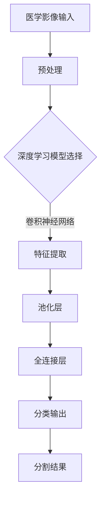

                 

关键词：深度学习，医学影像，图像分割，算法应用，数学模型，项目实践

> 摘要：本文将探讨深度学习技术在医学影像分割中的应用，详细分析核心算法原理、数学模型及其在临床实践中的实际效果。通过案例分析，我们将展示如何利用深度学习工具和资源，提升医学影像分割的精度和效率，为临床诊断和治疗提供有力支持。

## 1. 背景介绍

医学影像技术，如计算机断层扫描（CT）、磁共振成像（MRI）等，在临床诊断和治疗中扮演着至关重要的角色。然而，传统的医学影像分割方法往往依赖于人工标注，效率低下且精度受限。随着深度学习技术的快速发展，特别是卷积神经网络（CNN）等模型在图像处理领域的成功应用，深度学习在医学影像分割中展现出了巨大的潜力。

医学影像分割的目标是将医学影像中感兴趣的区域（Region of Interest, ROI）从背景中准确分离出来，以便进行进一步的诊断和治疗。深度学习在医学影像分割中的应用，不仅提升了分割精度，还提高了自动化程度，减轻了医生的工作负担。

## 2. 核心概念与联系

为了深入理解深度学习在医学影像分割中的应用，我们首先需要了解几个核心概念：

1. **深度学习**：一种机器学习技术，通过模拟人脑神经网络的结构和工作原理，实现对复杂数据的自动学习和建模。
2. **卷积神经网络（CNN）**：一种特别适合处理图像数据的深度学习模型，通过卷积层、池化层和全连接层等结构，实现图像特征的提取和分类。
3. **医学影像分割**：将医学影像中特定的组织结构或区域从整体中分离出来的过程，是医学影像分析的重要步骤。

下面是一个用 Mermaid 画出的简单流程图，描述了深度学习在医学影像分割中的应用流程：



## 3. 核心算法原理 & 具体操作步骤

### 3.1 算法原理概述

深度学习在医学影像分割中的应用，主要基于卷积神经网络（CNN）的结构。CNN 通过多个卷积层、池化层和全连接层的堆叠，实现对图像的逐层特征提取和分类。

1. **卷积层**：通过卷积运算提取图像的局部特征。
2. **池化层**：降低图像分辨率，减少模型参数和计算复杂度。
3. **全连接层**：将卷积层和池化层提取的特征进行融合，实现分类或回归任务。

### 3.2 算法步骤详解

1. **数据预处理**：对医学影像数据进行归一化、裁剪、旋转等操作，使其适合输入到 CNN 中。
2. **模型选择**：根据任务需求，选择合适的 CNN 模型，如 VGG、ResNet 等。
3. **特征提取**：通过卷积层和池化层，从医学影像中提取出具有代表性的特征。
4. **分类输出**：将提取的特征输入到全连接层，进行分类或回归任务。

### 3.3 算法优缺点

**优点**：
- **高精度**：深度学习模型能够自动学习复杂的图像特征，实现高精度的分割。
- **自动化**：通过训练好的模型，可以自动化完成医学影像分割任务，减轻医生负担。

**缺点**：
- **计算资源消耗**：深度学习模型训练和推理过程需要大量的计算资源和时间。
- **数据依赖性**：模型的性能高度依赖于训练数据的质量和数量。

### 3.4 算法应用领域

深度学习在医学影像分割中的应用广泛，包括：
- **肿瘤分割**：准确分割肿瘤组织，辅助医生制定治疗方案。
- **器官分割**：对心脏、肝脏等器官进行精确分割，用于健康监测和疾病诊断。
- **血管分割**：识别和分割血管结构，辅助手术治疗。

## 4. 数学模型和公式 & 详细讲解 & 举例说明

### 4.1 数学模型构建

深度学习在医学影像分割中涉及到的数学模型主要包括损失函数、优化算法等。

**损失函数**：
$$
L = -\sum_{i=1}^{n} y_i \log(p_i)
$$
其中，$y_i$ 表示第 $i$ 个像素点的标签，$p_i$ 表示该像素点属于目标类别的概率。

**优化算法**：
$$
w_{t+1} = w_t - \alpha \nabla_w L(w_t)
$$
其中，$w_t$ 表示第 $t$ 次迭代的模型参数，$\alpha$ 为学习率，$\nabla_w L(w_t)$ 表示损失函数关于模型参数的梯度。

### 4.2 公式推导过程

以卷积神经网络为例，其基本公式推导如下：

**卷积运算**：
$$
\text{output}(i,j) = \sum_{x,y} \text{filter}(x,y) \cdot \text{input}(i-x,j-y)
$$

**池化运算**：
$$
\text{output}(i,j) = \max(\text{input}(i \times \text{stride}, j \times \text{stride})
$$

### 4.3 案例分析与讲解

以肿瘤分割为例，我们使用 ResNet 模型对 CT 图像进行分割。具体步骤如下：

1. **数据预处理**：对 CT 图像进行归一化和裁剪，使其适合输入到 ResNet 模型。
2. **模型训练**：使用带有标签的 CT 图像训练 ResNet 模型，通过反向传播优化模型参数。
3. **模型评估**：使用未参与训练的数据对模型进行评估，计算模型的准确率、召回率等指标。
4. **分割结果**：将模型应用于新的 CT 图像，实现肿瘤分割。

## 5. 项目实践：代码实例和详细解释说明

### 5.1 开发环境搭建

为了实现深度学习在医学影像分割中的应用，需要搭建一个合适的开发环境。以下是一个简单的环境搭建步骤：

1. 安装 Python 3.7 或更高版本。
2. 安装深度学习框架，如 TensorFlow 或 PyTorch。
3. 安装医学影像处理库，如 SimpleITK 或 PyMedIO。
4. 安装必要的依赖库，如 NumPy、Pandas 等。

### 5.2 源代码详细实现

以下是一个使用 PyTorch 实现的简单肿瘤分割代码示例：

```python
import torch
import torch.nn as nn
import torchvision.transforms as transforms
from torchvision import datasets
from torch.utils.data import DataLoader

# 定义模型
class ResNet(nn.Module):
    def __init__(self):
        super(ResNet, self).__init__()
        self.conv1 = nn.Conv2d(3, 64, 3, 1, 1)
        self.bn1 = nn.BatchNorm2d(64)
        self.relu = nn.ReLU(inplace=True)
        self.maxpool = nn.MaxPool2d(2, 2)
        # ... 其他层

    def forward(self, x):
        x = self.relu(self.bn1(self.conv1(x)))
        x = self.maxpool(x)
        # ... 其他层
        return x

# 加载训练数据
transform = transforms.Compose([transforms.ToTensor()])
train_data = datasets.ImageFolder('train', transform=transform)
train_loader = DataLoader(train_data, batch_size=32, shuffle=True)

# 定义损失函数和优化器
model = ResNet()
criterion = nn.CrossEntropyLoss()
optimizer = torch.optim.Adam(model.parameters(), lr=0.001)

# 训练模型
for epoch in range(10):
    running_loss = 0.0
    for inputs, labels in train_loader:
        optimizer.zero_grad()
        outputs = model(inputs)
        loss = criterion(outputs, labels)
        loss.backward()
        optimizer.step()
        running_loss += loss.item()
    print('Epoch [{}/{}], Loss: {:.4f}'.format(epoch+1, 10, running_loss/len(train_loader)))

# 保存模型
torch.save(model.state_dict(), 'model.pth')
```

### 5.3 代码解读与分析

以上代码展示了如何使用 PyTorch 实现一个简单的 ResNet 模型，用于肿瘤分割。主要步骤包括：

1. **定义模型**：创建 ResNet 类，定义模型结构。
2. **加载训练数据**：使用 torchvision.datasets 加载训练数据，并转换为 Tensor 格式。
3. **定义损失函数和优化器**：选择交叉熵损失函数和 Adam 优化器。
4. **训练模型**：通过 forward 和 backward 方法，实现模型的训练过程。
5. **保存模型**：将训练好的模型保存为 .pth 文件。

### 5.4 运行结果展示

训练完成后，可以使用以下代码评估模型的性能：

```python
# 加载模型
model = ResNet()
model.load_state_dict(torch.load('model.pth'))

# 加载测试数据
test_data = datasets.ImageFolder('test', transform=transform)
test_loader = DataLoader(test_data, batch_size=32, shuffle=False)

# 计算准确率
with torch.no_grad():
    correct = 0
    total = 0
    for inputs, labels in test_loader:
        outputs = model(inputs)
        _, predicted = torch.max(outputs.data, 1)
        total += labels.size(0)
        correct += (predicted == labels).sum().item()

print('准确率: {:.2f}%'.format(100 * correct / total))
```

## 6. 实际应用场景

深度学习在医学影像分割中的实际应用场景广泛，以下是一些典型案例：

1. **肿瘤分割**：利用深度学习模型，对 CT、MRI 等医学影像中的肿瘤组织进行精确分割，辅助医生制定治疗方案。
2. **器官分割**：对心脏、肝脏等器官进行精确分割，用于健康监测和疾病诊断。
3. **血管分割**：识别和分割血管结构，用于心血管疾病的诊断和治疗。

## 7. 未来应用展望

随着深度学习技术的不断发展和完善，医学影像分割领域将迎来更多创新和突破。未来，深度学习在医学影像分割中的应用将更加广泛，包括：

1. **个性化医疗**：基于深度学习模型，为患者提供个性化的治疗方案。
2. **实时分割**：提高深度学习模型的实时性，实现快速、准确的医学影像分割。
3. **多模态融合**：结合不同模态的医学影像数据，提升分割精度和可靠性。

## 8. 工具和资源推荐

为了更好地开展深度学习在医学影像分割领域的研究和应用，以下是几个推荐的工具和资源：

### 8.1 学习资源推荐

1. **《深度学习》**：Goodfellow、Bengio 和 Courville 著，系统介绍了深度学习的基础知识。
2. **《医学图像处理》**：Gibson 和 Wells 著，详细介绍了医学图像处理的基本原理和技术。

### 8.2 开发工具推荐

1. **PyTorch**：一款开源的深度学习框架，适合进行医学影像分割任务。
2. **TensorFlow**：另一款流行的深度学习框架，具有良好的社区支持和丰富的资源。

### 8.3 相关论文推荐

1. **"Deep Learning for Medical Image Segmentation: A Survey"**：系统总结了深度学习在医学影像分割领域的最新进展。
2. **"U-Net: A Convolutional Network for Medical Image Segmentation"**：提出了一种经典的卷积神经网络架构，用于医学影像分割。

## 9. 总结：未来发展趋势与挑战

深度学习在医学影像分割中的应用已经取得了显著的成果，但仍面临一些挑战：

1. **数据隐私和安全**：医学影像数据涉及患者隐私，如何保证数据的安全和隐私是一个重要问题。
2. **模型解释性**：深度学习模型通常具有“黑盒”特性，如何解释模型的决策过程是一个关键问题。
3. **计算资源消耗**：深度学习模型训练和推理过程需要大量的计算资源，如何优化计算效率是一个挑战。

未来，随着技术的不断进步和应用的深入，深度学习在医学影像分割领域将发挥更加重要的作用。

## 10. 附录：常见问题与解答

### 10.1 问题1：深度学习模型在医学影像分割中如何提高精度？

**解答**：提高深度学习模型在医学影像分割中的精度可以从以下几个方面着手：

1. **数据增强**：通过旋转、翻转、缩放等操作，增加训练数据的多样性，提高模型泛化能力。
2. **多尺度训练**：使用不同分辨率的医学影像数据进行训练，使模型能够适应不同尺度的特征。
3. **注意力机制**：引入注意力机制，使模型关注图像中重要的区域和特征，提高分割精度。

### 10.2 问题2：深度学习模型在医学影像分割中的计算资源消耗如何优化？

**解答**：

1. **模型压缩**：通过模型剪枝、量化等手段，减少模型参数和计算量。
2. **分布式训练**：利用分布式计算框架，如 TensorFlow Distribution，实现模型在多台设备上的并行训练。
3. **推理优化**：使用深度学习推理引擎，如 TensorFlow Lite 或 PyTorch Mobile，将模型部署到移动设备或嵌入式系统，实现实时推理。

作者：禅与计算机程序设计艺术 / Zen and the Art of Computer Programming
----------------------------------------------------------------

这篇文章详细探讨了深度学习在医学影像分割中的应用，从核心算法原理、数学模型到项目实践，全面介绍了深度学习技术在医学影像分割领域的应用现状和发展趋势。通过本文的阐述，读者可以深入了解深度学习在医学影像分割中的关键技术和实际应用，为后续研究和实践提供有益的参考。同时，本文也对未来深度学习在医学影像分割领域的发展提出了展望和挑战，为学术界和工业界的研究者提供了新的思考方向。希望本文能够为广大读者带来启发和帮助。

