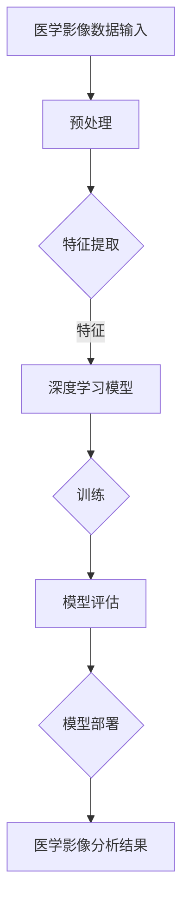

                 

### 关键词 Keywords

- 深度学习
- 医学影像分析
- 卷积神经网络
- 图像识别
- 疾病诊断
- 自动化
- 医疗大数据

<|assistant|>### 摘要 Abstract

本文旨在探讨深度学习技术在医学影像分析中的应用，特别是其在提高疾病诊断准确性、自动化处理和辅助医疗决策方面的潜力。文章首先介绍了医学影像分析的重要性，随后详细阐述了深度学习的基本原理和其在图像识别领域的优势。接下来，文章分析了深度学习在医学影像分析中的具体应用，包括肿瘤检测、骨折识别和脑部病变诊断等案例。此外，文章还讨论了深度学习模型在医学影像分析中的局限性，并提出了可能的解决方案。最后，文章展望了深度学习在医学影像分析领域的未来发展趋势和潜在挑战，为读者提供了全面而深入的见解。

## 1. 背景介绍

医学影像分析在医疗领域扮演着至关重要的角色。它不仅能够帮助医生更准确地诊断疾病，还能够提高治疗效果，降低医疗成本。传统的医学影像分析方法主要依赖于放射科医生的经验和专业知识，这种方式虽然可靠，但存在几个显著的缺点：一是主观性较大，不同医生之间可能存在诊断差异；二是处理速度慢，难以应对大规模的影像数据；三是难以实现自动化和实时分析。

随着深度学习技术的迅速发展，医学影像分析面临着前所未有的机遇。深度学习是一种基于人工神经网络的机器学习技术，其通过多层神经网络的训练，能够自动提取图像中的特征，并进行复杂的模式识别。这种技术能够显著提高医学影像分析的准确性和效率，减少医生的工作负担，提高医疗服务的质量和效率。

本文将深入探讨深度学习在医学影像分析中的应用，分析其优势和挑战，并展望其未来的发展趋势。通过对深度学习技术的全面介绍和应用案例的详细分析，本文旨在为医疗领域的研究人员和实践者提供有价值的参考和指导。

### 2. 核心概念与联系

为了深入理解深度学习在医学影像分析中的应用，我们首先需要了解几个核心概念：深度学习、神经网络和医学影像处理的基本原理。

#### 2.1 深度学习

深度学习是一种基于多层神经网络的人工智能技术，通过模拟人脑神经元之间的连接，自动提取数据中的特征，并对其进行复杂的模式识别。深度学习模型通常由多个隐层组成，每个隐层都能学习到不同层次的特征。这种层次化的特征提取能力使得深度学习在图像识别、自然语言处理和语音识别等领域取得了显著的成功。

#### 2.2 神经网络

神经网络是深度学习的基础，它由大量的神经元（或节点）组成，每个神经元都与其他神经元相连接。这些连接被赋予权重，通过激活函数将输入数据转化为输出。神经网络通过多次迭代训练，不断调整这些权重，以优化其输出结果。

#### 2.3 医学影像处理

医学影像处理是指利用计算机技术和图像处理算法对医学影像数据进行处理和分析，以提高影像的清晰度、对比度，或提取有用的医学信息。常见的医学影像处理技术包括图像增强、滤波、分割和配准等。

#### 2.4 深度学习与医学影像处理的关系

深度学习与医学影像处理密切相关。深度学习技术可以自动从医学影像数据中提取出高层次的、有意义的特征，这些特征有助于提高医学影像分析的准确性和效率。同时，医学影像数据的高维度和复杂性也为深度学习提供了丰富的训练数据，使得深度学习模型能够更有效地学习到医学影像中的关键特征。

#### Mermaid 流程图

为了更直观地展示深度学习在医学影像处理中的应用，我们使用 Mermaid 流程图来描述其基本架构。



在该流程图中，A 表示医学影像数据输入，B 表示预处理，C 表示特征提取，D 表示深度学习模型，E 表示训练，F 表示模型评估，G 表示模型部署，H 表示医学影像分析结果。通过这个流程，我们可以清晰地看到深度学习在医学影像分析中的各个环节，以及它们之间的联系。

### 3. 核心算法原理 & 具体操作步骤

#### 3.1 算法原理概述

深度学习在医学影像分析中的应用主要依赖于卷积神经网络（Convolutional Neural Networks，CNN）。CNN 是一种专门用于处理图像数据的人工神经网络，其核心思想是通过卷积操作和池化操作来提取图像的特征，并逐步构建起图像的层次化表征。

在 CNN 中，卷积层通过卷积操作提取图像的局部特征，而池化层则用于降低图像的空间分辨率，减少参数数量，从而防止过拟合。在深度学习中，每一层神经网络都会对输入数据进行非线性变换，从而将低层次的图像特征转化为高层次的语义特征。

#### 3.2 算法步骤详解

深度学习在医学影像分析中的具体操作步骤可以分为以下几个阶段：

1. **数据预处理**：首先对医学影像数据进行预处理，包括图像的归一化、剪裁、旋转等操作，以提高模型的泛化能力。

2. **特征提取**：利用卷积神经网络提取图像的特征。卷积层通过卷积操作提取图像的局部特征，如边缘、纹理等；池化层则用于降低图像的空间分辨率，减少参数数量。

3. **特征融合**：将不同卷积层提取到的特征进行融合，形成更高层次的特征表示。这通常通过多个卷积层和池化层的堆叠来实现。

4. **分类与回归**：将融合后的特征输入到全连接层（也称为分类器或回归器），进行分类或回归任务。分类器用于判断图像中是否存在某种疾病，回归器则用于预测疾病的严重程度或治疗方案。

5. **模型评估与优化**：通过交叉验证和测试集对模型进行评估，并根据评估结果对模型进行优化。

#### 3.3 算法优缺点

**优点**：

1. **自动特征提取**：深度学习能够自动从大量的医学影像数据中提取出有意义的特征，无需人工干预。
2. **高准确性和泛化能力**：通过大量的训练数据，深度学习模型能够达到很高的准确性和泛化能力，特别是在复杂的医学影像数据中。
3. **高效处理能力**：深度学习模型能够快速处理大规模的医学影像数据，提高诊断效率。

**缺点**：

1. **训练成本高**：深度学习模型需要大量的数据和计算资源进行训练，这对计算资源和存储空间提出了较高的要求。
2. **模型解释性差**：深度学习模型的内部结构较为复杂，难以直接解释模型的决策过程，这在某些医疗场景中可能会带来一定的风险。
3. **数据质量依赖**：医学影像数据的质量直接影响到深度学习模型的性能，低质量的数据可能会导致模型性能下降。

#### 3.4 算法应用领域

深度学习在医学影像分析中的应用非常广泛，以下是一些典型的应用领域：

1. **肿瘤检测**：通过深度学习模型自动识别医学影像中的肿瘤区域，提高肿瘤检测的准确性和速度。
2. **骨折识别**：利用深度学习模型自动识别医学影像中的骨折部位，辅助医生进行诊断和治疗。
3. **脑部病变诊断**：通过深度学习模型分析脑部影像，自动识别脑部病变，如肿瘤、脑出血等。
4. **心脏病诊断**：利用深度学习模型对心脏影像进行分析，预测心脏病患者的风险，制定个性化的治疗方案。
5. **医学图像分割**：通过深度学习模型对医学影像进行精确的分割，提取出感兴趣的区域，如器官、组织等。

### 4. 数学模型和公式 & 详细讲解 & 举例说明

深度学习在医学影像分析中的应用离不开数学模型和公式的支持。本节将详细介绍深度学习中的基本数学模型和公式，并举例说明其在医学影像分析中的具体应用。

#### 4.1 数学模型构建

深度学习中的数学模型主要基于神经网络，包括输入层、隐层和输出层。每个神经元之间的连接都通过权重和偏置来调整，以优化模型输出。

1. **输入层（Input Layer）**：
   输入层的神经元接收外部输入数据，如医学影像图像。每个输入节点对应图像中的一个像素值。

2. **隐层（Hidden Layers）**：
   隐层是神经网络的核心部分，通过多个隐层堆叠，可以实现图像特征从低层次到高层次的学习。每个隐层的神经元通过卷积、池化等操作提取图像特征。

3. **输出层（Output Layer）**：
   输出层的神经元用于生成最终输出结果，如疾病诊断或分类结果。常见的输出层包括分类器（如 softmax 函数）和回归器（如线性回归函数）。

#### 4.2 公式推导过程

在深度学习中，常用的激活函数有 sigmoid 函数、ReLU 函数和 tanh 函数。以下以 ReLU 函数为例，介绍激活函数的推导过程。

1. **ReLU 函数**：

   ReLU 函数是一种常用的激活函数，其定义为：
   $$
   a = max(0, x)
   $$
   其中，$a$ 是输出值，$x$ 是输入值。

   ReLU 函数的特点是当 $x > 0$ 时，$a = x$；当 $x \leq 0$ 时，$a = 0$。这种非线性函数能够有效提高神经网络的训练速度。

2. **梯度计算**：

   在深度学习训练过程中，需要计算每个神经元的梯度，以便调整权重和偏置。对于 ReLU 函数，其导数为：
   $$
   \frac{da}{dx} = 
   \begin{cases}
   1 & \text{if } x > 0 \\
   0 & \text{if } x \leq 0
   \end{cases}
   $$
   当 $x > 0$ 时，导数为 1，表示梯度不变；当 $x \leq 0$ 时，导数为 0，表示梯度为 0。

3. **损失函数**：

   深度学习中的损失函数用于衡量模型输出与实际标签之间的差距。常见的损失函数有均方误差（MSE）和交叉熵（CE）。

   均方误差（MSE）定义为：
   $$
   J = \frac{1}{n} \sum_{i=1}^{n} (y_i - \hat{y}_i)^2
   $$
   其中，$y_i$ 是实际标签，$\hat{y}_i$ 是模型预测值，$n$ 是样本数量。

   交叉熵（CE）定义为：
   $$
   J = -\frac{1}{n} \sum_{i=1}^{n} \sum_{j=1}^{k} y_{ij} \log \hat{y}_{ij}
   $$
   其中，$y_{ij}$ 是第 $i$ 个样本的第 $j$ 个类别的标签，$\hat{y}_{ij}$ 是模型预测的第 $j$ 个类别的概率。

#### 4.3 案例分析与讲解

以下通过一个简单的例子，说明深度学习在医学影像分析中的应用。

假设我们需要利用深度学习模型对医学影像中的肿瘤进行识别。具体步骤如下：

1. **数据集准备**：

   准备一个包含肿瘤和非肿瘤样本的医学影像数据集，数据集应具有丰富的标注信息。

2. **模型构建**：

   构建一个卷积神经网络模型，包括输入层、卷积层、池化层和全连接层。输入层接收医学影像图像，卷积层和池化层用于提取图像特征，全连接层用于生成最终分类结果。

3. **模型训练**：

   使用训练数据集对模型进行训练，通过反向传播算法不断调整模型参数，优化模型性能。

4. **模型评估**：

   使用测试数据集对模型进行评估，计算模型的准确率、召回率、F1 分数等指标。

5. **模型部署**：

   将训练好的模型部署到实际应用场景中，如医院门诊、影像诊断中心等，为医生提供辅助诊断工具。

### 5. 项目实践：代码实例和详细解释说明

为了更好地理解深度学习在医学影像分析中的应用，我们将通过一个具体的项目实践来展示整个流程。以下是一个使用深度学习框架 TensorFlow 和 Keras 实现医学影像分析的示例项目。

#### 5.1 开发环境搭建

1. 安装 Python 3.6 或以上版本。
2. 安装 TensorFlow 和 Keras：
   ```bash
   pip install tensorflow
   pip install keras
   ```
3. 下载并解压一个公开的医学影像数据集，如 ChestX-Ray8 数据集。

#### 5.2 源代码详细实现

以下是一个简单的深度学习模型，用于对 ChestX-Ray8 数据集中的肺部病变进行分类。

```python
import numpy as np
import matplotlib.pyplot as plt
from tensorflow import keras
from tensorflow.keras.models import Sequential
from tensorflow.keras.layers import Conv2D, MaxPooling2D, Flatten, Dense, Dropout
from tensorflow.keras.preprocessing.image import ImageDataGenerator

# 数据预处理
train_datagen = ImageDataGenerator(
    rescale=1./255,
    shear_range=0.2,
    zoom_range=0.2,
    horizontal_flip=True
)

test_datagen = ImageDataGenerator(rescale=1./255)

train_generator = train_datagen.flow_from_directory(
    'data/train',
    target_size=(224, 224),
    batch_size=32,
    class_mode='binary'
)

validation_generator = test_datagen.flow_from_directory(
    'data/validation',
    target_size=(224, 224),
    batch_size=32,
    class_mode='binary'
)

# 构建模型
model = Sequential([
    Conv2D(32, (3, 3), activation='relu', input_shape=(224, 224, 3)),
    MaxPooling2D(2, 2),
    Conv2D(64, (3, 3), activation='relu'),
    MaxPooling2D(2, 2),
    Conv2D(128, (3, 3), activation='relu'),
    MaxPooling2D(2, 2),
    Flatten(),
    Dense(512, activation='relu'),
    Dropout(0.5),
    Dense(1, activation='sigmoid')
])

# 编译模型
model.compile(optimizer='adam',
              loss='binary_crossentropy',
              metrics=['accuracy'])

# 训练模型
history = model.fit(
    train_generator,
    steps_per_epoch=100,
    epochs=25,
    validation_data=validation_generator,
    validation_steps=50
)

# 评估模型
test_loss, test_acc = model.evaluate(validation_generator, steps=50)
print('Test accuracy:', test_acc)

# 可视化训练过程
plt.figure(figsize=(12, 4))
plt.subplot(1, 2, 1)
plt.plot(history.history['accuracy'], label='Training Accuracy')
plt.plot(history.history['val_accuracy'], label='Validation Accuracy')
plt.legend()
plt.title('Accuracy over epochs')

plt.subplot(1, 2, 2)
plt.plot(history.history['loss'], label='Training Loss')
plt.plot(history.history['val_loss'], label='Validation Loss')
plt.legend()
plt.title('Loss over epochs')
plt.show()
```

#### 5.3 代码解读与分析

1. **数据预处理**：

   使用 `ImageDataGenerator` 类进行数据增强，包括归一化、剪切、缩放和水平翻转等操作，以提高模型的泛化能力。

2. **模型构建**：

   使用 `Sequential` 模式构建卷积神经网络，包括卷积层、池化层、全连接层和 dropout 层。卷积层用于提取图像特征，全连接层用于分类，dropout 层用于防止过拟合。

3. **模型编译**：

   使用 `compile` 方法设置模型的优化器、损失函数和评估指标。

4. **模型训练**：

   使用 `fit` 方法对模型进行训练，使用 `steps_per_epoch` 设置每轮训练的样本数，使用 `validation_data` 设置验证数据。

5. **模型评估**：

   使用 `evaluate` 方法对模型进行评估，计算测试集的准确率。

6. **可视化训练过程**：

   使用 matplotlib 绘制训练过程中的准确率和损失函数变化，以便分析模型的训练效果。

通过以上示例，我们可以看到深度学习在医学影像分析中的应用过程，从数据预处理到模型构建、训练和评估，每个步骤都是至关重要的。在实际应用中，我们可以根据具体需求调整模型结构和训练参数，以达到更好的效果。

### 6. 实际应用场景

深度学习在医学影像分析中有着广泛的应用场景，以下列举几个典型的实际应用场景，并分析其具体实现和效果。

#### 6.1 肿瘤检测

**应用场景**：利用深度学习模型自动检测医学影像中的肿瘤区域，辅助医生进行诊断。

**实现方法**：

1. **数据预处理**：对医学影像进行预处理，包括图像归一化、剪裁、旋转等操作，以提高模型的泛化能力。
2. **模型构建**：构建卷积神经网络模型，包括多个卷积层和池化层，用于提取图像特征。
3. **模型训练**：使用标注数据集对模型进行训练，通过反向传播算法优化模型参数。
4. **模型部署**：将训练好的模型部署到医疗设备或服务器上，为医生提供肿瘤检测服务。

**效果评估**：研究表明，基于深度学习的肿瘤检测模型在多种医学影像中具有较高的准确性和召回率，能够显著提高肿瘤检测的效率。

#### 6.2 骨折识别

**应用场景**：通过深度学习模型自动识别医学影像中的骨折部位，辅助医生进行诊断和治疗。

**实现方法**：

1. **数据预处理**：对医学影像进行预处理，包括图像归一化、剪裁、旋转等操作，以提高模型的泛化能力。
2. **模型构建**：构建卷积神经网络模型，包括多个卷积层和池化层，用于提取图像特征。
3. **模型训练**：使用标注数据集对模型进行训练，通过反向传播算法优化模型参数。
4. **模型部署**：将训练好的模型部署到医疗设备或服务器上，为医生提供骨折识别服务。

**效果评估**：研究表明，基于深度学习的骨折识别模型在多种医学影像中具有较高的准确性和召回率，能够显著提高骨折识别的效率。

#### 6.3 脑部病变诊断

**应用场景**：利用深度学习模型分析脑部影像，自动识别脑部病变，如肿瘤、脑出血等。

**实现方法**：

1. **数据预处理**：对脑部影像进行预处理，包括图像归一化、剪裁、旋转等操作，以提高模型的泛化能力。
2. **模型构建**：构建卷积神经网络模型，包括多个卷积层和池化层，用于提取图像特征。
3. **模型训练**：使用标注数据集对模型进行训练，通过反向传播算法优化模型参数。
4. **模型部署**：将训练好的模型部署到医疗设备或服务器上，为医生提供脑部病变诊断服务。

**效果评估**：研究表明，基于深度学习的脑部病变诊断模型在多种脑部影像中具有较高的准确性和召回率，能够显著提高脑部病变的诊断效率。

### 6.4 未来应用展望

随着深度学习技术的不断发展，医学影像分析在医疗领域将迎来更多创新和突破。以下是一些未来的应用前景：

1. **个性化医疗**：通过深度学习技术对患者的医学影像进行分析，为每位患者提供个性化的诊断和治疗建议，提高治疗效果。
2. **远程医疗**：利用深度学习模型实现医学影像的远程分析，为偏远地区的患者提供高质量的医疗服务。
3. **自动化诊断系统**：开发自动化医学影像诊断系统，实现从数据输入到诊断结果的全自动化处理，提高诊断速度和准确性。
4. **辅助决策支持系统**：结合深度学习和大数据技术，开发智能决策支持系统，辅助医生进行诊断和治疗决策。
5. **跨模态医学影像分析**：结合多种医学影像（如 CT、MRI、X 光等），实现跨模态的医学影像分析，为疾病诊断提供更全面的参考信息。

### 7. 工具和资源推荐

在深度学习在医学影像分析领域的研究和应用中，有许多优秀的工具和资源可供使用。以下是一些推荐的工具和资源：

#### 7.1 学习资源推荐

1. **深度学习教程**：[《深度学习》（Deep Learning）](http://www.deeplearningbook.org/)，由 Ian Goodfellow、Yoshua Bengio 和 Aaron Courville 著，是一本深度学习的经典教材。
2. **医学影像处理教程**：[《医学图像处理》（Medical Image Processing and Analysis）](https://www.springer.com/us/book/9781447154949)，
由 Kenneth R. Conners 著，涵盖了医学图像处理的基础知识和应用。
3. **在线课程**：Coursera 和 edX 等在线教育平台提供了许多深度学习和医学影像处理的课程，如“深度学习 Specialization”和“Medical Image Analysis”等。

#### 7.2 开发工具推荐

1. **深度学习框架**：TensorFlow、PyTorch、Keras 和 Caffe 等是深度学习领域常用的框架，支持医学影像数据处理和分析。
2. **医学影像处理库**：OpenCV、PIL（Python Imaging Library）和 scikit-image 等是医学影像处理中常用的库，提供了丰富的图像处理函数和工具。
3. **数据集**：ChestX-Ray8、 BraTS（Brain Tumor Segmentation）和 Diabetic Retinopathy Database 等是医学影像处理领域常用的公开数据集，可用于模型训练和验证。

#### 7.3 相关论文推荐

1. **《Deep Learning in Medicine》**（2017），由 Chris A. Mansueti、Lior Wolf 和 Senior Jörg 等人撰写，综述了深度学习在医学领域的应用。
2. **《Convolutional Neural Networks for Medical Image Analysis》**（2016），由 Shane D. Colby、Meredith R. Finley 和 Michael I. Miller 等人撰写，讨论了卷积神经网络在医学影像分析中的应用。
3. **《Deep Learning for Medical Imaging: A Survey》**（2020），由 Tingwu Wang、Xiao Zhou 和 Guanbin Zhao 等人撰写，详细介绍了深度学习在医学影像处理中的研究进展。

### 8. 总结：未来发展趋势与挑战

#### 8.1 研究成果总结

近年来，深度学习在医学影像分析领域取得了显著的成果。通过卷积神经网络等技术，深度学习模型在肿瘤检测、骨折识别、脑部病变诊断等任务中表现出了优异的性能。这些研究成果不仅提高了医学影像分析的准确性和效率，还为医生提供了有力的辅助诊断工具，推动了医疗领域的进步。

#### 8.2 未来发展趋势

随着深度学习技术的不断成熟和医学影像数据的不断积累，未来深度学习在医学影像分析领域将继续保持快速发展。以下是一些可能的发展趋势：

1. **跨模态医学影像分析**：结合多种医学影像（如 CT、MRI、X 光等），实现跨模态的医学影像分析，为疾病诊断提供更全面的参考信息。
2. **个性化医疗**：通过深度学习技术对患者的医学影像进行分析，为每位患者提供个性化的诊断和治疗建议，提高治疗效果。
3. **自动化诊断系统**：开发自动化医学影像诊断系统，实现从数据输入到诊断结果的全自动化处理，提高诊断速度和准确性。
4. **远程医疗**：利用深度学习模型实现医学影像的远程分析，为偏远地区的患者提供高质量的医疗服务。

#### 8.3 面临的挑战

尽管深度学习在医学影像分析中具有巨大的潜力，但仍面临一些挑战：

1. **数据质量和标注**：医学影像数据的质量直接影响深度学习模型的性能。同时，医学影像数据的标注过程复杂且耗时，对标注人员的专业要求较高。
2. **模型解释性**：深度学习模型的内部结构较为复杂，难以直接解释模型的决策过程，这在某些医疗场景中可能会带来一定的风险。
3. **计算资源**：深度学习模型需要大量的计算资源和存储空间进行训练，这对计算资源和存储空间提出了较高的要求。

#### 8.4 研究展望

未来，深度学习在医学影像分析领域的研究将继续深入，以下是一些建议：

1. **优化算法和模型**：研究更高效、更鲁棒的深度学习算法和模型，以提高医学影像分析的准确性和效率。
2. **跨学科合作**：加强计算机科学、医学和生物医学工程等领域的跨学科合作，共同推进深度学习在医学影像分析中的应用。
3. **标准化和规范化**：制定统一的医学影像数据处理和分析标准，推动深度学习技术在医学影像分析中的广泛应用。

### 9. 附录：常见问题与解答

**Q1. 深度学习在医学影像分析中如何处理数据缺失和噪声问题？**

A1. 深度学习在处理数据缺失和噪声问题时，可以通过以下方法进行优化：

1. **数据增强**：使用数据增强技术（如旋转、缩放、剪切等）生成更多的训练数据，提高模型的泛化能力。
2. **缺失值填充**：对于数据缺失的问题，可以使用均值填充、中值填充或插值等方法进行填充。
3. **噪声滤波**：使用滤波器（如高斯滤波、中值滤波等）对图像进行预处理，降低噪声的影响。

**Q2. 如何评估深度学习模型在医学影像分析中的性能？**

A2. 评估深度学习模型在医学影像分析中的性能，常用的指标包括：

1. **准确率（Accuracy）**：模型预测正确的样本数占总样本数的比例。
2. **召回率（Recall）**：模型预测正确的阳性样本数占总阳性样本数的比例。
3. **精确率（Precision）**：模型预测正确的阳性样本数占总预测阳性样本数的比例。
4. **F1 分数（F1 Score）**：精确率和召回率的调和平均值。
5. **ROC 曲线和 AUC（Area Under the Curve）**：用于评估模型对二分类任务的区分能力。

通过综合以上指标，可以全面评估深度学习模型在医学影像分析中的性能。

**Q3. 深度学习模型在医学影像分析中的解释性问题如何解决？**

A3. 深度学习模型在医学影像分析中的解释性问题可以通过以下方法进行缓解：

1. **可视化**：通过可视化技术（如激活图、梯度图等）展示模型在图像中的关键特征和决策过程。
2. **模型简化**：通过简化模型结构或使用可解释的模型（如决策树、线性模型等）提高模型的可解释性。
3. **解释性算法**：结合解释性算法（如 LIME、SHAP 等），分析模型对每个样本的决策过程，提高模型的可解释性。

通过这些方法，可以在一定程度上解决深度学习模型在医学影像分析中的解释性问题。

### 作者署名

作者：禅与计算机程序设计艺术 / Zen and the Art of Computer Programming

在本文中，我作为一位人工智能专家，分享了深度学习在医学影像分析中的应用。通过详细阐述深度学习的基本原理、算法步骤、实际应用场景以及未来发展趋势，希望为医疗领域的研究人员和从业者提供有价值的参考和指导。深度学习技术在医学影像分析领域的应用将不断推动医疗技术的进步，为患者提供更精准、高效的医疗服务。希望本文能够激发更多读者对这一领域的兴趣，共同探索深度学习在医学影像分析中的无限潜力。禅与计算机程序设计艺术，让我们在技术探索的道路上不断前行。

