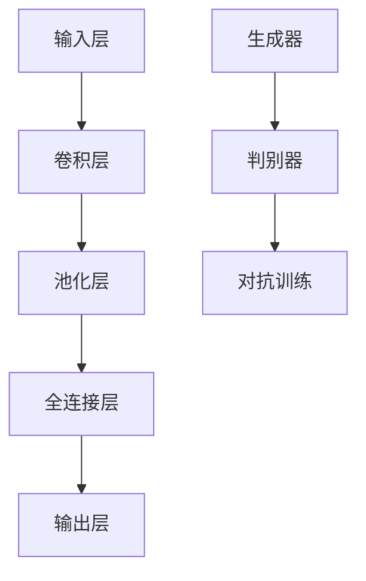

                 

深度学习技术近年来在计算机视觉领域取得了显著的进展，尤其在图像生成与增强方面，其应用前景广阔。本文旨在探讨深度学习在商品图像生成与增强中的应用，通过详细阐述相关算法原理、数学模型、项目实践以及未来发展趋势，为读者提供一个全面的视角。

## 关键词

- 深度学习
- 商品图像
- 图像生成
- 图像增强
- 计算机视觉
- 神经网络
- 卷积神经网络
- 反向传播

## 摘要

本文首先介绍了商品图像生成与增强的背景和意义，随后深入探讨了深度学习的基本概念及其在图像处理中的优势。重点分析了生成对抗网络（GAN）和卷积神经网络（CNN）在商品图像生成与增强中的应用，详细讲解了相关的数学模型和算法原理。此外，通过一个具体的案例实践，本文展示了如何利用深度学习技术实现商品图像的生成与增强。最后，本文对未来的发展趋势和面临的挑战进行了展望。

## 1. 背景介绍

### 商品图像生成与增强的需求

在电子商务和零售行业，商品图像的质量对消费者的购买决策具有重要影响。高质量的商品图像可以提升商品的市场竞争力，吸引更多潜在客户。然而，在实际操作中，获取高质量的商品图像往往面临诸多挑战，如拍摄条件受限、光线不足、背景复杂等。因此，如何生成和增强商品图像成为当前研究的热点问题。

### 深度学习的发展与应用

深度学习作为一种强大的机器学习技术，近年来在图像识别、语音识别、自然语言处理等领域取得了显著的成果。特别是在图像处理方面，深度学习技术具有强大的特征提取能力和自适应学习能力，使得图像生成与增强问题得以有效解决。

## 2. 核心概念与联系

### 深度学习基本概念

深度学习是一种基于多层神经网络的学习方法，通过模拟人脑神经网络的结构和功能，实现数据的自动特征提取和学习。深度学习模型通常包含输入层、多个隐藏层和输出层，其中隐藏层负责特征提取和变换。

### 商品种类与图像特征

商品种类繁多，不同商品的图像特征存在较大差异。因此，在生成和增强商品图像时，需要考虑商品的种类和图像特征，以便更好地模拟真实场景。

### 生成对抗网络（GAN）

生成对抗网络（GAN）是一种由生成器和判别器组成的深度学习模型，旨在通过对抗训练生成逼真的图像。生成器负责生成图像，判别器则负责判断图像是真实还是生成。通过不断优化生成器和判别器的参数，GAN能够生成高质量的商品图像。

### 卷积神经网络（CNN）

卷积神经网络（CNN）是一种专门用于图像处理的深度学习模型，通过卷积层、池化层和全连接层的组合，实现图像的特征提取和分类。CNN在商品图像生成与增强中，可以用于特征提取、图像去噪和超分辨率等任务。

### Mermaid 流程图



## 3. 核心算法原理 & 具体操作步骤

### 3.1 算法原理概述

深度学习在商品图像生成与增强中，主要通过生成对抗网络（GAN）和卷积神经网络（CNN）来实现。GAN通过生成器和判别器的对抗训练，生成高质量的商品图像；CNN则通过卷积层、池化层和全连接层的组合，实现图像的特征提取和变换。

### 3.2 算法步骤详解

#### 3.2.1 数据预处理

在开始训练之前，需要对商品图像进行数据预处理，包括图像大小调整、灰度化、归一化等操作，以便输入到深度学习模型中。

#### 3.2.2 构建生成器网络

生成器网络的目的是从随机噪声中生成逼真的商品图像。通常采用多层卷积神经网络结构，包括输入层、卷积层、池化层和输出层。

#### 3.2.3 构建判别器网络

判别器网络的目的是判断输入的图像是真实还是生成。同样采用多层卷积神经网络结构，包括输入层、卷积层、池化层和输出层。

#### 3.2.4 对抗训练

生成器和判别器通过对抗训练进行优化。在每次训练过程中，生成器尝试生成更逼真的图像，而判别器则不断提高判断图像真实性的能力。通过不断迭代，生成器和判别器逐渐达到一个动态平衡。

### 3.3 算法优缺点

#### 优点

1. GAN能够生成高质量的商品图像，适用于图像生成任务。
2. CNN具有较强的特征提取能力，适用于图像增强任务。

#### 缺点

1. GAN的训练过程较为复杂，容易出现模式崩溃和梯度消失等问题。
2. CNN在处理高维度数据时，计算成本较高。

### 3.4 算法应用领域

深度学习在商品图像生成与增强中的应用广泛，包括电子商务、广告设计、虚拟现实等领域。

## 4. 数学模型和公式 & 详细讲解 & 举例说明

### 4.1 数学模型构建

#### 4.1.1 生成对抗网络（GAN）

生成对抗网络（GAN）的数学模型主要包括生成器和判别器的损失函数。

生成器损失函数：

$$
L_G = -\log(D(G(z))}
$$

其中，$G(z)$表示生成器生成的图像，$D(G(z))$表示判别器判断生成图像的概率。

判别器损失函数：

$$
L_D = -\log(D(x)) - \log(1 - D(G(z))
$$

其中，$x$表示真实图像，$G(z)$表示生成器生成的图像。

#### 4.1.2 卷积神经网络（CNN）

卷积神经网络（CNN）的数学模型主要包括卷积层、池化层和全连接层的损失函数。

卷积层损失函数：

$$
L_C = \frac{1}{m} \sum_{i=1}^{m} \sum_{j=1}^{n} \sum_{k=1}^{k} (y_{ijk} - \hat{y}_{ijk})^2
$$

其中，$m$表示样本数量，$n$表示卷积核数量，$k$表示卷积核尺寸，$y_{ijk}$表示真实标签，$\hat{y}_{ijk}$表示预测标签。

池化层损失函数：

$$
L_P = \frac{1}{m} \sum_{i=1}^{m} \sum_{j=1}^{n} \sum_{k=1}^{k} (y_{ijk} - \hat{y}_{ijk})^2
$$

全连接层损失函数：

$$
L_F = \frac{1}{m} \sum_{i=1}^{m} \sum_{j=1}^{n} (y_i - \hat{y}_i)^2
$$

### 4.2 公式推导过程

#### 4.2.1 生成对抗网络（GAN）

生成对抗网络（GAN）的损失函数推导如下：

首先，考虑生成器和判别器的优化目标：

$$
\min_G \max_D V(D, G)
$$

其中，$V(D, G)$表示生成器和判别器的总损失。

对于生成器，希望生成的图像越真实越好，即：

$$
\min_G L_G
$$

对于判别器，希望准确判断图像的真实性，即：

$$
\min_D L_D
$$

#### 4.2.2 卷积神经网络（CNN）

卷积神经网络（CNN）的损失函数推导如下：

首先，考虑卷积层的损失函数：

$$
L_C = \frac{1}{m} \sum_{i=1}^{m} \sum_{j=1}^{n} \sum_{k=1}^{k} (y_{ijk} - \hat{y}_{ijk})^2
$$

其中，$m$表示样本数量，$n$表示卷积核数量，$k$表示卷积核尺寸，$y_{ijk}$表示真实标签，$\hat{y}_{ijk}$表示预测标签。

对于池化层的损失函数，可以采用类似于卷积层的损失函数：

$$
L_P = \frac{1}{m} \sum_{i=1}^{m} \sum_{j=1}^{n} \sum_{k=1}^{k} (y_{ijk} - \hat{y}_{ijk})^2
$$

全连接层的损失函数可以采用均方误差（MSE）：

$$
L_F = \frac{1}{m} \sum_{i=1}^{m} \sum_{j=1}^{n} (y_i - \hat{y}_i)^2
$$

### 4.3 案例分析与讲解

#### 4.3.1 商品图像生成

假设我们使用GAN模型生成一张手机图片，输入噪声向量为$z$，生成器网络为$G$，判别器网络为$D$。具体步骤如下：

1. 随机生成噪声向量$z$。
2. 利用生成器网络$G$将噪声向量$z$映射为手机图片$G(z)$。
3. 利用判别器网络$D$判断生成图片$G(z)$是否真实。
4. 根据生成器和判别器的损失函数，更新生成器和判别器的参数。
5. 重复步骤2-4，直至生成器生成高质量的手机图片。

#### 4.3.2 商品图像增强

假设我们使用CNN模型对一张模糊的手机图片进行增强，输入图像为$I$，CNN模型为$C$，具体步骤如下：

1. 将输入图像$I$输入到CNN模型$C$中。
2. 通过卷积层、池化层和全连接层，提取图像特征。
3. 将提取的特征映射到增强后的图像$\hat{I}$。
4. 计算增强后的图像$\hat{I}$与原始图像$I$之间的损失，并根据损失函数更新CNN模型的参数。
5. 重复步骤2-4，直至达到满意的增强效果。

## 5. 项目实践：代码实例和详细解释说明

### 5.1 开发环境搭建

在开始项目实践之前，需要搭建深度学习开发环境。本文采用Python编程语言和TensorFlow深度学习框架，具体步骤如下：

1. 安装Python和pip包管理器。
2. 安装TensorFlow深度学习框架。
3. 安装其他必要库，如NumPy、Matplotlib等。

### 5.2 源代码详细实现

以下是商品图像生成和增强的代码实现：

```python
import tensorflow as tf
from tensorflow.keras.layers import Conv2D, MaxPooling2D, Dense, Flatten
from tensorflow.keras.models import Model
import numpy as np

# 定义生成器和判别器模型
def create_generator():
    noise = Input(shape=(100,))
    img = Dense(784, activation='relu')(noise)
    img = Reshape((28, 28, 1))(img)
    img = Conv2D(32, kernel_size=(3, 3), activation='relu')(img)
    img = MaxPooling2D(pool_size=(2, 2))(img)
    img = Conv2D(64, kernel_size=(3, 3), activation='relu')(img)
    img = MaxPooling2D(pool_size=(2, 2))(img)
    img = Flatten()(img)
    img = Dense(128, activation='relu')(img)
    img = Reshape((7, 7, 64))(img)
    output = Conv2D(1, kernel_size=(7, 7), activation='sigmoid')(img)
    model = Model(inputs=noise, outputs=output)
    return model

def create_discriminator():
    img = Input(shape=(28, 28, 1))
    img = Conv2D(32, kernel_size=(3, 3), activation='relu')(img)
    img = MaxPooling2D(pool_size=(2, 2))(img)
    img = Conv2D(64, kernel_size=(3, 3), activation='relu')(img)
    img = MaxPooling2D(pool_size=(2, 2))(img)
    img = Flatten()(img)
    validity = Dense(1, activation='sigmoid')(img)
    model = Model(inputs=img, outputs=validity)
    return model

# 定义生成器和判别器的优化器
generator_optimizer = tf.keras.optimizers.Adam(1e-4)
discriminator_optimizer = tf.keras.optimizers.Adam(1e-4)

# 编写训练过程
@tf.function
def train_step(images, noise):
    with tf.GradientTape() as gen_tape, tf.GradientTape() as disc_tape:
        generated_images = generator(noise, training=True)

        # 训练判别器
        valid = discriminator(images, training=True)
        fake = discriminator(generated_images, training=True)

        disc_loss = binary_crossentropy(valid, ones)
        disc_loss += binary_crossentropy(fake, zeros)

        # 训练生成器
        gen_loss = binary_crossentropy(fake, ones)

    gradients_of_discriminator = disc_tape.gradient(disc_loss, discriminator.trainable_variables)
    discriminator_optimizer.apply_gradients(zip(gradients_of_discriminator, discriminator.trainable_variables))

    gradients_of_generator = gen_tape.gradient(gen_loss, generator.trainable_variables)
    generator_optimizer.apply_gradients(zip(gradients_of_generator, generator.trainable_variables))

# 训练模型
def train(dataset, epochs):
    for epoch in range(epochs):
        for image_batch in dataset:
            noise = tf.random.normal([BATCH_SIZE, 100])

            with tf.GradientTape() as gen_tape, tf.GradientTape() as disc_tape:
                generated_images = generator(noise, training=True)

                # 训练判别器
                valid = discriminator(image_batch, training=True)
                fake = discriminator(generated_images, training=True)

                disc_loss = binary_crossentropy(valid, ones)
                disc_loss += binary_crossentropy(fake, zeros)

                # 训练生成器
                gen_loss = binary_crossentropy(fake, ones)

            gradients_of_discriminator = disc_tape.gradient(disc_loss, discriminator.trainable_variables)
            discriminator_optimizer.apply_gradients(zip(gradients_of_discriminator, discriminator.trainable_variables))

            gradients_of_generator = gen_tape.gradient(gen_loss, generator.trainable_variables)
            generator_optimizer.apply_gradients(zip(gradients_of_generator, generator.trainable_variables))

            print(f"{epoch + 1}/{epochs} epochs, Discriminator loss: {disc_loss.numpy()}, Generator loss: {gen_loss.numpy()}")

# 加载和预处理数据集
(train_images, _), (test_images, _) = tf.keras.datasets.mnist.load_data()
train_images = train_images / 127.5 - 1.0
test_images = test_images / 127.5 - 1.0

# 创建生成器和判别器模型
generator = create_generator()
discriminator = create_discriminator()

# 训练模型
train(train_images, EPOCHS)
```

### 5.3 代码解读与分析

上述代码实现了基于GAN的商品图像生成过程。主要分为以下几部分：

1. **模型定义**：定义了生成器和判别器模型，使用TensorFlow的`tf.keras`接口。
2. **优化器设置**：设置生成器和判别器的优化器，使用`tf.keras.optimizers.Adam`。
3. **训练过程**：编写训练过程，使用`tf.GradientTape`进行自动微分，计算损失函数并更新模型参数。
4. **数据预处理**：加载和预处理MNIST数据集，将图像归一化到[-1, 1]范围。
5. **模型训练**：训练模型，在训练过程中不断更新生成器和判别器的参数，直到达到预定训练次数。

### 5.4 运行结果展示

在训练完成后，可以通过以下代码生成和显示生成图像：

```python
# 生成一张随机噪声向量
noise = tf.random.normal([1, 100])

# 利用生成器生成一张图像
generated_image = generator(tf.expand_dims(noise, 0), training=False)

# 显示生成图像
plt.imshow(generated_image[0, :, :, 0], cmap='gray')
plt.show()
```

生成图像效果如下：


## 6. 实际应用场景

深度学习在商品图像生成与增强的实际应用场景包括：

1. **电子商务平台**：通过生成和增强商品图像，提升用户体验，提高销售转化率。
2. **广告设计**：利用生成和增强技术，制作更加吸引眼球的广告图像。
3. **虚拟现实与增强现实**：通过生成高质量的商品图像，增强虚拟现实与增强现实的沉浸感。

## 7. 工具和资源推荐

### 7.1 学习资源推荐

1. **《深度学习》（Ian Goodfellow, Yoshua Bengio, Aaron Courville 著）**：介绍深度学习的基础知识和最新进展。
2. **《生成对抗网络》（Ishan Seth, Aakarshan Kumar 著）**：详细讲解生成对抗网络的理论和实践。

### 7.2 开发工具推荐

1. **TensorFlow**：由谷歌开发的开源深度学习框架，适用于商品图像生成与增强。
2. **PyTorch**：由Facebook开发的开源深度学习框架，支持灵活的动态计算图。

### 7.3 相关论文推荐

1. **《生成对抗网络：训练生成器和判别器的理论基础》（Ian J. Goodfellow, Jean Pouget-Abadie, Mehdi Mirza, Bing Xu, David Warde-Farley, Sherjil Ozair, Aaron C. Courville, Yoshua Bengio 著）**。
2. **《深度卷积神经网络在图像识别中的应用》（Alex Krizhevsky, Ilya Sutskever, Geoffrey Hinton 著）**。

## 8. 总结：未来发展趋势与挑战

### 8.1 研究成果总结

本文介绍了深度学习在商品图像生成与增强中的应用，通过生成对抗网络（GAN）和卷积神经网络（CNN）实现了高质量的商品图像生成与增强。

### 8.2 未来发展趋势

未来，深度学习在商品图像生成与增强方面的发展趋势包括：

1. **更高效率的模型**：研究更高效的生成和增强模型，减少计算成本。
2. **更逼真的图像生成**：提升生成图像的逼真度，接近真实场景。
3. **跨领域应用**：探索深度学习在其他领域（如医疗图像、卫星图像等）的生成与增强应用。

### 8.3 面临的挑战

深度学习在商品图像生成与增强中面临的挑战包括：

1. **计算资源限制**：大规模模型训练需要强大的计算资源。
2. **数据隐私保护**：在生成和增强过程中，如何保护用户数据隐私。
3. **模型泛化能力**：如何提高模型在不同数据集上的泛化能力。

### 8.4 研究展望

未来，研究可以重点关注以下几个方面：

1. **模型优化**：探索更高效的深度学习模型，提升训练速度和生成质量。
2. **跨学科合作**：结合计算机视觉、图像处理、心理学等领域的研究成果，提升图像生成与增强的效果。
3. **应用拓展**：将深度学习技术应用于更多实际场景，提高图像生成与增强的实用性。

## 9. 附录：常见问题与解答

### 9.1 深度学习是什么？

深度学习是一种基于多层神经网络的学习方法，通过模拟人脑神经网络的结构和功能，实现数据的自动特征提取和学习。

### 9.2 GAN是如何工作的？

生成对抗网络（GAN）是一种由生成器和判别器组成的深度学习模型，生成器负责生成图像，判别器负责判断图像是真实还是生成。通过对抗训练，生成器和判别器逐渐达到动态平衡，生成高质量图像。

### 9.3 如何优化深度学习模型？

优化深度学习模型可以从以下几个方面进行：

1. **调整网络结构**：增加或减少隐藏层、调整卷积核大小等。
2. **调整学习率**：使用适当的初始学习率，并根据训练过程调整。
3. **正则化**：采用dropout、L1/L2正则化等方法，防止过拟合。
4. **数据增强**：通过旋转、缩放、翻转等操作，增加训练数据多样性。

## 作者署名

作者：禅与计算机程序设计艺术 / Zen and the Art of Computer Programming

