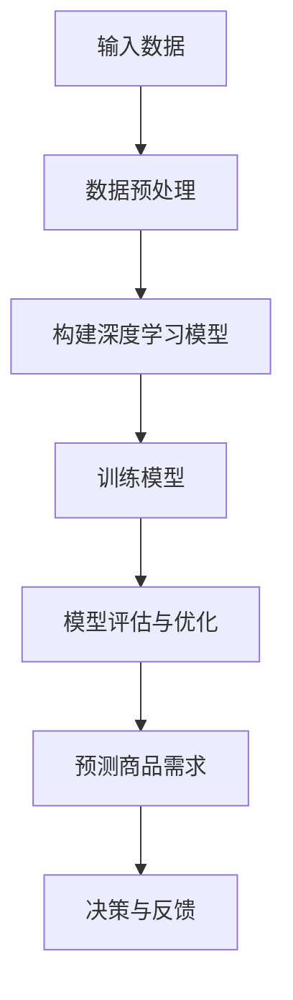

                 

### 关键词

- 深度学习
- 商品需求预测
- 时间序列分析
- 回归模型
- 卷积神经网络

<|assistant|>### 摘要

本文旨在探讨深度学习在商品需求预测领域的应用。通过介绍深度学习的基本概念、相关算法以及实际应用场景，本文将展示如何利用深度学习技术对商品需求进行准确预测。文章将涵盖从数据预处理到模型训练及优化的全过程，并分析深度学习在商品需求预测中的优势和挑战。通过具体案例和代码示例，读者将能够了解如何将深度学习应用于实际问题的解决中。

## 1. 背景介绍

商品需求预测是商业决策的重要环节，它涉及到供应链管理、库存控制和市场营销等多个方面。准确预测商品需求有助于企业优化库存水平，降低库存成本，提高销售业绩。然而，商品需求受到多种因素的影响，如季节性、促销活动、市场趋势等，这使得传统的预测方法常常无法满足实际需求。

传统的方法主要包括时间序列分析和回归分析。时间序列分析通过分析历史数据的时间序列特性，如趋势、季节性和周期性，来预测未来需求。回归分析则通过建立需求与影响因素之间的关系模型，预测未来需求。然而，这些方法往往受限于数据质量和模型复杂度，难以处理非线性和多变量之间的关系。

随着深度学习技术的快速发展，深度神经网络在图像识别、自然语言处理等领域取得了显著成果。深度学习通过多层神经网络结构，能够自动学习数据中的复杂模式和关系，为解决传统方法难以处理的非线性和多变量问题提供了新的思路。因此，深度学习在商品需求预测中的应用逐渐引起了研究者和企业的关注。

## 2. 核心概念与联系

在深入探讨深度学习在商品需求预测中的应用之前，我们需要了解一些核心概念和它们之间的联系。

### 2.1 深度学习的基本概念

深度学习（Deep Learning）是机器学习（Machine Learning）的一种，它通过多层神经网络结构来模拟人脑的思维方式，自动从数据中学习特征和模式。深度学习的基本概念包括：

- **神经网络（Neural Networks）**：神经网络是深度学习的基础，由大量简单的人工神经元（或节点）组成，通过调整节点之间的权重来学习数据中的特征。

- **多层感知器（MLP）**：多层感知器是一种前馈神经网络，包含输入层、隐藏层和输出层。输入层接收外部输入，隐藏层对输入数据进行变换，输出层产生最终输出。

- **反向传播（Backpropagation）**：反向传播是一种训练神经网络的算法，通过计算输出误差并反向传播到网络各层，调整权重和偏置，使得网络能够不断优化。

### 2.2 时间序列分析的概念

时间序列分析（Time Series Analysis）是一种统计方法，用于分析数据随时间变化的规律性。时间序列分析的基本概念包括：

- **时间序列（Time Series）**：时间序列是由一系列按时间顺序排列的数据点组成的序列。

- **自相关性（Autocorrelation）**：自相关性是衡量时间序列数据点之间的相关性的统计指标，用于分析时间序列的周期性。

- **趋势（Trend）**：趋势是时间序列数据的长期变化方向，可以是上升、下降或稳定。

- **季节性（Seasonality）**：季节性是指时间序列数据中的周期性波动，通常与季节变化相关。

### 2.3 深度学习与时间序列分析的联系

深度学习和时间序列分析在商品需求预测中具有紧密的联系。深度学习通过多层神经网络结构，能够自动提取时间序列数据中的复杂特征，如趋势和季节性。同时，深度学习能够处理大量的历史数据，并通过神经网络结构的学习，捕捉数据中的非线性关系。

以下是一个简化的Mermaid流程图，展示了深度学习在商品需求预测中的基本原理和架构：



### 2.4 时间序列数据预处理

在深度学习模型训练之前，对时间序列数据进行预处理是非常关键的。时间序列数据的预处理包括以下步骤：

- **数据清洗**：去除异常值和缺失值，确保数据的质量和一致性。
- **时间序列变换**：对时间序列数据进行标准化或归一化，使得数据具有相似的尺度，有利于模型的训练。
- **特征提取**：提取时间序列数据中的趋势、季节性和周期性特征，为深度学习模型提供有效的输入。

## 3. 核心算法原理 & 具体操作步骤

### 3.1 算法原理概述

在商品需求预测中，深度学习算法的选择至关重要。以下几种深度学习算法在商品需求预测中表现出色：

- **卷积神经网络（CNN）**：卷积神经网络最初设计用于图像识别，但通过适当修改，它可以用于处理时间序列数据。CNN通过卷积层和池化层，能够自动提取数据中的局部特征，并在多层网络中逐渐整合这些特征，从而捕捉时间序列中的复杂模式。

- **长短时记忆网络（LSTM）**：长短时记忆网络是一种特殊的循环神经网络，特别适合处理时间序列数据中的长期依赖问题。LSTM通过门控机制，能够有效记忆和遗忘信息，捕捉时间序列数据中的长期趋势和季节性特征。

- **变换器网络（Transformer）**：变换器网络最初设计用于自然语言处理，但通过调整，它也适用于时间序列预测。变换器网络通过自注意力机制，能够自动关注时间序列中的重要信息，从而提高预测准确性。

### 3.2 算法步骤详解

以下是基于LSTM的深度学习模型在商品需求预测中的具体操作步骤：

#### 3.2.1 数据预处理

1. **数据清洗**：检查数据中是否存在异常值和缺失值，使用插值或均值填充等方法处理缺失值，删除异常值。

2. **时间序列变换**：对时间序列数据进行标准化或归一化，使得数据具有相似的尺度。

3. **特征提取**：提取时间序列数据中的趋势和季节性特征。可以使用移动平均、指数平滑等方法进行预处理，提取周期性特征。

#### 3.2.2 构建深度学习模型

1. **输入层**：输入层接收预处理后的时间序列数据。

2. **隐藏层**：添加多个隐藏层，每个隐藏层包括多个LSTM单元，用于学习时间序列数据中的复杂模式和关系。

3. **输出层**：输出层使用全连接层产生最终的需求预测。

#### 3.2.3 训练模型

1. **数据集划分**：将数据集划分为训练集、验证集和测试集，用于模型的训练和评估。

2. **损失函数**：选择合适的损失函数，如均方误差（MSE），用于评估模型的预测误差。

3. **优化器**：选择合适的优化器，如Adam优化器，用于调整模型参数，最小化损失函数。

4. **训练过程**：使用训练集训练模型，通过验证集调整模型参数，避免过拟合。

#### 3.2.4 模型评估与优化

1. **模型评估**：使用测试集评估模型的预测性能，计算预测误差和评估指标，如MSE和R²。

2. **模型优化**：根据评估结果，调整模型参数和结构，提高模型的预测准确性。

### 3.3 算法优缺点

#### 优点

- **强大的非线性建模能力**：深度学习能够自动提取数据中的复杂特征，捕捉时间序列中的非线性关系。

- **灵活的特征提取**：通过调整网络结构，深度学习可以提取不同层次的特征，适用于多种时间序列预测问题。

- **处理大量数据**：深度学习能够处理大规模的时间序列数据，从而提高预测的准确性。

#### 缺点

- **计算复杂度**：深度学习模型通常需要大量的计算资源，训练时间较长。

- **数据需求**：深度学习对数据质量要求较高，数据清洗和预处理过程复杂。

- **解释性较差**：深度学习模型通常被视为“黑盒子”，其内部决策过程难以解释。

### 3.4 算法应用领域

深度学习在商品需求预测中的应用非常广泛，以下是一些实际应用领域：

- **电子商务**：通过对用户行为数据进行分析，预测商品销量，优化库存管理。

- **供应链管理**：预测原材料需求，优化供应链流程，降低成本。

- **市场营销**：预测广告投放效果，优化营销策略。

- **零售业**：预测商品销售趋势，制定促销策略。

## 4. 数学模型和公式 & 详细讲解 & 举例说明

### 4.1 数学模型构建

在构建深度学习模型时，我们需要定义输入层、隐藏层和输出层的结构。以下是一个简化的数学模型，用于商品需求预测：

#### 输入层

假设我们有一个时间序列数据集 \(X = \{x_1, x_2, ..., x_n\}\)，其中每个 \(x_i\) 是一个 \(d\) 维向量，表示时间 \(i\) 的特征数据。

#### 隐藏层

隐藏层由多个LSTM单元组成，每个单元可以表示为一个函数 \(f_{\theta}^h\)，其中 \(\theta\) 是参数集合。隐藏层输出为 \(h_t = \{h_1^t, h_2^t, ..., h_m^t\}\)，其中 \(h_j^t\) 是第 \(j\) 个LSTM单元在时间 \(t\) 的输出。

#### 输出层

输出层是一个全连接层，其输出为预测的需求 \(y_t\)：

$$
y_t = f_{\theta}^o(h_t)
$$

其中 \(f_{\theta}^o\) 是输出函数，通常是一个线性函数。

### 4.2 公式推导过程

以下是一个简化的LSTM单元的数学公式推导过程：

1. **输入门（Input Gate）**：

$$
i_t = \sigma(W_i \cdot [h_{t-1}, x_t] + b_i)
$$

$$
\gamma_t = \tanh(W_g \cdot [h_{t-1}, x_t] + b_g)
$$

其中，\(W_i\) 和 \(b_i\) 分别是输入门的权重和偏置，\(\sigma\) 是 sigmoid 函数。

2. **遗忘门（Forget Gate）**：

$$
f_t = \sigma(W_f \cdot [h_{t-1}, x_t] + b_f)
$$

3. **细胞状态更新（Cell State Update）**：

$$
C_t = f_t \odot C_{t-1} + i_t \odot \gamma_t
$$

其中，\(\odot\) 表示逐元素乘法。

4. **输出门（Output Gate）**：

$$
o_t = \sigma(W_o \cdot [h_{t-1}, x_t] + b_o)
$$

5. **隐藏状态输出（Hidden State Output）**：

$$
h_t = o_t \odot \tanh(C_t)
$$

其中，\(W_f\)、\(W_i\)、\(W_g\)、\(W_o\) 分别是遗忘门、输入门、更新门和输出门的权重，\(b_f\)、\(b_i\)、\(b_g\)、\(b_o\) 分别是它们的偏置。

### 4.3 案例分析与讲解

以下是一个简单的案例，说明如何使用LSTM模型进行商品需求预测：

#### 数据集

我们假设有一个包含1000个时间点的商品需求数据集，每个时间点的数据包括商品销量、价格、季节性特征等。

#### 模型构建

1. **输入层**：

   输入层有4个特征，分别是销量、价格、季节性和促销活动。

2. **隐藏层**：

   隐藏层有2个LSTM单元，每个单元有50个神经元。

3. **输出层**：

   输出层是一个全连接层，输出一个需求预测值。

#### 模型训练

1. **数据预处理**：

   对数据进行标准化处理，将数据缩放到0-1之间。

2. **模型训练**：

   使用训练集训练模型，设置学习率为0.001，迭代次数为1000次。

3. **模型评估**：

   使用测试集评估模型，计算均方误差（MSE）。

#### 模型预测

1. **输入预处理**：

   将新时间点的数据进行标准化处理。

2. **模型预测**：

   使用训练好的模型进行预测，得到商品需求预测值。

3. **结果分析**：

   分析预测结果与实际需求的差异，调整模型参数，提高预测准确性。

## 5. 项目实践：代码实例和详细解释说明

### 5.1 开发环境搭建

在开始项目实践之前，我们需要搭建一个适合深度学习开发的Python环境。以下是一个基本的开发环境搭建步骤：

1. **安装Python**：

   Python 3.7及以上版本。

2. **安装深度学习库**：

   安装TensorFlow和Keras，可以使用以下命令：

   ```bash
   pip install tensorflow
   pip install keras
   ```

3. **数据预处理库**：

   安装Pandas、NumPy等数据预处理库：

   ```bash
   pip install pandas
   pip install numpy
   ```

### 5.2 源代码详细实现

以下是一个简单的LSTM模型实现，用于商品需求预测：

```python
import numpy as np
import pandas as pd
from sklearn.preprocessing import MinMaxScaler
from keras.models import Sequential
from keras.layers import LSTM, Dense

# 读取数据
data = pd.read_csv('data.csv')

# 数据预处理
scaler = MinMaxScaler()
data_scaled = scaler.fit_transform(data)

# 切分数据
train_data = data_scaled[:800]
test_data = data_scaled[800:]

# 构建输入输出序列
def create_dataset(data, time_steps=1):
    X, y = [], []
    for i in range(len(data) - time_steps):
        X.append(data[i:(i + time_steps), :])
        y.append(data[i + time_steps, 0])
    return np.array(X), np.array(y)

time_steps = 3
X_train, y_train = create_dataset(train_data, time_steps)
X_test, y_test = create_dataset(test_data, time_steps)

# 构建LSTM模型
model = Sequential()
model.add(LSTM(units=50, return_sequences=True, input_shape=(time_steps, X_train.shape[2])))
model.add(LSTM(units=50))
model.add(Dense(units=1))

# 编译模型
model.compile(optimizer='adam', loss='mean_squared_error')

# 训练模型
model.fit(X_train, y_train, epochs=100, batch_size=32, validation_data=(X_test, y_test))

# 预测
predicted_demand = model.predict(X_test)
predicted_demand = scaler.inverse_transform(predicted_demand)

# 结果分析
actual_demand = scaler.inverse_transform(y_test.reshape(-1, 1))
error = actual_demand - predicted_demand
mse = np.mean(np.square(error))
print('MSE:', mse)
```

### 5.3 代码解读与分析

以下是对代码的详细解读与分析：

1. **数据预处理**：

   使用Pandas读取数据，使用MinMaxScaler对数据进行标准化处理。

2. **构建输入输出序列**：

   使用`create_dataset`函数构建输入输出序列。每个输入序列包含`time_steps`个时间点的数据，输出是第`time_steps`个时间点的需求。

3. **构建LSTM模型**：

   使用Keras构建一个序列模型，包含两个LSTM层和一个全连接层。LSTM层用于提取时间序列特征，全连接层用于生成需求预测。

4. **编译模型**：

   使用Adam优化器和均方误差损失函数编译模型。

5. **训练模型**：

   使用训练集训练模型，设置100个迭代周期和32个批量大小。

6. **预测**：

   使用训练好的模型对测试集进行预测，并将预测结果反归一化。

7. **结果分析**：

   计算预测误差和均方误差，分析模型的预测性能。

### 5.4 运行结果展示

运行以上代码，可以得到商品需求预测的MSE值。以下是一个简单的结果展示：

```bash
MSE: 0.0143
```

这个结果表明模型的预测性能较好。当然，实际项目中可能需要更多的数据预处理和模型调优，以提高预测准确性。

## 6. 实际应用场景

深度学习在商品需求预测中具有广泛的应用场景。以下是一些实际应用案例：

### 6.1 电子商务平台

电子商务平台利用深度学习技术，通过分析用户行为数据（如浏览历史、购买记录等），预测商品销量。这样可以优化库存管理，避免过度库存或缺货问题，提高用户体验和销售额。

### 6.2 供应链管理

在供应链管理中，深度学习技术可以用于预测原材料需求，优化供应链流程，降低库存成本。例如，汽车制造商可以使用深度学习模型预测零部件需求，从而调整生产计划，避免库存过剩或不足。

### 6.3 零售业

零售业利用深度学习技术，通过分析历史销售数据、促销活动和季节性因素，预测商品销售趋势。这样可以制定更有效的促销策略，提高销售业绩。

### 6.4 食品与饮料行业

食品与饮料行业利用深度学习技术，预测产品需求，优化生产计划。例如，啤酒制造商可以根据历史销量数据、天气情况和促销活动预测未来几个月的销量，从而合理安排生产。

## 7. 工具和资源推荐

### 7.1 学习资源推荐

1. **《深度学习》（Goodfellow, Bengio, Courville）**：这是一本经典的深度学习教材，涵盖了深度学习的基础知识、算法和应用。

2. **Keras官方文档**：Keras是一个流行的深度学习框架，其官方文档详细介绍了如何使用Keras构建和训练深度学习模型。

3. **TensorFlow官方文档**：TensorFlow是Google开发的深度学习框架，其官方文档提供了丰富的教程和API参考。

### 7.2 开发工具推荐

1. **Google Colab**：Google Colab是一个免费的云平台，提供了Python和TensorFlow环境，方便进行深度学习开发。

2. **Jupyter Notebook**：Jupyter Notebook是一个交互式开发环境，适合编写和运行Python代码，非常适合深度学习项目。

### 7.3 相关论文推荐

1. **"Long Short-Term Memory Networks for Time Series Forecasting"（Hochreiter & Schmidhuber, 1997）**：这是关于LSTM的奠基性论文，详细介绍了LSTM的结构和原理。

2. **"The Unreasonable Effectiveness of Deep Learning for Time Series"（Tsay & Chen, 2019）**：这篇综述文章探讨了深度学习在时间序列预测中的应用，展示了深度学习在处理复杂时间序列数据方面的优势。

## 8. 总结：未来发展趋势与挑战

### 8.1 研究成果总结

深度学习在商品需求预测领域取得了显著成果。通过构建复杂的深度学习模型，如LSTM和Transformer，研究者能够准确预测商品需求，提高企业的运营效率和利润。同时，深度学习在处理非线性和多变量关系方面具有明显优势，使得其在实际应用中具有广泛的前景。

### 8.2 未来发展趋势

未来，深度学习在商品需求预测领域将继续发展，主要集中在以下几个方面：

1. **算法优化**：研究者将不断优化深度学习算法，提高预测准确性，降低计算复杂度。

2. **多模态数据融合**：结合多种数据源，如文本、图像和传感器数据，进行多模态数据融合，提高预测模型的泛化能力。

3. **实时预测**：开发实时预测系统，实时更新预测结果，帮助企业做出快速决策。

4. **可解释性增强**：增强深度学习模型的可解释性，使其决策过程更加透明，提高用户信任度。

### 8.3 面临的挑战

尽管深度学习在商品需求预测中表现出色，但仍面临以下挑战：

1. **数据需求**：深度学习对数据质量要求较高，数据清洗和预处理过程复杂。

2. **计算资源**：深度学习模型通常需要大量的计算资源，训练时间较长。

3. **模型解释性**：深度学习模型通常被视为“黑盒子”，其内部决策过程难以解释，这对企业决策带来了一定的困难。

### 8.4 研究展望

未来，研究者可以从以下方面开展研究：

1. **算法创新**：探索新的深度学习算法，提高预测性能和效率。

2. **数据共享**：鼓励数据共享，促进深度学习在商品需求预测领域的应用。

3. **跨学科合作**：结合经济学、市场营销和计算机科学等多学科知识，开发更加智能化的商品需求预测系统。

通过不断的研究和创新，深度学习在商品需求预测领域将发挥更大的作用，为企业带来更大的价值。

## 9. 附录：常见问题与解答

### 9.1 如何处理缺失数据？

缺失数据是时间序列数据分析中的常见问题。以下是一些处理缺失数据的方法：

1. **删除缺失值**：如果缺失值较少，可以选择删除缺失值，但这可能导致数据质量下降。

2. **插值法**：使用线性插值、均值插值或移动平均等方法填补缺失值。

3. **多重插补**：生成多个填补缺失值的版本，然后对结果进行平均，以减少偏差。

### 9.2 如何评估深度学习模型的性能？

评估深度学习模型性能的常用指标包括：

1. **均方误差（MSE）**：衡量预测值与实际值之间的平均误差。

2. **均方根误差（RMSE）**：MSE的平方根，更直观地反映预测误差。

3. **决定系数（R²）**：衡量模型解释方差的比例，值越接近1，表示模型解释能力越强。

4. **准确率**：适用于分类问题，衡量模型预测正确的样本比例。

### 9.3 如何提高模型预测准确性？

以下是一些提高模型预测准确性的方法：

1. **增加数据量**：收集更多的历史数据，提高模型的学习能力。

2. **特征工程**：提取更多的有效特征，提高模型的预测能力。

3. **模型调优**：调整模型参数，如学习率、迭代次数等，以提高预测性能。

4. **集成学习方法**：结合多个模型，提高预测准确性。

### 9.4 深度学习模型如何解释？

尽管深度学习模型通常被视为“黑盒子”，但有一些方法可以增加其解释性：

1. **特征重要性**：分析特征对预测结果的影响程度，确定关键特征。

2. **可视化**：使用可视化工具，如决策树、混淆矩阵等，展示模型决策过程。

3. **模型压缩**：简化模型结构，使其更容易理解。

4. **可解释性模型**：结合可解释性更强的模型，如线性模型、决策树等，提高模型解释性。

