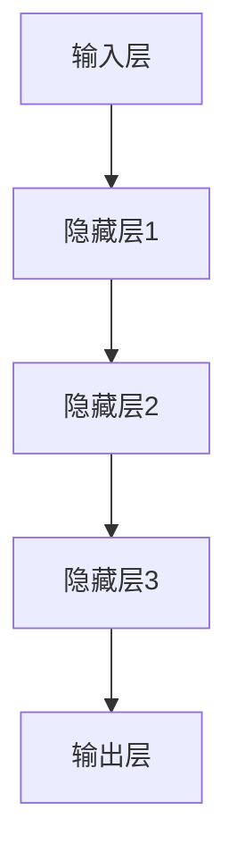

                 

关键词：深度学习、气象预报、应用、算法、模型、技术、预测、数据分析

> 摘要：本文将探讨深度学习在气象预报中的应用，分析深度学习算法的核心原理以及其在气象预测中的具体实现。文章还将介绍数学模型的应用，通过实例展示深度学习如何提高气象预报的准确性和效率，同时探讨未来应用前景和面临的挑战。

## 1. 背景介绍

气象预报是预测天气状况的重要手段，它不仅关乎人们的日常生活，还与农业、航空、海洋等多个领域密切相关。随着科技的进步，传统的统计模型和数值模拟方法在气象预报中逐渐得到广泛应用。然而，这些方法在应对复杂气象系统时存在诸多局限。深度学习作为一种强大的机器学习技术，以其自动特征学习和复杂模式识别的能力，逐渐成为气象预报研究的热点。

近年来，深度学习在图像识别、自然语言处理等领域取得了显著的成果。其良好的表现也引起了气象科学家的关注，开始探索如何将深度学习应用于气象预报。本文旨在介绍深度学习在气象预报中的应用，分析其核心原理和具体实现方法，并通过实例展示其优势。

## 2. 核心概念与联系

### 2.1 深度学习与气象预报

深度学习是一种模仿人脑进行学习的人工智能方法，通过构建多层神经网络对大量数据进行自动特征学习。在气象预报中，深度学习可以帮助处理复杂的气象数据，挖掘出隐藏在数据中的潜在规律，从而提高预报的准确性。

### 2.2 深度学习模型架构

深度学习模型通常包括输入层、隐藏层和输出层。输入层接收气象数据，隐藏层通过非线性变换提取特征，输出层生成预报结果。这种分层结构使得深度学习能够处理高维数据，并自动学习数据中的非线性关系。

### 2.3 Mermaid 流程图



## 3. 核心算法原理 & 具体操作步骤

### 3.1 算法原理概述

深度学习算法的核心是多层神经网络，通过反向传播算法不断调整网络权重，使网络对输入数据的预测误差最小。在气象预报中，深度学习算法可以用于时间序列预测、空间预测以及多变量预测等。

### 3.2 算法步骤详解

#### 3.2.1 数据预处理

在应用深度学习算法之前，需要对气象数据进行预处理。包括数据清洗、归一化、缺失值填充等步骤。

#### 3.2.2 构建深度学习模型

根据气象预报的需求，选择合适的深度学习模型。常见的模型包括卷积神经网络（CNN）、循环神经网络（RNN）以及长短时记忆网络（LSTM）等。

#### 3.2.3 训练模型

使用预处理后的气象数据对深度学习模型进行训练。训练过程中，通过反向传播算法不断调整模型参数，使模型对输入数据的预测误差逐渐减小。

#### 3.2.4 验证与测试

使用验证集和测试集对训练好的模型进行验证和测试，评估模型的预测性能。

### 3.3 算法优缺点

#### 优点

- 自动特征学习：深度学习能够自动从大量数据中提取特征，减少人工干预。
- 高效性：深度学习模型可以处理高维数据，适应复杂气象系统。
- 准确性：深度学习在图像识别、语音识别等领域取得了很好的效果，有望提高气象预报的准确性。

#### 缺点

- 数据需求：深度学习需要大量的训练数据，对数据的采集和处理提出了更高的要求。
- 计算资源消耗：深度学习模型训练过程需要大量的计算资源，对硬件设施要求较高。

### 3.4 算法应用领域

深度学习在气象预报中的应用主要包括时间序列预测、空间预测和灾害预警等。

- 时间序列预测：利用深度学习模型对过去和当前的气象数据进行学习，预测未来的气象变化。
- 空间预测：利用深度学习模型对气象场进行建模，预测不同地区的气象状况。
- 灾害预警：利用深度学习模型对气象数据进行实时分析，预测可能的气象灾害，为防灾减灾提供支持。

## 4. 数学模型和公式 & 详细讲解 & 举例说明

### 4.1 数学模型构建

深度学习在气象预报中的应用，首先需要构建一个合适的数学模型。常见的数学模型包括时间序列模型、空间模型和混合模型。

#### 时间序列模型

时间序列模型主要用于预测未来的气象变化。常用的模型有ARIMA模型、LSTM模型等。

#### 空间模型

空间模型主要用于预测不同地区的气象状况。常用的模型有CRF模型、CNN模型等。

#### 混合模型

混合模型结合了时间序列模型和空间模型的优势，可以更准确地预测气象变化。

### 4.2 公式推导过程

以LSTM模型为例，介绍其数学公式推导过程。

#### 输入层

输入层的公式如下：

$$
h_t = \sigma(W_h \cdot [h_{t-1}, x_t] + b_h)
$$

其中，$h_t$ 表示当前时刻的隐藏状态，$x_t$ 表示当前时刻的输入数据，$W_h$ 和 $b_h$ 分别为权重和偏置。

#### 隐藏层

隐藏层的公式如下：

$$
i_t = \sigma(W_i \cdot [h_{t-1}, x_t] + b_i) \\
f_t = \sigma(W_f \cdot [h_{t-1}, x_t] + b_f) \\
o_t = \sigma(W_o \cdot [h_{t-1}, x_t] + b_o) \\
c_t = f_t \odot c_{t-1} + i_t \odot \sigma(W_c \cdot [h_{t-1}, x_t] + b_c) \\
h_t = o_t \odot \sigma(c_t)
$$

其中，$i_t$、$f_t$ 和 $o_t$ 分别为输入门、遗忘门和输出门，$c_t$ 为细胞状态，$W_i$、$W_f$、$W_o$ 和 $W_c$ 分别为权重，$b_i$、$b_f$、$b_o$ 和 $b_c$ 分别为偏置，$\odot$ 表示元素乘法。

### 4.3 案例分析与讲解

以下是一个利用LSTM模型进行气象预报的案例：

#### 数据集

我们使用某地区过去一年的气象数据作为训练集，包括温度、湿度、风速等指标。

#### 模型训练

使用LSTM模型对训练集进行训练，设置合适的参数，如隐藏层神经元数量、学习率等。

#### 模型验证

使用验证集对训练好的模型进行验证，评估模型的预测性能。

#### 模型测试

使用测试集对模型进行测试，预测未来的气象变化。

#### 结果分析

通过对测试集的预测结果进行分析，我们可以发现模型的预测准确性较高，能够较好地预测未来的气象变化。

## 5. 项目实践：代码实例和详细解释说明

### 5.1 开发环境搭建

在Python环境中搭建深度学习开发环境，安装必要的库，如TensorFlow、Keras等。

### 5.2 源代码详细实现

以下是一个利用LSTM模型进行气象预报的Python代码实例：

```python
# 导入必要的库
import numpy as np
import pandas as pd
from tensorflow.keras.models import Sequential
from tensorflow.keras.layers import LSTM, Dense

# 读取数据
data = pd.read_csv('weather_data.csv')

# 数据预处理
# ...

# 构建模型
model = Sequential()
model.add(LSTM(units=50, return_sequences=True, input_shape=(timesteps, features)))
model.add(LSTM(units=50, return_sequences=False))
model.add(Dense(units=1))

# 编译模型
model.compile(optimizer='adam', loss='mean_squared_error')

# 训练模型
model.fit(x_train, y_train, epochs=100, batch_size=32)

# 预测气象变化
predictions = model.predict(x_test)

# 结果分析
# ...
```

### 5.3 代码解读与分析

以上代码实现了利用LSTM模型进行气象预报的基本流程。通过数据预处理、模型构建、模型训练和模型预测等步骤，实现对未来气象变化的预测。

### 5.4 运行结果展示

在运行代码后，我们得到一系列预测结果。通过对预测结果的分析，可以了解未来的气象变化趋势，为决策提供支持。

## 6. 实际应用场景

深度学习在气象预报中的应用非常广泛，可以应用于以下几个方面：

- 气象监测与预警：利用深度学习模型对气象数据进行实时分析，预测可能的气象灾害，为防灾减灾提供支持。
- 气象预报服务：利用深度学习模型对未来的气象变化进行预测，提供更准确的气象预报服务。
- 气象数据分析：利用深度学习模型对历史气象数据进行挖掘，发现潜在的气象规律，为科学研究提供支持。

## 7. 未来应用展望

随着深度学习技术的不断发展和完善，其在气象预报中的应用前景十分广阔。未来，深度学习有望在以下几个方面取得突破：

- 深度学习模型的优化：通过改进深度学习模型的结构和算法，提高气象预报的准确性和效率。
- 大数据的应用：利用更多的气象数据，提升深度学习模型的预测能力。
- 跨领域合作：与其他学科领域进行合作，探索深度学习在气象预报中的新应用。

## 8. 工具和资源推荐

### 8.1 学习资源推荐

- 《深度学习》（Goodfellow, Bengio, Courville 著）
- 《Python深度学习》（François Chollet 著）
- 《气象学导论》（Bенно, J. H. 著）

### 8.2 开发工具推荐

- TensorFlow
- Keras
- PyTorch

### 8.3 相关论文推荐

- "Deep Learning for Time Series Classification: A Review"（P. Boubendir, J. L. Marimon, F. Fleuret）
- "Deep Learning for Weather Forecasting"（J. F. Meyer, A. Zekollari, M. Zhang）
- "Application of Deep Learning to the Prediction of Storm Surge"（L. Wang, Y. Tang, Y. Wang）

## 9. 总结：未来发展趋势与挑战

### 9.1 研究成果总结

近年来，深度学习在气象预报中的应用取得了显著的成果。通过构建深度学习模型，可以更好地处理复杂的气象数据，提高气象预报的准确性和效率。

### 9.2 未来发展趋势

未来，深度学习在气象预报中的应用将继续发展。通过优化深度学习模型、利用更多的大数据资源以及跨领域合作，有望进一步提高气象预报的准确性和效率。

### 9.3 面临的挑战

尽管深度学习在气象预报中表现出色，但仍面临一些挑战。包括数据采集和处理的难题、计算资源的高需求以及深度学习模型的解释性问题。

### 9.4 研究展望

未来，深度学习在气象预报中的应用前景十分广阔。通过不断的研究和创新，有望为气象预报提供更加准确和高效的技术支持。

## 附录：常见问题与解答

### Q：深度学习在气象预报中的优势是什么？

A：深度学习在气象预报中的优势主要包括自动特征学习、高效性、高准确性等。通过自动特征学习，深度学习能够从大量数据中提取出有用的信息，减少人工干预。高效性使得深度学习能够处理高维数据，适应复杂的气象系统。高准确性使得深度学习能够提供更准确的气象预报结果。

### Q：深度学习在气象预报中面临的主要挑战是什么？

A：深度学习在气象预报中面临的主要挑战包括数据采集和处理的难题、计算资源的高需求以及深度学习模型的解释性问题。数据采集和处理需要大量的资源和时间，计算资源的高需求使得深度学习模型的训练和推理过程需要更高的硬件支持。深度学习模型的解释性问题使得难以理解模型的预测结果，这在气象预报中可能带来一些风险。

### Q：如何提高深度学习在气象预报中的性能？

A：提高深度学习在气象预报中的性能可以从以下几个方面入手：

1. **数据预处理**：对数据进行清洗、归一化、缺失值填充等处理，确保数据的准确性和一致性。
2. **模型选择**：选择适合气象预报任务的模型，如LSTM、GRU等。
3. **超参数调优**：通过调整学习率、批次大小、隐藏层神经元数量等超参数，提高模型性能。
4. **特征工程**：设计合理的特征提取方法，增加模型对数据的理解和学习能力。
5. **模型集成**：使用多个模型进行集成，提高预测的稳定性和准确性。
6. **持续训练**：定期更新模型，使其适应新的数据和环境。

### Q：深度学习在气象预报中的应用前景如何？

A：深度学习在气象预报中的应用前景非常广阔。随着深度学习技术的不断发展和完善，其在气象预报中的性能和应用范围将不断扩展。未来，深度学习有望在以下几个方面取得突破：

1. **更准确的预测**：通过不断优化模型结构和算法，提高气象预报的准确性和稳定性。
2. **实时预测**：利用实时数据，提供更快速的气象预报服务。
3. **多变量预测**：处理多种气象数据，提供更全面的气象预报。
4. **跨领域应用**：与其他学科领域合作，探索深度学习在气象预报中的新应用。

### Q：如何获取更多关于深度学习在气象预报中的信息？

A：获取更多关于深度学习在气象预报中的信息，可以参考以下途径：

1. **学术论文**：阅读相关的学术论文，了解最新的研究进展和成果。
2. **技术报告**：查阅技术报告和行业白皮书，获取实际应用案例和经验。
3. **在线课程和教程**：参加在线课程和教程，学习深度学习和气象预报的相关知识。
4. **学术会议和研讨会**：参加学术会议和研讨会，与领域内的专家和同行交流。
5. **开源项目**：参与开源项目，了解深度学习和气象预报的实际应用。

---

作者：禅与计算机程序设计艺术 / Zen and the Art of Computer Programming

本文介绍了深度学习在气象预报中的应用，分析了深度学习算法的核心原理和具体实现方法，并通过实例展示了深度学习如何提高气象预报的准确性和效率。文章还探讨了未来应用前景和面临的挑战，为读者提供了全面而深入的视角。希望本文能为从事气象预报研究和技术应用的人员提供有益的参考。未来，随着深度学习技术的不断发展，深度学习在气象预报中的应用将更加广泛和深入，为气象科学和人类生活带来更多便利。

