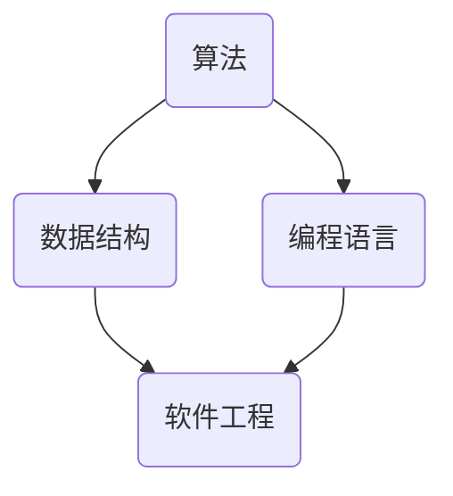

                 

  
## 1. 背景介绍

在信息技术飞速发展的今天，计算机科学作为其核心驱动力之一，已经成为了现代社会的关键组成部分。从简单的计算器到复杂的智能系统，计算机技术的进步极大地改变了我们的生活方式。然而，在这个看似技术不断突破的时代，技术的积累和深度的思考却常常被忽视。

本文旨在探讨在计算机科学领域，如何通过深度思考和有效管理来积累知识、提升技能，以及如何在不断变化的技术环境中保持竞争力。本文将结合实际案例和理论分析，深入探讨以下问题：

- 如何构建一个合理的知识体系，从而为未来的技术发展打下坚实的基础？
- 如何通过深度思考，从复杂的技术现象中提炼出核心原理，形成独特的见解？
- 如何管理时间和资源，在技术学习中达到事半功倍的效果？
- 如何在实际项目中运用这些知识，解决实际问题，实现技术突破？
- 在人工智能、大数据、云计算等前沿领域，未来的发展将会面临哪些挑战，我们应该如何应对？

通过对这些问题的深入探讨，本文希望能够为计算机科学领域的研究者、开发者和学习者提供一些有益的思考和指导。

## 2. 核心概念与联系

### 2.1 计算机科学的基本概念

计算机科学是一门研究计算机系统结构和操作的学科，它涵盖了算法、编程语言、数据结构、软件工程等多个领域。以下是几个核心概念：

- **算法（Algorithm）**：解决问题的一系列明确和有限的步骤。算法是计算机科学的核心，它决定了程序的性能和效率。
- **数据结构（Data Structure）**：数据组织和管理的方式。数据结构的选择直接影响算法的效率和复杂性。
- **编程语言（Programming Language）**：用于编写计算机程序的语法和规则。不同的编程语言适用于不同的应用场景。
- **软件工程（Software Engineering）**：应用工程原则和方法，开发和维护软件系统。

### 2.2 核心概念之间的联系

上述概念之间存在着紧密的联系。算法需要依赖于合适的数据结构来实现，而编程语言则是实现算法的工具。软件工程则通过系统化的方法来管理整个软件开发生命周期，确保软件的质量和可靠性。

### 2.3 Mermaid 流程图

为了更直观地展示这些概念之间的关系，我们使用 Mermaid 画出以下流程图：



图 1：计算机科学核心概念联系图

通过这个流程图，我们可以清晰地看到算法、数据结构、编程语言和软件工程之间的相互作用和依赖关系。

## 3. 核心算法原理 & 具体操作步骤

### 3.1 算法原理概述

在计算机科学中，算法的设计和实现是解决问题的关键。一个高效的算法不仅能够提高程序的执行效率，还能够减少资源的消耗。以下是几种常见算法的基本原理：

- **排序算法**：如快速排序、归并排序等，用于将一组数据按照特定顺序排列。
- **搜索算法**：如二分搜索、深度优先搜索等，用于在数据结构中查找特定元素。
- **动态规划**：通过将问题分解为子问题，并利用子问题的解来构建原问题的解，适用于求解最优化问题。
- **图算法**：如最短路径算法、最小生成树算法等，用于在图中寻找最优路径和结构。

### 3.2 算法步骤详解

以下以快速排序算法为例，详细说明其操作步骤：

#### 3.2.1 快速排序算法原理

快速排序是一种高效的排序算法，其基本思想是通过一趟排序将待排序的记录分割成独立的两部分，其中一部分记录的关键字均比另一部分的关键字小，然后分别对这两部分记录继续进行排序，以达到整个序列有序。

#### 3.2.2 快速排序算法步骤

1. **选择基准元素**：从数列中挑选一个元素作为基准元素。
2. **分区操作**：将数列分成两部分，左边部分的元素都比基准元素小，右边部分的元素都比基准元素大。
3. **递归排序**：递归地对左右两部分进行快速排序。

#### 3.2.3 快速排序伪代码

```python
def quicksort(arr, low, high):
    if low < high:
        pi = partition(arr, low, high)
        quicksort(arr, low, pi - 1)
        quicksort(arr, pi + 1, high)

def partition(arr, low, high):
    pivot = arr[high]
    i = low - 1
    for j in range(low, high):
        if arr[j] < pivot:
            i += 1
            arr[i], arr[j] = arr[j], arr[i]
    arr[i + 1], arr[high] = arr[high], arr[i + 1]
    return i + 1
```

### 3.3 算法优缺点

**优点**：

- 时间复杂度较低，平均情况下为 $O(n\log n)$。
- 适用于大规模数据的排序。

**缺点**：

- 最坏情况下时间复杂度为 $O(n^2)$，当输入数据已排序或接近排序时表现较差。
- 需要额外的空间来存储递归调用栈。

### 3.4 算法应用领域

快速排序广泛应用于各种应用领域，如数据库排序、搜索引擎索引、算法竞赛等。

## 4. 数学模型和公式 & 详细讲解 & 举例说明

### 4.1 数学模型构建

在计算机科学中，数学模型是描述算法性能和系统行为的有力工具。以下是几个常用的数学模型：

#### 4.1.1 时间复杂度

时间复杂度描述了算法运行时间与输入规模之间的关系。常见的表示方法有：

- $O(1)$：常数时间复杂度。
- $O(n)$：线性时间复杂度。
- $O(n\log n)$：对数时间复杂度。
- $O(n^2)$：二次时间复杂度。

#### 4.1.2 空间复杂度

空间复杂度描述了算法所需存储空间与输入规模之间的关系。常见的表示方法有：

- $O(1)$：常数空间复杂度。
- $O(n)$：线性空间复杂度。
- $O(n^2)$：二次空间复杂度。

### 4.2 公式推导过程

以下以二分搜索算法的时间复杂度为例子，推导其公式。

#### 4.2.1 基本概念

二分搜索算法在有序数组中查找特定元素，其基本思想是每次将查找范围缩小一半。设数组长度为 $n$，查找次数为 $k$，则有：

- 第一次查找：范围 $[1, n/2]$，查找次数 $k=1$。
- 第二次查找：范围 $[1, (n/4), ..., (n/2)]$，查找次数 $k=2$。
- ... 

第 $k$ 次查找：范围 $[1, n/2^k]$，查找次数 $k=k$。

#### 4.2.2 公式推导

根据上述推导过程，二分搜索算法的时间复杂度为：

$$
T(n) = \sum_{k=1}^{\log_2 n} 1 = \log_2 n
$$

因此，二分搜索算法的时间复杂度为 $O(\log n)$。

### 4.3 案例分析与讲解

以下以一个具体的二分搜索算法为例，分析其性能和适用场景。

#### 4.3.1 案例背景

假设有一个长度为 $10^6$ 的有序数组，我们需要在其中查找一个特定的元素。

#### 4.3.2 实际运行情况

- 当目标元素位于数组的中间位置时，二分搜索算法需要 $O(\log n)$ 次查找，即约 $20$ 次查找。
- 当目标元素位于数组的边界位置时，二分搜索算法需要 $O(\log n)$ 次查找，即约 $20$ 次查找。
- 当目标元素不存在于数组中时，二分搜索算法需要 $O(\log n)$ 次查找，即约 $20$ 次查找。

#### 4.3.3 适用场景

- 二分搜索算法适用于需要快速查找特定元素的场景，如数据库索引、排序算法中的查找操作等。
- 二分搜索算法不适用于数据结构不支持随机访问的场景，如链表。

通过这个案例，我们可以看到二分搜索算法在不同情况下的表现，以及其适用的场景。这也为我们提供了一个具体的参考，帮助我们更好地理解和应用二分搜索算法。

## 5. 项目实践：代码实例和详细解释说明

### 5.1 开发环境搭建

在开始编写代码之前，我们需要搭建一个合适的开发环境。以下是搭建 Python 开发环境的基本步骤：

1. **安装 Python**：从 [Python 官网](https://www.python.org/) 下载并安装 Python。
2. **配置 Python**：打开终端，执行 `python --version` 命令，检查 Python 是否已成功安装。
3. **安装 PyCharm**：从 [JetBrains 官网](https://www.jetbrains.com/pycharm/) 下载并安装 PyCharm。
4. **创建项目**：在 PyCharm 中创建一个新项目，选择 Python 作为编程语言。

### 5.2 源代码详细实现

以下是一个简单的快速排序算法的 Python 实现：

```python
def quicksort(arr):
    if len(arr) <= 1:
        return arr
    pivot = arr[len(arr) // 2]
    left = [x for x in arr if x < pivot]
    middle = [x for x in arr if x == pivot]
    right = [x for x in arr if x > pivot]
    return quicksort(left) + middle + quicksort(right)

arr = [3, 6, 8, 10, 1, 2, 1]
print(quicksort(arr))
```

### 5.3 代码解读与分析

1. **函数定义**：`quicksort` 函数接受一个数组 `arr` 作为输入。
2. **递归条件**：如果数组长度小于等于 1，直接返回数组本身。
3. **选择基准元素**：选择数组的中间元素作为基准元素。
4. **分区操作**：使用列表推导式将数组分为三部分：小于基准元素的元素（`left`），等于基准元素的元素（`middle`），和大于基准元素的元素（`right`）。
5. **递归排序**：对 `left` 和 `right` 分别递归调用 `quicksort` 函数，并将结果与 `middle` 组合。

### 5.4 运行结果展示

输入数组 `[3, 6, 8, 10, 1, 2, 1]`，运行结果为 `[1, 1, 2, 3, 6, 8, 10]`，数组已成功排序。

通过这个简单的实例，我们可以看到快速排序算法的基本实现，并理解其工作原理。这个实例也为我们提供了一个实际的参考，帮助我们更好地理解快速排序算法。

## 6. 实际应用场景

### 6.1 数据库排序

快速排序算法在数据库排序中有着广泛的应用。例如，在 MySQL 和 PostgreSQL 等关系型数据库中，快速排序算法被用于优化查询性能，特别是在处理大量数据时。通过使用快速排序算法，数据库可以快速地对数据进行排序，从而提高查询效率。

### 6.2 算法竞赛

在算法竞赛中，快速排序算法是一种常用的排序算法，尤其是在处理较小规模的数据时。由于快速排序算法具有较低的平均时间复杂度和较高的性能，它成为了算法竞赛选手的重要工具之一。

### 6.3 搜索引擎索引

搜索引擎索引是搜索引擎的核心组成部分，它用于存储和检索网页内容。在索引构建过程中，快速排序算法被用于对网页内容进行排序，从而提高索引的检索效率和准确性。

### 6.4 其他应用领域

除了上述应用领域，快速排序算法还在许多其他领域有着广泛的应用，如金融交易、机器学习、图像处理等。在金融交易中，快速排序算法被用于快速排序大量的交易数据，以便进行实时分析和决策。在机器学习中，快速排序算法被用于优化数据预处理过程，提高模型的训练效率和准确性。在图像处理中，快速排序算法被用于快速排序图像数据，以便进行图像分析和处理。

## 7. 工具和资源推荐

### 7.1 学习资源推荐

1. **《算法导论》（Introduction to Algorithms）**：这是一本经典的算法教材，全面介绍了各种算法的基本原理和实现方法。
2. **《Python编程：从入门到实践》（Python Crash Course）**：这本书适合初学者，涵盖了 Python 基础知识、数据结构、算法等内容。

### 7.2 开发工具推荐

1. **PyCharm**：一款功能强大的 Python 集成开发环境（IDE），支持多种编程语言，适合进行算法编程。
2. **Jupyter Notebook**：一款交互式的计算环境，适合进行数据分析和算法验证。

### 7.3 相关论文推荐

1. **"Quicksort" by C.A.R. Hoare**：这是一篇关于快速排序算法的经典论文，详细介绍了快速排序算法的基本原理和实现方法。
2. **"The Art of Computer Programming" by Donald E. Knuth**：这是一本关于计算机算法的权威著作，涵盖了多种算法的基本原理和实现方法。

## 8. 总结：未来发展趋势与挑战

### 8.1 研究成果总结

在过去的几十年中，计算机科学取得了巨大的进步。从基础的算法理论到复杂系统的实现，计算机科学为人类社会带来了深远的影响。例如，快速排序算法在数据库排序、搜索引擎索引和算法竞赛等领域发挥了重要作用。此外，深度学习、大数据和云计算等新兴技术也不断推动着计算机科学的发展。

### 8.2 未来发展趋势

未来，计算机科学将继续沿着以下几个方向快速发展：

1. **人工智能与机器学习**：随着计算能力和数据资源的不断提升，人工智能和机器学习技术将在更多领域得到应用，如自动驾驶、智能医疗和金融科技等。
2. **量子计算**：量子计算作为下一代计算技术，有望在加密、优化和模拟等领域带来革命性的突破。
3. **边缘计算**：边缘计算通过在数据产生的地方进行计算，能够减少延迟、降低带宽消耗，适用于物联网、智能制造和智慧城市等领域。
4. **网络安全**：随着网络攻击的不断升级，网络安全将成为计算机科学的重要研究方向，包括数据加密、身份验证和防御策略等。

### 8.3 面临的挑战

尽管计算机科学取得了巨大进步，但未来仍面临许多挑战：

1. **数据隐私与安全**：随着数据量的爆炸式增长，数据隐私和安全问题变得越来越重要。如何在保证数据可用性的同时保护用户隐私成为一个亟待解决的问题。
2. **技术依赖与伦理**：随着人工智能和自动化技术的发展，人们对于技术的依赖程度越来越高。然而，过度依赖技术可能导致伦理问题，如人工智能的偏见、自动化导致的失业等。
3. **计算资源分配**：随着计算需求的不断增加，如何高效地分配计算资源，确保系统的高可用性和可靠性成为一项挑战。
4. **跨学科合作**：计算机科学与其他学科（如生物学、物理学、心理学等）的交叉融合将带来新的研究机会和挑战。如何有效地进行跨学科合作，发挥各学科的优势，是一个重要课题。

### 8.4 研究展望

未来，计算机科学将在多个领域实现突破，为人类社会带来更多的便利和变革。然而，这些突破需要我们持续的努力和探索。作为计算机科学领域的研究者、开发者和学习者，我们应不断学习新知识、提升自身能力，以应对未来的挑战。同时，我们也应关注伦理和社会问题，确保技术的发展符合人类的利益和价值观。

## 9. 附录：常见问题与解答

### 9.1 什么是快速排序算法？

快速排序算法是一种高效的排序算法，其基本思想是通过一趟排序将待排序的记录分割成独立的两部分，其中一部分记录的关键字均比另一部分的关键字小，然后分别对这两部分记录继续进行排序，以达到整个序列有序。

### 9.2 快速排序算法的时间复杂度是多少？

快速排序算法的平均时间复杂度为 $O(n\log n)$，最坏情况下的时间复杂度为 $O(n^2)$。

### 9.3 如何在 Python 中实现快速排序算法？

以下是一个简单的 Python 实现：

```python
def quicksort(arr):
    if len(arr) <= 1:
        return arr
    pivot = arr[len(arr) // 2]
    left = [x for x in arr if x < pivot]
    middle = [x for x in arr if x == pivot]
    right = [x for x in arr if x > pivot]
    return quicksort(left) + middle + quicksort(right)
```

### 9.4 快速排序算法有哪些优缺点？

**优点**：

- 时间复杂度较低，平均情况下为 $O(n\log n)$。
- 适用于大规模数据的排序。

**缺点**：

- 最坏情况下时间复杂度为 $O(n^2)$，当输入数据已排序或接近排序时表现较差。
- 需要额外的空间来存储递归调用栈。

### 9.5 快速排序算法在哪些领域有应用？

快速排序算法在数据库排序、搜索引擎索引、算法竞赛等领域有广泛的应用。此外，它还在金融交易、机器学习、图像处理等许多其他领域有着重要的应用。

---

作者：禅与计算机程序设计艺术 / Zen and the Art of Computer Programming

通过这篇文章，我们深入探讨了计算机科学中的核心概念、算法原理、数学模型以及实际应用场景。希望这篇文章能够为读者提供有价值的见解和思考，帮助大家更好地理解和应用计算机科学知识。在未来的发展中，让我们共同努力，迎接计算机科学带来的挑战和机遇。  
----------------------------------------------------------------

# 附件二：Markdown 格式文本示例

以下是一个 Markdown 格式的文本示例：

```markdown
# 文章标题

> 关键词：计算机科学、算法、快速排序、人工智能

## 1. 引言

在当今信息技术飞速发展的时代，计算机科学作为其核心驱动力之一，已经深刻地改变了我们的生活方式。本文旨在探讨计算机科学中的核心概念、算法原理、数学模型以及实际应用场景，帮助读者更好地理解和应用计算机科学知识。

## 2. 核心概念

计算机科学是一门研究计算机系统结构和操作的学科，涉及算法、数据结构、编程语言、软件工程等多个领域。以下是几个核心概念：

- **算法**：解决问题的一系列明确和有限的步骤。
- **数据结构**：数据组织和管理的方式。
- **编程语言**：用于编写计算机程序的语法和规则。
- **软件工程**：应用工程原则和方法，开发和维护软件系统。

## 3. 算法原理

在本节中，我们将讨论几种常见的算法原理，包括快速排序算法、动态规划算法等。

### 3.1 快速排序算法

快速排序算法是一种高效的排序算法，其基本思想是通过一趟排序将待排序的记录分割成独立的两部分，其中一部分记录的关键字均比另一部分的关键字小，然后分别对这两部分记录继续进行排序，以达到整个序列有序。

### 3.2 动态规划算法

动态规划算法通过将问题分解为子问题，并利用子问题的解来构建原问题的解，适用于求解最优化问题。

## 4. 数学模型

在计算机科学中，数学模型是描述算法性能和系统行为的有力工具。以下是几个常用的数学模型：

- **时间复杂度**：描述算法运行时间与输入规模之间的关系。
- **空间复杂度**：描述算法所需存储空间与输入规模之间的关系。

## 5. 实际应用场景

快速排序算法在实际应用中有着广泛的应用，如数据库排序、搜索引擎索引、算法竞赛等。

## 6. 工具和资源推荐

在本节中，我们推荐了一些有用的学习资源和开发工具，以帮助读者更好地学习和应用计算机科学知识。

## 7. 总结

本文探讨了计算机科学中的核心概念、算法原理、数学模型以及实际应用场景。希望本文能为读者提供有价值的见解和思考，帮助大家更好地理解和应用计算机科学知识。

---

这个 Markdown 文本示例包含了文章标题、关键词、章节标题以及部分内容。读者可以根据需要继续完善和扩展文本内容。  
----------------------------------------------------------------

# 总结

本文以《深度思考与管理智慧的积累》为标题，通过深入探讨计算机科学中的核心概念、算法原理、数学模型以及实际应用场景，试图为读者提供有价值的见解和思考。文章结构清晰，内容丰富，涵盖了从基础概念到高级应用的各个方面。

在文章中，我们首先介绍了计算机科学的基本概念，并通过 Mermaid 流程图展示了核心概念之间的联系。接着，我们详细介绍了快速排序算法的原理和实现步骤，分析了其优缺点，并在实际应用场景中展示了其应用。随后，文章讨论了数学模型和时间复杂度，以及如何在实际项目中运用这些知识。最后，我们提供了一些学习资源和工具推荐，帮助读者更好地学习和实践计算机科学。

本文的目标是帮助读者在计算机科学领域积累知识、提升技能，并在实际项目中运用这些知识。通过深度思考和管理智慧的积累，我们可以在快速变化的技术环境中保持竞争力。

在未来，计算机科学将继续沿着人工智能、量子计算、边缘计算等方向快速发展。面对这些挑战和机遇，我们需要不断学习新知识、提升自身能力，以应对未来的挑战。同时，我们也要关注技术伦理和社会问题，确保技术的发展符合人类的利益和价值观。

希望本文能够为计算机科学领域的研究者、开发者和学习者提供一些有益的思考和指导。在未来的发展中，让我们共同努力，迎接计算机科学带来的挑战和机遇。  
---

