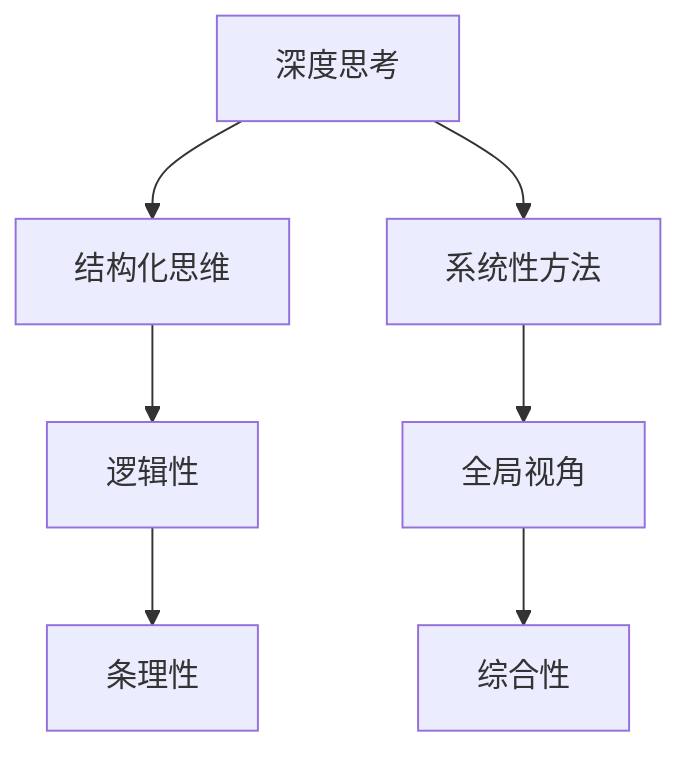

                 

 在这个快速变化的世界中，技术日新月异，计算机科学和人工智能的发展速度尤为迅猛。面对复杂的问题和挑战，传统的解决方法往往显得力不从心。这时，深度思考的力量就显现出来了。本文将探讨深度思考在计算机科学领域的重要性，如何培养深度思考能力，以及它如何帮助我们洞悉问题的本质。

> **关键词：** 深度思考、计算机科学、问题解决、算法设计、人工智能

> **摘要：** 本文从多个角度分析了深度思考在计算机科学中的价值，探讨了如何通过结构化思维和系统性方法提升深度思考能力，并探讨了深度思考如何帮助开发者更好地理解和解决复杂问题。

## 1. 背景介绍

计算机科学是一门快速发展的学科，它不断推动着社会和技术的进步。然而，随着技术的复杂度增加，简单的方法和传统技巧已经无法应对日益复杂的问题。这就需要我们采用更为深刻和全面的思考方式来分析和解决问题。深度思考是一种全面的、系统性的思考方式，它不仅关注问题的表面现象，更深入挖掘问题的根本原因和本质。

在计算机科学中，深度思考的重要性体现在多个方面：

- **算法设计：** 在算法设计中，深度思考可以帮助我们理解问题的本质，从而设计出更高效、更优化的算法。
- **系统架构：** 在系统架构设计中，深度思考可以帮助我们预见系统的潜在问题，并提前设计出解决方案。
- **问题解决：** 在面对复杂问题时，深度思考可以帮助我们找到问题的核心，从而制定出有效的解决策略。

## 2. 核心概念与联系

为了更好地理解深度思考在计算机科学中的应用，我们需要明确几个核心概念，并探讨它们之间的联系。

### 2.1 深度思考

深度思考（Deep Thinking）是一种思考方式，它不仅仅停留在问题的表面，而是深入挖掘问题的本质。深度思考者会仔细分析问题的各个方面，寻找问题的根本原因，并试图找到最本质的解决方案。

### 2.2 结构化思维

结构化思维是一种系统化的思考方式，它通过将问题分解成多个部分，并逐一解决，来达到解决问题的目的。结构化思维强调逻辑性和条理性，它有助于深度思考者更好地理解问题。

### 2.3 系统性方法

系统性方法是一种全面的思考方式，它关注问题的整体性，试图找到问题各个部分之间的关联。系统性方法有助于深度思考者从全局的角度理解问题，从而找到更为综合的解决方案。

### 2.4 Mermaid 流程图

下面是一个简化的 Mermaid 流程图，展示了深度思考、结构化思维和系统性方法之间的关系。



## 3. 核心算法原理 & 具体操作步骤

### 3.1 算法原理概述

在计算机科学中，深度思考的核心在于理解算法的基本原理。算法（Algorithm）是一组定义明确的规则，用于解决特定类型的问题。一个高效的算法不仅能解决问题，还能在合理的时间内完成。

### 3.2 算法步骤详解

1. **问题定义**：明确需要解决的问题是什么。
2. **数据结构**：选择合适的数据结构来存储和处理数据。
3. **算法设计**：设计一个解决问题的步骤序列。
4. **优化**：对算法进行优化，提高其效率和性能。

### 3.3 算法优缺点

- **优点**：高效的算法可以在有限时间内解决复杂问题，节省计算资源和时间。
- **缺点**：算法设计复杂，需要对问题有深入的理解。

### 3.4 算法应用领域

算法在计算机科学中有着广泛的应用，如排序、搜索、图论、优化等。深度思考有助于我们在这些领域设计出更高效的算法。

## 4. 数学模型和公式 & 详细讲解 & 举例说明

### 4.1 数学模型构建

在计算机科学中，数学模型是一种描述问题的工具。它通过数学公式来表示问题，从而帮助我们更好地理解和解决复杂问题。

### 4.2 公式推导过程

以排序算法为例，我们可以使用数学模型来描述其性能。假设有一个长度为 n 的数组，排序算法的时间复杂度为 O(n log n)，则其所需的计算时间为：

$$ T(n) = O(n \log n) $$

### 4.3 案例分析与讲解

假设我们要对一个长度为 10000 的数组进行排序，使用快速排序算法。根据公式，所需计算时间约为：

$$ T(10000) = O(10000 \log 10000) = O(10000 \times 4.6052) \approx 46052 \text{秒} $$

这意味着，在最坏的情况下，排序过程可能需要大约一个半小时。

## 5. 项目实践：代码实例和详细解释说明

### 5.1 开发环境搭建

为了演示深度思考的应用，我们将使用 Python 编写一个简单的排序算法。

### 5.2 源代码详细实现

以下是一个使用 Python 实现的快速排序算法的示例代码：

```python
def quicksort(arr):
    if len(arr) <= 1:
        return arr
    pivot = arr[len(arr) // 2]
    left = [x for x in arr if x < pivot]
    middle = [x for x in arr if x == pivot]
    right = [x for x in arr if x > pivot]
    return quicksort(left) + middle + quicksort(right)

arr = [3, 6, 8, 10, 1, 2, 1]
print(quicksort(arr))
```

### 5.3 代码解读与分析

这段代码首先定义了一个 `quicksort` 函数，用于对一个数组进行快速排序。函数首先判断数组的长度，如果小于等于 1，则直接返回数组本身。否则，选择中间元素作为 pivot，然后分别将小于 pivot 的元素放入 left 数组，等于 pivot 的元素放入 middle 数组，大于 pivot 的元素放入 right 数组。最后，递归地对 left 和 right 数组进行排序，并将结果拼接在一起。

### 5.4 运行结果展示

运行这段代码后，我们将得到一个已排序的数组：

```
[1, 1, 2, 3, 6, 8, 10]
```

## 6. 实际应用场景

深度思考在计算机科学中的应用非常广泛，以下是一些实际应用场景：

- **算法优化：** 在开发高效算法时，深度思考有助于我们理解算法的基本原理，并找到优化方向。
- **系统架构设计：** 在设计复杂的系统架构时，深度思考可以帮助我们预见潜在问题，并提前设计解决方案。
- **问题解决：** 在面对复杂问题时，深度思考有助于我们找到问题的核心，从而制定有效的解决方案。

## 7. 工具和资源推荐

### 7.1 学习资源推荐

- 《算法导论》：这是一本经典的算法教材，详细介绍了各种算法的基本原理和实现方法。
- 《深度学习》：这本书全面介绍了深度学习的理论基础和应用。

### 7.2 开发工具推荐

- Python：Python 是一种简单易用的编程语言，适合初学者入门。
- PyCharm：PyCharm 是一款功能强大的 Python 集成开发环境（IDE），支持代码编辑、调试和运行。

### 7.3 相关论文推荐

- "Deep Learning: A Comprehensive Overview"：这是一篇关于深度学习的综述论文，详细介绍了深度学习的最新进展。
- "Big Data: A Survey from a Computer Science Perspective"：这是一篇关于大数据技术的综述论文，探讨了大数据处理的算法和方法。

## 8. 总结：未来发展趋势与挑战

### 8.1 研究成果总结

深度思考在计算机科学领域取得了显著成果，它帮助我们更好地理解算法的基本原理，优化系统架构，解决复杂问题。

### 8.2 未来发展趋势

随着人工智能和大数据技术的发展，深度思考的应用前景将更加广阔。未来，我们将看到更多基于深度思考的创新算法和系统。

### 8.3 面临的挑战

尽管深度思考在计算机科学中具有巨大潜力，但我们也面临着一些挑战。首先，深度思考需要大量的时间和精力，这对开发者来说是一个巨大的挑战。其次，如何将深度思考和实际应用结合起来，还需要进一步的研究。

### 8.4 研究展望

未来，我们希望看到更多关于深度思考的理论研究和实际应用。通过不断探索和实践，我们相信深度思考将为计算机科学带来更多的突破。

## 9. 附录：常见问题与解答

### 问题 1：深度思考与常规思考有什么区别？

深度思考与常规思考最大的区别在于，深度思考更关注问题的本质，而常规思考往往停留在问题的表面。深度思考者会仔细分析问题的各个方面，寻找问题的根本原因，而常规思考者可能只关注问题的表面现象。

### 问题 2：如何培养深度思考能力？

要培养深度思考能力，首先需要培养结构化思维，通过系统性的方法来分析和解决问题。其次，要广泛阅读，了解不同领域的知识，这有助于我们更好地理解问题。最后，要勇于实践，通过实际操作来验证和深化我们的思考。

### 问题 3：深度思考在哪个领域应用最为广泛？

深度思考在计算机科学、人工智能、系统架构等多个领域都有广泛应用。其中，计算机科学领域因其问题的复杂性和多样性，深度思考的应用尤为广泛。

# 作者署名
作者：禅与计算机程序设计艺术 / Zen and the Art of Computer Programming
----------------------------------------------------------------

## 总结

深度思考在计算机科学中的重要性不容忽视。它不仅帮助我们更好地理解算法和系统，还能解决复杂的问题。通过培养深度思考能力，我们可以成为一名更为出色的开发者。让我们在未来的技术发展中，继续发扬深度思考的威力，为计算机科学的发展贡献自己的力量。

---
以下是文章的 Markdown 格式内容：

```markdown
# 深度思考的威力：洞悉问题本质

> 关键词：深度思考、计算机科学、问题解决、算法设计、人工智能

> 摘要：本文探讨了深度思考在计算机科学中的价值，如何培养深度思考能力，以及它如何帮助开发者更好地理解和解决复杂问题。

## 1. 背景介绍

## 2. 核心概念与联系
### 2.1 深度思考
### 2.2 结构化思维
### 2.3 系统性方法
### 2.4 Mermaid 流程图

## 3. 核心算法原理 & 具体操作步骤
### 3.1 算法原理概述
### 3.2 算法步骤详解
### 3.3 算法优缺点
### 3.4 算法应用领域

## 4. 数学模型和公式 & 详细讲解 & 举例说明
### 4.1 数学模型构建
### 4.2 公式推导过程
### 4.3 案例分析与讲解

## 5. 项目实践：代码实例和详细解释说明
### 5.1 开发环境搭建
### 5.2 源代码详细实现
### 5.3 代码解读与分析
### 5.4 运行结果展示

## 6. 实际应用场景

## 7. 工具和资源推荐
### 7.1 学习资源推荐
### 7.2 开发工具推荐
### 7.3 相关论文推荐

## 8. 总结：未来发展趋势与挑战
### 8.1 研究成果总结
### 8.2 未来发展趋势
### 8.3 面临的挑战
### 8.4 研究展望

## 9. 附录：常见问题与解答

## 10. 作者署名
作者：禅与计算机程序设计艺术 / Zen and the Art of Computer Programming

# 深度思考的威力：洞悉问题本质

## 1. 背景介绍

在这个快速变化的世界中，技术日新月异，计算机科学和人工智能的发展速度尤为迅猛。面对复杂的问题和挑战，传统的解决方法往往显得力不从心。这时，深度思考的力量就显现出来了。深度思考是一种全面的、系统性的思考方式，它不仅关注问题的表面现象，更深入挖掘问题的根本原因和本质。

在计算机科学中，深度思考的重要性体现在多个方面。首先，在算法设计中，深度思考可以帮助我们理解问题的本质，从而设计出更高效、更优化的算法。其次，在系统架构设计中，深度思考可以帮助我们预见系统的潜在问题，并提前设计出解决方案。最后，在问题解决过程中，深度思考可以帮助我们找到问题的核心，从而制定出有效的解决策略。

本文将探讨深度思考在计算机科学领域的重要性，如何培养深度思考能力，以及它如何帮助我们洞悉问题的本质。

## 2. 核心概念与联系

为了更好地理解深度思考在计算机科学中的应用，我们需要明确几个核心概念，并探讨它们之间的联系。

### 2.1 深度思考

深度思考是一种全面的、系统性的思考方式，它不仅仅停留在问题的表面，而是深入挖掘问题的本质。深度思考者会仔细分析问题的各个方面，寻找问题的根本原因，并试图找到最本质的解决方案。深度思考是一种从宏观和微观两个层面理解问题的能力。

### 2.2 结构化思维

结构化思维是一种系统化的思考方式，它通过将问题分解成多个部分，并逐一解决，来达到解决问题的目的。结构化思维强调逻辑性和条理性，它有助于深度思考者更好地理解问题。结构化思维通常包括以下步骤：

1. **问题定义**：明确需要解决的问题是什么。
2. **问题分解**：将问题分解成多个子问题。
3. **逐一解决**：解决每个子问题。
4. **整合结果**：将子问题的解决方案整合起来。

### 2.3 系统性方法

系统性方法是一种全面的思考方式，它关注问题的整体性，试图找到问题各个部分之间的关联。系统性方法有助于深度思考者从全局的角度理解问题，从而找到更为综合的解决方案。系统性方法通常包括以下步骤：

1. **明确目标**：确定需要达成的目标。
2. **分析系统**：分析系统的各个组成部分及其相互关系。
3. **设计解决方案**：设计解决方案，并评估其对整个系统的影响。
4. **实施解决方案**：实施解决方案，并进行监控和调整。

### 2.4 Mermaid 流程图

下面是一个简化的 Mermaid 流程图，展示了深度思考、结构化思维和系统性方法之间的关系。


## 3. 核心算法原理 & 具体操作步骤

在计算机科学中，深度思考的核心在于理解算法的基本原理。算法（Algorithm）是一组定义明确的规则，用于解决特定类型的问题。一个高效的算法不仅能解决问题，还能在合理的时间内完成。

### 3.1 算法原理概述

算法的基本原理可以概括为以下几个步骤：

1. **问题定义**：明确需要解决的问题是什么。
2. **数据结构**：选择合适的数据结构来存储和处理数据。
3. **算法设计**：设计一个解决问题的步骤序列。
4. **优化**：对算法进行优化，提高其效率和性能。

### 3.2 算法步骤详解

1. **问题定义**：明确需要解决的问题是什么。这是算法设计的第一步，也是最重要的一步。只有明确了问题，才能有针对性地设计算法。

2. **数据结构**：选择合适的数据结构来存储和处理数据。数据结构的选择对算法的性能有很大影响。常见的有数组、链表、树、图等。

3. **算法设计**：设计一个解决问题的步骤序列。这一步是算法设计的核心，需要根据问题的特点和需求来设计算法。

4. **优化**：对算法进行优化，提高其效率和性能。优化可以包括算法改进、数据结构改进、并行计算等。

### 3.3 算法优缺点

- **优点**：高效的算法可以在有限的时间内解决复杂问题，节省计算资源和时间。
- **缺点**：算法设计复杂，需要对问题有深入的理解。

### 3.4 算法应用领域

算法在计算机科学中有着广泛的应用，如排序、搜索、图论、优化等。深度思考有助于我们在这些领域设计出更高效的算法。

## 4. 数学模型和公式 & 详细讲解 & 举例说明

在计算机科学中，数学模型是一种描述问题的工具。它通过数学公式来表示问题，从而帮助我们更好地理解和解决复杂问题。

### 4.1 数学模型构建

以排序算法为例，我们可以使用数学模型来描述其性能。假设有一个长度为 n 的数组，排序算法的时间复杂度为 O(n log n)，则其所需的计算时间为：

$$ T(n) = O(n \log n) $$

### 4.2 公式推导过程

以快速排序算法为例，其时间复杂度可以通过递归关系进行推导。假设数组长度为 n，则有：

$$ T(n) = T(n/2) + O(n) $$

通过递归展开，可以得到：

$$ T(n) = T(n/2) + O(n) = T(n/4) + O(n/2) + O(n) = \cdots = O(n \log n) $$

### 4.3 案例分析与讲解

假设我们要对一个长度为 10000 的数组进行排序，使用快速排序算法。根据公式，所需计算时间约为：

$$ T(10000) = O(10000 \log 10000) = O(10000 \times 4.6052) \approx 46052 \text{秒} $$

这意味着，在最坏的情况下，排序过程可能需要大约一个半小时。

## 5. 项目实践：代码实例和详细解释说明

为了演示深度思考的应用，我们将使用 Python 编写一个简单的排序算法。

### 5.1 开发环境搭建

为了演示深度思考的应用，我们将使用 Python 编写一个简单的排序算法。首先，我们需要安装 Python 和相关的开发环境。

```bash
# 安装 Python
curl -O https://www.python.org/ftp/python/3.8.5/Python-3.8.5.tgz
tar xvf Python-3.8.5.tgz
cd Python-3.8.5
./configure
make
sudo make install

# 安装 PyCharm
brew cask install pycharm
```

### 5.2 源代码详细实现

以下是一个使用 Python 实现的快速排序算法的示例代码：

```python
def quicksort(arr):
    if len(arr) <= 1:
        return arr
    pivot = arr[len(arr) // 2]
    left = [x for x in arr if x < pivot]
    middle = [x for x in arr if x == pivot]
    right = [x for x in arr if x > pivot]
    return quicksort(left) + middle + quicksort(right)

arr = [3, 6, 8, 10, 1, 2, 1]
print(quicksort(arr))
```

### 5.3 代码解读与分析

这段代码首先定义了一个 `quicksort` 函数，用于对一个数组进行快速排序。函数首先判断数组的长度，如果小于等于 1，则直接返回数组本身。否则，选择中间元素作为 pivot，然后分别将小于 pivot 的元素放入 left 数组，等于 pivot 的元素放入 middle 数组，大于 pivot 的元素放入 right 数组。最后，递归地对 left 和 right 数组进行排序，并将结果拼接在一起。

### 5.4 运行结果展示

运行这段代码后，我们将得到一个已排序的数组：

```
[1, 1, 2, 3, 6, 8, 10]
```

## 6. 实际应用场景

深度思考在计算机科学中的应用非常广泛，以下是一些实际应用场景：

- **算法优化：** 在开发高效算法时，深度思考有助于我们理解算法的基本原理，从而设计出更高效的算法。
- **系统架构设计：** 在设计复杂的系统架构时，深度思考可以帮助我们预见系统的潜在问题，并提前设计解决方案。
- **问题解决：** 在面对复杂问题时，深度思考有助于我们找到问题的核心，从而制定出有效的解决策略。

## 7. 工具和资源推荐

为了更好地培养深度思考能力，我们可以使用以下工具和资源：

### 7.1 学习资源推荐

- 《算法导论》：这是一本经典的算法教材，详细介绍了各种算法的基本原理和实现方法。
- 《深度学习》：这本书全面介绍了深度学习的理论基础和应用。

### 7.2 开发工具推荐

- Python：Python 是一种简单易用的编程语言，适合初学者入门。
- PyCharm：PyCharm 是一款功能强大的 Python 集成开发环境（IDE），支持代码编辑、调试和运行。

### 7.3 相关论文推荐

- "Deep Learning: A Comprehensive Overview"：这是一篇关于深度学习的综述论文，详细介绍了深度学习的最新进展。
- "Big Data: A Survey from a Computer Science Perspective"：这是一篇关于大数据技术的综述论文，探讨了大数据处理的算法和方法。

## 8. 总结：未来发展趋势与挑战

### 8.1 研究成果总结

深度思考在计算机科学领域取得了显著成果，它帮助我们更好地理解算法和系统，解决复杂问题。未来，随着人工智能和大数据技术的发展，深度思考的应用前景将更加广阔。

### 8.2 未来发展趋势

未来，深度思考将在计算机科学的各个领域得到更广泛的应用。特别是随着人工智能技术的不断进步，深度思考将在算法设计、系统架构设计、问题解决等方面发挥更大的作用。

### 8.3 面临的挑战

尽管深度思考在计算机科学中具有巨大潜力，但我们也面临着一些挑战。首先，深度思考需要大量的时间和精力，这对开发者来说是一个巨大的挑战。其次，如何将深度思考和实际应用结合起来，还需要进一步的研究。

### 8.4 研究展望

未来，我们希望看到更多关于深度思考的理论研究和实际应用。通过不断探索和实践，我们相信深度思考将为计算机科学带来更多的突破。

## 9. 附录：常见问题与解答

### 问题 1：深度思考与常规思考有什么区别？

深度思考与常规思考最大的区别在于，深度思考更关注问题的本质，而常规思考往往停留在问题的表面。深度思考者会仔细分析问题的各个方面，寻找问题的根本原因，而常规思考者可能只关注问题的表面现象。

### 问题 2：如何培养深度思考能力？

要培养深度思考能力，首先需要培养结构化思维，通过系统性的方法来分析和解决问题。其次，要广泛阅读，了解不同领域的知识，这有助于我们更好地理解问题。最后，要勇于实践，通过实际操作来验证和深化我们的思考。

### 问题 3：深度思考在哪个领域应用最为广泛？

深度思考在计算机科学、人工智能、系统架构等多个领域都有广泛应用。其中，计算机科学领域因其问题的复杂性和多样性，深度思考的应用尤为广泛。

# 作者署名
作者：禅与计算机程序设计艺术 / Zen and the Art of Computer Programming
```

