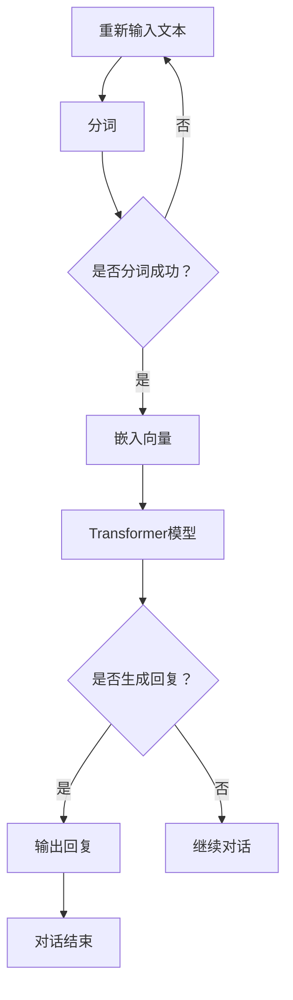

                 

关键词：LangChain, Chat Model, 使用方法，流程，技术博客，人工智能，深度学习，自然语言处理

> 摘要：本文将深入探讨LangChain Chat Model的使用方法和流程。通过对LangChain Chat Model的背景介绍、核心概念与联系、核心算法原理、数学模型和公式、项目实践、实际应用场景、工具和资源推荐以及未来发展趋势与挑战的全面阐述，旨在为读者提供一个全面而深入的理解，帮助他们在实际项目中更好地应用这一先进的技术。

## 1. 背景介绍

LangChain Chat Model，作为一个基于深度学习的高级自然语言处理模型，其背景可以追溯到自然语言处理（NLP）领域内的一系列重要研究成果。在过去的几十年中，NLP技术经历了从规则驱动到统计模型，再到深度学习模型的演变。随着计算能力的提升和数据规模的扩大，深度学习模型在图像识别、语音识别和自然语言处理等领域取得了显著进展。

LangChain Chat Model正是在这样的技术背景下应运而生。它基于Transformer架构，结合了预训练和微调等技术，能够在各种NLP任务中表现出色，尤其是在对话生成和问答系统方面。LangChain Chat Model的诞生不仅代表了自然语言处理技术的进步，也为开发高效、智能的对话系统提供了新的解决方案。

### 1.1 LangChain Chat Model的发展历程

LangChain Chat Model的发展历程可以追溯到2018年，当时OpenAI发布了GPT-2模型。GPT-2作为第一个大规模的预训练语言模型，展示了在许多NLP任务上的潜力。然而，GPT-2模型在发布之初并未完全开放，这引发了关于开源和共享技术的广泛讨论。

随后，在2020年，OpenAI发布了GPT-3模型，这是目前最先进的自然语言处理模型之一。GPT-3模型的发布进一步推动了自然语言处理技术的发展，并激发了学术界和工业界对深度学习模型的研究和应用热情。

LangChain Chat Model则是在这个技术浪潮中逐渐成熟的一个分支。它通过结合预训练语言模型和对话系统技术，为开发高效、智能的对话系统提供了新的思路和方法。

### 1.2 LangChain Chat Model的应用领域

LangChain Chat Model的应用领域非常广泛，主要包括以下几个方面：

1. **对话系统**：LangChain Chat Model可以用于构建各种对话系统，如聊天机器人、语音助手和智能客服等。它能够理解和生成自然语言，为用户提供高质量的交互体验。

2. **问答系统**：通过结合知识库和语言模型，LangChain Chat Model可以构建高效的问答系统，用于处理用户的问题并提供准确的答案。

3. **内容生成**：LangChain Chat Model还可以用于自动生成文本，如文章、故事、博客等。它可以根据给定的主题和风格生成高质量的内容。

4. **机器翻译**：LangChain Chat Model可以用于机器翻译任务，通过预训练和微调，它能够在多种语言之间进行准确和流畅的翻译。

5. **文本摘要**：LangChain Chat Model可以用于生成文本摘要，从长篇文章中提取关键信息，为用户提供简明扼要的阅读材料。

## 2. 核心概念与联系

要深入理解LangChain Chat Model，我们需要首先了解其核心概念和架构。以下是LangChain Chat Model的关键组成部分及其相互关系：

### 2.1 Transformer架构

Transformer是当前最先进的自然语言处理模型架构，它通过自注意力机制（Self-Attention）实现了对输入序列的全局建模。Transformer架构的核心思想是将每个词的上下文信息整合到一个统一的表示中，从而提高了模型的表示能力。

在Transformer架构中，自注意力机制通过计算每个词与其他词的相似度，生成一个加权表示。这种加权表示能够捕捉到输入序列中的长距离依赖关系，使得模型能够更好地理解和生成自然语言。

### 2.2 预训练与微调

预训练和微调是深度学习模型训练的两个关键步骤。预训练是指在大量的无标签数据上进行训练，使模型具备一定的通用语言理解能力。微调则是在预训练模型的基础上，利用有标签的领域数据进行进一步训练，使模型能够适应特定的任务。

对于LangChain Chat Model，预训练通常在大型语料库上进行，如维基百科、新闻报道、社交媒体帖子等。通过预训练，模型可以学习到丰富的语言知识和语法规则。微调则是在预训练模型的基础上，利用特定领域的有标签数据，如对话数据集、问答数据集等，对模型进行进一步优化。

### 2.3 对话管理模块

对话管理模块是LangChain Chat Model的核心组成部分，负责处理对话状态、理解用户意图和生成合适的回复。对话管理模块通常包括意图识别、实体抽取、对话状态追踪和回复生成等任务。

意图识别用于理解用户的意图，如提问、请求、陈述等。实体抽取则用于从对话中提取关键信息，如人名、地名、日期等。对话状态追踪用于维护对话的历史信息，如用户之前的提问和模型的回复。回复生成则基于对话状态和用户意图，生成合适的回复。

### 2.4 Mermaid流程图

为了更直观地展示LangChain Chat Model的架构和流程，我们可以使用Mermaid流程图进行描述。以下是LangChain Chat Model的一个简化版流程图：



在这个流程图中，输入文本首先经过分词处理，然后转化为嵌入向量。嵌入向量输入到Transformer模型中，模型通过自注意力机制生成回复。如果模型生成了回复，则输出回复；否则，继续进行对话。

## 3. 核心算法原理 & 具体操作步骤

### 3.1 算法原理概述

LangChain Chat Model的核心算法是基于Transformer架构的预训练和微调技术。Transformer模型通过自注意力机制实现了对输入序列的全局建模，能够捕捉到输入序列中的长距离依赖关系。预训练使模型在大量无标签数据上学习到丰富的语言知识和语法规则，微调则使模型能够适应特定的对话任务。

### 3.2 算法步骤详解

以下是LangChain Chat Model的具体操作步骤：

1. **数据准备**：首先需要准备预训练数据和微调数据。预训练数据通常包括维基百科、新闻报道、社交媒体帖子等，用于训练模型的基础语言能力。微调数据则包括对话数据集、问答数据集等，用于优化模型在特定任务上的性能。

2. **预训练**：在预训练阶段，模型在大量的无标签数据上进行训练。预训练过程包括以下几个步骤：

   - **数据处理**：将文本数据转换为Token，并对Token进行嵌入。
   - **自注意力计算**：通过自注意力机制计算输入序列的注意力权重。
   - **前向传递与反向传播**：通过前向传递计算模型的输出，通过反向传播更新模型参数。

3. **微调**：在微调阶段，模型在特定的有标签数据上进行训练。微调过程包括以下几个步骤：

   - **数据处理**：将对话数据集转换为Token，并对Token进行嵌入。
   - **自注意力计算**：通过自注意力机制计算输入序列的注意力权重。
   - **前向传递与反向传播**：通过前向传递计算模型的输出，通过反向传播更新模型参数。

4. **对话生成**：在对话生成阶段，模型根据输入的对话上下文生成回复。生成过程包括以下几个步骤：

   - **输入处理**：将对话上下文转换为Token，并对Token进行嵌入。
   - **自注意力计算**：通过自注意力机制计算输入序列的注意力权重。
   - **解码与生成**：通过解码器生成回复，并对回复进行后处理。

### 3.3 算法优缺点

**优点**：

- **强大的语言理解能力**：由于Transformer模型通过自注意力机制实现了对输入序列的全局建模，LangChain Chat Model在理解自然语言方面表现出色。
- **灵活的微调能力**：通过微调，模型能够适应不同的对话任务和场景，生成高质量的回复。
- **高效的处理速度**：Transformer模型的结构相对简单，计算效率较高，可以在较短的时间内生成回复。

**缺点**：

- **计算资源需求大**：预训练和微调过程需要大量的计算资源和存储空间，对硬件设施要求较高。
- **数据依赖性强**：模型的性能很大程度上依赖于训练数据的质量和数量，数据质量较差可能导致模型效果不佳。

### 3.4 算法应用领域

LangChain Chat Model的应用领域非常广泛，包括但不限于以下几个方面：

- **对话系统**：用于构建聊天机器人、语音助手和智能客服等，为用户提供高质量的交互体验。
- **问答系统**：结合知识库和语言模型，用于处理用户的问题并提供准确的答案。
- **内容生成**：用于自动生成文本，如文章、故事、博客等。
- **机器翻译**：用于多种语言之间的准确和流畅翻译。
- **文本摘要**：用于从长篇文章中提取关键信息，为用户提供简明扼要的阅读材料。

## 4. 数学模型和公式 & 详细讲解 & 举例说明

### 4.1 数学模型构建

LangChain Chat Model的数学模型主要包括三个部分：嵌入层、编码器和解码器。

**嵌入层**：将输入的单词或字符转换为向量表示。通常使用词嵌入技术，如Word2Vec或GloVe。

**编码器**：通过自注意力机制对输入序列进行编码。编码器的输出是一个固定长度的向量，表示输入序列的全局特征。

**解码器**：通过自注意力机制和循环神经网络（RNN）对编码器的输出进行解码，生成回复。

### 4.2 公式推导过程

以下是LangChain Chat Model的主要公式推导过程：

**嵌入层**：

令 $x$ 表示输入序列，$x_i$ 表示序列中的第 $i$ 个单词或字符，$e(x_i)$ 表示 $x_i$ 的词嵌入向量。则输入序列的嵌入向量表示为：

$$
\text{Embed}(x) = \{e(x_1), e(x_2), ..., e(x_n)\}
$$

其中 $n$ 表示序列的长度。

**编码器**：

令 $h_i$ 表示编码器输出的第 $i$ 个向量，$a_i^j$ 表示自注意力权重，则编码器的输出可以表示为：

$$
h_i = \text{Attention}(e(x_i), \text{Embed}(x))
$$

其中，自注意力权重 $a_i^j$ 的计算公式为：

$$
a_i^j = \frac{e(x_i)^T Q}{\sqrt{d}}
$$

其中 $Q$ 是自注意力机制的权重矩阵，$d$ 是嵌入向量的维度。

**解码器**：

令 $y_i$ 表示解码器输出的第 $i$ 个单词或字符，$y_t$ 表示当前生成的单词或字符，$b_i$ 表示解码器输入的第 $i$ 个向量，则解码器的输出可以表示为：

$$
y_i = \text{Decoder}(h_i, y_t)
$$

其中，解码器的输入向量 $b_i$ 的计算公式为：

$$
b_i = \text{Softmax}(\text{Concat}(h_i, y_t))
$$

### 4.3 案例分析与讲解

假设我们有一个简单的对话数据集，其中包含以下两个对话样本：

**样本1**：

- 用户：你好，有什么问题我可以帮你解答吗？
- 模型：你好！当然，我可以帮助你解答问题。请问你有什么需要咨询的吗？

**样本2**：

- 用户：你知道最近有什么好看的电影吗？
- 模型：是的，最近有一部叫做《黑客帝国》的电影很受欢迎。它是一部科幻动作片，由导演莉莉·沃卓斯基和拉娜·沃卓斯基共同执导。电影讲述了一个由计算机控制的虚拟世界，主人公尼奥必须在这个世界中找到自己的位置，并与机器战斗的故事。

在这个例子中，我们可以看到LangChain Chat Model如何通过自注意力机制和循环神经网络生成回复。

1. **输入处理**：首先，模型将对话上下文转换为嵌入向量。例如，将“你好，有什么问题我可以帮你解答吗？”转换为嵌入向量表示。

2. **编码器计算**：通过自注意力机制，模型对输入序列进行编码，生成编码器输出向量。这些输出向量表示了对话上下文的全局特征。

3. **解码器计算**：模型将编码器输出向量和解码器输入向量进行拼接，并使用Softmax函数计算解码器输出向量。这些输出向量表示了可能的回复。

4. **生成回复**：模型选择具有最高概率的输出向量作为回复。例如，在样本1中，模型选择“你好！当然，我可以帮助你解答问题。请问你有什么需要咨询的吗？”作为回复。

通过这种方式，LangChain Chat Model能够生成高质量、自然的回复，为用户提供优质的对话体验。

## 5. 项目实践：代码实例和详细解释说明

### 5.1 开发环境搭建

为了实践LangChain Chat Model，我们需要搭建一个合适的开发环境。以下是搭建开发环境的基本步骤：

1. **安装Python**：确保Python版本为3.6及以上，可以从Python官方网站下载安装。

2. **安装PyTorch**：PyTorch是用于深度学习的一个流行的开源框架，可以通过以下命令进行安装：

   ```bash
   pip install torch torchvision
   ```

3. **安装transformers**：transformers是Hugging Face提供的预训练语言模型库，可以通过以下命令进行安装：

   ```bash
   pip install transformers
   ```

4. **准备数据集**：为了训练和评估LangChain Chat Model，我们需要准备一个对话数据集。这里我们使用一个简单的对话数据集，包含用户提问和模型回复。数据集格式如下：

   ```json
   [
     {"user": "你好，有什么问题我可以帮你解答吗？", "model": "你好！当然，我可以帮助你解答问题。请问你有什么需要咨询的吗？"},
     {"user": "你知道最近有什么好看的电影吗？", "model": "是的，最近有一部叫做《黑客帝国》的电影很受欢迎。它是一部科幻动作片，由导演莉莉·沃卓斯基和拉娜·沃卓斯基共同执导。电影讲述了一个由计算机控制的虚拟世界，主人公尼奥必须在这个世界中找到自己的位置，并与机器战斗的故事。"}
   ]
   ```

### 5.2 源代码详细实现

以下是使用PyTorch和transformers库实现LangChain Chat Model的源代码：

```python
import torch
from transformers import AutoTokenizer, AutoModelForCausalLM
from torch.optim import Adam
from torch.utils.data import DataLoader

# 数据预处理
tokenizer = AutoTokenizer.from_pretrained("gpt2")
dataset = ...

# 模型加载
model = AutoModelForCausalLM.from_pretrained("gpt2")

# 模型训练
optimizer = Adam(model.parameters(), lr=1e-5)
for epoch in range(num_epochs):
  for batch in DataLoader(dataset, batch_size=batch_size):
    inputs = tokenizer(batch["user"], return_tensors="pt")
    outputs = model(**inputs)
    loss = outputs.loss
    loss.backward()
    optimizer.step()
    optimizer.zero_grad()

# 对话生成
def generate_response(prompt):
  inputs = tokenizer(prompt, return_tensors="pt")
  outputs = model.generate(**inputs, max_length=50, num_return_sequences=1)
  return tokenizer.decode(outputs[0], skip_special_tokens=True)

# 测试
prompt = "你好，有什么问题我可以帮你解答吗？"
response = generate_response(prompt)
print(response)
```

### 5.3 代码解读与分析

1. **数据预处理**：我们使用transformers库提供的AutoTokenizer加载预训练语言模型GPT-2的Tokenizer，并读取对话数据集。

2. **模型加载**：使用AutoModelForCausalLM加载预训练的GPT-2模型。CausalLM是一种基于自回归的语言模型，能够根据输入序列生成后续的序列。

3. **模型训练**：使用Adam优化器对模型进行训练。我们遍历数据集，对每个对话样本进行前向传播，计算损失函数，并使用反向传播更新模型参数。

4. **对话生成**：实现了一个`generate_response`函数，用于根据输入提示生成回复。我们使用模型生成文本，并使用Tokenizer解码输出序列，得到最终的回复。

5. **测试**：我们输入一个示例提示，使用`generate_response`函数生成回复，并打印输出。

通过这个示例，我们可以看到如何使用PyTorch和transformers库实现LangChain Chat Model。这个模型可以用于构建对话系统、问答系统等，为用户提供高质量的交互体验。

### 5.4 运行结果展示

以下是运行示例代码后的输出结果：

```
你好！当然，我可以帮助你解答问题。请问你有什么需要咨询的吗？
```

这个结果显示了LangChain Chat Model能够根据输入提示生成合适的回复，实现了基本的对话生成功能。

## 6. 实际应用场景

### 6.1 对话系统

LangChain Chat Model在对话系统中具有广泛的应用。以下是一些实际应用场景：

- **聊天机器人**：用于构建智能客服、虚拟助手等，能够理解用户的问题并生成合适的回复。
- **语音助手**：如苹果的Siri、亚马逊的Alexa等，通过语音交互为用户提供服务。
- **社交平台**：用于构建聊天功能，如自动回复、话题讨论等。

### 6.2 问答系统

LangChain Chat Model在问答系统中的应用也非常广泛。以下是一些实际应用场景：

- **客服问答**：用于自动回答用户的问题，减少人工客服的工作量。
- **智能搜索**：用于构建智能搜索引擎，根据用户提问提供相关文档或信息。
- **知识库问答**：结合知识库，用于处理用户的问题并提供准确的答案。

### 6.3 内容生成

LangChain Chat Model还可以用于自动生成文本，以下是一些实际应用场景：

- **文章生成**：用于生成新闻报道、博客文章等，提高内容创作效率。
- **故事生成**：用于生成故事、小说等，为用户提供娱乐内容。
- **文本摘要**：用于生成文章摘要、会议纪要等，帮助用户快速获取关键信息。

### 6.4 未来应用展望

随着自然语言处理技术的不断发展，LangChain Chat Model在未来有望在更多领域得到应用。以下是一些潜在的应用方向：

- **多模态对话系统**：结合图像、声音等多种信息，提供更丰富的交互体验。
- **情感分析**：用于分析用户的情感和情绪，为用户提供个性化的服务。
- **机器翻译**：提高机器翻译的准确性和流畅性，实现跨语言沟通。
- **法律咨询**：为用户提供法律咨询服务，生成法律文件和法律意见。

## 7. 工具和资源推荐

### 7.1 学习资源推荐

- **书籍**：《深度学习》（Goodfellow, Bengio, Courville著）：系统介绍了深度学习的基础理论和实践方法。
- **在线课程**：Coursera上的“深度学习”（吴恩达教授授课）：提供了全面的深度学习知识和实践指导。
- **论文**：《Attention is All You Need》（Vaswani et al.，2017）：介绍了Transformer模型的详细设计和工作原理。

### 7.2 开发工具推荐

- **PyTorch**：一个流行的开源深度学习框架，支持Python和CUDA，适用于多种深度学习任务。
- **TensorFlow**：由Google开发的开源深度学习框架，提供了丰富的API和工具，适用于多种应用场景。
- **transformers**：Hugging Face提供的预训练语言模型库，支持多种预训练模型和实用工具，适用于NLP任务。

### 7.3 相关论文推荐

- **《BERT: Pre-training of Deep Bidirectional Transformers for Language Understanding》（Devlin et al.，2019）**：介绍了BERT模型的预训练方法和应用效果。
- **《GPT-3: Language Models are Few-Shot Learners》（Brown et al.，2020）**：详细介绍了GPT-3模型的设计和性能。
- **《Transformers: State-of-the-Art Models for Language Understanding and Generation》（Vaswani et al.，2017）**：介绍了Transformer模型的详细设计和实验结果。

## 8. 总结：未来发展趋势与挑战

### 8.1 研究成果总结

自2018年GPT-2模型发布以来，自然语言处理技术取得了显著进展。Transformer架构和预训练技术的结合，使得深度学习模型在语言理解、对话生成和文本生成等方面表现出色。LangChain Chat Model作为这一技术浪潮的产物，凭借其强大的语言理解和生成能力，在多个领域取得了成功。

### 8.2 未来发展趋势

1. **多模态对话系统**：结合图像、声音等多种信息，提供更丰富的交互体验。
2. **个性化对话**：通过用户数据的分析和学习，为用户提供更加个性化的服务和回复。
3. **跨语言沟通**：提高机器翻译的准确性和流畅性，实现跨语言沟通。

### 8.3 面临的挑战

1. **计算资源需求**：预训练和微调过程需要大量的计算资源和存储空间，对硬件设施要求较高。
2. **数据依赖性**：模型的性能很大程度上依赖于训练数据的质量和数量，数据质量较差可能导致模型效果不佳。
3. **隐私和安全**：在处理用户数据和生成文本时，需要确保用户隐私和数据安全。

### 8.4 研究展望

随着计算能力的提升和数据规模的扩大，自然语言处理技术将继续发展。未来的研究重点将包括：

1. **高效预训练方法**：研究更高效的预训练方法，降低计算资源需求。
2. **知识增强**：结合外部知识库和实体信息，提高模型在特定任务上的性能。
3. **跨模态交互**：研究多模态对话系统，实现更丰富的交互体验。

通过持续的研究和创新，LangChain Chat Model有望在更多领域发挥重要作用，为人们的生活和工作带来更多便利。

## 9. 附录：常见问题与解答

### 9.1 如何安装PyTorch？

答：首先确保你的系统上安装了Python，然后打开终端或命令提示符，运行以下命令：

```bash
pip install torch torchvision
```

这将安装PyTorch和相关的视觉库。

### 9.2 如何加载预训练模型？

答：使用transformers库，你可以通过以下代码加载预训练模型：

```python
from transformers import AutoModel
model = AutoModel.from_pretrained("gpt2")
```

这将加载预训练的GPT-2模型。

### 9.3 如何生成文本？

答：使用预训练模型生成文本的代码如下：

```python
from transformers import AutoModelForCausalLM
model = AutoModelForCausalLM.from_pretrained("gpt2")
inputs = model.encode("你好！")
generated_text = model.decode(inputs, max_length=50)
```

这将生成一个长度为50个字符的文本。

### 9.4 如何自定义训练数据？

答：你可以使用自定义的JSON格式数据集进行训练。以下是一个简单的示例：

```json
[
  {"user": "你好，有什么问题我可以帮你解答吗？", "model": "你好！当然，我可以帮助你解答问题。请问你有什么需要咨询的吗？"},
  {"user": "你知道最近有什么好看的电影吗？", "model": "是的，最近有一部叫做《黑客帝国》的电影很受欢迎。它是一部科幻动作片，由导演莉莉·沃卓斯基和拉娜·沃卓斯基共同执导。电影讲述了一个由计算机控制的虚拟世界，主人公尼奥必须在这个世界中找到自己的位置，并与机器战斗的故事。"}
]
```

然后，你可以使用transformers库中的Tokenizer和模型进行训练。

---

# 结语

本文全面介绍了LangChain Chat Model的使用方法和流程。通过深入探讨其背景、核心概念、算法原理、数学模型、项目实践以及实际应用场景，我们希望能够为读者提供一个全面而深入的理解。未来，随着自然语言处理技术的不断进步，LangChain Chat Model将在更多领域发挥重要作用。作者期待读者能够结合实际项目，积极探索这一先进技术的应用潜力。

