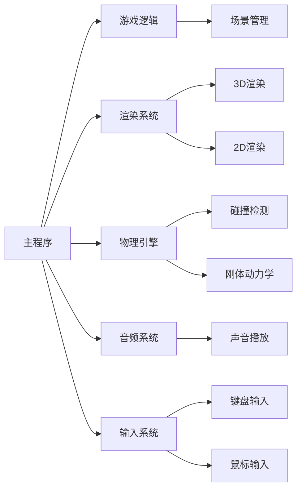
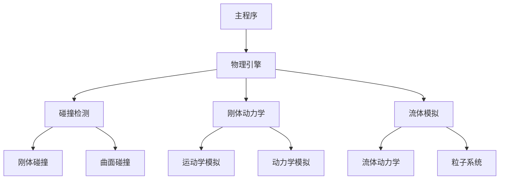

                 

 在当今游戏开发领域，Unity和Unreal Engine 4（UE4）无疑是两大主流游戏开发框架。它们不仅为开发者提供了强大的功能，还为游戏行业带来了革命性的变革。本文将深入探讨Unity和UE4的发展历程、核心概念、算法原理以及实际应用，旨在为读者提供全面的技术解读。

## 文章关键词

- Unity
- Unreal Engine 4
- 游戏开发框架
- 核心概念
- 算法原理
- 实际应用

## 文章摘要

本文首先回顾了Unity和UE4的发展历程，分析了它们在游戏开发领域的重要地位。接着，我们详细介绍了这两个框架的核心概念，包括游戏引擎的基本构成、渲染技术以及物理引擎。随后，文章深入探讨了Unity和UE4的算法原理，重点分析了场景管理和游戏逻辑的处理机制。在项目实践部分，我们通过具体实例展示了如何使用这两个框架进行游戏开发。最后，文章总结了Unity和UE4的实际应用场景，并对未来的发展趋势和挑战进行了展望。

## 1. 背景介绍

Unity和Unreal Engine 4都是当前游戏开发领域的重要框架，它们各自拥有庞大的用户群体和丰富的功能。

### Unity的发展历程

Unity诞生于2005年，由Unity Technologies公司开发。它最初是一个用于开发网页游戏和移动游戏的跨平台游戏引擎。随着技术的进步和游戏市场的需求，Unity逐渐扩展其功能，成为一款全面的游戏开发框架。Unity的跨平台特性使得开发者可以轻松地将游戏发布到多个平台，包括Windows、Mac、Linux、iOS和Android等。

### Unreal Engine 4的发展历程

Unreal Engine 4（简称UE4）是由Epic Games开发的跨平台游戏引擎。它首次亮相于2014年，以其卓越的图形渲染能力和强大的开发工具而备受瞩目。UE4广泛应用于各种游戏类型，包括动作游戏、角色扮演游戏和策略游戏等。

### 在游戏开发领域的重要地位

Unity和UE4在游戏开发领域具有重要地位，主要体现在以下几个方面：

- **强大的开发工具**：这两个框架都提供了丰富的开发工具，包括编辑器、调试器、脚本引擎等，极大地提高了开发效率。
- **跨平台支持**：Unity和UE4都支持跨平台开发，使得开发者可以轻松地将游戏发布到多个平台，降低开发成本。
- **社区支持**：Unity和UE4都拥有庞大的开发者社区，提供了大量的教程、文档和资源，为开发者提供了强有力的支持。

## 2. 核心概念与联系

为了更好地理解Unity和UE4，我们需要从核心概念和架构方面进行探讨。

### 游戏引擎的基本构成

游戏引擎是游戏开发的核心，它提供了各种功能模块，包括渲染、物理、音效、输入等。以下是一个典型的游戏引擎基本构成流程图（使用Mermaid格式）：



### 渲染技术

渲染技术是游戏开发中至关重要的部分。Unity和UE4都采用了先进的渲染技术，包括光线追踪、实时阴影、反射和折射等。

- **Unity的渲染技术**：Unity使用的是基于物理的渲染（BPR），它提供了高质量的渲染效果，同时保证了性能。Unity还引入了HDR渲染和屏幕后处理效果，使得游戏画面更加真实。

- **UE4的渲染技术**：UE4以其卓越的图形渲染能力而闻名。它采用了基于光线的渲染技术，使得场景的视觉效果非常逼真。UE4还支持环境光照、软阴影、高动态范围（HDR）和屏幕空间后处理等技术。

### 物理引擎

物理引擎负责模拟游戏中的物理现象，包括碰撞检测、刚体动力学、流体模拟等。

- **Unity的物理引擎**：Unity内置了基于碰撞盒的物理引擎，支持2D和3D游戏。它提供了丰富的物理模拟功能，包括刚体动力学、弹簧、重力场等。

- **UE4的物理引擎**：UE4的物理引擎非常强大，支持复杂的物理模拟。它提供了多种物理模拟工具，如刚体动力学、流体模拟、粒子系统等。

### Mermaid流程图

以下是一个用于描述Unity和UE4物理引擎架构的Mermaid流程图：



通过以上核心概念的介绍和Mermaid流程图的展示，我们可以更好地理解Unity和UE4的基本架构和功能。

## 3. 核心算法原理 & 具体操作步骤

### 3.1 算法原理概述

在游戏开发中，算法原理起着至关重要的作用。Unity和UE4都采用了先进的算法原理，以实现高效的场景管理和游戏逻辑处理。

### 3.2 算法步骤详解

#### 3.2.1 场景管理

场景管理是游戏开发中的一个核心问题。Unity和UE4都采用了高效的数据结构和算法来实现场景管理。

- **Unity的场景管理**：Unity使用的是基于场景图（Scene Graph）的场景管理机制。场景图是一种树形结构，每个节点代表一个场景对象。通过场景图，Unity可以高效地管理场景中的对象，实现对象创建、销毁、移动等操作。

- **UE4的场景管理**：UE4使用的是基于空间划分（Spatial Partitioning）的场景管理机制。空间划分将场景划分为多个区域，每个区域负责管理一定范围内的对象。通过空间划分，UE4可以高效地管理场景中的对象，减少渲染和碰撞检测的开销。

#### 3.2.2 游戏逻辑处理

游戏逻辑处理是游戏开发中的另一个重要问题。Unity和UE4都采用了事件驱动（Event-Driven）的编程模型来实现游戏逻辑处理。

- **Unity的游戏逻辑处理**：Unity使用的是基于脚本（Script）的游戏逻辑处理机制。开发者可以使用C#等编程语言编写脚本，实现游戏逻辑。Unity的脚本系统提供了丰富的API，使得开发者可以轻松地实现各种游戏逻辑。

- **UE4的游戏逻辑处理**：UE4使用的是基于蓝图（Blueprint）的游戏逻辑处理机制。蓝图是一种可视化的编程工具，开发者可以通过拖拽节点和连接线来构建游戏逻辑。蓝图的优点在于易于理解和修改，适合快速迭代开发。

### 3.3 算法优缺点

#### Unity的优缺点

- **优点**：
  - 跨平台支持：Unity支持多种平台，包括Windows、Mac、Linux、iOS和Android等。
  - 开发工具强大：Unity提供了丰富的开发工具，包括编辑器、调试器、脚本引擎等。
  - 社区支持：Unity拥有庞大的开发者社区，提供了大量的教程、文档和资源。

- **缺点**：
  - 性能限制：相较于UE4，Unity在图形渲染和物理模拟方面存在一定的性能限制。
  - 学习曲线：Unity的学习曲线相对较陡峭，对于新手开发者来说可能有一定难度。

#### UE4的优缺点

- **优点**：
  - 图形渲染能力强大：UE4以其卓越的图形渲染能力而闻名，支持光线追踪、环境光照等高级渲染技术。
  - 开发工具强大：UE4提供了丰富的开发工具，包括编辑器、调试器、蓝图系统等。
  - 社区支持：UE4同样拥有庞大的开发者社区，提供了大量的教程、文档和资源。

- **缺点**：
  - 性能需求较高：UE4对硬件性能要求较高，可能不适合所有设备和平台。
  - 学习曲线：UE4的学习曲线相对较陡峭，对于新手开发者来说可能有一定难度。

### 3.4 算法应用领域

Unity和UE4都可以应用于各种游戏类型，包括动作游戏、角色扮演游戏、策略游戏等。

- **Unity的应用领域**：Unity广泛应用于移动游戏、网页游戏和桌面游戏。由于其跨平台特性和强大的开发工具，Unity成为许多小型游戏开发团队的首选。

- **UE4的应用领域**：UE4广泛应用于大型游戏、虚拟现实（VR）和增强现实（AR）应用。由于其卓越的图形渲染能力和丰富的开发工具，UE4成为许多大型游戏开发团队的首选。

## 4. 数学模型和公式 & 详细讲解 & 举例说明

### 4.1 数学模型构建

在游戏开发中，数学模型是描述物理现象和游戏逻辑的基础。Unity和UE4都采用了多种数学模型来实现游戏效果。

#### 4.1.1 渲染模型

渲染模型用于描述场景的渲染过程。Unity采用了基于物理的渲染模型（BPR），其核心公式包括：

$$
L_o(\mathbf{p}) = f_r(\mathbf{p}, \mathbf{w}) \cdot L_e(\mathbf{p}) + f_d(\mathbf{p}, \mathbf{w}) \cdot L_d(\mathbf{p})
$$

其中，$L_o(\mathbf{p})$是输出光强度，$f_r(\mathbf{p}, \mathbf{w})$是反射模型，$L_e(\mathbf{p})$是环境光强度，$f_d(\mathbf{p}, \mathbf{w})$是漫反射模型，$\mathbf{w}$是光线方向。

UE4采用了基于光线的渲染模型，其核心公式包括：

$$
L_o(\mathbf{p}) = \int_{\Omega} f_r(\mathbf{p}, \mathbf{w}) \cdot L_e(\mathbf{p}) \cdot \cos(\theta) \cdot d\omega
$$

其中，$\Omega$是全空间，$\theta$是光线与表面的夹角，$d\omega$是光线在$\Omega$上的微小角度。

#### 4.1.2 物理模型

物理模型用于描述物体的运动和碰撞。Unity采用了基于碰撞盒的物理模型，其核心公式包括：

$$
\mathbf{v}_{t+1} = \mathbf{v}_{t} + \mathbf{a}_{t} \cdot \Delta t
$$

其中，$\mathbf{v}_{t+1}$是下一时刻的速度，$\mathbf{v}_{t}$是当前时刻的速度，$\mathbf{a}_{t}$是加速度，$\Delta t$是时间间隔。

UE4采用了基于刚体动力学（Rigid Body Dynamics）的物理模型，其核心公式包括：

$$
\mathbf{v}_{t+1} = \mathbf{v}_{t} + \mathbf{a}_{t} \cdot \Delta t
$$

$$
\mathbf{p}_{t+1} = \mathbf{p}_{t} + \mathbf{v}_{t} \cdot \Delta t
$$

其中，$\mathbf{p}_{t+1}$是下一时刻的位置，$\mathbf{p}_{t}$是当前时刻的位置。

### 4.2 公式推导过程

#### 4.2.1 渲染模型

渲染模型是基于物理的光学原理构建的。首先，我们考虑一个点光源向一个表面发射光线。光线与表面的夹角$\theta$决定了光线在表面上的反射强度。反射模型可以根据菲涅尔定律（Fresnel's Law）进行推导：

$$
f_r(\mathbf{p}, \mathbf{w}) = \frac{n_1 \cdot \cos(\theta_i) - n_2 \cdot \cos(\theta_r)}{n_1 \cdot \cos(\theta_i) + n_2 \cdot \cos(\theta_r)}
$$

其中，$n_1$和$n_2$分别是光线入射和反射介质的折射率，$\theta_i$和$\theta_r$分别是入射角和反射角。

接下来，我们考虑环境光对表面反射的影响。环境光是指从各个方向照射到表面上的光线。我们可以将环境光视为无数个点光源的组合，每个点光源的光线强度与角度有关。因此，环境光的贡献可以通过积分计算：

$$
L_e(\mathbf{p}) = \int_{\Omega} L_e(\mathbf{p}, \mathbf{w}) \cdot \cos(\theta) \cdot d\omega
$$

其中，$L_e(\mathbf{p}, \mathbf{w})$是环境光强度，$\theta$是光线与表面的夹角，$d\omega$是光线在$\Omega$上的微小角度。

最后，我们将反射模型和环境光结合起来，得到渲染模型：

$$
L_o(\mathbf{p}) = f_r(\mathbf{p}, \mathbf{w}) \cdot L_e(\mathbf{p}) + f_d(\mathbf{p}, \mathbf{w}) \cdot L_d(\mathbf{p})
$$

#### 4.2.2 物理模型

物理模型是基于牛顿力学（Newton's Laws of Motion）构建的。首先，我们考虑一个物体在恒定加速度下的运动。根据牛顿第二定律，物体的加速度与作用力成正比，与质量成反比。我们可以将加速度表示为：

$$
\mathbf{a}_{t} = \frac{\mathbf{F}_{t}}{m}
$$

其中，$\mathbf{F}_{t}$是作用力，$m$是物体的质量。

接下来，我们考虑物体的运动。根据牛顿第一定律，一个物体在没有外力作用下将保持静止或匀速直线运动。因此，我们可以将物体的速度表示为：

$$
\mathbf{v}_{t} = \mathbf{v}_{0} + \mathbf{a}_{t} \cdot \Delta t
$$

其中，$\mathbf{v}_{t}$是下一时刻的速度，$\mathbf{v}_{0}$是初始速度，$\mathbf{a}_{t}$是加速度，$\Delta t$是时间间隔。

最后，我们考虑物体的位置。根据牛顿第一定律，一个物体在没有外力作用下将保持静止或匀速直线运动。因此，我们可以将物体的位置表示为：

$$
\mathbf{p}_{t+1} = \mathbf{p}_{t} + \mathbf{v}_{t} \cdot \Delta t
$$

其中，$\mathbf{p}_{t+1}$是下一时刻的位置，$\mathbf{p}_{t}$是当前时刻的位置，$\mathbf{v}_{t}$是速度。

### 4.3 案例分析与讲解

#### 4.3.1 渲染模型

假设一个场景中有一个点光源，光源的强度为100单位。一个表面位于光源的直线上，距离光源2个单位。表面材料的折射率为1.5，反射率为0.8。环境光强度为50单位。

根据渲染模型，我们可以计算表面上的光强度：

$$
L_o(\mathbf{p}) = f_r(\mathbf{p}, \mathbf{w}) \cdot L_e(\mathbf{p}) + f_d(\mathbf{p}, \mathbf{w}) \cdot L_d(\mathbf{p})
$$

其中，$f_r(\mathbf{p}, \mathbf{w}) = 0.8$，$L_e(\mathbf{p}) = 50$单位，$L_d(\mathbf{p}) = 50$单位。

根据反射模型，我们可以计算光线在表面上的反射强度：

$$
f_r(\mathbf{p}, \mathbf{w}) = \frac{n_1 \cdot \cos(\theta_i) - n_2 \cdot \cos(\theta_r)}{n_1 \cdot \cos(\theta_i) + n_2 \cdot \cos(\theta_r)}
$$

其中，$n_1 = 1$（空气的折射率），$n_2 = 1.5$（表面材料的折射率），$\theta_i = 0$（光线与表面的夹角为0度），$\theta_r = 0$（光线与表面的反射角为0度）。

因此，反射模型可以简化为：

$$
f_r(\mathbf{p}, \mathbf{w}) = \frac{1 \cdot \cos(0) - 1.5 \cdot \cos(0)}{1 \cdot \cos(0) + 1.5 \cdot \cos(0)} = \frac{1 - 1.5}{1 + 1.5} = -0.25
$$

根据环境光和漫反射模型，我们可以计算表面上的光强度：

$$
L_o(\mathbf{p}) = f_r(\mathbf{p}, \mathbf{w}) \cdot L_e(\mathbf{p}) + f_d(\mathbf{p}, \mathbf{w}) \cdot L_d(\mathbf{p}) = -0.25 \cdot 50 + 0.8 \cdot 50 = 25
$$

因此，表面上的光强度为25单位。

#### 4.3.2 物理模型

假设一个物体质量为10千克，受到一个大小为5牛的力作用。初始速度为0米/秒，时间间隔为1秒。

根据物理模型，我们可以计算物体的加速度：

$$
\mathbf{a}_{t} = \frac{\mathbf{F}_{t}}{m} = \frac{5}{10} = 0.5 \text{ m/s}^2
$$

根据速度公式，我们可以计算物体的速度：

$$
\mathbf{v}_{t} = \mathbf{v}_{0} + \mathbf{a}_{t} \cdot \Delta t = 0 + 0.5 \cdot 1 = 0.5 \text{ m/s}
$$

根据位置公式，我们可以计算物体的位置：

$$
\mathbf{p}_{t+1} = \mathbf{p}_{t} + \mathbf{v}_{t} \cdot \Delta t = 0 + 0.5 \cdot 1 = 0.5 \text{ m}
$$

因此，1秒后物体的速度为0.5米/秒，位置为0.5米。

## 5. 项目实践：代码实例和详细解释说明

在本节中，我们将通过一个简单的Unity项目来展示如何使用Unity进行游戏开发。该项目将实现一个简单的2D平台游戏，玩家角色可以跳跃并在平台之间移动。

### 5.1 开发环境搭建

要开始使用Unity进行游戏开发，首先需要安装Unity Hub和Unity编辑器。以下是具体的步骤：

1. 访问Unity官网（https://unity.com/）并下载Unity Hub。
2. 运行Unity Hub，点击“Install Unity”按钮。
3. 在安装过程中，选择“Unity Editor”选项，并选择合适的目标平台。
4. 安装完成后，运行Unity Editor。

### 5.2 源代码详细实现

下面是项目的源代码，包括PlayerController.cs和SceneController.cs两个脚本：

```csharp
using UnityEngine;

public class PlayerController : MonoBehaviour
{
    public float moveSpeed = 5.0f;
    public float jumpHeight = 7.0f;

    private bool isGrounded;
    private float moveDirection;

    private Rigidbody2D rb;

    void Start()
    {
        rb = GetComponent<Rigidbody2D>();
    }

    void Update()
    {
        isGrounded = Physics2D.Raycast(transform.position, -Vector2.up, 0.1f);

        if (Input.GetKeyDown(KeyCode.Space) && isGrounded)
        {
            rb.AddForce(Vector2.up * jumpHeight);
        }

        moveDirection = Input.GetAxis("Horizontal") * moveSpeed;

        rb.velocity = new Vector2(moveDirection * moveSpeed, rb.velocity.y);
    }
}

public class SceneController : MonoBehaviour
{
    public GameObject platformPrefab;

    private Transform platformHolder;

    void Start()
    {
        platformHolder = new GameObject("Platforms").transform;
    }

    void Update()
    {
        if (transform.position.x > 10)
        {
            GeneratePlatform();
        }
    }

    void GeneratePlatform()
    {
        float x = transform.position.x + 10;
        float y = Random.Range(-3, 3);

        GameObject platform = Instantiate(platformPrefab, new Vector3(x, y, 0), Quaternion.identity);
        platform.transform.SetParent(platformHolder);
    }
}
```

### 5.3 代码解读与分析

#### PlayerController.cs

- **变量声明**：
  - moveSpeed：控制玩家移动的速度。
  - jumpHeight：控制玩家跳跃的高度。
  - isGrounded：用于判断玩家是否在地面上。
  - moveDirection：用于存储玩家输入的移动方向。
  - rb：玩家的Rigidbody2D组件。

- **方法解析**：
  - Start()：初始化Rigidbody2D组件。
  - Update()：处理玩家的跳跃和移动。首先判断玩家是否在地面上，如果是，则允许玩家跳跃。然后根据玩家输入的方向和速度更新玩家的移动。

- **作用**：控制玩家的跳跃和移动。

#### SceneController.cs

- **变量声明**：
  - platformPrefab：平台的预制体。
  - platformHolder：用于存储生成平台的Transform对象。

- **方法解析**：
  - Start()：创建一个名为"Platforms"的空GameObject，用于存储生成的平台。
  - Update()：判断玩家是否走出了屏幕范围。如果走出了屏幕范围，则生成一个新的平台。
  - GeneratePlatform()：生成一个新的平台。平台的X坐标为玩家位置加上10，Y坐标为随机值，Z坐标为0。生成的平台将作为子对象添加到platformHolder。

- **作用**：生成和管理游戏中的平台。

### 5.4 运行结果展示

运行项目后，玩家可以控制角色在生成的平台之间跳跃和移动。随着玩家向右移动，新的平台将不断生成。

## 6. 实际应用场景

Unity和UE4在游戏开发领域有着广泛的应用。以下是一些实际应用场景：

### 6.1 单机游戏开发

Unity和UE4都适用于单机游戏开发。开发者可以使用这两个框架创建各种类型的单机游戏，如动作游戏、角色扮演游戏、策略游戏等。Unity因其强大的跨平台能力和易于使用的开发工具，成为许多小型游戏开发团队的首选。UE4则以其卓越的图形渲染能力和丰富的开发工具，吸引了许多大型游戏开发团队。

### 6.2 多人在线游戏开发

Unity和UE4都支持多人在线游戏开发。开发者可以使用这两个框架创建多人在线游戏，如多人在线角色扮演游戏（MMORPG）、多人第一人称射击游戏（FPS）等。Unity的跨平台特性和庞大的开发者社区，使得它成为多人在线游戏开发的理想选择。UE4则以其强大的图形渲染能力和物理模拟能力，为多人在线游戏提供了出色的体验。

### 6.3 虚拟现实和增强现实应用

Unity和UE4都在虚拟现实（VR）和增强现实（AR）应用方面取得了显著成果。Unity凭借其强大的VR插件和AR插件，为开发者提供了便捷的VR和AR开发工具。UE4则以其卓越的图形渲染能力和丰富的VR和AR功能，为开发者提供了强大的支持。

### 6.4 游戏引擎研发

Unity和UE4本身也是游戏引擎研发的重要平台。许多游戏开发公司使用这两个框架作为研发基础，创建自己的游戏引擎。例如，Unity Technologies公司使用Unity框架开发了自家的Unity Engine，而Epic Games公司使用UE4框架开发了自家的Epic Engine。

## 7. 工具和资源推荐

### 7.1 学习资源推荐

- **Unity官方文档**：https://docs.unity.com/
- **Unreal Engine官方文档**：https://docs.unrealengine.com/
- **Unity教程**：https://unity.com/learn
- **Unreal Engine教程**：https://learn.unrealengine.com/

### 7.2 开发工具推荐

- **Unity Hub**：用于安装和更新Unity编辑器的工具。
- **Unreal Engine Editor**：用于开发UE4项目的集成开发环境。
- **Visual Studio**：用于编写Unity和UE4项目的C#和C++代码。

### 7.3 相关论文推荐

- **"Unreal Engine 4 Architecture and Design"**：详细介绍UE4的架构和设计。
- **"The Unity Game Engine: An Overview"**：对Unity游戏引擎的全面介绍。
- **"Rendering Techniques for Real-Time Computer Graphics"**：关于实时计算机图形渲染技术的论文。

## 8. 总结：未来发展趋势与挑战

### 8.1 研究成果总结

Unity和UE4在游戏开发领域取得了显著的成果。Unity以其强大的跨平台能力和易于使用的开发工具，成为许多小型游戏开发团队的首选。UE4则以其卓越的图形渲染能力和丰富的开发工具，吸引了许多大型游戏开发团队。这两个框架都在不断演进，提供了更多功能和更好的用户体验。

### 8.2 未来发展趋势

未来，Unity和UE4将继续在游戏开发领域发挥重要作用。以下是几个可能的发展趋势：

- **更强大的图形渲染能力**：随着硬件性能的提升，Unity和UE4将不断引入新的渲染技术，提供更逼真的游戏画面。
- **更智能的场景管理**：通过人工智能和机器学习技术，Unity和UE4将实现更高效的场景管理和资源优化。
- **更丰富的开发工具**：Unity和UE4将继续引入新的开发工具和插件，提高开发效率和创作自由度。

### 8.3 面临的挑战

尽管Unity和UE4在游戏开发领域取得了显著成果，但它们也面临着一些挑战：

- **性能优化**：随着游戏画面和游戏内容的复杂度增加，性能优化成为一项重要任务。Unity和UE4需要不断优化渲染、物理和音频等模块，以提高游戏性能。
- **开发者培训**：Unity和UE4的学习曲线相对较陡峭，许多新手开发者需要时间和精力来掌握这两个框架。因此，开发者培训成为一项重要挑战。
- **市场竞争**：随着游戏开发框架的不断增多，Unity和UE4需要不断创新和优化，以保持竞争优势。

### 8.4 研究展望

Unity和UE4在游戏开发领域的未来充满希望。通过不断优化和创新，这两个框架将为开发者提供更强大的功能和更好的用户体验。随着游戏行业的发展和技术的进步，Unity和UE4将继续在游戏开发领域发挥重要作用。

## 9. 附录：常见问题与解答

### 9.1 Unity和UE4的区别是什么？

Unity和UE4都是强大的游戏开发框架，但它们在功能、性能和开发难度等方面存在一些差异。

- **功能**：Unity提供丰富的跨平台支持和易于使用的开发工具，而UE4以其卓越的图形渲染能力和丰富的开发工具而闻名。
- **性能**：UE4在图形渲染和物理模拟方面性能更优，但可能对硬件性能要求较高。
- **开发难度**：Unity的学习曲线相对较平缓，适合新手开发者；UE4的学习曲线较陡峭，但提供了更强大的功能。

### 9.2 如何选择Unity和UE4？

选择Unity或UE4取决于项目需求和团队技能。以下是一些参考因素：

- **项目类型**：对于大多数小型游戏和跨平台游戏，Unity是更好的选择。对于大型游戏和具有高级图形需求的游戏，UE4可能更适合。
- **团队技能**：如果团队已经熟悉Unity，那么继续使用Unity可能更高效。如果团队对高级图形和物理模拟有较高要求，UE4可能更适合。
- **性能需求**：如果硬件性能是关键因素，应考虑UE4。

### 9.3 Unity和UE4的优势是什么？

Unity和UE4的优势包括：

- **Unity**：强大的跨平台支持、丰富的开发工具和庞大的开发者社区。
- **UE4**：卓越的图形渲染能力、丰富的开发工具和强大的物理引擎。

### 9.4 Unity和UE4的未来发展如何？

Unity和UE4将继续在游戏开发领域发挥重要作用。未来，它们将引入更多功能、优化性能，并不断提升开发者体验。随着游戏行业的发展，Unity和UE4有望在更多领域取得突破。

