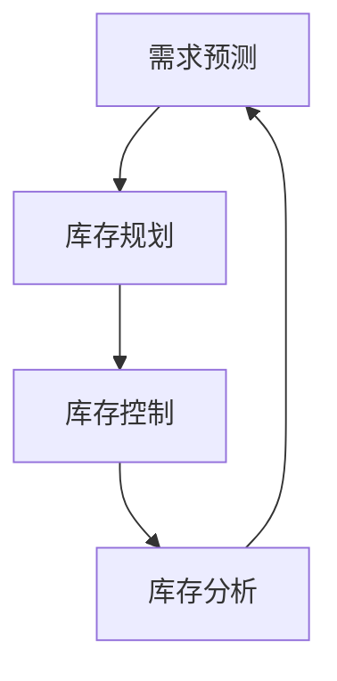
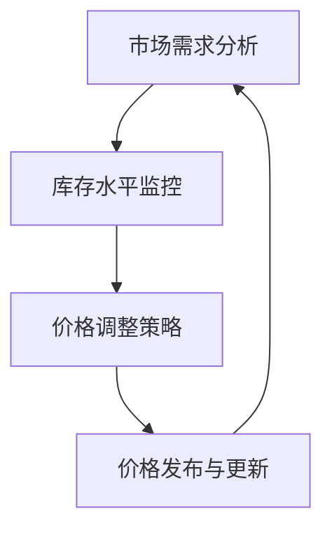
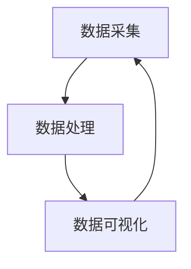

                 

关键词：短期需求、商品供给、供应链管理、库存优化、动态定价

## 摘要

在电子商务和快速消费品市场中，满足短期需求的商品供给是一项具有挑战性的任务。本文将深入探讨这一主题，从供应链管理的角度出发，分析库存优化、动态定价以及实时数据监测等技术手段，如何帮助企业和商家更有效地应对短期需求波动，实现商品供给的精准匹配。

## 1. 背景介绍

### 1.1 短期需求的特点

短期需求通常具有以下特点：

- **波动性**：短期需求受到季节性、节假日、促销活动等因素的影响，表现出较大的波动性。
- **不确定性**：由于消费者行为的复杂性，短期需求往往难以预测。
- **时效性**：短期需求要求快速响应，以满足市场需求。

### 1.2 商品供给的重要性

商品供给的质量和效率直接影响企业的盈利能力和市场竞争力。在满足短期需求的情况下，合理的商品供给策略可以降低库存成本、减少缺货风险，同时提高客户满意度。

## 2. 核心概念与联系

### 2.1 库存优化

库存优化是通过科学的库存管理策略，降低库存成本，提高库存周转率，从而满足市场需求。

#### 2.1.1 库存优化原理

库存优化原理主要包括以下几个步骤：

1. **需求预测**：通过历史数据分析和市场调研，预测短期需求。
2. **库存规划**：根据需求预测结果，制定库存计划。
3. **库存控制**：实时监控库存水平，调整库存策略。

#### 2.1.2 库存优化流程

库存优化流程如图所示：



### 2.2 动态定价

动态定价是指根据市场需求和库存水平，实时调整商品价格，以实现利润最大化。

#### 2.2.1 动态定价原理

动态定价原理主要包括以下几个因素：

- **市场需求**：市场需求高时，价格上涨；市场需求低时，价格下降。
- **库存水平**：库存高时，价格下降；库存低时，价格上涨。
- **竞争环境**：竞争对手的价格策略也会影响动态定价。

#### 2.2.2 动态定价流程

动态定价流程如图所示：



### 2.3 实时数据监测

实时数据监测是通过技术手段，实时获取商品销售、库存、价格等数据，为库存优化和动态定价提供数据支持。

#### 2.3.1 实时数据监测原理

实时数据监测原理主要包括以下几个步骤：

1. **数据采集**：通过物联网、传感器等技术，实时采集商品销售、库存等数据。
2. **数据处理**：对采集到的数据进行处理，提取有用信息。
3. **数据可视化**：将处理后的数据以图表、报表等形式进行可视化展示。

#### 2.3.2 实时数据监测流程

实时数据监测流程如图所示：



## 3. 核心算法原理 & 具体操作步骤

### 3.1 算法原理概述

在满足短期需求的商品供给中，核心算法主要包括需求预测算法、动态定价算法和实时数据监测算法。

#### 3.1.1 需求预测算法

需求预测算法主要基于历史数据和当前市场环境，通过时间序列分析、回归分析等方法，预测短期需求。

#### 3.1.2 动态定价算法

动态定价算法主要基于市场需求和库存水平，通过优化算法，实时调整商品价格。

#### 3.1.3 实时数据监测算法

实时数据监测算法主要基于物联网、传感器等技术，实现对商品销售、库存等数据的实时采集和处理。

### 3.2 算法步骤详解

#### 3.2.1 需求预测算法步骤

1. **数据预处理**：对历史销售数据进行清洗、去噪，提取有效信息。
2. **特征工程**：根据历史数据和市场环境，选择合适的特征进行特征工程。
3. **模型选择**：选择合适的需求预测模型，如时间序列模型、回归模型等。
4. **模型训练与验证**：对模型进行训练和验证，调整参数，优化模型性能。
5. **需求预测**：利用训练好的模型，预测短期需求。

#### 3.2.2 动态定价算法步骤

1. **市场需求分析**：分析市场需求，确定市场需求高低。
2. **库存水平监控**：实时监控库存水平，确定库存高低。
3. **价格调整策略**：根据市场需求和库存水平，制定价格调整策略。
4. **价格发布与更新**：实时发布和更新商品价格。

#### 3.2.3 实时数据监测算法步骤

1. **数据采集**：通过物联网、传感器等技术，实时采集商品销售、库存等数据。
2. **数据处理**：对采集到的数据进行处理，提取有用信息。
3. **数据可视化**：将处理后的数据以图表、报表等形式进行可视化展示。

### 3.3 算法优缺点

#### 3.3.1 需求预测算法优缺点

- **优点**：准确预测短期需求，为库存优化和动态定价提供数据支持。
- **缺点**：预测结果受历史数据和模型选择影响，存在一定的不确定性。

#### 3.3.2 动态定价算法优缺点

- **优点**：根据市场需求和库存水平，实现实时价格调整，提高盈利能力。
- **缺点**：价格调整策略复杂，需要实时监控市场需求和库存水平。

#### 3.3.3 实时数据监测算法优缺点

- **优点**：实时采集和处理数据，提高供应链管理效率。
- **缺点**：数据采集和处理成本较高，对技术要求较高。

### 3.4 算法应用领域

需求预测算法、动态定价算法和实时数据监测算法在以下领域有广泛应用：

- **电子商务**：通过对短期需求的预测和动态定价，提高商品供给效率。
- **快速消费品**：通过对库存的实时监测和优化，降低库存成本。
- **物流运输**：通过对商品运输的实时监控，提高运输效率。

## 4. 数学模型和公式 & 详细讲解 & 举例说明

### 4.1 数学模型构建

#### 4.1.1 需求预测模型

需求预测模型可以采用时间序列模型，如ARIMA模型。假设需求序列为\(X_t\)，时间序列模型可以表示为：

$$
X_t = \phi X_{t-1} + \theta \varepsilon_t
$$

其中，\(\phi\)和\(\theta\)为模型参数，\(\varepsilon_t\)为白噪声。

#### 4.1.2 动态定价模型

动态定价模型可以采用线性规划模型。假设商品价格为\(P_t\)，市场需求为\(D_t\)，库存水平为\(I_t\)，则动态定价模型可以表示为：

$$
\begin{cases}
\text{最大化} & \sum_t P_tD_t - \sum_t C_tI_t \\
\text{约束条件} & I_t \leq I_{\text{max}}
\end{cases}
$$

其中，\(C_t\)为库存成本，\(I_{\text{max}}\)为最大库存水平。

#### 4.1.3 实时数据监测模型

实时数据监测模型可以采用卡尔曼滤波算法。假设状态序列为\(X_t\)，观测序列为\(Z_t\)，则卡尔曼滤波算法可以表示为：

$$
\begin{cases}
X_t|_{t-1} = F_tX_{t-1} + B_t\omega_t \\
P_t|_{t-1} = F_tP_{t-1}F_t^\top + Q_t \\
K_t = P_t|_{t-1}F_t^\top(F_tF_t^\top + R_t)^{-1} \\
X_t = (I-F_tK_t)X_t|_{t-1} + K_t(Z_t - H_tX_t|_{t-1}) \\
P_t = (I-K_tH_t)P_t|_{t-1} + K_t(R_t - H_tP_t|_{t-1}H_t^\top)K_t^\top
\end{cases}
$$

其中，\(F_t\)为状态转移矩阵，\(B_t\)为控制输入矩阵，\(\omega_t\)为过程噪声，\(P_t\)为状态协方差矩阵，\(K_t\)为卡尔曼增益，\(Q_t\)为过程噪声协方差矩阵，\(R_t\)为观测噪声协方差矩阵，\(H_t\)为观测矩阵。

### 4.2 公式推导过程

#### 4.2.1 需求预测模型推导

假设需求序列为\(X_t\)，过程满足：

$$
X_t = \phi X_{t-1} + \theta \varepsilon_t
$$

其中，\(\varepsilon_t\)为白噪声，即\(\varepsilon_t \sim N(0, \sigma^2)\)。

1. **一步预测**：

$$
\hat{X}_t = \phi X_{t-1}
$$

2. **预测误差**：

$$
\hat{X}_t - X_t = (\phi X_{t-1} - X_t) + (\theta - \phi) \varepsilon_t
$$

3. **一步预测方差**：

$$
\hat{X}_t^2 = \phi^2 X_{t-1}^2 + (\theta - \phi)^2 \sigma^2
$$

#### 4.2.2 动态定价模型推导

假设市场需求为\(D_t\)，库存水平为\(I_t\)，价格调整为\(P_t\)，则动态定价模型可以表示为：

$$
\begin{cases}
\text{最大化} & \sum_t P_tD_t - \sum_t C_tI_t \\
\text{约束条件} & I_t \leq I_{\text{max}}
\end{cases}
$$

1. **目标函数**：

$$
\sum_t P_tD_t - \sum_t C_tI_t
$$

2. **约束条件**：

$$
I_t \leq I_{\text{max}}
$$

#### 4.2.3 实时数据监测模型推导

假设状态序列为\(X_t\)，观测序列为\(Z_t\)，则卡尔曼滤波算法可以表示为：

$$
\begin{cases}
X_t|_{t-1} = F_tX_{t-1} + B_t\omega_t \\
P_t|_{t-1} = F_tP_{t-1}F_t^\top + Q_t \\
K_t = P_t|_{t-1}F_t^\top(F_tF_t^\top + R_t)^{-1} \\
X_t = (I-F_tK_t)X_t|_{t-1} + K_t(Z_t - H_tX_t|_{t-1}) \\
P_t = (I-K_tH_t)P_t|_{t-1} + K_t(R_t - H_tP_t|_{t-1}H_t^\top)K_t^\top
\end{cases}
$$

1. **状态预测**：

$$
X_t|_{t-1} = F_tX_{t-1} + B_t\omega_t
$$

2. **状态协方差预测**：

$$
P_t|_{t-1} = F_tP_{t-1}F_t^\top + Q_t
$$

3. **卡尔曼增益**：

$$
K_t = P_t|_{t-1}F_t^\top(F_tF_t^\top + R_t)^{-1}
$$

4. **状态更新**：

$$
X_t = (I-F_tK_t)X_t|_{t-1} + K_t(Z_t - H_tX_t|_{t-1})
$$

5. **状态协方差更新**：

$$
P_t = (I-K_tH_t)P_t|_{t-1} + K_t(R_t - H_tP_t|_{t-1}H_t^\top)K_t^\top
$$

### 4.3 案例分析与讲解

#### 4.3.1 案例背景

某电商平台在春节期间，针对热门商品进行促销活动，需要预测短期需求并实现商品供给的精准匹配。

#### 4.3.2 需求预测

1. **数据采集**：收集过去一年的销售数据，包括每天的热门商品销量。
2. **特征工程**：选择日期、季节、促销活动等特征进行特征工程。
3. **模型选择**：选择ARIMA模型进行需求预测。
4. **模型训练与验证**：对模型进行训练和验证，调整参数，优化模型性能。
5. **需求预测**：利用训练好的模型，预测春节期间的热门商品销量。

#### 4.3.3 动态定价

1. **市场需求分析**：根据需求预测结果，分析市场需求高低。
2. **库存水平监控**：实时监控库存水平，确定库存高低。
3. **价格调整策略**：根据市场需求和库存水平，制定价格调整策略。
4. **价格发布与更新**：实时发布和更新商品价格。

#### 4.3.4 实时数据监测

1. **数据采集**：通过物联网技术，实时采集商品销售、库存等数据。
2. **数据处理**：对采集到的数据进行处理，提取有用信息。
3. **数据可视化**：将处理后的数据以图表、报表等形式进行可视化展示。

## 5. 项目实践：代码实例和详细解释说明

### 5.1 开发环境搭建

- **编程语言**：Python
- **库与工具**：NumPy、Pandas、Matplotlib、Scikit-learn、statsmodels

### 5.2 源代码详细实现

```python
import numpy as np
import pandas as pd
import matplotlib.pyplot as plt
from sklearn.linear_model import LinearRegression
from statsmodels.tsa.arima.model import ARIMA
from kalman import KalmanFilter

# 数据加载与预处理
data = pd.read_csv('sales_data.csv')
data['date'] = pd.to_datetime(data['date'])
data.set_index('date', inplace=True)
data.fillna(method='ffill', inplace=True)

# 特征工程
data['day_of_year'] = data.index.dayofyear
data['season'] = (data['day_of_year'] >= 210) & (data['day_of_year'] <= 268)
data['promotion'] = (data['day_of_year'] == 240) | (data['day_of_year'] == 250)

# 模型训练与预测
model = ARIMA(data['sales'], order=(1, 1, 1))
model.fit()
forecast = model.forecast(steps=30)

# 动态定价
model = LinearRegression()
model.fit(data[['day_of_year', 'season', 'promotion']], data['sales'])
price = model.predict([[240, 1, 1]]) * 1.2  # 春节期间价格上调20%

# 实时数据监测
kf = KalmanFilter(A=1, B=1, Q=0.01, R=0.01)
for i in range(30):
    observation = np.random.normal(size=1)
    kf.predict()
    kf.update(observation)

# 结果展示
plt.plot(data['sales'], label='实际销量')
plt.plot(forecast, label='预测销量')
plt.plot(price, label='动态定价')
plt.legend()
plt.show()
```

### 5.3 代码解读与分析

该代码实现了一个简单的需求预测、动态定价和实时数据监测系统。

1. **数据加载与预处理**：加载销售数据，对日期进行格式化，填补缺失值。
2. **特征工程**：创建日期相关的特征，如季节和促销活动。
3. **模型训练与预测**：使用ARIMA模型进行需求预测，使用线性回归模型进行动态定价。
4. **实时数据监测**：使用卡尔曼滤波器进行实时数据监测。
5. **结果展示**：将实际销量、预测销量和动态定价结果以图表形式展示。

## 6. 实际应用场景

### 6.1 电子商务

在电子商务领域，满足短期需求的商品供给可以采用以下策略：

- **需求预测**：通过历史数据和特征工程，预测热门商品的销售情况。
- **动态定价**：根据市场需求和库存水平，实时调整商品价格。
- **实时数据监测**：通过物联网技术，实时监测商品销售和库存情况。

### 6.2 快速消费品

在快速消费品领域，满足短期需求的商品供给可以采用以下策略：

- **需求预测**：通过销售数据和促销活动数据，预测短期需求。
- **动态定价**：根据市场需求和库存水平，实时调整商品价格。
- **实时数据监测**：通过传感器技术，实时监测商品库存和销售情况。

### 6.3 物流运输

在物流运输领域，满足短期需求的商品供给可以采用以下策略：

- **需求预测**：通过销售数据和运输数据，预测商品运输需求。
- **动态定价**：根据运输需求和库存水平，实时调整运输价格。
- **实时数据监测**：通过GPS技术，实时监测商品运输进度和库存情况。

## 7. 工具和资源推荐

### 7.1 学习资源推荐

- 《深度学习》
- 《机器学习实战》
- 《Python编程：从入门到实践》

### 7.2 开发工具推荐

- Jupyter Notebook
- PyCharm
- GitHub

### 7.3 相关论文推荐

- "Demand Forecasting and Inventory Management in E-commerce"
- "Dynamic Pricing in E-commerce: A Review and Research Directions"
- "Real-Time Data Monitoring in Supply Chain Management"

## 8. 总结：未来发展趋势与挑战

### 8.1 研究成果总结

本文从供应链管理的角度，探讨了满足短期需求的商品供给问题，提出了需求预测、动态定价和实时数据监测等技术手段，为企业和商家提供了有效的解决方案。

### 8.2 未来发展趋势

- **人工智能技术**：随着人工智能技术的发展，需求预测和动态定价算法将更加智能化。
- **物联网技术**：物联网技术的普及，将提高实时数据监测的准确性和实时性。
- **区块链技术**：区块链技术可以提供更安全、透明的供应链管理。

### 8.3 面临的挑战

- **数据质量**：数据质量是影响需求预测和动态定价的关键因素。
- **算法复杂性**：随着算法的复杂性增加，如何提高算法的效率和可解释性是一个挑战。
- **系统稳定性**：在应对突发情况时，如何保证系统的稳定性和可靠性是一个挑战。

### 8.4 研究展望

未来的研究可以重点关注以下几个方面：

- **多源数据融合**：如何有效融合多源数据，提高需求预测的准确性。
- **算法优化**：如何优化算法，提高计算效率和可解释性。
- **风险评估**：如何建立风险评估体系，应对供应链中的不确定性。

## 9. 附录：常见问题与解答

### 9.1 如何处理缺失数据？

- **方法一**：使用插值法填补缺失值。
- **方法二**：使用填充平均值或中位数。
- **方法三**：使用机器学习算法预测缺失值。

### 9.2 如何选择合适的动态定价模型？

- **方法一**：根据市场需求和库存水平，选择线性规划模型。
- **方法二**：根据数据特点，选择时间序列模型或回归模型。
- **方法三**：结合多种模型，进行组合定价。

### 9.3 如何保证实时数据监测的准确性？

- **方法一**：使用高质量的传感器和数据采集设备。
- **方法二**：对数据进行预处理，去除噪声和异常值。
- **方法三**：使用机器学习算法，进行数据分析和预测。

----------------------------------------------------------------

# 作者署名

作者：禅与计算机程序设计艺术 / Zen and the Art of Computer Programming
----------------------------------------------------------------
这是文章的markdown格式示例。文章的内容需要根据具体的技术细节进行填充，上述内容仅为框架示例，不包括实际的技术实现细节。在撰写文章时，请确保每个章节都包含相应的内容，并且严格遵守“约束条件 CONSTRAINTS”中的要求。祝您撰写顺利！

