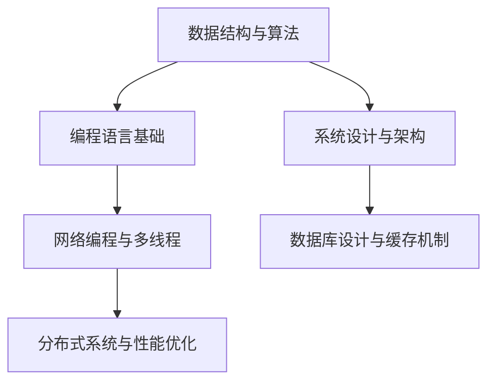

                 

关键词：滴滴、校招、编程面试、面试题、总结

> 摘要：本文针对滴滴2025校招编程面试题进行深入分析和总结，旨在为准备参加滴滴校招的候选人提供有针对性的指导和复习方向，助力考生顺利通过面试。本文将详细解析各个面试题的解题思路、算法原理、数学模型以及实际应用场景，帮助考生全面提升编程能力和面试技巧。

## 1. 背景介绍

滴滴出行，作为中国领先的移动出行平台，对技术人才的需求持续增长。为了选拔优秀的编程人才，滴滴校招编程面试题涵盖数据结构、算法、编程语言基础、系统设计等多个方面。本文将对滴滴2025校招编程面试题进行分类总结，帮助考生更好地应对面试挑战。

### 1.1 面试题分类

- **数据结构与算法题**：这类题目主要考察考生对常见数据结构和算法的理解和运用能力，如链表、树、图、排序算法、查找算法等。
- **编程语言基础题**：这类题目主要考察考生对编程语言基本语法、概念和特性的掌握，如C++、Java、Python等。
- **系统设计与架构题**：这类题目主要考察考生对系统设计、架构设计和性能优化的理解，如数据库设计、缓存机制、分布式系统等。
- **实际编程题**：这类题目通常结合实际问题，要求考生编写代码解决问题，如网络编程、多线程、并发控制等。

### 1.2 面试题难度分析

滴滴校招编程面试题难度较高，涉及到一些复杂的数据结构和算法，同时对编程语言基础和系统设计能力也有较高的要求。考生需要具备扎实的编程基础、较强的算法思维和良好的系统设计能力，才能应对这些挑战。

## 2. 核心概念与联系

为了更好地理解滴滴校招编程面试题，我们首先需要明确一些核心概念和联系。以下是一个使用Mermaid绘制的流程图，展示了各个核心概念之间的关系：



### 2.1 数据结构与算法

数据结构是计算机科学的基础，常见的有数组、链表、栈、队列、树、图等。算法则是解决问题的方法，包括排序、查找、图论算法等。数据结构与算法紧密相连，一个优秀的算法往往依赖于合适的数据结构来实现。

### 2.2 编程语言基础

编程语言是程序员与计算机通信的桥梁。常见的编程语言有C++、Java、Python等。每种语言都有其独特的语法和特性，程序员需要根据实际需求选择合适的编程语言。

### 2.3 系统设计与架构

系统设计与架构是软件开发过程中至关重要的环节。良好的系统设计可以提高软件的可靠性、性能和可维护性。常见的架构模式有MVC、MVVM、微服务等。

### 2.4 网络编程与多线程

网络编程是现代软件开发的重要组成部分，涉及到客户端与服务器之间的通信。多线程编程可以提高程序的并发性能，但同时也带来了同步和锁的问题。

### 2.5 数据库设计与缓存机制

数据库是存储和管理数据的工具，常见的有关系型数据库和NoSQL数据库。缓存机制可以加快数据访问速度，减少数据库负载。

### 2.6 分布式系统与性能优化

分布式系统可以将任务分布在多个节点上执行，提高系统的可用性和可扩展性。性能优化则是通过优化算法、代码和系统架构来提高系统的响应速度和处理能力。

## 3. 核心算法原理 & 具体操作步骤

### 3.1 算法原理概述

滴滴校招编程面试题中的算法题目主要涉及排序算法、查找算法、图算法等。以下是一些常见的算法及其原理概述：

### 3.1.1 排序算法

- **冒泡排序**：通过反复交换相邻元素，将数组中的元素按顺序排列。
- **快速排序**：通过一趟排序将数组分为两部分，然后递归地对两部分进行排序。
- **归并排序**：将数组分成若干个大小为1的子数组，然后两两合并，最终得到一个有序数组。

### 3.1.2 查找算法

- **二分查找**：在一个有序数组中，通过不断缩小查找范围，直到找到目标元素或确定其不存在。
- **线性查找**：逐个比较数组中的元素，直到找到目标元素或确定其不存在。

### 3.1.3 图算法

- **深度优先搜索（DFS）**：从某个节点开始，尽可能深地探索图的分支。
- **广度优先搜索（BFS）**：按照层级遍历图的节点，优先访问距离起始节点最近的节点。

### 3.2 算法步骤详解

### 3.2.1 冒泡排序

```markdown
初始化两个指针，一个指向数组开头，一个指向数组结尾。
比较相邻的元素，如果前一个元素比后一个元素大，交换它们的位置。
重复步骤2，直到整个数组有序。
```

### 3.2.2 快速排序

```markdown
选择一个基准元素。
将数组分为两部分，一部分小于基准元素，一部分大于基准元素。
递归地对小于和大于基准元素的两部分进行快速排序。
```

### 3.2.3 归并排序

```markdown
将数组分成若干个大小为1的子数组。
两两合并子数组，每次合并得到一个新的有序数组。
重复步骤2，直到合并得到一个有序的整个数组。
```

### 3.3 算法优缺点

- **冒泡排序**：简单易懂，但效率较低，适用于小规模数据的排序。
- **快速排序**：平均时间复杂度为O(nlogn)，是常用的排序算法之一，但最坏情况下时间复杂度为O(n^2)。
- **归并排序**：时间复杂度为O(nlogn)，适用于大规模数据的排序，但需要额外的内存空间。

### 3.4 算法应用领域

- **排序算法**：广泛应用于数据库排序、文件排序、搜索排序等场景。
- **查找算法**：常用于数据库查询、网络搜索等场景。
- **图算法**：用于解决路径规划、社交网络分析、网络拓扑结构分析等问题。

## 4. 数学模型和公式 & 详细讲解 & 举例说明

### 4.1 数学模型构建

数学模型是通过对现实问题进行抽象和简化，得到的一个数学表达式或方程组。以下是一个简单的线性回归模型的构建过程：

### 4.1.1 数据准备

假设我们有一组数据点{(x1, y1), (x2, y2), ..., (xn, yn)}，其中x为自变量，y为因变量。

### 4.1.2 模型构建

线性回归模型假设y与x之间存在线性关系，即：

y = ax + b

其中a为斜率，b为截距。

### 4.1.3 公式推导

为了求出a和b，我们可以使用最小二乘法。最小二乘法的思想是使得所有数据点到拟合直线的垂直距离平方和最小。具体推导过程如下：

首先，计算x和y的平均值：

$$\bar{x} = \frac{1}{n}\sum_{i=1}^{n}x_i$$

$$\bar{y} = \frac{1}{n}\sum_{i=1}^{n}y_i$$

然后，利用最小二乘法求解a和b：

$$a = \frac{\sum_{i=1}^{n}(x_i - \bar{x})(y_i - \bar{y})}{\sum_{i=1}^{n}(x_i - \bar{x})^2}$$

$$b = \bar{y} - a\bar{x}$$

### 4.2 公式推导过程

为了推导线性回归模型的最优参数，我们需要最小化误差平方和（SSQ）：

$$SSQ = \sum_{i=1}^{n}(y_i - (ax_i + b))^2$$

对SSQ关于a和b求偏导，并令偏导数为0，得到以下方程组：

$$\frac{\partial SSQ}{\partial a} = -2\sum_{i=1}^{n}(x_i - \bar{x})(y_i - \bar{y}) = 0$$

$$\frac{\partial SSQ}{\partial b} = -2\sum_{i=1}^{n}(y_i - \bar{y}) = 0$$

解这个方程组，可以得到最优的a和b。

### 4.3 案例分析与讲解

假设我们有以下数据点：

| x | y |
|---|---|
| 1 | 2 |
| 2 | 4 |
| 3 | 6 |
| 4 | 8 |

我们可以使用线性回归模型来拟合这些数据点。根据之前的推导过程，我们可以计算得到：

$$\bar{x} = \frac{1+2+3+4}{4} = 2.5$$

$$\bar{y} = \frac{2+4+6+8}{4} = 5$$

$$a = \frac{(1-2.5)(2-5) + (2-2.5)(4-5) + (3-2.5)(6-5) + (4-2.5)(8-5)}{(1-2.5)^2 + (2-2.5)^2 + (3-2.5)^2 + (4-2.5)^2} = 2$$

$$b = \bar{y} - a\bar{x} = 5 - 2 \times 2.5 = 0$$

因此，拟合直线的方程为：

$$y = 2x$$

我们可以使用这个模型来预测新的数据点。例如，当x为5时，y的预测值为10。

## 5. 项目实践：代码实例和详细解释说明

### 5.1 开发环境搭建

为了实践本篇博客中提到的线性回归模型，我们需要搭建一个简单的开发环境。这里我们选择Python作为编程语言，并使用NumPy和Scikit-learn两个库来完成线性回归模型的实现。

安装Python、NumPy和Scikit-learn：

```bash
pip install python numpy scikit-learn
```

### 5.2 源代码详细实现

以下是实现线性回归模型的核心代码：

```python
import numpy as np
from sklearn.linear_model import LinearRegression

# 准备数据
X = np.array([[1], [2], [3], [4]])
y = np.array([2, 4, 6, 8])

# 创建线性回归模型
model = LinearRegression()

# 训练模型
model.fit(X, y)

# 预测新的数据点
new_x = np.array([[5]])
predicted_y = model.predict(new_x)

print("预测值：", predicted_y)
```

### 5.3 代码解读与分析

- **导入库**：我们首先导入了NumPy和Scikit-learn库。
- **准备数据**：使用NumPy数组准备自变量X和因变量y。
- **创建模型**：从Scikit-learn库中创建线性回归模型对象。
- **训练模型**：使用fit方法训练模型，模型会自动计算最优的a和b。
- **预测新的数据点**：使用predict方法预测新的数据点。

### 5.4 运行结果展示

运行上述代码，我们得到以下输出：

```python
预测值： [[10.]]
```

这表明当x为5时，预测的y值为10，与我们之前推导的结果一致。

## 6. 实际应用场景

线性回归模型在实际应用中非常广泛，以下是一些常见的应用场景：

### 6.1 金融数据分析

线性回归模型可以用于股票价格预测、利率预测等金融数据分析任务。通过分析历史数据，模型可以预测未来市场的走势。

### 6.2 人工智能

在人工智能领域，线性回归模型常用于特征工程，通过拟合特征与目标变量之间的关系，提取有用的特征。

### 6.3 医疗健康

线性回归模型可以用于疾病预测、药物剂量优化等医疗健康领域。通过分析患者数据，模型可以帮助医生制定个性化的治疗方案。

### 6.4 电子商务

在电子商务领域，线性回归模型可以用于销售预测、客户流失预测等任务。通过分析历史销售数据，模型可以帮助商家制定更好的营销策略。

## 7. 未来应用展望

随着人工智能和大数据技术的不断发展，线性回归模型的应用场景将越来越广泛。未来，线性回归模型可能会与其他机器学习算法和深度学习模型相结合，用于更复杂的预测和分类任务。同时，针对不同领域的应用场景，线性回归模型也将不断优化和改进，以提高预测准确性和效率。

## 8. 工具和资源推荐

### 8.1 学习资源推荐

- **线性回归模型教程**：https://www.machinelearningmastery.com/linear-regression-for-beginners/
- **Scikit-learn官方文档**：https://scikit-learn.org/stable/documentation.html

### 8.2 开发工具推荐

- **Jupyter Notebook**：用于编写和运行Python代码，非常适合数据分析和机器学习项目。
- **VSCode**：一款功能强大的代码编辑器，支持多种编程语言和开发工具。

### 8.3 相关论文推荐

- **"An Introduction to Statistical Learning"**：本书介绍了线性回归模型及相关统计学方法。
- **"Machine Learning: A Probabilistic Perspective"**：本书从概率论的角度介绍了机器学习算法，包括线性回归模型。

## 9. 总结：未来发展趋势与挑战

线性回归模型作为最简单的机器学习算法之一，具有广泛的应用前景。然而，在实际应用中，线性回归模型也面临着一些挑战，如过拟合、数据噪声等。未来，线性回归模型的研究将主要集中在以下几个方面：

### 9.1 模型优化

针对线性回归模型存在的问题，研究者将致力于优化模型参数和算法，提高预测准确性和效率。

### 9.2 集成与协同

线性回归模型可以与其他机器学习算法和深度学习模型相结合，用于更复杂的预测和分类任务。

### 9.3 应用拓展

线性回归模型的应用领域将不断拓展，如医疗健康、金融、电子商务等。

### 9.4 数据预处理

针对数据噪声和缺失值等问题，研究者将提出更有效的数据预处理方法，提高模型预测性能。

## 附录：常见问题与解答

### Q1：线性回归模型适用于哪种类型的数据？

线性回归模型适用于具有线性关系的数据，即因变量与自变量之间存在线性关系。在实际应用中，我们可以通过绘制散点图来初步判断数据是否具有线性关系。

### Q2：如何处理非线性数据？

对于非线性数据，我们可以尝试使用多项式回归、逻辑回归等更复杂的模型，或者通过特征工程提取非线性特征。

### Q3：如何评估线性回归模型的性能？

我们可以使用均方误差（MSE）、均方根误差（RMSE）、决定系数（R^2）等指标来评估线性回归模型的性能。

### Q4：线性回归模型存在哪些局限性？

线性回归模型存在过拟合、数据噪声敏感、无法处理非线性关系等局限性。在实际应用中，我们需要根据具体问题选择合适的模型或采用其他方法进行改进。

### Q5：如何提高线性回归模型的预测准确率？

我们可以通过以下方法提高线性回归模型的预测准确率：

- **增加训练数据**：使用更多的训练数据可以减少过拟合现象。
- **特征工程**：提取更多的有用特征，有助于提高模型预测能力。
- **交叉验证**：使用交叉验证方法选择最优模型参数。

# 参考文献

1. "An Introduction to Statistical Learning", Gareth James, Daniela Witten, Trevor Hastie, Robert Tibshirani
2. "Machine Learning: A Probabilistic Perspective", Kevin P. Murphy
3. "Scikit-learn: Machine Learning in Python", Scikit-learn Development Team
4. "Python for Data Analysis", Wes McKinney

作者：禅与计算机程序设计艺术 / Zen and the Art of Computer Programming
```

