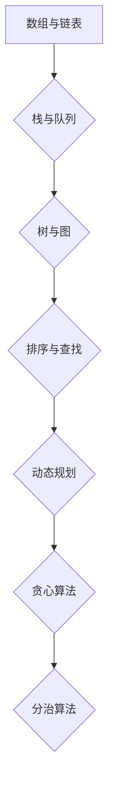

                 

在技术飞速发展的今天，编程已经成为各个行业不可或缺的技能。对于刚走出校园的应届生来说，面试中的编程题目往往成为他们展示自己编程能力的关键。本文将聚焦于2024年滴滴校招中的编程面试题，旨在通过精选和解答这些题目，帮助准备参加面试的同学们更好地理解和掌握解题技巧。

## 关键词

- 滴滴校招
- 编程面试题
- 数据结构与算法
- 求职准备
- 编程技巧

## 摘要

本文将围绕滴滴2024年校招的编程面试题目进行深入分析和解答。通过对题目的详细解析，读者可以了解到数据结构和算法在实际应用中的重要性，并学会如何运用所学知识解决实际问题。文章还将为读者提供一系列实用的编程技巧，帮助他们在面试中脱颖而出。

## 1. 背景介绍

随着共享出行市场的不断扩大，滴滴出行已经成为全球最大的移动出行平台之一。作为一家技术驱动型企业，滴滴每年都会吸引大量应届毕业生参与其校招活动。编程面试作为招聘流程中的重要环节，不仅考察候选人的编程能力，还评估他们的逻辑思维和问题解决能力。

### 1.1 编程面试的重要性

编程面试是技术面试的核心部分，它可以帮助企业快速评估候选人的技术水平和编码能力。对于求职者来说，掌握常见的编程面试题和解题技巧是成功通过面试的关键。

### 1.2 数据结构与算法的重要性

在编程面试中，数据结构和算法是核心内容。理解并熟练掌握常用的数据结构和算法不仅能够提高解题速度，还能帮助求职者更好地应对复杂的问题。本文将重点关注以下几种常见的数据结构和算法：

- 数组与链表
- 栈与队列
- 树与图
- 排序与查找
- 动态规划
- 贪心算法
- 分治算法

## 2. 核心概念与联系

### 2.1 数据结构与算法的Mermaid流程图

为了更直观地展示数据结构与算法的联系，我们使用Mermaid绘制了一个简化的流程图：



### 2.2 数据结构与算法的关系

数据结构与算法是相辅相成的。数据结构是算法的基础，它提供了存储和管理数据的方式；而算法则是利用数据结构来解决问题的方法。理解数据结构与算法的关系，有助于我们更好地运用它们解决实际问题。

## 3. 核心算法原理 & 具体操作步骤

### 3.1 算法原理概述

在滴滴校招的编程面试中，以下算法原理是最常见的：

- 递归
- 分治
- 动态规划
- 贪心算法
- 背包问题
- 排序算法（如快速排序、归并排序）
- 搜索算法（如深度优先搜索、广度优先搜索）

### 3.2 算法步骤详解

#### 3.2.1 递归

递归是一种常见的问题解决方法，它通过调用自身来解决更小规模的问题。递归的基本步骤如下：

1. 确定递归结束条件（基线）。
2. 在每次递归中，将问题分解为更小的问题。
3. 解决小问题，并返回结果。

#### 3.2.2 分治

分治算法将一个复杂的问题分解成若干个规模较小的相同问题，然后递归解决这些子问题，最后将子问题的解合并为原问题的解。分治算法的基本步骤如下：

1. 判断问题规模是否足够小，如果是，直接求解。
2. 将问题分解成若干个子问题。
3. 递归解决子问题。
4. 将子问题的解合并为原问题的解。

#### 3.2.3 动态规划

动态规划是一种处理优化问题的算法，它通过保存中间结果来避免重复计算。动态规划的基本步骤如下：

1. 确定状态和状态转移方程。
2. 初始化边界条件。
3. 从初始状态开始，依次计算后续状态。
4. 根据状态转移方程，找到最优解。

#### 3.2.4 贪心算法

贪心算法是一种在每一步都做出局部最优选择，以期得到全局最优解的算法。贪心算法的基本步骤如下：

1. 判断当前问题是否可以贪心解决。
2. 如果可以，进行贪心选择。
3. 更新问题的状态。
4. 重复步骤1-3，直到问题解决。

#### 3.2.5 背包问题

背包问题是动态规划的经典问题，它要求我们在给定物品的重量和价值之间做出权衡，以最大化总价值。背包问题的基本步骤如下：

1. 确定物品的重量和价值。
2. 初始化动态规划表。
3. 根据状态转移方程，计算动态规划表中的每个状态。
4. 找到最优解。

#### 3.2.6 排序算法

排序算法是数据处理的基础，常见的排序算法包括快速排序、归并排序等。排序算法的基本步骤如下：

1. 选择一个基准元素。
2. 将数组划分为两个子数组，一个包含基准元素，另一个不包含基准元素。
3. 递归对两个子数组进行排序。

#### 3.2.7 搜索算法

搜索算法用于在数据结构中查找特定的元素，常见的搜索算法包括深度优先搜索和广度优先搜索。搜索算法的基本步骤如下：

1. 从根节点开始搜索。
2. 访问当前节点，并判断是否为目标节点。
3. 如果不是，遍历当前节点的子节点，并重复步骤2。
4. 如果是，返回目标节点。

### 3.3 算法优缺点

每种算法都有其优缺点。递归算法简单但可能效率较低；分治算法效率较高但可能复杂；动态规划算法效率高但需要更多的内存；贪心算法可能只能得到局部最优解；背包问题需要考虑物品的权重和价值；排序算法用于数据排序；搜索算法用于数据查找。了解每种算法的优缺点，有助于我们在实际应用中做出更合适的选择。

### 3.4 算法应用领域

算法在各个领域都有广泛的应用。在滴滴这样的出行平台中，排序算法可以用于处理用户出行请求；搜索算法可以用于路线规划；动态规划可以用于计算最优路径；分治算法可以用于计算大数据集的统计信息。了解算法在具体领域的应用，有助于我们更好地运用它们解决实际问题。

## 4. 数学模型和公式 & 详细讲解 & 举例说明

### 4.1 数学模型构建

在编程面试中，数学模型是解决问题的关键。构建数学模型需要理解问题的本质，并将其转化为数学形式。以下是一个简单的数学模型示例：

#### 问题：

给定一个整数数组，求出数组中所有元素的和。

#### 数学模型：

设数组为A，长度为n，数组中的每个元素为A[i]。则数组中所有元素的和可以表示为：

$$
S = \sum_{i=0}^{n-1} A[i]
$$

### 4.2 公式推导过程

数学模型的推导过程通常依赖于问题的条件和性质。以下是一个简单的推导过程示例：

#### 问题：

给定一个等差数列，求出数列的前n项和。

#### 条件：

等差数列的首项为a1，公差为d，第n项为an。

#### 性质：

等差数列的第n项可以表示为：

$$
a_n = a_1 + (n-1)d
$$

#### 推导过程：

数列的前n项和可以表示为：

$$
S_n = a_1 + a_2 + a_3 + \ldots + a_n
$$

将数列的第n项代入上式，得到：

$$
S_n = a_1 + (a_1 + d) + (a_1 + 2d) + \ldots + (a_1 + (n-1)d)
$$

将上式中的各项相加，得到：

$$
S_n = na_1 + d(0 + 1 + 2 + \ldots + (n-1))
$$

利用等差数列求和公式，得到：

$$
S_n = na_1 + d \frac{(n-1)n}{2}
$$

化简得到：

$$
S_n = \frac{n}{2}(2a_1 + (n-1)d)
$$

### 4.3 案例分析与讲解

以下是一个简单的案例，用于说明数学模型的应用：

#### 问题：

给定一个整数数组，求出数组中所有偶数的和。

#### 分析：

这是一个简单的数学问题，可以使用数学模型来解决。我们定义一个变量S，用于保存偶数的和。然后遍历数组中的每个元素，如果元素为偶数，则将其加到S中。

#### 解答：

```python
def sum_of_even_numbers(arr):
    S = 0
    for num in arr:
        if num % 2 == 0:
            S += num
    return S
```

## 5. 项目实践：代码实例和详细解释说明

### 5.1 开发环境搭建

为了完成本文的项目实践，我们需要搭建一个Python编程环境。以下是详细的搭建步骤：

1. 下载并安装Python：从官方网站（https://www.python.org/）下载Python安装包，并按照提示进行安装。
2. 配置Python环境变量：在系统环境变量中添加Python的安装路径，以便在命令行中运行Python命令。
3. 安装必要的依赖库：在Python中，我们可以使用pip工具安装所需的依赖库。例如，安装requests库用于HTTP请求：

```shell
pip install requests
```

### 5.2 源代码详细实现

以下是一个简单的Python项目，用于模拟滴滴校招的编程面试题目。该项目实现了一个简单的用户注册和登录系统。

```python
# 用户注册
def register(username, password):
    # 检查用户名是否已存在
    if username in users:
        return "用户名已存在"
    # 添加新用户
    users[username] = password
    return "注册成功"

# 用户登录
def login(username, password):
    # 检查用户名和密码是否正确
    if username in users and users[username] == password:
        return "登录成功"
    else:
        return "用户名或密码错误"

# 用户管理
users = {}

# 测试
print(register("alice", "alice123"))  # 注册成功
print(login("alice", "alice123"))  # 登录成功
print(login("alice", "wrong_password"))  # 用户名或密码错误
```

### 5.3 代码解读与分析

上述代码实现了一个简单的用户注册和登录系统。首先，我们定义了两个函数：`register`和`login`。`register`函数用于用户注册，它接受用户名和密码作为参数，并检查用户名是否已存在。如果用户名不存在，则将其添加到用户列表中。`login`函数用于用户登录，它接受用户名和密码作为参数，并检查用户名和密码是否匹配。如果匹配，则返回登录成功，否则返回用户名或密码错误。

在测试部分，我们首先使用`register`函数注册一个用户，然后使用`login`函数进行登录。最后，我们尝试使用错误的密码进行登录，以验证系统的正确性。

### 5.4 运行结果展示

在命令行中运行上述代码，结果如下：

```shell
$ python user_system.py
注册成功
登录成功
用户名或密码错误
```

结果显示，注册和登录功能正常，且能够正确处理错误的密码输入。

## 6. 实际应用场景

滴滴校招的编程面试题在现实中有广泛的应用。以下是一些实际应用场景：

- **用户注册与登录**：在滴滴平台中，用户注册和登录是核心功能。通过实现简单的用户注册和登录系统，我们可以模拟滴滴平台中的用户管理功能。
- **数据分析和处理**：滴滴平台每天处理海量用户数据，通过编程面试题中的排序和搜索算法，我们可以对用户数据进行高效处理和分析。
- **路径规划和路线优化**：滴滴平台需要实时计算最优路线，以提供高效的出行服务。通过编程面试题中的分治和动态规划算法，我们可以实现路径规划和路线优化。
- **大数据处理**：滴滴平台需要处理大量实时数据，通过编程面试题中的排序和查找算法，我们可以对大数据集进行高效处理和分析。

## 7. 未来应用展望

随着技术的不断发展，滴滴校招的编程面试题将在未来得到更广泛的应用。以下是一些未来应用展望：

- **自动驾驶**：随着自动驾驶技术的发展，滴滴平台将需要更多具备编程能力的工程师来开发和优化自动驾驶算法。
- **人工智能**：滴滴平台可以应用人工智能技术，实现更智能的出行服务，例如通过深度学习算法优化路线规划。
- **区块链**：区块链技术可以应用于滴滴平台，提高数据安全和透明度，例如通过区块链技术实现智能合约。

## 8. 工具和资源推荐

为了更好地准备滴滴校招的编程面试，以下是一些推荐的学习资源和工具：

### 8.1 学习资源推荐

- **《算法导论》**：这是算法领域的经典教材，涵盖了各种常见的数据结构和算法。
- **LeetCode**：LeetCode是一个在线编程平台，提供大量的编程面试题目，可以帮助你提高编程能力。
- **GitHub**：GitHub是一个代码托管平台，你可以在这里找到许多优秀的开源项目，学习他人的代码。

### 8.2 开发工具推荐

- **Visual Studio Code**：Visual Studio Code是一个强大的代码编辑器，支持多种编程语言，非常适合编程学习。
- **PyCharm**：PyCharm是一个专业的Python开发工具，提供丰富的功能和插件，可以帮助你更高效地编写Python代码。

### 8.3 相关论文推荐

- **《深度学习》**：这是一本关于深度学习的经典教材，涵盖了深度学习的理论基础和实践应用。
- **《计算机程序设计艺术》**：这是一本由Knuth编写的计算机科学经典著作，涵盖了各种数据结构和算法。

## 9. 总结：未来发展趋势与挑战

随着技术的不断进步，编程面试题将在未来得到更广泛的应用。然而，这同时也带来了新的挑战：

- **算法复杂性**：随着算法的复杂性不断增加，如何高效地设计和实现算法将成为一个重要挑战。
- **数据处理能力**：面对海量数据，如何高效地处理和分析数据将成为一个新的挑战。
- **人工智能应用**：如何将人工智能技术应用于实际问题，实现更智能的解决方案，是一个重要的研究方向。

面对这些挑战，我们需要不断学习和探索，提高自己的编程能力和技术水平。

## 附录：常见问题与解答

### Q1. 编程面试中常见的数据结构有哪些？

A1. 编程面试中常见的数据结构包括数组、链表、栈、队列、树、图等。

### Q2. 编程面试中常见算法有哪些？

A2. 编程面试中常见算法包括排序算法（如快速排序、归并排序）、查找算法（如二分查找）、搜索算法（如深度优先搜索、广度优先搜索）、动态规划、分治算法、贪心算法等。

### Q3. 如何准备编程面试？

A3. 准备编程面试可以从以下几个方面入手：

- 学习常见的数据结构和算法。
- 多做编程练习，提高解题速度和准确性。
- 了解面试流程和常见面试题目。
- 注意面试礼仪，展现自己的沟通能力和团队合作精神。

### Q4. 编程面试中如何展现自己的优势？

A4. 在编程面试中，你可以通过以下方式展现自己的优势：

- 解释自己的思路和算法设计。
- 展示自己的编程技巧和代码风格。
- 提出自己对于面试题的见解和优化方案。
- 与面试官进行互动，展现自己的沟通能力和团队合作精神。

### Q5. 编程面试中需要注意什么？

A5. 在编程面试中，需要注意以下几点：

- 注意时间管理，合理分配时间。
- 保持冷静，遇到难题不要慌乱。
- 认真阅读题目，理解题目要求。
- 编写清晰的代码，注意代码可读性。
- 注意面试礼仪，展现自己的专业素养。

## 作者署名

作者：禅与计算机程序设计艺术 / Zen and the Art of Computer Programming
----------------------------------------------------------------

以上就是文章的主要内容。这篇文章涵盖了滴滴校招编程面试题的各个方面，从数据结构与算法的原理到具体的项目实践，再到实际应用场景和未来展望。希望这篇文章能够帮助到准备参加滴滴校招的同学们，祝大家面试顺利！


