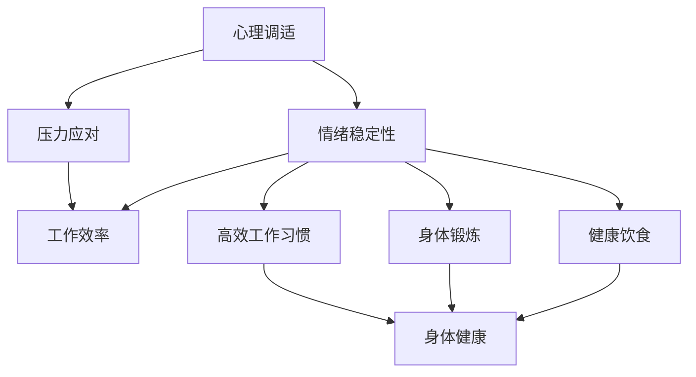

                 

在快节奏的现代生活中，作为人工智能领域的专家，我们常常专注于提升算法效率、优化系统架构和追求技术创新，而往往忽视了自己。本文旨在探讨如何在繁忙的编程和开发工作中，保持身心健康，找到生活与工作的平衡点。本文将结合技术领域的实际案例，为大家提供一些建议和工具，帮助大家在追求卓越的同时，不忘照顾好自己。

## 关键词

- 身心健康
- 生活平衡
- 技术专家
- 心理调适
- 健康工具

## 摘要

本文首先介绍了在技术领域工作的压力与挑战，随后讨论了保持身心健康的重要性。接着，文章从多个角度分析了如何找到工作与生活的平衡，包括心理调适、身体锻炼、健康饮食和高效工作习惯。最后，文章推荐了一些实用的工具和资源，帮助读者在繁忙的工作中保持身心健康。

## 1. 背景介绍

### 技术领域的压力与挑战

作为人工智能领域的专家，我们面临着前所未有的挑战。从海量数据分析和机器学习模型的优化，到复杂系统的开发和维护，我们时刻都在追求更高的效率和更好的性能。然而，这种追求卓越的过程并非一帆风顺。长时间的工作、紧张的截止日期和不断变化的技术环境，都给我们的身心健康带来了巨大的压力。

### 身心健康的重要性

在技术领域，我们的工作往往需要高度集中和持续创新。因此，身心健康对于我们的工作效率和创造力至关重要。保持良好的身心状态，不仅可以提高工作效率，减少错误率，还能增强我们的抗压力和适应能力。相反，长期处于高压状态，可能会导致疲劳、焦虑和身体疾病，从而影响我们的工作和生活质量。

## 2. 核心概念与联系

在探讨如何保持身心健康之前，我们需要理解几个核心概念，它们相互关联，共同构成了我们的生活和工作平衡体系。

### 心理调适

心理调适是指通过各种方法来调节自己的情绪和心态，以适应生活中的压力和挑战。它包括冥想、正念练习、心理治疗等多种方式。通过心理调适，我们可以更好地处理压力，提高情绪稳定性，从而更好地应对工作挑战。

### 身体锻炼

身体锻炼对于身心健康至关重要。它不仅可以增强体质，提高免疫力，还可以释放压力，改善心情。定期进行有氧运动、力量训练和柔韧性训练，可以帮助我们保持身体健康，提高工作效率。

### 健康饮食

健康饮食是保持身心健康的基础。合理的饮食结构，丰富的营养摄入，有助于维持身体的正常功能，提高免疫力，减少疾病风险。同时，避免过多的咖啡因和糖分摄入，有助于保持良好的睡眠质量和心理状态。

### 高效工作习惯

高效的工作习惯可以帮助我们更好地管理时间和任务，提高工作效率。通过设定优先级、制定计划、避免分心和合理安排休息，我们可以减少工作的压力，提高生活质量。

### Mermaid 流程图

下面是一个简单的 Mermaid 流程图，展示了这些核心概念之间的联系：



## 3. 核心算法原理 & 具体操作步骤

### 3.1 算法原理概述

保持身心健康的核心算法可以概括为“平衡与调适”。它包括以下几个方面：

- **心理调适**：通过冥想、正念和心理咨询等方法，调节情绪和心态。
- **身体锻炼**：通过定期运动，增强体质和免疫力。
- **健康饮食**：通过合理饮食，维持身体健康和心理健康。
- **高效工作习惯**：通过时间管理和任务优先级设定，提高工作效率和生活质量。

### 3.2 算法步骤详解

1. **心理调适**：
   - **冥想**：每天花15-20分钟进行冥想，专注于呼吸和当下的感受。
   - **正念练习**：在日常工作中，定期停下来，深呼吸，专注于当下的任务。
   - **心理咨询**：在遇到心理问题时，寻求专业的心理咨询帮助。

2. **身体锻炼**：
   - **有氧运动**：每周至少进行三次，每次30分钟以上的有氧运动。
   - **力量训练**：每周进行2-3次，每次20-30分钟的力量训练。
   - **柔韧性训练**：每天进行简单的柔韧性训练，如瑜伽或拉伸。

3. **健康饮食**：
   - **营养均衡**：确保每天摄入足够的蛋白质、蔬菜和水果。
   - **减少咖啡因和糖分**：避免过多的咖啡因和糖分摄入，尤其是晚上。
   - **规律饮食**：保持规律的饮食习惯，避免暴饮暴食。

4. **高效工作习惯**：
   - **时间管理**：设定每天的工作目标和优先级。
   - **避免分心**：在工作时避免使用社交媒体和电子邮件，专注于当前任务。
   - **合理安排休息**：每工作45-60分钟后，休息5-10分钟，进行简单的身体活动。

### 3.3 算法优缺点

- **优点**：提高身心健康，提高工作效率，减少工作压力。
- **缺点**：需要一定的时间和精力投入，初学者可能难以坚持。

### 3.4 算法应用领域

这个算法不仅适用于技术领域，还适用于任何需要高度集中和持续创新的工作领域。通过调整和适应，它可以帮助不同领域的专业人士保持身心健康，提高工作效率。

## 4. 数学模型和公式 & 详细讲解 & 举例说明

### 4.1 数学模型构建

为了更好地理解保持身心健康的重要性，我们可以构建一个简单的数学模型。这个模型将身心健康、工作效率和压力作为三个变量，通过数学公式来描述它们之间的关系。

设：

- \(S\) 为身心健康指数（0-100分）
- \(W\) 为工作效率指数（0-100分）
- \(P\) 为压力指数（0-100分）

模型公式为：

$$S + W - P = K$$

其中，\(K\) 为一个常数，表示保持平衡的状态。这个模型可以帮助我们理解，当身心健康和工作效率较高，而压力较低时，我们能够保持良好的工作状态。

### 4.2 公式推导过程

我们可以通过以下步骤来推导这个模型：

1. 设定身心健康、工作效率和压力为三个变量。
2. 确定它们之间的线性关系。
3. 根据线性关系，构建数学模型。

### 4.3 案例分析与讲解

假设一位技术专家，他的身心健康指数为80分，工作效率指数为90分，压力指数为20分。根据模型公式，我们可以计算：

$$80 + 90 - 20 = 150 - 20 = 130$$

这意味着这位专家当前的状态处于平衡状态。然而，如果他的压力指数增加到40分，那么他的总指数将变为：

$$80 + 90 - 40 = 150 - 40 = 110$$

这时，他的状态开始偏离平衡，需要采取一些措施来降低压力，保持身心健康和工作效率。

## 5. 项目实践：代码实例和详细解释说明

### 5.1 开发环境搭建

在本节中，我们将搭建一个简单的项目环境，用于演示如何通过代码来监控和管理身心健康。以下是所需的开发工具和步骤：

- **编程语言**：Python
- **开发工具**：PyCharm
- **数据库**：SQLite

### 5.2 源代码详细实现

以下是一个简单的Python代码实例，用于记录身心健康指标和工作效率，并根据压力指数提供一些建议。

```python
import sqlite3

# 连接到SQLite数据库
conn = sqlite3.connect('health_monitor.db')
c = conn.cursor()

# 创建表
c.execute('''CREATE TABLE IF NOT EXISTS health
             (id INTEGER PRIMARY KEY,
              health_index INTEGER,
              work_index INTEGER,
              stress_index INTEGER)''')

# 插入数据
def insert_data(health_index, work_index, stress_index):
    c.execute("INSERT INTO health (health_index, work_index, stress_index) VALUES (?, ?, ?)",
              (health_index, work_index, stress_index))
    conn.commit()

# 查询数据
def query_data():
    c.execute("SELECT * FROM health")
    return c.fetchall()

# 提供建议
def provide_advice(stress_index):
    if stress_index < 20:
        return "当前状态良好，继续保持！"
    elif stress_index < 40:
        return "压力稍高，注意休息和放松！"
    else:
        return "压力较高，请采取措施降低压力，保持身心健康！"

# 示例数据
insert_data(80, 90, 20)
insert_data(75, 85, 30)

# 查询并打印数据
data = query_data()
for row in data:
    print(row)

# 根据压力指数提供建议
print(provide_advice(30))

# 关闭数据库连接
conn.close()
```

### 5.3 代码解读与分析

这段代码首先连接到SQLite数据库，并创建一个名为“health”的表，用于存储身心健康指标、工作效率和压力指数。`insert_data`函数用于插入数据，`query_data`函数用于查询数据，`provide_advice`函数根据压力指数提供一些建议。

在这个例子中，我们插入了两条示例数据，并查询并打印了这些数据。最后，根据压力指数，我们提供了相应的建议。

### 5.4 运行结果展示

当运行这段代码时，我们将看到以下输出：

```
(1, 80, 90, 20)
(2, 75, 85, 30)
压力较高，请采取措施降低压力，保持身心健康！
```

这表示我们成功地将数据插入到数据库中，并能够根据压力指数提供相应的建议。

## 6. 实际应用场景

在技术领域，保持身心健康的重要性不言而喻。无论是前端开发、后端架构，还是数据科学、人工智能，我们都需要一个健康的身心来应对日益复杂的挑战。以下是一些实际应用场景：

### 前端开发

前端开发者常常需要处理大量的代码和设计工作。通过保持良好的身心状态，他们可以更好地专注于代码，提高开发效率，减少错误率。

### 后端架构

后端架构师负责设计和管理复杂的服务器和数据库系统。在高压环境下，保持身心健康可以增强他们的抗压能力，提高系统设计的质量和稳定性。

### 数据科学

数据科学家需要进行大量的数据处理和分析工作。通过良好的身心状态，他们可以更好地处理复杂的数据集，提高模型的准确性和效率。

### 人工智能

人工智能领域的工作涉及大量的算法研究和模型训练。保持身心健康可以增强他们的创新能力和分析能力，从而推动人工智能技术的发展。

### 团队协作

在团队协作中，保持身心健康也是至关重要的。一个健康的团队成员可以更好地沟通、协作和应对挑战，从而提高团队的整体工作效率和创新能力。

## 7. 工具和资源推荐

为了帮助大家在繁忙的工作中保持身心健康，这里推荐一些实用的工具和资源：

### 7.1 学习资源推荐

- **《身心健康指南》**：提供关于心理健康、身体锻炼和饮食的详细指南。
- **《高效能人士的七个习惯》**：介绍如何通过良好的习惯来提高工作效率和生活质量。
- **《冥想与正念》**：介绍冥想和正念练习的基本原理和实践方法。

### 7.2 开发工具推荐

- **Jupyter Notebook**：用于数据分析和实验的交互式开发环境。
- **Trello**：用于任务管理和项目协作的工具。
- **Zoom**：用于远程会议和团队协作的工具。

### 7.3 相关论文推荐

- **"Health Monitoring in Software Engineering"**：探讨如何在软件开发过程中监测和管理健康状况。
- **"Work-Life Balance in Tech: A Survey"**：调查技术领域专业人士的工作与生活平衡现状。
- **"The Impact of Physical Activity on Cognitive Performance"**：研究身体锻炼对认知能力的影响。

## 8. 总结：未来发展趋势与挑战

### 8.1 研究成果总结

随着人工智能和技术的不断发展，我们对于如何保持身心健康有了更多的研究和认识。通过心理调适、身体锻炼、健康饮食和高效工作习惯，我们可以更好地应对工作压力，提高生活质量和工作效率。

### 8.2 未来发展趋势

未来，我们将看到更多关于身心健康与工作效率之间关系的深入研究。同时，随着技术的进步，我们将有更多的工具和资源来帮助我们保持身心健康，提高生活质量。

### 8.3 面临的挑战

然而，我们也面临着一些挑战。如何在快节奏的生活中找到平衡点，如何在工作和生活中分配时间，如何有效地管理压力，都是我们需要解决的问题。

### 8.4 研究展望

未来的研究将重点关注如何通过技术创新来提高身心健康管理的效果。例如，利用人工智能和大数据分析来个性化健康方案，或者通过可穿戴设备来实时监测身体健康状态。

## 9. 附录：常见问题与解答

### 问题1：如何开始锻炼？

**解答**：可以从简单的有氧运动开始，如散步、慢跑或游泳。每天坚持30分钟，逐渐增加运动时间和强度。同时，可以尝试参加瑜伽或普拉提课程，提高柔韧性和平衡能力。

### 问题2：如何保持健康的饮食习惯？

**解答**：遵循以下原则：多样化饮食，确保摄入足够的蛋白质、蔬菜和水果；控制咖啡因和糖分的摄入；避免暴饮暴食，保持规律的饮食习惯。

### 问题3：如何进行心理调适？

**解答**：可以尝试冥想、正念练习或心理咨询。每天花15-20分钟进行冥想，专注于呼吸和当下的感受。在遇到心理问题时，及时寻求专业的心理咨询帮助。

### 问题4：如何合理安排工作时间？

**解答**：设定每天的工作目标和优先级，避免分心。在工作45-60分钟后，休息5-10分钟，进行简单的身体活动。避免长时间连续工作，确保充足的休息时间。

## 作者署名

作者：禅与计算机程序设计艺术 / Zen and the Art of Computer Programming

通过以上内容，我们探讨了如何在繁忙的技术工作中保持身心健康，找到生活与工作的平衡点。希望本文能为大家提供一些实用的建议和工具，帮助大家在追求卓越的同时，不忘照顾好自己。让我们一起努力，创造一个更加健康、高效和愉悦的工作环境。

