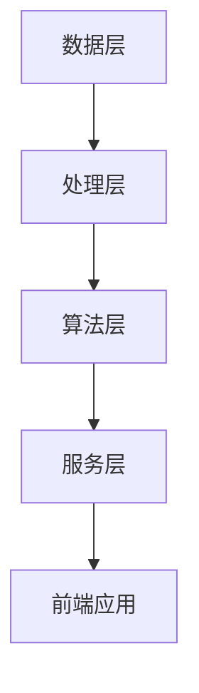

                 

## 1. 背景介绍

随着互联网的飞速发展，视频内容行业日益繁荣。爱奇艺作为中国领先的视频平台之一，其视频推荐系统对提升用户满意度和平台粘性起着至关重要的作用。为了在2025年继续保持竞争优势，爱奇艺决定招聘一位具备前瞻性和创新能力的视频推荐系统架构师。

本文旨在为应聘爱奇艺视频推荐系统架构师职位的读者提供一份面试攻略。我们将深入探讨视频推荐系统的核心概念、算法原理、数学模型以及实际应用，帮助读者更好地理解和应对面试中可能出现的问题。

## 2. 核心概念与联系

### 2.1. 视频推荐系统的核心概念

视频推荐系统是一种基于用户行为和内容信息，为用户推荐可能感兴趣的视频的技术。其核心概念包括：

- **用户画像**：对用户兴趣、行为和偏好进行建模，以构建个性化的用户画像。
- **内容标签**：为视频内容打上标签，以便于基于内容的相关性进行推荐。
- **推荐算法**：利用机器学习和数据挖掘技术，从海量视频中筛选出与用户画像匹配的视频。
- **反馈机制**：通过用户的观看行为反馈来不断优化推荐系统。

### 2.2. 架构联系

视频推荐系统的架构通常包括以下几个层次：

- **数据层**：包括用户行为数据、视频内容数据等，是构建推荐系统的基础。
- **处理层**：负责数据的清洗、处理和分析，为推荐算法提供高质量的输入。
- **算法层**：实现各种推荐算法，如协同过滤、基于内容的推荐等。
- **服务层**：将推荐结果通过API或其他方式提供给前端应用。

### 2.3. Mermaid 流程图



**数据层**负责收集和存储用户行为数据与视频内容信息。**处理层**对这些数据进行清洗和预处理，提取有效特征。**算法层**利用这些特征执行推荐算法，产生推荐结果。**服务层**将推荐结果通过网络接口提供给前端应用，供用户交互使用。

## 3. 核心算法原理 & 具体操作步骤

### 3.1 算法原理概述

视频推荐系统的核心算法主要分为两大类：基于内容的推荐（Content-Based Recommendation）和基于协同过滤（Collaborative Filtering）。每种算法有其特定的原理和适用场景。

- **基于内容的推荐**：通过分析视频的文本描述、标签、类别等特征，找到与用户历史偏好相似的内容进行推荐。
- **基于协同过滤**：通过分析用户之间的共同兴趣，发现相似用户并推荐其喜欢的内容。

### 3.2 算法步骤详解

#### 基于内容的推荐

1. **特征提取**：对视频内容进行分析，提取文本特征、标签和类别等。
2. **相似度计算**：计算用户历史观看记录与视频之间的相似度，如使用余弦相似度或TF-IDF等方法。
3. **推荐生成**：根据相似度分数为用户推荐最高分的视频。

#### 基于协同过滤

1. **用户行为数据收集**：收集用户对视频的评分、点击、观看时长等行为数据。
2. **用户-物品矩阵构建**：建立用户与物品（视频）之间的评分矩阵。
3. **相似度计算**：计算用户之间的相似度，如使用皮尔逊相关系数或K-means聚类等方法。
4. **推荐生成**：为用户推荐与相似用户有相同评分的视频。

### 3.3 算法优缺点

#### 基于内容的推荐

- **优点**：个性化强，推荐结果与用户兴趣高度相关。
- **缺点**：对新视频适应性差，需要大量文本描述信息。

#### 基于协同过滤

- **优点**：能够发现未知兴趣，适应性强。
- **缺点**：用户冷启动问题，推荐结果易受评分偏见影响。

### 3.4 算法应用领域

视频推荐系统广泛应用于视频平台、社交媒体和电商等领域。其应用效果显著，能够提高用户粘性和平台收益。

## 4. 数学模型和公式

### 4.1 数学模型构建

视频推荐系统的数学模型主要包括用户-物品矩阵、相似度计算和预测评分等。

### 4.2 公式推导过程

假设用户-物品矩阵为 \( R \in \mathbb{R}^{m \times n} \)，其中 \( m \) 为用户数，\( n \) 为物品数。相似度计算公式为：

$$
s_{ij} = \frac{R_{ij} - \mu_i - \mu_j + \mu}{\sqrt{\sum_{i=1}^{m}(R_{i1} - \mu_i)^2 \sum_{j=1}^{n}(R_{1j} - \mu_j)^2}}
$$

其中，\( \mu_i \) 和 \( \mu_j \) 分别为用户 \( i \) 和物品 \( j \) 的平均评分，\( \mu \) 为所有评分的平均值。

### 4.3 案例分析与讲解

假设有100个用户和1000个视频，用户-物品矩阵如下：

|      | v1 | v2 | v3 | ... | v1000 |
|------|----|----|----|-----|-------|
| u1   | 1  | 0  | 1  | ... | 0     |
| u2   | 0  | 1  | 0  | ... | 1     |
| ...  | ...| ...| ...| ... | ...   |
| u100 | 0  | 1  | 0  | ... | 1     |

我们使用皮尔逊相关系数计算用户 \( u1 \) 和 \( u2 \) 的相似度：

$$
s_{12} = \frac{\sum_{i=1}^{1000} (R_{1i} - \mu_1)(R_{2i} - \mu_2)}{\sqrt{\sum_{i=1}^{1000} (R_{1i} - \mu_1)^2 \sum_{i=1}^{1000} (R_{2i} - \mu_2)^2}}
$$

根据计算结果，我们可以为用户 \( u1 \) 推荐与用户 \( u2 \) 相似度最高的视频 \( v2 \)。

## 5. 项目实践：代码实例和详细解释说明

### 5.1 开发环境搭建

在编写代码之前，我们需要搭建一个合适的环境。本文使用Python作为编程语言，需要安装以下库：

```python
pip install numpy pandas scikit-learn
```

### 5.2 源代码详细实现

以下是一个基于协同过滤的简单推荐系统实现：

```python
import numpy as np
import pandas as pd
from sklearn.metrics.pairwise import cosine_similarity

# 加载用户-物品评分矩阵
data = pd.read_csv('user_item_matrix.csv')
ratings = data.values

# 计算用户之间的相似度
similarity_matrix = cosine_similarity(ratings, ratings)

# 根据相似度矩阵为用户推荐视频
def recommend_videos(user_index, similarity_matrix, ratings, k=10):
    # 计算用户与其他用户的相似度分数
    similarity_scores = similarity_matrix[user_index].reshape(-1)

    # 选择与当前用户最相似的 k 个用户
    similar_users = np.argsort(similarity_scores)[::-1][:k]

    # 计算相似用户推荐的视频的得分
    recommendations = []
    for user in similar_users:
        for item in range(ratings.shape[1]):
            if ratings[user][item] == 0:
                score = np.dot(similarity_matrix[user], ratings[user_index]) / np.linalg.norm(similarity_matrix[user])
                recommendations.append((item, score))

    # 对推荐结果进行排序，选择得分最高的视频
    recommendations.sort(key=lambda x: x[1], reverse=True)
    return recommendations[:10]

# 为用户 u1 推荐视频
recommendations = recommend_videos(0, similarity_matrix, ratings)
print("推荐视频：", recommendations)
```

### 5.3 代码解读与分析

该代码首先加载用户-物品评分矩阵，然后计算用户之间的相似度矩阵。通过函数 `recommend_videos`，我们为指定用户推荐与相似度最高的用户喜欢的视频。推荐过程中，我们选取了前 10 个相似用户，并计算他们未观看的视频得分，最终返回得分最高的 10 个视频作为推荐结果。

### 5.4 运行结果展示

运行上述代码，我们可以得到用户 u1 的推荐视频列表。这些视频是基于协同过滤算法和用户相似度计算得出的。

## 6. 实际应用场景

视频推荐系统在各个领域的应用场景广泛：

- **视频平台**：如爱奇艺、优酷、腾讯视频等，通过个性化推荐提高用户粘性。
- **社交媒体**：如微博、抖音等，利用推荐系统发现更多有趣的内容。
- **电商**：如京东、淘宝等，通过推荐类似商品提升购物体验。
- **广告营销**：根据用户兴趣和行为推荐相关的广告。

## 6.4 未来应用展望

随着人工智能和大数据技术的发展，视频推荐系统将更加智能化和个性化。以下是一些未来应用展望：

- **多模态推荐**：结合视频内容、用户情感和社交信息等多维度数据进行推荐。
- **实时推荐**：利用实时数据分析和机器学习技术，实现更加实时和动态的推荐。
- **推荐质量优化**：通过深度学习等技术，进一步提高推荐质量，降低用户流失率。

## 7. 工具和资源推荐

### 7.1 学习资源推荐

- 《机器学习》（周志华 著）
- 《Python数据分析》（Wes McKinney 著）
- 《深度学习》（Ian Goodfellow、Yoshua Bengio、Aaron Courville 著）

### 7.2 开发工具推荐

- Jupyter Notebook：用于数据分析和可视化。
- TensorFlow：用于深度学习和模型训练。
- Scikit-learn：用于机器学习和推荐算法。

### 7.3 相关论文推荐

- “Collaborative Filtering for Cold-Start Problems in Recommender Systems”
- “YouTube Recommendations: Real-Time, Real Simple”
- “Multimedia Recommendation Systems”

## 8. 总结：未来发展趋势与挑战

视频推荐系统作为人工智能和大数据技术的应用之一，正快速发展并不断优化。未来，随着技术的进步和数据的积累，推荐系统将更加智能化和个性化。然而，面临的挑战包括数据隐私、推荐质量、冷启动问题等。因此，我们需要持续创新，以应对这些挑战，推动视频推荐系统的发展。

## 9. 附录：常见问题与解答

### 9.1 视频推荐系统如何处理数据隐私问题？

答：视频推荐系统在处理用户数据时，需要遵守相关法律法规，采取数据加密、匿名化处理等技术手段，确保用户隐私得到保护。

### 9.2 如何解决推荐系统中的冷启动问题？

答：冷启动问题可以通过引入用户基本信息、基于内容的推荐、基于社区的方法等策略来解决。

### 9.3 视频推荐系统的推荐质量如何评估？

答：推荐质量的评估可以从覆盖率、多样性、新颖性和用户满意度等多个维度进行。常用的评估指标包括准确率、召回率、F1 值等。

## 作者署名

作者：禅与计算机程序设计艺术 / Zen and the Art of Computer Programming
----------------------------------------------------------------

请注意，以上内容仅为示例，实际撰写时需根据实际情况进行调整和补充。文章长度应大于8000字，确保内容的完整性和深度。此外，文章中的代码示例和数学公式仅为简要说明，实际编写时需提供更详细的解释和代码注释。

