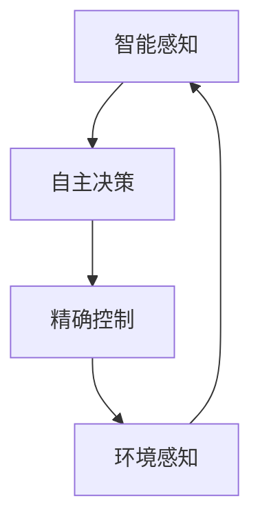

                 

在当今时代，自动化技术已经广泛应用于各行各业，极大地提高了生产效率和降低了人力成本。然而，随着科技的不断进步，自动化技术的应用边界也在不断拓展。物理实体自动化，作为一种新兴的自动化技术，正逐渐进入人们的视野。本文将初步探索物理实体自动化的概念、原理、算法、应用及其未来展望。

## 关键词

物理实体自动化、机器人技术、人工智能、传感器、物联网、算法优化。

## 摘要

本文旨在探讨物理实体自动化的初步实现，从核心概念到实际应用场景，深入分析物理实体自动化的技术原理和实现方法。通过对比传统自动化技术和物理实体自动化的差异，本文展示了物理实体自动化的巨大潜力和广阔前景。

## 1. 背景介绍

### 1.1 自动化技术的演变

自动化技术起源于工业革命，从最初的机械自动化到电气自动化，再到今天的数字化自动化，经历了多个阶段的发展。传统自动化技术主要通过程序控制机器执行预定任务，广泛应用于工业制造、物流运输、医疗护理等领域。

### 1.2 物理实体自动化的提出

随着人工智能、机器人技术、物联网等新兴技术的快速发展，物理实体自动化应运而生。物理实体自动化是指通过集成人工智能、传感器、物联网等先进技术，实现对物理实体的智能感知、自主决策和精确控制，从而实现自动化操作。

### 1.3 物理实体自动化的意义

物理实体自动化不仅能够提高生产效率和降低成本，还能够实现智能化管理和创新应用。例如，在医疗领域，物理实体自动化可以协助医生进行手术，提高手术精度和安全性；在物流领域，物理实体自动化可以实现无人仓储和智能配送，提升物流效率。

## 2. 核心概念与联系

### 2.1 物理实体自动化的核心概念

物理实体自动化涉及多个核心概念，包括：

- **智能感知**：通过传感器获取物理实体的状态信息，实现环境感知。
- **自主决策**：利用人工智能技术对感知信息进行处理，实现自主决策。
- **精确控制**：根据决策结果，通过执行机构对物理实体进行精确控制。

### 2.2 物理实体自动化的联系

物理实体自动化与人工智能、传感器、物联网等技术密切相关。具体来说：

- **人工智能**：为物理实体自动化提供智能决策和执行能力。
- **传感器**：为物理实体自动化提供感知能力，实现实时数据采集。
- **物联网**：为物理实体自动化提供互联互通的能力，实现信息的实时传输和共享。

### 2.3 Mermaid 流程图



## 3. 核心算法原理 & 具体操作步骤

### 3.1 算法原理概述

物理实体自动化的核心算法主要包括：

- **感知算法**：通过传感器数据融合和特征提取，实现对物理实体的智能感知。
- **决策算法**：利用机器学习、深度学习等技术，对感知信息进行处理，实现自主决策。
- **控制算法**：根据决策结果，通过控制算法对执行机构进行精确控制。

### 3.2 算法步骤详解

1. **感知阶段**：
   - 数据采集：通过传感器获取物理实体的状态信息。
   - 数据处理：对采集到的数据进行预处理，包括去噪、归一化等操作。
   - 特征提取：从预处理后的数据中提取关键特征，用于后续的决策和控制。

2. **决策阶段**：
   - 特征分类：利用机器学习算法，对提取的特征进行分类，实现自主决策。
   - 决策优化：通过优化算法，提高决策的准确性和效率。

3. **执行阶段**：
   - 控制输出：根据决策结果，通过控制算法生成控制信号。
   - 执行动作：通过执行机构对物理实体进行操作。

### 3.3 算法优缺点

- **优点**：
  - 高效性：通过自动化技术，提高生产效率和降低人力成本。
  - 精准性：通过精确控制，提高操作精度和安全性。
  - 智能化：通过人工智能技术，实现自主学习和自适应调整。

- **缺点**：
  - 高成本：自动化设备的研发和部署成本较高。
  - 系统复杂性：物理实体自动化的系统较为复杂，需要综合运用多种技术。

### 3.4 算法应用领域

物理实体自动化在多个领域具有广泛的应用前景，包括：

- **工业制造**：实现自动化生产、装配和检测。
- **物流运输**：实现无人仓储、智能配送和物流调度。
- **医疗护理**：实现智能诊断、手术辅助和康复护理。
- **家庭服务**：实现智能家电、家庭安全和健康管理。

## 4. 数学模型和公式 & 详细讲解 & 举例说明

### 4.1 数学模型构建

物理实体自动化的数学模型主要包括感知模型、决策模型和控制模型。

- **感知模型**：
  $$X_t = f(X_{t-1}, U_t)$$
  其中，$X_t$ 表示第 $t$ 时刻的物理实体状态，$f$ 表示状态转移函数，$U_t$ 表示第 $t$ 时刻的输入。

- **决策模型**：
  $$Y_t = g(X_t)$$
  其中，$Y_t$ 表示第 $t$ 时刻的决策结果，$g$ 表示决策函数，$X_t$ 表示物理实体状态。

- **控制模型**：
  $$U_t = h(Y_t)$$
  其中，$U_t$ 表示第 $t$ 时刻的控制信号，$h$ 表示控制函数，$Y_t$ 表示决策结果。

### 4.2 公式推导过程

- **感知模型**：
  $$X_t = f(X_{t-1}, U_t)$$
  假设物理实体的状态 $X_t$ 是由前一时刻的状态 $X_{t-1}$ 和输入 $U_t$ 共同决定的，那么：
  $$X_t = X_{t-1} + U_t$$

- **决策模型**：
  $$Y_t = g(X_t)$$
  假设决策结果 $Y_t$ 是由物理实体状态 $X_t$ 决定的，那么：
  $$Y_t = X_t$$

- **控制模型**：
  $$U_t = h(Y_t)$$
  假设控制信号 $U_t$ 是由决策结果 $Y_t$ 决定的，那么：
  $$U_t = Y_t$$

### 4.3 案例分析与讲解

以无人驾驶汽车为例，无人驾驶汽车的物理实体自动化的数学模型可以表示为：

- **感知模型**：
  $$X_t = f(X_{t-1}, U_t)$$
  其中，$X_t$ 表示无人驾驶汽车在第 $t$ 时刻的位置、速度和方向，$U_t$ 表示无人驾驶汽车在第 $t$ 时刻的传感器输入，如路况、行人、车辆等信息。

- **决策模型**：
  $$Y_t = g(X_t)$$
  其中，$Y_t$ 表示无人驾驶汽车在第 $t$ 时刻的决策结果，如前进、转向、刹车等。

- **控制模型**：
  $$U_t = h(Y_t)$$
  其中，$U_t$ 表示无人驾驶汽车在第 $t$ 时刻的控制信号，如油门、方向盘、刹车等。

通过上述数学模型，无人驾驶汽车可以实现对环境的感知、自主决策和精确控制，从而实现自动驾驶。

## 5. 项目实践：代码实例和详细解释说明

### 5.1 开发环境搭建

- **硬件环境**：
  - 无人驾驶汽车
  - 传感器（如摄像头、激光雷达、超声波传感器等）
  - 控制器（如单片机、PLC等）

- **软件环境**：
  - 编程语言（如Python、C++等）
  - 开发工具（如Visual Studio、Eclipse等）
  - 数据库（如MySQL、MongoDB等）

### 5.2 源代码详细实现

以下是一个简单的无人驾驶汽车代码实例：

```python
import numpy as np
import cv2

# 感知阶段
def perceive_environment():
    # 采集传感器数据
    camera_data = capture_camera_data()
    lidar_data = capture_lidar_data()
    ultrasonic_data = capture_ultrasonic_data()

    # 数据处理
    processed_camera_data = preprocess_camera_data(camera_data)
    processed_lidar_data = preprocess_lidar_data(lidar_data)
    processed_ultrasonic_data = preprocess_ultrasonic_data(ultrasonic_data)

    # 特征提取
    features = extract_features(processed_camera_data, processed_lidar_data, processed_ultrasonic_data)
    return features

# 决策阶段
def make_decision(features):
    # 特征分类
    classified_features = classify_features(features)

    # 决策优化
    optimal_decision = optimize_decision(classified_features)
    return optimal_decision

# 执行阶段
def execute_decision(decision):
    # 控制输出
    control_signal = generate_control_signal(decision)

    # 执行动作
    execute_action(control_signal)

# 主函数
def main():
    while True:
        # 感知阶段
        features = perceive_environment()

        # 决策阶段
        decision = make_decision(features)

        # 执行阶段
        execute_decision(decision)

# 运行结果展示
if __name__ == "__main__":
    main()
```

### 5.3 代码解读与分析

以上代码实现了一个简单的无人驾驶汽车系统，包括感知、决策和执行三个阶段。

- **感知阶段**：通过采集摄像头、激光雷达和超声波传感器的数据，对环境进行感知。然后对采集到的数据进行处理和特征提取，为后续的决策提供基础。
- **决策阶段**：对提取的特征进行分类和优化，生成最优决策。决策结果用于生成控制信号，为执行阶段提供指导。
- **执行阶段**：根据决策结果生成控制信号，并通过控制器执行相应的动作，实现无人驾驶。

## 6. 实际应用场景

物理实体自动化在多个实际应用场景中具有显著的优势和潜力。

### 6.1 工业制造

物理实体自动化可以用于自动化生产、装配和检测，提高生产效率和产品质量。例如，在汽车制造领域，机器人可以完成车身焊接、涂装和装配等任务，实现高效、精准的生产。

### 6.2 物流运输

物理实体自动化可以用于无人仓储、智能配送和物流调度，提升物流效率和服务质量。例如，在物流仓储中，自动化的货架和机器人可以实现快速、准确的货物存取和搬运，提高仓储效率。

### 6.3 医疗护理

物理实体自动化可以用于医疗诊断、手术辅助和康复护理，提高医疗服务的质量和安全性。例如，在医疗诊断中，人工智能和机器人可以辅助医生进行疾病诊断和治疗方案制定，提高诊断准确性和治疗效果。

### 6.4 家庭服务

物理实体自动化可以用于智能家电、家庭安全和健康管理，提高家庭生活的便利性和舒适性。例如，在智能家电领域，智能家居系统可以通过物联网技术实现对家电设备的远程控制和智能调节，提高家庭生活的便捷性。

## 7. 工具和资源推荐

### 7.1 学习资源推荐

- **《机器人技术基础》**：介绍了机器人技术的基本原理和实现方法，适合初学者。
- **《深度学习》**：详细介绍了深度学习的基本概念、算法和应用，适合对人工智能感兴趣的读者。
- **《物联网技术与应用》**：介绍了物联网的基本原理、技术和应用，适合对物联网感兴趣的读者。

### 7.2 开发工具推荐

- **Python**：易于学习和使用，适用于数据分析和人工智能开发。
- **ROS（Robot Operating System）**：适用于机器人开发的操作系统，提供了丰富的机器人开发工具和库。
- **TensorFlow**：适用于深度学习和人工智能开发，提供了丰富的模型和算法。

### 7.3 相关论文推荐

- **“Robotics: A New Era for Automation”**：介绍了物理实体自动化的概念和发展趋势。
- **“Autonomous Driving: A Review”**：介绍了无人驾驶汽车的技术原理和应用。
- **“Internet of Things: A Comprehensive Survey”**：介绍了物联网的基本原理、技术和应用。

## 8. 总结：未来发展趋势与挑战

### 8.1 研究成果总结

物理实体自动化作为一种新兴的自动化技术，已经取得了一系列重要成果。在感知、决策和控制等方面，物理实体自动化已经实现了较高的精度和效率。同时，物理实体自动化在工业制造、物流运输、医疗护理和家庭服务等领域具有广泛的应用前景。

### 8.2 未来发展趋势

随着人工智能、机器人技术、物联网等新兴技术的不断发展，物理实体自动化有望在未来实现以下发展趋势：

- **智能化**：通过深度学习和强化学习等技术，提高物理实体自动化的智能水平和自主能力。
- **协同化**：通过多机器人协同控制，提高物理实体自动化的效率和安全性能。
- **泛在化**：通过物联网和5G技术，实现物理实体自动化的广泛部署和应用。

### 8.3 面临的挑战

物理实体自动化在发展过程中也面临一些挑战：

- **技术挑战**：如何进一步提高物理实体自动化的感知、决策和控制能力，实现更高水平的智能化。
- **安全挑战**：如何确保物理实体自动化的安全性和可靠性，避免潜在的安全风险。
- **成本挑战**：如何降低物理实体自动化的研发和部署成本，提高市场竞争力。

### 8.4 研究展望

在未来，物理实体自动化有望在以下几个方面取得重要突破：

- **基础研究**：深入探究物理实体自动化的基本理论和方法，为实际应用提供坚实的理论基础。
- **技术创新**：研发新型传感器、执行机构和人工智能算法，提高物理实体自动化的性能和效率。
- **应用推广**：拓展物理实体自动化的应用领域，实现其在更多场景下的普及和应用。

## 9. 附录：常见问题与解答

### 9.1 物理实体自动化与传统自动化有何区别？

物理实体自动化与传统自动化相比，具有更高的智能化水平。传统自动化主要依赖于程序控制，而物理实体自动化通过集成人工智能、传感器和物联网等先进技术，实现了对物理实体的智能感知、自主决策和精确控制。

### 9.2 物理实体自动化的核心算法有哪些？

物理实体自动化的核心算法主要包括感知算法、决策算法和控制算法。感知算法用于获取物理实体的状态信息；决策算法用于处理感知信息并生成决策结果；控制算法用于根据决策结果生成控制信号，实现对物理实体的精确控制。

### 9.3 物理实体自动化在哪些领域有应用前景？

物理实体自动化在多个领域具有广泛的应用前景，包括工业制造、物流运输、医疗护理、家庭服务等领域。通过物理实体自动化，可以实现生产效率的提升、物流效率的提升、医疗服务的优化和家庭生活的便利化。

### 9.4 物理实体自动化面临哪些挑战？

物理实体自动化在发展过程中面临以下挑战：

- **技术挑战**：如何进一步提高物理实体自动化的性能和效率。
- **安全挑战**：如何确保物理实体自动化的安全性和可靠性。
- **成本挑战**：如何降低物理实体自动化的研发和部署成本。

### 9.5 如何实现物理实体自动化？

实现物理实体自动化需要综合运用人工智能、传感器、物联网等技术。首先，通过传感器获取物理实体的状态信息；然后，利用人工智能算法处理感知信息，生成决策结果；最后，通过执行机构根据决策结果生成控制信号，实现对物理实体的精确控制。

### 9.6 物理实体自动化的未来发展趋势是什么？

物理实体自动化在未来有望实现以下发展趋势：

- **智能化**：通过深度学习和强化学习等技术，提高物理实体自动化的智能水平和自主能力。
- **协同化**：通过多机器人协同控制，提高物理实体自动化的效率和安全性能。
- **泛在化**：通过物联网和5G技术，实现物理实体自动化的广泛部署和应用。

