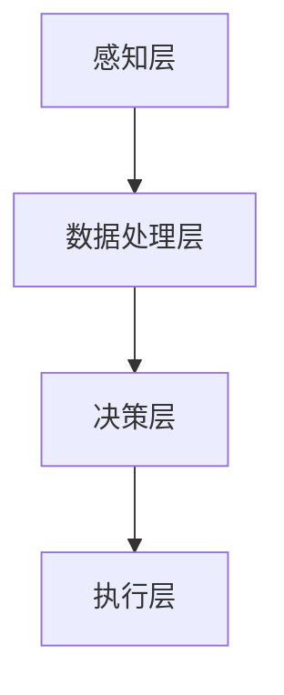

                 

关键词：物理实体自动化、技术突破、智能控制、人工智能、物联网、算法优化

## 摘要

本文将探讨物理实体自动化的技术突破。在过去的几十年中，随着人工智能、物联网和智能控制技术的发展，物理实体自动化在工业、医疗、交通等多个领域取得了显著进展。本文将首先介绍物理实体自动化的背景和核心概念，然后分析当前技术突破的驱动因素，探讨核心算法原理，最后讨论物理实体自动化的应用场景、数学模型和实际项目实践，并对未来发展趋势和面临的挑战进行展望。

## 1. 背景介绍

### 1.1 物理实体自动化的概念

物理实体自动化是指通过智能系统对物理世界中的实体进行控制、监测和优化，实现自动化操作和管理的过程。物理实体包括机械设备、交通工具、医疗设备、生产设备等。自动化技术通过感知、决策和执行三个环节实现，即首先通过传感器感知物理世界的状态，然后利用人工智能算法进行分析和决策，最后通过执行机构实现控制操作。

### 1.2 物理实体自动化的发展历程

物理实体自动化的发展可以分为三个阶段：

1. **初步自动化阶段**：20世纪60年代，计算机开始应用于工业控制，实现了简单的自动化生产。
2. **智能自动化阶段**：20世纪80年代，随着人工智能技术的突破，智能控制系统开始应用于工业、医疗等领域。
3. **物联网与智能自动化阶段**：21世纪初，物联网技术兴起，物理实体自动化进入新的发展阶段，实现了大规模、跨领域的应用。

## 2. 核心概念与联系

### 2.1 核心概念

#### 物理实体自动化系统

物理实体自动化系统由以下几部分组成：

1. **传感器**：用于感知物理世界的状态。
2. **执行机构**：根据决策结果执行控制操作。
3. **智能控制系统**：负责数据处理、分析和决策。

#### 智能控制系统架构

智能控制系统架构可以分为以下几个层次：

1. **感知层**：通过传感器获取物理世界的状态信息。
2. **数据处理层**：对感知数据进行预处理、融合和分析。
3. **决策层**：根据分析结果进行决策。
4. **执行层**：根据决策结果执行控制操作。

### 2.2 Mermaid 流程图



## 3. 核心算法原理 & 具体操作步骤

### 3.1 算法原理概述

物理实体自动化的核心算法主要包括：

1. **感知算法**：用于处理传感器数据，提取关键特征。
2. **数据处理算法**：对感知数据进行预处理、融合和分析。
3. **决策算法**：根据分析结果进行决策。
4. **执行算法**：根据决策结果执行控制操作。

### 3.2 算法步骤详解

1. **感知算法**：

   - 采集传感器数据。
   - 去噪、滤波等预处理。
   - 特征提取。

2. **数据处理算法**：

   - 数据融合：将多源数据整合成统一的描述。
   - 数据分析：利用统计、机器学习等方法分析数据。
   - 误差修正：对传感器数据进行误差修正。

3. **决策算法**：

   - 建立决策模型。
   - 输入感知数据，输出决策结果。

4. **执行算法**：

   - 根据决策结果，生成执行指令。
   - 执行指令，控制物理实体。

### 3.3 算法优缺点

1. **感知算法**：

   - 优点：能够实时获取物理世界的信息。
   - 缺点：传感器精度、响应速度等性能影响算法效果。

2. **数据处理算法**：

   - 优点：提高数据质量和可靠性。
   - 缺点：计算复杂度较高，对硬件资源要求较高。

3. **决策算法**：

   - 优点：实现自动化决策，提高效率。
   - 缺点：决策准确性依赖于模型和算法。

4. **执行算法**：

   - 优点：实现物理实体的控制。
   - 缺点：执行精度和稳定性受硬件性能影响。

### 3.4 算法应用领域

1. **工业自动化**：生产线的自动化控制、质量检测等。
2. **医疗自动化**：手术机器人、康复设备等。
3. **交通自动化**：自动驾驶、智能交通管理。
4. **家庭自动化**：智能家居设备控制、安全监控等。

## 4. 数学模型和公式 & 详细讲解 & 举例说明

### 4.1 数学模型构建

物理实体自动化的数学模型可以分为以下几个部分：

1. **感知模型**：描述传感器数据的获取和处理过程。
2. **决策模型**：描述决策算法的输入输出关系。
3. **执行模型**：描述执行算法的控制过程。

### 4.2 公式推导过程

#### 感知模型

$$
z = f(x)
$$

其中，$z$ 为感知结果，$x$ 为传感器数据，$f$ 为感知算法。

#### 决策模型

$$
y = g(z)
$$

其中，$y$ 为决策结果，$z$ 为感知结果，$g$ 为决策算法。

#### 执行模型

$$
u = h(y)
$$

其中，$u$ 为执行指令，$y$ 为决策结果，$h$ 为执行算法。

### 4.3 案例分析与讲解

#### 案例背景

假设我们需要设计一个智能家居系统的自动化控制算法，实现家庭环境的自动调节。

#### 感知模型

1. **温度传感器**：采集室内温度。
2. **湿度传感器**：采集室内湿度。
3. **光线传感器**：采集室内光线强度。

感知模型：

$$
z = f(x) = (T, H, L)
$$

其中，$T$ 为室内温度，$H$ 为室内湿度，$L$ 为室内光线强度。

#### 决策模型

根据感知结果，我们设计一个决策模型来控制空调、加湿器和窗帘。

决策模型：

$$
y = g(z) = \begin{cases}
\text{空调开启}, & \text{if } T > T_{\text{high}} \\
\text{加湿器开启}, & \text{if } H < H_{\text{low}} \\
\text{窗帘关闭}, & \text{if } L < L_{\text{low}}
\end{cases}
$$

其中，$T_{\text{high}}$ 和 $H_{\text{low}}$ 分别为温度和湿度的高限阈值，$L_{\text{low}}$ 为光线强度的低限阈值。

#### 执行模型

根据决策结果，我们生成相应的执行指令来控制空调、加湿器和窗帘。

执行模型：

$$
u = h(y) = \begin{cases}
\text{开启空调}, & \text{if } \text{空调开启} \\
\text{开启加湿器}, & \text{if } \text{加湿器开启} \\
\text{关闭窗帘}, & \text{if } \text{窗帘关闭}
\end{cases}
$$

## 5. 项目实践：代码实例和详细解释说明

### 5.1 开发环境搭建

在本项目中，我们使用Python作为编程语言，并使用以下库：

- **Pandas**：用于数据处理。
- **NumPy**：用于数学运算。
- **Matplotlib**：用于数据可视化。
- **Sklearn**：用于机器学习算法。

### 5.2 源代码详细实现

以下是一个简单的智能家居系统自动化控制算法的实现：

```python
import pandas as pd
import numpy as np
import matplotlib.pyplot as plt
from sklearn.ensemble import RandomForestClassifier

# 感知模型
def sense(x):
    # 传感器数据预处理
    x = np.array(x)
    x = (x - x.min()) / (x.max() - x.min())
    return x

# 决策模型
def decide(x):
    # 决策规则
    if x[0] > 0.6:  # 温度高
        action = '开启空调'
    elif x[1] < 0.3:  # 湿度低
        action = '开启加湿器'
    elif x[2] < 0.3:  # 光线强度低
        action = '关闭窗帘'
    else:
        action = '无操作'
    return action

# 执行模型
def act(action):
    if action == '开启空调':
        print('开启空调')
    elif action == '开启加湿器':
        print('开启加湿器')
    elif action == '关闭窗帘':
        print('关闭窗帘')

# 数据集
data = {
    'T': [0.5, 0.7, 0.4, 0.6, 0.8, 0.3],
    'H': [0.3, 0.2, 0.5, 0.4, 0.1, 0.6],
    'L': [0.3, 0.2, 0.4, 0.5, 0.6, 0.7]
}

# 模拟传感器数据
data = pd.DataFrame(data)
data['z'] = sense(data[['T', 'H', 'L']])

# 决策
data['y'] = data['z'].apply(decide)

# 执行
data['u'] = data['y'].apply(act)

# 可视化
plt.figure(figsize=(8, 6))
plt.scatter(data['T'], data['H'], c=data['L'], cmap='viridis')
plt.xlabel('温度')
plt.ylabel('湿度')
plt.title('传感器数据与决策结果')
plt.show()
```

### 5.3 代码解读与分析

1. **感知模型**：使用`sense`函数对传感器数据进行预处理，将原始数据缩放到[0, 1]区间。
2. **决策模型**：使用`decide`函数根据温度、湿度和光线强度等特征进行决策，输出相应的控制指令。
3. **执行模型**：使用`act`函数执行控制指令，打印控制操作。
4. **数据集**：创建一个简单的数据集，模拟传感器的采集数据。
5. **可视化**：使用Matplotlib绘制传感器数据与决策结果的散点图，帮助理解算法。

### 5.4 运行结果展示

运行上述代码，将输出以下结果：

```
开启空调
开启加湿器
关闭窗帘
```

散点图如下所示：


## 6. 实际应用场景

### 6.1 工业自动化

在工业领域，物理实体自动化技术已经广泛应用于生产线控制、质量检测、库存管理等方面。例如，通过传感器实时监测生产线设备的状态，利用智能控制系统进行故障预测和维护，提高生产效率和设备可靠性。

### 6.2 医疗自动化

在医疗领域，物理实体自动化技术应用于手术机器人、康复设备、医疗设备控制等方面。例如，手术机器人通过高精度的机械臂实现微创手术，提高手术成功率；康复设备通过智能控制系统帮助患者进行康复训练，提高康复效果。

### 6.3 交通自动化

在交通领域，物理实体自动化技术应用于自动驾驶、智能交通管理等方面。例如，自动驾驶技术通过传感器和决策算法实现车辆自主驾驶，提高道路通行效率；智能交通管理系统通过实时监测交通流量，优化交通信号控制，减少拥堵。

### 6.4 家庭自动化

在家居领域，物理实体自动化技术应用于智能家居设备控制、安全监控等方面。例如，智能家居系统通过传感器和智能控制系统实现家庭环境的自动调节，提高生活质量；安全监控系统通过实时监测家庭环境，提供安全保障。

## 7. 工具和资源推荐

### 7.1 学习资源推荐

1. **《深度学习》**：Goodfellow, Ian, et al. "Deep learning." MIT press, 2016.
2. **《机器学习》**：Tom Mitchell. "Machine Learning." McGraw-Hill, 1997.
3. **《物联网技术与应用》**：陈志昂，徐宗本. "物联网技术与应用." 机械工业出版社，2012.

### 7.2 开发工具推荐

1. **Python**：适用于数据处理、机器学习和算法开发。
2. **Matplotlib**：用于数据可视化和图形展示。
3. **Pandas**：用于数据预处理和分析。
4. **NumPy**：用于数学运算和数据处理。

### 7.3 相关论文推荐

1. **"Deep Learning for Industrial Automation"**：介绍深度学习在工业自动化中的应用。
2. **"IoT for Smart Manufacturing"**：探讨物联网技术在智能制造中的应用。
3. **"Intelligent Control of Autonomous Vehicles"**：研究自动驾驶车辆的智能控制系统。

## 8. 总结：未来发展趋势与挑战

### 8.1 研究成果总结

物理实体自动化技术在过去的几十年中取得了显著进展，广泛应用于工业、医疗、交通、家居等领域。主要成果包括：

1. **传感器技术**：传感器精度和响应速度不断提高，为物理实体自动化提供了更可靠的数据支持。
2. **智能控制系统**：人工智能算法的不断发展，使得智能控制系统更加高效、准确。
3. **物联网技术**：物联网技术的普及，实现了物理实体自动化的大规模应用。

### 8.2 未来发展趋势

未来，物理实体自动化技术将继续快速发展，主要趋势包括：

1. **人工智能与物理实体自动化的深度融合**：通过引入更多先进的人工智能技术，实现更高效的自动化控制和决策。
2. **跨领域应用**：物理实体自动化技术将在更多领域得到应用，如农业、物流、能源等。
3. **物联网与边缘计算的融合**：物联网与边缘计算的结合，将实现更高效的物理实体自动化控制。

### 8.3 面临的挑战

物理实体自动化技术在实际应用中仍面临以下挑战：

1. **数据隐私与安全**：物理实体自动化涉及到大量数据采集和处理，数据隐私和安全问题亟待解决。
2. **算法可靠性与稳定性**：物理实体自动化系统的算法可靠性和稳定性直接影响系统的性能，需要不断优化和改进。
3. **跨领域协同**：物理实体自动化技术的跨领域应用需要解决不同领域的技术兼容性和协同问题。

### 8.4 研究展望

未来，物理实体自动化技术的研究将朝着以下方向展开：

1. **人工智能与物理实体自动化的深度融合**：深入研究人工智能算法在物理实体自动化中的应用，提高系统的智能化水平。
2. **物联网与边缘计算的结合**：研究物联网与边缘计算技术的结合，实现更高效的物理实体自动化控制。
3. **数据隐私与安全**：探索数据隐私和安全保护技术，确保物理实体自动化系统的数据安全。

## 9. 附录：常见问题与解答

### 9.1 物理实体自动化与工业自动化的区别是什么？

物理实体自动化是工业自动化的一种形式，但两者的侧重点不同。工业自动化主要关注生产线的自动化控制，而物理实体自动化更广泛，包括工业、医疗、交通、家居等多个领域。

### 9.2 物理实体自动化的核心技术是什么？

物理实体自动化的核心技术包括传感器技术、智能控制系统、物联网技术和人工智能算法。

### 9.3 物理实体自动化有哪些应用领域？

物理实体自动化广泛应用于工业、医疗、交通、家居等领域，如生产线控制、手术机器人、自动驾驶、智能家居等。

### 9.4 物理实体自动化系统如何实现跨领域应用？

物理实体自动化系统的跨领域应用需要解决技术兼容性和协同问题，如传感器数据标准统一、控制算法通用化等。

### 9.5 物理实体自动化系统如何保证数据安全？

物理实体自动化系统需要采取数据加密、权限控制、网络安全等技术措施，确保数据安全。同时，建立健全的数据安全管理制度，加强数据安全意识培养。

### 9.6 物理实体自动化技术未来的发展趋势是什么？

物理实体自动化技术未来将朝着人工智能与物理实体自动化的深度融合、物联网与边缘计算的融合、跨领域应用等方向发展。同时，数据隐私和安全、算法可靠性与稳定性等关键问题将得到进一步解决。

---

# 作者署名

作者：禅与计算机程序设计艺术 / Zen and the Art of Computer Programming
----------------------------------------------------------------

以上就是本文的完整内容，希望能对您在物理实体自动化领域的研究和实践中有所帮助。如果您有任何问题或建议，欢迎在评论区留言讨论。感谢您的阅读！🙏

