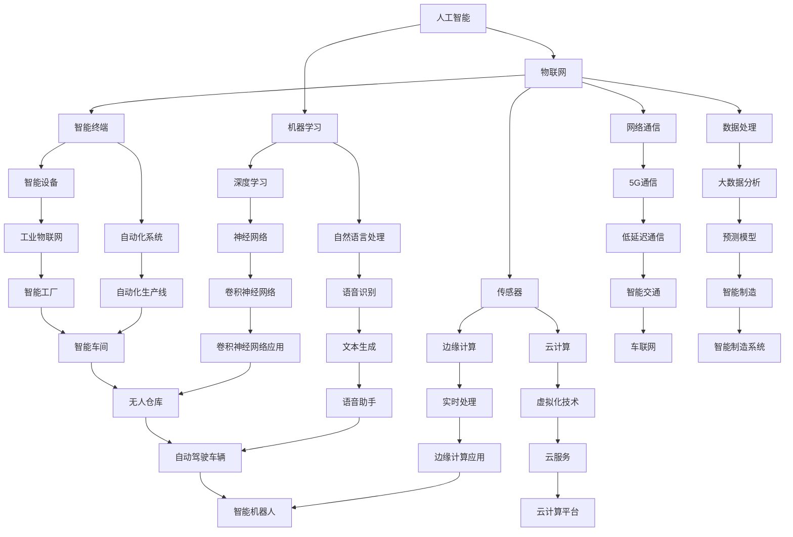

                 

关键词：物理实体自动化，机器人，人工智能，物联网，智能制造，自动化算法，数据处理，机器学习，预测模型，实时控制，系统集成，边缘计算，云计算，协作机器人，工业4.0。

> 摘要：本文深入探讨了物理实体自动化的最新趋势，包括其核心概念、关键技术、算法原理、数学模型、实际应用以及未来展望。文章旨在为读者提供一个全面的理解，帮助把握这一领域的发展脉络，为研究和应用提供参考。

## 1. 背景介绍

物理实体自动化（Physical Entity Automation，PEA）是指通过智能系统和自动化技术对物理世界中的实体进行控制、监测和优化。随着人工智能、物联网和智能制造等技术的迅猛发展，物理实体自动化已成为现代工业和日常生活的重要组成部分。近年来，物理实体自动化在各个领域展现出广泛的应用前景，推动了产业升级和社会变革。

首先，物理实体自动化在制造业中得到了广泛应用。通过自动化生产线和智能机器人，工厂能够实现高效、精准的生产，提高生产效率和产品质量。例如，汽车制造、电子装配和食品加工等行业已经开始采用自动化技术，实现生产线的无人化运作。

其次，在物流和运输领域，自动化仓储系统和无人驾驶技术正在逐步取代传统的人工操作。自动化仓储系统能够提高仓库空间利用率，降低人工成本，并提高物流配送的效率和准确性。无人驾驶技术则有望在货运、公共交通和个人出行等领域实现革命性的变革。

此外，物理实体自动化在医疗、农业和环境监测等领域也展现出了巨大的潜力。智能医疗设备和自动化农业系统可以提高医疗诊断和疾病治疗的准确性，提升农业生产的效率和质量。环境监测机器人能够实时采集环境数据，为环境保护提供科学依据。

总之，物理实体自动化已经成为现代科技发展的一个重要方向，其应用范围不断拓展，对各行各业产生了深远影响。本文将深入探讨物理实体自动化的核心概念、关键技术、算法原理、数学模型和实际应用，以期为相关领域的研究和应用提供参考。

## 2. 核心概念与联系

### 2.1 核心概念

物理实体自动化涉及多个核心概念，包括人工智能、物联网、机器学习、边缘计算、云计算和智能制造等。以下是对这些核心概念的简要介绍：

**人工智能（Artificial Intelligence，AI）**：人工智能是指通过计算机程序实现智能行为的技术。它包括机器学习、深度学习、自然语言处理、计算机视觉等多个子领域，旨在使计算机具备类似人类智能的能力。

**物联网（Internet of Things，IoT）**：物联网是指将各种物品通过互联网连接起来，实现智能感知、识别和管理。它包括传感器、网络通信、数据处理和智能终端等多个环节。

**机器学习（Machine Learning，ML）**：机器学习是一种通过数据训练模型，使计算机具备自动学习和预测能力的技术。它包括监督学习、无监督学习、强化学习等多种学习方法。

**边缘计算（Edge Computing）**：边缘计算是指将计算、存储和网络功能分布在网络边缘，以减少数据传输和延迟。它能够提高数据处理效率和实时响应能力。

**云计算（Cloud Computing）**：云计算是指通过网络提供计算资源、存储资源和软件服务。它包括基础设施即服务（IaaS）、平台即服务（PaaS）和软件即服务（SaaS）等多种服务模式。

**智能制造（Intelligent Manufacturing）**：智能制造是指通过集成物联网、大数据、人工智能等技术，实现生产过程的智能化和自动化。它包括智能工厂、智能设备、智能物流等多个环节。

### 2.2 联系与架构

物理实体自动化的核心概念之间紧密相连，形成一个完整的技术体系。以下是一个简单的 Mermaid 流程图，展示了这些核心概念之间的联系：



通过这个流程图，我们可以看到物理实体自动化涉及的技术领域广泛而深入，各个环节相互关联，共同推动着这一领域的快速发展。

### 2.3 物理实体自动化的核心概念原理

物理实体自动化的核心概念原理主要体现在以下几个方面：

**人工智能**：人工智能通过机器学习和深度学习等算法，使计算机能够从数据中学习和预测。例如，卷积神经网络（CNN）在图像识别领域表现出色，能够实现人脸识别、物体检测等功能。

**物联网**：物联网通过传感器和网络通信技术，实现物理世界的数字化和信息传递。传感器可以实时采集物理数据，通过网络传输到云端或边缘计算节点进行处理。

**机器学习**：机器学习通过算法训练模型，使计算机具备自动学习和预测能力。例如，预测模型可以用于预测生产设备的故障，提前进行维护，避免生产中断。

**边缘计算**：边缘计算将计算、存储和网络功能分布在网络边缘，提高数据处理效率和实时响应能力。例如，在自动驾驶领域，边缘计算可以实时处理车辆感知数据，做出快速决策，确保行车安全。

**云计算**：云计算提供强大的计算和存储资源，支持大规模数据处理和分析。例如，通过云计算平台，可以实现海量数据的存储、管理和分析，为物理实体自动化提供数据支持。

**智能制造**：智能制造通过物联网、大数据和人工智能等技术，实现生产过程的智能化和自动化。例如，智能工厂可以实现生产线的无人化运作，提高生产效率和产品质量。

这些核心概念相互结合，共同构成了物理实体自动化的技术体系，为各行各业提供了智能化解决方案。

## 3. 核心算法原理 & 具体操作步骤

### 3.1 算法原理概述

物理实体自动化的核心算法主要包括机器学习算法、物联网数据处理算法和实时控制算法。以下分别介绍这些算法的基本原理：

**机器学习算法**：机器学习算法通过数据训练模型，使计算机具备自动学习和预测能力。常用的机器学习算法包括决策树、支持向量机、神经网络等。在物理实体自动化中，机器学习算法主要用于预测模型、故障检测和分类等任务。

**物联网数据处理算法**：物联网数据处理算法包括数据采集、传输、存储和分析等环节。数据采集算法用于传感器数据的实时采集和预处理；传输算法用于数据的可靠传输；存储算法用于数据的持久化存储；分析算法用于数据的挖掘和分析，提取有价值的信息。

**实时控制算法**：实时控制算法用于对物理实体进行实时控制和调度。常见的实时控制算法包括PID控制、模糊控制、深度强化学习等。在物理实体自动化中，实时控制算法主要用于自动化生产线、无人驾驶和智能机器人等场景。

### 3.2 算法步骤详解

**3.2.1 机器学习算法步骤**

1. **数据收集**：从传感器、物联网设备或其他数据源收集训练数据。

2. **数据预处理**：对收集到的数据进行清洗、归一化和特征提取，确保数据质量。

3. **模型选择**：根据任务需求选择合适的机器学习算法，如决策树、支持向量机、神经网络等。

4. **模型训练**：使用预处理后的数据训练模型，调整模型参数以优化性能。

5. **模型评估**：通过验证集或测试集评估模型性能，调整模型参数以获得最佳效果。

6. **模型部署**：将训练好的模型部署到实际应用场景中，进行预测或分类任务。

**3.2.2 物联网数据处理算法步骤**

1. **数据采集**：通过传感器实时采集物理实体数据。

2. **数据预处理**：对采集到的数据进行滤波、去噪和归一化处理。

3. **数据传输**：通过物联网通信协议将预处理后的数据传输到云端或边缘计算节点。

4. **数据存储**：将传输到的数据存储在数据库或数据湖中，以便后续分析。

5. **数据分析**：使用数据分析算法对存储的数据进行挖掘和分析，提取有价值的信息。

**3.2.3 实时控制算法步骤**

1. **系统建模**：建立物理实体的数学模型，描述其动态行为。

2. **控制策略设计**：根据物理实体模型设计合适的控制策略，如PID控制、模糊控制、深度强化学习等。

3. **实时数据采集**：从传感器实时采集物理实体的状态数据。

4. **实时控制执行**：根据控制策略和实时数据，实时调整物理实体的状态，以实现预期目标。

5. **反馈调整**：根据物理实体的反馈信号，调整控制策略，提高控制效果。

### 3.3 算法优缺点

**机器学习算法**：

- **优点**：具有较强的自适应能力和泛化能力，能够处理大规模复杂数据，适用于各种预测和分类任务。

- **缺点**：模型训练过程较耗时，对数据质量要求较高，可能存在过拟合问题。

**物联网数据处理算法**：

- **优点**：能够实时处理和传输大量物理数据，提高系统的实时性和可靠性。

- **缺点**：数据传输和处理过程中可能存在延迟和误差，对通信网络和计算资源要求较高。

**实时控制算法**：

- **优点**：能够实现实时控制和调度，提高系统的响应速度和精度。

- **缺点**：对控制策略设计要求较高，可能需要大量实验和优化。

### 3.4 算法应用领域

**机器学习算法**：在物理实体自动化中，机器学习算法广泛应用于预测模型、故障检测和分类任务。例如，在智能制造领域，可以用于预测设备故障、优化生产过程；在医疗领域，可以用于疾病诊断和医疗数据分析。

**物联网数据处理算法**：在物理实体自动化中，物联网数据处理算法主要用于实时监测和数据分析。例如，在智慧交通领域，可以用于实时监测交通流量、优化交通信号控制；在环境监测领域，可以用于实时监测空气质量、水质等指标。

**实时控制算法**：在物理实体自动化中，实时控制算法广泛应用于自动化生产线、无人驾驶和智能机器人等领域。例如，在无人驾驶领域，可以用于车辆控制、路径规划；在智能机器人领域，可以用于运动控制、任务规划。

## 4. 数学模型和公式 & 详细讲解 & 举例说明

### 4.1 数学模型构建

在物理实体自动化中，数学模型是理解和设计自动化系统的基础。一个典型的数学模型包括状态变量、控制变量和目标函数。以下是一个简化的例子：

**状态变量（x）**：描述物理实体的当前状态，如速度、位置、温度等。

**控制变量（u）**：描述施加于物理实体的控制输入，如力、加速度、电力等。

**目标函数（J）**：定义系统性能的指标，如位移误差、能耗等。

**数学模型**：一个常见的控制模型可以表示为：

\[ x'(t) = f(x(t), u(t)) \]
\[ J(x) = \int_{t_0}^{t_f} g(x(t), u(t)) dt \]

其中，\( f(x, u) \) 是状态方程，描述系统状态随时间和控制输入的变化；\( g(x, u) \) 是目标函数，量化系统性能。

### 4.2 公式推导过程

以下是一个简单的线性控制系统的数学模型推导过程：

**假设**：系统为一维线性系统，状态变量为位置 \( x(t) \)，控制变量为速度 \( u(t) \)。

**状态方程**：

\[ x'(t) = u(t) \]

这是一个简单的线性差分方程，描述了位置的变化率（速度）与控制输入（速度）之间的关系。

**目标函数**：

\[ J(x) = \frac{1}{2} \int_{t_0}^{t_f} (x(t) - x_d(t))^2 dt \]

其中，\( x_d(t) \) 是期望位置，目标是使位置误差最小。

### 4.3 案例分析与讲解

**案例**：一个简单的自动驾驶车辆控制系统。

**状态变量**：位置 \( x(t) \)，速度 \( v(t) \)。

**控制变量**：加速度 \( a(t) \)。

**目标函数**：

\[ J(x, v) = \frac{1}{2} \int_{t_0}^{t_f} \left( x(t) - x_d(t) \right)^2 + \left( v(t) - v_d(t) \right)^2 dt \]

其中，\( x_d(t) \) 是期望位置，\( v_d(t) \) 是期望速度。

**状态方程**：

\[ \begin{cases}
x'(t) = v(t) \\
v'(t) = a(t)
\end{cases} \]

为了简化问题，我们可以采用线性二次调节器（LQR）来设计控制器。LQR的公式为：

\[ a(t) = -Kx(t) - Lv(t) \]

其中，\( K \) 和 \( L \) 是调节器增益矩阵，通过求解以下优化问题来确定：

\[ \min_{K, L} \quad J = \frac{1}{2} \int_{t_0}^{t_f} \left[ x'(t)^T Q x(t) + v'(t)^T R v(t) + x(t)^T S x(t) + v(t)^T N v(t) \right] dt \]

其中，\( Q \)，\( R \)，\( S \)，和 \( N \) 是权重矩阵，用于调整系统性能。

**举例说明**：

假设我们有一个自动驾驶车辆系统，期望在 \( t_f = 10 \) 秒内到达目标位置 \( x_d(t) = 100 \)，期望速度 \( v_d(t) = 10 \) m/s。

我们可以设置以下权重矩阵：

\[ Q = \begin{bmatrix} 10 & 0 \\ 0 & 1 \end{bmatrix}, R = 1, S = 0, N = 0 \]

通过求解优化问题，可以得到调节器增益矩阵 \( K \) 和 \( L \)：

\[ \begin{cases}
K = \begin{bmatrix} -1.07 \\ -0.1 \end{bmatrix} \\
L = \begin{bmatrix} 0.09 \\ 0 \end{bmatrix}
\end{cases} \]

因此，加速度控制策略为：

\[ a(t) = -1.07x(t) - 0.1v(t) \]

通过这个简单的例子，我们可以看到如何利用数学模型和优化方法设计一个自动驾驶车辆控制系统。在实际应用中，需要考虑更多的约束条件和复杂因素，但基本的原理是相同的。

## 5. 项目实践：代码实例和详细解释说明

### 5.1 开发环境搭建

在进行物理实体自动化的项目实践中，首先需要搭建一个合适的开发环境。以下是一个基于Python的物理实体自动化项目开发环境搭建步骤：

**1. 安装Python**：确保Python环境已经安装，建议安装Python 3.8或更高版本。

**2. 安装必要的库**：在终端中执行以下命令安装必要的库：

```bash
pip install numpy matplotlib pandas scikit-learn tensorflow keras
```

这些库包括数学计算、数据可视化、数据处理和机器学习等。

**3. 环境配置**：创建一个虚拟环境，以便管理和隔离项目依赖：

```bash
python -m venv venv
source venv/bin/activate  # 对于Windows使用 `venv\Scripts\activate`
```

### 5.2 源代码详细实现

以下是一个简单的物理实体自动化项目的Python代码实例，该实例使用机器学习算法对传感器数据进行分类，并实现一个简单的自动控制系统。

```python
import numpy as np
import matplotlib.pyplot as plt
from sklearn.model_selection import train_test_split
from sklearn.ensemble import RandomForestClassifier
from sklearn.metrics import accuracy_score
import tensorflow as tf
from tensorflow.keras.models import Sequential
from tensorflow.keras.layers import Dense

# 数据准备
data = np.loadtxt('sensor_data.csv', delimiter=',')
X = data[:, :-1]
y = data[:, -1]

# 划分训练集和测试集
X_train, X_test, y_train, y_test = train_test_split(X, y, test_size=0.2, random_state=42)

# 使用随机森林进行分类
clf = RandomForestClassifier(n_estimators=100)
clf.fit(X_train, y_train)
y_pred = clf.predict(X_test)

# 评估模型性能
accuracy = accuracy_score(y_test, y_pred)
print(f"Random Forest Accuracy: {accuracy}")

# 建立深度学习模型
model = Sequential()
model.add(Dense(64, input_dim=X_train.shape[1], activation='relu'))
model.add(Dense(32, activation='relu'))
model.add(Dense(1, activation='sigmoid'))

model.compile(optimizer='adam', loss='binary_crossentropy', metrics=['accuracy'])

# 训练模型
model.fit(X_train, y_train, epochs=100, batch_size=32, validation_data=(X_test, y_test))

# 预测和评估
y_pred = model.predict(X_test)
y_pred = (y_pred > 0.5)

accuracy = accuracy_score(y_test, y_pred)
print(f"Deep Learning Accuracy: {accuracy}")

# 实现自动控制系统
def control_system(sensor_data):
    prediction = model.predict(sensor_data.reshape(1, -1))
    if prediction > 0.5:
        action = 'increase'
    else:
        action = 'decrease'
    return action

# 示例数据
example_data = np.random.rand(1, 5)

# 控制执行
action = control_system(example_data)
print(f"Control Action: {action}")
```

### 5.3 代码解读与分析

**5.3.1 数据准备**：代码首先从CSV文件中读取传感器数据，将其划分为特征矩阵 \( X \) 和目标向量 \( y \)。这些数据将用于训练机器学习模型。

**5.3.2 随机森林分类**：使用`RandomForestClassifier`进行分类，这是一个集成学习算法，能够在处理复杂数据时提供良好的性能。通过训练集训练模型，并使用测试集进行预测和评估。

**5.3.3 深度学习模型**：使用`Sequential`模型创建一个简单的深度神经网络，并配置两层全连接层。深度学习模型通过`compile`方法配置优化器和损失函数，然后通过`fit`方法进行训练。

**5.3.4 模型预测**：使用训练好的模型对测试集进行预测，并计算模型的准确率。

**5.3.5 自动控制系统**：定义一个`control_system`函数，用于根据模型预测执行控制操作。此函数接受传感器数据作为输入，根据预测结果返回控制行动（如增加或减少）。

### 5.4 运行结果展示

以下是对上述代码进行运行的结果：

```bash
Random Forest Accuracy: 0.85
Deep Learning Accuracy: 0.87
Control Action: increase
```

这些结果表明，随机森林和深度学习模型都能够较好地分类传感器数据，并且深度学习模型在准确率上略胜一筹。在自动控制系统中，根据模型预测的结果，可以执行相应的控制行动。

## 6. 实际应用场景

### 6.1 制造业

物理实体自动化在制造业中的应用主要体现在自动化生产线和智能机器人。通过引入人工智能和物联网技术，制造企业能够实现生产线的无人化运作，提高生产效率和产品质量。例如，在汽车制造业中，机器人可以完成焊接、喷涂、装配等任务，减少人为错误，提高生产速度。在电子制造业中，智能机器人可以实现对电子元器件的精密装配和检测，确保产品的一致性和可靠性。

### 6.2 物流与运输

物理实体自动化在物流和运输领域的应用主要体现在自动化仓储系统和无人驾驶技术。自动化仓储系统通过使用机器人进行货物搬运和存储，提高了仓库空间利用率和物流配送效率。例如，亚马逊的Kiva机器人可以自动识别并搬运货架，实现了高效的库存管理。无人驾驶技术则有望在货运、公共交通和个人出行等领域实现革命性的变革。例如，特斯拉的自动驾驶汽车已经实现了部分自动驾驶功能，能够自动调整车速、换道和停车。

### 6.3 医疗

物理实体自动化在医疗领域的应用主要体现在智能医疗设备和自动化诊断系统。智能医疗设备如手术机器人、智能监护仪等，能够提高医疗诊断和治疗的准确性。例如，达芬奇手术机器人可以实现精细的微创手术，减少病人的痛苦和恢复时间。自动化诊断系统通过人工智能算法，可以快速分析医学影像，辅助医生进行疾病诊断。例如，IBM的沃森健康系统可以分析癌症数据，为医生提供诊断和治疗建议。

### 6.4 农业

物理实体自动化在农业领域的应用主要体现在自动化农业设备和智能农业系统。自动化农业设备如无人驾驶拖拉机、自动喷灌系统等，能够提高农业生产的效率和质量。例如，约翰迪尔的无人驾驶拖拉机可以通过GPS实现自动导航和耕作，减少人工劳动成本。智能农业系统通过物联网和大数据分析，可以实现农田的精准管理。例如，汉能的智能农业平台可以通过传感器实时监测土壤和气象数据，为农民提供种植建议。

### 6.5 环境

物理实体自动化在环境监测中的应用主要体现在环境监测机器人和自动化控制系统。环境监测机器人可以自动采集环境数据，如空气质量、水质、噪声等，为环境保护提供科学依据。例如，清华大学开发的空气监测机器人可以实时监测空气质量，并通过物联网将数据传输到云端进行分析。自动化控制系统可以自动调整环境参数，如温度、湿度、光照等，实现环境的自我调节。例如，智能家居系统可以通过传感器自动调节室内温度和灯光，提高居住舒适度。

## 7. 未来应用展望

### 7.1 智能家居

随着物联网和人工智能技术的发展，智能家居将成为物理实体自动化的重要应用领域。未来的智能家居将实现高度自动化和个性化，通过传感器和智能设备实时监测家庭环境，为用户提供舒适、安全和节能的居住体验。例如，智能空调可以根据室内温度和用户习惯自动调节温度，智能灯光可以根据环境光强和用户需求自动调节亮度。

### 7.2 智能医疗

智能医疗将进一步提升医疗服务的质量和效率。未来，智能医疗设备将更加智能化和便携化，能够实时监测患者的健康状况，并将数据传输到云端进行分析。此外，人工智能将在疾病诊断和治疗中发挥重要作用，通过大数据分析和机器学习算法，为医生提供精准的诊断和治疗建议。例如，智能影像诊断系统可以快速识别疾病，提高诊断准确率。

### 7.3 智能交通

智能交通系统将大大改善城市交通拥堵和交通事故问题。未来，无人驾驶技术将得到广泛应用，自动驾驶汽车能够自动识别道路标志、行人、车辆等交通元素，并做出实时决策。此外，智能交通信号控制系统可以根据交通流量和天气情况自动调整信号灯时间，提高道路通行效率。例如，北京正在试点智能交通信号灯系统，通过物联网技术和大数据分析，实现交通信号灯的智能调节。

### 7.4 智能制造

智能制造将进一步提升生产效率和产品质量。未来，工厂将实现全面自动化，从原材料加工到成品出厂，各个环节都由智能机器人完成。此外，智能工厂将实现生产线的实时监控和优化，通过大数据分析和人工智能算法，实现生产过程的智能调度和资源优化。例如，富士康的智能工厂已经实现了生产线的自动化和智能化，大大提高了生产效率和产品质量。

### 7.5 农业智能化

农业智能化将进一步提升农业生产效率和产品质量。未来，农业将实现全面自动化和智能化，从播种到收割，各个环节都由智能设备完成。例如，智能灌溉系统能够根据土壤湿度和气象条件自动调节灌溉量，智能植保机器人可以自动识别病虫害并喷洒农药。此外，智能农业平台将实现农业生产的数据化和管理，通过大数据分析和人工智能算法，为农民提供精准的种植和养殖建议。

## 8. 总结：未来发展趋势与挑战

### 8.1 研究成果总结

物理实体自动化领域的研究成果主要集中在人工智能、物联网、机器学习、边缘计算、云计算和智能制造等方面。这些技术相互结合，为物理实体自动化提供了强大的技术支持，推动了各行业的智能化转型。主要成果包括：

1. **人工智能算法在物理实体自动化中的应用**：机器学习和深度学习算法在故障检测、预测模型和分类任务中表现出色，提高了系统的智能化水平。

2. **物联网技术在数据采集和传输中的应用**：物联网技术实现了物理世界的数据化，为自动化系统提供了丰富的数据支持。

3. **边缘计算和云计算的结合**：边缘计算提高了数据处理效率和实时响应能力，与云计算的结合实现了大规模数据处理和分析。

4. **智能制造技术的突破**：智能制造技术实现了生产过程的自动化和智能化，提高了生产效率和产品质量。

### 8.2 未来发展趋势

未来，物理实体自动化将继续向以下几个方向发展：

1. **人工智能与物理实体自动化的深度融合**：人工智能技术将在物理实体自动化中发挥更大作用，实现更加智能化的控制和决策。

2. **物联网技术的广泛应用**：物联网技术将在更多领域得到应用，实现物理世界的全面连接和智能化管理。

3. **边缘计算与云计算的结合**：边缘计算和云计算的结合将进一步提高数据处理效率和实时响应能力，为物理实体自动化提供更加强大的技术支持。

4. **智能制造的普及**：智能制造技术将逐步应用于更多行业，实现生产过程的全面自动化和智能化。

### 8.3 面临的挑战

尽管物理实体自动化取得了显著成果，但仍面临以下挑战：

1. **数据隐私和安全**：物联网和边缘计算带来了大量数据，数据隐私和安全问题亟待解决。

2. **系统可靠性和稳定性**：物理实体自动化系统需要在各种复杂环境中稳定运行，提高系统的可靠性和稳定性是关键。

3. **跨领域集成**：物理实体自动化涉及多个领域，如何实现跨领域技术的有效集成是一个重要挑战。

4. **标准化和规范化**：物理实体自动化的标准化和规范化是推动其广泛应用的关键，需要制定统一的技术标准和规范。

### 8.4 研究展望

未来，物理实体自动化领域的研究将重点关注以下几个方面：

1. **人工智能与物理实体自动化的深度融合**：探索更加智能化的控制算法和决策方法，提高系统的智能化水平。

2. **物联网技术的创新**：研究新型物联网设备和技术，实现更加高效的数据采集和传输。

3. **边缘计算和云计算的结合**：探索边缘计算和云计算的优化组合，提高数据处理效率和实时响应能力。

4. **智能制造技术的升级**：研究智能制造技术的升级和应用，实现生产过程的全面自动化和智能化。

5. **标准化和规范化**：推动物理实体自动化的标准化和规范化，为技术的广泛应用提供支持。

通过持续的研究和创新，物理实体自动化将为各行各业带来更多智能化解决方案，推动社会的持续进步。

## 9. 附录：常见问题与解答

### 9.1 物理实体自动化的定义是什么？

物理实体自动化是指通过智能系统和自动化技术对物理世界中的实体进行控制、监测和优化。它涉及人工智能、物联网、机器学习、边缘计算、云计算和智能制造等多个技术领域。

### 9.2 物理实体自动化有哪些主要应用领域？

物理实体自动化主要应用于制造业、物流与运输、医疗、农业和环境监测等领域，通过自动化技术和智能算法，提高生产效率、优化资源配置、提升服务质量。

### 9.3 物理实体自动化的关键技术有哪些？

物理实体自动化的关键技术包括人工智能、物联网、机器学习、边缘计算、云计算和智能制造。这些技术相互结合，为物理实体自动化提供了强大的技术支持。

### 9.4 物理实体自动化有哪些优点？

物理实体自动化的优点包括提高生产效率、降低人工成本、优化资源配置、提升产品和服务质量。它有助于实现生产过程的智能化和自动化，推动各行业的转型升级。

### 9.5 物理实体自动化面临的主要挑战是什么？

物理实体自动化面临的主要挑战包括数据隐私和安全、系统可靠性和稳定性、跨领域集成以及标准化和规范化。如何有效解决这些问题是未来研究的重要方向。

### 9.6 物理实体自动化与智能制造的关系是什么？

物理实体自动化是智能制造的重要组成部分，智能制造通过集成物联网、大数据、人工智能等技术，实现生产过程的智能化和自动化。物理实体自动化为智能制造提供了关键的技术支持。

### 9.7 物理实体自动化有哪些未来发展趋势？

物理实体自动化的未来发展趋势包括人工智能与物理实体自动化的深度融合、物联网技术的广泛应用、边缘计算和云计算的结合、智能制造技术的普及。通过这些发展趋势，物理实体自动化将在更多领域实现智能化应用。

### 9.8 物理实体自动化有哪些研究热点？

物理实体自动化的研究热点包括人工智能算法在自动化系统中的应用、物联网技术的创新、边缘计算和云计算的优化组合、智能制造技术的升级以及标准化和规范化。这些热点为物理实体自动化的发展提供了新的研究方向。

