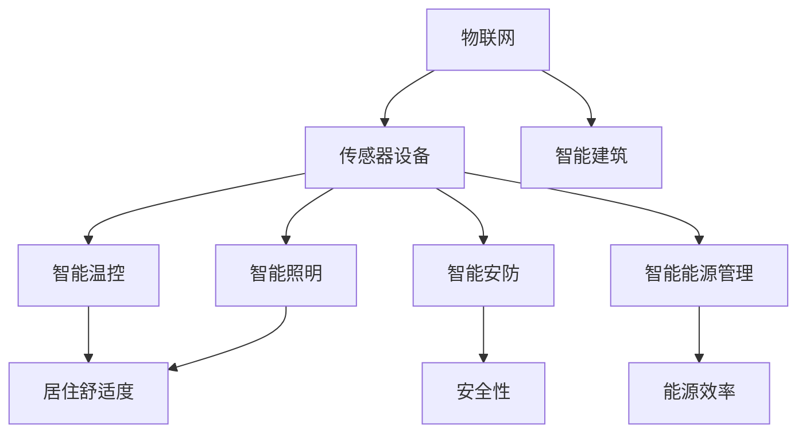

                 

关键词：物联网（IoT）、传感器设备、房地产、智能家居、自动化系统、数据集成、智能家居系统、数据隐私、智能建筑。

## 摘要

本文旨在探讨物联网（IoT）技术在房地产中的应用，特别是传感器设备在智能家居和智能建筑中的集成。通过分析物联网技术如何改变房地产行业，我们探讨了IoT在提高居住舒适度、能源效率、安全性以及房地产管理方面的价值。此外，本文还讨论了物联网技术面临的挑战，包括数据隐私和标准化问题。最后，我们对未来物联网在房地产中的发展前景进行了展望。

## 1. 背景介绍

物联网（IoT）是指将各种物理设备连接到互联网，使它们能够收集和交换数据。传感器设备是IoT生态系统中的关键组成部分，它们能够感知环境中的物理量，如温度、湿度、光照、运动等，并将这些信息转化为数字信号。随着IoT技术的不断进步，传感器设备变得越来越小巧、高效且成本低廉。

在房地产领域，物联网技术正逐渐改变传统的居住和管理模式。智能家居系统通过将传感器设备与网络连接，实现了家庭设备的自动化控制和远程监控。智能建筑则利用物联网技术提高建筑物的能源效率、安全性和便利性。

## 2. 核心概念与联系

### 物联网（IoT）与传感器设备

物联网（IoT）是一个庞大的网络系统，它由各种设备和传感器组成。这些设备和传感器通过互联网相互连接，形成一个庞大的信息网络。传感器设备是IoT的核心组件，它们能够实时监测环境中的各种物理量，并将这些信息转化为数字信号，通过无线网络传输到中央控制系统进行处理。

### 智能家居系统

智能家居系统通过整合各种传感器设备，实现了家庭设备的自动化控制和远程监控。例如，智能温控系统可以根据室内外温度自动调整空调和暖气，提高居住舒适度。智能照明系统可以根据光线强度和用户需求自动调整灯光亮度，节约能源。

### 智能建筑

智能建筑利用物联网技术实现了建筑物的自动化管理。例如，智能安防系统可以实时监测室内外环境，及时发现异常情况并报警。智能能源管理系统可以监测建筑物的能源消耗，优化能源使用，提高能源效率。

### Mermaid 流程图



## 3. 核心算法原理 & 具体操作步骤

### 3.1 算法原理概述

物联网技术在房地产中的应用涉及多种算法，包括传感器数据处理算法、智能家居控制算法、智能建筑优化算法等。这些算法的核心目标是提高居住舒适度、能源效率和安全性能。

### 3.2 算法步骤详解

#### 3.2.1 传感器数据处理算法

1. 传感器数据采集：通过各种传感器设备实时采集环境数据，如温度、湿度、光照、运动等。
2. 数据预处理：对采集到的数据进行滤波、去噪等预处理，提高数据质量。
3. 数据分析：利用机器学习算法对预处理后的数据进行分类、预测等分析，提取有用信息。

#### 3.2.2 智能家居控制算法

1. 设定目标：根据用户需求和家居环境，设定智能家居系统的目标，如温度设定、照明模式等。
2. 算法优化：利用优化算法，如遗传算法、神经网络等，优化智能家居系统的控制策略。
3. 控制执行：根据算法优化结果，自动调整家居设备的工作状态，实现智能化控制。

#### 3.2.3 智能建筑优化算法

1. 数据采集：采集建筑物的能源消耗、安防事件、设备运行状态等数据。
2. 数据分析：利用数据挖掘算法，分析建筑物运行中的问题，提出优化建议。
3. 优化执行：根据分析结果，调整建筑物的运行策略，提高能源效率和安全性能。

### 3.3 算法优缺点

#### 3.3.1 传感器数据处理算法

优点：实时性强，能够快速响应环境变化，提高居住舒适度和安全性能。

缺点：数据量大，处理复杂，对计算资源和算法性能要求高。

#### 3.3.2 智能家居控制算法

优点：提高家居设备的智能化水平，提高居住舒适度和能源效率。

缺点：对用户习惯和需求适应性要求高，算法优化难度大。

#### 3.3.3 智能建筑优化算法

优点：提高建筑物的能源效率和安全性能，延长设备使用寿命。

缺点：需要大量的数据支持，对数据处理和分析能力要求高。

### 3.4 算法应用领域

传感器数据处理算法主要应用于智能家居系统和智能建筑中，用于实时监测和控制家居设备和建筑物。智能家居控制算法和智能建筑优化算法则可以应用于住宅、商业楼宇、酒店等各类建筑物。

## 4. 数学模型和公式 & 详细讲解 & 举例说明

### 4.1 数学模型构建

在物联网技术中，常见的数学模型包括线性回归模型、决策树模型、神经网络模型等。以下是一个简单的线性回归模型的构建过程：

#### 4.1.1 数据收集

收集房屋面积、价格、地理位置等数据。

#### 4.1.2 特征提取

对收集到的数据进行预处理，提取与房屋价格相关的特征。

#### 4.1.3 模型构建

利用收集到的数据，构建线性回归模型：

$$
y = \beta_0 + \beta_1 \cdot x_1 + \beta_2 \cdot x_2 + ... + \beta_n \cdot x_n
$$

其中，$y$ 表示房屋价格，$x_1, x_2, ..., x_n$ 表示房屋特征，$\beta_0, \beta_1, ..., \beta_n$ 表示模型参数。

### 4.2 公式推导过程

线性回归模型的推导过程如下：

1. 设定损失函数：

$$
J(\theta) = \frac{1}{2m} \sum_{i=1}^{m} (h_\theta(x^{(i)}) - y^{(i)})^2
$$

其中，$m$ 表示数据集大小，$h_\theta(x) = \theta_0 + \theta_1 \cdot x_1 + \theta_2 \cdot x_2 + ... + \theta_n \cdot x_n$ 表示模型输出，$\theta_0, \theta_1, ..., \theta_n$ 表示模型参数。

2. 求导数：

$$
\frac{\partial J(\theta)}{\partial \theta_j} = \frac{1}{m} \sum_{i=1}^{m} (h_\theta(x^{(i)}) - y^{(i)}) \cdot x_j^{(i)}
$$

3. 更新参数：

$$
\theta_j := \theta_j - \alpha \cdot \frac{\partial J(\theta)}{\partial \theta_j}
$$

其中，$\alpha$ 表示学习率。

### 4.3 案例分析与讲解

假设我们有一个包含100个房屋数据集，每个房屋的数据包括面积（$x_1$）、地理位置（$x_2$）和价格（$y$）。我们使用线性回归模型来预测房屋价格。

1. 数据预处理：对数据集进行归一化处理，使数据分布更为均匀。

2. 模型训练：使用梯度下降算法训练模型，设置学习率为0.01，迭代次数为1000次。

3. 模型评估：使用测试集评估模型性能，计算均方误差（MSE）。

4. 模型应用：使用训练好的模型预测新房屋的价格。

## 5. 项目实践：代码实例和详细解释说明

### 5.1 开发环境搭建

1. 安装Python 3.8及以上版本。
2. 安装必要库：numpy、matplotlib、scikit-learn。

### 5.2 源代码详细实现

```python
import numpy as np
import matplotlib.pyplot as plt
from sklearn.linear_model import LinearRegression
from sklearn.model_selection import train_test_split
from sklearn.metrics import mean_squared_error

# 数据加载
data = np.loadtxt('house_data.csv', delimiter=',')
X = data[:, :2]
y = data[:, 2]

# 数据预处理
X = X / 1000

# 数据划分
X_train, X_test, y_train, y_test = train_test_split(X, y, test_size=0.2, random_state=42)

# 模型训练
model = LinearRegression()
model.fit(X_train, y_train)

# 模型评估
y_pred = model.predict(X_test)
mse = mean_squared_error(y_test, y_pred)
print(f'MSE: {mse}')

# 模型应用
new_house = np.array([[1500, 0.5]])
new_price = model.predict(new_house)
print(f'Predicted Price: {new_price[0]}')
```

### 5.3 代码解读与分析

1. 导入必要库：numpy用于数据处理，matplotlib用于可视化，scikit-learn用于机器学习。
2. 数据加载：从CSV文件中加载房屋数据。
3. 数据预处理：对数据进行归一化处理。
4. 数据划分：将数据集划分为训练集和测试集。
5. 模型训练：使用线性回归模型训练数据。
6. 模型评估：计算均方误差（MSE）评估模型性能。
7. 模型应用：使用训练好的模型预测新房屋的价格。

## 6. 实际应用场景

### 6.1 智能家居系统

智能家居系统在家庭中得到了广泛应用，例如智能照明、智能安防、智能温控等。用户可以通过手机应用或语音助手远程控制家庭设备，提高居住舒适度和安全性。

### 6.2 智能建筑

智能建筑在商业楼宇、酒店、办公楼等领域得到了广泛应用。智能建筑可以通过物联网技术实现能源管理、安防监控、设备维护等自动化管理，提高建筑物的运营效率和用户体验。

### 6.3 物业管理

物联网技术在物业管理中的应用也越来越广泛。物业管理公司可以通过物联网设备实时监测建筑物状态，及时维护设备，提高物业管理效率。

## 7. 未来应用展望

### 7.1 技术进步

随着物联网技术的不断进步，传感器设备将变得更加小巧、高效、低能耗。此外，人工智能和大数据技术的发展也将为物联网在房地产中的应用提供更多可能性。

### 7.2 数据隐私

数据隐私是物联网在房地产中面临的一个重大挑战。如何在保障用户隐私的前提下，充分利用传感器设备收集到的数据，是一个亟待解决的问题。

### 7.3 标准化

物联网技术在房地产中的应用需要统一的标准化。只有实现不同设备和系统的互联互通，才能充分发挥物联网技术的优势。

## 8. 总结：未来发展趋势与挑战

### 8.1 研究成果总结

物联网技术在房地产中的应用取得了显著成果，包括智能家居系统的普及、智能建筑的推广、物业管理效率的提升等。

### 8.2 未来发展趋势

未来，物联网技术在房地产中的应用将更加深入和广泛，涉及更多领域，如智能家居、智能建筑、智能安防等。

### 8.3 面临的挑战

物联网技术在房地产中面临的主要挑战包括数据隐私保护、标准化、技术成熟度等。

### 8.4 研究展望

未来，我们需要进一步研究如何优化物联网技术在房地产中的应用，提高数据利用效率，保障用户隐私，推动物联网技术标准化。

## 9. 附录：常见问题与解答

### 9.1 物联网技术在房地产中的应用有哪些？

物联网技术在房地产中的应用包括智能家居系统、智能建筑、物业管理等。智能家居系统可以提高居住舒适度和安全性，智能建筑可以实现自动化管理和提高能源效率，物业管理可以利用物联网技术提高管理效率。

### 9.2 物联网技术在房地产中面临的挑战有哪些？

物联网技术在房地产中面临的挑战包括数据隐私保护、标准化、技术成熟度等。如何保障用户隐私，实现不同设备和系统的互联互通，提高技术成熟度是当前需要解决的问题。

### 9.3 物联网技术在房地产中的未来发展趋势是什么？

未来，物联网技术在房地产中的应用将更加深入和广泛，涉及更多领域，如智能家居、智能建筑、智能安防等。随着技术的进步和应用的普及，物联网技术将为房地产行业带来更多机遇和挑战。

---

**作者：禅与计算机程序设计艺术 / Zen and the Art of Computer Programming**

