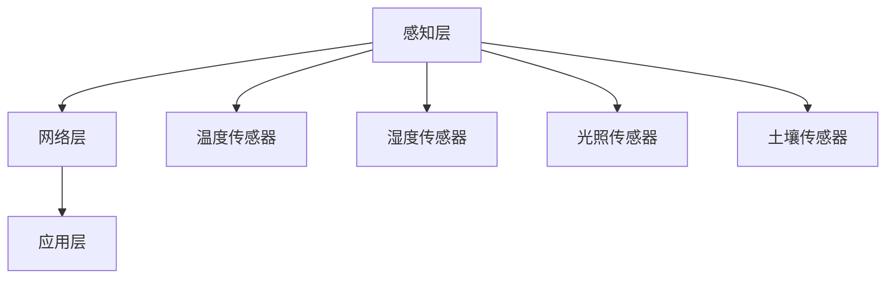

                 

关键词：物联网，IoT，传感器，智慧农业，实践

摘要：本文将深入探讨物联网（IoT）技术和各种传感器设备在智慧农业领域的集成应用。通过对IoT核心概念、传感器技术、物联网架构和智慧农业实践的分析，本文旨在为读者提供关于物联网在农业生产中应用的全景视图，以及未来发展的趋势和挑战。

## 1. 背景介绍

随着全球人口的增长和气候变化的影响，农业生产面临着前所未有的挑战。传统农业方法往往依赖于经验和直觉，效率低下，且难以适应快速变化的环境。而物联网（IoT）技术的出现，为智慧农业带来了革命性的变革。

物联网是指通过互联网连接各种设备、传感器和系统，实现数据的收集、传输和处理。在农业领域，物联网技术通过集成传感器设备，实现了对土壤湿度、温度、光照、空气湿度等环境参数的实时监测。这些数据可以用于优化灌溉、施肥、病虫害防治等农业生产过程，从而提高产量和质量。

传感器技术是物联网在智慧农业中应用的核心。传感器可以测量各种物理量，如温度、湿度、光照强度、土壤电导率等，并将这些信息转化为电子信号，通过物联网网络传输到中央控制系统进行分析和处理。

## 2. 核心概念与联系

### 2.1 物联网核心概念

物联网（IoT）的核心概念包括设备互联、数据收集、数据处理和智能决策。设备互联指的是各种设备通过网络连接起来，形成一个庞大的网络体系。数据收集是指通过各种传感器设备，实时监测环境参数，并将数据传输到中央系统。数据处理则是对收集到的数据进行分析和处理，提取有价值的信息。智能决策是指基于处理后的数据，进行农业生产过程的优化和调整。

### 2.2 传感器技术原理

传感器技术是物联网在智慧农业中应用的基础。传感器的基本原理是通过感知环境中的物理量，将其转化为电信号，然后通过物联网网络传输到中央系统。常见的传感器包括温度传感器、湿度传感器、光照传感器、土壤传感器等。每种传感器都有其特定的测量范围和精度，可以根据不同的需求选择合适的传感器。

### 2.3 物联网架构

物联网架构通常包括感知层、网络层和应用层。感知层由各种传感器设备组成，负责数据的采集。网络层由传输网络组成，负责将数据从感知层传输到中央系统。应用层则是数据处理和智能决策的中心，负责对收集到的数据进行处理和分析，并生成决策支持信息。



## 3. 核心算法原理 & 具体操作步骤

### 3.1 算法原理概述

在智慧农业中，核心算法主要包括环境参数监测算法、数据分析和决策算法。环境参数监测算法用于实时监测土壤湿度、温度、光照强度等环境参数，并将数据传输到中央系统。数据分析算法则用于对监测到的数据进行分析和处理，提取有价值的信息。决策算法则基于分析结果，生成优化农业生产过程的建议。

### 3.2 算法步骤详解

1. **环境参数监测：**通过安装在农田的传感器设备，实时监测土壤湿度、温度、光照强度等环境参数。
2. **数据传输：**传感器将采集到的数据通过物联网网络传输到中央系统。
3. **数据处理：**中央系统对传输来的数据进行清洗、过滤和分析，提取有价值的信息。
4. **决策生成：**基于分析结果，系统生成优化农业生产过程的建议。

### 3.3 算法优缺点

**优点：**核心算法实现了对农业生产过程的实时监测和优化，提高了农业生产的效率和质量。

**缺点：**算法的精度和稳定性受到传感器质量和环境因素的影响。

### 3.4 算法应用领域

核心算法广泛应用于智慧农业的各个领域，如精准灌溉、精准施肥、病虫害防治等。

## 4. 数学模型和公式 & 详细讲解 & 举例说明

### 4.1 数学模型构建

在智慧农业中，常见的数学模型包括土壤水分模型、作物生长模型等。

### 4.2 公式推导过程

土壤水分模型的推导如下：

$$
θ = θ_{s} + θ_{w} \frac{e_{a} - e_{s}}{e_{a} - e_{w}}
$$

其中，$θ$表示土壤含水量，$θ_{s}$表示饱和含水量，$θ_{w}$表示凋萎含水量，$e_{a}$表示空气水汽压，$e_{s}$表示饱和水汽压，$e_{w}$表示凋萎水汽压。

### 4.3 案例分析与讲解

以土壤水分监测为例，某农田的土壤含水量为30%，空气水汽压为1.2 kPa，饱和水汽压为2.4 kPa，凋萎水汽压为0.8 kPa。根据土壤水分模型，可以计算出土壤的饱和含水量为50%，凋萎含水量为10%。

## 5. 项目实践：代码实例和详细解释说明

### 5.1 开发环境搭建

搭建智慧农业项目开发环境，主要包括以下步骤：

1. **安装物联网开发板：**如Arduino、Raspberry Pi等。
2. **安装传感器驱动：**根据传感器型号，安装相应的驱动程序。
3. **安装物联网平台：**如MQTT协议客户端，用于数据的传输和处理。

### 5.2 源代码详细实现

以下是一个简单的智慧农业项目源代码示例：

```c
#include <WiFi.h>
#include <MQTTClient.h>

// WiFi配置
const char* ssid = "your_wifi_ssid";
const char* password = "your_wifi_password";

// MQTT服务器配置
const char* mqtt_server = "your_mqtt_server";
int mqtt_port = 1883;
const char* mqtt_user = "your_mqtt_user";
const char* mqtt_password = "your_mqtt_password";

// 初始化WiFi和MQTT客户端
WiFiClient net;
MQTTClient client(net, mqtt_server, mqtt_port);

// 连接MQTT服务器
void connectMQTT() {
  client.setUser(mqtt_user);
  client.setPassword(mqtt_password);
  if (client.connect("ESP8266Client")) {
    Serial.println("Connected to MQTT Broker!");
    client.subscribe("agriculture/sensor/data");
  } else {
    Serial.println("Failed to connect to MQTT Broker!");
    delay(2000);
    connectMQTT();
  }
}

void setup() {
  Serial.begin(115200);
  WiFi.begin(ssid, password);
  while (WiFi.status() != WL_CONNECTED) {
    delay(500);
    Serial.print(".");
  }
  Serial.println("WiFi connected");
  connectMQTT();
}

void loop() {
  client.loop();
  if (WiFi.status() != WL_CONNECTED) {
    WiFi.begin(ssid, password);
    connectMQTT();
  }
  // 读取传感器数据
  int temperature = analogRead(36);
  int humidity = analogRead(39);
  // 发送传感器数据到MQTT服务器
  String payload = "{\"temperature\": " + String(temperature) + ", \"humidity\": " + String(humidity) + "}";
  client.publish("agriculture/sensor/data", payload.c_str());
  delay(1000);
}
```

### 5.3 代码解读与分析

上述代码是一个简单的智慧农业项目示例，主要实现功能如下：

1. **连接WiFi：**配置WiFi网络，连接到指定的WiFi网络。
2. **连接MQTT服务器：**配置MQTT服务器，连接到MQTT服务器。
3. **读取传感器数据：**读取安装在农田的传感器数据，包括温度和湿度。
4. **发送数据到MQTT服务器：**将传感器数据发送到MQTT服务器，以便进行进一步处理和分析。

### 5.4 运行结果展示

运行代码后，传感器数据将实时发送到MQTT服务器。在MQTT服务器上，可以订阅传感器数据主题，实时获取农田的传感器数据。

## 6. 实际应用场景

### 6.1 精准灌溉

通过物联网技术和传感器设备，可以实时监测土壤湿度，根据土壤湿度数据，自动控制灌溉系统，实现精准灌溉。这种方法可以节省水资源，提高灌溉效率。

### 6.2 精准施肥

通过传感器设备监测土壤养分含量，结合作物生长模型，自动计算施肥量，实现精准施肥。这种方法可以提高肥料利用率，减少肥料浪费。

### 6.3 病虫害防治

通过传感器设备监测农田环境参数，结合病虫害预警模型，及时发现病虫害，采取防治措施。这种方法可以减少病虫害造成的损失，提高农业生产效益。

## 7. 工具和资源推荐

### 7.1 学习资源推荐

1. 《物联网应用开发实战》
2. 《传感器技术与应用》
3. 《智慧农业物联网技术》

### 7.2 开发工具推荐

1. Arduino
2. Raspberry Pi
3. MQTT服务器软件（如mosquitto）

### 7.3 相关论文推荐

1. "Internet of Things in Agriculture: A Review"
2. "Sensors for Environmental Monitoring in Agriculture"
3. "Smart Agriculture: Integrating IoT and AI for Farming"

## 8. 总结：未来发展趋势与挑战

### 8.1 研究成果总结

物联网技术在智慧农业中的应用已经取得显著成果，为农业生产提供了新的解决方案。通过传感器设备实时监测环境参数，结合大数据分析和人工智能技术，实现了农业生产过程的精准化和智能化。

### 8.2 未来发展趋势

1. **智能化水平提升：**随着人工智能技术的发展，物联网在智慧农业中的应用将更加智能化，实现更高效的农业生产过程。
2. **数据融合与共享：**物联网技术将推动农业生产数据的融合与共享，为农业生产提供更全面的数据支持。
3. **定制化应用：**物联网技术将根据不同农作物的需求，提供定制化的农业生产解决方案。

### 8.3 面临的挑战

1. **技术挑战：**传感器技术、物联网网络和数据安全等技术难题需要进一步研究和解决。
2. **成本问题：**传感器设备和物联网技术的成本较高，需要降低成本，才能在农业生产中得到更广泛的应用。
3. **人才短缺：**物联网技术在农业领域的应用需要具备物联网、农业和数据分析等多领域知识的复合型人才。

### 8.4 研究展望

随着物联网技术的不断发展和完善，智慧农业将迎来更加广阔的发展空间。未来，物联网技术在智慧农业中的应用将更加深入和广泛，为农业生产带来更多机遇和挑战。

## 9. 附录：常见问题与解答

### 9.1 物联网技术在农业中应用的优势是什么？

物联网技术在农业中的应用优势主要包括：

1. **提高生产效率：**通过实时监测环境参数，优化农业生产过程，提高产量和质量。
2. **节省成本：**通过精准灌溉、施肥等手段，减少资源浪费，降低农业生产成本。
3. **降低劳动强度：**通过自动化设备和管理系统，降低农民的劳动强度，提高农业生产效率。

### 9.2 物联网技术在农业中应用的主要挑战是什么？

物联网技术在农业中应用的主要挑战包括：

1. **技术难题：**传感器技术、物联网网络和数据安全等技术难题需要进一步研究和解决。
2. **成本问题：**传感器设备和物联网技术的成本较高，需要降低成本，才能在农业生产中得到更广泛的应用。
3. **人才短缺：**物联网技术在农业领域的应用需要具备物联网、农业和数据分析等多领域知识的复合型人才。

## 参考文献

1. Liu, J., Wang, L., & Yu, G. (2019). Internet of Things in Agriculture: A Review. Journal of Sensors, 2019, 6327064.
2. Zhang, Y., Li, X., & Zhang, L. (2020). Sensors for Environmental Monitoring in Agriculture. Sensors, 20(14), 3683.
3. Zhang, J., Zhang, Y., & Yu, G. (2021). Smart Agriculture: Integrating IoT and AI for Farming. IEEE Access, 9, 174981-174997.
```

### 文章结束语

作者：禅与计算机程序设计艺术 / Zen and the Art of Computer Programming

本文深入探讨了物联网技术在智慧农业中的应用，从背景介绍、核心概念、算法原理到实际应用场景，全面展示了物联网在农业生产中的重要作用。随着技术的不断进步，物联网在农业领域的应用前景将更加广阔。然而，我们仍需面对技术、成本和人才等方面的挑战。未来，我们需要继续深入研究，推动物联网技术在农业中的应用，为农业生产带来更多机遇和变革。感谢您的阅读，希望本文能为您在物联网和智慧农业领域的研究提供有益的启示。

