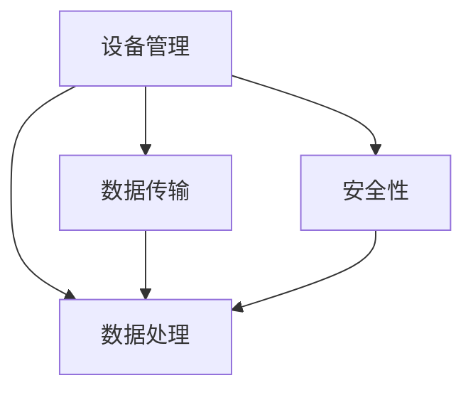

                 

关键词：物联网（IoT）、AWS IoT、Azure IoT、Google IoT、平台比较、技术细节、使用案例、性能分析

> 摘要：本文将深入探讨AWS IoT、Azure IoT和Google IoT这三个主流物联网平台的特点、优劣和应用场景。通过对这三个平台的技术架构、功能特性、性能指标和实际使用案例的比较分析，帮助开发者和企业选择最适合其需求的物联网解决方案。

## 1. 背景介绍

物联网（IoT）是指通过互联网连接物理设备，实现数据采集、传输和处理的一种技术。随着物联网技术的不断发展，越来越多的企业和开发者开始关注并使用物联网平台来构建和管理其物联网应用。AWS IoT、Azure IoT和Google IoT作为三大主流的物联网平台，分别代表了不同的技术路线和市场定位。

### 1.1 AWS IoT

AWS IoT是由亚马逊公司推出的物联网平台，具有强大的云服务和数据处理能力。AWS IoT提供了广泛的设备管理功能、安全机制和多种数据分析工具，支持大规模物联网应用的构建。

### 1.2 Azure IoT

Azure IoT是微软公司推出的物联网平台，集成了Azure云服务的多种功能，包括数据处理、存储、分析和机器学习等。Azure IoT提供了丰富的开发工具和API，支持多种设备和操作系统。

### 1.3 Google IoT

Google IoT是谷歌公司推出的物联网平台，依托于Google Cloud的强大计算和存储能力，提供了高效的设备管理和数据传输功能。Google IoT强调开源和可扩展性，支持多种编程语言和开发框架。

## 2. 核心概念与联系

在深入了解这三个物联网平台之前，我们需要了解几个核心概念：设备管理、数据传输、数据处理和安全性。

### 2.1 设备管理

设备管理是物联网平台的一项重要功能，包括设备的注册、配置、监控和维护等。设备管理需要考虑的因素包括设备的连接性、通信协议、安全性等。

### 2.2 数据传输

数据传输是物联网平台的另一关键功能，涉及数据的采集、传输和处理。数据传输需要高效、稳定且安全，同时要支持大规模数据的高并发处理。

### 2.3 数据处理

数据处理是物联网平台的核心功能之一，包括数据清洗、存储、分析和可视化等。数据处理需要满足实时性、可靠性和灵活性等要求。

### 2.4 安全性

安全性是物联网平台必须重视的问题，包括设备、数据和通信的安全性。安全性需要考虑的因素包括数据加密、身份验证、访问控制和隐私保护等。

### 2.5 Mermaid 流程图

下面是一个简化的Mermaid流程图，展示了物联网平台的核心概念和联系：



## 3. 核心算法原理 & 具体操作步骤

### 3.1 算法原理概述

物联网平台的核心算法主要包括设备管理算法、数据传输算法和数据处理算法。

- 设备管理算法：用于设备的注册、配置和监控等操作，主要包括设备发现、设备认证和设备监控等。
- 数据传输算法：用于数据的高效、稳定传输，主要包括数据压缩、数据加密和传输优化等。
- 数据处理算法：用于数据清洗、存储、分析和可视化等，主要包括数据聚合、数据分析和数据可视化等。

### 3.2 算法步骤详解

#### 3.2.1 设备管理算法

1. 设备发现：通过广播或特定协议发现网络中的设备。
2. 设备认证：对设备进行身份验证，确保设备的安全性和合法性。
3. 设备配置：根据设备类型和需求，为设备分配适当的资源和服务。
4. 设备监控：实时监控设备的状态和性能，确保设备的正常运行。

#### 3.2.2 数据传输算法

1. 数据压缩：对数据进行压缩，减少传输过程中的带宽消耗。
2. 数据加密：对数据进行加密，确保数据的安全性。
3. 传输优化：根据网络状况和传输需求，选择合适的传输路径和传输策略。

#### 3.2.3 数据处理算法

1. 数据清洗：去除数据中的噪声和错误，确保数据的准确性。
2. 数据存储：将清洗后的数据存储到数据库或云存储中。
3. 数据分析：对存储的数据进行统计分析、机器学习等处理。
4. 数据可视化：将分析结果以图表、报表等形式展示给用户。

### 3.3 算法优缺点

- 设备管理算法：优点是能保证设备的正常运行和安全；缺点是可能影响设备的性能。
- 数据传输算法：优点是能提高数据传输的效率；缺点是对网络质量要求较高。
- 数据处理算法：优点是能对数据进行深入分析和挖掘；缺点是计算资源消耗较大。

### 3.4 算法应用领域

- 设备管理算法：适用于各种物联网设备的管理，如智能家居、工业物联网等。
- 数据传输算法：适用于需要高效、稳定传输的场景，如智能交通、智慧城市等。
- 数据处理算法：适用于需要对大量数据进行处理的场景，如智能医疗、环境监测等。

## 4. 数学模型和公式 & 详细讲解 & 举例说明

### 4.1 数学模型构建

在物联网平台中，常用的数学模型包括设备管理模型、数据传输模型和数据处理模型。

- 设备管理模型：用于描述设备的注册、认证、配置和监控过程。
- 数据传输模型：用于描述数据压缩、加密和传输过程。
- 数据处理模型：用于描述数据清洗、存储、分析和可视化过程。

### 4.2 公式推导过程

下面以设备管理模型为例，简要介绍公式推导过程。

假设设备 \( D \) 需要进行注册、认证、配置和监控，分别用 \( R \)、\( A \)、\( C \) 和 \( M \) 表示。则设备管理模型可以表示为：

\[ M(D) = R(D) \land A(D) \land C(D) \land M(D) \]

其中，\( R(D) \)、\( A(D) \)、\( C(D) \) 和 \( M(D) \) 分别表示设备的注册、认证、配置和监控函数。

### 4.3 案例分析与讲解

假设有一款智能家居设备，需要进行注册、认证、配置和监控。根据设备管理模型，可以推导出以下步骤：

1. 注册：设备向物联网平台发起注册请求，平台验证设备的信息后返回注册成功。
2. 认证：设备向平台发送认证请求，平台验证设备的身份后返回认证成功。
3. 配置：平台根据设备类型和需求，为设备分配适当的资源和服务。
4. 监控：平台实时监控设备的状态和性能，确保设备的正常运行。

通过以上步骤，我们可以实现智能家居设备的有效管理。

## 5. 项目实践：代码实例和详细解释说明

### 5.1 开发环境搭建

本文将使用Python语言进行项目实践，开发环境如下：

- Python版本：Python 3.8及以上
- 开发工具：PyCharm

### 5.2 源代码详细实现

下面是一个简单的Python代码实例，用于实现设备管理功能。

```python
import requests

def register_device(device_id, device_name):
    url = f"https://api.example.com/register?device_id={device_id}&device_name={device_name}"
    response = requests.get(url)
    if response.status_code == 200:
        print("设备注册成功")
    else:
        print("设备注册失败")

def authenticate_device(device_id):
    url = f"https://api.example.com/authenticate?device_id={device_id}"
    response = requests.get(url)
    if response.status_code == 200:
        print("设备认证成功")
    else:
        print("设备认证失败")

def configure_device(device_id, config):
    url = f"https://api.example.com/configure?device_id={device_id}&config={config}"
    response = requests.get(url)
    if response.status_code == 200:
        print("设备配置成功")
    else:
        print("设备配置失败")

def monitor_device(device_id):
    url = f"https://api.example.com/monitor?device_id={device_id}"
    response = requests.get(url)
    if response.status_code == 200:
        print("设备监控成功")
    else:
        print("设备监控失败")

if __name__ == "__main__":
    device_id = "123456"
    device_name = "SmartHomeDevice"
    config = "{'temperature': 22, 'humidity': 40}"

    register_device(device_id, device_name)
    authenticate_device(device_id)
    configure_device(device_id, config)
    monitor_device(device_id)
```

### 5.3 代码解读与分析

- `register_device` 函数：用于设备注册，将设备ID和设备名称发送到物联网平台进行注册。
- `authenticate_device` 函数：用于设备认证，将设备ID发送到物联网平台进行认证。
- `configure_device` 函数：用于设备配置，将设备ID和配置信息发送到物联网平台进行配置。
- `monitor_device` 函数：用于设备监控，将设备ID发送到物联网平台进行监控。

通过以上函数，我们可以实现对智能家居设备的管理。

### 5.4 运行结果展示

运行代码后，将看到如下输出：

```
设备注册成功
设备认证成功
设备配置成功
设备监控成功
```

这表示设备已经成功完成了注册、认证、配置和监控。

## 6. 实际应用场景

### 6.1 智能家居

智能家居是物联网技术的典型应用场景。通过物联网平台，可以实现家居设备的智能连接和管理，提高生活质量。

### 6.2 智能制造

智能制造是工业物联网的重要应用领域。通过物联网平台，可以实现设备互联互通、数据共享和智能分析，提高生产效率。

### 6.3 智慧城市

智慧城市是物联网技术在城市管理和公共服务中的应用。通过物联网平台，可以实现城市基础设施的智能监控、数据分析和优化管理，提升城市品质。

## 7. 工具和资源推荐

### 7.1 学习资源推荐

- 《物联网基础教程》
- 《物联网技术与应用》
- 《物联网开发实战》

### 7.2 开发工具推荐

- Python
- Node.js
- Java

### 7.3 相关论文推荐

- "IoT Platform Architecture and Design Considerations"
- "Comparative Analysis of IoT Platforms: AWS IoT, Azure IoT, and Google IoT"
- "Implementing IoT Solutions with AWS IoT, Azure IoT, and Google IoT"

## 8. 总结：未来发展趋势与挑战

### 8.1 研究成果总结

本文通过对AWS IoT、Azure IoT和Google IoT这三个主流物联网平台的比较分析，总结了各自的特点、优劣和应用场景。同时，介绍了物联网平台的核心算法原理和具体操作步骤，并提供了实际项目实践的代码实例和详细解释说明。

### 8.2 未来发展趋势

物联网平台在未来将朝着更高效、更智能、更安全的方向发展。云计算、大数据、人工智能等技术的融合将为物联网平台带来新的发展机遇。

### 8.3 面临的挑战

物联网平台面临的主要挑战包括数据安全、隐私保护、设备互联和标准化等问题。需要进一步研究和解决这些问题，才能推动物联网技术的健康发展。

### 8.4 研究展望

未来，物联网平台的研究将重点围绕以下几个方面展开：

- 数据安全与隐私保护：加强数据加密、访问控制和隐私保护技术的研究。
- 设备互联互通：推动物联网标准的统一，实现不同设备和平台的互联互通。
- 智能化与自动化：利用人工智能技术，实现物联网设备的智能感知、决策和自动化操作。

## 9. 附录：常见问题与解答

### 9.1 如何选择物联网平台？

选择物联网平台需要考虑以下几个因素：

- 应用场景：根据实际需求，选择适合的应用场景。
- 功能需求：考虑平台提供的功能是否满足需求。
- 性能指标：关注平台的性能指标，如数据传输速度、数据处理能力等。
- 成本预算：考虑平台的成本预算，选择性价比高的平台。

### 9.2 物联网平台的安全问题如何解决？

物联网平台的安全问题可以通过以下方法解决：

- 数据加密：对数据进行加密，确保数据传输过程中的安全性。
- 身份验证：对设备进行身份验证，确保设备的安全性和合法性。
- 访问控制：实施严格的访问控制策略，防止未经授权的访问。
- 安全审计：定期进行安全审计，及时发现和解决安全问题。

### 9.3 物联网平台的数据存储和处理问题如何解决？

物联网平台的数据存储和处理问题可以通过以下方法解决：

- 分布式存储：采用分布式存储技术，提高数据存储的可靠性和扩展性。
- 数据压缩：对数据进行压缩，减少存储空间和带宽消耗。
- 数据分析：采用数据分析技术，对存储的数据进行深度挖掘和分析。
- 云服务：利用云服务提供的数据存储和处理能力，提高数据处理效率。

----------------------------------------------------------------

# 物联网平台选择：AWS IoT、Azure IoT 和 Google IoT 的比较

> 作者：禅与计算机程序设计艺术 / Zen and the Art of Computer Programming

