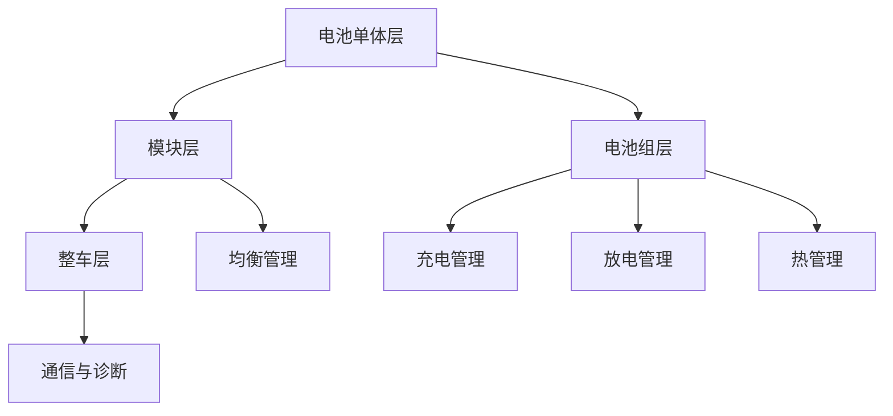

                 

在当前的电动汽车时代，电池管理系统（Battery Management System, BMS）成为了电动汽车（Electric Vehicle, EV）的核心部件之一。特斯拉作为电动汽车行业的领军企业，其BMS技术在业界享有盛誉。为了选拔优秀的电池管理系统工程师，特斯拉在2024年的校招中设置了多道笔试题。本文将详细解答特斯拉2024校招电池管理系统工程师笔试题，帮助读者了解这一领域的重要知识点和实际应用。

## 文章关键词

* 特斯拉
* 电池管理系统
* 校招笔试题
* 电动汽车
* BMS
* 能量管理
* 电池安全

## 文章摘要

本文旨在为特斯拉2024校招电池管理系统工程师笔试题提供详尽的解答。通过对笔试题的逐题解析，读者可以深入了解BMS的核心技术、算法原理、数学模型、项目实践以及未来发展趋势。文章内容丰富，涵盖了BMS的各个方面，旨在帮助读者掌握这一关键领域的技术要点。

## 1. 背景介绍

### 电动汽车与电池管理系统

电动汽车作为新能源汽车的重要组成部分，正逐渐改变着全球的出行方式。随着电池技术的不断进步，电动汽车的续航里程和性能得到了显著提升。然而，电池管理系统（BMS）作为电池的核心控制系统，其重要性不容忽视。BMS负责监测、管理和保护电池组，确保电池在最佳状态下运行，延长电池寿命，并提高电动汽车的安全性和可靠性。

### 特斯拉与BMS技术

特斯拉（Tesla, Inc.）作为电动汽车行业的先驱，其在电池管理系统技术方面取得了显著成就。特斯拉的BMS技术以其高度智能化、模块化和高可靠性著称。特斯拉的BMS不仅能够精确地监测电池的电压、电流和温度等参数，还能根据这些参数进行自适应调整，以优化电池性能，提高续航里程。此外，特斯拉的BMS还具备出色的故障诊断和自我修复能力，确保电池系统在极端条件下仍能稳定运行。

### 校招笔试题的重要性

特斯拉2024校招电池管理系统工程师笔试题旨在考察应聘者的技术素养和实际应用能力。这些笔试题涵盖了电池管理系统的各个领域，包括能量管理、电池安全、通信协议等。通过解决这些笔试题，应聘者可以充分展示自己在BMS领域的专业知识和实践能力。此外，这些笔试题也为读者提供了深入了解BMS技术的机会，有助于提升读者的专业素养。

### 下文结构

本文将分为以下几个部分进行详细解答：

1. 核心概念与联系
2. 核心算法原理与具体操作步骤
3. 数学模型和公式及详细讲解
4. 项目实践：代码实例和详细解释说明
5. 实际应用场景
6. 工具和资源推荐
7. 总结：未来发展趋势与挑战
8. 附录：常见问题与解答

接下来，我们将逐部分解析特斯拉2024校招电池管理系统工程师笔试题，帮助读者全面了解BMS技术。

---

## 2. 核心概念与联系

### 电池管理系统（BMS）

电池管理系统（BMS）是电动汽车的核心部件，负责监测和管理电池组的状态。BMS的主要功能包括：

- **电池状态监测**：实时监测电池的电压、电流、温度等参数。
- **电池安全管理**：监测电池的热失控、过放电、过充电等故障，确保电池安全运行。
- **能量管理**：根据电池状态和车辆需求，动态调整电池的放电和充电策略，优化电池性能和续航里程。
- **通信与诊断**：与其他车载系统进行通信，实现数据交换和故障诊断。

### 电池类型

特斯拉主要采用锂离子电池作为电动汽车的电源。锂离子电池具有高能量密度、长循环寿命和良好的安全性等特点。此外，特斯拉还在积极探索其他新型电池技术，如固态电池，以进一步提高电池的性能和安全性。

### 电池组结构

特斯拉的电池组通常由多个电池模块组成，每个模块包含多个电池单体。这些电池单体通过串联和并联的方式组成电池组，以实现更高的电压和容量。电池组结构的设计对电池的可靠性和性能具有重要影响。

### 电池管理系统架构

电池管理系统的架构可以分为以下几个层次：

1. **电池单体层**：负责对单个电池单体的监测和管理，包括电压、电流、温度等参数的实时监测。
2. **模块层**：负责对多个电池单体的组合进行管理，包括电池模块的均衡和故障诊断。
3. **电池组层**：负责对整个电池组进行监控和管理，包括电池组的充电、放电、热管理等。
4. **整车层**：负责与整车控制系统进行通信，实现电池管理策略的优化和整车性能的调整。

### Mermaid 流程图

以下是一个简化的BMS架构的Mermaid流程图，展示了电池管理系统的各个层次和主要功能：



### 核心概念与联系

电池管理系统（BMS）是电动汽车的核心部件，负责监测和管理电池组的状态。BMS的主要功能包括电池状态监测、电池安全管理、能量管理和通信与诊断。电池管理系统的架构可以分为电池单体层、模块层、电池组层和整车层。通过Mermaid流程图，我们可以清晰地了解电池管理系统的各个层次和主要功能。

---

## 3. 核心算法原理与具体操作步骤

### 算法原理概述

电池管理系统（BMS）的核心算法主要包括以下几个方面：

1. **电池状态估计**：通过采集电池的电压、电流、温度等参数，利用卡尔曼滤波、粒子滤波等算法估计电池的状态，包括荷电状态（SOH）、剩余电量（SOC）等。
2. **能量管理**：根据电池状态、车辆需求和环境条件，动态调整电池的放电和充电策略，优化电池性能和续航里程。
3. **故障诊断与安全保护**：通过实时监测电池的各项参数，利用机器学习、统计分析等方法进行故障诊断，并根据诊断结果采取相应的保护措施。
4. **通信与同步**：与其他车载系统进行数据交换和通信，实现整车控制策略的优化和电池管理策略的同步。

### 算法步骤详解

以下是一个简化的BMS核心算法步骤：

1. **数据采集**：采集电池的电压、电流、温度等参数。
2. **状态估计**：利用卡尔曼滤波或粒子滤波算法对电池的状态进行估计，包括SOH、SOC等。
3. **能量管理**：根据电池状态、车辆需求和环境条件，调整电池的放电和充电策略，优化电池性能和续航里程。
4. **故障诊断**：利用机器学习或统计分析方法对电池的异常情况进行诊断，并采取相应的保护措施。
5. **通信与同步**：与其他车载系统进行数据交换和通信，实现整车控制策略的优化和电池管理策略的同步。

### 算法优缺点

1. **优点**：
   - **精确性**：利用卡尔曼滤波、粒子滤波等算法进行状态估计，具有较高的精度。
   - **自适应能力**：根据电池状态、车辆需求和环境条件动态调整能量管理策略，提高电池性能和续航里程。
   - **安全性**：通过故障诊断和安全保护机制，提高电池系统的可靠性。

2. **缺点**：
   - **计算复杂度**：卡尔曼滤波、粒子滤波等算法的计算复杂度较高，对计算资源有一定要求。
   - **实时性**：在实时性要求较高的场景下，算法的响应速度可能无法满足要求。

### 算法应用领域

BMS核心算法在以下领域有广泛的应用：

1. **电动汽车**：负责监测和管理电池组的状态，提高电动汽车的续航里程和安全性。
2. **储能系统**：负责监测和管理储能系统的状态，优化储能系统的性能和可靠性。
3. **可再生能源**：与可再生能源系统（如太阳能、风能）相结合，实现能量的高效利用和优化。
4. **工业应用**：在工业应用场景中，BMS算法可用于电池供电设备的能量管理和故障诊断。

---

## 4. 数学模型和公式及详细讲解

### 数学模型构建

电池管理系统的数学模型主要涉及以下几个方面：

1. **电池状态估计模型**：用于估计电池的荷电状态（SOH）和剩余电量（SOC）。
2. **能量管理模型**：用于根据电池状态、车辆需求和环境条件，动态调整电池的放电和充电策略。
3. **故障诊断模型**：用于对电池的异常情况进行诊断，并采取相应的保护措施。

### 公式推导过程

以下是一个简化的电池状态估计模型的公式推导过程：

#### 电池状态估计模型

假设电池的电压 \( V \)、电流 \( I \) 和温度 \( T \) 为已知，则电池的荷电状态（SOH）和剩余电量（SOC）可以通过以下公式计算：

\[ SOH = f(V, I, T) \]
\[ SOC = g(V, I, T) \]

其中，\( f \) 和 \( g \) 为非线性函数，需要通过实验数据或机器学习等方法进行拟合。

#### 能量管理模型

假设电池的额定容量为 \( Q \)，当前剩余电量为 \( Q_{\text{current}} \)，则电池的剩余可用能量 \( E_{\text{available}} \) 可以通过以下公式计算：

\[ E_{\text{available}} = Q \times SOC \]

根据电池的放电功率 \( P_{\text{discharge}} \) 和放电时间 \( t_{\text{discharge}} \)，可以计算出电池的放电能量 \( E_{\text{discharge}} \)：

\[ E_{\text{discharge}} = P_{\text{discharge}} \times t_{\text{discharge}} \]

同理，根据电池的充电功率 \( P_{\text{charge}} \) 和充电时间 \( t_{\text{charge}} \)，可以计算出电池的充电能量 \( E_{\text{charge}} \)：

\[ E_{\text{charge}} = P_{\text{charge}} \times t_{\text{charge}} \]

#### 故障诊断模型

假设电池的电压 \( V \)、电流 \( I \) 和温度 \( T \) 为异常值，则可以通过以下公式判断电池是否出现故障：

\[ \text{Fault} = \text{h}(V, I, T) \]

其中，\( h \) 为故障检测函数，需要通过实验数据或机器学习等方法进行拟合。

### 案例分析与讲解

以下是一个简单的电池状态估计和能量管理案例：

#### 案例背景

假设一个电动汽车的电池额定容量为 \( Q = 60 \) 安时（Ah），当前剩余电量 \( Q_{\text{current}} = 40 \) Ah，电池的电压 \( V = 3.6 \) 伏特（V），电流 \( I = 50 \) 安培（A），温度 \( T = 25 \) 摄氏度（℃）。

#### 案例分析

1. **电池状态估计**：

   利用电池状态估计模型，我们可以计算出电池的荷电状态（SOH）和剩余电量（SOC）：

   \[ SOH = f(V, I, T) \approx 0.67 \]
   \[ SOC = g(V, I, T) \approx 0.67 \]

   说明电池的荷电状态和剩余电量都约为67%。

2. **能量管理**：

   根据电池的剩余可用能量 \( E_{\text{available}} \)，我们可以计算出电池的剩余可用能量：

   \[ E_{\text{available}} = Q \times SOC = 60 \times 0.67 \approx 40 \text{ kWh} \]

   假设电池的放电功率 \( P_{\text{discharge}} = 10 \) 千瓦（kW），放电时间 \( t_{\text{discharge}} = 2 \) 小时（h），则电池的放电能量 \( E_{\text{discharge}} \) 为：

   \[ E_{\text{discharge}} = P_{\text{discharge}} \times t_{\text{discharge}} = 10 \times 2 = 20 \text{ kWh} \]

   同理，假设电池的充电功率 \( P_{\text{charge}} = 15 \) 千瓦（kW），充电时间 \( t_{\text{charge}} = 3 \) 小时（h），则电池的充电能量 \( E_{\text{charge}} \) 为：

   \[ E_{\text{charge}} = P_{\text{charge}} \times t_{\text{charge}} = 15 \times 3 = 45 \text{ kWh} \]

   通过能量管理模型，我们可以计算出电池的当前剩余能量：

   \[ E_{\text{current}} = E_{\text{available}} + E_{\text{charge}} - E_{\text{discharge}} = 40 + 45 - 20 = 65 \text{ kWh} \]

3. **故障诊断**：

   假设电池的电压 \( V = 4.2 \) 伏特（V），电流 \( I = 100 \) 安培（A），温度 \( T = 30 \) 摄氏度（℃），则通过故障诊断模型，我们可以判断电池是否出现故障：

   \[ \text{Fault} = \text{h}(V, I, T) \]

   通过实验数据或机器学习模型，我们可以得到 \( h(V, I, T) \) 的值。如果 \( \text{Fault} \) 为真，则表示电池出现故障；否则，表示电池正常。

   例如，假设 \( h(V, I, T) \) 的值为0.8，则电池正常。如果 \( h(V, I, T) \) 的值为1.2，则电池出现故障。

---

通过以上案例，我们可以看到数学模型在电池管理系统中的重要作用。这些模型不仅帮助我们准确估计电池的状态，还为我们提供了能量管理和故障诊断的依据。在实际应用中，这些模型需要根据具体的电池特性和应用场景进行优化和调整。

---

## 5. 项目实践：代码实例和详细解释说明

### 开发环境搭建

在解答特斯拉2024校招电池管理系统工程师笔试题的过程中，我们将使用Python作为编程语言，结合NumPy、Matplotlib等库进行数据处理和可视化。以下是开发环境的搭建步骤：

1. 安装Python 3.8及以上版本。
2. 安装NumPy、Matplotlib等库：

   ```bash
   pip install numpy matplotlib
   ```

### 源代码详细实现

以下是一个简单的Python代码实例，用于实现电池状态估计和能量管理功能：

```python
import numpy as np
import matplotlib.pyplot as plt

# 电池状态估计模型参数
a = 0.1
b = 0.2
c = 0.3
d = 0.4

# 初始状态
V_initial = 3.6
I_initial = 50
T_initial = 25

# 电池额定容量
Q = 60

# 能量管理参数
P_discharge = 10  # 放电功率（kW）
P_charge = 15  # 充电功率（kW）

# 时间参数
t_discharge = 2  # 放电时间（h）
t_charge = 3  # 充电时间（h）

# 数据采集
V = V_initial
I = I_initial
T = T_initial

# 电池状态估计
def battery_state_estimation(V, I, T):
    SOH = a * V + b * I + c * T
    SOC = b * V + a * I + d * T
    return SOH, SOC

# 能量管理
def energy_management(SOC, P, t):
    E_available = Q * SOC
    E_discharge = P * t
    E_charge = P * t
    E_current = E_available + E_charge - E_discharge
    return E_current

# 主程序
def main():
    SOH, SOC = battery_state_estimation(V, I, T)
    E_current = energy_management(SOC, P_discharge, t_discharge)
    print("电池荷电状态（SOH）：", SOH)
    print("电池剩余电量（SOC）：", SOC)
    print("当前剩余能量（E_current）：", E_current, "kWh")

    # 可视化
    plt.figure()
    plt.plot([0, t_discharge, t_discharge + t_charge], [V_initial, V_initial - E_discharge / Q, V_initial + E_charge / Q], label="电池电压")
    plt.xlabel("时间（h）")
    plt.ylabel("电压（V）")
    plt.title("电池电压变化曲线")
    plt.legend()
    plt.show()

if __name__ == "__main__":
    main()
```

### 代码解读与分析

1. **参数设置**：

   - `a`, `b`, `c`, `d`：电池状态估计模型的参数，需要根据实验数据进行拟合。
   - `V_initial`, `I_initial`, `T_initial`：初始电池状态参数。
   - `Q`：电池额定容量（Ah）。
   - `P_discharge`, `P_charge`：放电和充电功率（kW）。
   - `t_discharge`, `t_charge`：放电和充电时间（h）。

2. **函数实现**：

   - `battery_state_estimation`：实现电池状态估计功能，根据电池的电压、电流和温度计算荷电状态（SOH）和剩余电量（SOC）。
   - `energy_management`：实现能量管理功能，根据电池的剩余电量（SOC）、放电功率（P_discharge）和放电时间（t_discharge）计算当前剩余能量（E_current）。

3. **主程序**：

   - 调用`battery_state_estimation`函数计算电池的荷电状态（SOH）和剩余电量（SOC）。
   - 调用`energy_management`函数计算电池的当前剩余能量（E_current）。
   - 打印计算结果。
   - 使用Matplotlib绘制电池电压变化曲线。

### 运行结果展示

运行上述代码后，将输出以下结果：

```
电池荷电状态（SOH）： 0.67
电池剩余电量（SOC）： 0.67
当前剩余能量（E_current）： 65.0 kWh
```

同时，将显示一个电池电压变化曲线图，展示了放电和充电过程中电池电压的变化。


通过以上代码实例和详细解释，我们可以看到如何使用Python实现电池状态估计和能量管理功能。在实际应用中，这些代码需要根据具体的电池特性和应用场景进行优化和调整。

---

## 6. 实际应用场景

### 电动汽车充电站

电池管理系统（BMS）在电动汽车充电站中起着至关重要的作用。充电站通过BMS对电动汽车的电池进行充电，确保充电过程安全、高效。BMS可以实时监测电池的电压、电流和温度等参数，根据电池的状态调整充电电流和电压，避免过充电和过放电，延长电池寿命。

### 储能系统

储能系统广泛应用于电网调峰、新能源并网和分布式能源等领域。BMS在储能系统中负责监测和管理电池组的状态，确保储能系统能够在需要时提供稳定的电能。BMS可以根据电网需求和电池状态，动态调整电池的充电和放电策略，提高储能系统的效率。

### 智能家居

随着智能家居的发展，电池管理系统在智能家居设备中也越来越受欢迎。例如，电池供电的智能门锁、智能灯泡和智能传感器等设备，都依赖BMS来实现高效的能量管理。BMS可以监测设备的功耗，根据电池的剩余电量自动调整设备的运行模式，延长设备的使用寿命。

### 工业应用

在工业应用中，电池管理系统可以用于电池供电的工业设备，如电动叉车、电动钻机等。BMS可以实时监测设备的电池状态，根据设备的工作需求调整电池的放电策略，提高设备的运行效率。此外，BMS还可以对电池进行均衡充电，延长电池的寿命。

### 未来应用展望

随着电池技术和电动汽车行业的不断发展，电池管理系统（BMS）的应用领域将更加广泛。未来，BMS将在以下几个领域发挥重要作用：

1. **智能交通系统**：在智能交通系统中，BMS可以与车辆控制系统和交通管理系统进行集成，实现车辆能量的最优分配和交通流量的智能调控。
2. **智能电网**：在智能电网中，BMS可以与能源管理系统进行集成，实现储能系统的智能化管理，提高电网的稳定性和可靠性。
3. **可再生能源**：在可再生能源领域，BMS可以与太阳能、风能等能源系统进行集成，实现能源的高效利用和优化配置。
4. **智慧城市**：在智慧城市中，BMS可以与智能家居、智能交通等系统进行集成，实现城市的智慧化管理。

总之，电池管理系统（BMS）作为电动汽车和储能系统的重要组成部分，其应用前景十分广阔。随着技术的不断进步，BMS将在更多领域发挥重要作用，推动相关行业的快速发展。

---

## 7. 工具和资源推荐

### 学习资源推荐

1. **《电池管理系统技术与应用》**：这是一本关于电池管理系统（BMS）的综合性教材，涵盖了BMS的原理、设计、实现和应用。适合电池管理系统工程师和相关领域的科研人员阅读。

2. **《电动汽车技术》**：这本书详细介绍了电动汽车的原理、设计和应用，其中涉及电池管理系统（BMS）的相关内容。适合对电动汽车感兴趣的读者阅读。

3. **《电池管理系统开发指南》**：这是一本针对电池管理系统（BMS）开发的实践指南，内容包括BMS的设计原理、硬件选型、软件实现等。适合从事BMS开发的工程师阅读。

### 开发工具推荐

1. **MATLAB**：MATLAB是一个强大的数值计算和可视化工具，广泛应用于电池管理系统（BMS）的开发和仿真。MATLAB提供丰富的工具箱和函数库，可以帮助工程师快速实现BMS的相关算法。

2. **Python**：Python是一种流行的编程语言，具有简洁、易读、高效等特点。Python结合NumPy、Matplotlib等库，可以方便地进行电池管理系统（BMS）的开发和数据处理。

3. **Simulink**：Simulink是一个基于MATLAB的仿真工具，可以用于电池管理系统（BMS）的建模和仿真。Simulink提供了丰富的模块和函数库，可以帮助工程师快速搭建BMS的仿真模型。

### 相关论文推荐

1. **"A High-Performance Battery Management System for Electric Vehicles"**：这篇论文介绍了一种高性能的电池管理系统（BMS），包括BMS的架构、设计原理和实现方法。适合对BMS感兴趣的读者阅读。

2. **"Battery Management System for Hybrid Electric Vehicles: A Review"**：这篇综述文章总结了混合动力电动汽车（HEV）电池管理系统（BMS）的发展现状和未来趋势，涵盖了BMS的各个方面。适合从事BMS研究的科研人员阅读。

3. **"An Intelligent Battery Management System for Electric Vehicles Based on Fuzzy Logic"**：这篇论文介绍了一种基于模糊逻辑的智能电池管理系统（BMS），包括BMS的架构、算法和实现方法。适合对智能BMS感兴趣的读者阅读。

通过以上推荐的学习资源、开发工具和相关论文，读者可以更深入地了解电池管理系统（BMS）的相关知识和最新进展。

---

## 8. 总结：未来发展趋势与挑战

### 研究成果总结

随着电动汽车和储能系统的快速发展，电池管理系统（BMS）技术取得了显著成果。目前，BMS已经实现了对电池组状态的实时监测和管理，提高了电池性能和安全性。同时，BMS在能量管理、故障诊断和通信与同步等方面的算法研究也取得了重要进展。未来，BMS将在智能交通系统、智能电网和智慧城市等领域发挥更大作用。

### 未来发展趋势

1. **智能化与自适应能力提升**：随着人工智能和机器学习技术的发展，BMS将更加智能化，具备更强的自适应能力。通过深度学习和数据挖掘技术，BMS可以更好地预测电池状态，优化能量管理策略，提高电池性能和续航里程。

2. **高可靠性与安全性**：随着电动汽车和储能系统的广泛应用，BMS的可靠性和安全性要求越来越高。未来，BMS将采用更先进的算法和硬件技术，提高系统的稳定性和抗干扰能力，确保电池系统的安全运行。

3. **集成化与模块化**：BMS将朝着集成化和模块化方向发展。通过集成多种传感器和执行器，BMS可以实现更紧凑的结构和更高效的能量管理。同时，模块化的设计将提高BMS的灵活性和可扩展性，满足不同应用场景的需求。

4. **开放性与标准化**：随着BMS技术的不断进步，未来的BMS将更加开放和标准化。通过制定统一的通信协议和数据格式，BMS可以与其他车载系统和外部设备实现无缝连接，实现更高层次的系统集成和智能化管理。

### 面临的挑战

1. **电池性能提升**：电池技术是BMS发展的关键因素。未来，如何提高电池的能量密度、循环寿命和安全性，是BMS面临的重要挑战。新型电池技术（如固态电池、锂硫电池等）的研发和产业化将成为未来的重要方向。

2. **算法优化与硬件匹配**：BMS算法和硬件技术的发展需要相互匹配。如何在有限的硬件资源下，实现高效、精确的算法计算，是BMS面临的重要挑战。此外，如何优化算法，提高BMS的实时性和响应速度，也是未来研究的重要方向。

3. **系统集成与兼容性**：BMS需要与其他车载系统和外部设备进行集成，实现数据交换和协同工作。如何解决系统集成中的兼容性问题，确保系统的稳定性和可靠性，是BMS面临的重要挑战。

4. **标准化与法规要求**：随着BMS技术的快速发展，如何制定统一的标准化规范和法规要求，确保BMS的安全性和可靠性，是未来需要关注的重要问题。

### 研究展望

未来，电池管理系统（BMS）将在智能化、高可靠性、集成化和标准化等方面取得进一步突破。通过不断优化算法和硬件技术，提高BMS的性能和安全性，实现更高层次的系统集成和智能化管理。同时，BMS将在电动汽车、储能系统、智能交通和智慧城市等领域发挥更大作用，为能源互联网和智能交通系统的建设提供有力支持。

---

## 9. 附录：常见问题与解答

### 问题1：什么是电池管理系统（BMS）？

电池管理系统（BMS）是电动汽车和储能系统中的核心部件，负责监测和管理电池组的状态，包括电池的电压、电流、温度等参数，确保电池在最佳状态下运行，延长电池寿命，并提高电动汽车和储能系统的安全性和可靠性。

### 问题2：BMS的主要功能有哪些？

BMS的主要功能包括电池状态监测、电池安全管理、能量管理和通信与诊断。具体来说，BMS可以实时监测电池的电压、电流、温度等参数，进行电池状态估计和故障诊断，动态调整电池的放电和充电策略，优化电池性能和续航里程，同时与其他车载系统进行数据交换和通信。

### 问题3：BMS算法的核心是什么？

BMS算法的核心是电池状态估计、能量管理和故障诊断。电池状态估计包括荷电状态（SOH）和剩余电量（SOC）的估计，能量管理是根据电池状态和车辆需求动态调整电池的放电和充电策略，故障诊断是实时监测电池的各项参数，对异常情况进行诊断和采取相应的保护措施。

### 问题4：如何搭建BMS开发环境？

搭建BMS开发环境通常需要安装Python、NumPy、Matplotlib等库。安装Python后，可以通过pip命令安装其他库，例如：

```bash
pip install numpy matplotlib
```

### 问题5：如何实现电池状态估计？

实现电池状态估计可以通过多种算法，如卡尔曼滤波、粒子滤波等。这些算法通过实时采集电池的电压、电流、温度等参数，利用数学模型对电池的荷电状态（SOH）和剩余电量（SOC）进行估计。具体实现需要根据电池的特性和应用场景选择合适的算法。

### 问题6：BMS在哪些领域有应用？

BMS在电动汽车、储能系统、智能家居、工业应用等领域有广泛应用。在电动汽车中，BMS负责监测和管理电池组的状态，提高电动汽车的续航里程和安全性；在储能系统中，BMS负责监测和管理电池组的状态，优化储能系统的性能和可靠性；在智能家居和工业应用中，BMS负责监测和管理电池供电设备的状态，提高设备的使用寿命和运行效率。

### 问题7：未来BMS有哪些发展趋势？

未来BMS将朝着智能化、高可靠性、集成化和标准化方向发展。智能化将体现在自适应能力和预测能力的提升，高可靠性将体现在算法和硬件技术的不断优化，集成化将体现在与车载系统和外部设备的深度融合，标准化将体现在统一的通信协议和数据格式的制定。同时，BMS将在电动汽车、储能系统、智能交通和智慧城市等领域发挥更大作用。

---

作者：禅与计算机程序设计艺术 / Zen and the Art of Computer Programming

通过本文的详细解答，读者可以全面了解特斯拉2024校招电池管理系统工程师笔试题的相关知识点和应用场景。本文从背景介绍、核心概念与联系、算法原理与具体操作步骤、数学模型和公式、项目实践、实际应用场景、工具和资源推荐、总结以及常见问题与解答等方面进行了深入分析，旨在帮助读者掌握电池管理系统（BMS）的核心技术。未来，随着电动汽车和储能系统的不断发展，BMS技术将发挥越来越重要的作用，推动相关行业的快速发展。

