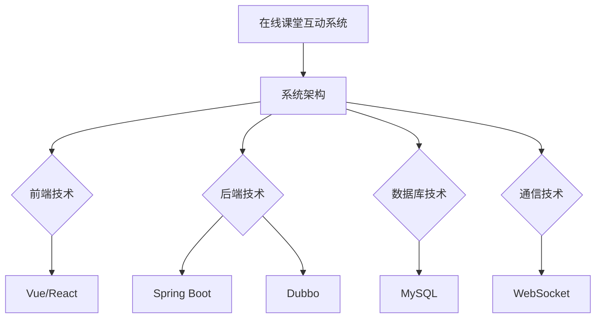

                 

关键词：猿辅导、在线课堂、互动系统、校招面试、技术经验、系统架构、算法应用、代码实战

> 摘要：本文将详细介绍作者在猿辅导2024年在线课堂互动系统校招面试中的经验，包括面试背景、准备过程、面试环节、技术深度分析、面试心得以及未来展望。通过本文，希望能为准备校招面试的同学们提供一些实用的指导和建议。

## 1. 背景介绍

猿辅导是一家专注于K12在线教育的公司，其在线课堂互动系统旨在为师生提供高效、互动的学习环境。2024年，猿辅导启动了新一轮的校园招聘，面向全国各大高校的计算机及相关专业学生。在线课堂互动系统作为公司核心产品之一，对校招面试的技术要求较高，尤其是对系统的架构设计、算法实现和代码质量等方面。

本文将分享作者在猿辅导2024在线课堂互动系统校招面试中的经验，从准备阶段到面试过程中的各个环节，全面分析面试技巧和技术深度，希望能够为即将参加校招的同学们提供一些有益的参考。

### 1.1 面试背景

- **面试形式**：在线面试，包括笔试和面试两个环节。
- **面试内容**：主要包括数据结构与算法、系统设计、编程实现、软件工程、数据库等方面。
- **面试官背景**：面试官主要来自猿辅导的资深工程师和技术领导，具备丰富的实战经验和面试官经验。

### 1.2 面试目标

- **技术能力**：评估应聘者的编程能力、系统设计和算法实现能力。
- **学习潜力**：观察应聘者对新技术、新领域的学习能力和解决问题的思路。
- **团队协作**：考察应聘者的沟通能力和团队合作精神。

## 2. 核心概念与联系

为了更好地理解猿辅导在线课堂互动系统的面试要点，我们首先需要了解几个核心概念：

### 2.1 在线课堂互动系统简介

- **系统架构**：在线课堂互动系统通常采用分层架构，包括前端、后端、数据库和通信层等。
- **主要功能**：实时音视频传输、互动白板、实时消息推送、作业提交与批改等。
- **技术选型**：前端可能使用Vue、React等框架，后端可能采用Spring Boot、Dubbo等框架。

### 2.2 数据结构与算法

- **常用数据结构**：数组、链表、栈、队列、二叉树、哈希表等。
- **算法分类**：排序算法、查找算法、图算法、动态规划等。

### 2.3 系统设计与架构

- **系统设计原则**：模块化、可扩展性、高性能、高可用性等。
- **架构模式**：MVC、MVVM、微服务、分布式架构等。

### 2.4 编程实践

- **代码规范**：命名规范、代码注释、错误处理等。
- **编程技巧**：数据结构与算法的运用、性能优化、内存管理等。

### 2.5 Mermaid 流程图



## 3. 核心算法原理 & 具体操作步骤

### 3.1 算法原理概述

在线课堂互动系统中的核心算法主要包括以下几个方面：

- **排序算法**：如快速排序、归并排序、堆排序等，用于对用户数据、作业结果等进行排序。
- **查找算法**：如二分查找、哈希查找等，用于快速定位用户、课程等信息。
- **图算法**：如最短路径算法、图遍历算法等，用于处理复杂的师生关系和课程安排。
- **动态规划**：用于优化算法的时间和空间复杂度，如优化作业提交与批改流程。

### 3.2 算法步骤详解

以排序算法为例，快速排序的步骤如下：

1. **选择基准元素**：从数组中选出一个元素作为基准元素。
2. **分区操作**：将数组划分为两个子数组，一个包含小于基准元素的元素，另一个包含大于基准元素的元素。
3. **递归排序**：对两个子数组分别进行快速排序。

### 3.3 算法优缺点

- **快速排序**：时间复杂度为 \(O(n\log n)\)，空间复杂度为 \(O(n)\)，在平均情况下性能较好。
- **归并排序**：时间复杂度为 \(O(n\log n)\)，空间复杂度为 \(O(n)\)，稳定性较好，但占用额外空间较多。
- **堆排序**：时间复杂度为 \(O(n\log n)\)，空间复杂度为 \(O(1)\)，但不稳定。

### 3.4 算法应用领域

- **排序算法**：广泛应用于各种数据处理场景，如在线课堂互动系统中的用户数据排序。
- **查找算法**：用于快速定位用户、课程等信息。
- **图算法**：用于处理复杂的师生关系和课程安排。
- **动态规划**：用于优化作业提交与批改流程。

## 4. 数学模型和公式 & 详细讲解 & 举例说明

在线课堂互动系统中的数学模型和公式主要用于优化算法、评估系统性能和保障数据安全等方面。以下是一些典型的数学模型和公式及其应用：

### 4.1 数学模型构建

- **用户行为分析模型**：通过收集用户行为数据，构建用户行为模型，用于预测用户兴趣和行为。
- **系统性能评估模型**：通过收集系统运行数据，构建系统性能评估模型，用于评估系统响应时间、吞吐量等指标。

### 4.2 公式推导过程

以用户行为分析模型中的用户兴趣度公式为例，其推导过程如下：

$$
兴趣度 = \frac{行为频次}{行为总数} \times \frac{行为时长}{总时长}
$$

其中，行为频次表示用户在一定时间范围内执行某一行为的次数，行为总数表示用户在一定时间范围内执行的所有行为的次数，行为时长表示用户执行某一行为的总时长，总时长表示用户在一定时间范围内的总时长。

### 4.3 案例分析与讲解

假设一个用户在一定时间范围内执行了10次课程学习行为，总时长为100分钟。其中，有5次学习行为是观看视频课程，总时长为50分钟；5次学习行为是完成作业，总时长为50分钟。根据上述用户兴趣度公式，可以计算出该用户的学习兴趣度如下：

$$
兴趣度 = \frac{10}{10} \times \frac{50}{100} = 0.5
$$

结果表明，该用户的学习兴趣度为50%，说明该用户在学习过程中表现出了中等程度的兴趣。

## 5. 项目实践：代码实例和详细解释说明

为了更好地展示猿辅导在线课堂互动系统的实际应用，以下是一个简单的代码实例，用于实现用户登录功能。

### 5.1 开发环境搭建

- **开发语言**：Java
- **开发工具**：IntelliJ IDEA
- **数据库**：MySQL
- **框架**：Spring Boot、MyBatis

### 5.2 源代码详细实现

以下是一个简单的用户登录功能的代码实现：

```java
@RestController
@RequestMapping("/user")
public class UserController {
    
    @Autowired
    private UserService userService;
    
    @PostMapping("/login")
    public ResponseEntity<String> login(@RequestBody LoginRequest request) {
        String username = request.getUsername();
        String password = request.getPassword();
        
        // 验证用户名和密码
        boolean isValid = userService.validateUser(username, password);
        
        if (isValid) {
            // 登录成功，返回登录成功信息
            return ResponseEntity.ok("登录成功");
        } else {
            // 登录失败，返回登录失败信息
            return ResponseEntity.badRequest().body("用户名或密码错误");
        }
    }
}
```

### 5.3 代码解读与分析

- **UserController**：控制器类，用于处理用户登录请求。
- **UserService**：服务类，用于执行用户验证逻辑。
- **LoginRequest**：请求类，用于接收用户登录请求参数。
- **validateUser()**：服务方法，用于验证用户名和密码。

该代码实现简单明了，主要逻辑是接收用户登录请求，调用服务层的方法进行用户验证，并根据验证结果返回相应的响应。

### 5.4 运行结果展示

当用户成功登录时，系统将返回登录成功信息，如下所示：

```
登录成功
```

当用户名或密码错误时，系统将返回登录失败信息，如下所示：

```
用户名或密码错误
```

## 6. 实际应用场景

猿辅导在线课堂互动系统在多个实际应用场景中发挥了重要作用，以下是一些典型的应用场景：

### 6.1 在线课程学习

- **课程内容展示**：在线课堂互动系统为用户提供了丰富的课程内容展示，包括视频课程、PPT课件、习题等。
- **实时互动**：用户可以在课程中进行互动，如提问、评论、打赏等。
- **作业提交与批改**：用户可以在课程结束后提交作业，教师可以实时批改作业并给出反馈。

### 6.2 在线考试与评测

- **在线考试**：在线课堂互动系统支持在线考试功能，用户可以在规定时间内完成考试。
- **实时评测**：考试结束后，系统会自动生成考试成绩，教师可以实时查看考试成绩并进行评估。

### 6.3 学习数据统计分析

- **学习数据收集**：在线课堂互动系统收集了用户的学习数据，如学习时长、学习行为等。
- **数据统计分析**：通过数据统计分析，可以了解用户的学习情况和效果，为教学提供参考。

## 7. 工具和资源推荐

为了更好地准备猿辅导在线课堂互动系统校招面试，以下是一些建议的学习资源和开发工具：

### 7.1 学习资源推荐

- **在线课程**：Coursera、edX、慕课网等平台提供了丰富的计算机专业课程，包括数据结构与算法、系统设计、软件工程等。
- **技术博客**：CSDN、博客园、掘金等平台上有大量的技术博客和经验分享，可以帮助你了解最新的技术动态和实战经验。
- **书籍推荐**：《算法导论》、《设计模式：可复用面向对象软件的基础》、《代码大全》等经典书籍。

### 7.2 开发工具推荐

- **开发环境**：IntelliJ IDEA、Visual Studio Code等强大的开发工具，可以提供高效的编码体验。
- **数据库工具**：MySQL Workbench、Navicat等数据库管理工具，可以方便地管理和维护数据库。
- **代码管理**：Git、GitHub等版本控制工具，可以帮助你管理代码版本和协作开发。

### 7.3 相关论文推荐

- **系统架构**：《大型分布式网站技术架构》、《微服务设计》等论文，详细介绍了系统架构的设计原则和实现方法。
- **算法应用**：《算法导论》、《算法与数据结构：Java语言描述》等论文，详细介绍了各种算法的应用场景和实现细节。

## 8. 总结：未来发展趋势与挑战

### 8.1 研究成果总结

猿辅导在线课堂互动系统通过多年的技术积累和研发，已经形成了一套成熟的技术架构和实现方案，为用户提供了高效、互动的学习环境。在数据结构、算法、系统设计等方面，公司取得了一系列研究成果，为在线教育领域的发展做出了积极贡献。

### 8.2 未来发展趋势

- **人工智能与教育的融合**：随着人工智能技术的发展，未来在线课堂互动系统将进一步融入人工智能技术，如智能问答、个性化推荐等，为用户提供更加智能化的学习体验。
- **5G技术的应用**：5G技术的普及将提高在线课堂互动系统的通信速度和稳定性，为实时互动和大规模在线课程提供更好的支持。
- **线上线下融合**：未来在线课堂互动系统将更加注重线上线下融合，为用户提供更加灵活的学习方式和更加丰富的教育资源。

### 8.3 面临的挑战

- **技术更新迭代**：随着技术的发展，在线课堂互动系统需要不断更新和迭代，以应对不断变化的市场需求和技术挑战。
- **用户体验优化**：在线课堂互动系统需要持续优化用户体验，提高用户满意度和粘性，以保持市场竞争力。
- **数据安全和隐私保护**：随着用户数据的不断增加，数据安全和隐私保护成为在线课堂互动系统面临的重要挑战。

### 8.4 研究展望

未来，猿辅导在线课堂互动系统将继续聚焦于技术创新和用户体验优化，积极探索人工智能、大数据、5G等新兴技术在线教育领域的应用。同时，公司也将加强与高校、研究机构的合作，推动在线教育领域的技术创新和产业发展。

## 9. 附录：常见问题与解答

### 9.1 如何准备猿辅导在线课堂互动系统校招面试？

**解答**：为了准备猿辅导在线课堂互动系统校招面试，你可以：

1. **了解公司背景和产品**：熟悉猿辅导的业务范围、产品特点和技术架构，以便在面试中展示出对公司的了解。
2. **掌握核心技术和算法**：深入学习数据结构、算法、系统设计等方面的知识，尤其是与在线教育相关的内容。
3. **编程实践**：通过编写实际代码，锻炼编程能力，提高代码质量。
4. **模拟面试**：找同学或朋友模拟面试场景，提前适应面试节奏和氛围。

### 9.2 如何在面试中展示技术深度？

**解答**：在面试中展示技术深度可以从以下几个方面入手：

1. **理论基础**：对所学的理论知识有深刻的理解和应用能力。
2. **实战经验**：通过实际项目经历，展示你在解决实际问题中的思路和方法。
3. **持续学习**：展示你对新技术的关注和学习能力，以及如何将新技术应用到实际问题中。
4. **逻辑思维**：通过清晰的表达和逻辑推理，展示你的技术理解和解决问题的能力。

### 9.3 如何应对面试中的压力和挑战？

**解答**：应对面试中的压力和挑战，你可以：

1. **保持冷静**：面试前做好充分准备，避免紧张和焦虑。
2. **积极沟通**：与面试官保持良好的沟通，确保理解问题的含义和面试官的期望。
3. **自信表达**：展示出你的自信和实力，同时也要保持谦虚和谨慎。
4. **合理求助**：如果在某些问题上不确定，可以适当地请教面试官，展示你的学习态度和求知欲。

### 9.4 如何评估面试结果？

**解答**：评估面试结果可以从以下几个方面入手：

1. **面试官反馈**：在面试结束后，关注面试官对你的评价和建议，了解自己的优点和不足。
2. **自我反思**：回顾整个面试过程，思考自己在哪些方面表现良好，哪些方面需要改进。
3. **知识储备**：反思自己的知识储备是否全面，是否需要进一步学习和提高。
4. **心态调整**：无论面试结果如何，都要保持积极的心态，总结经验教训，为下一次面试做好准备。

---

以上是关于猿辅导2024在线课堂互动系统校招面试经验的文章，希望对你有所帮助。在准备面试的过程中，不要忘记保持自信和积极的态度，相信自己的能力，祝你面试顺利！

