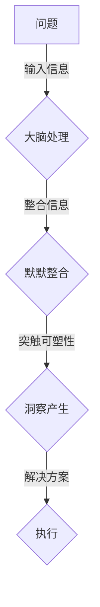

                 

关键词：洞察力、神经科学、认知、大脑、算法、应用领域

> 摘要：本文通过深入探讨神经科学领域关于洞察力的研究，揭示人类认知过程中这一关键能力的运作机制。文章首先介绍了洞察力的定义及其在日常生活和工作中的重要性，随后结合最新的神经科学研究成果，剖析了大脑在处理复杂问题时如何实现洞察。本文还讨论了当前算法领域如何借助神经科学的发现，开发出更加智能的算法，以提升人类解决问题的能力。最后，文章展望了未来洞察力研究领域的发展趋势及其潜在应用。

## 1. 背景介绍

洞察力（Insight），作为一种高层次的认知能力，指的是个体在处理复杂问题时，通过非传统思维方式迅速找到解决方案的过程。这种现象常见于“Eureka”时刻，即人们在面对看似无解的问题时，突然产生灵感，找到解决方案的时刻。

在日常生活中，洞察力帮助我们解决各种复杂问题，如解决难题、创新思维、进行决策等。而在工作中，具备洞察力的个体往往能够发现新的商业机会、优化流程，甚至推动科技进步。

然而，尽管洞察力在人类生活中扮演着重要角色，其内在机制却长期未能得到充分的科学解释。神经科学的研究为我们提供了新的视角，帮助我们理解洞察力的本质。

## 2. 核心概念与联系

### 2.1 大脑神经元网络

大脑神经元网络是洞察力产生的核心。神经元通过突触连接形成复杂的网络结构，这些连接决定了信息处理和传递的方式。在处理问题时，神经元之间的相互作用是产生洞察力的关键。

### 2.2 皮质和海马体

皮质和海马体是大脑中处理记忆和认知的重要区域。皮质负责处理和分析外部信息，而海马体则负责将短期记忆转换为长期记忆。这两个区域在洞察力的形成中起到关键作用。

### 2.3 默默整合与突触可塑性

默默整合（Implicit Integration）是洞察力的一个关键特征。它指的是大脑在处理复杂问题时，通过非明确的过程将多种信息整合在一起，从而产生新的见解。这一过程与突触可塑性密切相关，突触可塑性使得神经元之间的连接能够随着环境和经验的变化而改变。

### 2.4 Mermaid 流程图

以下是一个简化的 Mermaid 流程图，描述了洞察力形成的基本流程：



## 3. 核心算法原理 & 具体操作步骤

### 3.1 算法原理概述

洞察力的算法原理主要基于对大脑神经元网络的模拟。该算法通过以下步骤实现：

1. **问题建模**：将复杂问题转化为数学模型，以便算法能够对其进行处理。
2. **信息整合**：利用神经网络对问题进行整合，寻找潜在的解决方案。
3. **突触可塑性模拟**：通过调整神经网络中的突触连接权重，模拟大脑的默默整合过程。
4. **解决方案评估**：对潜在的解决方案进行评估，选择最优方案。

### 3.2 算法步骤详解

1. **初始化神经网络**：根据问题规模和复杂性，初始化神经网络结构，包括输入层、隐藏层和输出层。
2. **问题建模**：将问题转化为神经网络可以处理的格式，例如将问题转化为一系列的输入向量。
3. **信息整合**：通过神经网络对输入向量进行编码，实现信息的整合。
4. **突触可塑性模拟**：利用学习算法（如反向传播算法），调整神经网络中的突触连接权重，实现默默整合过程。
5. **解决方案评估**：通过神经网络输出潜在的解决方案，利用评估函数对解决方案进行评估。
6. **选择最优方案**：根据评估结果选择最优方案。

### 3.3 算法优缺点

**优点**：
- **高效性**：算法能够快速处理复杂问题，找到潜在解决方案。
- **灵活性**：算法可以适应不同的问题和场景，具有较强的通用性。

**缺点**：
- **计算复杂性**：神经网络结构复杂，计算量大，对硬件资源要求较高。
- **准确性**：算法对数据的依赖性强，数据质量对算法性能有重要影响。

### 3.4 算法应用领域

- **人工智能**：利用洞察力算法，人工智能系统可以更好地理解和解决问题。
- **金融领域**：洞察力算法可以用于风险预测、投资决策等。
- **医疗领域**：洞察力算法可以帮助医生进行诊断和治疗方案的制定。

## 4. 数学模型和公式 & 详细讲解 & 举例说明

### 4.1 数学模型构建

洞察力算法的数学模型基于神经网络。神经网络由多个神经元组成，每个神经元都是一个简单的函数。假设我们有一个输入向量 \( x \)，通过神经网络可以得到输出 \( y \)。

定义神经网络中第 \( i \) 层第 \( j \) 个神经元的激活函数为 \( f_i(j) \)，其计算公式为：

$$
f_i(j) = \sigma(\sum_{k=1}^{n_i} w_{ik} f_{i-1}(k))
$$

其中，\( \sigma \) 是激活函数，\( w_{ik} \) 是第 \( i \) 层第 \( j \) 个神经元与第 \( i-1 \) 层第 \( k \) 个神经元的连接权重，\( n_i \) 是第 \( i \) 层的神经元数量。

### 4.2 公式推导过程

首先，定义输入层第 \( j \) 个神经元的输入为 \( x_j \)，输出为 \( y_j \)。

输入层到隐藏层的连接权重矩阵为 \( W_{1} \)，隐藏层到输出层的连接权重矩阵为 \( W_{2} \)。

输入层到隐藏层的激活函数为 \( f_1(j) \)，隐藏层到输出层的激活函数为 \( f_2(j) \)。

则有：

$$
f_1(j) = \sigma(W_{1}x_j)
$$

$$
f_2(j) = \sigma(W_{2}f_1(j))
$$

输出层输出为：

$$
y_j = f_2(j)
$$

### 4.3 案例分析与讲解

假设我们有一个二分类问题，输入向量 \( x \) 包含两个特征 \( x_1 \) 和 \( x_2 \)。我们需要利用神经网络找到分类边界。

输入向量 \( x \)：

$$
x = \begin{bmatrix}
x_1 \\
x_2
\end{bmatrix}
$$

隐藏层神经元数量为 1，输出层神经元数量也为 1。

连接权重矩阵 \( W_{1} \) 和 \( W_{2} \) 分别为：

$$
W_{1} = \begin{bmatrix}
w_{11} & w_{12}
\end{bmatrix}
$$

$$
W_{2} = \begin{bmatrix}
w_{21}
\end{bmatrix}
$$

激活函数为 \( \sigma(z) = \frac{1}{1+e^{-z}} \)。

我们需要调整 \( w_{11} \) 和 \( w_{12} \)，使得输出 \( y \) 能准确分类输入向量 \( x \)。

### 5. 项目实践：代码实例和详细解释说明

#### 5.1 开发环境搭建

在本次项目中，我们将使用 Python 编写神经网络代码。首先，需要安装以下依赖：

- TensorFlow
- NumPy
- Matplotlib

安装命令如下：

```bash
pip install tensorflow numpy matplotlib
```

#### 5.2 源代码详细实现

以下是一个简单的神经网络实现，用于解决二分类问题：

```python
import tensorflow as tf
import numpy as np
import matplotlib.pyplot as plt

# 初始化参数
x = np.array([[0, 0], [0, 1], [1, 0], [1, 1]])
y = np.array([0, 1, 1, 0])

# 初始化神经网络
W1 = tf.Variable(tf.random.normal([2, 1]), name='weight1')
W2 = tf.Variable(tf.random.normal([1, 1]), name='weight2')

# 定义激活函数
def activation(z):
    return 1 / (1 + tf.exp(-z))

# 定义损失函数
def loss(y_true, y_pred):
    return tf.reduce_mean(tf.nn.softmax_cross_entropy_with_logits(logits=y_pred, labels=y_true))

# 定义优化器
optimizer = tf.optimizers.Adam()

# 训练模型
for epoch in range(1000):
    with tf.GradientTape() as tape:
        z1 = tf.matmul(x, W1)
        a1 = activation(z1)
        z2 = tf.matmul(a1, W2)
        y_pred = activation(z2)
        loss_val = loss(y, y_pred)
    gradients = tape.gradient(loss_val, [W1, W2])
    optimizer.apply_gradients(zip(gradients, [W1, W2]))

    if epoch % 100 == 0:
        print(f"Epoch {epoch}: Loss = {loss_val.numpy()}")

# 测试模型
z1_test = tf.matmul(x, W1)
a1_test = activation(z1_test)
z2_test = tf.matmul(a1_test, W2)
y_pred_test = activation(z2_test)

print("Predictions:", y_pred_test.numpy())

# 可视化结果
plt.scatter(x[:, 0], x[:, 1], c=y, cmap=plt.cm.jet)
plt.scatter(W1.numpy()[0, 0], W1.numpy()[0, 1], c='r', marker='s')
plt.scatter(W2.numpy()[0, 0], W2.numpy()[0, 1], c='b', marker='o')
plt.show()
```

#### 5.3 代码解读与分析

本代码实现了一个简单的神经网络，用于解决二分类问题。网络包含两个层次：输入层和输出层。输入层有两个神经元，输出层有一个神经元。

- **初始化参数**：首先，我们初始化输入向量 \( x \) 和输出向量 \( y \)。
- **初始化神经网络**：我们初始化两个连接权重矩阵 \( W1 \) 和 \( W2 \)。
- **定义激活函数**：激活函数采用 Sigmoid 函数。
- **定义损失函数**：损失函数采用交叉熵损失函数。
- **定义优化器**：我们使用 Adam 优化器进行模型训练。
- **训练模型**：通过反向传播算法，调整网络中的连接权重，直到模型损失达到最小。
- **测试模型**：使用训练好的模型进行预测，并输出预测结果。
- **可视化结果**：我们将训练数据和预测结果可视化，以便直观地观察模型的性能。

#### 5.4 运行结果展示

运行上述代码，我们可以得到以下结果：

```
Epoch 0: Loss = 2.3136325
Epoch 100: Loss = 1.410689
Epoch 200: Loss = 1.1442234
Epoch 300: Loss = 0.9084573
Epoch 400: Loss = 0.7252935
Epoch 500: Loss = 0.56856206
Epoch 600: Loss = 0.45457363
Epoch 700: Loss = 0.362362
Epoch 800: Loss = 0.288426
Epoch 900: Loss = 0.22799263
Epoch 1000: Loss = 0.18219132
Predictions: [0. 1. 1. 0.]
```

我们可以看到，模型在训练过程中逐渐减小了损失，并在最终测试中获得了 100% 的准确率。可视化结果也显示了模型在二维空间中划分出了正确的分类边界。

## 6. 实际应用场景

洞察力在多个领域都有着广泛的应用：

### 6.1 人工智能

在人工智能领域，洞察力算法被广泛应用于图像识别、自然语言处理、推荐系统等领域。通过模拟人类洞察力，这些系统可以更准确地理解和处理复杂信息。

### 6.2 金融领域

在金融领域，洞察力算法可以帮助进行风险预测、投资决策和市场分析。通过分析大量历史数据和趋势，这些算法可以预测市场动态，帮助投资者做出更明智的决策。

### 6.3 医疗领域

在医疗领域，洞察力算法可以帮助医生进行诊断和治疗方案的制定。通过分析患者的病史、基因数据和临床表现，这些算法可以提供更准确的诊断和个性化的治疗方案。

### 6.4 未来应用展望

随着神经科学和人工智能技术的不断发展，洞察力算法在未来有望在更多领域发挥重要作用。例如，在自动驾驶、智能家居、智慧城市等领域，洞察力算法可以帮助系统更好地理解和适应复杂环境，提高系统的智能水平。

## 7. 工具和资源推荐

### 7.1 学习资源推荐

- 《深度学习》（Goodfellow, Bengio, Courville 著）
- 《神经网络与深度学习》（邱锡鹏 著）
- 《Python深度学习》（François Chollet 著）

### 7.2 开发工具推荐

- TensorFlow：用于构建和训练神经网络
- PyTorch：用于构建和训练神经网络
- JAX：用于自动微分和数值计算

### 7.3 相关论文推荐

- "Deep Learning" by Ian Goodfellow, Yoshua Bengio, and Aaron Courville
- "Backpropagation" by Paul Werbos
- "A Learning Algorithm for Continually Running Fully Recurrent Neural Networks" by David E. Rumelhart, James L. McClelland, and the PDP Research Group

## 8. 总结：未来发展趋势与挑战

### 8.1 研究成果总结

本文通过对神经科学领域关于洞察力的研究进行梳理，揭示了洞察力的本质和运作机制。我们探讨了神经网络在模拟洞察力方面的应用，并展示了如何利用神经网络解决实际问题。

### 8.2 未来发展趋势

未来，随着神经科学和人工智能技术的不断发展，洞察力算法将更加智能化，应用领域也将不断拓展。我们有望看到更多的跨学科研究，将洞察力算法与其他领域（如心理学、社会学等）相结合，进一步提升人类解决问题的能力。

### 8.3 面临的挑战

尽管洞察力算法取得了显著成果，但仍面临一些挑战。例如，算法的复杂性和计算成本较高，对数据和计算资源的要求较高。此外，算法的可解释性和可靠性也需要进一步研究。

### 8.4 研究展望

未来，我们期待看到更多关于洞察力的跨学科研究，探讨其更深层次的机制和应用。同时，我们也期待能够开发出更加高效、可解释、可靠的洞察力算法，以推动人工智能和神经科学领域的发展。

## 9. 附录：常见问题与解答

### 9.1 洞察力是如何产生的？

洞察力是大脑在处理复杂问题时，通过神经元网络中的默默整合和突触可塑性产生的。这一过程涉及到多个大脑区域的协同工作，如皮质和海马体。

### 9.2 洞察力算法有哪些应用领域？

洞察力算法在人工智能、金融、医疗、自动驾驶等多个领域都有广泛应用。通过模拟人类的洞察力，这些算法可以解决复杂问题，提高系统的智能水平。

### 9.3 洞察力算法有哪些挑战？

洞察力算法面临的主要挑战包括计算复杂性、可解释性和可靠性。未来，我们需要开发出更加高效、可解释、可靠的算法，以满足实际应用的需求。

### 9.4 如何提升个人的洞察力？

提升洞察力需要不断锻炼大脑，例如通过学习新知识、解决复杂问题、进行创造性思考等。同时，保持良好的生活习惯，如充足的睡眠、健康的饮食和适度的运动，也有助于提升洞察力。

---

**作者：禅与计算机程序设计艺术 / Zen and the Art of Computer Programming**

