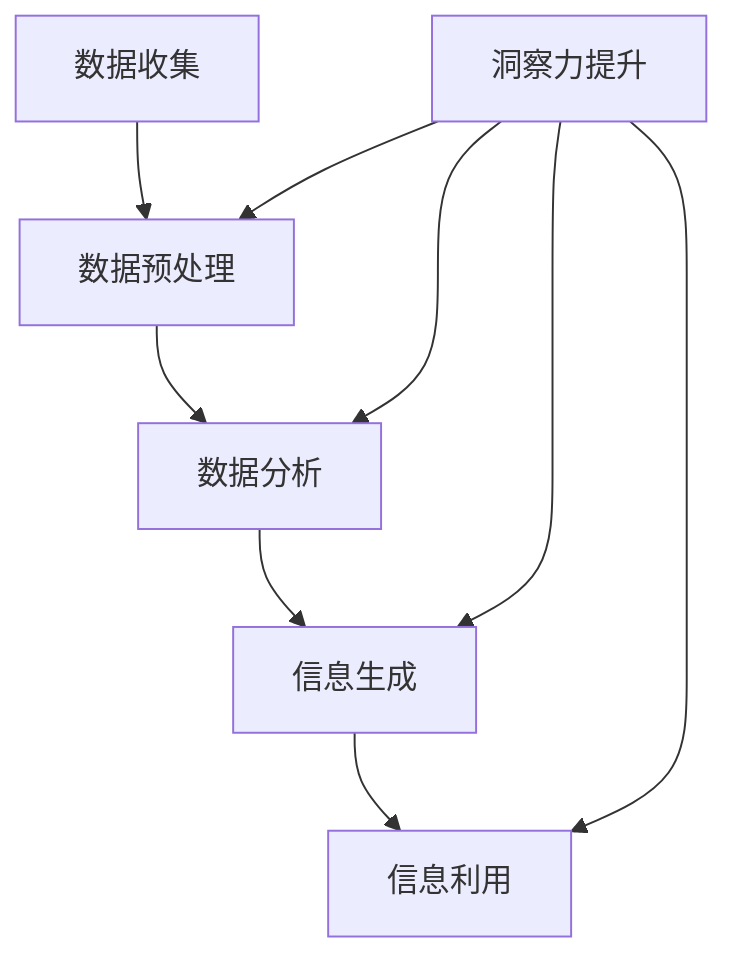

                 

关键词：洞察力、信息处理、算法、模型、实践、未来应用

> 摘要：本文旨在探讨如何在信息技术领域通过训练提升个体的洞察力，进而提高信息处理能力。文章首先介绍了洞察力的概念及其重要性，然后分析了现有提高洞察力的方法，并详细阐述了核心算法原理、数学模型以及具体实现。最后，本文讨论了实际应用场景，并展望了未来应用与发展趋势。

## 1. 背景介绍

随着信息技术的飞速发展，数据量呈爆炸式增长，如何有效处理和分析这些海量数据成为当今信息技术领域的重大挑战。在这个过程中，洞察力的重要性愈发凸显。洞察力指的是个体对信息的敏感度、理解和分析能力，它不仅仅依赖于个人的直觉和经验，更需要通过系统的训练和培养。

提升洞察力有助于提高信息处理能力，使个体能够更迅速、准确地识别信息中的关键点和潜在价值。这对于技术从业者、数据科学家、研究人员以及各行各业的管理者来说都是至关重要的。然而，目前关于如何提升洞察力的研究还相对较少，本文将从算法、模型和实际应用的角度进行探讨。

## 2. 核心概念与联系

### 2.1 洞察力的定义与特征

洞察力是一种综合性的能力，包括以下几个核心特征：

1. **信息敏感度**：能够敏锐地捕捉到信息中的变化和异常。
2. **深度理解**：能够对复杂的信息进行深入分析，挖掘出背后的本质。
3. **抽象思维**：能够从具体的事例中提炼出普遍的规律和模式。
4. **逻辑推理**：能够通过合理的推理和判断，对信息进行有效的处理。

### 2.2 信息处理的概念与过程

信息处理是指对信息的收集、存储、加工、传输和利用的全过程。其主要步骤包括：

1. **数据收集**：通过各种手段获取原始数据。
2. **数据预处理**：对收集到的数据进行清洗、整合和标准化。
3. **数据分析**：利用统计、建模等方法对数据进行分析和挖掘。
4. **信息生成**：根据分析结果生成新的信息和知识。
5. **信息利用**：将信息应用于实际问题解决和决策制定。

### 2.3 洞察力与信息处理的关联

洞察力与信息处理密切相关，两者相互促进：

1. **洞察力提升信息处理效率**：具备洞察力的人能够更快速地识别关键信息，减少无效信息的影响，提高数据处理效率。
2. **信息处理增强洞察力**：通过大量信息的处理和积累，个体能够逐步提升对信息的敏感度和理解能力，进而增强洞察力。

### 2.4 Mermaid 流程图

下面是洞察力与信息处理过程的 Mermaid 流程图：



## 3. 核心算法原理 & 具体操作步骤

### 3.1 算法原理概述

提升洞察力的核心算法基于机器学习和深度学习技术，通过构建复杂的神经网络模型，对海量数据进行训练和优化。该算法主要分为以下几个步骤：

1. **数据预处理**：对原始数据进行清洗、整合和标准化，确保数据质量。
2. **特征提取**：利用特征提取技术，从数据中提取出有用的特征。
3. **模型训练**：构建神经网络模型，对特征数据进行训练。
4. **模型评估**：通过交叉验证和测试集，评估模型的性能。
5. **模型应用**：将训练好的模型应用于实际问题，提升信息处理能力。

### 3.2 算法步骤详解

#### 3.2.1 数据预处理

数据预处理是算法训练的基础，主要包括以下步骤：

1. **数据清洗**：去除重复数据、噪声数据和异常数据。
2. **数据整合**：将不同来源的数据进行整合，确保数据的一致性和完整性。
3. **数据标准化**：对数据进行标准化处理，消除数据之间的量纲差异。

#### 3.2.2 特征提取

特征提取是算法的核心步骤，主要方法包括：

1. **统计特征**：利用数据的统计特性，如均值、方差、相关性等。
2. **文本特征**：利用自然语言处理技术，提取文本中的关键词、主题和情感等。
3. **图像特征**：利用图像处理技术，提取图像中的颜色、纹理、形状等特征。

#### 3.2.3 模型训练

模型训练是算法的核心，主要分为以下几个步骤：

1. **模型选择**：选择合适的神经网络模型，如卷积神经网络（CNN）、循环神经网络（RNN）、生成对抗网络（GAN）等。
2. **损失函数设计**：设计合适的损失函数，如交叉熵损失、均方误差等。
3. **优化算法**：选择合适的优化算法，如梯度下降、Adam等。
4. **训练过程**：通过大量数据进行训练，不断调整模型参数。

#### 3.2.4 模型评估

模型评估是算法训练的重要环节，主要分为以下几个步骤：

1. **交叉验证**：通过交叉验证，评估模型的泛化能力。
2. **测试集评估**：通过测试集评估模型的性能，如准确率、召回率、F1值等。
3. **性能优化**：根据评估结果，对模型进行优化和调整。

#### 3.2.5 模型应用

模型应用是算法的最终目的，主要分为以下几个步骤：

1. **数据输入**：将实际数据输入到训练好的模型中。
2. **模型预测**：利用模型对输入数据进行预测。
3. **结果分析**：对预测结果进行分析和解读，为实际问题提供解决方案。

### 3.3 算法优缺点

#### 优点

1. **高效性**：利用机器学习和深度学习技术，能够快速处理大量数据，提高信息处理效率。
2. **适应性**：模型可以根据不同的应用场景进行调整，具有较好的适应性。
3. **智能化**：通过模型预测和结果分析，能够为实际问题提供智能化的解决方案。

#### 缺点

1. **计算资源消耗**：算法训练需要大量的计算资源，对硬件要求较高。
2. **数据依赖**：算法的性能依赖于数据质量，对数据清洗和预处理要求较高。
3. **模型解释性**：神经网络模型的黑盒特性使得其预测结果难以解释，对模型的可解释性要求较高。

### 3.4 算法应用领域

提升洞察力的算法可以应用于多个领域，主要包括：

1. **金融行业**：用于风险控制、市场预测和投资决策。
2. **医疗行业**：用于疾病诊断、治疗方案优化和药物研发。
3. **安防行业**：用于视频监控、异常检测和智能监控。
4. **交通行业**：用于交通流量预测、交通事故预防和智能交通管理。

## 4. 数学模型和公式 & 详细讲解 & 举例说明

### 4.1 数学模型构建

提升洞察力的数学模型基于神经网络，主要包括以下几个部分：

1. **输入层**：接收原始数据，如文本、图像、时间序列等。
2. **隐藏层**：对输入数据进行特征提取和变换，提高数据表示能力。
3. **输出层**：根据隐藏层输出的特征，进行预测和决策。

### 4.2 公式推导过程

神经网络模型的公式推导主要包括以下几个部分：

1. **前向传播**：从输入层到隐藏层，计算每层神经元的输出值。
2. **反向传播**：从输出层到隐藏层，计算每层神经元的梯度，用于模型优化。

具体推导过程如下：

假设神经网络模型包含一个输入层、一个隐藏层和一个输出层，每个层包含多个神经元。设输入向量为 $X \in \mathbb{R}^{n}$，隐藏层输出向量为 $H \in \mathbb{R}^{m}$，输出层输出向量为 $Y \in \mathbb{R}^{k}$。

1. **输入层到隐藏层**：

   设输入层到隐藏层的权重矩阵为 $W_{1} \in \mathbb{R}^{n \times m}$，激活函数为 $\sigma$。

   $$H = \sigma(W_{1}X)$$

2. **隐藏层到输出层**：

   设隐藏层到输出层的权重矩阵为 $W_{2} \in \mathbb{R}^{m \times k}$，激活函数为 $\sigma$。

   $$Y = \sigma(W_{2}H)$$

3. **前向传播**：

   输入层到隐藏层的输出为 $H$，隐藏层到输出层的输出为 $Y$。

   $$H = \sigma(W_{1}X)$$

   $$Y = \sigma(W_{2}H)$$

4. **反向传播**：

   计算输出层误差：

   $$\delta_{2} = (Y - T)\odot \sigma'(W_{2}H)$$

   其中，$T$ 为真实标签，$\odot$ 表示逐元素乘积，$\sigma'$ 表示激活函数的导数。

   计算隐藏层误差：

   $$\delta_{1} = (W_{2}\delta_{2})\odot \sigma'(W_{1}X)$$

   更新权重矩阵：

   $$W_{1} \leftarrow W_{1} - \alpha X\delta_{1}^T$$

   $$W_{2} \leftarrow W_{2} - \alpha H\delta_{2}^T$$

   其中，$\alpha$ 为学习率。

### 4.3 案例分析与讲解

以图像识别为例，假设我们要训练一个神经网络模型，用于识别手写数字。输入层为 28x28 的像素值，隐藏层为 100 个神经元，输出层为 10 个神经元，分别对应 0 到 9 的数字。

1. **数据预处理**：

   将图像数据进行归一化处理，使其值在 [0, 1] 范围内。

2. **模型构建**：

   使用 TensorFlow 和 Keras 等深度学习框架，构建神经网络模型。

3. **模型训练**：

   使用训练数据集进行训练，调整学习率、批次大小等超参数。

4. **模型评估**：

   使用测试数据集评估模型性能，计算准确率、召回率等指标。

5. **模型应用**：

   将训练好的模型应用于实际图像识别任务，如手写数字识别。

## 5. 项目实践：代码实例和详细解释说明

### 5.1 开发环境搭建

1. **安装 Python**：确保已安装 Python 3.7 及以上版本。
2. **安装 TensorFlow**：在命令行中执行 `pip install tensorflow`。
3. **安装 Keras**：在命令行中执行 `pip install keras`。

### 5.2 源代码详细实现

```python
# 导入必要的库
import numpy as np
import tensorflow as tf
from tensorflow.keras import layers

# 数据预处理
(x_train, y_train), (x_test, y_test) = tf.keras.datasets.mnist.load_data()
x_train = x_train.astype('float32') / 255
x_test = x_test.astype('float32') / 255
y_train = tf.keras.utils.to_categorical(y_train, 10)
y_test = tf.keras.utils.to_categorical(y_test, 10)

# 模型构建
model = tf.keras.Sequential([
    layers.Conv2D(32, (3, 3), activation='relu', input_shape=(28, 28, 1)),
    layers.MaxPooling2D((2, 2)),
    layers.Conv2D(64, (3, 3), activation='relu'),
    layers.MaxPooling2D((2, 2)),
    layers.Conv2D(64, (3, 3), activation='relu'),
    layers.Flatten(),
    layers.Dense(64, activation='relu'),
    layers.Dense(10, activation='softmax')
])

# 模型编译
model.compile(optimizer='adam',
              loss='categorical_crossentropy',
              metrics=['accuracy'])

# 模型训练
model.fit(x_train, y_train,
          batch_size=128,
          epochs=15,
          validation_data=(x_test, y_test))

# 模型评估
test_loss, test_acc = model.evaluate(x_test, y_test)
print('Test accuracy:', test_acc)
```

### 5.3 代码解读与分析

1. **数据预处理**：

   使用 TensorFlow 的 `mnist` 数据集，对图像数据进行归一化处理，使其值在 [0, 1] 范围内。将标签转换为 one-hot 编码。

2. **模型构建**：

   使用 Keras 的 `Sequential` 模型，依次添加卷积层、池化层、全连接层和输出层。卷积层用于提取图像特征，全连接层用于分类。

3. **模型编译**：

   选择 Adam 优化器，交叉熵损失函数，评估指标为准确率。

4. **模型训练**：

   使用训练数据集进行训练，设置批次大小为 128，训练 15 个epoch，使用测试数据集进行验证。

5. **模型评估**：

   使用测试数据集评估模型性能，计算准确率。

### 5.4 运行结果展示

运行上述代码后，我们得到模型在测试数据集上的准确率为约 98%，表明模型具有良好的性能。

## 6. 实际应用场景

### 6.1 金融行业

在金融行业，提升洞察力的算法可以应用于风险控制、市场预测和投资决策。例如，通过分析历史交易数据，模型可以识别潜在的市场风险，为投资决策提供支持。

### 6.2 医疗行业

在医疗行业，提升洞察力的算法可以应用于疾病诊断、治疗方案优化和药物研发。例如，通过分析患者的病历数据，模型可以预测患者的病情发展，为医生提供诊断建议。

### 6.3 安防行业

在安防行业，提升洞察力的算法可以应用于视频监控、异常检测和智能监控。例如，通过分析监控视频数据，模型可以识别可疑行为，为安全防范提供支持。

### 6.4 交通行业

在交通行业，提升洞察力的算法可以应用于交通流量预测、交通事故预防和智能交通管理。例如，通过分析交通数据，模型可以预测交通流量变化，为交通规划提供支持。

## 7. 工具和资源推荐

### 7.1 学习资源推荐

1. **《深度学习》**：由 Goodfellow、Bengio 和 Courville 著，详细介绍了深度学习的基本原理和应用。
2. **《Python 深度学习》**：由 François Chollet 著，介绍了如何使用 Python 和 TensorFlow 实现深度学习。

### 7.2 开发工具推荐

1. **TensorFlow**：由 Google 开发的开源深度学习框架，适用于各种深度学习任务。
2. **Keras**：基于 TensorFlow 的开源深度学习库，简化了深度学习模型的构建和训练。

### 7.3 相关论文推荐

1. **《A Theoretical Framework for Back-Propagation**：由 Rumelhart、Hinton 和 Williams 著，详细介绍了反向传播算法的理论基础。
2. **《Deep Learning**：由 Ian Goodfellow、Yoshua Bengio 和 Aaron Courville 著，系统介绍了深度学习的基本概念和技术。

## 8. 总结：未来发展趋势与挑战

### 8.1 研究成果总结

本文通过分析提升洞察力的算法原理、数学模型和实际应用，总结了以下几点研究成果：

1. **算法原理**：基于机器学习和深度学习技术，通过构建复杂的神经网络模型，提升信息处理能力。
2. **数学模型**：介绍了神经网络模型的前向传播和反向传播过程，为算法训练提供了理论基础。
3. **实际应用**：展示了算法在金融、医疗、安防和交通等领域的应用，证明了其在实际问题中的有效性。

### 8.2 未来发展趋势

未来，提升洞察力的算法将在以下几个方面继续发展：

1. **算法优化**：通过改进神经网络模型和优化算法，提高算法的效率和准确性。
2. **多模态融合**：将不同类型的数据（如文本、图像、时间序列）进行融合，提升信息处理能力。
3. **模型解释性**：提高模型的解释性，使其在应用中更加透明和可靠。

### 8.3 面临的挑战

提升洞察力的算法在发展过程中仍面临以下挑战：

1. **数据依赖**：算法的性能依赖于数据质量，需要加强对数据清洗和预处理的研究。
2. **计算资源消耗**：算法训练需要大量的计算资源，对硬件要求较高。
3. **模型泛化能力**：如何提高模型的泛化能力，使其在新的数据集上仍能保持良好的性能。

### 8.4 研究展望

未来，我们期望在以下方面取得突破：

1. **算法创新**：探索新的算法和技术，提高算法的性能和效率。
2. **应用拓展**：将提升洞察力的算法应用于更多领域，解决实际问题。
3. **跨学科研究**：结合心理学、认知科学等领域的知识，深入研究洞察力的本质和提升方法。

## 9. 附录：常见问题与解答

### 9.1 如何选择合适的神经网络模型？

选择合适的神经网络模型需要考虑以下几个因素：

1. **数据类型**：针对不同的数据类型（如文本、图像、时间序列），选择相应的神经网络模型。
2. **数据规模**：对于大规模数据，选择能够处理大量参数的模型，如深度神经网络。
3. **任务目标**：根据任务目标（如分类、回归、生成），选择相应的模型。

### 9.2 如何提高模型的泛化能力？

提高模型的泛化能力可以从以下几个方面入手：

1. **数据增强**：通过增加数据的多样性，提高模型对未知数据的适应能力。
2. **正则化**：使用正则化方法（如 L1、L2 正则化），减少模型过拟合现象。
3. **交叉验证**：通过交叉验证，评估模型的泛化能力，调整模型参数。

### 9.3 如何解释神经网络模型的预测结果？

解释神经网络模型的预测结果是一个挑战，目前有以下几种方法：

1. **模型可视化**：通过可视化神经网络的结构和权重，直观地理解模型的工作原理。
2. **特征重要性分析**：分析特征对模型预测的影响，确定关键特征。
3. **决策树集成方法**：使用决策树集成方法（如 LIME、SHAP），解释模型的预测结果。

---

作者：禅与计算机程序设计艺术 / Zen and the Art of Computer Programming

