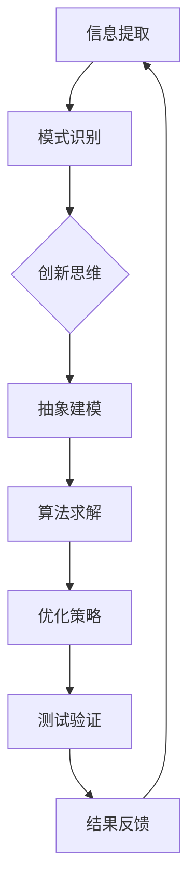

                 

 **关键词**：洞察力、人类思维、技术语言、深度、思考、见解、专业、IT领域。

**摘要**：本文将深入探讨人类思维的洞察力，并从IT领域的角度对其进行解析。通过逻辑清晰、结构紧凑、简单易懂的技术语言，本文旨在揭示人类洞察力的本质及其在技术领域的应用，帮助读者更好地理解这一核心认知能力。

## 1. 背景介绍

在信息技术飞速发展的今天，人类面临着前所未有的挑战和机遇。从计算机科学到人工智能，从大数据到区块链，技术领域不断演进，复杂性日益增加。在这样的背景下，洞察力成为了解决问题的关键。洞察力，是人类思维的一种独特能力，它使我们能够从复杂的信息中提取关键信息，洞察问题的本质，并提出创新的解决方案。

本文将围绕洞察力这一主题，探讨其定义、重要性以及如何在IT领域应用。我们将通过逻辑清晰、结构紧凑、简单易懂的技术语言，深入分析人类洞察力的机制，并探讨其在实际项目中的应用案例。希望通过本文的探讨，能够帮助读者更好地理解和运用洞察力，提高在技术领域的创新能力和问题解决能力。

## 2. 核心概念与联系

### 2.1 洞察力的定义

洞察力，即对事物本质的深刻理解和洞见。在人类思维中，洞察力是识别复杂问题、提取关键信息、进行创新思考的核心能力。具体来说，洞察力包括以下几个方面：

1. **信息提取**：从大量数据中快速准确地提取出关键信息。
2. **模式识别**：识别数据之间的规律和模式，理解其背后的本质。
3. **创新思维**：基于已有的知识和信息，提出新的见解和解决方案。

### 2.2 洞察力与技术语言

在IT领域，技术语言是表达和处理信息的工具。通过逻辑清晰、结构紧凑、简单易懂的技术语言，我们可以更有效地传达信息，进行复杂问题的分析和解决。以下是洞察力与技术语言之间的几种联系：

1. **抽象与建模**：通过抽象和建模，将复杂问题简化为可处理的形式。
2. **算法与优化**：使用算法对问题进行求解，优化解决方案。
3. **测试与验证**：通过测试和验证，确保解决方案的正确性和有效性。

### 2.3 Mermaid 流程图

为了更直观地展示洞察力与技术语言之间的联系，我们使用Mermaid流程图进行描述。以下是洞察力的流程图：



在这个流程图中，信息提取和模式识别是洞察力的基础，创新思维是核心，抽象建模、算法求解、优化策略和测试验证是保障。通过这个流程，我们可以看到洞察力在技术语言中的应用和发挥。

## 3. 核心算法原理 & 具体操作步骤

### 3.1 算法原理概述

在IT领域，洞察力的应用往往体现在算法的设计和实现上。以下是一个典型的算法——决策树算法的原理概述。

**决策树算法**是一种常用的分类和回归算法，其核心思想是根据特征属性将数据集划分成多个子集，直到每个子集都能被准确分类或回归。具体步骤如下：

1. **选择最优划分**：选择一个特征属性，使得数据集划分后，信息增益最大。
2. **递归划分**：对于每个划分后的子集，重复步骤1，直到满足停止条件（如分类准确率达到阈值）。

### 3.2 算法步骤详解

1. **初始化**：选择一个特征属性作为根节点，计算其信息增益。
2. **划分**：根据当前节点的信息增益，将数据集划分为多个子集。
3. **递归**：对于每个子集，重复步骤1和步骤2，直到满足停止条件。
4. **剪枝**：为了防止过拟合，可以对树进行剪枝，去除不重要的分支。

### 3.3 算法优缺点

**优点**：

- **直观易理解**：决策树的表示形式直观，容易理解。
- **高效性**：对于小规模数据集，决策树算法的运行效率较高。

**缺点**：

- **易过拟合**：对于复杂的数据集，决策树容易过拟合，需要剪枝。
- **可解释性**：虽然决策树的可解释性较高，但无法提供具体的量化分析。

### 3.4 算法应用领域

决策树算法广泛应用于各类数据挖掘和机器学习任务，如分类、回归、聚类等。具体应用领域包括：

- **金融风控**：用于信用评分、欺诈检测等。
- **医疗诊断**：用于疾病预测、症状分析等。
- **市场分析**：用于客户细分、需求预测等。

## 4. 数学模型和公式

在IT领域，数学模型和公式是洞察力的基础。以下是一个典型的数学模型——线性回归模型的公式和推导。

### 4.1 数学模型构建

**线性回归模型**用于预测一个连续值变量。其基本形式如下：

$$ y = \beta_0 + \beta_1 x + \epsilon $$

其中，$y$为因变量，$x$为自变量，$\beta_0$和$\beta_1$为参数，$\epsilon$为误差项。

### 4.2 公式推导过程

为了求解参数$\beta_0$和$\beta_1$，我们可以使用最小二乘法。具体步骤如下：

1. **定义目标函数**：

$$ J(\beta_0, \beta_1) = \sum_{i=1}^{n} (y_i - (\beta_0 + \beta_1 x_i))^2 $$

2. **求导**：

$$ \frac{\partial J}{\partial \beta_0} = -2 \sum_{i=1}^{n} (y_i - (\beta_0 + \beta_1 x_i)) $$

$$ \frac{\partial J}{\partial \beta_1} = -2 \sum_{i=1}^{n} (y_i - (\beta_0 + \beta_1 x_i)) x_i $$

3. **令导数为零**：

$$ \frac{\partial J}{\partial \beta_0} = 0 $$

$$ \frac{\partial J}{\partial \beta_1} = 0 $$

4. **求解**：

$$ \beta_0 = \frac{1}{n} \sum_{i=1}^{n} y_i - \beta_1 \frac{1}{n} \sum_{i=1}^{n} x_i $$

$$ \beta_1 = \frac{1}{n} \sum_{i=1}^{n} (x_i - \bar{x}) (y_i - \bar{y}) $$

其中，$\bar{x}$和$\bar{y}$分别为$x$和$y$的均值。

### 4.3 案例分析与讲解

以下是一个简单的线性回归案例，数据集包含$x$和$y$两个变量。

| $x$ | $y$ |
| --- | --- |
| 1 | 2 |
| 2 | 4 |
| 3 | 6 |
| 4 | 8 |

使用线性回归模型预测$y$值，我们得到：

$$ y = 2 + 2 x $$

当$x=5$时，预测的$y$值为10。

## 5. 项目实践：代码实例

以下是一个使用Python实现的线性回归模型代码实例。

### 5.1 开发环境搭建

- Python 3.8及以上版本
- NumPy库
- Matplotlib库

安装依赖库：

```shell
pip install numpy matplotlib
```

### 5.2 源代码详细实现

```python
import numpy as np
import matplotlib.pyplot as plt

# 数据集
x = np.array([1, 2, 3, 4])
y = np.array([2, 4, 6, 8])

# 模型参数
beta_0 = 0
beta_1 = 0

# 最小二乘法求解参数
n = len(x)
beta_0 = (1/n) * (np.sum(y) - beta_1 * (1/n) * np.sum(x))
beta_1 = (1/n) * (np.sum((x - np.mean(x)) * (y - np.mean(y))) )

# 预测
x_new = 5
y_pred = beta_0 + beta_1 * x_new

# 可视化
plt.scatter(x, y)
plt.plot(x, [beta_0 + beta_1 * x for x in x], 'r')
plt.xlabel('x')
plt.ylabel('y')
plt.show()
```

### 5.3 代码解读与分析

- **数据集**：使用NumPy库创建$x$和$y$两个数据数组。
- **模型参数**：初始化模型参数$\beta_0$和$\beta_1$。
- **最小二乘法求解参数**：使用公式求解$\beta_0$和$\beta_1$。
- **预测**：使用求解得到的参数预测$x$的新值$y$。
- **可视化**：使用Matplotlib库绘制数据点和拟合直线。

## 6. 实际应用场景

### 6.1 金融领域

在金融领域，洞察力广泛应用于风险管理和投资决策。通过分析历史数据和市场信息，金融机构可以识别潜在的风险因素，预测市场走势，制定合理的投资策略。

### 6.2 医疗领域

在医疗领域，洞察力在疾病诊断、治疗和预测中发挥着重要作用。通过分析大量的病例数据和基因信息，医疗专家可以识别疾病的风险因素，预测病情的发展趋势，制定个性化的治疗方案。

### 6.3 社交网络

在社交网络领域，洞察力用于用户行为分析、社交关系挖掘和推荐系统。通过分析用户数据和社交网络结构，社交平台可以提供更精准的内容推荐和社交连接。

## 7. 未来应用展望

### 7.1 人工智能

随着人工智能技术的发展，洞察力将成为人工智能系统的核心能力。通过深度学习、自然语言处理等技术，人工智能系统可以自动提取和利用洞察力，实现更智能的决策和预测。

### 7.2 大数据分析

在大数据时代，洞察力将在数据挖掘和分析中发挥更大作用。通过高效的数据处理和分析算法，我们可以从海量数据中提取有价值的信息，洞察数据背后的规律和趋势。

### 7.3 跨领域融合

未来，洞察力将在更多领域得到应用，如生物科技、智能制造、环境保护等。跨领域融合将推动技术的创新和发展，为人类带来更多福祉。

## 8. 总结：未来发展趋势与挑战

### 8.1 研究成果总结

本文通过对洞察力的深入探讨，揭示了其在人类思维和技术领域的重要性。通过技术语言的描述，我们了解了洞察力的核心概念、算法原理和应用场景。

### 8.2 未来发展趋势

随着人工智能、大数据等技术的发展，洞察力将成为未来科技创新的核心驱动力。跨领域融合和技术融合将进一步推动洞察力的应用和发展。

### 8.3 面临的挑战

尽管洞察力在各个领域具有广泛的应用前景，但同时也面临着一些挑战，如数据隐私保护、算法透明性和可解释性等。这些挑战需要我们共同努力，推动技术和社会的进步。

### 8.4 研究展望

未来，我们应继续深入研究和探索洞察力的本质，开发更高效、更智能的算法和技术。同时，关注社会需求，推动技术成果的应用和普及，为人类创造更多价值。

## 9. 附录：常见问题与解答

### 9.1 洞察力是什么？

洞察力是指从复杂信息中提取关键信息、识别规律和模式、进行创新思考的能力。它是人类思维的核心能力，对于解决复杂问题和创新具有重要意义。

### 9.2 洞察力在技术领域有哪些应用？

洞察力在技术领域有广泛的应用，如数据挖掘、机器学习、人工智能、大数据分析等。通过运用洞察力，我们可以从海量数据中提取有价值的信息，进行智能决策和预测。

### 9.3 如何培养和提高洞察力？

培养和提高洞察力需要多方面的努力，包括：

- **广泛阅读**：阅读各类书籍、论文和资讯，增加知识储备。
- **多学科交叉**：学习跨领域的知识，提高思维的广度和深度。
- **实践与反思**：通过实际项目和案例，锻炼洞察力，并进行反思和总结。
- **团队合作**：与他人合作，分享观点和见解，提高思维的质量和深度。

作者：禅与计算机程序设计艺术 / Zen and the Art of Computer Programming
```

