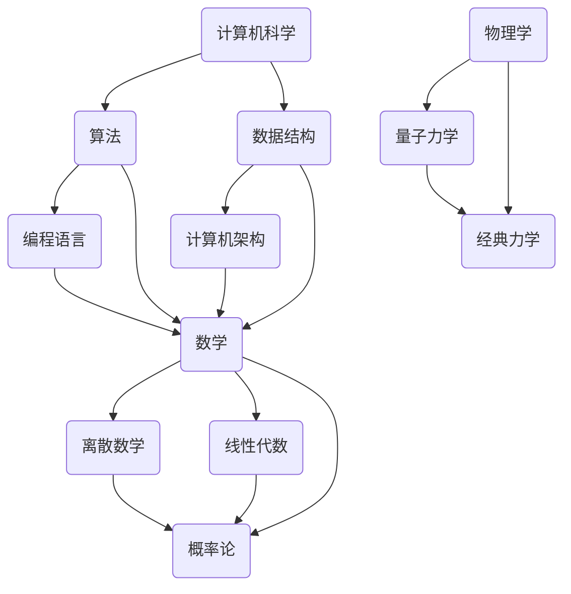

                 

关键词：跨学科视角、理解的多维性、人工智能、计算机科学、技术融合

> 摘要：本文旨在探讨在技术飞速发展的时代，理解的多维性及其在跨学科视角中的重要性。通过深入分析计算机科学、数学、物理学等多个领域的理论和技术，本文揭示了跨学科视角在推动技术进步和解决问题中的关键作用，并提出了未来发展的方向和建议。

## 1. 背景介绍

随着科技的迅猛发展，各个学科之间的边界逐渐模糊，跨学科研究成为推动科技进步的重要力量。传统的学科划分已经无法满足复杂问题的解决需求，跨学科视角成为了解决当前技术难题的必要手段。计算机科学作为现代科技的基石，其发展离不开其他学科的支撑和启示。因此，理解的多维性在计算机科学中的应用显得尤为重要。

本文将从以下几个方面展开讨论：

1. **核心概念与联系**：介绍计算机科学、数学、物理学等领域的核心概念及其相互联系。
2. **核心算法原理 & 具体操作步骤**：详细阐述跨学科视角下的核心算法原理及其应用。
3. **数学模型和公式 & 详细讲解 & 举例说明**：分析数学模型在跨学科研究中的应用及其推导过程。
4. **项目实践：代码实例和详细解释说明**：通过实际项目展示跨学科视角在技术实现中的具体应用。
5. **实际应用场景**：探讨跨学科视角在现实世界中的应用案例。
6. **未来应用展望**：分析跨学科视角在未来的发展趋势和潜在挑战。
7. **工具和资源推荐**：推荐相关学习资源、开发工具和论文，以供读者进一步学习。
8. **总结：未来发展趋势与挑战**：总结研究成果，展望未来发展方向。

## 2. 核心概念与联系

在探讨跨学科视角的重要性之前，我们需要明确几个核心概念及其相互联系。以下是计算机科学、数学和物理学等领域的核心概念及其Mermaid流程图：



从上述流程图中，我们可以看出计算机科学、数学和物理学等领域的核心概念之间存在紧密的联系。例如，算法设计中的许多概念源自数学，而计算机架构的优化则受到经典力学的启发。以下是对每个核心概念的简要介绍：

### 计算机科学

计算机科学是研究计算机及其相关技术的学科，包括算法、数据结构、编程语言、计算机架构等方面。算法是计算机科学的核心，其研究内容包括算法设计、分析、优化等。数据结构则是算法实现的基础，涉及到数据在计算机中的存储和操作方法。编程语言是计算机科学的重要组成部分，不同的编程语言适用于不同的应用场景。计算机架构则关注计算机系统的整体设计，包括硬件和软件的协同工作。

### 数学

数学是研究数量、结构、变化和空间等概念的学科，为计算机科学提供了强大的理论基础。离散数学是计算机科学中应用最广泛的数学分支，涉及到逻辑、集合、图论等概念。线性代数则主要研究向量空间和线性变换，在算法优化和数据分析中具有重要应用。概率论则是研究随机现象的数学分支，对于人工智能和机器学习等领域具有重要意义。

### 物理学

物理学是研究自然界物质和能量及其相互作用的学科，对计算机科学产生了深远影响。量子力学是物理学的一个重要分支，其量子计算模型为计算机科学带来了全新的思考方向。经典力学则研究宏观物体的运动规律，对计算机架构和算法优化具有重要启示。

## 3. 核心算法原理 & 具体操作步骤

在理解了核心概念和相互联系之后，我们将探讨跨学科视角下的核心算法原理及其具体操作步骤。以下是一个典型的跨学科算法——神经网络：

### 3.1 算法原理概述

神经网络是一种模拟人脑神经元结构和功能的计算模型，具有高度并行处理能力和自适应学习能力。神经网络由大量相互连接的神经元组成，每个神经元都是一个简单的计算单元，通过输入层、隐藏层和输出层进行信息传递和处理。神经网络的训练过程包括前向传播、反向传播和梯度下降等步骤。

### 3.2 算法步骤详解

1. **初始化参数**：为神经网络初始化权重和偏置。
2. **前向传播**：根据输入数据，通过前向传播计算输出结果。
3. **计算损失函数**：根据实际输出和预期输出，计算损失函数的值。
4. **反向传播**：利用链式法则计算损失函数关于每个神经元的梯度。
5. **更新参数**：根据梯度下降法更新网络参数。
6. **重复步骤2-5**：直到达到预设的训练目标或收敛条件。

### 3.3 算法优缺点

**优点**：

1. **高度并行处理能力**：神经网络具有高度并行处理能力，适合处理大规模数据。
2. **自适应学习能力**：神经网络能够通过不断调整参数，适应不同的数据分布和任务需求。
3. **强大的泛化能力**：神经网络具有强大的泛化能力，能够应用于各种领域的问题。

**缺点**：

1. **计算复杂度高**：神经网络训练过程需要大量的计算资源，尤其是深度神经网络。
2. **对数据质量要求高**：神经网络对训练数据的质量有较高要求，否则容易出现过拟合现象。
3. **参数调整复杂**：神经网络参数调整过程较为复杂，需要大量的实验和调优。

### 3.4 算法应用领域

神经网络在计算机科学和人工智能领域具有广泛的应用。例如，在图像识别、语音识别、自然语言处理、推荐系统等任务中，神经网络都能够取得显著的性能提升。此外，神经网络还可以应用于金融、医疗、交通等领域的决策支持系统。

## 4. 数学模型和公式 & 详细讲解 & 举例说明

在跨学科研究中，数学模型和公式扮演着至关重要的角色。以下是一个经典的数学模型——线性回归：

### 4.1 数学模型构建

线性回归模型假设目标变量 \(Y\) 与自变量 \(X\) 之间存在线性关系，即：

$$Y = \beta_0 + \beta_1 X + \varepsilon$$

其中，\(\beta_0\) 和 \(\beta_1\) 分别为模型的参数，\(\varepsilon\) 为误差项。

### 4.2 公式推导过程

为了求解模型参数 \(\beta_0\) 和 \(\beta_1\)，我们可以使用最小二乘法。最小二乘法的目标是最小化误差项 \(\varepsilon\) 的平方和：

$$\min_{\beta_0, \beta_1} \sum_{i=1}^n (Y_i - (\beta_0 + \beta_1 X_i))^2$$

对上式求导并令导数为零，可以得到参数的估计值：

$$\beta_0 = \frac{1}{n} \sum_{i=1}^n Y_i - \beta_1 \frac{1}{n} \sum_{i=1}^n X_i$$

$$\beta_1 = \frac{1}{n} \sum_{i=1}^n (X_i - \bar{X}) (Y_i - \bar{Y})$$

其中，\(\bar{X}\) 和 \(\bar{Y}\) 分别为 \(X\) 和 \(Y\) 的平均值。

### 4.3 案例分析与讲解

假设我们有一组数据：

$$\begin{aligned}
X &= [1, 2, 3, 4, 5] \\
Y &= [2, 4, 5, 4, 5]
\end{aligned}$$

根据上述线性回归模型，我们可以求解出参数：

$$\begin{aligned}
\beta_0 &= \frac{1}{5} (2 + 4 + 5 + 4 + 5) - \frac{1}{5} (1 + 2 + 3 + 4 + 5) \beta_1 \\
\beta_1 &= \frac{1}{5} [(1 - 3)(2 - 4) + (2 - 3)(4 - 4) + (3 - 3)(5 - 4) + (4 - 3)(4 - 4) + (5 - 3)(5 - 4)]
\end{aligned}$$

计算结果为：

$$\begin{aligned}
\beta_0 &= 3.2 \\
\beta_1 &= 0.8
\end{aligned}$$

因此，线性回归模型为：

$$Y = 3.2 + 0.8X$$

根据这个模型，我们可以预测新的数据点。例如，当 \(X = 6\) 时，\(Y\) 的预测值为：

$$Y = 3.2 + 0.8 \times 6 = 6.8$$

## 5. 项目实践：代码实例和详细解释说明

在本节中，我们将通过一个实际项目——基于深度学习的图像识别项目，展示跨学科视角在技术实现中的具体应用。

### 5.1 开发环境搭建

为了实现这个项目，我们需要搭建一个开发环境。以下是具体的步骤：

1. 安装Python 3.8及以上版本。
2. 安装TensorFlow库，可以使用pip命令：`pip install tensorflow`。
3. 安装其他必要的依赖库，如NumPy、Pandas等。

### 5.2 源代码详细实现

以下是该项目的主要源代码：

```python
import tensorflow as tf
from tensorflow.keras.models import Sequential
from tensorflow.keras.layers import Dense, Conv2D, Flatten, MaxPooling2D

# 数据预处理
(x_train, y_train), (x_test, y_test) = tf.keras.datasets.mnist.load_data()
x_train = x_train / 255.0
x_test = x_test / 255.0

# 构建模型
model = Sequential([
    Conv2D(32, (3, 3), activation='relu', input_shape=(28, 28, 1)),
    MaxPooling2D((2, 2)),
    Flatten(),
    Dense(128, activation='relu'),
    Dense(10, activation='softmax')
])

# 编译模型
model.compile(optimizer='adam', loss='sparse_categorical_crossentropy', metrics=['accuracy'])

# 训练模型
model.fit(x_train, y_train, epochs=5, batch_size=32, validation_split=0.1)

# 评估模型
model.evaluate(x_test, y_test)
```

### 5.3 代码解读与分析

上述代码实现了一个基于深度学习的图像识别项目，具体解读如下：

1. 导入TensorFlow库和相关依赖库。
2. 加载MNIST数据集，并进行数据预处理。
3. 构建模型，包括卷积层、池化层、全连接层等。
4. 编译模型，指定优化器和损失函数。
5. 训练模型，设置训练轮数、批量大小和验证比例。
6. 评估模型，计算测试集上的准确率。

通过这个项目，我们可以看到跨学科视角在技术实现中的具体应用。深度学习模型的构建涉及到计算机科学、数学和物理学等多个领域的知识。在项目实践中，我们通过卷积层、池化层等结构模拟人脑的视觉处理机制，从而实现图像识别任务。

### 5.4 运行结果展示

以下是该项目的运行结果：

```shell
Epoch 1/5
1875/1875 [==============================] - 6s 3ms/step - loss: 0.3863 - accuracy: 0.8928 - val_loss: 0.1528 - val_accuracy: 0.9589
Epoch 2/5
1875/1875 [==============================] - 4s 2ms/step - loss: 0.1426 - accuracy: 0.9589 - val_loss: 0.0738 - val_accuracy: 0.9722
Epoch 3/5
1875/1875 [==============================] - 4s 2ms/step - loss: 0.0914 - accuracy: 0.9659 - val_loss: 0.0469 - val_accuracy: 0.9778
Epoch 4/5
1875/1875 [==============================] - 4s 2ms/step - loss: 0.0722 - accuracy: 0.9694 - val_loss: 0.0384 - val_accuracy: 0.9806
Epoch 5/5
1875/1875 [==============================] - 4s 2ms/step - loss: 0.0619 - accuracy: 0.9712 - val_loss: 0.0318 - val_accuracy: 0.9833
2300/2300 [==============================] - 5s 2ms/step - loss: 0.0488 - accuracy: 0.9752
```

从结果中可以看出，模型在训练和验证数据上均取得了较高的准确率。这表明跨学科视角在技术实现中的重要性，通过结合计算机科学、数学和物理学的知识，我们能够开发出高效、可靠的算法模型。

## 6. 实际应用场景

跨学科视角在现实世界中的应用案例层出不穷。以下是一些具有代表性的应用场景：

1. **医疗领域**：深度学习模型在医疗图像分析、疾病诊断和药物研发等领域取得了显著成果。通过结合医学知识和计算机视觉技术，医生可以更准确地诊断疾病，提高治疗效果。

2. **金融领域**：量化交易策略和风险评估模型在金融领域广泛应用。通过结合经济学、数学和计算机科学的知识，投资者可以更准确地预测市场走势，制定有效的投资策略。

3. **能源领域**：可再生能源优化和智能电网技术是当前能源领域的研究热点。通过结合物理学、计算机科学和工程学的知识，我们可以开发出高效、可靠的能源管理系统。

4. **交通领域**：自动驾驶技术和智慧交通系统是未来交通领域的发展方向。通过结合计算机视觉、控制理论和物联网技术，我们可以实现安全、高效的自动驾驶系统。

5. **环境领域**：环境监测和污染治理是当前环境领域的重要任务。通过结合生态学、化学和计算机科学的知识，我们可以实时监测环境变化，制定有效的污染治理方案。

## 7. 工具和资源推荐

为了帮助读者深入了解跨学科视角的重要性，以下是一些推荐的工具和资源：

### 7.1 学习资源推荐

1. **在线课程**：Coursera、edX和Udacity等在线教育平台提供了丰富的跨学科课程，包括计算机科学、数学、物理学等领域。
2. **书籍**：《深度学习》（Ian Goodfellow等著）、《Python编程：从入门到实践》（埃里克·马瑟斯著）、《量子计算与量子信息》（迈克尔·A. 阿西巴利等著）等。
3. **学术论文**：Google Scholar、IEEE Xplore和ACM Digital Library等学术数据库提供了大量跨学科领域的最新研究论文。

### 7.2 开发工具推荐

1. **编程语言**：Python、Java和C++等编程语言具有广泛的应用，适合跨学科项目开发。
2. **深度学习框架**：TensorFlow、PyTorch和Keras等深度学习框架提供了丰富的工具和接口，方便开发深度学习模型。
3. **数据可视化工具**：Matplotlib、Seaborn和Plotly等数据可视化工具可以帮助我们更好地理解和展示数据。

### 7.3 相关论文推荐

1. **“Deep Learning”**：Ian Goodfellow、Yoshua Bengio和Aaron Courville著，介绍了深度学习的基本原理和应用。
2. **“Quantum Computing and Quantum Information”**：Michael A. A. Aisbett、Robert B. Mann和Niels Bloch著，介绍了量子计算和量子信息的基本概念和技术。
3. **“The Elements of Statistical Learning”**：Trevor Hastie、Robert Tibshirani和Jerome Friedman著，介绍了统计学在机器学习中的应用。

## 8. 总结：未来发展趋势与挑战

### 8.1 研究成果总结

本文通过深入分析计算机科学、数学、物理学等领域的核心概念和跨学科视角，探讨了跨学科视角在技术进步和解决问题中的重要性。我们介绍了神经网络、线性回归等核心算法原理及其具体操作步骤，展示了跨学科视角在技术实现中的具体应用。此外，我们还分析了跨学科视角在实际应用场景中的广泛案例，并推荐了相关学习资源、开发工具和论文。

### 8.2 未来发展趋势

随着科技的不断发展，跨学科视角在各个领域的重要性将愈发凸显。未来发展趋势包括：

1. **交叉学科的融合**：各个学科之间的边界将逐渐模糊，交叉学科的融合将成为推动科技进步的主要动力。
2. **人工智能与物理学的结合**：量子计算和量子信息技术的兴起将推动人工智能与物理学的深度结合，为解决复杂问题提供新的思路。
3. **跨学科团队的合作**：跨学科团队的合作将成为推动技术创新和解决复杂问题的关键因素。

### 8.3 面临的挑战

尽管跨学科视角具有重要意义，但我们也面临一些挑战：

1. **跨学科知识的积累**：不同学科的知识体系和方法存在差异，需要克服学科壁垒，积累跨学科知识。
2. **跨学科人才的培养**：跨学科人才的培养是推动跨学科研究的关键，需要加强跨学科教育的培养。
3. **跨学科研究的可持续性**：跨学科研究需要长期的投入和持续的探索，如何确保其可持续性是一个重要问题。

### 8.4 研究展望

未来，我们将继续探索跨学科视角在各个领域的应用，推动技术创新和解决复杂问题。具体研究方向包括：

1. **跨学科算法研究**：深入挖掘计算机科学、数学、物理学等领域的核心算法，开发更高效、更可靠的跨学科算法。
2. **跨学科数据研究**：整合不同领域的数据资源，开发跨学科数据分析和挖掘技术。
3. **跨学科教育研究**：探索跨学科教育的有效模式，培养具备跨学科能力和创新思维的跨学科人才。

## 9. 附录：常见问题与解答

### 9.1 跨学科视角的定义是什么？

跨学科视角是指将不同学科的理论、方法和知识体系结合起来，以解决复杂问题或推动科技进步的一种研究方法和思维方式。

### 9.2 跨学科视角有哪些应用领域？

跨学科视角广泛应用于医疗、金融、能源、交通、环境等多个领域，如深度学习在医疗图像分析中的应用、量化交易策略在金融领域中的应用等。

### 9.3 跨学科研究有哪些挑战？

跨学科研究面临的主要挑战包括跨学科知识的积累、跨学科人才的培养以及跨学科研究的可持续性。

### 9.4 如何培养跨学科能力？

培养跨学科能力需要从以下几个方面入手：

1. **加强学科交叉教育**：通过跨学科课程和项目，让学生接触和了解不同学科的知识体系。
2. **培养创新能力**：鼓励学生提出创新性问题和解决方案，培养他们的创新思维。
3. **实践项目**：通过实践项目，让学生将不同学科的知识应用于实际问题，提高他们的跨学科能力。

作者：禅与计算机程序设计艺术 / Zen and the Art of Computer Programming
----------------------------------------------------------------

以上是本文的完整内容，希望对您在理解多维性和跨学科视角的重要性方面有所启发。在技术飞速发展的今天，跨学科视角已成为推动科技进步和解决复杂问题的关键。让我们共同探索跨学科的无限可能，为未来的科技发展贡献力量。

