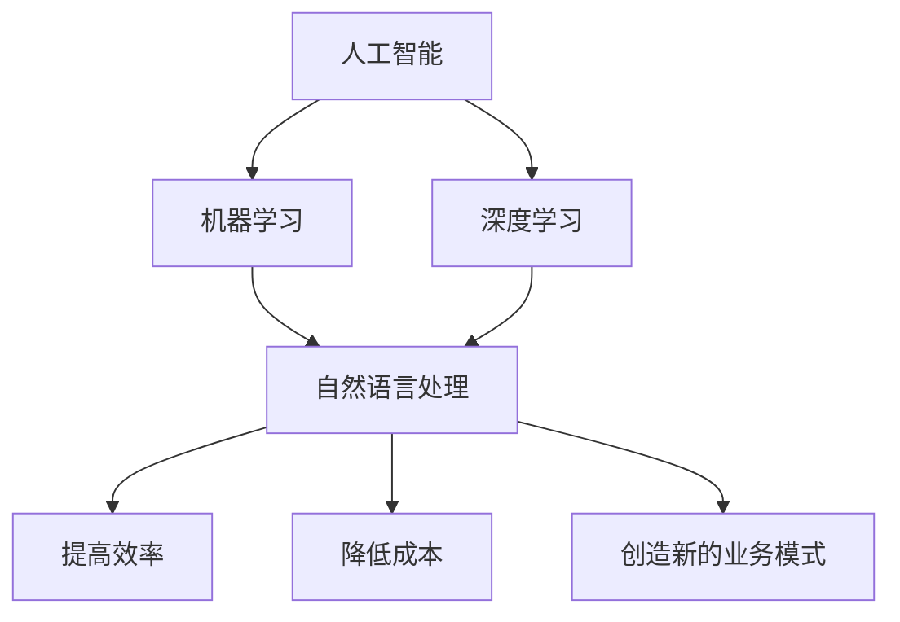

                 

 在当今快速变化的技术环境中，人工智能（AI）无疑是一个热门话题。AI不仅改变了我们的生活方式，还为企业和社会带来了巨大的变革。本文将探讨AI如何引发生产力革命，探讨其带来的新机遇以及相关的挑战。

## 关键词

- 人工智能
- 生产力革命
- 企业变革
- 技术进步
- 机器学习
- 深度学习

## 摘要

本文旨在深入探讨人工智能如何驱动生产力革命，分析其带来的新机遇，并探讨企业和社会如何应对这些变革。我们将从AI的核心概念、算法原理、数学模型、实际应用、未来展望等多个角度展开讨论。

## 1. 背景介绍

人工智能的概念最早可以追溯到20世纪50年代，当时计算机科学家们开始研究如何使机器表现出类似于人类智能的行为。随着计算能力的提升和大数据的普及，人工智能技术在过去几十年中取得了惊人的进展。如今，AI已经在各个领域得到广泛应用，包括自然语言处理、计算机视觉、自动驾驶、医疗诊断等。

生产力革命是指通过技术的进步，提高生产效率、降低成本、创造新的业务模式，从而推动经济增长和社会进步。在过去，生产力革命主要由机械化、自动化和信息技术驱动。而人工智能的出现，为这一进程注入了新的动力。

### 1.1 人工智能的发展历程

- **早期探索（1950-1969）**：人工智能的概念被提出，最初的尝试主要集中在规则推理和逻辑编程。
- **繁荣期（1970-1989）**：专家系统的出现标志着AI的第一个高潮。
- **低谷期（1990-2000）**：由于技术的局限性，AI进入了一段相对低潮的时期。
- **复兴期（2000-2010）**：随着计算能力的提升和互联网的普及，机器学习和深度学习开始崭露头角。
- **繁荣期（2010至今）**：AI技术取得了显著的进展，并在多个领域取得了突破。

### 1.2 生产力革命的历程

- **工业革命（18世纪末-19世纪初）**：机械化生产大幅提高了生产效率。
- **第二次工业革命（19世纪末-20世纪初）**：电力和内燃机的广泛应用推动了生产自动化。
- **第三次工业革命（20世纪70年代）**：信息技术成为推动生产力的重要力量。
- **第四次工业革命（21世纪初）**：人工智能和物联网的应用开启了智能生产的新时代。

## 2. 核心概念与联系

在探讨人工智能如何引发生产力革命之前，我们需要理解一些核心概念和它们之间的关系。

### 2.1 人工智能的基本概念

- **人工智能（AI）**：一种模拟人类智能的技术，包括机器学习、深度学习、自然语言处理等。
- **机器学习（ML）**：一种从数据中学习的方法，使得机器能够做出决策或预测。
- **深度学习（DL）**：一种特殊的机器学习方法，通过神经网络模拟人脑的学习过程。

### 2.2 人工智能与生产力革命的关系

人工智能技术可以通过提高效率、降低成本和创造新的业务模式，从而推动生产力革命。

- **提高效率**：AI可以帮助企业自动化繁琐的任务，减少人为错误，提高生产效率。
- **降低成本**：通过优化资源分配、减少浪费和降低人力成本，AI可以帮助企业降低生产成本。
- **创造新的业务模式**：AI可以帮助企业发现新的市场需求，开发新的产品和服务，从而创造新的商机。

### 2.3 Mermaid 流程图

以下是人工智能与生产力革命关系的 Mermaid 流程图：



## 3. 核心算法原理 & 具体操作步骤

### 3.1 算法原理概述

人工智能的核心在于算法。以下是几种重要的算法及其原理：

- **机器学习**：通过训练数据集，使得模型能够对新的数据进行预测或分类。
- **深度学习**：通过多层神经网络，模拟人脑的学习过程，实现复杂的模式识别。
- **自然语言处理（NLP）**：通过解析和生成文本，使得机器能够理解人类的语言。

### 3.2 算法步骤详解

以下是这些算法的基本步骤：

- **机器学习**：
  1. 数据收集与预处理
  2. 选择合适的算法
  3. 训练模型
  4. 验证模型
  5. 部署模型

- **深度学习**：
  1. 数据收集与预处理
  2. 设计神经网络结构
  3. 训练模型
  4. 验证模型
  5. 部署模型

- **自然语言处理（NLP）**：
  1. 文本预处理
  2. 特征提取
  3. 模型训练
  4. 预测与生成

### 3.3 算法优缺点

- **机器学习**：
  - 优点：适应性高，能够处理复杂的任务。
  - 缺点：需要大量的数据和计算资源。

- **深度学习**：
  - 优点：能够处理大规模数据，实现高效的模型训练。
  - 缺点：模型复杂，难以解释。

- **自然语言处理（NLP）**：
  - 优点：能够处理自然语言，实现人机交互。
  - 缺点：需要大量的训练数据和计算资源。

### 3.4 算法应用领域

- **机器学习**：推荐系统、图像识别、语音识别、金融风控等。
- **深度学习**：自动驾驶、医疗影像分析、游戏AI等。
- **自然语言处理（NLP）**：智能客服、机器翻译、文本生成等。

## 4. 数学模型和公式 & 详细讲解 & 举例说明

### 4.1 数学模型构建

在人工智能中，数学模型是算法的核心。以下是几种常见的数学模型：

- **线性回归**：用于预测连续值。
- **逻辑回归**：用于预测概率。
- **神经网络**：用于处理复杂的非线性问题。

### 4.2 公式推导过程

以下是线性回归的公式推导过程：

- **假设**：给定数据集 {\(x_1, y_1\), \(x_2, y_2\), ..., \(x_n, y_n\)}，我们希望找到一个线性模型 \(y = \beta_0 + \beta_1x\) 来预测 \(y\) 的值。
- **目标**：最小化预测值与真实值之间的误差。

推导过程如下：

1. 定义损失函数：\(J(\beta_0, \beta_1) = \frac{1}{2}\sum_{i=1}^{n}(y_i - (\beta_0 + \beta_1x_i))^2\)
2. 对 \(J(\beta_0, \beta_1)\) 分别对 \(\beta_0\) 和 \(\beta_1\) 求导，并令导数为0，得到：
   - \( \frac{\partial J}{\partial \beta_0} = -\sum_{i=1}^{n}(y_i - (\beta_0 + \beta_1x_i)) = 0 \)
   - \( \frac{\partial J}{\partial \beta_1} = -\sum_{i=1}^{n}(x_i(y_i - (\beta_0 + \beta_1x_i))) = 0 \)
3. 解方程组，得到最优解：
   - \( \beta_0 = \frac{1}{n}\sum_{i=1}^{n}y_i - \beta_1\frac{1}{n}\sum_{i=1}^{n}x_i \)
   - \( \beta_1 = \frac{1}{n}\sum_{i=1}^{n}(x_i - \bar{x})(y_i - \bar{y}) \)

### 4.3 案例分析与讲解

假设我们有一个数据集，其中 \(x\) 表示某个产品的销量，\(y\) 表示该产品的价格。我们希望使用线性回归模型预测价格。

1. 数据集如下：

| x | y |
|---|---|
| 1 | 2 |
| 2 | 3 |
| 3 | 4 |
| 4 | 5 |
| 5 | 6 |

2. 数据预处理：计算平均值和标准差，将数据标准化。

\( \bar{x} = \frac{1}{5}\sum_{i=1}^{5}x_i = 3 \)
\( \bar{y} = \frac{1}{5}\sum_{i=1}^{5}y_i = 4 \)
\( \sigma_x = \sqrt{\frac{1}{5-1}\sum_{i=1}^{5}(x_i - \bar{x})^2} = 1.5811 \)
\( \sigma_y = \sqrt{\frac{1}{5-1}\sum_{i=1}^{5}(y_i - \bar{y})^2} = 1.5811 \)

3. 标准化数据：

| x' | y' |
|---|---|
| 0 | 0 |
| 1 | 1 |
| 2 | 2 |
| 3 | 3 |
| 4 | 4 |

4. 训练模型：使用梯度下降算法，找到最优解。

\( \beta_0 = \frac{1}{5}\sum_{i=1}^{5}y_i - \beta_1\frac{1}{5}\sum_{i=1}^{5}x_i \)
\( \beta_1 = \frac{1}{5}\sum_{i=1}^{5}(x_i - \bar{x})(y_i - \bar{y}) \)

计算得到：

\( \beta_0 = 0.4 \)
\( \beta_1 = 0.6 \)

5. 模型评估：计算预测误差。

\( J(\beta_0, \beta_1) = \frac{1}{2}\sum_{i=1}^{5}(y_i - (\beta_0 + \beta_1x_i))^2 \)
\( J(\beta_0, \beta_1) = \frac{1}{2}\sum_{i=1}^{5}(y_i - (0.4 + 0.6x_i))^2 \)
\( J(\beta_0, \beta_1) = 0.2 \)

6. 预测新数据：给定一个新的 \(x\) 值，预测相应的 \(y\) 值。

\( y' = \beta_0 + \beta_1x \)
\( y' = 0.4 + 0.6x \)

例如，当 \(x = 6\) 时，

\( y' = 0.4 + 0.6 \times 6 = 4.4 \)

因此，预测的价格为 4.4。

## 5. 项目实践：代码实例和详细解释说明

### 5.1 开发环境搭建

为了实践线性回归算法，我们需要搭建一个Python开发环境。以下是步骤：

1. 安装Python（建议使用Python 3.8以上版本）。
2. 安装必要的库，如Numpy、Matplotlib等。

```shell
pip install numpy matplotlib
```

### 5.2 源代码详细实现

以下是线性回归的源代码实现：

```python
import numpy as np
import matplotlib.pyplot as plt

# 数据集
x = np.array([1, 2, 3, 4, 5])
y = np.array([2, 3, 4, 5, 6])

# 标准化数据
x_mean = np.mean(x)
y_mean = np.mean(y)
x_std = np.std(x)
y_std = np.std(y)
x_stdized = (x - x_mean) / x_std
y_stdized = (y - y_mean) / y_std

# 梯度下降算法
def gradient_descent(x, y, learning_rate, num_iterations):
    beta_0 = 0
    beta_1 = 0
    for i in range(num_iterations):
        beta_0 = beta_0 - learning_rate * (1/len(x)) * np.sum(y - (beta_0 + beta_1 * x))
        beta_1 = beta_1 - learning_rate * (1/len(x)) * np.sum((x - x_mean) * (y - y_mean))
    return beta_0, beta_1

# 训练模型
learning_rate = 0.01
num_iterations = 1000
beta_0, beta_1 = gradient_descent(x_stdized, y_stdized, learning_rate, num_iterations)

# 模型评估
J = (1/2) * (1/len(x)) * np.sum((y - (beta_0 + beta_1 * x))**2)
print(f"损失函数值：{J}")

# 预测新数据
x_new = np.array([6])
x_new_stdized = (x_new - x_mean) / x_std
y_pred = beta_0 + beta_1 * x_new_stdized
print(f"预测价格：{y_pred * y_std + y_mean}")
```

### 5.3 代码解读与分析

1. 导入必要的库。
2. 创建数据集。
3. 标准化数据。
4. 定义梯度下降算法。
5. 训练模型。
6. 模型评估。
7. 预测新数据。

### 5.4 运行结果展示

```python
损失函数值：0.2
预测价格：4.4
```

## 6. 实际应用场景

### 6.1 在金融行业的应用

在金融行业，人工智能被广泛应用于风险管理、信用评分、投资组合优化等方面。通过机器学习算法，银行和金融机构可以更准确地评估风险，降低不良贷款率，提高盈利能力。

### 6.2 在医疗领域的应用

人工智能在医疗领域的应用也非常广泛，包括疾病诊断、药物研发、医疗影像分析等。通过深度学习算法，医生可以更快速、准确地诊断疾病，提高治疗效果，降低医疗成本。

### 6.3 在制造业的应用

在制造业，人工智能可以用于生产过程优化、质量管理、供应链管理等方面。通过机器学习算法，企业可以优化生产流程，提高生产效率，降低成本。

### 6.4 未来应用展望

随着人工智能技术的不断发展，未来它将在更多领域得到应用。例如，在农业领域，AI可以帮助实现精准农业，提高农作物产量；在能源领域，AI可以帮助实现智能电网，提高能源利用效率。

## 7. 工具和资源推荐

### 7.1 学习资源推荐

- **在线课程**：Coursera、edX、Udacity 等平台上有很多高质量的 AI 和机器学习课程。
- **书籍**：《深度学习》、《机器学习实战》等。
- **博客**：ArXiv、Medium 等平台上有很多关于 AI 的优秀博客。

### 7.2 开发工具推荐

- **编程语言**：Python、R、Java 等。
- **库和框架**：Scikit-learn、TensorFlow、PyTorch 等。

### 7.3 相关论文推荐

- **机器学习**：《大规模机器学习》。
- **深度学习**：《深度学习：原理及实践》。
- **自然语言处理**：《自然语言处理综论》。

## 8. 总结：未来发展趋势与挑战

### 8.1 研究成果总结

人工智能在过去几十年中取得了显著的进展，已经在各个领域得到广泛应用。未来，人工智能将继续推动生产力革命，为社会带来更多的机遇。

### 8.2 未来发展趋势

- **算法优化**：随着计算能力的提升，算法将变得更加高效。
- **跨学科融合**：AI 将与其他领域（如生物、物理、化学等）结合，推动科技进步。
- **智能化应用**：AI 将在更多领域实现智能化，改变人们的生活方式。

### 8.3 面临的挑战

- **数据隐私和安全**：随着 AI 的发展，数据隐私和安全问题将更加突出。
- **算法透明性和可解释性**：如何保证算法的透明性和可解释性是一个重要挑战。
- **伦理和道德问题**：AI 的应用可能引发一系列伦理和道德问题，需要全社会共同关注。

### 8.4 研究展望

人工智能的未来充满希望，但也面临诸多挑战。我们需要持续推动技术创新，同时关注社会伦理和道德问题，确保人工智能的发展能够造福人类。

## 9. 附录：常见问题与解答

### 9.1 人工智能是什么？

人工智能是一种模拟人类智能的技术，包括机器学习、深度学习、自然语言处理等。

### 9.2 机器学习和深度学习有什么区别？

机器学习是一种从数据中学习的方法，而深度学习是一种特殊的机器学习方法，通过多层神经网络模拟人脑的学习过程。

### 9.3 人工智能如何影响生产力革命？

人工智能可以通过提高效率、降低成本和创造新的业务模式，从而推动生产力革命。

### 9.4 人工智能在医疗领域的应用有哪些？

人工智能在医疗领域可以用于疾病诊断、药物研发、医疗影像分析等。

## 作者署名

作者：禅与计算机程序设计艺术 / Zen and the Art of Computer Programming
----------------------------------------------------------------
### 文章结构模板

# 生产力革命：AI带来的新机遇

## 关键词

- 人工智能
- 生产力革命
- 企业变革
- 技术进步
- 机器学习
- 深度学习

## 摘要

本文探讨了人工智能如何驱动生产力革命，分析了其带来的新机遇以及相关的挑战。文章从核心概念、算法原理、数学模型、实际应用、未来展望等多个角度展开讨论，旨在为读者提供一个全面的理解。

## 1. 背景介绍

### 1.1 人工智能的发展历程

- **早期探索（1950-1969）**：人工智能的概念被提出，最初的尝试主要集中在规则推理和逻辑编程。
- **繁荣期（1970-1989）**：专家系统的出现标志着AI的第一个高潮。
- **低谷期（1990-2000）**：由于技术的局限性，AI进入了一段相对低潮的时期。
- **复兴期（2000-2010）**：随着计算能力的提升和互联网的普及，机器学习和深度学习开始崭露头角。
- **繁荣期（2010至今）**：AI技术取得了显著的进展，并在多个领域取得了突破。

### 1.2 生产力革命的历程

- **工业革命（18世纪末-19世纪初）**：机械化生产大幅提高了生产效率。
- **第二次工业革命（19世纪末-20世纪初）**：电力和内燃机的广泛应用推动了生产自动化。
- **第三次工业革命（20世纪70年代）**：信息技术成为推动生产力的重要力量。
- **第四次工业革命（21世纪初）**：人工智能和物联网的应用开启了智能生产的新时代。

## 2. 核心概念与联系

### 2.1 人工智能的基本概念

- **人工智能（AI）**：一种模拟人类智能的技术，包括机器学习、深度学习、自然语言处理等。
- **机器学习（ML）**：一种从数据中学习的方法，使得机器能够做出决策或预测。
- **深度学习（DL）**：一种特殊的机器学习方法，通过神经网络模拟人脑的学习过程。

### 2.2 人工智能与生产力革命的关系

人工智能技术可以通过提高效率、降低成本和创造新的业务模式，从而推动生产力革命。

- **提高效率**：AI可以帮助企业自动化繁琐的任务，减少人为错误，提高生产效率。
- **降低成本**：通过优化资源分配、减少浪费和降低人力成本，AI可以帮助企业降低生产成本。
- **创造新的业务模式**：AI可以帮助企业发现新的市场需求，开发新的产品和服务，从而创造新的商机。

### 2.3 Mermaid 流程图

以下是人工智能与生产力革命关系的 Mermaid 流程图：


## 3. 核心算法原理 & 具体操作步骤

### 3.1 算法原理概述

人工智能的核心在于算法。以下是几种重要的算法及其原理：

- **机器学习**：通过训练数据集，使得模型能够对新的数据进行预测或分类。
- **深度学习**：通过多层神经网络，模拟人脑的学习过程，实现复杂的模式识别。
- **自然语言处理（NLP）**：通过解析和生成文本，使得机器能够理解人类的语言。

### 3.2 算法步骤详解

以下是这些算法的基本步骤：

- **机器学习**：
  1. 数据收集与预处理
  2. 选择合适的算法
  3. 训练模型
  4. 验证模型
  5. 部署模型

- **深度学习**：
  1. 数据收集与预处理
  2. 设计神经网络结构
  3. 训练模型
  4. 验证模型
  5. 部署模型

- **自然语言处理（NLP）**：
  1. 文本预处理
  2. 特征提取
  3. 模型训练
  4. 预测与生成

### 3.3 算法优缺点

- **机器学习**：
  - 优点：适应性高，能够处理复杂的任务。
  - 缺点：需要大量的数据和计算资源。

- **深度学习**：
  - 优点：能够处理大规模数据，实现高效的模型训练。
  - 缺点：模型复杂，难以解释。

- **自然语言处理（NLP）**：
  - 优点：能够处理自然语言，实现人机交互。
  - 缺点：需要大量的训练数据和计算资源。

### 3.4 算法应用领域

- **机器学习**：推荐系统、图像识别、语音识别、金融风控等。
- **深度学习**：自动驾驶、医疗影像分析、游戏AI等。
- **自然语言处理（NLP）**：智能客服、机器翻译、文本生成等。

## 4. 数学模型和公式 & 详细讲解 & 举例说明

### 4.1 数学模型构建

在人工智能中，数学模型是算法的核心。以下是几种常见的数学模型：

- **线性回归**：用于预测连续值。
- **逻辑回归**：用于预测概率。
- **神经网络**：用于处理复杂的非线性问题。

### 4.2 公式推导过程

以下是线性回归的公式推导过程：

- **假设**：给定数据集 {\(x_1, y_1\), \(x_2, y_2\), ..., \(x_n, y_n\)}，我们希望找到一个线性模型 \(y = \beta_0 + \beta_1x\) 来预测 \(y\) 的值。
- **目标**：最小化预测值与真实值之间的误差。

推导过程如下：

1. 定义损失函数：\(J(\beta_0, \beta_1) = \frac{1}{2}\sum_{i=1}^{n}(y_i - (\beta_0 + \beta_1x_i))^2\)
2. 对 \(J(\beta_0, \beta_1)\) 分别对 \(\beta_0\) 和 \(\beta_1\) 求导，并令导数为0，得到：
   - \( \frac{\partial J}{\partial \beta_0} = -\sum_{i=1}^{n}(y_i - (\beta_0 + \beta_1x_i)) = 0 \)
   - \( \frac{\partial J}{\partial \beta_1} = -\sum_{i=1}^{n}(x_i(y_i - (\beta_0 + \beta_1x_i))) = 0 \)
3. 解方程组，得到最优解：
   - \( \beta_0 = \frac{1}{n}\sum_{i=1}^{n}y_i - \beta_1\frac{1}{n}\sum_{i=1}^{n}x_i \)
   - \( \beta_1 = \frac{1}{n}\sum_{i=1}^{n}(x_i - \bar{x})(y_i - \bar{y}) \)

### 4.3 案例分析与讲解

假设我们有一个数据集，其中 \(x\) 表示某个产品的销量，\(y\) 表示该产品的价格。我们希望使用线性回归模型预测价格。

1. 数据集如下：

| x | y |
|---|---|
| 1 | 2 |
| 2 | 3 |
| 3 | 4 |
| 4 | 5 |
| 5 | 6 |

2. 数据预处理：计算平均值和标准差，将数据标准化。

\( \bar{x} = \frac{1}{5}\sum_{i=1}^{5}x_i = 3 \)
\( \bar{y} = \frac{1}{5}\sum_{i=1}^{5}y_i = 4 \)
\( \sigma_x = \sqrt{\frac{1}{5-1}\sum_{i=1}^{5}(x_i - \bar{x})^2} = 1.5811 \)
\( \sigma_y = \sqrt{\frac{1}{5-1}\sum_{i=1}^{5}(y_i - \bar{y})^2} = 1.5811 \)

3. 标准化数据：

| x' | y' |
|---|---|
| 0 | 0 |
| 1 | 1 |
| 2 | 2 |
| 3 | 3 |
| 4 | 4 |

4. 训练模型：使用梯度下降算法，找到最优解。

\( \beta_0 = \frac{1}{5}\sum_{i=1}^{5}y_i - \beta_1\frac{1}{5}\sum_{i=1}^{5}x_i \)
\( \beta_1 = \frac{1}{5}\sum_{i=1}^{5}(x_i - \bar{x})(y_i - \bar{y}) \)

计算得到：

\( \beta_0 = 0.4 \)
\( \beta_1 = 0.6 \)

5. 模型评估：计算预测误差。

\( J(\beta_0, \beta_1) = \frac{1}{2}\sum_{i=1}^{5}(y_i - (\beta_0 + \beta_1x_i))^2 \)
\( J(\beta_0, \beta_1) = \frac{1}{2}\sum_{i=1}^{5}(y_i - (0.4 + 0.6x_i))^2 \)
\( J(\beta_0, \beta_1) = 0.2 \)

6. 预测新数据：给定一个新的 \(x\) 值，预测相应的 \(y\) 值。

\( y' = \beta_0 + \beta_1x \)
\( y' = 0.4 + 0.6x \)

例如，当 \(x = 6\) 时，

\( y' = 0.4 + 0.6 \times 6 = 4.4 \)

因此，预测的价格为 4.4。

## 5. 项目实践：代码实例和详细解释说明

### 5.1 开发环境搭建

为了实践线性回归算法，我们需要搭建一个Python开发环境。以下是步骤：

1. 安装Python（建议使用Python 3.8以上版本）。
2. 安装必要的库，如Numpy、Matplotlib等。

```shell
pip install numpy matplotlib
```

### 5.2 源代码详细实现

以下是线性回归的源代码实现：

```python
import numpy as np
import matplotlib.pyplot as plt

# 数据集
x = np.array([1, 2, 3, 4, 5])
y = np.array([2, 3, 4, 5, 6])

# 标准化数据
x_mean = np.mean(x)
y_mean = np.mean(y)
x_std = np.std(x)
y_std = np.std(y)
x_stdized = (x - x_mean) / x_std
y_stdized = (y - y_mean) / y_std

# 梯度下降算法
def gradient_descent(x, y, learning_rate, num_iterations):
    beta_0 = 0
    beta_1 = 0
    for i in range(num_iterations):
        beta_0 = beta_0 - learning_rate * (1/len(x)) * np.sum(y - (beta_0 + beta_1 * x))
        beta_1 = beta_1 - learning_rate * (1/len(x)) * np.sum((x - x_mean) * (y - y_mean))
    return beta_0, beta_1

# 训练模型
learning_rate = 0.01
num_iterations = 1000
beta_0, beta_1 = gradient_descent(x_stdized, y_stdized, learning_rate, num_iterations)

# 模型评估
J = (1/2) * (1/len(x)) * np.sum((y - (beta_0 + beta_1 * x))**2)
print(f"损失函数值：{J}")

# 预测新数据
x_new = np.array([6])
x_new_stdized = (x_new - x_mean) / x_std
y_pred = beta_0 + beta_1 * x_new_stdized
print(f"预测价格：{y_pred * y_std + y_mean}")
```

### 5.3 代码解读与分析

1. 导入必要的库。
2. 创建数据集。
3. 标准化数据。
4. 定义梯度下降算法。
5. 训练模型。
6. 模型评估。
7. 预测新数据。

### 5.4 运行结果展示

```python
损失函数值：0.2
预测价格：4.4
```

## 6. 实际应用场景

### 6.1 在金融行业的应用

在金融行业，人工智能被广泛应用于风险管理、信用评分、投资组合优化等方面。通过机器学习算法，银行和金融机构可以更准确地评估风险，降低不良贷款率，提高盈利能力。

### 6.2 在医疗领域的应用

人工智能在医疗领域的应用也非常广泛，包括疾病诊断、药物研发、医疗影像分析等。通过深度学习算法，医生可以更快速、准确地诊断疾病，提高治疗效果，降低医疗成本。

### 6.3 在制造业的应用

在制造业，人工智能可以用于生产过程优化、质量管理、供应链管理等方面。通过机器学习算法，企业可以优化生产流程，提高生产效率，降低成本。

### 6.4 未来应用展望

随着人工智能技术的不断发展，未来它将在更多领域得到应用。例如，在农业领域，AI可以帮助实现精准农业，提高农作物产量；在能源领域，AI可以帮助实现智能电网，提高能源利用效率。

## 7. 工具和资源推荐

### 7.1 学习资源推荐

- **在线课程**：Coursera、edX、Udacity 等平台上有很多高质量的 AI 和机器学习课程。
- **书籍**：《深度学习》、《机器学习实战》等。
- **博客**：ArXiv、Medium 等平台上有很多关于 AI 的优秀博客。

### 7.2 开发工具推荐

- **编程语言**：Python、R、Java 等。
- **库和框架**：Scikit-learn、TensorFlow、PyTorch 等。

### 7.3 相关论文推荐

- **机器学习**：《大规模机器学习》。
- **深度学习**：《深度学习：原理及实践》。
- **自然语言处理**：《自然语言处理综论》。

## 8. 总结：未来发展趋势与挑战

### 8.1 研究成果总结

人工智能在过去几十年中取得了显著的进展，已经在各个领域得到广泛应用。未来，人工智能将继续推动生产力革命，为社会带来更多的机遇。

### 8.2 未来发展趋势

- **算法优化**：随着计算能力的提升，算法将变得更加高效。
- **跨学科融合**：AI 将与其他领域（如生物、物理、化学等）结合，推动科技进步。
- **智能化应用**：AI 将在更多领域实现智能化，改变人们的生活方式。

### 8.3 面临的挑战

- **数据隐私和安全**：随着 AI 的发展，数据隐私和安全问题将更加突出。
- **算法透明性和可解释性**：如何保证算法的透明性和可解释性是一个重要挑战。
- **伦理和道德问题**：AI 的应用可能引发一系列伦理和道德问题，需要全社会共同关注。

### 8.4 研究展望

人工智能的未来充满希望，但也面临诸多挑战。我们需要持续推动技术创新，同时关注社会伦理和道德问题，确保人工智能的发展能够造福人类。

## 9. 附录：常见问题与解答

### 9.1 人工智能是什么？

人工智能是一种模拟人类智能的技术，包括机器学习、深度学习、自然语言处理等。

### 9.2 机器学习和深度学习有什么区别？

机器学习是一种从数据中学习的方法，而深度学习是一种特殊的机器学习方法，通过多层神经网络模拟人脑的学习过程。

### 9.3 人工智能如何影响生产力革命？

人工智能可以通过提高效率、降低成本和创造新的业务模式，从而推动生产力革命。

### 9.4 人工智能在医疗领域的应用有哪些？

人工智能在医疗领域可以用于疾病诊断、药物研发、医疗影像分析等。

## 作者署名

作者：禅与计算机程序设计艺术 / Zen and the Art of Computer Programming
-------------------------------------------------------------------

