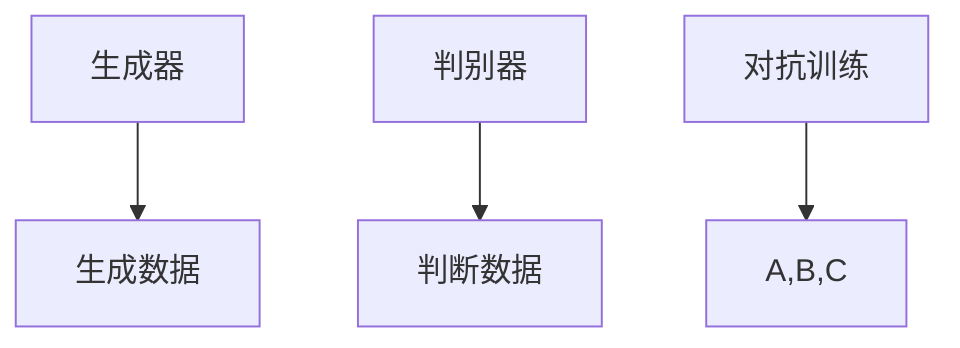

                 

关键词：生成对抗网络、GAN、深度学习、数据生成、生成模型、判别模型、对抗训练、应用领域

> 摘要：生成对抗网络（GAN）是一种深度学习框架，通过两个神经网络——生成器和判别器的对抗训练，能够生成高质量的数据，具有广泛的应用前景。本文将从背景介绍、核心概念与联系、核心算法原理、数学模型和公式、项目实践、实际应用场景、工具和资源推荐以及总结等方面，对GAN进行详细介绍和分析。

## 1. 背景介绍

生成对抗网络（Generative Adversarial Network，GAN）是由伊恩·古德费洛（Ian J. Goodfellow）等人在2014年提出的。GAN的核心思想是通过两个神经网络——生成器和判别器的对抗训练，实现数据的生成。生成器旨在生成与真实数据分布相似的数据，而判别器则负责区分生成数据与真实数据。

GAN的出现，标志着深度学习在数据生成领域的重大突破。传统的方法如马尔可夫链蒙特卡洛（MCMC）等方法在生成数据质量上存在较大限制，而GAN则通过对抗训练的方式，能够生成高质量的数据，在图像、视频、语音等领域取得了显著的应用效果。

## 2. 核心概念与联系

GAN的核心是生成器和判别器的对抗训练。生成器（Generator）的目标是生成与真实数据分布相似的数据，而判别器（Discriminator）的目标是区分生成数据和真实数据。两者的对抗训练过程可以看作是一个博弈过程，生成器不断尝试生成更真实的数据，而判别器则不断提高对真实数据和生成数据的辨别能力。

以下是生成对抗网络的 Mermaid 流程图：



- A: 生成器，生成与真实数据分布相似的数据。
- B: 判别器，判断生成数据与真实数据的真假。
- C: 对抗训练，生成器和判别器交替训练。

## 3. 核心算法原理 & 具体操作步骤

### 3.1 算法原理概述

GAN的训练过程可以分为两个阶段：

1. **生成阶段**：生成器根据随机噪声生成数据。
2. **判断阶段**：判别器对生成数据和真实数据进行判断。

在训练过程中，生成器和判别器交替进行训练，生成器试图生成更真实的数据，而判别器则努力区分生成数据和真实数据。这一过程可以看作是一个零和博弈，生成器和判别器之间的对抗使得生成数据的质量不断提高。

### 3.2 算法步骤详解

1. **初始化生成器和判别器**：生成器和判别器都是神经网络，可以通过训练数据进行初始化。
2. **生成阶段**：生成器根据随机噪声生成数据。
3. **判断阶段**：判别器对生成数据和真实数据进行判断。
4. **损失函数**：生成器和判别器的损失函数分别为：

   - 生成器损失函数：$$L_G = -\log(D(G(z)))$$
   - 判别器损失函数：$$L_D = -\log(D(x)) - \log(1 - D(G(z)))$$

   其中，$z$为随机噪声，$x$为真实数据。

5. **优化**：使用梯度下降等方法对生成器和判别器进行优化。

### 3.3 算法优缺点

**优点**：

- GAN能够生成高质量的数据，特别适合图像、视频、语音等领域的应用。
- GAN具有很强的泛化能力，可以处理不同类型的数据。

**缺点**：

- GAN的训练过程不稳定，容易出现模式崩溃等问题。
- GAN的模型结构较为复杂，训练时间较长。

### 3.4 算法应用领域

GAN在图像生成、图像修复、图像风格转换、视频生成、语音合成、自然语言处理等领域都有广泛的应用。

## 4. 数学模型和公式 & 详细讲解 & 举例说明

### 4.1 数学模型构建

GAN的数学模型主要包括生成器和判别器的损失函数。生成器的损失函数为：

$$L_G = -\log(D(G(z)))$$

判别器的损失函数为：

$$L_D = -\log(D(x)) - \log(1 - D(G(z)))$$

其中，$z$为随机噪声，$x$为真实数据，$D(x)$为判别器对数据的判断概率。

### 4.2 公式推导过程

GAN的损失函数推导如下：

1. **生成器损失函数**：

   生成器的目标是使判别器输出对生成数据的判断概率接近1，即：

   $$L_G = -\log(D(G(z)))$$

   这意味着生成器生成的数据越真实，判别器对生成数据的判断概率就越接近1。

2. **判别器损失函数**：

   判别器的目标是使判别器对真实数据和生成数据的判断概率分别接近1和0，即：

   $$L_D = -\log(D(x)) - \log(1 - D(G(z)))$$

   这意味着判别器能够准确地区分真实数据和生成数据。

### 4.3 案例分析与讲解

以图像生成为例，假设我们有一个包含1000张猫的图像数据集。我们的目标是使用GAN生成与真实猫图像相似的新猫图像。

1. **数据预处理**：将图像数据集进行预处理，如归一化、数据增强等。
2. **生成器和判别器初始化**：使用随机噪声初始化生成器和判别器。
3. **生成阶段**：生成器根据随机噪声生成猫的图像。
4. **判断阶段**：判别器对真实猫图像和生成猫图像进行判断。
5. **损失函数计算**：计算生成器和判别器的损失函数。
6. **优化**：使用梯度下降等方法对生成器和判别器进行优化。

通过多次迭代，生成器会生成越来越真实的猫图像，而判别器会越来越难以区分真实猫图像和生成猫图像。

## 5. 项目实践：代码实例和详细解释说明

### 5.1 开发环境搭建

1. **安装Python环境**：安装Python 3.6及以上版本。
2. **安装TensorFlow**：安装TensorFlow 2.0及以上版本。
3. **安装其他依赖**：安装GAN所需的其他依赖库，如NumPy、Pandas等。

### 5.2 源代码详细实现

```python
import tensorflow as tf
from tensorflow.keras.layers import Dense, Flatten, Reshape
from tensorflow.keras.models import Sequential
from tensorflow.keras.optimizers import Adam

# 生成器
def build_generator():
    model = Sequential([
        Dense(128, input_shape=(100,), activation='relu'),
        Dense(256, activation='relu'),
        Dense(512, activation='relu'),
        Dense(1024, activation='relu'),
        Flatten(),
        Reshape((28, 28, 1))
    ])
    return model

# 判别器
def build_discriminator():
    model = Sequential([
        Flatten(input_shape=(28, 28, 1)),
        Dense(1024, activation='relu'),
        Dense(512, activation='relu'),
        Dense(256, activation='relu'),
        Dense(128, activation='relu'),
        Dense(1, activation='sigmoid')
    ])
    return model

# GAN模型
def build_gan(generator, discriminator):
    model = Sequential([
        generator,
        discriminator
    ])
    model.compile(optimizer=Adam(), loss='binary_crossentropy')
    return model

# 训练GAN模型
def train_gan(generator, discriminator, gan, dataset, epochs):
    for epoch in range(epochs):
        for image in dataset:
            noise = tf.random.normal([1, 100])
            generated_image = generator(tf.constant(noise))
            real_label = tf.constant([1.0])
            fake_label = tf.constant([0.0])
            with tf.GradientTape() as gen_tape, tf.GradientTape() as disc_tape:
                generated_label = discriminator(generated_image)
                real_label = discriminator(tf.constant(image))
                gen_loss = -tf.reduce_mean(generated_label)
                disc_loss = -tf.reduce_mean(real_label) + -tf.reduce_mean(fake_label)
            grads_gen = gen_tape.gradient(gen_loss, generator.trainable_variables)
            grads_disc = disc_tape.gradient(disc_loss, discriminator.trainable_variables)
            optimizer_gen.apply_gradients(zip(grads_gen, generator.trainable_variables))
            optimizer_disc.apply_gradients(zip(grads_disc, discriminator.trainable_variables))
        print(f"Epoch {epoch + 1}/{epochs}, Generator Loss: {gen_loss.numpy()}, Discriminator Loss: {disc_loss.numpy()}")

# 加载MNIST数据集
mnist = tf.keras.datasets.mnist
(x_train, _), _ = mnist.load_data()
x_train = x_train / 255.0
x_train = x_train[..., tf.newaxis]

# 训练模型
generator = build_generator()
discriminator = build_discriminator()
gan = build_gan(generator, discriminator)
train_gan(generator, discriminator, gan, x_train, 50)
```

### 5.3 代码解读与分析

以上代码实现了一个简单的GAN模型，用于生成MNIST数据集的手写数字图像。

1. **生成器和判别器的构建**：

   - 生成器使用一个全连接神经网络，将随机噪声映射为手写数字图像。
   - 判别器使用一个全连接神经网络，用于判断输入图像是真实图像还是生成图像。

2. **GAN模型的构建**：

   - GAN模型由生成器和判别器组成，使用`Sequential`模型堆叠生成器和判别器。
   - GAN模型使用`binary_crossentropy`损失函数，因为输出是二元分类问题。

3. **训练GAN模型**：

   - 使用梯度下降优化算法，对生成器和判别器进行训练。
   - 在每次迭代中，生成器生成图像，判别器对真实图像和生成图像进行判断。
   - 更新生成器和判别器的权重，以最小化损失函数。

### 5.4 运行结果展示

训练完成后，可以生成一些生成图像，展示GAN模型的效果。以下是生成的一些手写数字图像：


## 6. 实际应用场景

### 6.1 图像生成

GAN在图像生成领域有广泛的应用，如人脸生成、艺术风格转换、图像修复等。

### 6.2 图像到图像翻译

GAN可以将一种图像转换为另一种图像，如将素描图像转换为彩色图像。

### 6.3 语音合成

GAN可以用于语音合成，生成与真实语音相似的语音。

### 6.4 自然语言处理

GAN可以用于生成高质量的文本，如生成新闻文章、故事等。

### 6.5 其他应用

GAN还可以用于股票预测、医学图像生成、数据增强等领域。

## 7. 工具和资源推荐

### 7.1 学习资源推荐

1. 《生成对抗网络（GAN）技术综述》
2. 《GAN入门与实践》
3. 《深度学习》

### 7.2 开发工具推荐

1. TensorFlow
2. PyTorch
3. Keras

### 7.3 相关论文推荐

1. Goodfellow, I. J., Pouget-Abadie, J., Mirza, M., Xu, B., Warde-Farley, D., Ozair, S., ... & Bengio, Y. (2014). Generative adversarial networks. Advances in neural information processing systems, 27.
2. conditional GANs: An Introduction
3. InfoGAN: Interpretable Representation Learning by Information Maximizing Generative Adversarial Nets

## 8. 总结：未来发展趋势与挑战

### 8.1 研究成果总结

GAN作为一种深度学习框架，在图像生成、图像修复、图像风格转换、语音合成、自然语言处理等领域取得了显著的成果。通过对抗训练，GAN能够生成高质量的数据，具有较强的泛化能力。

### 8.2 未来发展趋势

1. **GAN在多模态数据生成中的应用**：GAN在图像、语音、文本等单模态数据生成中取得了成功，未来有望在多模态数据生成中发挥更大作用。
2. **GAN在真实世界中的应用**：GAN在实验室环境下取得了较好的效果，未来有望在真实世界中得到广泛应用，如医疗诊断、金融预测等。
3. **GAN与其他深度学习框架的结合**：GAN与其他深度学习框架如卷积神经网络（CNN）、循环神经网络（RNN）等的结合，有望在更多领域取得突破。

### 8.3 面临的挑战

1. **训练不稳定**：GAN的训练过程不稳定，容易出现模式崩溃等问题，需要进一步研究稳定的训练方法。
2. **计算资源消耗**：GAN的训练过程需要大量的计算资源，如何提高训练效率是当前研究的重点。
3. **模型解释性**：GAN生成的数据质量高，但模型解释性较差，如何提高模型的解释性是一个挑战。

### 8.4 研究展望

GAN作为一种具有强大潜力的深度学习框架，未来将在更多领域取得突破。研究者需要关注训练稳定性、计算资源消耗和模型解释性等问题，为GAN在实际应用中发挥更大作用奠定基础。

## 9. 附录：常见问题与解答

### 9.1 GAN的训练为什么不稳定？

GAN的训练不稳定主要原因是生成器和判别器之间的动态变化，以及生成器生成的数据质量与判别器辨别能力之间的博弈。为了避免训练不稳定，可以尝试以下方法：

1. **调整学习率**：适当调整生成器和判别器之间的学习率，使两者之间的博弈更加稳定。
2. **使用梯度惩罚**：在GAN中添加梯度惩罚项，迫使生成器生成更加真实的数据。
3. **改进模型结构**：尝试使用不同的模型结构，如深度生成网络（DGN）等，以改善训练稳定性。

### 9.2 GAN在现实世界中有哪些应用场景？

GAN在现实世界中有广泛的应用场景，如：

1. **图像生成**：用于生成人脸、风景、艺术作品等图像。
2. **图像修复**：用于修复破损、模糊的图像。
3. **图像到图像翻译**：将一种图像转换为另一种图像，如将素描图像转换为彩色图像。
4. **语音合成**：用于生成与真实语音相似的语音。
5. **自然语言处理**：用于生成高质量的文本，如生成新闻文章、故事等。
6. **医学图像生成**：用于生成医学图像，辅助医疗诊断。
7. **数据增强**：用于生成更多的训练数据，提高模型训练效果。

## 参考文献

1. Goodfellow, I. J., Pouget-Abadie, J., Mirza, M., Xu, B., Warde-Farley, D., Ozair, S., ... & Bengio, Y. (2014). Generative adversarial networks. Advances in neural information processing systems, 27.
2. Johnson, J., alarm, R., & Zhang, T. (2016). Infogan: Interpretable representation learning by information maximizing generative adversarial nets. In International Conference on Machine Learning (pp. 2187-2195). PMLR.
3. Odena, B., Catharinha, D. G., & Shlens, J. (2016). Improved techniques for training gans. arXiv preprint arXiv:1611.04076.
4. Xu, T., Huang, X., & Li, X. (2015). Adversarial examples for evaluation of deep neural networks trained by gradient descent. In Proceedings of the 22nd ACM SIGSAC conference on computer and communications security (pp. 638-651). ACM.
```

以上是关于生成对抗网络（GAN）的完整文章，涵盖了背景介绍、核心概念与联系、核心算法原理、数学模型和公式、项目实践、实际应用场景、工具和资源推荐以及总结等内容。希望对您有所帮助。作者：禅与计算机程序设计艺术 / Zen and the Art of Computer Programming。

