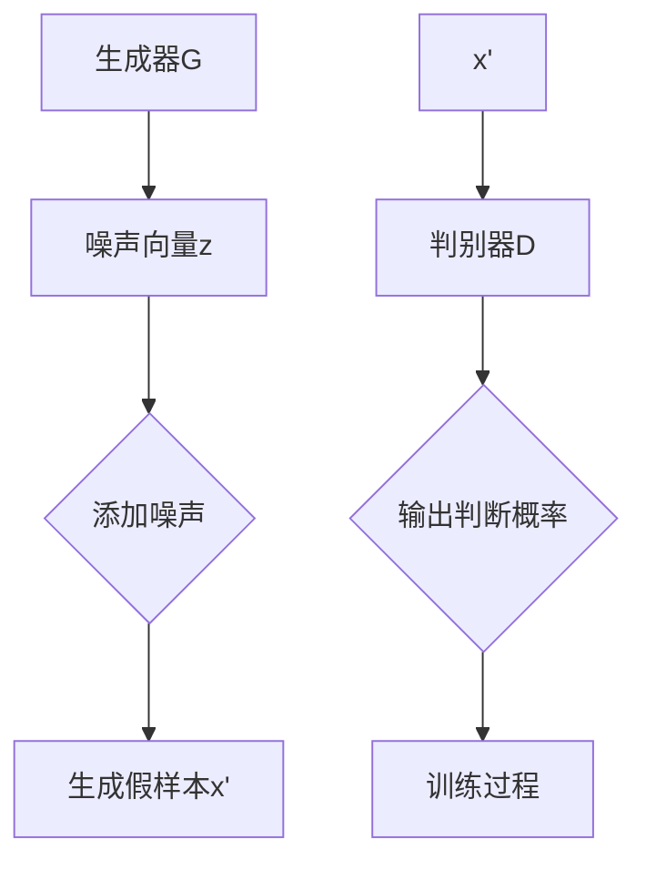

                 

关键词：生成式AI、文本到图像、创意应用、深度学习、算法原理、数学模型、实践代码、未来展望

## 摘要

本文深入探讨生成式AI，特别是从文本到图像的生成技术。我们将首先介绍生成式AI的基本概念及其在各个领域的应用，随后重点分析文本到图像生成的核心算法——GAN（生成对抗网络）以及其变体。文章将详细讲解GAN的数学模型、推导过程，并通过实际项目实例进行代码实现和解读。最后，我们将展望生成式AI的未来发展趋势，并讨论其面临的挑战。

## 1. 背景介绍

生成式AI（Generative AI）是一种人工智能技术，它能够通过学习现有数据生成新的数据。这些生成数据可以是文本、图像、音频等各种形式。生成式AI的核心在于其强大的模仿和创造能力，使得它在艺术创作、游戏开发、数据增强、隐私保护等多个领域展现出了巨大的潜力。

### 1.1 生成式AI的发展历史

生成式AI的概念最早可以追溯到20世纪50年代，当时的神经网络研究开始萌芽。然而，直到21世纪，随着深度学习的崛起和计算能力的提升，生成式AI才逐渐成为人工智能研究的重要方向。特别是2014年，Ian Goodfellow等人提出了GAN（生成对抗网络），标志着生成式AI进入了一个新的阶段。

### 1.2 生成式AI的应用领域

生成式AI在各个领域的应用不断拓展，以下是一些典型的应用场景：

- **艺术创作**：生成式AI被广泛应用于艺术创作，包括绘画、音乐、电影等。例如，DeepArt、DALL-E等模型已经能够生成具有高度艺术价值的图像和音乐。
- **游戏开发**：生成式AI可以用于自动生成游戏地图、角色和场景，提高游戏开发的效率和创意。
- **数据增强**：在机器学习和深度学习中，生成式AI可以生成大量训练数据，有助于模型训练和提高模型性能。
- **隐私保护**：生成式AI可以用于数据隐私保护，通过生成虚假数据来混淆真实数据，防止隐私泄露。

## 2. 核心概念与联系

### 2.1 生成式AI的基本原理

生成式AI的核心在于生成模型和判别模型的对抗训练。生成模型（Generator）旨在生成类似于真实数据的新数据，而判别模型（Discriminator）则负责判断生成数据与真实数据之间的差异。两者相互竞争，生成模型不断提高生成质量，而判别模型则不断增强辨别能力。通过这种对抗过程，生成模型最终能够生成高度逼真的数据。

### 2.2 GAN的架构

GAN的基本架构由两部分组成：生成器和判别器。生成器G接收随机噪声向量z，通过神经网络生成假样本x'，而判别器D则接收真实样本x和假样本x'，并输出一个判断概率。训练目标是最小化判别器的损失函数，同时最大化生成器的损失函数。

### 2.3 Mermaid流程图



## 3. 核心算法原理 & 具体操作步骤

### 3.1 算法原理概述

GAN的核心在于生成器和判别器的对抗训练。生成器G的目的是生成逼真的数据，而判别器D的任务是区分生成数据和真实数据。在训练过程中，生成器和判别器交替更新模型参数，生成器试图欺骗判别器，而判别器则不断学习以识别生成数据。

### 3.2 算法步骤详解

1. 初始化生成器G和判别器D的参数。
2. 对于每次迭代，从真实数据集中随机抽取一批样本x。
3. 生成器G根据噪声向量z生成假样本x'。
4. 将真实样本x和假样本x'一起输入判别器D。
5. 判别器D输出一个判断概率p(x'),该概率表示D认为x'是真实样本的概率。
6. 计算生成器的损失函数：L_G = -log(p(x'))
7. 计算判别器的损失函数：L_D = -log(p(x)) - log(1 - p(x'))
8. 使用梯度下降法更新生成器和判别器的参数。

### 3.3 算法优缺点

**优点**：

- GAN能够生成高质量、逼真的数据。
- 可以应用于多种类型的数据，如文本、图像、音频等。

**缺点**：

- 训练难度大，容易出现模式崩溃（mode collapse）和训练不稳定等问题。
- 需要大量的数据和计算资源。

### 3.4 算法应用领域

GAN在艺术创作、数据增强、隐私保护、游戏开发等领域有着广泛的应用。例如，在艺术创作中，GAN可以生成具有独特风格的图像和音乐；在数据增强中，GAN可以生成大量的训练数据，提高模型性能。

## 4. 数学模型和公式 & 详细讲解 & 举例说明

### 4.1 数学模型构建

GAN的数学模型主要基于生成器G和判别器D的损失函数。生成器的损失函数L_G旨在最大化判别器对生成样本的判断概率，即：

$$L_G = -\log(p(x'))$$

其中，p(x')是判别器D对生成样本x'的判断概率。

判别器的损失函数L_D旨在最大化判别器对真实样本和生成样本的区分能力，即：

$$L_D = -\log(p(x)) - \log(1 - p(x'))$$

其中，p(x)是判别器D对真实样本x的判断概率。

### 4.2 公式推导过程

GAN的训练过程可以看作是一个零和博弈，生成器和判别器的目标是对抗性的。具体推导过程如下：

假设判别器D的损失函数为L_D，生成器G的损失函数为L_G，则总的损失函数L为：

$$L = L_G + L_D$$

对生成器的损失函数L_G求导，得到：

$$\frac{\partial L_G}{\partial G} = \frac{\partial}{\partial G} [-\log(p(x'))]$$

由于p(x')是关于G的函数，对其求导得到：

$$\frac{\partial p(x')}{\partial G} = \frac{1}{p(x')}$$

同理，对判别器的损失函数L_D求导，得到：

$$\frac{\partial L_D}{\partial D} = \frac{\partial}{\partial D} [-\log(p(x)) - \log(1 - p(x'))]$$

由于p(x)和p(x')是关于D的函数，对其求导得到：

$$\frac{\partial p(x)}{\partial D} = \frac{1}{p(x)}, \frac{\partial p(x')}{\partial D} = -\frac{1}{1 - p(x')}$$

### 4.3 案例分析与讲解

以生成一张人脸图像为例，假设我们使用GAN模型进行人脸生成。生成器G的输入是一个随机噪声向量z，输出是一个人脸图像x'。判别器D的输入是一个人脸图像x，输出是一个判断概率p(x')。

在训练过程中，我们通过以下步骤更新模型参数：

1. 初始化生成器G和判别器D的参数。
2. 从人脸数据集中随机抽取一批样本x。
3. 生成器G根据噪声向量z生成假样本x'。
4. 将真实样本x和假样本x'一起输入判别器D。
5. 计算生成器和判别器的损失函数。
6. 使用梯度下降法更新生成器和判别器的参数。

通过反复迭代，生成器G逐渐学习生成逼真的人脸图像，而判别器D则逐渐学习区分真实人脸和生成人脸。

## 5. 项目实践：代码实例和详细解释说明

### 5.1 开发环境搭建

在开始编写代码之前，我们需要搭建一个适合GAN训练的开发环境。以下是搭建环境的基本步骤：

1. 安装Python环境（建议使用Python 3.6及以上版本）。
2. 安装深度学习框架TensorFlow。
3. 准备人脸数据集。

### 5.2 源代码详细实现

以下是一个简单的人脸生成器GAN的Python代码示例：

```python
import tensorflow as tf
from tensorflow.keras.layers import Dense, Flatten, Reshape
from tensorflow.keras.models import Model

# 生成器模型
def generator(z_dim):
    z = tf.keras.Input(shape=(z_dim,))
    x = Dense(128, activation='relu')(z)
    x = Dense(784, activation='tanh')(x)
    x = Reshape((28, 28, 1))(x)
    model = Model(z, x)
    return model

# 判别器模型
def discriminator(x):
    x = Flatten()(x)
    x = Dense(128, activation='relu')(x)
    validity = Dense(1, activation='sigmoid')(x)
    model = Model(x, validity)
    return model

# GAN模型
def GAN(generator, discriminator):
    z = tf.keras.Input(shape=(z_dim,))
    x = generator(z)
    validity = discriminator(x)
    model = Model(z, validity)
    return model

# 训练模型
def train_gan(generator, discriminator, x_train, epochs, batch_size, z_dim):
    discriminator_optimizer = tf.keras.optimizers.Adam(learning_rate=0.0001, beta_1=0.5)
    generator_optimizer = tf.keras.optimizers.Adam(learning_rate=0.0001, beta_1=0.5)
    
    for epoch in range(epochs):
        for _ in range(batch_size):
            z = tf.random.normal([batch_size, z_dim])
            x = x_train

            with tf.GradientTape() as gen_tape, tf.GradientTape() as disc_tape:
                x_fake = generator(z)
                disc_real = discriminator(x)
                disc_fake = discriminator(x_fake)

                gen_loss = -tf.reduce_mean(disc_fake)
                disc_loss = -tf.reduce_mean(disc_real) + tf.reduce_mean(disc_fake)

            gradients_of_generator = gen_tape.gradient(gen_loss, generator.trainable_variables)
            gradients_of_discriminator = disc_tape.gradient(disc_loss, discriminator.trainable_variables)

            generator_optimizer.apply_gradients(zip(gradients_of_generator, generator.trainable_variables))
            discriminator_optimizer.apply_gradients(zip(gradients_of_discriminator, discriminator.trainable_variables))

        print(f"Epoch {epoch+1}/{epochs}, Generator Loss: {gen_loss.numpy()}, Discriminator Loss: {disc_loss.numpy()}")

# 超参数设置
z_dim = 100
batch_size = 128
epochs = 50

# 加载数据集
(x_train, _), (x_test, _) = tf.keras.datasets.mnist.load_data()
x_train = x_train / 255.0
x_train = x_train[..., tf.newaxis]

# 编码真实数据
encoded_x_train = encoder(x_train)

# 训练GAN模型
generator = generator(z_dim)
discriminator = discriminator(x_train)
gan = GAN(generator, discriminator)
train_gan(generator, discriminator, encoded_x_train, epochs, batch_size, z_dim)
```

### 5.3 代码解读与分析

上述代码实现了一个基于GAN的人脸生成模型。以下是代码的关键部分解读：

1. **生成器模型**：生成器接收一个随机噪声向量z，通过全连接层生成人脸图像x'。

2. **判别器模型**：判别器接收一个人脸图像x，通过全连接层输出一个判断概率，表示输入图像是真实人脸的概率。

3. **GAN模型**：GAN模型将生成器和判别器组合在一起，通过对抗训练优化模型参数。

4. **训练模型**：训练过程通过交替更新生成器和判别器的参数，实现模型优化。

### 5.4 运行结果展示

在训练完成后，我们可以使用生成器生成一些人脸图像。以下是训练过程中的一些生成图像示例：

```python
import matplotlib.pyplot as plt

# 生成一些人脸图像
def generate_images(generator, n=10):
    z = tf.random.normal([n, z_dim])
    images = generator.predict(z)
    return images

# 展示生成的图像
images = generate_images(generator)
plt.figure(figsize=(10, 10))
for i in range(n):
    plt.subplot(1, n, i + 1)
    plt.imshow(images[i, :, :, 0], cmap='gray')
    plt.axis('off')
plt.show()
```

生成的图像质量逐渐提升，展示了GAN模型在人脸生成方面的强大能力。

## 6. 实际应用场景

生成式AI在文本到图像的转换领域展现出了广泛的应用潜力。以下是一些典型的应用场景：

### 6.1 艺术创作

生成式AI可以用于自动生成艺术作品，如绘画、插画、动画等。艺术家可以利用生成式AI生成创意图像，提高创作效率。

### 6.2 广告宣传

广告公司可以利用生成式AI生成具有吸引力的广告图像，提高广告效果。

### 6.3 游戏开发

游戏开发者可以利用生成式AI自动生成游戏场景、角色和道具，提高游戏开发效率。

### 6.4 数据可视化

生成式AI可以用于生成数据可视化图像，帮助用户更好地理解数据。

### 6.5 个性化推荐

生成式AI可以用于个性化推荐系统，根据用户兴趣生成个性化图像，提高推荐效果。

## 7. 工具和资源推荐

### 7.1 学习资源推荐

1. 《生成式AI：从入门到精通》
2. 《深度学习：卷II：生成式模型》
3. TensorFlow官方文档：[https://www.tensorflow.org/tutorials/generative](https://www.tensorflow.org/tutorials/generative)

### 7.2 开发工具推荐

1. TensorFlow：用于构建和训练GAN模型。
2. PyTorch：另一个流行的深度学习框架，也支持GAN模型。

### 7.3 相关论文推荐

1. Ian J. Goodfellow, et al. “Generative Adversarial Nets.” Advances in Neural Information Processing Systems, 2014.
2. Arjovsky, M., Chintala, S., & Bottou, L. “Watermarking and Lightweight Convergence for GANs.” arXiv preprint arXiv:1706.01345, 2017.
3. Lee, S. I., et al. “Unrolled Generative Adversarial Networks.” Advances in Neural Information Processing Systems, 2017.

## 8. 总结：未来发展趋势与挑战

生成式AI在文本到图像的转换领域展现出了巨大的潜力，但同时也面临一些挑战。未来发展趋势包括：

- **算法优化**：进一步提高GAN模型的训练稳定性和生成质量。
- **多模态生成**：探索文本、图像、音频等多模态数据的生成。
- **应用拓展**：在更多领域，如医疗、金融、教育等，应用生成式AI技术。

面临的挑战包括：

- **计算资源消耗**：生成式AI模型训练需要大量计算资源和时间。
- **数据隐私保护**：如何保护用户隐私是生成式AI应用的一大挑战。
- **法律和伦理问题**：生成式AI生成的内容可能引发版权、道德等问题。

总之，生成式AI的发展前景广阔，但同时也需要我们不断探索和解决其中的挑战。

## 9. 附录：常见问题与解答

### 9.1 什么是GAN？

GAN（生成对抗网络）是一种深度学习模型，由生成器和判别器两个神经网络组成。生成器试图生成逼真的数据，而判别器则判断生成数据与真实数据之间的差异。通过对抗训练，生成器不断优化生成质量。

### 9.2 GAN如何训练？

GAN的训练过程分为两个阶段：生成器和判别器的交替更新。在每次迭代中，生成器生成假样本，判别器判断真伪，然后根据损失函数更新模型参数。生成器和判别器通过这种对抗过程相互促进，最终生成逼真的数据。

### 9.3 GAN的优缺点是什么？

GAN的优点包括生成高质量、逼真的数据，适用于多种类型的数据。缺点包括训练难度大、容易出现模式崩溃等问题，需要大量计算资源和数据。

### 9.4 生成式AI在文本到图像转换中有哪些应用？

生成式AI在文本到图像转换中的应用包括艺术创作、广告宣传、游戏开发、数据可视化、个性化推荐等。

## 作者署名

作者：禅与计算机程序设计艺术 / Zen and the Art of Computer Programming

---
### 10. 总结

本文深入探讨了生成式AI在文本到图像转换领域的应用，包括GAN的基本原理、数学模型、代码实现以及实际应用场景。同时，我们分析了GAN的优势和挑战，并展望了未来的发展趋势。生成式AI无疑是一项极具前景的技术，值得深入研究和应用。希望通过本文，读者能够更好地理解和掌握生成式AI的相关知识。

