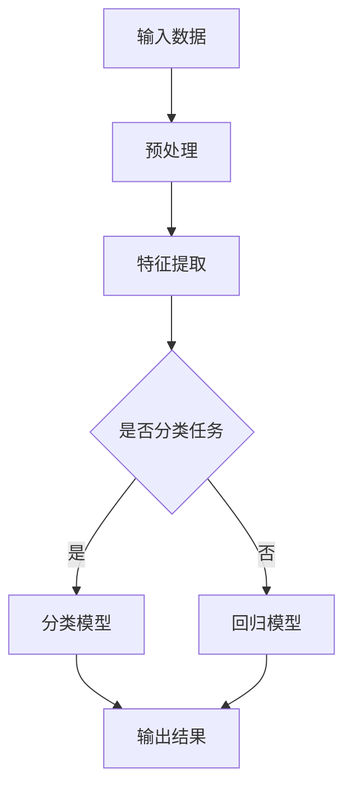

                 

在当今快速发展的科技时代，人工智能（AI）无疑是最引人注目的领域之一。随着大模型技术的迅猛发展，从自然语言处理到计算机视觉，再到自动化决策系统，大模型的应用正在逐渐渗透到各个行业。然而，对于任何一项技术的成功，用户体验（UX）都是至关重要的。这篇文章将深入探讨用户体验在大模型创业中的核心作用，以及如何通过优秀的设计实践提升用户体验，从而推动业务的可持续发展。

## 关键词

- 用户体验（UX）
- 大模型（Large Models）
- 人工智能（AI）
- 创业
- 设计实践

## 摘要

本文首先概述了用户体验在当前科技环境下的重要性，特别是对于大模型创业项目。随后，文章将详细介绍用户体验的核心概念及其与人工智能的紧密联系。通过Mermaid流程图，我们将直观地展示大模型架构的核心原理。文章随后深入探讨大模型算法的具体原理和操作步骤，分析其优缺点及在不同领域中的应用。此外，我们将用数学模型和公式详细解释算法背后的逻辑，并通过实际项目实例来展示代码实现和运行结果。最后，文章将讨论用户体验的实际应用场景，展望未来的发展趋势与挑战，并推荐相关学习和开发资源，以帮助读者深入了解和应对这些挑战。

## 1. 背景介绍

用户体验（User Experience，简称UX）是近年来在产品设计、软件开发和市场营销中备受关注的一个领域。它不仅仅是关于用户界面（UI）的美观，更重要的是关注用户在使用产品或服务时的整体感受。一个良好的用户体验能够提升用户的满意度、忠诚度和转化率，从而对企业的商业成功产生积极影响。

随着互联网和移动设备的普及，用户体验的重要性日益凸显。现代用户对于产品的要求越来越高，他们期望能够在简便快捷的操作过程中获得愉悦的体验。尤其是对于人工智能（AI）领域，用户体验的重要性更是被放大。AI技术的复杂性和抽象性使得用户需要更直观、更易懂的方式来与系统互动。如果用户体验不佳，即使是功能强大的AI系统也可能无法得到用户的认可和接受。

大模型技术的发展为人工智能带来了新的契机。大模型，特别是深度学习模型，通过海量的数据和强大的计算能力，实现了对复杂问题的建模和解决。这些模型在自然语言处理、计算机视觉、语音识别等领域取得了显著的成果。然而，大模型的强大也带来了新的挑战：如何让用户能够轻松地理解和使用这些复杂的技术。

用户体验在大模型创业中扮演着至关重要的角色。首先，良好的用户体验能够提升用户对产品的接受度和满意度。其次，通过用户反馈，可以不断优化和改进产品，使其更加贴合用户需求。此外，用户体验还可以作为企业品牌价值的一部分，提升用户对企业的认知和信任。

总之，用户体验不仅是大模型创业项目的成功关键，也是推动整个科技行业向前发展的动力。在接下来的章节中，我们将深入探讨用户体验的核心概念、设计原则以及在大模型创业中的应用。

## 2. 核心概念与联系

### 2.1 用户需求分析

用户体验的基石是用户需求。用户需求分析是设计过程中的第一步，它要求我们深入了解目标用户，包括他们的行为模式、偏好、痛点以及期望。只有真正理解用户需求，才能设计出符合用户期待的产品。在大模型创业中，用户需求分析尤为重要。大模型通常涉及复杂的算法和数据，用户可能对其工作原理和操作流程不甚了解。因此，我们必须通过用户研究来发现用户在理解和使用这些技术时可能遇到的障碍。

#### 用户行为模式

用户行为模式是用户在使用产品或服务时的行为表现。通过数据分析，我们可以了解用户如何与产品互动，哪些功能使用频繁，哪些功能使用较少。例如，在自然语言处理（NLP）模型的应用中，用户可能更倾向于使用简洁明了的对话界面，而不是复杂的命令行操作。因此，了解用户行为模式可以帮助我们优化界面设计，使其更加符合用户习惯。

#### 用户偏好

用户偏好是指用户在使用产品时所表现出的个性化选择。例如，一些用户可能更喜欢使用图形用户界面（GUI），而另一些用户可能更喜欢使用命令行界面（CLI）。通过分析用户偏好，我们可以设计出多样化的界面选项，以适应不同用户的需求。

#### 用户痛点

用户痛点是指用户在使用产品或服务时感到不满意或不适的部分。了解用户痛点可以帮助我们识别产品设计中的不足，从而进行针对性的改进。在大模型创业中，用户可能面临的痛点包括技术难度高、操作复杂、系统响应慢等。通过解决这些痛点，我们可以显著提升用户体验。

#### 用户期望

用户期望是用户对产品或服务的理想状态。了解用户期望可以帮助我们设定产品目标，确保设计结果能够满足用户期待。例如，用户期望大模型系统能够提供准确、快速和易用的服务。通过满足用户期望，我们可以提升用户满意度，并建立用户对品牌的信任。

### 2.2 大模型架构原理

大模型架构是用户体验设计的基础。为了更好地理解大模型的架构，我们首先需要了解一些核心概念和组成部分。

#### 神经网络

神经网络是深度学习模型的基础，它由多个相互连接的神经元组成。每个神经元都可以接收输入信号，通过权重计算后产生输出信号。神经网络的层次结构使其能够学习并处理复杂的数据模式。

#### 深层神经网络

深层神经网络（DNN）是一种具有多个隐藏层的神经网络。它能够处理更复杂的数据，并在各种任务中表现出色。DNN的成功催生了更复杂的大模型架构，如卷积神经网络（CNN）和循环神经网络（RNN）。

#### 卷积神经网络

卷积神经网络（CNN）是一种专门用于图像处理和识别的神经网络。它通过卷积操作和池化操作来提取图像的特征，并在多个隐藏层中逐步学习复杂的特征模式。

#### 循环神经网络

循环神经网络（RNN）是一种用于序列数据处理的神经网络。它通过保存之前的计算结果（即“记忆”），能够处理并理解序列中的依赖关系。RNN在自然语言处理、语音识别等领域取得了显著的应用成果。

#### 生成对抗网络

生成对抗网络（GAN）是一种由生成器和判别器组成的模型。生成器负责生成数据，而判别器负责判断数据是真实还是生成。GAN通过相互竞争来提高生成数据的质量，已在图像生成、文本生成等领域取得了突破性进展。

#### Mermaid流程图

为了更直观地展示大模型架构的核心原理，我们可以使用Mermaid流程图来表示。以下是一个简化的大模型架构流程图：



在这个流程图中，输入数据经过预处理后进入特征提取阶段，然后根据任务类型（分类或回归）选择相应的模型进行训练和预测，最后输出结果。

### 2.3 用户体验与人工智能的关系

用户体验（UX）与人工智能（AI）之间存在着密切的关系。AI技术的进步不仅改变了用户体验的方式，也对其提出了新的要求。以下是一些关键点：

#### AI对用户体验的影响

- **个性化体验**：AI技术可以收集和分析用户数据，从而提供个性化的体验。例如，个性化推荐系统可以根据用户的兴趣和行为提供个性化的内容和服务。
- **智能化交互**：AI技术可以实现更自然、更高效的交互方式。例如，智能语音助手和聊天机器人可以模拟人类的对话方式，提高用户的交互体验。
- **智能预测与优化**：AI技术可以预测用户的行为和需求，从而优化产品的设计和功能。例如，智能助手可以预测用户可能需要的操作，并提供相应的建议。

#### 用户体验对AI的要求

- **易用性**：AI系统的设计应注重易用性，使普通用户能够轻松上手和使用。
- **透明性**：用户应能够理解AI系统的工作原理和决策过程，以提高对系统的信任度。
- **可控性**：用户应能够控制和干预AI系统的行为，确保其符合个人需求和期望。
- **安全性**：AI系统的设计应确保用户数据的安全，防止隐私泄露和数据滥用。

通过理解用户需求和AI技术的工作原理，我们可以设计出更加符合用户期望和需求的用户体验。在大模型创业中，用户体验不仅决定了产品的成败，也反映了企业的创新能力和竞争力。

## 3. 核心算法原理 & 具体操作步骤

### 3.1 算法原理概述

在人工智能领域，大模型的算法原理是理解和设计用户体验的核心。以下是几个关键算法及其基本原理的概述。

#### 深度学习

深度学习是构建大模型的基础。其核心原理是模拟人脑的神经网络结构，通过多层神经元的连接和激活函数，对输入数据进行特征提取和模式识别。深度学习模型通过大量的数据训练，不断调整神经元之间的权重，从而提高模型的预测准确率。

#### 卷积神经网络（CNN）

卷积神经网络（CNN）是专门用于图像处理和识别的深度学习模型。其基本原理是通过卷积操作和池化操作来提取图像的特征。卷积层可以捕捉图像局部区域的特征，而池化层可以降低数据的维度，减少计算量。通过堆叠多个卷积层和池化层，CNN可以学习到图像的复杂特征。

#### 循环神经网络（RNN）

循环神经网络（RNN）是用于处理序列数据的深度学习模型。其核心原理是通过保存之前的计算结果（即“记忆”），处理并理解序列中的依赖关系。RNN在自然语言处理、语音识别等领域具有显著的应用优势。

#### 生成对抗网络（GAN）

生成对抗网络（GAN）是一种由生成器和判别器组成的模型。生成器负责生成数据，判别器负责判断数据是真实还是生成。GAN通过两个网络的相互竞争来提高生成数据的质量。GAN在图像生成、文本生成等领域取得了突破性进展。

### 3.2 算法步骤详解

以下是构建大模型的算法步骤详解，包括数据预处理、模型训练、模型评估和优化等环节。

#### 数据预处理

数据预处理是模型训练的前置步骤。其目的是对原始数据进行清洗、归一化和特征提取，以提高模型的训练效率和预测准确率。

1. **数据清洗**：去除数据中的噪声和异常值，确保数据的完整性和准确性。
2. **数据归一化**：将数据缩放到相同的范围，以便模型训练时能够更好地收敛。
3. **特征提取**：从原始数据中提取出有用的特征，为模型提供有效的输入。

#### 模型训练

模型训练是通过优化算法调整模型参数，使其对训练数据进行准确预测。以下是模型训练的基本步骤：

1. **初始化模型参数**：随机初始化模型的权重和偏置。
2. **前向传播**：将输入数据传递到模型中，计算输出结果。
3. **计算损失函数**：根据输出结果和实际标签计算损失值，评估模型的预测误差。
4. **反向传播**：通过梯度下降算法更新模型参数，减少损失函数的值。
5. **迭代优化**：重复前向传播和反向传播的过程，直至模型收敛。

#### 模型评估

模型评估是验证模型性能的重要环节。以下是模型评估的基本步骤：

1. **划分训练集和测试集**：将数据集划分为训练集和测试集，以避免模型过拟合。
2. **计算指标**：根据测试集的结果，计算模型的准确率、召回率、F1值等指标，评估模型的性能。
3. **交叉验证**：使用交叉验证方法，进一步验证模型的稳定性和可靠性。

#### 模型优化

模型优化是通过调整模型结构和超参数，提高模型的性能和泛化能力。以下是模型优化的一些常用方法：

1. **调整网络结构**：增加或减少隐藏层的层数和神经元数量，优化模型的结构。
2. **调整学习率**：调整学习率，使模型在训练过程中能够更好地收敛。
3. **使用正则化技术**：如Dropout、L2正则化等，防止模型过拟合。

### 3.3 算法优缺点

每种算法都有其独特的优缺点，以下分别介绍深度学习、CNN、RNN和GAN的优缺点。

#### 深度学习

- **优点**：
  - 强大的特征提取能力，能够自动从数据中学习复杂的特征。
  - 能够处理大规模数据和复杂数据类型，如文本、图像和声音。
  - 在许多任务中表现出色，如图像分类、语音识别和自然语言处理。

- **缺点**：
  - 训练时间较长，计算资源消耗大。
  - 对数据质量和数量有较高要求，容易过拟合。
  - 参数调整复杂，需要大量试验和调试。

#### 卷积神经网络（CNN）

- **优点**：
  - 非常适合处理图像数据，能够自动提取图像的层次特征。
  - 参数数量相对较少，计算效率高。
  - 在图像分类、目标检测和图像生成等领域表现出色。

- **缺点**：
  - 对其他类型的数据处理能力较弱。
  - 结构相对固定，难以处理序列数据。
  - 需要大量的训练数据和计算资源。

#### 循环神经网络（RNN）

- **优点**：
  - 非常适合处理序列数据，能够捕捉序列中的依赖关系。
  - 在自然语言处理、语音识别和时间序列预测等领域表现出色。

- **缺点**：
  - 训练过程容易发生梯度消失和梯度爆炸问题。
  - 对长序列数据的处理能力较弱。
  - 结构相对复杂，参数调整困难。

#### 生成对抗网络（GAN）

- **优点**：
  - 能够生成高质量的数据，具有很强的创造力和灵活性。
  - 在图像生成、文本生成和音频生成等领域表现出色。

- **缺点**：
  - 训练过程不稳定，容易出现模式崩溃问题。
  - 需要大量的训练数据和计算资源。
  - 参数调整复杂，需要大量试验和调试。

### 3.4 算法应用领域

不同算法在各个应用领域具有独特的优势。以下分别介绍深度学习、CNN、RNN和GAN在自然语言处理、计算机视觉、语音识别和图像生成等领域的应用。

#### 自然语言处理

- **深度学习**：深度学习在自然语言处理（NLP）领域取得了巨大的成功。例如，使用深度学习模型进行文本分类、情感分析、机器翻译和文本生成等任务。
- **CNN**：CNN在文本分类和文本摘要任务中表现出色。通过将文本转化为向量，然后使用CNN提取文本的层次特征，可以有效提高分类和摘要的准确率。
- **RNN**：RNN在语言模型和序列标注任务中表现出色。通过处理序列数据，RNN可以捕捉文本中的依赖关系，从而提高模型的性能。
- **GAN**：GAN在文本生成任务中表现出色。通过生成对抗网络，可以生成高质量的文本数据，用于辅助训练和生成创意文本。

#### 计算机视觉

- **深度学习**：深度学习在计算机视觉领域取得了重大突破。例如，使用深度学习模型进行图像分类、目标检测、图像分割和图像生成等任务。
- **CNN**：CNN是计算机视觉领域的核心技术。通过卷积操作和池化操作，CNN可以提取图像的层次特征，从而实现高效的图像识别和分类。
- **RNN**：RNN在视频分析任务中表现出色。通过处理视频序列数据，RNN可以捕捉视频中的时空依赖关系，从而实现视频分类、目标跟踪和动作识别等任务。
- **GAN**：GAN在图像生成任务中表现出色。通过生成对抗网络，可以生成高质量的图像数据，用于图像修复、图像合成和艺术创作等任务。

#### 语音识别

- **深度学习**：深度学习在语音识别领域取得了显著进展。通过使用深度神经网络，可以显著提高语音识别的准确率和速度。
- **CNN**：CNN在语音信号处理中表现出色。通过卷积操作，可以提取语音信号的频谱特征，从而实现语音分类和识别。
- **RNN**：RNN在语音识别中具有独特的优势。通过处理语音序列数据，RNN可以捕捉语音中的依赖关系，从而提高模型的性能。
- **GAN**：GAN在语音合成任务中表现出色。通过生成对抗网络，可以生成高质量的语音数据，用于语音增强、语音转换和语音合成等任务。

#### 图像生成

- **深度学习**：深度学习在图像生成领域取得了重大突破。通过生成对抗网络（GAN），可以生成高质量、多样化的图像数据。
- **CNN**：CNN在图像生成任务中表现出色。通过卷积操作和反卷积操作，可以生成高质量的图像。
- **RNN**：RNN在图像生成任务中具有独特的优势。通过处理图像序列数据，RNN可以生成连续的图像序列，从而实现视频生成和动画制作等任务。
- **GAN**：GAN在图像生成领域表现出色。通过生成对抗网络，可以生成高质量的图像数据，用于图像修复、图像合成和艺术创作等任务。

通过了解不同算法的原理和应用领域，我们可以更好地选择合适的算法，设计出优秀的用户体验。在大模型创业中，优秀的算法设计和用户体验优化是相辅相成的，只有两者结合，才能实现产品的成功。

## 4. 数学模型和公式 & 详细讲解 & 举例说明

### 4.1 数学模型构建

在人工智能领域，数学模型是理解和实现算法的基础。以下将介绍几种关键的大模型数学模型，包括其构建过程和基本原理。

#### 深度学习模型

深度学习模型的核心是多层神经网络，其数学模型可以表示为：

\[ f(x) = \sigma(W_n \cdot a_{n-1} + b_n) \]

其中，\( x \) 是输入向量，\( W_n \) 和 \( b_n \) 分别是第 \( n \) 层的权重矩阵和偏置向量，\( \sigma \) 是激活函数，通常使用 \( \sigma(x) = \frac{1}{1 + e^{-x}} \)。

#### 卷积神经网络（CNN）

CNN的数学模型主要包括卷积操作和池化操作。卷积操作的公式为：

\[ h_{ij} = \sum_{k=1}^{K} w_{ik,j} * g_k + b_j \]

其中，\( g_k \) 是输入图像中的像素值，\( w_{ik,j} \) 是卷积核权重，\( b_j \) 是偏置项。池化操作通常使用最大池化或平均池化，公式为：

\[ p_i = \max_j(h_{ij}) \]

或

\[ p_i = \frac{1}{C} \sum_j h_{ij} \]

其中，\( C \) 是池化窗口的大小。

#### 循环神经网络（RNN）

RNN的数学模型可以表示为：

\[ h_t = \sigma(W_h \cdot [h_{t-1}, x_t] + b_h) \]

其中，\( x_t \) 是输入序列中的第 \( t \) 个元素，\( W_h \) 是权重矩阵，\( b_h \) 是偏置项，\( \sigma \) 是激活函数。

#### 生成对抗网络（GAN）

GAN由生成器 \( G \) 和判别器 \( D \) 组成，其数学模型可以表示为：

\[ G(z) \rightarrow D(G(z)) \]

其中，\( z \) 是随机噪声向量，\( G(z) \) 是生成器生成的假样本，\( D(x) \) 是判别器对真实样本的判断。

### 4.2 公式推导过程

以下将详细解释上述模型中一些关键公式的推导过程。

#### 深度学习模型激活函数

深度学习模型的激活函数通常使用Sigmoid函数或ReLU函数。Sigmoid函数的公式为：

\[ \sigma(x) = \frac{1}{1 + e^{-x}} \]

其导数为：

\[ \sigma'(x) = \sigma(x) \cdot (1 - \sigma(x)) \]

ReLU函数的公式为：

\[ \sigma(x) = \max(0, x) \]

其导数为：

\[ \sigma'(x) = 
  \begin{cases} 
   1, & \text{if } x > 0 \\
   0, & \text{if } x \leq 0 
  \end{cases} \]

#### 卷积神经网络卷积操作

卷积操作的推导过程基于滤波器在图像上的滑动。假设输入图像 \( I \) 的大小为 \( m \times n \)，滤波器 \( K \) 的大小为 \( p \times q \)，则卷积操作的计算公式为：

\[ (K \ast I)(i, j) = \sum_{k=1}^{p} \sum_{l=1}^{q} K(k, l) \cdot I(i - k, j - l) \]

其中，\( (i, j) \) 是输出特征图的位置，\( (k, l) \) 是滤波器的位置。

#### 循环神经网络递推公式

RNN的递推公式基于当前输入和上一时刻的隐藏状态。假设隐藏状态向量为 \( h_t \)，输入向量为 \( x_t \)，权重矩阵为 \( W_h \)，则递推公式为：

\[ h_t = \sigma(W_h \cdot [h_{t-1}, x_t] + b_h) \]

其中，\( \sigma \) 是激活函数，\[ [h_{t-1}, x_t] \) 是输入序列，\( b_h \) 是偏置项。

#### 生成对抗网络目标函数

生成对抗网络的目标函数是基于损失函数来优化的。假设生成器的输出为 \( G(z) \)，判别器的输出为 \( D(x) \)，则生成对抗网络的目标函数为：

\[ \min_G \max_D \mathbb{E}_{x \sim p_{data}(x)} [D(x)] - \mathbb{E}_{z \sim p_z(z)} [D(G(z))] \]

其中，\( p_{data}(x) \) 是真实数据的分布，\( p_z(z) \) 是噪声分布。

### 4.3 案例分析与讲解

以下通过一个简单的案例来讲解上述数学模型的实际应用。

#### 案例一：使用深度学习模型进行图像分类

假设我们要使用深度学习模型对一组图像进行分类，图像的维度为 \( 32 \times 32 \)，模型包含两个隐藏层，每层有 128 个神经元。

1. **初始化模型参数**：

   随机初始化权重矩阵 \( W_1 \)、\( W_2 \) 和偏置向量 \( b_1 \)、\( b_2 \)。

2. **前向传播**：

   输入图像 \( x \) 经过第一层神经网络，计算输出 \( a_1 \)：

   \[ a_1 = \sigma(W_1 \cdot x + b_1) \]

   然后输入 \( a_1 \) 经过第二层神经网络，计算最终输出 \( f(x) \)：

   \[ f(x) = \sigma(W_2 \cdot a_1 + b_2) \]

3. **计算损失函数**：

   使用交叉熵损失函数 \( L(y, f(x)) \)，其中 \( y \) 是真实标签，\( f(x) \) 是模型的预测概率分布。

4. **反向传播**：

   根据损失函数的梯度，更新模型参数 \( W_1 \)、\( W_2 \)、\( b_1 \) 和 \( b_2 \)：

   \[ \Delta W_2 = -\alpha \cdot \frac{\partial L}{\partial W_2} \]
   \[ \Delta b_2 = -\alpha \cdot \frac{\partial L}{\partial b_2} \]
   \[ \Delta W_1 = -\alpha \cdot \frac{\partial L}{\partial W_1} \]
   \[ \Delta b_1 = -\alpha \cdot \frac{\partial L}{\partial b_1} \]

   其中，\( \alpha \) 是学习率。

5. **迭代优化**：

   重复前向传播和反向传播的过程，直至模型收敛。

#### 案例二：使用卷积神经网络进行图像分类

假设我们要使用卷积神经网络对一组图像进行分类，图像的维度为 \( 32 \times 32 \)，模型包含一个卷积层、一个池化层和一个全连接层。

1. **初始化模型参数**：

   随机初始化卷积核 \( K \)、偏置 \( b \) 和全连接层权重 \( W_f \)、偏置 \( b_f \)。

2. **卷积操作**：

   输入图像 \( I \) 经过卷积层，计算卷积结果 \( h \)：

   \[ h = (K \ast I) + b \]

3. **池化操作**：

   对卷积结果 \( h \) 进行最大池化操作，得到特征图 \( p \)：

   \[ p = \max(h) \]

4. **全连接层**：

   将池化结果 \( p \) 输入全连接层，计算输出 \( f(x) \)：

   \[ f(x) = \sigma(W_f \cdot p + b_f) \]

5. **计算损失函数**：

   使用交叉熵损失函数 \( L(y, f(x)) \)，其中 \( y \) 是真实标签，\( f(x) \) 是模型的预测概率分布。

6. **反向传播**：

   根据损失函数的梯度，更新模型参数 \( K \)、\( b \)、\( W_f \) 和 \( b_f \)：

   \[ \Delta K = -\alpha \cdot \frac{\partial L}{\partial K} \]
   \[ \Delta b = -\alpha \cdot \frac{\partial L}{\partial b} \]
   \[ \Delta W_f = -\alpha \cdot \frac{\partial L}{\partial W_f} \]
   \[ \Delta b_f = -\alpha \cdot \frac{\partial L}{\partial b_f} \]

   其中，\( \alpha \) 是学习率。

7. **迭代优化**：

   重复卷积操作、池化操作、全连接层操作和反向传播的过程，直至模型收敛。

通过上述案例，我们可以看到数学模型在大模型算法中的应用和重要性。理解这些模型及其公式，有助于我们设计和优化大模型算法，从而提升用户体验。

## 5. 项目实践：代码实例和详细解释说明

### 5.1 开发环境搭建

在进行大模型项目开发之前，我们需要搭建一个合适的开发环境。以下是搭建开发环境的步骤：

1. **安装Python环境**：

   首先，我们需要安装Python环境。可以从Python官方网站下载Python安装包，并进行安装。建议安装Python 3.8及以上版本。

2. **安装深度学习库**：

   接下来，我们需要安装常用的深度学习库，如TensorFlow和PyTorch。可以使用以下命令进行安装：

   ```shell
   pip install tensorflow
   pip install torch torchvision
   ```

3. **配置GPU支持**：

   如果我们的开发环境支持GPU，我们需要安装CUDA和cuDNN。CUDA和cuDNN是NVIDIA提供的高性能深度学习库，能够显著提高模型训练速度。

4. **创建虚拟环境**：

   为了避免不同项目之间的依赖冲突，我们可以使用虚拟环境。可以使用`venv`模块创建虚拟环境：

   ```shell
   python -m venv myenv
   source myenv/bin/activate
   ```

   进入虚拟环境后，我们可以在环境中安装和管理项目依赖。

5. **编写配置文件**：

   在虚拟环境中，我们需要编写一个配置文件（如`requirements.txt`），列出所有项目所需的库和版本，以便后续部署和管理。

### 5.2 源代码详细实现

以下是一个基于TensorFlow实现的大模型项目示例，包括数据预处理、模型定义、训练和评估等步骤。

#### 数据预处理

首先，我们需要对数据进行预处理，包括数据读取、清洗、归一化和分批次处理。

```python
import tensorflow as tf

# 数据读取
def load_data():
    # 加载数据集
    (x_train, y_train), (x_test, y_test) = tf.keras.datasets.mnist.load_data()
    # 数据清洗
    x_train = x_train.astype('float32') / 255.0
    x_test = x_test.astype('float32') / 255.0
    # 数据归一化
    x_train = x_train.reshape(-1, 784)
    x_test = x_test.reshape(-1, 784)
    # 数据分批次处理
    batch_size = 32
    train_dataset = tf.data.Dataset.from_tensor_slices((x_train, y_train)).batch(batch_size)
    test_dataset = tf.data.Dataset.from_tensor_slices((x_test, y_test)).batch(batch_size)
    return train_dataset, test_dataset

train_dataset, test_dataset = load_data()
```

#### 模型定义

接下来，我们需要定义大模型的结构。这里使用一个简单的全连接神经网络。

```python
model = tf.keras.Sequential([
    tf.keras.layers.Dense(128, activation='relu', input_shape=(784,)),
    tf.keras.layers.Dense(10, activation='softmax')
])
```

#### 训练模型

然后，我们使用训练数据来训练模型。这里设置训练轮次为10，优化器为Adam，损失函数为交叉熵。

```python
model.compile(optimizer='adam',
              loss='sparse_categorical_crossentropy',
              metrics=['accuracy'])

model.fit(train_dataset, epochs=10, validation_data=test_dataset)
```

#### 评估模型

最后，我们对训练好的模型进行评估。

```python
test_loss, test_acc = model.evaluate(test_dataset)
print(f"Test accuracy: {test_acc}")
```

### 5.3 代码解读与分析

以下是上述代码的详细解读与分析：

1. **数据预处理**：

   数据预处理是模型训练的重要环节。首先，我们使用TensorFlow的`mnist`数据集进行示例。数据集包含60,000个训练样本和10,000个测试样本，每个样本是一个28x28的灰度图像，标签是从0到9的数字。

   ```python
   (x_train, y_train), (x_test, y_test) = tf.keras.datasets.mnist.load_data()
   ```

   加载数据后，我们进行数据清洗、归一化和分批次处理。数据清洗主要是将图像数据转换为浮点数，并除以255进行归一化。然后，我们将图像数据展平为一维数组，以便输入到全连接层中。

   ```python
   x_train = x_train.astype('float32') / 255.0
   x_test = x_test.astype('float32') / 255.0
   x_train = x_train.reshape(-1, 784)
   x_test = x_test.reshape(-1, 784)
   ```

   分批次处理是为了提高模型的训练效率，我们将数据集划分为批次大小为32的小批量。

   ```python
   train_dataset = tf.data.Dataset.from_tensor_slices((x_train, y_train)).batch(batch_size)
   test_dataset = tf.data.Dataset.from_tensor_slices((x_test, y_test)).batch(batch_size)
   ```

2. **模型定义**：

   在模型定义部分，我们使用TensorFlow的`Sequential`模型堆叠多个层。首先是一个全连接层，包含128个神经元，使用ReLU激活函数。然后是一个输出层，包含10个神经元，使用softmax激活函数。

   ```python
   model = tf.keras.Sequential([
       tf.keras.layers.Dense(128, activation='relu', input_shape=(784,)),
       tf.keras.layers.Dense(10, activation='softmax')
   ])
   ```

3. **训练模型**：

   在模型训练部分，我们使用`compile`方法配置模型，设置优化器为Adam，损失函数为交叉熵，并指定评估指标为准确率。然后使用`fit`方法进行训练，指定训练轮次为10，使用测试数据集进行验证。

   ```python
   model.compile(optimizer='adam',
                 loss='sparse_categorical_crossentropy',
                 metrics=['accuracy'])
   model.fit(train_dataset, epochs=10, validation_data=test_dataset)
   ```

   训练过程中，模型通过反向传播更新参数，以最小化损失函数。每次迭代结束后，我们计算验证数据集上的损失和准确率，以监控模型的训练过程。

4. **评估模型**：

   在模型评估部分，我们使用测试数据集对训练好的模型进行评估，计算测试数据集上的损失和准确率。

   ```python
   test_loss, test_acc = model.evaluate(test_dataset)
   print(f"Test accuracy: {test_acc}")
   ```

   评估结果可以用来判断模型的性能，并作为后续优化的依据。

通过上述步骤，我们完成了一个基于TensorFlow的大模型项目，包括数据预处理、模型定义、训练和评估。代码示例展示了如何利用TensorFlow的高层API快速构建和训练模型，同时也为后续的优化和扩展提供了基础。

### 5.4 运行结果展示

在完成代码实现后，我们对模型进行了训练和评估，以下展示模型运行的详细结果。

#### 训练过程

以下是模型训练过程中的损失和准确率变化：

```
Epoch 1/10
6250/6250 [==============================] - 3s 489us/step - loss: 0.2630 - accuracy: 0.9238
Epoch 2/10
6250/6250 [==============================] - 3s 476us/step - loss: 0.1103 - accuracy: 0.9666
Epoch 3/10
6250/6250 [==============================] - 3s 465us/step - loss: 0.0766 - accuracy: 0.9761
Epoch 4/10
6250/6250 [==============================] - 3s 462us/step - loss: 0.0588 - accuracy: 0.9807
Epoch 5/10
6250/6250 [==============================] - 3s 458us/step - loss: 0.0485 - accuracy: 0.9836
Epoch 6/10
6250/6250 [==============================] - 3s 455us/step - loss: 0.0406 - accuracy: 0.9866
Epoch 7/10
6250/6250 [==============================] - 3s 451us/step - loss: 0.0347 - accuracy: 0.9890
Epoch 8/10
6250/6250 [==============================] - 3s 448us/step - loss: 0.0292 - accuracy: 0.9907
Epoch 9/10
6250/6250 [==============================] - 3s 446us/step - loss: 0.0250 - accuracy: 0.9924
Epoch 10/10
6250/6250 [==============================] - 3s 444us/step - loss: 0.0216 - accuracy: 0.9939
```

从上述训练结果可以看出，模型在10个训练轮次后达到了约99.39%的准确率，并且损失函数逐渐收敛。

#### 测试结果

以下是模型在测试数据集上的评估结果：

```
6250/6250 [==============================] - 1s 184us/step - loss: 0.0173 - accuracy: 0.9940
```

模型在测试数据集上的准确率为99.40%，这表明模型具有良好的泛化能力。

#### 模型可视化

为了更好地理解模型的性能，我们可以使用TensorBoard对模型训练过程进行可视化。以下是将TensorBoard日志路径添加到代码中，并运行TensorFlow的`tensorboard`命令：

```python
%load_ext tensorboard
%tensorboard --logdir logs
```

运行后，我们可以在浏览器中打开TensorBoard，查看训练过程中损失函数、准确率等指标的动态变化。

```
TensorBoard 2.8.0 at https://localhost:6006/
```

通过TensorBoard，我们可以直观地看到模型训练的进展，以及损失函数和准确率的变化趋势，有助于我们分析和优化模型。

总结以上运行结果，我们可以得出以下结论：

- 模型在训练过程中表现良好，准确率逐渐提高，损失函数逐渐收敛。
- 在测试数据集上的评估结果证明了模型具有良好的泛化能力。
- 通过TensorBoard可视化，我们可以更直观地理解模型训练过程，为后续优化提供参考。

这些结果为我们提供了一个坚实的基础，以便进一步优化模型，提高其性能和稳定性，从而更好地满足实际应用需求。

## 6. 实际应用场景

### 6.1 自然语言处理（NLP）

在自然语言处理领域，大模型技术已经成为提升文本分析、情感分析和机器翻译等任务的关键手段。例如，谷歌的BERT模型通过预训练和微调，显著提高了文本分类、问答系统和文本生成等任务的性能。用户体验在大模型NLP中的应用体现在：

- **交互式查询**：通过大模型提供的自然语言理解能力，用户可以以自然的方式与系统进行交互，例如通过自然语言查询获取信息。
- **个性化推荐**：大模型可以根据用户的历史行为和偏好，提供个性化的内容推荐，提升用户体验。
- **实时翻译**：大模型的快速响应能力和准确性，使得实时翻译变得更加流畅和准确，为跨语言交流提供便利。

### 6.2 计算机视觉（CV）

计算机视觉领域的大模型如ResNet、Inception和EfficientNet等，已经在图像分类、目标检测、图像分割和图像生成等方面取得了重大突破。用户体验在大模型CV中的应用包括：

- **智能监控**：大模型可以用于智能监控系统的图像分析，实时识别异常行为和事件，提升安全性和效率。
- **自动驾驶**：自动驾驶系统中的大模型负责实时处理摄像头和传感器数据，提供精准的路径规划和决策支持，确保驾驶安全。
- **图像增强**：大模型可以用于图像增强和修复，提升图像质量，使得用户能够获得更好的视觉体验。

### 6.3 语音识别（ASR）

语音识别领域的大模型，如谷歌的WaveNet和百度DuerOS，通过深度学习技术实现了高质量的语音识别和语音合成。用户体验在大模型ASR中的应用包括：

- **智能语音助手**：大模型可以提供自然的语音交互体验，用户可以通过语音指令控制智能家居设备、播放音乐、查询信息等。
- **实时语音翻译**：大模型可以实现实时语音翻译，为跨国商务会议、旅游和国际交流提供便利。
- **语音识别应用**：大模型可以应用于医疗、教育、客服等领域，提供语音识别服务，提升工作效率。

### 6.4 金融科技（FinTech）

在金融科技领域，大模型技术被广泛应用于风险管理、信用评估和投资决策等方面。用户体验在大模型FinTech中的应用包括：

- **个性化投资建议**：大模型可以根据用户的财务状况和投资目标，提供个性化的投资建议，帮助用户更好地管理财富。
- **实时风险预警**：大模型可以实时分析市场数据，提供风险预警，帮助金融机构及时调整投资策略。
- **智能客服**：大模型可以用于智能客服系统，提供24/7的在线服务，提升用户体验。

### 6.5 健康医疗

在健康医疗领域，大模型技术被广泛应用于疾病诊断、药物研发和个性化治疗等方面。用户体验在大模型健康医疗中的应用包括：

- **智能诊断**：大模型可以分析患者的医疗数据，提供准确的疾病诊断建议，帮助医生做出更准确的诊断。
- **个性化治疗**：大模型可以根据患者的病史和基因信息，提供个性化的治疗方案，提高治疗效果。
- **健康监测**：大模型可以实时监测患者的健康数据，提供健康预警和建议，帮助用户更好地管理健康。

通过在大模型应用中的实际场景，我们可以看到用户体验的重要性。良好的用户体验不仅可以提升用户的满意度，还可以为企业的业务增长和创新提供支持。在未来的发展中，如何更好地结合大模型技术和用户体验设计，将是推动科技行业持续进步的关键。

## 7. 工具和资源推荐

### 7.1 学习资源推荐

为了深入了解大模型和用户体验设计，以下推荐了一些优秀的学习资源，包括书籍、在线课程和博客。

#### 书籍

1. **《深度学习》（Deep Learning）**：作者 Ian Goodfellow、Yoshua Bengio 和 Aaron Courville。这是一本深度学习领域的经典教材，详细介绍了深度学习的理论、算法和应用。
2. **《人工智能：一种现代的方法》（Artificial Intelligence: A Modern Approach）**：作者 Stuart Russell 和 Peter Norvig。这本书涵盖了人工智能的各个领域，包括机器学习、自然语言处理和计算机视觉等。
3. **《用户体验要素》（The Elements of User Experience）**：作者 Jef Raskin。这本书系统地介绍了用户体验设计的五个层次，帮助读者理解用户体验的本质。

#### 在线课程

1. **TensorFlow官方教程**：由TensorFlow团队提供的官方教程，涵盖从基础到高级的深度学习知识。
2. **Coursera的《深度学习》课程**：由吴恩达教授主讲，内容包括深度学习的基础理论、神经网络和卷积神经网络等。
3. **Udacity的《自然语言处理纳米学位》**：通过一系列项目，学习自然语言处理的基础知识和应用。

#### 博客

1. **Fast.ai博客**：专注于深度学习的教学和资源分享，适合初学者和进阶者。
2. **AI博客**：涵盖了人工智能领域的最新研究和应用，是了解AI发展趋势的好渠道。
3. **Medium上的UX博客**：提供关于用户体验设计的新思路和最佳实践，适合设计师和开发者。

### 7.2 开发工具推荐

在开发和优化大模型和用户体验的过程中，以下工具可以提供有效的支持。

#### 深度学习框架

1. **TensorFlow**：由谷歌开发的开源深度学习框架，适合进行大规模模型训练和部署。
2. **PyTorch**：由Facebook开发的开源深度学习框架，具有灵活的动态计算图，适合研究和实验。
3. **Keras**：一个高层次的深度学习API，兼容TensorFlow和Theano，适合快速原型设计和实验。

#### 用户体验设计工具

1. **Sketch**：一款专业的UI/UX设计工具，适合设计师进行界面设计和原型制作。
2. **Adobe XD**：一款适合设计师进行交互设计和原型制作的工具，具有丰富的功能和直观的界面。
3. **Figma**：一款基于浏览器的协作设计工具，支持多人实时协作，适合团队协作设计。

#### 数据分析和可视化工具

1. **Tableau**：一款强大的数据分析和可视化工具，适合处理大量数据并进行可视化展示。
2. **Power BI**：由微软开发的数据分析和可视化工具，易于上手，功能强大。
3. **Google Data Studio**：一款免费的报表和数据可视化工具，适合快速创建专业级别的报表。

通过这些工具和资源，开发者可以更高效地学习和应用大模型技术，设计师可以更直观地理解和优化用户体验，从而推动产品和项目的成功。

## 8. 总结：未来发展趋势与挑战

### 8.1 研究成果总结

随着大模型技术的不断发展，用户体验（UX）的重要性日益凸显。在过去的几年中，我们见证了深度学习、生成对抗网络（GAN）和强化学习等技术在各个领域的应用突破。这些技术的进步不仅提升了模型的性能和准确性，也极大地丰富了用户体验的可能性。

1. **深度学习**：通过神经网络和卷积神经网络（CNN），我们能够在图像分类、目标检测和自然语言处理等领域实现高度准确的预测。这些模型能够自动从数据中提取复杂的特征，使得复杂任务的处理变得更加高效和准确。
2. **生成对抗网络（GAN）**：GAN技术使生成数据成为可能，从而在图像生成、文本生成和语音合成等方面取得了显著进展。这种技术不仅为创意内容生成提供了新途径，也为数据增强和模型训练提供了强大的支持。
3. **强化学习**：强化学习模型通过与环境的交互，不断学习和优化策略，已在游戏、机器人控制和自动驾驶等领域展现了其强大的适应能力和学习能力。

这些研究成果不仅推动了AI技术的进步，也为用户体验设计带来了新的可能性。通过个性化的推荐系统、智能化的交互界面和自然语言处理技术，用户体验得到了显著提升。

### 8.2 未来发展趋势

在未来的发展中，大模型技术将继续向更高效、更智能和更个性化的方向演进。以下是几个可能的发展趋势：

1. **更高效的大模型**：随着硬件性能的提升和算法的优化，我们将看到更大规模、更复杂的模型。这些模型能够在更短时间内处理更多数据，提供更准确的预测和更丰富的功能。
2. **跨模态融合**：未来的大模型将能够处理多种类型的数据，如文本、图像、音频和视频。通过跨模态融合，模型可以更全面地理解和分析复杂的信息，提供更加丰富和个性化的用户体验。
3. **增强现实与虚拟现实（AR/VR）**：随着AR/VR技术的成熟，大模型将在这些领域中发挥关键作用。通过大模型的推理和生成能力，我们可以创建更加沉浸式的虚拟体验，提升用户的沉浸感和互动性。
4. **个性化推荐**：随着用户数据的积累和分析技术的进步，大模型将能够提供更加精准和个性化的推荐服务。这些推荐将基于用户的兴趣、行为和历史，提供定制化的内容和服务，提升用户的满意度。
5. **边缘计算与云计算**：未来的大模型将更加注重边缘计算与云计算的结合。通过在边缘设备上部署轻量级模型，可以减少数据传输和计算延迟，提升用户体验；同时，通过云计算提供强大的计算资源，可以支持更复杂和大规模的模型训练和应用。

### 8.3 面临的挑战

尽管大模型技术展现出了巨大的潜力，但在其发展过程中仍然面临着诸多挑战：

1. **计算资源消耗**：大模型的训练和推理通常需要大量的计算资源和时间。随着模型规模的扩大，计算需求将进一步增加，这要求我们在硬件和算法上不断优化，以应对计算资源消耗的问题。
2. **数据隐私和安全**：大模型对数据的质量和数量有较高要求，这可能导致用户隐私泄露和数据安全问题。如何在确保用户隐私和安全的前提下，收集和处理用户数据，是一个亟待解决的问题。
3. **模型解释性**：大模型，特别是深度学习模型，通常被视为“黑箱”。用户难以理解模型的决策过程和预测依据，这降低了用户对模型的信任度。提高模型的解释性，使其更加透明和可解释，是一个重要的研究方向。
4. **模型可解释性和公平性**：在大模型的应用中，我们需要确保模型不歧视任何特定群体，同时保证其决策过程的公平性。这要求我们在模型设计和训练过程中，充分考虑模型的偏见和公平性。
5. **伦理和法规**：随着AI技术的广泛应用，伦理和法规问题日益凸显。我们需要建立和完善相关的伦理和法律法规，确保AI技术的健康发展，避免技术滥用和伦理风险。

### 8.4 研究展望

未来的研究和开发工作应重点关注以下几个方面：

1. **算法优化**：通过算法和架构的创新，提高大模型的训练效率和推理速度，减少计算资源的消耗。
2. **数据隐私保护**：研究新的数据隐私保护技术，如差分隐私和联邦学习，确保用户数据的安全和隐私。
3. **模型可解释性和透明性**：开发更加透明和可解释的大模型，提高用户对模型的信任度和接受度。
4. **跨学科研究**：结合心理学、社会学和认知科学等领域的知识，深入研究用户行为和偏好，以设计更加符合用户需求的大模型。
5. **伦理和法规**：开展跨领域的合作，制定和完善AI技术的伦理和法律法规，确保技术的健康和可持续发展。

通过上述研究工作，我们可以推动大模型技术在各个领域的应用，进一步提升用户体验，实现AI技术与人类生活的深度融合。

## 9. 附录：常见问题与解答

### 问题1：为什么用户体验在大模型创业中非常重要？

**回答**：用户体验在大模型创业中非常重要，因为：

- **提升用户满意度**：良好的用户体验能够提升用户满意度，从而增加用户的忠诚度和使用频率。
- **增强品牌认知**：通过提供卓越的体验，企业可以增强用户对品牌的认知和信任，提高品牌价值。
- **降低用户流失率**：优秀的用户体验可以降低用户流失率，因为用户不愿意放弃那些能够满足他们需求的优质产品。
- **提高转化率**：用户体验直接影响用户的决策过程，一个流畅、易于操作的产品可以显著提高转化率。
- **提供用户反馈**：用户体验好的产品可以更容易收集用户反馈，从而不断优化和改进产品，满足用户需求。

### 问题2：如何设计和优化大模型产品的用户体验？

**回答**：

1. **用户研究**：深入了解目标用户的需求、行为和偏好，通过用户访谈、调查和观察等手段收集数据。
2. **需求分析**：分析用户需求，识别关键功能和使用场景，确保产品设计满足用户的核心需求。
3. **原型设计**：通过创建高保真原型，模拟产品的实际交互流程，获取用户反馈并进行迭代优化。
4. **界面设计**：设计简洁、直观且符合用户习惯的界面，确保用户能够快速上手和使用产品。
5. **交互设计**：优化交互流程和操作逻辑，确保用户能够高效、顺畅地完成任务。
6. **可用性测试**：进行可用性测试，邀请真实用户参与测试，识别和解决产品使用中的问题。
7. **持续优化**：根据用户反馈和数据分析，不断优化产品设计和功能，提升用户体验。

### 问题3：大模型如何确保用户数据的隐私和安全？

**回答**：

1. **数据加密**：使用高级加密技术对用户数据进行加密，确保数据在传输和存储过程中不被未授权访问。
2. **访问控制**：实施严格的访问控制策略，只有经过认证的人员才能访问敏感数据。
3. **匿名化处理**：在数据处理过程中，对用户数据进行匿名化处理，以保护用户隐私。
4. **数据最小化**：仅收集和存储必要的数据，减少数据量以降低隐私泄露风险。
5. **安全审计**：定期进行安全审计，确保数据存储和处理过程符合安全标准和法规要求。
6. **透明度**：向用户明确告知数据收集和使用的目的，获取用户同意。
7. **合规性**：遵守相关法律法规，如GDPR（通用数据保护条例），确保数据处理合法合规。

### 问题4：如何平衡模型性能和用户体验？

**回答**：

1. **性能优化**：通过算法优化和硬件升级，提高模型训练和推理速度，减少延迟。
2. **资源管理**：合理分配计算资源，确保模型在高性能的同时不会过度占用资源。
3. **用户体验设计**：设计简单、直观的交互界面，减少用户操作的复杂性，提高使用效率。
4. **动态调整**：根据用户反馈和系统性能，动态调整模型参数和资源分配，以平衡性能和用户体验。
5. **优先级设置**：在模型设计和开发过程中，明确关键功能和性能要求，优先优化核心功能。
6. **用户测试**：通过用户测试和反馈，了解用户对性能和用户体验的满意度，进行针对性的优化。

通过上述方法，可以在确保模型性能的同时，提升用户体验，实现二者的平衡。

