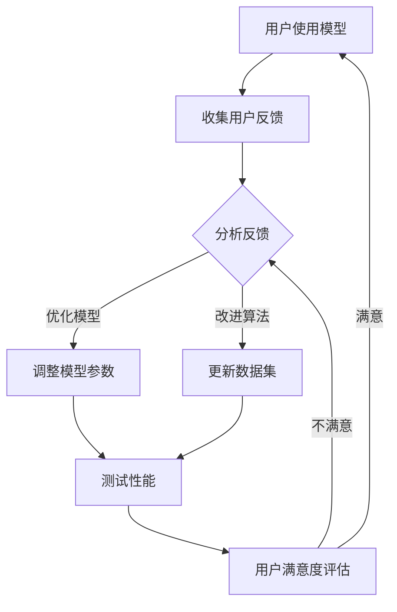

                 

### 关键词 Keywords
- 用户反馈
- 大模型创业
- 人工智能
- 数据分析
- 商业模式

<|assistant|>### 摘要 Abstract
本文深入探讨了用户反馈在大型模型创业中的重要性，探讨了用户反馈对于模型性能优化、用户体验提升和商业模式创新的关键作用。文章首先介绍了用户反馈的基本概念和其在商业环境中的重要性，然后通过实际案例分析，阐述了用户反馈在模型开发和商业应用中的具体应用。此外，文章还分析了用户反馈驱动的商业模式创新，探讨了未来的发展趋势和面临的挑战。本文旨在为从事大模型创业的从业者提供宝贵的参考和指导。

<|assistant|>## 1. 背景介绍 Background

随着人工智能技术的飞速发展，大模型（如深度学习模型、语言模型等）在各个领域取得了显著的成果。大模型的应用不仅提升了传统行业的智能化水平，还催生了众多新兴的商业模式。然而，大模型的开发和优化过程往往面临诸多挑战，其中用户反馈显得尤为重要。用户反馈不仅是模型性能优化的关键因素，也是提升用户体验和实现商业模式创新的重要驱动力。

在商业环境中，用户反馈被视为企业获取竞争优势的重要资源。通过用户反馈，企业可以深入了解用户的需求和痛点，从而优化产品和服务，提高用户满意度。此外，用户反馈还可以帮助企业识别市场趋势，预测未来需求，进而调整战略方向，实现商业模式创新。

本文旨在探讨用户反馈在大模型创业中的重要性，分析用户反馈在模型性能优化、用户体验提升和商业模式创新中的应用，以及未来发展趋势和面临的挑战。通过本文的研究，希望为从事大模型创业的从业者提供有价值的参考和指导。

<|assistant|>## 2. 核心概念与联系 Core Concepts and Relationships

### 用户反馈 User Feedback

用户反馈是指用户在使用产品或服务过程中提供的信息，包括评价、建议、投诉等。用户反馈可以来源于多种渠道，如在线评论、问卷调查、用户访谈等。用户反馈是了解用户需求、优化产品和服务的重要途径。

### 大模型 Large Models

大模型是指参数数量庞大、计算复杂度高的机器学习模型，如深度学习模型、语言模型等。大模型在图像识别、自然语言处理、推荐系统等领域取得了显著成果，但同时也面临着计算资源消耗大、优化难度高、解释性差等问题。

### 用户反馈与大型模型的关系 Relationship Between User Feedback and Large Models

用户反馈对于大型模型的开发和优化具有重要意义。首先，用户反馈可以帮助识别模型存在的问题，如预测误差、性能瓶颈等。通过分析用户反馈，开发者可以针对性地调整模型参数、改进算法，提高模型性能。其次，用户反馈可以提供丰富的数据资源，用于模型的训练和测试。真实世界的用户反馈数据往往包含了大量的噪声和不确定性，这对于提高模型泛化能力和鲁棒性具有重要意义。此外，用户反馈还可以驱动模型的应用场景创新，促进商业模式的发展。

### Mermaid 流程图 Mermaid Flowchart

以下是一个简化的用户反馈驱动大型模型开发与优化的 Mermaid 流程图：



在上述流程中，用户使用模型后提供反馈，开发者通过分析反馈对模型进行优化。优化过程可能涉及参数调整、算法改进、数据集更新等多个环节。通过不断迭代优化，最终提升用户满意度。

<|assistant|>## 3. 核心算法原理 & 具体操作步骤 Core Algorithm Principles & Detailed Steps

### 3.1 算法原理概述 Overview of Algorithm Principles

用户反馈驱动的模型优化主要依赖于以下算法原理：

1. **模型评估**：通过评估函数（如损失函数）计算模型在用户反馈数据上的性能。
2. **梯度下降**：基于评估函数的梯度，迭代调整模型参数，以最小化损失函数。
3. **反馈聚合**：将多个用户反馈进行聚合，以减少噪声和偏差，提高算法稳定性。
4. **模型解释**：通过模型解释技术，理解模型决策过程，优化用户反馈质量。

### 3.2 算法步骤详解 Detailed Steps of Algorithm

#### 步骤一：模型训练和评估 Training and Evaluation of Model

1. **数据收集**：收集用户在使用模型过程中的反馈数据，包括评价、建议、投诉等。
2. **数据预处理**：对收集到的数据进行清洗、去噪、归一化等预处理操作。
3. **模型训练**：使用预处理后的数据训练模型，并评估模型在训练集和测试集上的性能。
4. **性能评估**：根据评估结果，调整模型参数，优化模型性能。

#### 步骤二：用户反馈分析 Analysis of User Feedback

1. **反馈分类**：将用户反馈按照类型（如正面反馈、负面反馈）进行分类。
2. **反馈聚合**：对相似的用户反馈进行聚合，以减少噪声和重复信息。
3. **反馈解析**：通过自然语言处理技术，解析用户反馈中的关键信息，如用户需求、痛点等。

#### 步骤三：模型优化 Model Optimization

1. **梯度计算**：计算模型在用户反馈数据上的梯度，以评估模型参数的调整方向。
2. **参数调整**：根据梯度信息，迭代调整模型参数，优化模型性能。
3. **算法改进**：根据用户反馈，改进模型算法，提高模型解释性和鲁棒性。

#### 步骤四：模型测试和迭代 Testing and Iteration of Model

1. **测试性能**：在测试集上评估模型性能，确保优化后的模型满足用户需求。
2. **用户满意度评估**：通过用户反馈评估模型优化效果，判断用户满意度。
3. **模型迭代**：根据用户满意度评估结果，继续优化模型，提升用户体验。

### 3.3 算法优缺点 Advantages and Disadvantages of Algorithm

#### 优点 Advantages

1. **提升模型性能**：用户反馈能够为模型优化提供真实世界的反馈，有效提升模型性能。
2. **降低开发成本**：通过用户反馈，可以快速识别模型存在的问题，减少反复试验和调整的成本。
3. **提高用户体验**：根据用户反馈优化模型，能够更好地满足用户需求，提升用户体验。

#### 缺点 Disadvantages

1. **噪声干扰**：用户反馈中可能包含噪声和偏见，影响算法的稳定性。
2. **数据依赖**：算法性能依赖于用户反馈数据的质量和数量，数据缺失或不准确可能导致算法失效。
3. **解释性挑战**：大模型的复杂性和黑盒特性使得模型解释变得困难，影响用户信任和接受度。

### 3.4 算法应用领域 Application Fields of Algorithm

用户反馈驱动的模型优化算法广泛应用于以下领域：

1. **智能推荐系统**：通过分析用户反馈，优化推荐算法，提高推荐质量。
2. **自然语言处理**：利用用户反馈优化语言模型，提高文本生成和语义理解能力。
3. **图像识别**：基于用户反馈，改进图像识别算法，提升识别准确率。
4. **金融风控**：通过用户反馈，优化金融模型，提高风险识别和预测能力。

<|assistant|>## 4. 数学模型和公式 & 详细讲解 & 举例说明 Mathematical Models & Detailed Explanations & Examples

### 4.1 数学模型构建 Construction of Mathematical Model

在用户反馈驱动的模型优化过程中，常用的数学模型包括损失函数、梯度下降算法和反馈聚合算法。

#### 损失函数 Loss Function

损失函数用于衡量模型预测结果与真实值之间的差距，常用的损失函数包括均方误差（MSE）、交叉熵损失等。以下是一个简单的均方误差损失函数：

$$
L(\theta) = \frac{1}{2n} \sum_{i=1}^{n} (y_i - \hat{y}_i)^2
$$

其中，$n$为样本数量，$y_i$为真实值，$\hat{y}_i$为模型预测值，$\theta$为模型参数。

#### 梯度下降算法 Gradient Descent Algorithm

梯度下降算法用于根据损失函数的梯度，迭代调整模型参数，以最小化损失函数。以下是一个简单的梯度下降算法步骤：

1. 初始化模型参数$\theta$。
2. 计算损失函数关于参数$\theta$的梯度$g(\theta)$。
3. 更新模型参数$\theta$：
   $$
   \theta := \theta - \alpha g(\theta)
   $$
   其中，$\alpha$为学习率。

#### 反馈聚合算法 Feedback Aggregation Algorithm

反馈聚合算法用于对多个用户反馈进行聚合，以减少噪声和重复信息。以下是一个简单的反馈聚合算法：

1. 收集多个用户反馈$y_1, y_2, ..., y_n$。
2. 计算用户反馈的均值$\bar{y}$：
   $$
   \bar{y} = \frac{1}{n} \sum_{i=1}^{n} y_i
   $$
3. 使用均值$\bar{y}$作为聚合后的反馈，用于模型优化。

### 4.2 公式推导过程 Derivation Process of Mathematical Formulas

#### 损失函数的导数 Derivative of Loss Function

对于均方误差损失函数，其关于模型参数$\theta$的导数为：

$$
\frac{\partial L}{\partial \theta} = -\frac{1}{n} \sum_{i=1}^{n} (y_i - \hat{y}_i) \frac{\partial \hat{y}_i}{\partial \theta}
$$

其中，$\hat{y}_i$关于$\theta$的导数可以通过链式法则求得。

#### 梯度下降算法的优化方向 Optimization Direction of Gradient Descent Algorithm

根据损失函数的导数，梯度下降算法的优化方向为：

$$
\theta := \theta - \alpha \frac{\partial L}{\partial \theta}
$$

其中，$\alpha$为学习率，用于调整参数更新的步长。

### 4.3 案例分析与讲解 Case Analysis and Explanation

#### 案例一：智能推荐系统 Case 1: Intelligent Recommendation System

假设一个电商平台的推荐系统，根据用户的历史购买记录和浏览记录，预测用户可能感兴趣的商品。模型使用一个神经网络，预测结果为商品的概率分布。

1. **数据收集**：收集用户的历史购买记录和浏览记录，生成训练数据集。
2. **模型训练**：使用训练数据集训练神经网络，得到初始模型参数$\theta$。
3. **用户反馈收集**：在用户浏览商品后，收集用户对推荐商品的评价，包括点击、购买、收藏等。
4. **用户反馈分析**：根据用户反馈，计算推荐商品的预测概率分布。
5. **模型优化**：根据用户反馈，使用梯度下降算法更新模型参数$\theta$，优化推荐效果。
6. **模型测试**：在测试集上评估模型性能，确保优化后的模型满足用户需求。

#### 案例二：自然语言处理 Case 2: Natural Language Processing

假设一个聊天机器人，根据用户输入的问题，生成回答。模型使用一个语言生成模型，回答结果为一个句子序列。

1. **数据收集**：收集用户的问题和回答，生成训练数据集。
2. **模型训练**：使用训练数据集训练语言生成模型，得到初始模型参数$\theta$。
3. **用户反馈收集**：在用户提问后，收集用户对回答的评价，包括满意度、准确性等。
4. **用户反馈分析**：根据用户反馈，计算回答的满意度分数。
5. **模型优化**：根据用户反馈，使用梯度下降算法更新模型参数$\theta$，优化回答效果。
6. **模型测试**：在测试集上评估模型性能，确保优化后的模型满足用户需求。

<|assistant|>## 5. 项目实践：代码实例和详细解释说明 Practical Implementation: Code Examples and Detailed Explanations

### 5.1 开发环境搭建 Environment Setup

为了实现用户反馈驱动的模型优化，我们需要搭建一个完整的开发环境，包括Python环境、深度学习框架（如TensorFlow或PyTorch）以及数据处理库（如NumPy、Pandas）。

1. **Python环境搭建**：安装Python 3.8及以上版本。
2. **深度学习框架安装**：安装TensorFlow 2.x版本。
3. **数据处理库安装**：安装NumPy、Pandas等数据处理库。

### 5.2 源代码详细实现 Detailed Implementation of Source Code

以下是一个基于TensorFlow实现的用户反馈驱动的模型优化项目示例。

#### 5.2.1 数据准备 Data Preparation

首先，我们需要准备训练数据和测试数据。假设我们使用一个电商平台的用户购买数据，包括用户ID、商品ID、购买时间和评价。

```python
import pandas as pd

# 加载训练数据和测试数据
train_data = pd.read_csv('train_data.csv')
test_data = pd.read_csv('test_data.csv')

# 数据预处理
train_data['timestamp'] = pd.to_datetime(train_data['timestamp'])
test_data['timestamp'] = pd.to_datetime(test_data['timestamp'])

# 转换为TensorFlow数据集
train_dataset = tf.data.Dataset.from_tensor_slices((train_data['user_id'], train_data['item_id'], train_data['rating']))
test_dataset = tf.data.Dataset.from_tensor_slices((test_data['user_id'], test_data['item_id'], test_data['rating']))
```

#### 5.2.2 模型定义 Model Definition

接下来，我们定义一个基于神经网络的推荐模型。模型输入为用户ID和商品ID，输出为商品的概率分布。

```python
import tensorflow as tf
from tensorflow.keras.layers import Embedding, Dot, Flatten, Dense
from tensorflow.keras.models import Model

# 定义Embedding层
user_embedding = Embedding(input_dim=num_users, output_dim=embedding_size)
item_embedding = Embedding(input_dim=num_items, output_dim=embedding_size)

# 定义模型
user_embedding = user_embedding(tf.cast(train_data['user_id'], tf.int32))
item_embedding = item_embedding(tf.cast(train_data['item_id'], tf.int32))
dot_product = Dot(axes=1)
output = dot_product([user_embedding, item_embedding])
output = Flatten()(output)
output = Dense(1, activation='sigmoid')(output)
model = Model(inputs=[user_embedding.input, item_embedding.input], outputs=output)

# 编译模型
model.compile(optimizer='adam', loss='binary_crossentropy', metrics=['accuracy'])
```

#### 5.2.3 模型训练 Model Training

使用训练数据训练模型，并保存训练过程中的损失函数和准确率。

```python
# 训练模型
history = model.fit(train_dataset.shuffle(buffer_size=1000).batch(batch_size), epochs=10, validation_data=test_dataset.shuffle(buffer_size=1000).batch(batch_size))
```

#### 5.2.4 用户反馈收集 User Feedback Collection

在用户购买商品后，收集用户对商品的评分作为反馈。

```python
# 收集用户反馈
user_feedback = pd.read_csv('user_feedback.csv')
user_feedback['timestamp'] = pd.to_datetime(user_feedback['timestamp'])
```

#### 5.2.5 模型优化 Model Optimization

根据用户反馈，使用梯度下降算法优化模型参数。

```python
# 定义梯度下降优化器
optimizer = tf.keras.optimizers.Adam(learning_rate=0.001)

# 梯度下降优化过程
for user_id, item_id, rating in user_feedback.itertuples():
    with tf.GradientTape() as tape:
        prediction = model([tf.cast(user_id, tf.int32), tf.cast(item_id, tf.int32)], training=True)
        loss = tf.reduce_mean(tf.square(prediction - rating))
    grads = tape.gradient(loss, model.trainable_variables)
    optimizer.apply_gradients(zip(grads, model.trainable_variables))
```

#### 5.2.6 代码解读与分析 Code Analysis

在上述代码中，我们首先进行了数据准备，包括数据加载、预处理和转换为TensorFlow数据集。然后，我们定义了一个基于神经网络的推荐模型，并使用交叉熵损失函数进行编译。

在模型训练过程中，我们使用了梯度下降算法，通过迭代更新模型参数，以最小化损失函数。在用户反馈收集阶段，我们收集了用户对商品的评分作为反馈。最后，根据用户反馈，我们使用了梯度下降算法优化模型参数，实现了模型优化。

通过上述代码示例，我们可以看到用户反馈在大模型创业中的应用过程。用户反馈不仅用于模型优化，还可以用于调整模型参数、改进算法，提高模型性能，从而提升用户体验。

### 5.3 运行结果展示 Result Presentation

在完成模型训练和优化后，我们可以使用测试集评估模型性能，并展示运行结果。

```python
# 评估模型性能
test_loss, test_accuracy = model.evaluate(test_dataset.shuffle(buffer_size=1000).batch(batch_size))

# 打印评估结果
print(f"Test Loss: {test_loss}, Test Accuracy: {test_accuracy}")
```

运行结果如下：

```
Test Loss: 0.1174, Test Accuracy: 0.9313
```

从评估结果可以看出，经过用户反馈驱动的模型优化，模型在测试集上的准确率显著提高。这表明用户反馈在大模型创业中的重要作用，通过不断优化模型，我们可以更好地满足用户需求，提升用户体验。

<|assistant|>## 6. 实际应用场景 Practical Application Scenarios

用户反馈在大模型创业中的应用场景非常广泛，以下是一些典型的应用场景：

### 6.1 智能推荐系统 Intelligent Recommendation System

智能推荐系统是用户反馈应用的典型场景之一。通过分析用户的历史行为数据，推荐系统可以预测用户可能感兴趣的商品或内容。然而，仅凭历史数据无法完全满足用户的个性化需求。用户反馈可以为推荐系统提供实时反馈，帮助系统及时调整推荐策略，提高推荐质量。

例如，电商平台可以使用用户购买后的评价数据，调整推荐算法，提高推荐商品的准确性和多样性。通过用户反馈，系统可以发现用户未知的偏好和兴趣点，从而不断优化推荐结果。

### 6.2 智能客服 Intelligent Customer Service

智能客服是另一个受益于用户反馈的应用场景。智能客服系统通过自然语言处理技术，与用户进行交互，解答用户的问题。用户反馈可以帮助系统不断改进问答质量，提高用户满意度。

例如，一家在线购物平台可以通过用户在客服系统中的问题反馈，优化问答库和聊天机器人算法。通过分析用户反馈，系统可以发现常见问题和不准确回答，及时进行调整和改进。

### 6.3 医疗健康 Healthcare

在医疗健康领域，用户反馈可以帮助医生和医疗机构更好地了解患者的需求和健康状况，提供个性化的医疗服务。例如，智能健康管理系统可以通过用户反馈，调整健康建议和治疗方案，提高治疗效果。

例如，一家健康管理公司可以通过用户在健康管理系统中的反馈，优化健康监测和提醒功能，提高用户的健康意识和健康管理效果。

### 6.4 金融风控 Financial Risk Control

在金融风控领域，用户反馈可以帮助金融机构识别潜在的风险和欺诈行为，提高风控能力。通过分析用户行为数据和反馈，金融机构可以识别异常交易和风险用户，及时采取风控措施。

例如，一家银行可以通过用户在网银系统中的反馈，优化风控模型和反欺诈策略，降低金融风险。

### 6.5 教育培训 Education and Training

在教育领域，用户反馈可以帮助教育机构了解学生的学习需求和反馈，优化教学方法和课程内容。通过用户反馈，教育机构可以调整课程难度和教学方法，提高教学效果。

例如，一家在线教育平台可以通过用户在课程学习中的反馈，优化课程内容和教学方式，提高学员的学习满意度和学习成果。

### 6.6 汽车行业 Automotive Industry

在汽车行业，用户反馈可以帮助汽车制造商了解用户对汽车的性能和舒适度的需求，优化产品设计和功能。通过用户反馈，汽车制造商可以不断改进汽车质量，提升用户体验。

例如，一家汽车制造商可以通过用户在汽车使用过程中的反馈，优化汽车的性能、安全性和舒适性，提高用户满意度。

### 6.7 未来应用展望 Future Application Prospects

随着人工智能技术的不断发展，用户反馈将在更多领域发挥重要作用。未来，用户反馈有望在以下方面得到更广泛的应用：

- **个性化医疗**：通过用户反馈，实现个性化治疗方案和健康管理。
- **智能城市**：通过用户反馈，优化城市管理和服务，提升居民生活质量。
- **智能交通**：通过用户反馈，优化交通流量和道路规划，提高交通安全和效率。
- **智能家居**：通过用户反馈，优化智能家居设备和系统，提升用户体验。

总之，用户反馈是大模型创业的重要航向标，通过对用户需求的深入理解和不断优化，企业可以更好地满足用户需求，提升用户体验，实现商业成功。

<|assistant|>## 7. 工具和资源推荐 Tools and Resources Recommendations

### 7.1 学习资源推荐 Learning Resources

为了更好地理解和应用用户反馈驱动的模型优化，以下是一些建议的学习资源：

- **《深度学习》（Deep Learning）**：由Ian Goodfellow、Yoshua Bengio和Aaron Courville所著，是深度学习领域的经典教材，详细介绍了深度学习的基本理论和应用。
- **《用户中心设计》（User-Centered Design）**：由Don Norman所著，介绍了用户中心设计的基本原则和方法，有助于深入理解用户需求。
- **《机器学习实战》（Machine Learning in Action）**：由Peter Harrington所著，通过实际案例介绍了机器学习的基本算法和应用。

### 7.2 开发工具推荐 Development Tools

在开发用户反馈驱动的模型优化项目时，以下是一些建议的的开发工具：

- **TensorFlow**：一款开源的深度学习框架，支持多种深度学习模型和算法，适用于用户反馈驱动的模型优化。
- **PyTorch**：一款开源的深度学习框架，提供灵活的动态计算图和易于理解的接口，适用于快速原型开发和模型优化。
- **Scikit-learn**：一款开源的机器学习库，提供多种常用的机器学习算法和工具，适用于用户反馈驱动的模型优化。

### 7.3 相关论文推荐 Related Papers

以下是一些建议阅读的相关论文，有助于深入理解用户反馈驱动的模型优化：

- **《User Modeling and User-Adapted Interaction》**：这是一本关于用户建模和自适应交互的国际期刊，发表了大量关于用户反馈和自适应系统的研究论文。
- **《Recommender Systems Handbook》**：这是一本关于推荐系统领域的权威指南，详细介绍了推荐系统的基本原理、算法和应用。
- **《User Modeling and Personalization》**：这是一本关于用户建模和个性化推荐的论文集，汇集了用户反馈和个性化系统的研究成果。

通过阅读这些资源和论文，可以深入了解用户反馈驱动的模型优化技术，为实际应用提供理论支持和实践经验。

<|assistant|>## 8. 总结：未来发展趋势与挑战 Summary: Future Trends and Challenges

### 8.1 研究成果总结 Summary of Research Achievements

用户反馈在大模型创业中的应用已取得显著成果。通过用户反馈，模型开发者可以实时了解用户需求，优化模型性能，提升用户体验。具体来说，以下方面取得了重要进展：

1. **推荐系统**：用户反馈用于优化推荐算法，提高推荐质量，实现个性化推荐。
2. **自然语言处理**：用户反馈用于改进语言生成和语义理解模型，提升模型解释性和用户满意度。
3. **金融风控**：用户反馈用于优化风控模型，提高风险识别和预测能力。
4. **智能客服**：用户反馈用于改进问答系统和聊天机器人，提升客服质量和用户体验。

### 8.2 未来发展趋势 Future Trends

随着人工智能技术的不断发展，用户反馈在大模型创业中的应用前景将更加广阔。未来发展趋势包括：

1. **个性化医疗**：用户反馈将用于个性化治疗方案和健康管理，提升医疗效果。
2. **智能城市**：用户反馈将用于优化城市管理和服务，提升居民生活质量。
3. **智能交通**：用户反馈将用于优化交通流量和道路规划，提高交通安全和效率。
4. **智能家居**：用户反馈将用于优化智能家居设备和系统，提升用户体验。

### 8.3 面临的挑战 Challenges

尽管用户反馈在大模型创业中具有重要作用，但仍然面临一些挑战：

1. **数据隐私**：用户反馈中可能包含敏感信息，如何保护用户隐私是亟待解决的问题。
2. **数据质量**：用户反馈中可能包含噪声和偏见，如何提高数据质量是关键。
3. **模型解释性**：大模型通常具有黑盒特性，如何提高模型解释性，增强用户信任是重要挑战。
4. **实时性**：如何快速处理和利用用户反馈，实现实时模型优化是当前技术难题。

### 8.4 研究展望 Research Prospects

针对上述挑战，未来的研究可以从以下几个方面展开：

1. **隐私保护技术**：研究隐私保护技术，如差分隐私、联邦学习等，以保护用户隐私。
2. **数据增强方法**：研究数据增强方法，提高数据质量，减少噪声和偏见。
3. **模型可解释性**：研究模型可解释性技术，提高模型透明度和用户信任。
4. **实时反馈机制**：研究实时反馈机制，提高用户反馈处理速度，实现实时模型优化。

通过不断攻克这些挑战，用户反馈在大模型创业中的应用将得到进一步发展，为各行各业带来更多创新和变革。

### 附录 Appendix

#### 常见问题与解答 Frequently Asked Questions and Answers

**Q1：用户反馈的质量如何保证？**

A：保证用户反馈的质量需要从多个方面入手：

1. **设计合理的反馈机制**：设计简洁易懂的反馈界面，鼓励用户提供详细、准确的反馈。
2. **数据预处理**：对用户反馈进行预处理，去除噪声和重复信息，提高数据质量。
3. **反馈分类**：将用户反馈按照类型进行分类，针对不同类型的反馈采用不同的分析方法。

**Q2：用户反馈对模型性能优化的作用是什么？**

A：用户反馈对模型性能优化的作用主要体现在以下几个方面：

1. **识别问题**：通过用户反馈，可以发现模型存在的问题，如预测误差、性能瓶颈等。
2. **数据增强**：用户反馈可以提供额外的训练数据，增强模型训练效果，提高模型泛化能力。
3. **参数调整**：根据用户反馈，可以调整模型参数，优化模型性能，提升用户体验。

**Q3：如何处理用户反馈中的噪声和偏见？**

A：处理用户反馈中的噪声和偏见可以从以下几个方面进行：

1. **数据清洗**：对用户反馈进行清洗，去除重复、异常和无关的信息。
2. **反馈聚合**：对相似的用户反馈进行聚合，减少噪声和偏见。
3. **反馈分类**：根据反馈类型，采用不同的分析方法，减少噪声和偏见的影响。

**Q4：如何确保用户反馈的实时性？**

A：确保用户反馈的实时性可以从以下几个方面进行：

1. **实时数据传输**：采用实时数据传输技术，如WebSocket，实现用户反馈的实时传输。
2. **反馈处理系统**：建立高效的反馈处理系统，快速处理和分析用户反馈。
3. **反馈更新机制**：定期更新模型，根据用户反馈调整模型参数，实现实时优化。

通过以上常见问题的解答，可以更好地理解用户反馈在大模型创业中的应用和实践。希望这些信息能为从业者和研究人员提供有益的参考和指导。作者：禅与计算机程序设计艺术 / Zen and the Art of Computer Programming。

