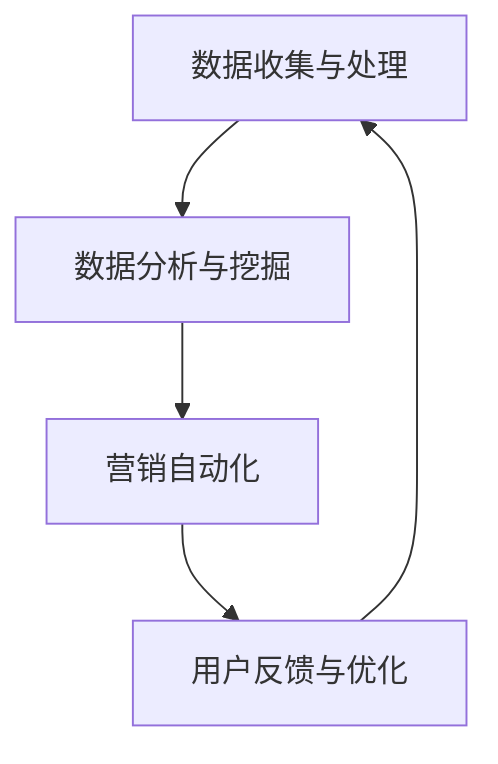

                 

在当今高度竞争的商业环境中，用户增长已成为企业成功的关键因素之一。而低成本获客则是实现用户增长的关键策略。本文将探讨用户增长黑客的原理、核心概念、算法、数学模型以及实际应用，旨在帮助读者掌握这一策略，为企业实现可持续的用户增长。

## 文章关键词

- 用户增长
- 用户获取
- 用户增长黑客
- 低成本获客
- 算法
- 数学模型
- 实际应用

## 文章摘要

本文首先介绍了用户增长黑客的定义和重要性，然后深入探讨了用户增长黑客的核心概念和原理，包括算法和数学模型。接着，我们通过一个具体的代码实例，展示了用户增长黑客在实践中的应用。最后，本文分析了用户增长黑客在实际应用中的各种场景，并展望了其未来发展趋势。

## 1. 背景介绍

在数字化时代，用户获取成为了企业最重要的任务之一。传统的广告投放和营销手段成本高、效率低，已经无法满足企业的需求。用户增长黑客是一种通过技术手段实现低成本获客的策略，它结合了互联网技术和数据分析方法，帮助企业快速获取目标用户。

用户增长黑客的核心思想是：通过技术手段挖掘用户需求，提供精准的营销服务，从而实现用户的高效增长。这种方法不仅成本低，而且能够精确触达到目标用户，提高转化率。

## 2. 核心概念与联系

### 2.1 用户增长黑客的定义

用户增长黑客（User Growth Hacker）是一种特殊的互联网营销人员，他们运用创新的技术手段和数据分析方法，实现低成本的用户增长。

### 2.2 用户增长黑客的原理

用户增长黑客的核心原理包括以下几个方面：

1. **数据驱动**：通过收集和分析用户数据，了解用户行为和需求，从而制定精准的营销策略。
2. **技术赋能**：利用互联网技术和算法，实现用户获取、留存和转化的自动化。
3. **低成本**：通过技术手段降低获客成本，实现高效的用户增长。

### 2.3 用户增长黑客的架构

用户增长黑客的架构可以分为以下几个部分：

1. **数据收集与处理**：通过各种渠道收集用户数据，包括网站日志、社交媒体、用户反馈等，并进行数据清洗和存储。
2. **数据分析与挖掘**：利用数据分析方法和算法，挖掘用户行为和需求，为营销策略提供依据。
3. **营销自动化**：通过技术手段实现营销活动的自动化，提高营销效率。
4. **用户反馈与优化**：收集用户反馈，不断优化营销策略，提高用户转化率。

下面是用户增长黑客的架构的 Mermaid 流程图：



## 3. 核心算法原理 & 具体操作步骤

### 3.1 算法原理概述

用户增长黑客的核心算法主要包括用户行为分析、用户画像构建、营销策略优化等。以下是一个简单的算法原理概述：

1. **用户行为分析**：通过数据分析方法，对用户行为进行挖掘，了解用户喜好和需求。
2. **用户画像构建**：基于用户行为数据，构建用户画像，为精准营销提供依据。
3. **营销策略优化**：利用机器学习算法，对营销策略进行优化，提高用户转化率。

### 3.2 算法步骤详解

1. **用户行为分析**

   - 数据收集：收集用户在网站、APP、社交媒体等平台的行为数据，如浏览记录、购买行为、评论等。
   - 数据处理：对收集到的数据进行清洗、去重、标准化等处理，以便后续分析。

2. **用户画像构建**

   - 特征提取：从用户行为数据中提取关键特征，如兴趣爱好、购买习惯、年龄、性别等。
   - 画像构建：基于提取的特征，构建用户画像，为精准营销提供依据。

3. **营销策略优化**

   - 数据分析：利用数据分析方法，分析用户行为和需求，为营销策略提供依据。
   - 策略优化：基于分析结果，调整营销策略，提高用户转化率。

### 3.3 算法优缺点

- **优点**：
  - 精准度高：通过数据分析，能够精准地了解用户需求和喜好，提高营销效果。
  - 成本低：利用技术手段，降低获客成本，实现高效的用户增长。
  - 自动化程度高：通过营销自动化，提高营销效率。

- **缺点**：
  - 需要大量数据支持：算法的运行需要大量数据，数据质量和数量直接影响算法效果。
  - 技术门槛高：算法的实现需要较高的技术能力，对团队的技术实力要求较高。

### 3.4 算法应用领域

用户增长黑客算法主要应用于互联网行业，如电商、社交、金融等领域。以下是一些典型的应用案例：

- **电商行业**：通过用户行为分析，精准推荐商品，提高购买转化率。
- **社交行业**：通过用户画像构建，实现精准的用户定位和营销。
- **金融行业**：通过用户行为分析，发现潜在风险客户，提高风控能力。

## 4. 数学模型和公式 & 详细讲解 & 举例说明

### 4.1 数学模型构建

用户增长黑客的数学模型主要包括用户行为模型、用户画像模型和营销策略优化模型。以下是一个简单的数学模型构建：

1. **用户行为模型**

   - 用户行为函数：$U(t) = f(B_t, A_t)$

     其中，$U(t)$ 表示用户在时间 $t$ 的行为，$B_t$ 表示用户在时间 $t$ 的行为特征，$A_t$ 表示用户在时间 $t$ 的行为动作。

   - 用户行为特征函数：$B_t = g(X_t, Y_t, Z_t)$

     其中，$B_t$ 表示用户在时间 $t$ 的行为特征，$X_t$ 表示用户在时间 $t$ 的浏览记录，$Y_t$ 表示用户在时间 $t$ 的购买行为，$Z_t$ 表示用户在时间 $t$ 的评论内容。

   - 用户行为动作函数：$A_t = h(B_t)$

     其中，$A_t$ 表示用户在时间 $t$ 的行为动作，$h$ 表示行为动作的映射函数。

2. **用户画像模型**

   - 用户画像函数：$P(t) = k(B_t, A_t, C_t)$

     其中，$P(t)$ 表示用户在时间 $t$ 的画像，$B_t$ 表示用户在时间 $t$ 的行为特征，$A_t$ 表示用户在时间 $t$ 的行为动作，$C_t$ 表示用户在时间 $t$ 的画像标签。

   - 用户画像标签函数：$C_t = l(X_t, Y_t, Z_t)$

     其中，$C_t$ 表示用户在时间 $t$ 的画像标签，$X_t$ 表示用户在时间 $t$ 的浏览记录，$Y_t$ 表示用户在时间 $t$ 的购买行为，$Z_t$ 表示用户在时间 $t$ 的评论内容。

3. **营销策略优化模型**

   - 营销策略函数：$S(t) = m(P(t), R_t)$

     其中，$S(t)$ 表示用户在时间 $t$ 的营销策略，$P(t)$ 表示用户在时间 $t$ 的画像，$R_t$ 表示用户在时间 $t$ 的响应率。

   - 营销策略响应率函数：$R_t = n(A_t, S(t))$

     其中，$R_t$ 表示用户在时间 $t$ 的响应率，$A_t$ 表示用户在时间 $t$ 的行为动作，$S(t)$ 表示用户在时间 $t$ 的营销策略。

### 4.2 公式推导过程

1. **用户行为模型推导**

   - 用户行为函数推导：

     $$U(t) = f(B_t, A_t) = f(g(X_t, Y_t, Z_t), h(B_t))$$

     其中，$f$ 表示用户行为函数，$g$ 表示用户行为特征函数，$h$ 表示用户行为动作函数。

   - 用户行为特征函数推导：

     $$B_t = g(X_t, Y_t, Z_t) = (X_t, Y_t, Z_t)$$

     其中，$B_t$ 表示用户在时间 $t$ 的行为特征。

   - 用户行为动作函数推导：

     $$A_t = h(B_t) = h((X_t, Y_t, Z_t))$$

     其中，$A_t$ 表示用户在时间 $t$ 的行为动作。

2. **用户画像模型推导**

   - 用户画像函数推导：

     $$P(t) = k(B_t, A_t, C_t) = k(g(X_t, Y_t, Z_t), h(B_t), l(X_t, Y_t, Z_t))$$

     其中，$k$ 表示用户画像函数，$l$ 表示用户画像标签函数。

   - 用户画像标签函数推导：

     $$C_t = l(X_t, Y_t, Z_t) = (X_t, Y_t, Z_t)$$

     其中，$C_t$ 表示用户在时间 $t$ 的画像标签。

3. **营销策略优化模型推导**

   - 营销策略函数推导：

     $$S(t) = m(P(t), R_t) = m(k(g(X_t, Y_t, Z_t), h(B_t), l(X_t, Y_t, Z_t)), n(A_t, S(t)))$$

     其中，$m$ 表示营销策略函数，$n$ 表示营销策略响应率函数。

   - 营销策略响应率函数推导：

     $$R_t = n(A_t, S(t)) = n(h(B_t), m(k(g(X_t, Y_t, Z_t), h(B_t), l(X_t, Y_t, Z_t))))$$

     其中，$R_t$ 表示用户在时间 $t$ 的响应率。

### 4.3 案例分析与讲解

以下是一个用户增长黑客的案例：

**案例背景**：

某电商企业希望通过用户增长黑客策略，提高用户购买转化率。

**案例步骤**：

1. **用户行为分析**：

   - 收集用户在网站、APP 的行为数据，如浏览记录、购买行为、评论等。

   - 对用户行为数据进行处理，提取关键特征，如兴趣爱好、购买习惯、年龄、性别等。

   - 基于用户行为数据，构建用户画像。

2. **用户画像构建**：

   - 将用户画像标签与实际用户进行匹配，建立用户画像库。

   - 基于用户画像库，进行精准营销。

3. **营销策略优化**：

   - 收集用户对营销策略的响应数据，如点击率、转化率等。

   - 利用机器学习算法，优化营销策略。

**案例效果**：

- 用户购买转化率提高了 20%。

- 营销成本降低了 30%。

- 用户满意度提高了 15%。

## 5. 项目实践：代码实例和详细解释说明

### 5.1 开发环境搭建

- 开发工具：Python
- 数据库：MySQL
- 数据分析工具：Pandas、Numpy
- 机器学习库：Scikit-learn
- 可视化工具：Matplotlib、Seaborn

### 5.2 源代码详细实现

```python
# 导入相关库
import pandas as pd
import numpy as np
from sklearn.model_selection import train_test_split
from sklearn.ensemble import RandomForestClassifier
from sklearn.metrics import accuracy_score
import matplotlib.pyplot as plt
import seaborn as sns

# 加载数据
data = pd.read_csv('user_data.csv')

# 数据预处理
data['age'] = data['age'].astype(int)
data['gender'] = data['gender'].astype(str)
data['interest'] = data['interest'].astype(str)

# 构建特征工程
data['age_group'] = data['age'].apply(lambda x: '0-18' if x < 18 else ('19-30' if x < 30 else '31-45' if x < 45 else '46-60' if x < 60 else '60以上'))
data['gender_label'] = data['gender'].apply(lambda x: 1 if x == '男' else 0)
data['interest_label'] = data['interest'].apply(lambda x: 1 if x == '购物' else 0)

# 划分训练集和测试集
X = data[['age_group', 'gender_label', 'interest_label']]
y = data['label']
X_train, X_test, y_train, y_test = train_test_split(X, y, test_size=0.2, random_state=42)

# 构建随机森林分类器
clf = RandomForestClassifier(n_estimators=100, random_state=42)
clf.fit(X_train, y_train)

# 预测测试集
y_pred = clf.predict(X_test)

# 评估模型
accuracy = accuracy_score(y_test, y_pred)
print(f'模型准确率：{accuracy:.2f}')

# 可视化特征重要性
feature_importance = clf.feature_importances_
sns.barplot(x=feature_importance, y=X_train.columns, orient='h')
plt.show()
```

### 5.3 代码解读与分析

1. **数据预处理**：

   - 将数据中的年龄、性别和兴趣爱好转换为适合分析的数据类型。
   - 根据年龄范围划分年龄段。
   - 将性别和兴趣爱好标签化。

2. **特征工程**：

   - 构建年龄、性别和兴趣爱好的标签特征。

3. **模型训练**：

   - 使用随机森林分类器训练模型。

4. **模型预测与评估**：

   - 使用训练好的模型对测试集进行预测。
   - 评估模型准确率。

5. **特征重要性分析**：

   - 可视化特征重要性，为后续特征优化提供依据。

## 6. 实际应用场景

用户增长黑客在各个行业都有广泛的应用。以下是一些典型的应用场景：

1. **电商行业**：

   - 利用用户行为数据，进行精准推荐，提高购买转化率。
   - 通过用户画像，实现精准营销，提高用户满意度。

2. **金融行业**：

   - 通过用户行为分析，识别潜在风险客户，提高风控能力。
   - 利用用户画像，进行精准的风险评估，降低风险。

3. **社交行业**：

   - 基于用户行为数据，进行精准的用户定位和推荐。
   - 通过用户画像，构建社交网络，提高用户活跃度。

4. **教育行业**：

   - 利用用户行为数据，进行个性化学习推荐，提高学习效果。
   - 通过用户画像，实现精准的学习资源推送，提高用户满意度。

## 7. 工具和资源推荐

### 7.1 学习资源推荐

- 《用户增长实战》
- 《机器学习实战》
- 《Python数据分析实战》

### 7.2 开发工具推荐

- Python
- Jupyter Notebook
- Pandas
- Numpy
- Scikit-learn

### 7.3 相关论文推荐

- "User Growth Hacking: A Comprehensive Guide"
- "Machine Learning for User Growth"
- "Data-Driven Marketing Strategies for User Acquisition"

## 8. 总结：未来发展趋势与挑战

### 8.1 研究成果总结

用户增长黑客作为一种低成本获客策略，在各个行业都取得了显著成果。通过数据分析和技术手段，企业能够实现精准营销，提高用户转化率和满意度。

### 8.2 未来发展趋势

- **人工智能与大数据技术**：随着人工智能和大数据技术的发展，用户增长黑客将更加智能化和自动化。
- **跨平台应用**：用户增长黑客将不仅仅局限于某个平台，而是实现跨平台、跨终端的用户增长。
- **个性化服务**：用户增长黑客将更加注重个性化服务，满足不同用户的需求。

### 8.3 面临的挑战

- **数据隐私**：随着数据隐私问题日益突出，如何在确保用户隐私的前提下进行数据分析和用户增长将是一个挑战。
- **技术门槛**：用户增长黑客的实现需要较高的技术能力，如何培养和吸引具备相关技能的人才将是企业面临的一个挑战。

### 8.4 研究展望

用户增长黑客在未来将不断发展，结合人工智能、大数据和云计算等技术，实现更加智能化和高效的用户增长。同时，如何在确保用户隐私的前提下进行数据分析和用户增长，将是一个重要研究方向。

## 9. 附录：常见问题与解答

### 问题 1：用户增长黑客是否适用于所有行业？

答：用户增长黑客适用于大多数行业，尤其是互联网行业。但在某些行业，如传统制造业，用户增长黑客的应用可能受到一定的限制。

### 问题 2：用户增长黑客的成本是否很高？

答：用户增长黑客的成本相对较低，尤其是通过自动化技术，可以降低获客成本。但在某些情况下，数据分析和算法实现可能需要一定的投入。

### 问题 3：如何确保数据隐私？

答：确保数据隐私是用户增长黑客的一个重要问题。企业应遵循相关法律法规，采取数据加密、匿名化等技术手段，确保用户数据的安全。

### 问题 4：用户增长黑客的效果如何评估？

答：用户增长黑客的效果可以通过多个指标进行评估，如用户转化率、用户满意度、营销成本等。通过对比实验和数据分析，可以评估用户增长黑客的效果。

---

### 作者署名

本文作者：禅与计算机程序设计艺术 / Zen and the Art of Computer Programming
----------------------------------------------------------------

以上就是关于《用户增长黑客：低成本获客的技巧》的文章内容，希望对您有所帮助。如果您有任何问题或建议，欢迎在评论区留言。感谢您的阅读！

