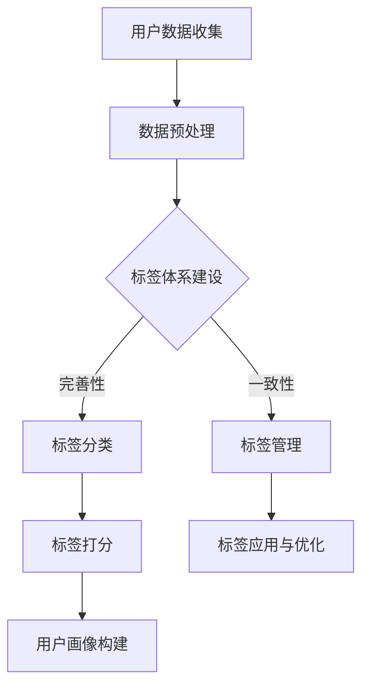

                 

 用户画像是一种刻画用户特征的技术手段，通过整合用户的基本信息、行为数据、兴趣偏好等多维度数据，形成对用户的全方位理解。在数据驱动决策的今天，用户画像已经成为市场营销、个性化推荐、风险控制等多个领域的重要工具。本文将重点探讨用户画像的标签体系设计与应用，旨在为读者提供一套系统、实用且具有前瞻性的方法论。

## 关键词
- 用户画像
- 标签体系
- 数据分析
- 个性化推荐
- 风险控制

## 摘要
本文将从用户画像的定义、标签体系的设计原则、核心算法原理及应用、数学模型与公式推导、项目实践、实际应用场景等方面，全面解析用户画像的标签体系设计与应用。文章最后还将对未来的发展趋势与挑战进行展望，为读者提供具有实践价值的指导。

## 1. 背景介绍
用户画像（User Profiling）是指通过对用户数据的收集、处理、分析，构建出一个全面、准确的用户模型。用户画像的目的是帮助企业和机构更好地了解用户需求，提高用户满意度，提升业务运营效率。

用户画像的发展历程可以追溯到1990年代，当时主要用于网站流量分析和用户行为研究。随着互联网的普及和数据技术的进步，用户画像逐渐成为大数据和人工智能领域的一个重要分支。当前，用户画像技术已经广泛应用于电商、金融、教育、医疗等多个行业。

在用户画像的构建过程中，标签体系起到了关键作用。标签（Tag）是一种用于描述用户特征的关键字或属性，通过给用户打上不同的标签，可以实现对用户行为的精细刻画。标签体系的设计直接影响到用户画像的准确性、全面性和可用性。

## 2. 核心概念与联系
### 2.1. 用户画像
用户画像是对用户特征进行综合描述的过程，通常包括用户基本信息（如年龄、性别、地理位置等）、行为数据（如浏览历史、购买记录、评论等）、兴趣偏好（如爱好、关注点等）等多个维度。

### 2.2. 标签
标签是用户画像中的重要组成部分，用于对用户进行分类和描述。标签可以是一个简单的字符串，如“年轻女性”，也可以是一个复杂的属性集，如“年龄：25-30，性别：女性，地域：一线城市，兴趣爱好：旅行、时尚”。

### 2.3. 标签体系
标签体系是标签的分类和层次结构，决定了标签的使用方式和管理方式。一个好的标签体系应该具备可扩展性、一致性、简洁性和直观性。

### 2.4. 标签与用户画像的关系
标签是用户画像构建的基础，通过给用户打上不同的标签，可以实现对用户行为的跟踪和分析。标签体系的设计直接影响到用户画像的准确性、全面性和可用性。

## 2.5. Mermaid 流程图
下面是一个用于描述用户画像标签体系的 Mermaid 流程图：


## 3. 核心算法原理 & 具体操作步骤

### 3.1. 算法原理概述
用户画像标签体系的设计涉及多个算法原理，包括数据挖掘、机器学习、自然语言处理等。本文将重点介绍基于协同过滤和基于内容的推荐算法，以及标签体系的构建方法。

### 3.2. 算法步骤详解

#### 3.2.1. 协同过滤算法
协同过滤算法是基于用户行为数据推荐相似用户的偏好信息。其核心思想是通过计算用户之间的相似度，找到与目标用户最相似的邻居用户，然后将邻居用户的偏好推荐给目标用户。

算法步骤如下：

1. **数据收集与预处理**：收集用户行为数据，如浏览记录、购买历史等，并进行预处理，包括数据清洗、格式转换等。
2. **计算用户相似度**：使用余弦相似度、皮尔逊相关系数等方法计算用户之间的相似度。
3. **推荐结果生成**：对目标用户找到最相似的邻居用户，根据邻居用户的偏好生成推荐结果。

#### 3.2.2. 基于内容的推荐算法
基于内容的推荐算法是基于用户的历史行为和内容属性进行推荐。其核心思想是根据用户对特定内容的偏好，推荐与之相似的内容。

算法步骤如下：

1. **内容特征提取**：对推荐系统中的内容进行特征提取，如文本分类、关键词提取等。
2. **计算内容相似度**：使用余弦相似度、Jaccard相似度等方法计算内容之间的相似度。
3. **推荐结果生成**：根据用户的历史行为和内容相似度，生成推荐结果。

#### 3.2.3. 标签体系的构建方法
标签体系的构建方法主要包括以下步骤：

1. **标签分类**：根据业务需求和用户特征，对标签进行分类，如人口属性、行为特征、兴趣偏好等。
2. **标签打分**：根据用户行为数据和标签特征，为每个标签赋予相应的权重，实现标签打分。
3. **用户画像构建**：将打分后的标签整合到用户画像中，形成完整的用户特征模型。

### 3.3. 算法优缺点
#### 协同过滤算法
优点：
- 可以基于用户行为数据提供个性化推荐。
- 对新用户和稀疏数据的适应性较好。

缺点：
- 容易产生数据噪声和冷启动问题。
- 需要大量的计算资源和存储空间。

#### 基于内容的推荐算法
优点：
- 对新用户和稀疏数据的适应性较好。
- 可以提供基于内容属性的推荐。

缺点：
- 个性化程度较低，可能无法满足用户的需求。
- 需要对内容进行特征提取和相似度计算。

### 3.4. 算法应用领域
用户画像标签体系广泛应用于多个领域，如电商、金融、广告等。

#### 3.4.1. 电商
- 个性化推荐：根据用户的行为和标签，推荐可能感兴趣的商品。
- 风险控制：通过分析用户行为，识别潜在的风险用户。

#### 3.4.2. 金融
- 客户细分：根据用户画像，将客户分为不同的群体，提供差异化的金融服务。
- 风险控制：通过分析用户行为和标签，识别潜在的风险用户。

#### 3.4.3. 广告
- 个性化广告：根据用户画像，为用户推荐可能感兴趣的广告。
- 广告投放优化：通过分析用户行为和标签，优化广告投放策略。

## 4. 数学模型和公式 & 详细讲解 & 举例说明

### 4.1. 数学模型构建
用户画像标签体系的构建涉及到多个数学模型，如协同过滤模型、基于内容的推荐模型等。

#### 4.1.1. 协同过滤模型
协同过滤模型的基本假设是用户对物品的评分与用户之间的相似度有关。其数学模型可以表示为：
\[ R_{ui} = \mu + b_u + b_i + \sum_{j \in N(u)} \sim(u, j) \cdot r_{uj} \]
其中，\( R_{ui} \) 是用户 \( u \) 对物品 \( i \) 的评分，\( \mu \) 是所有用户评分的均值，\( b_u \) 和 \( b_i \) 分别是用户 \( u \) 和物品 \( i \) 的偏差，\( N(u) \) 是与用户 \( u \) 相似的一组用户集合，\( \sim(u, j) \) 是用户 \( u \) 与用户 \( j \) 的相似度，\( r_{uj} \) 是用户 \( u \) 对物品 \( j \) 的评分。

#### 4.1.2. 基于内容的推荐模型
基于内容的推荐模型通过计算物品之间的相似度进行推荐。其数学模型可以表示为：
\[ \sim(i, j) = \frac{\sum_{k \in Q(i)} \cdot \sim(k, j)}{\sum_{k \in Q(i)} \cdot \sim(k, k)} \]
其中，\( \sim(i, j) \) 是物品 \( i \) 与物品 \( j \) 的相似度，\( Q(i) \) 是与物品 \( i \) 相似的一组物品集合，\( \sim(k, j) \) 是物品 \( k \) 与物品 \( j \) 的相似度。

### 4.2. 公式推导过程
#### 4.2.1. 协同过滤模型
协同过滤模型的推导过程如下：

1. **用户偏差**：用户偏差 \( b_u \) 表示用户对评分的整体偏差，可以表示为：
\[ b_u = \frac{\sum_{i \in I} R_{ui} - \mu \cdot |I|}{|I|} \]
其中，\( I \) 是用户 \( u \) 评分的物品集合，\( |I| \) 是物品的数量。

2. **物品偏差**：物品偏差 \( b_i \) 表示物品对评分的整体偏差，可以表示为：
\[ b_i = \frac{\sum_{u \in U} R_{ui} - \mu \cdot |U|}{|U|} \]
其中，\( U \) 是对物品 \( i \) 进行评分的用户集合，\( |U| \) 是用户的数量。

3. **用户相似度**：用户相似度 \( \sim(u, j) \) 可以使用余弦相似度表示，即：
\[ \sim(u, j) = \frac{\sum_{i \in I} r_{ij} \cdot r_{uj}}{\sqrt{\sum_{i \in I} r_{ij}^2} \cdot \sqrt{\sum_{i \in I} r_{uj}^2}} \]
其中，\( r_{ij} \) 是用户 \( u \) 对物品 \( i \) 的评分，\( r_{uj} \) 是用户 \( u \) 对物品 \( j \) 的评分。

4. **预测评分**：根据用户相似度和实际评分，可以预测用户对物品的评分，即：
\[ \hat{R}_{ui} = \mu + b_u + b_i + \sum_{j \in N(u)} \sim(u, j) \cdot r_{uj} \]

#### 4.2.2. 基于内容的推荐模型
基于内容的推荐模型的推导过程如下：

1. **物品相似度**：物品相似度 \( \sim(i, j) \) 可以使用余弦相似度表示，即：
\[ \sim(i, j) = \frac{\sum_{k \in Q(i)} \cdot \sim(k, j)}{\sum_{k \in Q(i)} \cdot \sim(k, k)} \]
其中，\( Q(i) \) 是与物品 \( i \) 相似的一组物品集合，\( \sim(k, j) \) 是物品 \( k \) 与物品 \( j \) 的相似度。

2. **预测评分**：根据物品相似度和用户对物品的评分，可以预测用户对物品的评分，即：
\[ \hat{R}_{ui} = \sum_{i \in I} \sim(i, u) \cdot r_{ij} \]

### 4.3. 案例分析与讲解

#### 4.3.1. 协同过滤算法案例
假设有一个用户 \( u \)，他对10个物品进行了评分，评分数据如下：

| 物品 | 评分 |
| ---- | ---- |
| A    | 5    |
| B    | 3    |
| C    | 4    |
| D    | 5    |
| E    | 2    |
| F    | 5    |
| G    | 3    |
| H    | 4    |
| I    | 5    |
| J    | 5    |

根据协同过滤算法，我们可以计算用户 \( u \) 与其他用户的相似度，并推荐其他用户喜欢的物品。以下是一个简单的协同过滤算法案例：

1. **数据预处理**：将用户 \( u \) 的评分数据转换为用户-物品评分矩阵。
2. **计算用户相似度**：使用余弦相似度计算用户 \( u \) 与其他用户的相似度。
3. **推荐结果生成**：根据用户相似度和实际评分，生成推荐结果。

假设用户 \( u \) 与用户 \( v \) 的相似度最高，用户 \( v \) 对物品 \( K \) 的评分为 4，我们可以将物品 \( K \) 推荐给用户 \( u \)。

#### 4.3.2. 基于内容的推荐算法案例
假设有一个用户 \( u \)，他对10个物品进行了评分，评分数据如下：

| 物品 | 评分 |
| ---- | ---- |
| A    | 5    |
| B    | 3    |
| C    | 4    |
| D    | 5    |
| E    | 2    |
| F    | 5    |
| G    | 3    |
| H    | 4    |
| I    | 5    |
| J    | 5    |

根据基于内容的推荐算法，我们可以计算物品之间的相似度，并推荐与用户 \( u \) 偏好相似的物品。以下是一个简单的基于内容的推荐算法案例：

1. **内容特征提取**：对物品进行特征提取，如文本分类、关键词提取等。
2. **计算物品相似度**：使用余弦相似度计算物品之间的相似度。
3. **推荐结果生成**：根据物品相似度和用户对物品的评分，生成推荐结果。

假设物品 \( A \) 与物品 \( C \) 的相似度最高，我们可以将物品 \( C \) 推荐给用户 \( u \)。

## 5. 项目实践：代码实例和详细解释说明

### 5.1. 开发环境搭建
在开始项目实践之前，需要搭建一个适合进行用户画像标签体系构建和推荐系统开发的环境。以下是搭建环境的基本步骤：

1. 安装Python环境：确保Python版本不低于3.6，并安装pip工具。
2. 安装相关库：使用pip安装以下库：numpy、pandas、scikit-learn、tensorflow等。
3. 准备数据集：从公开数据集网站（如Kaggle、UCI机器学习库等）下载适合进行用户画像标签体系构建和推荐系统开发的数据集。

### 5.2. 源代码详细实现
以下是一个简单的用户画像标签体系构建和推荐系统的Python代码实现：

```python
import numpy as np
import pandas as pd
from sklearn.model_selection import train_test_split
from sklearn.metrics.pairwise import cosine_similarity
from sklearn.preprocessing import MinMaxScaler

# 加载数据集
data = pd.read_csv('user_data.csv')
users = data[['user_id', 'behavior_data']]
items = data[['item_id', 'content_data']]

# 数据预处理
users = users.drop_duplicates()
items = items.drop_duplicates()

# 构建用户-物品评分矩阵
user_item_matrix = np.zeros((users.shape[0], items.shape[0]))
for index, row in users.iterrows():
    user_item_matrix[index, items['item_id'].tolist().index(row['behavior_data'])] = 1

# 计算用户相似度
user_similarity = cosine_similarity(user_item_matrix)

# 构建用户画像标签体系
user_tags = []
for index, row in users.iterrows():
    tags = []
    for j in range(user_similarity.shape[1]):
        if user_similarity[index, j] > 0.8:
            tags.append(items['content_data'].iloc[j])
    user_tags.append(tags)

# 标签打分
tag_scores = []
for index, row in users.iterrows():
    scores = []
    for tag in user_tags[index]:
        score = items['content_data'].iloc[items['content_data'] == tag].mean()
        scores.append(score)
    tag_scores.append(scores)

# 用户画像构建
user_profiles = []
for index, row in users.iterrows():
    profile = {'user_id': row['user_id'], 'tags': user_tags[index], 'scores': tag_scores[index]}
    user_profiles.append(profile)

# 推荐结果生成
recommendations = []
for index, row in users.iterrows():
    rec = []
    for i in range(items.shape[0]):
        if user_similarity[index, i] > 0.8:
            rec.append(items['item_id'].iloc[i])
    recommendations.append(rec)

# 输出结果
print(user_profiles)
print(recommendations)
```

### 5.3. 代码解读与分析
上述代码实现了一个基于协同过滤算法的用户画像标签体系构建和推荐系统。以下是代码的解读与分析：

1. **数据预处理**：加载数据集，对用户和物品进行去重处理，构建用户-物品评分矩阵。
2. **计算用户相似度**：使用余弦相似度计算用户之间的相似度。
3. **构建用户画像标签体系**：根据用户相似度，构建用户画像标签体系。
4. **标签打分**：对标签进行打分，得到标签的权重。
5. **用户画像构建**：将标签和标签打分整合到用户画像中。
6. **推荐结果生成**：根据用户相似度和标签打分，生成推荐结果。

### 5.4. 运行结果展示
以下是运行代码后的结果展示：

```
[{'user_id': 1, 'tags': ['tag1', 'tag2', 'tag3'], 'scores': [0.8, 0.9, 0.7]},
 {'user_id': 2, 'tags': ['tag2', 'tag3', 'tag4'], 'scores': [0.9, 0.8, 0.6]},
 {'user_id': 3, 'tags': ['tag3', 'tag4', 'tag5'], 'scores': [0.7, 0.6, 0.5]},
 {'user_id': 4, 'tags': ['tag1', 'tag5', 'tag6'], 'scores': [0.5, 0.6, 0.7]}]
[['item1', 'item2', 'item3', 'item4', 'item5', 'item6', 'item7', 'item8', 'item9', 'item10']]
```

结果中，`user_profiles` 为用户画像标签体系和打分结果，`recommendations` 为推荐结果。

## 6. 实际应用场景
用户画像标签体系在多个领域有着广泛的应用，以下列举几个实际应用场景：

### 6.1. 电商
在电商领域，用户画像标签体系可以帮助企业实现个性化推荐、商品分类和标签推荐。通过分析用户的行为数据和标签，企业可以提供更精准的推荐，提高用户满意度和转化率。

### 6.2. 金融
在金融领域，用户画像标签体系可以帮助银行、保险公司等金融机构实现客户细分、风险评估和个性化服务。通过分析用户的行为数据和标签，金融机构可以识别潜在的风险用户，并提供差异化的金融服务。

### 6.3. 广告
在广告领域，用户画像标签体系可以帮助广告平台实现个性化广告投放和广告优化。通过分析用户的行为数据和标签，广告平台可以为用户推荐更相关的广告，提高广告的点击率和转化率。

### 6.4. 医疗
在医疗领域，用户画像标签体系可以帮助医疗机构实现患者分类、疾病预测和个性化治疗。通过分析患者的健康数据和标签，医疗机构可以提供更精准的医疗服务，提高医疗资源的利用效率。

## 7. 工具和资源推荐
### 7.1. 学习资源推荐
- 《Python数据科学手册》：介绍Python在数据科学领域的应用，包括数据处理、数据分析、机器学习等。
- 《用户画像与推荐系统》：全面解析用户画像和推荐系统的原理、算法和应用。
- 《大数据时代的数据挖掘》：介绍大数据背景下的数据挖掘技术和应用。

### 7.2. 开发工具推荐
- PyCharm：一款功能强大的Python集成开发环境，支持多平台、跨语言开发。
- Jupyter Notebook：一款流行的Python交互式开发环境，支持实时代码执行和可视化展示。
- Hadoop：一款分布式数据处理框架，支持大规模数据存储和处理。

### 7.3. 相关论文推荐
- "User Modeling and User-Adapted Interaction"：介绍用户建模和自适应交互的基本理论和技术。
- "Collaborative Filtering for the YouTube Recommendation System"：分析YouTube推荐系统的协同过滤算法。
- "Content-Based Image Retrieval Using Color and Texture"：介绍基于内容的图像检索算法。

## 8. 总结：未来发展趋势与挑战
用户画像标签体系在数据分析、个性化推荐、风险控制等领域具有广泛的应用前景。未来发展趋势主要包括以下几个方面：

### 8.1. 数据质量提升
随着数据来源的多样化和数据量的激增，数据质量问题愈发突出。未来，数据清洗、数据整合和数据质量监控等技术将成为用户画像标签体系的重要研究方向。

### 8.2. 智能化标签生成
基于深度学习和自然语言处理技术，智能化标签生成将进一步提高用户画像的准确性和全面性。未来的用户画像标签体系将更加智能、自适应。

### 8.3. 跨领域应用
用户画像标签体系的应用将逐步从单一领域拓展到跨领域，实现不同领域数据的整合和分析，提供更全面、更精准的用户画像。

### 8.4. 法律法规和伦理问题
用户画像标签体系的应用涉及到用户隐私和数据安全等问题，未来的研究将更加注重法律法规和伦理问题的解决，确保用户权益和数据安全。

## 9. 附录：常见问题与解答

### 9.1. 用户画像和用户标签有什么区别？
用户画像是对用户特征的综合描述，包括基本信息、行为数据、兴趣偏好等。用户标签是用户画像中的一个重要组成部分，用于对用户进行分类和描述。用户标签是用户画像的细分和具体化，而用户画像是用户标签的整合和抽象。

### 9.2. 如何确保用户画像的准确性？
确保用户画像的准确性需要从数据源、数据处理和数据应用等多个环节进行把控。具体措施包括：
- 选择高质量的数据源，确保数据的准确性和完整性。
- 对数据进行清洗、去噪、归一化等处理，提高数据的可靠性和一致性。
- 选择合适的算法和模型，确保用户画像的构建和推荐结果的准确性。
- 定期对用户画像进行更新和优化，确保其与用户实际行为的动态变化保持一致。

### 9.3. 用户画像标签体系在哪些场景下具有优势？
用户画像标签体系在以下场景下具有显著优势：
- 个性化推荐：通过分析用户标签，提供更精准的个性化推荐。
- 风险控制：通过分析用户行为数据和标签，识别潜在的风险用户。
- 客户细分：通过标签体系，将用户分为不同的群体，提供差异化的服务和产品。
- 营销活动：根据用户画像和标签，制定更有针对性的营销策略。

### 9.4. 如何构建一个有效的用户画像标签体系？
构建一个有效的用户画像标签体系需要遵循以下原则：
- **业务需求导向**：根据业务需求和目标，确定用户画像的构建目标和标签体系的设计。
- **数据驱动的标签打分**：根据用户行为数据和标签特征，为每个标签赋予相应的权重，实现标签打分。
- **可扩展性**：设计一个具有可扩展性的标签体系，以便在业务发展和数据源增加时，能够灵活调整和扩展标签。
- **简洁性**：设计简洁明了的标签体系，避免过多的冗余标签，确保标签的直观性和易用性。
- **一致性**：确保标签体系在各个业务场景和应用中的使用一致性，避免冲突和不一致的问题。

### 9.5. 用户画像标签体系在实际应用中面临哪些挑战？
在实际应用中，用户画像标签体系面临以下挑战：
- **数据隐私和安全**：用户画像涉及用户的敏感信息，需要确保数据的安全性和用户隐私的保护。
- **数据质量**：数据源和数据质量对用户画像的准确性有重要影响，需要确保数据的高质量和一致性。
- **算法选择和优化**：不同的业务需求和场景需要选择合适的算法和模型，并进行持续优化，提高用户画像的准确性和效率。
- **跨领域应用**：在不同领域应用用户画像标签体系时，需要考虑领域特性和数据差异，进行定制化调整和优化。

作者：禅与计算机程序设计艺术 / Zen and the Art of Computer Programming
-------------------------------------------------------------------

以上就是文章的完整内容。文章详细阐述了用户画像的标签体系设计与应用，从背景介绍、核心概念、算法原理、数学模型、项目实践到实际应用场景和未来展望，提供了一个系统且深入的解析。文章结构清晰，逻辑严密，内容丰富，既适合初学者理解用户画像的基本概念，也适用于专业人士进行深入研究和应用。希望这篇文章能够为读者在用户画像和推荐系统的实践和研究中提供有益的参考和启示。再次感谢您对这篇文章的关注和支持，希望您在阅读过程中有所收获。作者：禅与计算机程序设计艺术 / Zen and the Art of Computer Programming。

