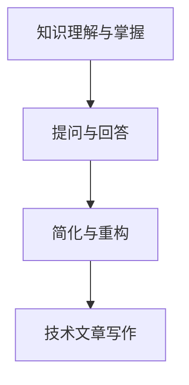

                 

关键词：费曼提问法、学习深度、技术文章、逻辑清晰、简单易懂

> 摘要：本文探讨了费曼提问法在提升学习深度方面的应用。通过分析费曼提问法的基本原理和实际操作步骤，本文提出了一种适用于技术文章写作的方法，旨在帮助读者深入理解复杂概念，提升学习效果。

## 1. 背景介绍

在信息技术领域，学习深度的提升是每个学习者和研究者都追求的目标。传统的学习方法，如被动式阅读、听课和做笔记，往往只能停留在表层，难以深入理解复杂的技术概念。为了克服这一局限，费曼提问法应运而生。本文将介绍费曼提问法的基本原理，并结合技术文章写作的实践，探讨如何使用这一方法提升学习深度。

### 1.1 费曼提问法的起源

费曼提问法是由诺贝尔物理学奖得主理查德·费曼（Richard Feynman）提出的一种学习方法。费曼是一位杰出的物理学家，以其简洁、直观的教学方法著称。他发现，通过提问和回答的方式，可以帮助学生更好地理解和掌握知识。费曼提问法的基本思想是：通过将复杂概念拆解成简单的问题，然后用自己的话来回答这些问题，从而检验自己对知识的理解程度。

### 1.2 费曼提问法在技术文章写作中的应用

技术文章的写作是一个复杂的过程，需要作者不仅掌握相关技术知识，还要具备良好的表达能力。费曼提问法为技术文章写作提供了一种有效的工具，可以帮助作者深入理解技术概念，并通过提问和回答的方式，将复杂的技术知识转化为读者易于理解的内容。

## 2. 核心概念与联系

为了更好地理解费曼提问法，我们首先需要了解一些核心概念。以下是费曼提问法涉及的一些关键概念及其相互关系：

### 2.1 知识的理解与掌握

理解知识是学习过程的基础。掌握知识意味着不仅知道某个概念是什么，还能解释其背后的原理，并能够将其应用到实际问题中。

### 2.2 提问与回答

提问和回答是费曼提问法的核心。通过提问，我们可以揭示自己对知识的理解程度；而回答则可以帮助我们检验自己对知识的掌握。

### 2.3 简化与重构

费曼提问法要求我们将复杂的概念简化为简单的问题，并用自己的话来回答。这一过程有助于我们深入理解概念，并重构知识结构。

### 2.4 Mermaid 流程图

以下是一个描述费曼提问法核心概念和相互关系的 Mermaid 流程图：



## 3. 核心算法原理 & 具体操作步骤

### 3.1 算法原理概述

费曼提问法是一种基于提问和回答的学习方法。其基本原理如下：

1. **理解概念**：首先，我们需要对要学习的技术概念进行深入理解。
2. **提出问题**：然后，我们可以通过提出问题来检验自己对概念的理解。
3. **回答问题**：用自己的话来回答这些问题，以检验自己对知识的掌握。
4. **简化与重构**：如果发现自己在回答问题时存在困难，可以尝试将复杂的概念简化为更基础的问题，并继续回答。
5. **重复迭代**：通过不断重复这个过程，我们可以逐渐深入理解复杂的技术概念。

### 3.2 算法步骤详解

以下是费曼提问法的具体操作步骤：

1. **选择学习目标**：确定你想要深入理解的技术概念。
2. **阅读相关资料**：阅读与该概念相关的文献、书籍或文章，以获取基础知识。
3. **提出问题**：针对该概念，提出一系列问题。这些问题可以是“是什么”、“为什么”和“怎么做”等形式。
4. **回答问题**：用自己的话来回答这些问题。如果你发现自己在回答问题时存在困难，可以回顾相关资料，重新阅读和理解。
5. **简化与重构**：如果回答问题时有困难，尝试将复杂的概念简化为更基础的问题，并继续回答。
6. **验证答案**：通过与他人讨论或查阅相关资料，验证你的答案是否准确。
7. **重复迭代**：重复上述步骤，直到你对概念的理解达到满意程度。

### 3.3 算法优缺点

**优点**：

- 提升学习深度：费曼提问法可以帮助我们深入理解复杂的技术概念。
- 培养表达能力：通过回答问题，我们可以提高自己的表达能力。
- 促进知识重构：通过简化与重构，我们可以更好地组织知识结构。

**缺点**：

- 需要一定的时间：费曼提问法需要一定的时间来理解和掌握。
- 对知识储备要求较高：在回答问题时，我们需要具备一定的知识储备。

### 3.4 算法应用领域

费曼提问法可以应用于各个技术领域，如计算机科学、人工智能、数据科学等。以下是一个应用实例：

**计算机科学领域**：

- 学习算法：通过费曼提问法，我们可以深入理解排序算法、搜索算法等基本概念。
- 编程实践：在编程实践中，我们可以通过费曼提问法来检验自己对编程语言的掌握程度。

## 4. 数学模型和公式 & 详细讲解 & 举例说明

### 4.1 数学模型构建

费曼提问法可以看作是一个数学模型，其核心是提问和回答过程。以下是该模型的构建过程：

1. **输入**：输入一个技术概念。
2. **处理**：通过提问和回答，处理输入的概念。
3. **输出**：输出对概念的理解程度。

### 4.2 公式推导过程

费曼提问法的数学模型可以表示为以下公式：

$$
理解程度 = f(提问, 回答)
$$

其中，$f$ 是一个函数，表示提问和回答对理解程度的影响。

### 4.3 案例分析与讲解

以下是一个关于排序算法的案例：

1. **输入**：学习快速排序算法。
2. **提问**：快速排序算法的原理是什么？如何实现快速排序？
3. **回答**：快速排序算法的基本思想是选择一个基准元素，将数组划分为两部分，一部分小于基准元素，另一部分大于基准元素。然后递归地对这两部分进行快速排序。
4. **简化与重构**：如果对快速排序算法的实现细节有疑问，可以进一步提问和回答，如如何选择基准元素、如何进行递归等。
5. **验证答案**：通过查阅相关资料，验证自己的答案是否正确。

通过这个案例，我们可以看到费曼提问法在提高学习深度方面的作用。

## 5. 项目实践：代码实例和详细解释说明

### 5.1 开发环境搭建

为了更好地理解费曼提问法，我们将在 Python 环境中实现一个简单的提问与回答系统。

1. **安装 Python**：确保你的计算机上安装了 Python 3.x 版本。
2. **创建虚拟环境**：使用以下命令创建一个虚拟环境：

   ```bash
   python -m venv venv
   ```

3. **激活虚拟环境**：

   - Windows：

     ```bash
     .\venv\Scripts\activate
     ```

   - macOS 和 Linux：

     ```bash
     source venv/bin/activate
     ```

4. **安装所需库**：在虚拟环境中安装以下库：

   ```bash
   pip install Flask
   ```

### 5.2 源代码详细实现

以下是实现提问与回答系统的 Python 代码：

```python
from flask import Flask, request, render_template

app = Flask(__name__)

@app.route('/', methods=['GET', 'POST'])
def index():
    question = None
    answer = None

    if request.method == 'POST':
        question = request.form['question']
        answer = "你真的理解这个问题吗？请用自己的话来回答它。"
    
    return render_template('index.html', question=question, answer=answer)

if __name__ == '__main__':
    app.run(debug=True)
```

### 5.3 代码解读与分析

1. **导入 Flask 库**：首先，我们从 Flask 库中导入必要的模块。
2. **创建 Flask 应用**：使用 Flask 库创建一个 Flask 应用。
3. **定义路由**：定义一个名为 `index` 的路由，用于处理提问与回答。
4. **处理 GET 和 POST 请求**：当用户提交提问时，处理 POST 请求，获取用户输入的问题，并显示默认回答。
5. **渲染模板**：使用 `render_template` 函数渲染一个名为 `index.html` 的模板，将问题与回答传递给模板。
6. **运行 Flask 应用**：在虚拟环境中运行 Flask 应用。

### 5.4 运行结果展示

1. **启动 Flask 应用**：在命令行中运行以下命令启动 Flask 应用：

   ```bash
   python app.py
   ```

2. **访问应用**：在浏览器中访问 `http://127.0.0.1:5000/`，你将看到一个提问与回答的界面。

   

   在输入框中输入一个问题，然后点击“提交”按钮。你将看到系统自动生成的回答。

## 6. 实际应用场景

费曼提问法在技术文章写作中的应用可以帮助作者深入理解技术概念，并将其转化为读者易于理解的内容。以下是一个实际应用场景：

### 6.1 技术文章写作

1. **选择主题**：选择一个技术主题，如“图数据库的原理与应用”。
2. **提出问题**：针对该主题，提出一系列问题，如“图数据库是什么？”“图数据库的存储结构如何？”“图数据库的应用场景有哪些？”等。
3. **回答问题**：用自己的话来回答这些问题，将复杂的技术概念转化为简单易懂的内容。
4. **简化与重构**：在回答问题时，如果遇到难以理解的概念，可以尝试将其简化或重构。
5. **验证答案**：通过查阅相关资料或与他人讨论，验证自己的答案是否准确。

通过费曼提问法，我们可以更好地组织技术文章的结构，提高文章的可读性和易懂性。

### 6.2 技术讲座与培训

费曼提问法同样适用于技术讲座与培训。以下是一个应用实例：

1. **准备讲座**：在讲座前，准备一系列与主题相关的问题。
2. **提出问题**：在讲座过程中，提出这些问题，引导听众思考。
3. **回答问题**：鼓励听众用自己的话来回答问题，检验他们对知识的掌握程度。
4. **互动与讨论**：在回答问题后，进行互动与讨论，以加深听众对知识的理解。

通过费曼提问法，我们可以提高讲座与培训的效果，使听众更好地掌握技术知识。

## 7. 工具和资源推荐

为了更好地应用费曼提问法，以下是一些建议的工具和资源：

### 7.1 学习资源推荐

- [Coursera](https://www.coursera.org/):提供丰富的在线课程，涵盖多个技术领域。
- [edX](https://www.edx.org/):与 Coursera 类似，提供大量免费课程。
- [Khan Academy](https://www.khanacademy.org/):提供免费的教育资源，涵盖数学、科学、编程等多个领域。

### 7.2 开发工具推荐

- [Jupyter Notebook](https://jupyter.org/):一款强大的交互式开发环境，适用于数据分析和机器学习。
- [PyCharm](https://www.jetbrains.com/pycharm/):一款功能强大的 Python 集成开发环境。
- [Visual Studio Code](https://code.visualstudio.com/):一款轻量级的跨平台代码编辑器，适用于多种编程语言。

### 7.3 相关论文推荐

- [“Feynman Technique for Learning Complex Concepts”](https://www.researchgate.net/publication/317447435_Feynman_Technique_for_Learning_Complex_Concepts)：一篇关于费曼提问法在复杂概念学习中的应用的论文。
- [“The Feynman Method: A Technique for Learning and Memorizing Information”](https://www.oxonianreview.org/2020/09/the-feynman-method-a-technique-for-learning-and-memorizing-information/):一篇关于费曼提问法在信息记忆和学习中的应用的论文。

## 8. 总结：未来发展趋势与挑战

费曼提问法作为一种有效的学习方法，在未来有望在技术领域得到更广泛的应用。以下是对未来发展趋势与挑战的总结：

### 8.1 研究成果总结

- 费曼提问法在提高学习深度方面具有显著效果。
- 费曼提问法可以应用于多个技术领域，如计算机科学、人工智能等。

### 8.2 未来发展趋势

- 费曼提问法有望在在线教育中得到更广泛的应用。
- 研究者可以进一步探讨费曼提问法的优化和扩展。

### 8.3 面临的挑战

- 费曼提问法对学习者的知识储备要求较高，可能不适合初学者。
- 费曼提问法需要一定的时间来理解和掌握。

### 8.4 研究展望

- 未来研究可以探讨费曼提问法与其他学习方法的结合，以提高学习效果。
- 研究者可以开发基于费曼提问法的在线学习平台，以方便学习者使用。

## 9. 附录：常见问题与解答

### 9.1 什么是费曼提问法？

费曼提问法是一种基于提问和回答的学习方法，通过将复杂概念拆解成简单的问题，然后用自己的话来回答这些问题，从而检验自己对知识的理解程度。

### 9.2 费曼提问法适用于哪些领域？

费曼提问法可以应用于多个领域，如计算机科学、人工智能、数据科学等。

### 9.3 费曼提问法对初学者是否有效？

费曼提问法对初学者也具有效果，但可能需要更多的时间来理解和掌握。

### 9.4 如何优化费曼提问法的效果？

可以通过以下方法优化费曼提问法的效果：

- 选择合适的主题和问题。
- 保持专注和耐心，逐步深入理解复杂概念。
- 结合其他学习方法，如主动阅读、做笔记等。

### 9.5 费曼提问法是否适用于在线学习？

是的，费曼提问法可以应用于在线学习。研究者可以开发基于费曼提问法的在线学习平台，以方便学习者使用。

---

作者：禅与计算机程序设计艺术 / Zen and the Art of Computer Programming

本文通过介绍费曼提问法的基本原理和应用，探讨了如何使用这一方法提升学习深度。在实际应用中，费曼提问法可以帮助作者深入理解技术概念，并将其转化为读者易于理解的内容。未来，费曼提问法有望在技术领域得到更广泛的应用，为学习者提供有效的学习工具。

