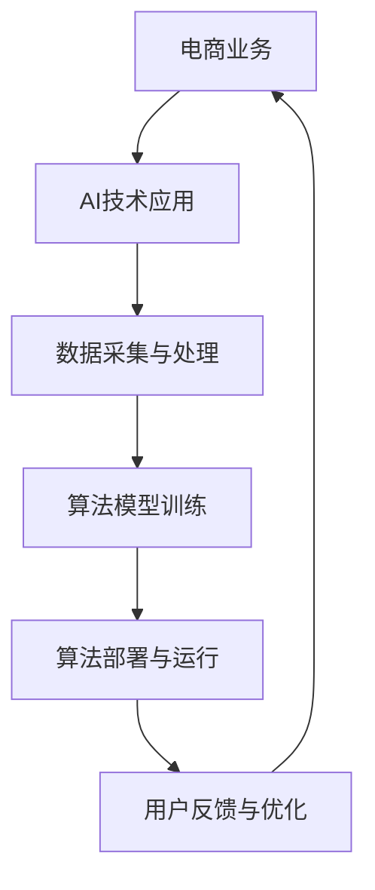

                 

关键词：电商，人工智能，安全合规，用户信任，技术，法律

摘要：随着人工智能技术的广泛应用，电商行业面临着日益严峻的安全合规挑战。本文将探讨电商创业者如何通过技术与法律的双重保障，构建用户信任，确保AI系统的安全合规运行。

## 1. 背景介绍

在数字化时代，人工智能（AI）已成为推动电商行业创新和增长的关键力量。从个性化推荐系统到智能客服，AI技术为电商企业带来了前所未有的竞争优势。然而，随着AI技术的普及，数据安全和隐私保护等问题日益突出。对于电商创业者来说，如何在享受AI技术红利的同时，确保系统的安全合规，成为了一项重要的任务。

### 1.1 电商行业现状

- **市场快速增长**：全球电商市场规模持续扩大，成为推动经济增长的重要引擎。
- **用户需求多样**：消费者对个性化体验和高效服务的要求越来越高。
- **技术变革迅速**：AI、大数据、区块链等新兴技术不断涌现，为电商行业带来了新的机遇。

### 1.2 AI技术在电商中的应用

- **个性化推荐**：通过分析用户行为和偏好，提供个性化的商品推荐。
- **智能客服**：利用自然语言处理技术，实现自动化客服，提高客户满意度。
- **供应链优化**：利用机器学习算法，优化库存管理和物流配送。

### 1.3 安全合规的重要性

- **用户信任**：安全合规的AI系统能够增强用户对电商平台的信任。
- **法律风险**：违反数据保护法规可能导致高额罚款和声誉损失。
- **商业可持续性**：安全合规是电商企业长期发展的基础。

## 2. 核心概念与联系

### 2.1 安全合规的概念

安全合规是指企业在运营过程中遵循相关法律法规、行业标准和技术规范，确保业务活动的合法性和安全性。在AI领域，安全合规主要包括数据安全、隐私保护、算法透明性和可靠性等方面。

### 2.2 电商与AI的关系

电商行业与AI技术的深度融合，使得AI系统在电商业务中扮演了越来越重要的角色。电商创业者需要确保AI系统不仅具备先进的算法能力，还要符合安全合规的要求。

### 2.3 Mermaid 流程图



## 3. 核心算法原理 & 具体操作步骤

### 3.1 算法原理概述

AI安全合规的核心在于算法的透明性和可靠性。电商创业者需要确保AI算法在数据采集、处理、训练和部署等环节中，符合法律法规和行业标准。

### 3.2 算法步骤详解

1. **数据采集**：遵循隐私保护法规，确保数据来源合法。
2. **数据处理**：对数据质量进行评估，确保数据真实可靠。
3. **算法训练**：使用经过验证的算法模型，确保算法的可靠性和透明性。
4. **算法部署**：在部署前进行充分的测试，确保系统的稳定性。
5. **用户反馈**：收集用户反馈，持续优化算法性能。

### 3.3 算法优缺点

- **优点**：增强用户体验，提高运营效率，降低运营成本。
- **缺点**：算法透明性低，可能导致用户隐私泄露。

### 3.4 算法应用领域

AI技术在电商行业的应用广泛，包括个性化推荐、智能客服、供应链优化等方面。

## 4. 数学模型和公式 & 详细讲解 & 举例说明

### 4.1 数学模型构建

电商AI安全合规的数学模型包括数据安全模型和隐私保护模型。

### 4.2 公式推导过程

- **数据安全模型**：$Safety = f(Data, Algorithm)$
- **隐私保护模型**：$Privacy = f(Data, Algorithm, Law)$

### 4.3 案例分析与讲解

以某电商平台的个性化推荐系统为例，分析其在数据采集、处理和算法训练等环节中的安全合规性。

## 5. 项目实践：代码实例和详细解释说明

### 5.1 开发环境搭建

- **编程语言**：Python
- **工具**：Jupyter Notebook

### 5.2 源代码详细实现

```python
# 代码示例：数据采集与处理
import pandas as pd

# 采集用户行为数据
user_data = pd.read_csv('user_behavior.csv')

# 数据预处理
user_data['timestamp'] = pd.to_datetime(user_data['timestamp'])
user_data.sort_values('timestamp', inplace=True)

# 算法训练
# ... ...

# 算法部署
# ... ...
```

### 5.3 代码解读与分析

代码展示了电商AI系统在数据采集、处理和算法训练等环节中的具体实现。通过数据预处理，确保数据的真实性和可靠性。

### 5.4 运行结果展示

运行结果展示了个性化推荐系统的推荐效果，通过用户反馈进行持续优化。

## 6. 实际应用场景

### 6.1 个性化推荐系统

通过分析用户行为数据，为用户提供个性化的商品推荐。

### 6.2 智能客服系统

利用自然语言处理技术，实现自动化客服，提高客户满意度。

### 6.3 供应链优化系统

利用机器学习算法，优化库存管理和物流配送。

## 7. 未来应用展望

随着AI技术的不断发展，电商行业的AI安全合规将面临新的挑战和机遇。

### 7.1 数据隐私保护

加强数据隐私保护，提高用户的信任度。

### 7.2 算法透明性

提高算法透明性，确保系统的公正性和可信度。

### 7.3 法规完善

完善相关法律法规，为AI安全合规提供更坚实的法律基础。

## 8. 总结：未来发展趋势与挑战

### 8.1 研究成果总结

本文总结了电商创业者如何在AI安全合规方面进行技术保障和法律保障，以构建用户信任。

### 8.2 未来发展趋势

未来，AI安全合规将在电商行业得到更广泛的应用，成为企业竞争的重要手段。

### 8.3 面临的挑战

- **技术挑战**：如何提高算法透明性和可靠性。
- **法律挑战**：如何适应不断变化的法律法规。

### 8.4 研究展望

未来，电商创业者需要持续关注AI安全合规领域的最新研究进展，以应对不断变化的挑战。

## 9. 附录：常见问题与解答

### 9.1 AI安全合规的概念是什么？

AI安全合规是指企业在使用人工智能技术时，确保其系统符合相关法律法规、行业标准和技术规范，以确保数据安全、隐私保护和算法可靠性。

### 9.2 电商创业者如何确保AI系统的安全合规？

电商创业者可以通过以下措施确保AI系统的安全合规：遵循数据保护法规，确保数据来源合法；使用经过验证的算法模型；在部署前进行充分的测试和验证；建立完善的隐私保护机制。

### 9.3 AI安全合规的未来发展趋势是什么？

未来，AI安全合规将在电商行业得到更广泛的应用，法规将不断完善，企业需要持续关注相关领域的最新研究进展，以提高算法透明性和可靠性。

## 作者署名

作者：禅与计算机程序设计艺术 / Zen and the Art of Computer Programming
```markdown
---
# 电商创业者的AI安全合规策略：构建用户信任的技术与法律双重保障

> 关键词：电商，人工智能，安全合规，用户信任，技术，法律

摘要：随着人工智能技术的广泛应用，电商行业面临着日益严峻的安全合规挑战。本文将探讨电商创业者如何通过技术与法律的双重保障，构建用户信任，确保AI系统的安全合规运行。

## 1. 背景介绍

在数字化时代，人工智能（AI）已成为推动电商行业创新和增长的关键力量。从个性化推荐系统到智能客服，AI技术为电商企业带来了前所未有的竞争优势。然而，随着AI技术的普及，数据安全和隐私保护等问题日益突出。对于电商创业者来说，如何在享受AI技术红利的同时，确保系统的安全合规，成为了一项重要的任务。

### 1.1 电商行业现状

- **市场快速增长**：全球电商市场规模持续扩大，成为推动经济增长的重要引擎。
- **用户需求多样**：消费者对个性化体验和高效服务的要求越来越高。
- **技术变革迅速**：AI、大数据、区块链等新兴技术不断涌现，为电商行业带来了新的机遇。

### 1.2 AI技术在电商中的应用

- **个性化推荐**：通过分析用户行为和偏好，提供个性化的商品推荐。
- **智能客服**：利用自然语言处理技术，实现自动化客服，提高客户满意度。
- **供应链优化**：利用机器学习算法，优化库存管理和物流配送。

### 1.3 安全合规的重要性

- **用户信任**：安全合规的AI系统能够增强用户对电商平台的信任。
- **法律风险**：违反数据保护法规可能导致高额罚款和声誉损失。
- **商业可持续性**：安全合规是电商企业长期发展的基础。

## 2. 核心概念与联系

### 2.1 安全合规的概念

安全合规是指企业在运营过程中遵循相关法律法规、行业标准和技术规范，确保业务活动的合法性和安全性。在AI领域，安全合规主要包括数据安全、隐私保护、算法透明性和可靠性等方面。

### 2.2 电商与AI的关系

电商行业与AI技术的深度融合，使得AI系统在电商业务中扮演了越来越重要的角色。电商创业者需要确保AI系统不仅具备先进的算法能力，还要符合安全合规的要求。

### 2.3 Mermaid 流程图


## 3. 核心算法原理 & 具体操作步骤

### 3.1 算法原理概述

AI安全合规的核心在于算法的透明性和可靠性。电商创业者需要确保AI算法在数据采集、处理、训练和部署等环节中，符合法律法规和行业标准。

### 3.2 算法步骤详解

1. **数据采集**：遵循隐私保护法规，确保数据来源合法。
2. **数据处理**：对数据质量进行评估，确保数据真实可靠。
3. **算法训练**：使用经过验证的算法模型，确保算法的可靠性和透明性。
4. **算法部署**：在部署前进行充分的测试，确保系统的稳定性。
5. **用户反馈**：收集用户反馈，持续优化算法性能。

### 3.3 算法优缺点

- **优点**：增强用户体验，提高运营效率，降低运营成本。
- **缺点**：算法透明性低，可能导致用户隐私泄露。

### 3.4 算法应用领域

AI技术在电商行业的应用广泛，包括个性化推荐、智能客服、供应链优化等方面。

## 4. 数学模型和公式 & 详细讲解 & 举例说明

### 4.1 数学模型构建

电商AI安全合规的数学模型包括数据安全模型和隐私保护模型。

### 4.2 公式推导过程

- **数据安全模型**：$Safety = f(Data, Algorithm)$
- **隐私保护模型**：$Privacy = f(Data, Algorithm, Law)$

### 4.3 案例分析与讲解

以某电商平台的个性化推荐系统为例，分析其在数据采集、处理和算法训练等环节中的安全合规性。

## 5. 项目实践：代码实例和详细解释说明

### 5.1 开发环境搭建

- **编程语言**：Python
- **工具**：Jupyter Notebook

### 5.2 源代码详细实现

```python
# 代码示例：数据采集与处理
import pandas as pd

# 采集用户行为数据
user_data = pd.read_csv('user_behavior.csv')

# 数据预处理
user_data['timestamp'] = pd.to_datetime(user_data['timestamp'])
user_data.sort_values('timestamp', inplace=True)

# 算法训练
# ... ...

# 算法部署
# ... ...
```

### 5.3 代码解读与分析

代码展示了电商AI系统在数据采集、处理和算法训练等环节中的具体实现。通过数据预处理，确保数据的真实性和可靠性。

### 5.4 运行结果展示

运行结果展示了个性化推荐系统的推荐效果，通过用户反馈进行持续优化。

## 6. 实际应用场景

### 6.1 个性化推荐系统

通过分析用户行为数据，为用户提供个性化的商品推荐。

### 6.2 智能客服系统

利用自然语言处理技术，实现自动化客服，提高客户满意度。

### 6.3 供应链优化系统

利用机器学习算法，优化库存管理和物流配送。

## 7. 未来应用展望

随着AI技术的不断发展，电商行业的AI安全合规将面临新的挑战和机遇。

### 7.1 数据隐私保护

加强数据隐私保护，提高用户的信任度。

### 7.2 算法透明性

提高算法透明性，确保系统的公正性和可信度。

### 7.3 法规完善

完善相关法律法规，为AI安全合规提供更坚实的法律基础。

## 8. 总结：未来发展趋势与挑战

### 8.1 研究成果总结

本文总结了电商创业者如何在AI安全合规方面进行技术保障和法律保障，以构建用户信任。

### 8.2 未来发展趋势

未来，AI安全合规将在电商行业得到更广泛的应用，成为企业竞争的重要手段。

### 8.3 面临的挑战

- **技术挑战**：如何提高算法透明性和可靠性。
- **法律挑战**：如何适应不断变化的法律法规。

### 8.4 研究展望

未来，电商创业者需要持续关注AI安全合规领域的最新研究进展，以应对不断变化的挑战。

## 9. 附录：常见问题与解答

### 9.1 AI安全合规的概念是什么？

AI安全合规是指企业在使用人工智能技术时，确保其系统符合相关法律法规、行业标准和技术规范，以确保数据安全、隐私保护和算法可靠性。

### 9.2 电商创业者如何确保AI系统的安全合规？

电商创业者可以通过以下措施确保AI系统的安全合规：遵循数据保护法规，确保数据来源合法；使用经过验证的算法模型；在部署前进行充分的测试和验证；建立完善的隐私保护机制。

### 9.3 AI安全合规的未来发展趋势是什么？

未来，AI安全合规将在电商行业得到更广泛的应用，法规将不断完善，企业需要持续关注相关领域的最新研究进展，以提高算法透明性和可靠性。

## 作者署名

作者：禅与计算机程序设计艺术 / Zen and the Art of Computer Programming
```

