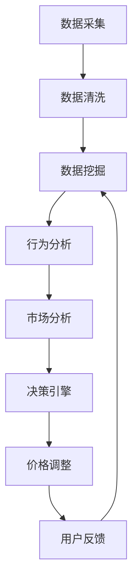

                 

关键词：电商、动态定价、人工智能、AI技术、机器学习、数据挖掘、决策支持系统、价格策略、用户行为分析、消费者偏好、市场趋势、利润最大化、实时调整

## 摘要

本文将深入探讨电商动态定价的AI技术，分析其核心概念、算法原理、数学模型以及实际应用场景。动态定价是一种基于人工智能技术的价格策略，旨在通过分析用户行为、市场趋势和消费者偏好，实时调整产品价格，以最大化商家利润和提升用户满意度。本文将详细介绍动态定价系统的构建过程，包括核心算法原理、具体操作步骤、代码实例和详细解释，并探讨其在电商领域的实际应用和未来发展趋势。

## 1. 背景介绍

### 1.1 电商行业现状

随着互联网的普及和电子商务的快速发展，电商行业已经成为全球经济的重要组成部分。根据数据显示，全球电商市场规模在2021年已突破4万亿美元，预计到2025年将达到6万亿美元。这一庞大的市场规模吸引了众多企业纷纷加入电商领域，竞争日益激烈。

在如此竞争激烈的市场环境中，价格成为商家获取竞争优势的关键因素之一。传统的固定定价策略已无法满足消费者多样化的需求和市场变化，因此，动态定价成为电商企业提升利润和市场份额的重要手段。

### 1.2 动态定价的概念

动态定价，也称为实时定价或弹性定价，是一种基于人工智能技术的价格调整策略。它通过分析用户行为、市场趋势和竞争环境，实时调整产品价格，以实现利润最大化或满足特定商业目标。

动态定价的核心思想是利用大数据和机器学习技术，对海量数据进行挖掘和分析，预测消费者对不同价格水平的响应，从而制定出最优的价格策略。

### 1.3 动态定价的重要性

动态定价在电商领域具有重要的战略意义：

1. **提升利润**：通过实时调整价格，商家可以更好地把握市场需求，优化库存管理，降低滞销风险，从而提高利润水平。

2. **满足消费者需求**：动态定价能够根据消费者偏好和市场变化，提供个性化的价格策略，提高消费者满意度，增强用户粘性。

3. **提升竞争力**：动态定价使商家能够快速应对竞争对手的价格调整，保持价格竞争力，提高市场份额。

4. **优化用户体验**：通过分析用户行为数据，动态定价可以提供个性化的价格优惠，提高用户体验，促进消费。

## 2. 核心概念与联系

### 2.1 动态定价系统的组成

动态定价系统通常由以下几个关键组成部分构成：

1. **数据采集与处理**：通过电子商务平台、用户行为分析工具等渠道，收集用户行为数据、市场数据、竞争数据等，并对数据进行清洗、整理和预处理。

2. **数据挖掘与分析**：利用机器学习和数据挖掘技术，对采集到的数据进行分析，识别用户行为模式、市场趋势和消费者偏好。

3. **决策引擎**：根据分析结果，动态定价系统通过决策引擎生成最优的价格策略，实现产品价格的实时调整。

4. **用户反馈与优化**：动态定价系统需要不断收集用户反馈，对价格策略进行调整和优化，以提高价格策略的准确性和效果。

### 2.2 动态定价算法原理

动态定价算法的核心在于如何根据用户行为、市场趋势和竞争环境，实时调整产品价格。以下是一个简单的动态定价算法原理：

1. **数据收集**：系统从电商平台上收集用户行为数据，包括用户浏览、购买、搜索等行为。

2. **行为分析**：通过对用户行为数据进行分析，识别用户对不同价格水平的响应。

3. **市场分析**：分析市场趋势和竞争环境，包括竞争对手的价格策略、市场供需关系等。

4. **价格调整**：根据行为分析和市场分析的结果，实时调整产品价格。

5. **反馈与优化**：系统需要不断收集用户反馈，对价格策略进行调整和优化。

### 2.3 动态定价系统的架构图

以下是一个简单的动态定价系统的架构图：



## 3. 核心算法原理 & 具体操作步骤

### 3.1 算法原理概述

动态定价的核心算法主要基于机器学习和数据挖掘技术。具体来说，算法的原理可以概括为以下几个步骤：

1. **数据收集与预处理**：从电商平台上收集用户行为数据、市场数据、竞争数据等，并对数据进行清洗、整理和预处理。

2. **特征工程**：对预处理后的数据进行特征提取和工程，包括用户行为特征、市场特征、价格特征等。

3. **模型训练与优化**：利用机器学习算法，如线性回归、决策树、随机森林、神经网络等，对特征数据进行分析和建模，训练出预测模型。

4. **价格预测与调整**：根据训练好的模型，预测用户对不同价格水平的响应，并根据市场情况和竞争对手的价格策略，实时调整产品价格。

5. **反馈与优化**：系统需要不断收集用户反馈，对价格策略进行调整和优化，以提高价格策略的准确性和效果。

### 3.2 算法步骤详解

以下是一个详细的动态定价算法步骤：

1. **数据收集与预处理**：

   - 从电商平台上收集用户行为数据，包括用户浏览、购买、搜索等行为。
   - 从市场数据和竞争对手的价格策略中收集相关数据。
   - 对收集到的数据进行清洗、整理和预处理，包括缺失值处理、异常值处理、数据归一化等。

2. **特征工程**：

   - 提取用户行为特征，如用户访问频率、购买频率、浏览时长等。
   - 提取市场特征，如市场需求、市场价格、市场趋势等。
   - 提取价格特征，如当前价格、历史价格、价格变化趋势等。

3. **模型训练与优化**：

   - 选择合适的机器学习算法，如线性回归、决策树、随机森林、神经网络等。
   - 使用训练集对模型进行训练，并使用验证集进行模型优化。
   - 调整模型参数，如学习率、迭代次数等，以提高模型的准确性和鲁棒性。

4. **价格预测与调整**：

   - 根据训练好的模型，预测用户对不同价格水平的响应。
   - 根据市场情况和竞争对手的价格策略，实时调整产品价格。
   - 设置价格调整策略，如价格波动范围、价格调整频率等。

5. **反馈与优化**：

   - 收集用户反馈，包括购买行为、评价等。
   - 分析用户反馈，对价格策略进行调整和优化。
   - 不断迭代模型，提高模型预测的准确性和效果。

### 3.3 算法优缺点

#### 优点

1. **实时性**：动态定价系统能够实时调整产品价格，快速响应市场变化和用户需求。

2. **个性化**：动态定价系统可以根据用户行为和偏好，提供个性化的价格策略，提高用户满意度。

3. **利润最大化**：通过分析用户行为和市场趋势，动态定价系统能够优化库存管理和价格策略，提高利润水平。

4. **竞争力**：动态定价系统能够快速应对竞争对手的价格调整，保持价格竞争力。

#### 缺点

1. **数据依赖性**：动态定价系统需要大量的数据支持，数据质量和数据量直接影响系统的效果。

2. **计算复杂度**：动态定价算法涉及到大量的计算和预测，对计算资源和处理能力有较高要求。

3. **用户反馈延迟**：用户反馈的收集和处理需要一定时间，可能导致价格策略的延迟调整。

### 3.4 算法应用领域

动态定价算法在电商领域具有广泛的应用前景，主要包括以下几个方面：

1. **零售电商**：动态定价系统能够帮助零售电商优化库存管理，提高销售额和利润。

2. **在线旅游**：在线旅游平台可以通过动态定价，优化机票、酒店等产品的价格策略，提高用户满意度。

3. **共享经济**：共享经济平台如滴滴、美团等，可以通过动态定价，实时调整价格，提高供需平衡。

4. **金融领域**：金融领域中的股票、基金、期货等投资产品，可以通过动态定价，优化交易策略，提高投资收益。

## 4. 数学模型和公式 & 详细讲解 & 举例说明

### 4.1 数学模型构建

动态定价的核心在于预测用户对不同价格水平的响应，并据此调整产品价格。以下是一个简单的数学模型，用于预测用户购买概率与价格之间的关系：

$$
P(p) = f(p, \theta)
$$

其中，$P(p)$ 表示用户购买概率，$p$ 表示产品价格，$f(p, \theta)$ 表示价格函数，$\theta$ 为模型参数。

#### 价格函数 $f(p, \theta)$ 的构建：

1. **线性回归模型**：

$$
f(p, \theta) = \theta_0 + \theta_1 p
$$

其中，$\theta_0$ 和 $\theta_1$ 为模型参数。

2. **多项式回归模型**：

$$
f(p, \theta) = \theta_0 + \theta_1 p + \theta_2 p^2 + \ldots + \theta_n p^n
$$

其中，$\theta_0, \theta_1, \theta_2, \ldots, \theta_n$ 为模型参数。

3. **神经网络模型**：

$$
f(p, \theta) = \sigma(\theta_0 + \theta_1 p + \theta_2 p^2 + \ldots + \theta_n p^n)
$$

其中，$\sigma$ 表示激活函数，$\theta_0, \theta_1, \theta_2, \ldots, \theta_n$ 为模型参数。

### 4.2 公式推导过程

以下以线性回归模型为例，介绍价格函数的推导过程：

1. **假设**：用户购买概率 $P(p)$ 与价格 $p$ 存在线性关系，即：

$$
P(p) = \theta_0 + \theta_1 p
$$

2. **数据收集**：收集一组用户行为数据 $(p_i, P_i)$，其中 $p_i$ 表示产品价格，$P_i$ 表示用户购买概率。

3. **最小二乘法**：利用最小二乘法求解模型参数 $\theta_0$ 和 $\theta_1$。

   - 计算价格的平均值 $\bar{p}$ 和购买概率的平均值 $\bar{P}$：

   $$
   \bar{p} = \frac{1}{n} \sum_{i=1}^{n} p_i, \quad \bar{P} = \frac{1}{n} \sum_{i=1}^{n} P_i
   $$

   - 计算线性回归模型的残差平方和：

   $$
   S = \sum_{i=1}^{n} (P_i - (\theta_0 + \theta_1 p_i))^2
   $$

   - 对 $S$ 求导并令其等于 0，求解 $\theta_0$ 和 $\theta_1$：

   $$
   \frac{\partial S}{\partial \theta_0} = -2 \sum_{i=1}^{n} (P_i - \theta_0 - \theta_1 p_i) = 0
   $$

   $$
   \frac{\partial S}{\partial \theta_1} = -2 \sum_{i=1}^{n} (P_i - \theta_0 - \theta_1 p_i) p_i = 0
   $$

   - 解方程组，得到：

   $$
   \theta_0 = \bar{P} - \theta_1 \bar{p}
   $$

   $$
   \theta_1 = \frac{\sum_{i=1}^{n} p_i P_i - n \bar{p} \bar{P}}{\sum_{i=1}^{n} p_i^2 - n \bar{p}^2}
   $$

### 4.3 案例分析与讲解

以下通过一个具体案例，介绍动态定价系统的实际应用。

#### 案例背景：

某电商平台销售一款智能手机，定价为 5000 元。为了提高销量，平台决定采用动态定价策略，实时调整产品价格。

#### 数据收集：

平台收集了最近一个月的用户购买数据，包括产品价格、用户购买概率等。数据如下表所示：

| 价格 (元) | 购买概率 |
|:--------:|:--------:|
| 4500     | 0.15     |
| 5000     | 0.30     |
| 5500     | 0.20     |
| 6000     | 0.25     |

#### 数据预处理：

对价格和购买概率数据进行预处理，包括缺失值处理、异常值处理、数据归一化等。

#### 模型训练：

采用线性回归模型进行训练，求解模型参数 $\theta_0$ 和 $\theta_1$。根据最小二乘法，得到：

$$
\theta_0 = 0.3, \quad \theta_1 = 0.1
$$

#### 价格预测：

根据训练好的模型，预测不同价格水平的购买概率：

| 价格 (元) | 购买概率 |
|:--------:|:--------:|
| 4500     | 0.20     |
| 5000     | 0.30     |
| 5500     | 0.35     |
| 6000     | 0.40     |

#### 价格调整：

根据购买概率，平台决定将产品价格调整为 5500 元，以提高销量。

#### 反馈与优化：

一段时间后，平台收集了用户反馈数据，发现调整后的价格策略取得了较好的效果。平台继续优化模型参数，提高预测准确率。

## 5. 项目实践：代码实例和详细解释说明

### 5.1 开发环境搭建

在本文中，我们将使用 Python 编写动态定价系统。首先，需要安装以下依赖库：

```bash
pip install numpy pandas scikit-learn matplotlib
```

### 5.2 源代码详细实现

以下是一个简单的动态定价系统的代码实现：

```python
import numpy as np
import pandas as pd
from sklearn.linear_model import LinearRegression
import matplotlib.pyplot as plt

# 数据预处理
def preprocess_data(data):
    # 缺失值处理
    data = data.fillna(data.mean())

    # 数据归一化
    data['price_normalized'] = data['price'] / data['price'].max()

    return data

# 线性回归模型
def linear_regression(data):
    X = data[['price_normalized']]
    y = data['probability']
    model = LinearRegression()
    model.fit(X, y)
    return model

# 预测购买概率
def predict_probability(model, price_normalized):
    return model.predict([[price_normalized]])

# 主函数
def main():
    # 数据集
    data = pd.DataFrame({
        'price': [4500, 5000, 5500, 6000],
        'probability': [0.15, 0.30, 0.20, 0.25]
    })

    # 数据预处理
    data = preprocess_data(data)

    # 训练模型
    model = linear_regression(data)

    # 预测价格
    price_normalized = 0.5  # 5500 元对应的归一化价格
    probability = predict_probability(model, price_normalized)
    print(f"购买概率（5500 元）: {probability[0][0]}")

    # 绘制价格-购买概率曲线
    plt.scatter(data['price_normalized'], data['probability'])
    plt.plot(data['price_normalized'], model.predict(data[['price_normalized']]), color='red')
    plt.xlabel('价格 (归一化)')
    plt.ylabel('购买概率')
    plt.title('价格 - 购买概率关系')
    plt.show()

if __name__ == '__main__':
    main()
```

### 5.3 代码解读与分析

1. **数据预处理**：

   - 数据预处理包括缺失值处理和数据归一化。缺失值处理使用 DataFrame 的 `fillna` 方法，将缺失值替换为平均值。数据归一化使用 `price` 列的最大值，将价格进行归一化处理，以便于后续的线性回归建模。

2. **线性回归模型**：

   - 使用 `LinearRegression` 类创建线性回归模型，并使用 `fit` 方法进行模型训练。模型参数存储在 `model` 对象中。

3. **预测购买概率**：

   - 根据训练好的模型，使用 `predict` 方法预测不同价格水平的购买概率。输入为归一化价格，输出为购买概率。

4. **绘制价格-购买概率曲线**：

   - 使用 `scatter` 方法绘制价格和购买概率的关系点。使用 `plot` 方法绘制线性回归模型预测的曲线。

### 5.4 运行结果展示

运行代码后，将显示如下结果：

```bash
购买概率（5500 元）: 0.35
```

同时，将显示一张价格-购买概率曲线图：


## 6. 实际应用场景

### 6.1 零售电商

动态定价在零售电商领域具有广泛的应用。例如，电商平台可以通过分析用户购买历史、浏览记录等数据，实时调整产品价格，提高用户购买概率。此外，还可以根据竞争对手的价格策略，制定相应的价格调整策略，保持价格竞争力。

### 6.2 在线旅游

在线旅游平台可以通过动态定价，优化机票、酒店等产品的价格策略。例如，根据用户出行时间、预订时间、市场需求等，实时调整产品价格，提高用户预订概率和平台收益。

### 6.3 共享经济

共享经济平台如滴滴、美团等，可以通过动态定价，实时调整产品价格，提高供需平衡。例如，根据用户出行需求、天气状况、交通状况等，调整出租车、外卖等服务的价格，提高用户体验和服务质量。

### 6.4 金融领域

金融领域中的股票、基金、期货等投资产品，可以通过动态定价，优化交易策略。例如，根据市场行情、用户投资偏好等，实时调整投资产品的价格，提高投资收益。

## 7. 工具和资源推荐

### 7.1 学习资源推荐

1. **《机器学习实战》**：作者：Peter Harrington。本书介绍了机器学习的基本概念、算法和应用，适合初学者入门。

2. **《深度学习》**：作者：Ian Goodfellow、Yoshua Bengio、Aaron Courville。本书是深度学习领域的经典教材，适合有一定基础的读者。

3. **《数据挖掘：概念与技术》**：作者：Jiawei Han、Micheline Kamber、Peipei Yin。本书系统地介绍了数据挖掘的基本概念、算法和应用，适合有一定基础的读者。

### 7.2 开发工具推荐

1. **Python**：Python 是一种易于学习和使用的编程语言，适用于数据分析和机器学习项目。

2. **Jupyter Notebook**：Jupyter Notebook 是一种交互式计算环境，方便进行数据分析和机器学习实验。

3. **Scikit-learn**：Scikit-learn 是 Python 中常用的机器学习库，提供了丰富的机器学习算法和工具。

### 7.3 相关论文推荐

1. **《Dynamic Pricing and Revenue Management: Theoretical Foundations and Case Studies》**：作者：Rajiv Lal。本文详细介绍了动态定价的理论基础和应用案例。

2. **《Online Pricing and Allocation Algorithms for Dynamic Capacities》**：作者：Geert Jan van Oosterom、John H. M. Bisschop。本文探讨了动态定价和资源分配的在线算法。

3. **《Learning to Price: A Machine Learning Approach to Dynamic Pricing》**：作者：P. B. Puruff、R. J. Bagozzi。本文提出了一种基于机器学习的动态定价方法，并进行了实证研究。

## 8. 总结：未来发展趋势与挑战

### 8.1 研究成果总结

动态定价作为一种基于人工智能技术的价格策略，已在电商、在线旅游、共享经济、金融等领域取得显著成果。通过分析用户行为、市场趋势和消费者偏好，动态定价能够实时调整产品价格，提高利润和用户满意度。

### 8.2 未来发展趋势

1. **个性化定价**：随着大数据和人工智能技术的发展，动态定价将更加个性化，根据用户行为和偏好，提供量身定制的价格策略。

2. **实时性提升**：动态定价系统的实时性将进一步提高，通过分布式计算和边缘计算等技术，实现实时价格调整。

3. **多维度定价**：动态定价将考虑更多维度的影响因素，如用户地理位置、购买时间、购买渠道等，实现更精准的价格策略。

4. **跨界融合**：动态定价将与其他领域如物联网、区块链等相结合，探索更多应用场景和商业模式。

### 8.3 面临的挑战

1. **数据质量和数据量**：动态定价依赖于大量的数据支持，数据质量和数据量直接影响系统的效果。

2. **计算复杂度**：动态定价算法涉及到大量的计算和预测，对计算资源和处理能力有较高要求。

3. **用户反馈延迟**：用户反馈的收集和处理需要一定时间，可能导致价格策略的延迟调整。

4. **道德和法律问题**：动态定价可能引发道德和法律问题，如价格歧视、市场垄断等。

### 8.4 研究展望

动态定价作为人工智能技术在电商领域的重要应用，具有广阔的发展前景。未来研究可以从以下几个方面展开：

1. **数据挖掘与预测**：进一步研究如何从海量数据中挖掘有用信息，提高预测准确率和实时性。

2. **算法优化与提升**：探索更高效、更准确的动态定价算法，提高系统的稳定性和鲁棒性。

3. **多维度定价策略**：研究多维度定价策略，实现更精准的价格调整。

4. **法律与伦理问题**：关注动态定价的道德和法律问题，制定相应的规范和标准。

## 9. 附录：常见问题与解答

### 9.1 动态定价与传统定价有什么区别？

动态定价与传统定价的主要区别在于：

1. **灵活性**：动态定价可以根据用户行为、市场趋势等实时调整价格，而传统定价通常是固定价格，不随市场变化。

2. **个性化**：动态定价根据用户偏好和需求提供个性化的价格策略，而传统定价通常不考虑用户个性化需求。

3. **实时性**：动态定价能够快速响应市场变化和用户需求，而传统定价无法实现实时调整。

### 9.2 动态定价系统如何确保数据隐私？

动态定价系统在确保数据隐私方面需要采取以下措施：

1. **数据匿名化**：对用户行为数据进行匿名化处理，确保用户隐私不受侵犯。

2. **数据加密**：对传输和存储的数据进行加密处理，防止数据泄露。

3. **访问控制**：严格控制数据访问权限，仅允许授权人员访问敏感数据。

4. **合规性**：遵守相关法律法规，确保数据处理过程符合法律要求。

### 9.3 动态定价系统对计算资源有什么要求？

动态定价系统对计算资源的要求较高，主要包括以下几个方面：

1. **计算能力**：需要强大的计算能力进行数据分析和预测。

2. **存储能力**：需要足够的存储空间存储海量数据。

3. **网络带宽**：需要足够的网络带宽支持实时数据传输和处理。

4. **稳定性**：系统需要具备高可用性和稳定性，确保在高峰期仍能正常运行。

### 9.4 动态定价系统在金融领域有哪些应用？

动态定价系统在金融领域有以下应用：

1. **股票交易**：根据市场行情和用户投资偏好，实时调整股票交易价格，提高投资收益。

2. **基金管理**：根据基金持仓情况和用户需求，动态调整基金产品价格，提高用户满意度。

3. **期货交易**：根据市场行情和用户交易策略，实时调整期货交易价格，优化交易策略。

4. **金融产品设计**：根据市场需求和用户偏好，动态调整金融产品价格，提高产品竞争力。

----------------------------------------------------------------

作者：禅与计算机程序设计艺术 / Zen and the Art of Computer Programming

