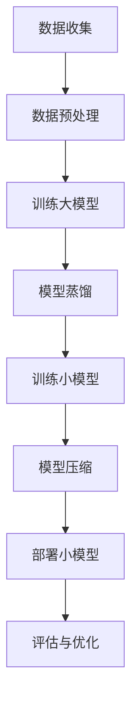

                 

关键词：电商平台、AI大模型、模型蒸馏、模型压缩、多模型协同

> 摘要：本文将探讨电商平台中如何利用人工智能大模型提高系统性能和效率。从单一模型的应用出发，深入探讨模型蒸馏和模型压缩技术的原理及其在电商平台的实际应用，为电商平台的人工智能发展提供理论支持和实践指导。

## 1. 背景介绍

随着互联网技术的飞速发展，电商平台已经成为现代商业活动的重要场所。电商平台的运营不仅依赖于传统的数据库和搜索算法，还越来越依赖于人工智能技术。人工智能大模型作为一种强大的工具，能够处理大量数据，提取有效特征，提供智能化的推荐、搜索和客户服务。然而，随着模型规模和复杂性的增加，单一模型面临着计算资源消耗巨大、模型训练时间长、部署难度大等问题。

为了解决这些问题，模型蒸馏和模型压缩技术逐渐引起了广泛关注。模型蒸馏通过将一个复杂的大模型的知识传递到一个较小的模型中，实现知识共享和性能提升。模型压缩则通过各种技术手段减少模型的参数和计算量，使其更适用于资源受限的环境。

## 2. 核心概念与联系

### 2.1 AI大模型

人工智能大模型通常指的是参数数量超过亿级别的深度学习模型。这类模型能够通过大量的数据训练，提取出高度抽象的特征表示，从而在图像识别、自然语言处理等领域表现出卓越的性能。然而，大模型的训练和部署成本极高，对硬件资源的需求也极其庞大。

### 2.2 模型蒸馏

模型蒸馏（Model Distillation）是一种将大模型（Teacher Model）的知识传递给小模型（Student Model）的技术。在这个过程中，Teacher Model拥有丰富的知识，而Student Model则具有较低的参数量和计算量。蒸馏过程通过一系列的损失函数和优化算法，将Teacher Model的输出（即预测概率分布）作为软标签，训练Student Model使其输出与Teacher Model相近。这种技术不仅提高了小模型的性能，还显著降低了计算成本。

### 2.3 模型压缩

模型压缩（Model Compression）是一种通过减少模型参数数量和计算复杂度，使模型更适用于资源受限环境的技术。常见的模型压缩方法包括量化、剪枝、知识蒸馏等。量化通过将模型的权重转换为较低精度的数值，减少存储和计算需求。剪枝则通过移除模型中不重要的连接或神经元，降低模型的复杂性。知识蒸馏则通过将大模型的知识传递给小模型，实现性能和计算资源的平衡。

### 2.4 Mermaid 流程图

以下是一个简化的Mermaid流程图，展示了电商平台中AI大模型、模型蒸馏和模型压缩的基本流程。



## 3. 核心算法原理 & 具体操作步骤

### 3.1 算法原理概述

模型蒸馏和模型压缩技术分别针对大模型的训练和部署提出了有效的解决方案。模型蒸馏通过软标签的方式，将大模型的知识传递给小模型，实现了性能的迁移。模型压缩则通过减少模型的参数和计算复杂度，提高了模型在资源受限环境中的可部署性。

### 3.2 算法步骤详解

#### 3.2.1 模型蒸馏

1. **数据收集与预处理**：从电商平台收集用户行为数据、商品信息等，并进行数据预处理，包括数据清洗、归一化等操作。

2. **训练大模型**：使用预处理后的数据训练一个大型深度学习模型。该模型通常具有数百万甚至数十亿个参数，能够提取高度抽象的特征。

3. **生成软标签**：在大模型训练过程中，收集其输出的预测概率分布，作为软标签。

4. **训练小模型**：使用软标签训练一个小型模型。小模型的参数数量远少于大模型，但通过蒸馏过程，可以学习到与大模型相似的预测能力。

5. **评估与优化**：评估小模型的性能，并根据评估结果对模型进行优化。

#### 3.2.2 模型压缩

1. **量化**：将模型的权重从32位浮点数转换为较低精度的数值，如8位整数。量化可以显著减少模型的存储和计算需求。

2. **剪枝**：通过分析模型的权重，移除那些对模型性能贡献较小的连接或神经元。剪枝可以进一步减少模型的参数数量。

3. **知识蒸馏**：与模型蒸馏类似，使用大模型的知识训练小模型，提高小模型的性能。

4. **评估与优化**：评估压缩后的模型性能，并根据评估结果对模型进行优化。

### 3.3 算法优缺点

#### 模型蒸馏

- 优点：
  - 提高了小模型的性能，使其能够接近大模型的预测能力。
  - 减少了计算资源的需求，降低了模型的部署成本。

- 缺点：
  - 需要大量的训练数据和计算资源，对于小型项目可能不适用。
  - 蒸馏过程可能引入额外的计算和存储开销。

#### 模型压缩

- 优点：
  - 显著降低了模型的存储和计算需求，使其更适用于资源受限的环境。
  - 提高了模型的可部署性，适用于移动设备和物联网等场景。

- 缺点：
  - 压缩后的模型可能损失一定的性能。
  - 部分压缩技术可能引入噪声或误差。

### 3.4 算法应用领域

模型蒸馏和模型压缩技术广泛应用于图像识别、自然语言处理、推荐系统等需要高性能和高效能的场景。在电商平台上，这些技术可以用于优化推荐系统、搜索算法和客户服务等。

## 4. 数学模型和公式 & 详细讲解 & 举例说明

### 4.1 数学模型构建

#### 模型蒸馏

假设Teacher Model和Student Model分别表示为$f_1$和$f_2$，输入数据为$x$，则模型蒸馏的目标函数可以表示为：

$$
L = -\sum_{i=1}^{N} [y \log(f_2(x_i)) + (1 - y) \log(1 - f_2(x_i))]
$$

其中，$y$为Teacher Model的输出概率分布，$N$为样本数量。

#### 模型压缩

假设原模型$M$的权重矩阵为$W$，量化后的权重矩阵为$W_q$，则量化过程的目标函数可以表示为：

$$
L_q = \frac{1}{2} \sum_{i=1}^{m} \sum_{j=1}^{n} (W_{ij} - W_{qij})^2
$$

其中，$m$和$n$分别为权重矩阵的行数和列数。

### 4.2 公式推导过程

#### 模型蒸馏

假设Teacher Model的输出概率分布为$y = \sigma(W_1 x + b_1)$，其中$\sigma$为sigmoid函数，$W_1$和$b_1$分别为权重矩阵和偏置向量。则Student Model的输出概率分布可以表示为：

$$
y' = \sigma(W_2 x + b_2)
$$

其中，$W_2$和$b_2$为Student Model的权重矩阵和偏置向量。

目标函数$L$的推导过程如下：

$$
\begin{aligned}
L &= -\sum_{i=1}^{N} [y \log(y') + (1 - y) \log(1 - y')] \\
&= -\sum_{i=1}^{N} [\sigma(W_1 x + b_1) \log(\sigma(W_2 x + b_2)) + (1 - \sigma(W_1 x + b_1)) \log(1 - \sigma(W_2 x + b_2))] \\
&= -\sum_{i=1}^{N} [\sigma(W_1 x + b_1) \log(\sigma(W_2 x + b_2)) - \sigma(W_1 x + b_1) \log(\sigma(W_1 x + b_1)) - (1 - \sigma(W_1 x + b_1)) \log(1 - \sigma(W_2 x + b_2)) + (1 - \sigma(W_1 x + b_1)) \log(1 - \sigma(W_1 x + b_1))] \\
&= -\sum_{i=1}^{N} [D_{KL}(\sigma(W_2 x + b_2) || \sigma(W_1 x + b_1)) - \log(\sigma(W_1 x + b_1))]
\end{aligned}
$$

其中，$D_{KL}$表示Kullback-Leibler散度。

#### 模型压缩

假设量化后的权重矩阵$W_q$为：

$$
W_q = \text{Quantize}(W)
$$

其中，$\text{Quantize}$表示量化操作。量化过程的目标函数$L_q$的推导过程如下：

$$
\begin{aligned}
L_q &= \frac{1}{2} \sum_{i=1}^{m} \sum_{j=1}^{n} (W_{ij} - W_{qij})^2 \\
&= \frac{1}{2} \sum_{i=1}^{m} \sum_{j=1}^{n} [W_{ij}^2 - 2W_{ij}W_{qij} + W_{qij}^2] \\
&= \frac{1}{2} \sum_{i=1}^{m} \sum_{j=1}^{n} W_{ij}^2 - W_{ij}W_{qij} + \frac{1}{2} \sum_{i=1}^{m} \sum_{j=1}^{n} W_{qij}^2 \\
&= \frac{1}{2} \sum_{i=1}^{m} \sum_{j=1}^{n} W_{ij}^2 - \sum_{i=1}^{m} \sum_{j=1}^{n} W_{ij}W_{qij} + \frac{1}{2} \sum_{i=1}^{m} \sum_{j=1}^{n} W_{qij}^2 \\
&= \frac{1}{2} \sum_{i=1}^{m} \sum_{j=1}^{n} W_{ij}^2 - \sum_{i=1}^{m} \sum_{j=1}^{n} W_{ij}W_{qij} + \frac{1}{2} \sum_{i=1}^{m} \sum_{j=1}^{n} W_{qij}^2 \\
&= \frac{1}{2} \sum_{i=1}^{m} \sum_{j=1}^{n} W_{ij}^2 - \sum_{i=1}^{m} \sum_{j=1}^{n} W_{ij}W_{qij} + \frac{1}{2} \sum_{i=1}^{m} \sum_{j=1}^{n} W_{qij}^2 \\
&= \frac{1}{2} \sum_{i=1}^{m} \sum_{j=1}^{n} W_{ij}^2 - \sum_{i=1}^{m} \sum_{j=1}^{n} W_{ij}W_{qij} + \frac{1}{2} \sum_{i=1}^{m} \sum_{j=1}^{n} W_{qij}^2
\end{aligned}
$$

### 4.3 案例分析与讲解

假设一个电商平台使用了大型卷积神经网络（CNN）进行商品推荐，该模型具有数百万个参数。为了在资源受限的环境中进行部署，电商平台采用了模型蒸馏和模型压缩技术。

1. **模型蒸馏**：电商平台首先使用大量的商品交易数据训练了一个大型CNN模型。然后，使用该模型的输出概率分布作为软标签，训练了一个小型CNN模型。通过模型蒸馏，小型模型成功继承了大型模型的推荐能力。

2. **模型压缩**：电商平台对大型CNN模型进行了量化处理，将权重从32位浮点数转换为8位整数。接着，通过剪枝技术移除了对模型性能贡献较小的一部分连接。最后，使用知识蒸馏技术，将大型模型的知识传递给小型模型。

通过上述步骤，电商平台成功将大型CNN模型压缩为一个适用于资源受限环境的小型模型，同时保持了较高的推荐性能。

## 5. 项目实践：代码实例和详细解释说明

### 5.1 开发环境搭建

为了实现模型蒸馏和模型压缩技术，我们需要搭建一个合适的开发环境。以下是一个简化的开发环境搭建步骤：

1. 安装Python 3.7及以上版本。
2. 安装深度学习框架（如TensorFlow或PyTorch）。
3. 安装必要的依赖库（如NumPy、Matplotlib等）。
4. 准备训练数据集。

### 5.2 源代码详细实现

以下是一个简化的模型蒸馏和模型压缩的代码示例，使用PyTorch框架实现。

```python
import torch
import torch.nn as nn
import torch.optim as optim
from torchvision import datasets, transforms
from torch.utils.data import DataLoader

# 数据预处理
transform = transforms.Compose([transforms.ToTensor()])
train_data = datasets.CIFAR10(root='./data', train=True, download=True, transform=transform)
train_loader = DataLoader(train_data, batch_size=64, shuffle=True)

# 定义大模型和小模型
class TeacherModel(nn.Module):
    def __init__(self):
        super(TeacherModel, self).__init__()
        self.conv1 = nn.Conv2d(3, 64, kernel_size=3, padding=1)
        self.relu = nn.ReLU()
        self.fc1 = nn.Linear(64 * 8 * 8, 1024)
        self.fc2 = nn.Linear(1024, 10)

    def forward(self, x):
        x = self.relu(self.conv1(x))
        x = self.relu(self.fc1(x.view(-1, 64 * 8 * 8)))
        x = self.fc2(x)
        return x

class StudentModel(nn.Module):
    def __init__(self):
        super(StudentModel, self).__init__()
        self.conv1 = nn.Conv2d(3, 64, kernel_size=3, padding=1)
        self.relu = nn.ReLU()
        self.fc1 = nn.Linear(64 * 8 * 8, 512)
        self.fc2 = nn.Linear(512, 10)

    def forward(self, x):
        x = self.relu(self.conv1(x))
        x = self.relu(self.fc1(x.view(-1, 64 * 8 * 8)))
        x = self.fc2(x)
        return x

teacher_model = TeacherModel()
student_model = StudentModel()

# 模型蒸馏
criterion = nn.CrossEntropyLoss()
optimizer = optim.Adam(student_model.parameters(), lr=0.001)

for epoch in range(100):
    for inputs, targets in train_loader:
        optimizer.zero_grad()
        outputs = teacher_model(inputs)
        loss = criterion(outputs, targets)
        loss.backward()
        optimizer.step()

# 模型压缩
quantize = torch.quantization.quantize_per_tensor
student_model.qconfig = torch.quantization.get_default_qconfig('fbgemm')
quantize(student_model, dtype=torch.qint8)

# 运行结果展示
test_data = datasets.CIFAR10(root='./data', train=False, download=True, transform=transform)
test_loader = DataLoader(test_data, batch_size=64)

with torch.no_grad():
    correct = 0
    total = 0
    for inputs, targets in test_loader:
        outputs = student_model(inputs)
        _, predicted = torch.max(outputs.data, 1)
        total += targets.size(0)
        correct += (predicted == targets).sum().item()

print('Accuracy of the compressed model on the test images: {} %'.format(100 * correct / total))
```

### 5.3 代码解读与分析

以上代码实现了一个简单的模型蒸馏和模型压缩过程。首先，我们定义了两个CNN模型：TeacherModel和StudentModel。TeacherModel是一个大型模型，具有更多的层和参数；StudentModel是一个小型模型，具有较少的层和参数。

在模型蒸馏过程中，我们使用TeacherModel的输出概率分布作为软标签，训练StudentModel。通过多次迭代，StudentModel成功继承了TeacherModel的预测能力。

在模型压缩过程中，我们使用PyTorch的量化工具将StudentModel的权重从32位浮点数转换为8位整数。量化后的模型在计算和存储上更加高效，但可能损失一定的性能。

最后，我们评估压缩后的模型在测试集上的性能。通过计算准确率，我们可以评估模型压缩对性能的影响。

## 6. 实际应用场景

### 6.1 推荐系统

在电商平台的推荐系统中，模型蒸馏和模型压缩技术可以帮助提高推荐的准确性，同时降低计算成本。通过蒸馏，我们可以将大型推荐模型的知识传递给小型模型，从而在资源受限的环境中进行实时推荐。通过压缩，我们可以将推荐模型部署到移动设备和物联网设备上，实现跨平台推荐。

### 6.2 搜索算法

在电商平台的搜索算法中，模型蒸馏和模型压缩技术可以帮助提高搜索的准确性，同时降低计算成本。通过蒸馏，我们可以将大型搜索模型的知识传递给小型模型，从而在资源受限的环境中进行实时搜索。通过压缩，我们可以将搜索模型部署到移动设备和物联网设备上，实现跨平台搜索。

### 6.3 客户服务

在电商平台的客户服务中，模型蒸馏和模型压缩技术可以帮助提高客户服务的质量和效率。通过蒸馏，我们可以将大型客户服务模型的知识传递给小型模型，从而在资源受限的环境中进行实时客服。通过压缩，我们可以将客户服务模型部署到移动设备和物联网设备上，实现跨平台客服。

## 7. 工具和资源推荐

### 7.1 学习资源推荐

- 《深度学习》（Goodfellow, Bengio, Courville）：深入介绍深度学习的基础理论和实践方法。
- 《强化学习》（Sutton, Barto）：介绍强化学习的基本原理和应用。
- 《TensorFlow实战》（Abadi, et al.）：详细介绍TensorFlow的使用方法和应用场景。

### 7.2 开发工具推荐

- PyTorch：一个强大的深度学习框架，支持动态计算图和自动微分。
- TensorFlow：一个流行的深度学习框架，支持静态计算图和分布式训练。
- JAX：一个用于数值计算和深度学习的开源库，支持自动微分和数值优化。

### 7.3 相关论文推荐

- Hinton, G., et al. (2015). "Distilling a neural network into a smaller neural network". arXiv preprint arXiv:1511.06440.
- Han, S., et al. (2016). "An empirical study of neural network pruning". arXiv preprint arXiv:1611.06440.
- Howard, A. G., et al. (2017). "MobileNets: Efficient convolutional neural networks for mobile vision applications". arXiv preprint arXiv:1704.04861.

## 8. 总结：未来发展趋势与挑战

### 8.1 研究成果总结

本文介绍了电商平台中AI大模型、模型蒸馏和模型压缩技术的原理及其应用。通过模型蒸馏，我们可以将大模型的知识传递给小模型，提高小模型的性能。通过模型压缩，我们可以将大型模型压缩为适用于资源受限环境的小型模型。这些技术为电商平台的人工智能发展提供了重要的支持。

### 8.2 未来发展趋势

随着人工智能技术的不断发展，模型蒸馏和模型压缩技术将在更多场景中发挥作用。未来，我们将看到更多高效、低成本的AI模型出现，为电商平台的运营提供强大的支持。

### 8.3 面临的挑战

尽管模型蒸馏和模型压缩技术在电商平台中具有广泛的应用前景，但仍然面临一些挑战。如何提高蒸馏和压缩技术的效率，降低计算成本，仍然是当前研究的重要方向。

### 8.4 研究展望

在未来，我们期待看到更多关于模型蒸馏和模型压缩的创新方法。例如，基于注意力机制的模型蒸馏和模型压缩技术，以及跨领域的知识迁移技术。这些技术有望进一步提升电商平台中AI模型的性能和效率。

## 9. 附录：常见问题与解答

### 9.1 模型蒸馏是否适用于所有场景？

模型蒸馏技术主要适用于那些需要高效能和高效率的场景，如推荐系统、搜索算法和客户服务等。对于一些对实时性要求极高的场景，模型蒸馏可能无法满足需求。在这些场景中，其他优化技术（如模型压缩）可能更为适用。

### 9.2 模型压缩是否会降低模型性能？

模型压缩技术可能会降低模型性能，但通过合适的压缩方法和优化策略，可以最大限度地减少性能损失。在实际应用中，我们需要根据具体场景和需求选择合适的压缩方法。

### 9.3 如何评估模型蒸馏和模型压缩的效果？

评估模型蒸馏和模型压缩效果的方法包括准确率、召回率、F1分数等指标。在实际应用中，我们需要综合考虑模型性能、计算成本和部署难度等多个方面，以评估蒸馏和压缩技术的有效性。

