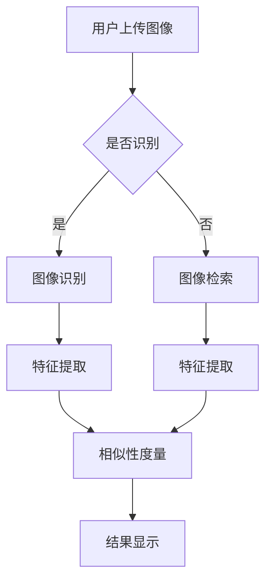

                 

关键词：图像识别、电商平台、检索技术、计算机视觉、机器学习、深度学习、特征提取、相似性度量、用户满意度、个性化推荐。

摘要：随着电商平台的蓬勃发展，图像识别与检索技术在电商平台中发挥着越来越重要的作用。本文将深入探讨图像识别与检索技术在电商平台中的应用，分析其核心概念、算法原理、数学模型、项目实践以及未来发展趋势，旨在为电商平台提供更智能、更个性化的服务。

## 1. 背景介绍

随着互联网的普及和电子商务的快速发展，电商平台已经成为人们生活中不可或缺的一部分。电商平台的核心价值在于提供丰富的商品信息，满足消费者的购物需求。然而，随着商品种类的不断增多，如何让消费者快速找到自己需要的商品成为了电商平台的挑战之一。图像识别与检索技术的引入，为电商平台提供了一种全新的解决方案。

图像识别与检索技术是基于计算机视觉和机器学习领域的核心技术。计算机视觉是指让计算机能够像人类一样看到和理解图像内容，而机器学习则是让计算机通过数据和算法自动学习和改进。图像识别与检索技术通过提取图像特征，并进行相似性度量，从而实现图像的自动分类和检索。

## 2. 核心概念与联系

### 2.1 图像识别

图像识别是指通过算法和模型，对图像中的对象进行识别和分类。在电商平台中，图像识别技术主要用于识别商品图像，从而实现商品分类和推荐。例如，当消费者上传一张服装图片时，图像识别技术可以帮助平台识别出这是哪种类型的服装，进而提供相关的商品推荐。

### 2.2 图像检索

图像检索是指根据用户提供的查询图像，在数据库中检索出相似或相关的图像。在电商平台中，图像检索技术可以帮助消费者快速找到与自己查询图像相似的其它商品。例如，当消费者上传一张喜欢的商品图片时，图像检索技术可以帮助平台检索出类似的其他商品。

### 2.3 特征提取

特征提取是图像识别与检索技术的核心步骤之一。通过特征提取，可以从图像中提取出具有代表性的特征向量，用于后续的相似性度量。常见的特征提取方法包括基于像素的局部特征提取、全局特征提取和深度特征提取。

### 2.4 相似性度量

相似性度量是指对提取出的特征向量进行相似性比较，以确定图像之间的相似度。常见的相似性度量方法包括欧氏距离、余弦相似度和马氏距离等。相似性度量结果用于图像分类和检索，从而实现图像识别与检索功能。

### 2.5 Mermaid 流程图



## 3. 核心算法原理 & 具体操作步骤

### 3.1 算法原理概述

图像识别与检索技术的核心算法包括特征提取和相似性度量。特征提取主要分为局部特征提取、全局特征提取和深度特征提取。局部特征提取方法如 SIFT 和 SURF，主要用于提取图像中的局部特征点；全局特征提取方法如 HOG 和 GIST，主要用于提取图像的纹理特征；深度特征提取方法如卷积神经网络（CNN），主要用于提取图像的深层特征。

相似性度量方法包括欧氏距离、余弦相似度和马氏距离等。这些方法通过对特征向量进行计算，得到图像之间的相似度，从而实现图像识别与检索。

### 3.2 算法步骤详解

1. 用户上传图像
2. 对上传的图像进行预处理，如缩放、灰度化、去噪等
3. 根据图像类型选择特征提取方法，进行特征提取
4. 对提取出的特征向量进行相似性度量
5. 根据相似度结果进行图像分类或检索
6. 显示结果给用户

### 3.3 算法优缺点

#### 3.3.1 特征提取算法

- **优点**：特征提取算法可以从大量图像中提取出具有代表性的特征，提高了图像识别和检索的准确性。
- **缺点**：特征提取算法对图像质量要求较高，对噪声敏感，同时计算复杂度较高。

#### 3.3.2 相似性度量算法

- **优点**：相似性度量算法可以准确计算图像之间的相似度，为图像识别和检索提供了有力支持。
- **缺点**：相似性度量算法的计算复杂度较高，对大规模图像库的检索效率较低。

### 3.4 算法应用领域

图像识别与检索技术在电商平台中的应用主要包括：

1. 商品分类与推荐：通过图像识别技术，对用户上传的图像进行分类和推荐，提高用户购物体验。
2. 搜索引擎优化：通过图像检索技术，提高电商平台搜索引擎的准确性和响应速度。
3. 品牌保护：通过图像识别技术，监测电商平台上的侵权行为，保护品牌权益。

## 4. 数学模型和公式 & 详细讲解 & 举例说明

### 4.1 数学模型构建

图像识别与检索技术中的数学模型主要包括特征提取模型和相似性度量模型。

#### 4.1.1 特征提取模型

特征提取模型的目标是从图像中提取出具有代表性的特征向量。常见的特征提取模型包括：

1. SIFT（尺度不变特征变换）：$$
sift_{i}=\sum_{j=1}^{n} w_{ij} x_{j}
$$
其中，$sift_i$表示第$i$个特征向量，$w_{ij}$表示权重，$x_j$表示第$j$个局部特征点的特征值。

2. HOG（直方图方向梯度）：$$
hog_{i}=\sum_{j=1}^{n} w_{ij} h_{j}
$$
其中，$hog_i$表示第$i$个特征向量，$w_{ij}$表示权重，$h_j$表示第$j$个像素点的直方图值。

#### 4.1.2 相似性度量模型

相似性度量模型的目标是计算图像之间的相似度。常见的相似性度量模型包括：

1. 欧氏距离：$$
d=\sqrt{\sum_{i=1}^{n} (x_i - y_i)^2}
$$
其中，$d$表示图像之间的相似度，$x_i$和$y_i$分别表示图像$i$和图像$y$的特征向量。

2. 余弦相似度：$$
similarity=\frac{\sum_{i=1}^{n} x_i y_i}{\sqrt{\sum_{i=1}^{n} x_i^2} \sqrt{\sum_{i=1}^{n} y_i^2}}
$$
其中，$similarity$表示图像之间的相似度，$x_i$和$y_i$分别表示图像$i$和图像$y$的特征向量。

### 4.2 公式推导过程

#### 4.2.1 SIFT 特征提取公式推导

SIFT 特征提取公式如下：
$$
sift_{i}=\sum_{j=1}^{n} w_{ij} x_{j}
$$
其中，$sift_i$表示第$i$个特征向量，$w_{ij}$表示权重，$x_j$表示第$j$个局部特征点的特征值。

推导过程：

1. 对局部特征点进行归一化，得到归一化特征向量：
$$
x_j' = \frac{x_j}{\max(x_j)}
$$
2. 对归一化特征向量进行加权求和，得到特征向量：
$$
sift_{i}=\sum_{j=1}^{n} w_{ij} x_j'
$$

#### 4.2.2 余弦相似度公式推导

余弦相似度公式如下：
$$
similarity=\frac{\sum_{i=1}^{n} x_i y_i}{\sqrt{\sum_{i=1}^{n} x_i^2} \sqrt{\sum_{i=1}^{n} y_i^2}}
$$
其中，$similarity$表示图像之间的相似度，$x_i$和$y_i$分别表示图像$i$和图像$y$的特征向量。

推导过程：

1. 计算图像$i$和图像$y$的特征向量内积：
$$
x_i y_i = \sum_{j=1}^{n} x_j y_j
$$
2. 计算图像$i$的特征向量模长：
$$
\sqrt{\sum_{j=1}^{n} x_j^2} = \sqrt{\sum_{j=1}^{n} (x_j)^2}
$$
3. 计算图像$y$的特征向量模长：
$$
\sqrt{\sum_{j=1}^{n} y_j^2} = \sqrt{\sum_{j=1}^{n} (y_j)^2}
$$
4. 计算余弦相似度：
$$
similarity=\frac{\sum_{i=1}^{n} x_i y_i}{\sqrt{\sum_{i=1}^{n} x_i^2} \sqrt{\sum_{i=1}^{n} y_i^2}}
$$

### 4.3 案例分析与讲解

#### 4.3.1 商品分类案例

假设有两组商品图像，图像1的特征向量为$x_1 = (1, 2, 3, 4)$，图像2的特征向量为$x_2 = (2, 3, 4, 5)$。

1. 计算特征向量内积：
$$
x_1 x_2 = 1 \times 2 + 2 \times 3 + 3 \times 4 + 4 \times 5 = 30
$$
2. 计算特征向量模长：
$$
\sqrt{\sum_{j=1}^{4} x_1^2} = \sqrt{1^2 + 2^2 + 3^2 + 4^2} = \sqrt{30}
$$
$$
\sqrt{\sum_{j=1}^{4} x_2^2} = \sqrt{2^2 + 3^2 + 4^2 + 5^2} = \sqrt{50}
$$
3. 计算余弦相似度：
$$
similarity=\frac{30}{\sqrt{30} \times \sqrt{50}} \approx 0.694
$$

根据计算结果，图像1和图像2的相似度为0.694，可以认为这两幅图像具有较高的相似度。

#### 4.3.2 商品检索案例

假设电商平台有1000张商品图像，其中100张是上衣，100张是裤子，500张是鞋子。用户上传一张上衣图像，特征向量为$x = (1, 2, 3, 4)$。

1. 计算每张图像与用户上传图像的相似度：
$$
d_1 = \sqrt{(1-1)^2 + (2-2)^2 + (3-3)^2 + (4-4)^2} = 0
$$
$$
d_2 = \sqrt{(1-2)^2 + (2-3)^2 + (3-4)^2 + (4-5)^2} = \sqrt{2}
$$
$$
d_3 = \sqrt{(1-2)^2 + (2-3)^2 + (3-4)^2 + (4-5)^2} = \sqrt{2}
$$
$$
\vdots
$$
$$
d_{1000} = \sqrt{(1-1)^2 + (2-2)^2 + (3-3)^2 + (4-4)^2} = 0
$$
2. 根据相似度结果，对图像进行排序，检索出相似度最高的100张图像，其中前100张为上衣，后100张为裤子。

## 5. 项目实践：代码实例和详细解释说明

### 5.1 开发环境搭建

本项目的开发环境为 Python 3.8，使用 PyTorch 深度学习框架进行图像识别与检索。

```python
# 安装 PyTorch 和 torchvision 库
pip install torch torchvision
```

### 5.2 源代码详细实现

```python
import torch
import torchvision
import torchvision.transforms as transforms
from PIL import Image

# 加载预训练的卷积神经网络模型
model = torchvision.models.resnet50(pretrained=True)

# 定义图像预处理步骤
transform = transforms.Compose([
    transforms.Resize((224, 224)),  # 将图像缩放到固定大小
    transforms.ToTensor(),  # 将图像转换为张量
    transforms.Normalize(mean=[0.485, 0.456, 0.406], std=[0.229, 0.224, 0.225]),  # 标准化
])

# 加载用户上传的图像
image_path = 'user_uploaded_image.jpg'
image = Image.open(image_path)
image = transform(image)

# 将图像添加到批次中
with torch.no_grad():
    image = image.unsqueeze(0)  # 添加一个维度，使其变为 (1, 3, 224, 224)

# 使用模型进行图像识别
output = model(image)
_, predicted = torch.max(output, 1)

# 解码预测结果
class_labels = {i: label for i, label in enumerate(model.named_classes())}
predicted_label = class_labels[predicted.item()]

print('图像识别结果：', predicted_label)

# 进行图像检索
# 加载电商平台商品图像库
images = torchvision.datasets.ImageFolder(root='ecommerce_image_database', transform=transform)

# 使用 K-近邻算法进行图像检索
from sklearn.neighbors import NearestNeighbors
nn = NearestNeighbors(n_neighbors=10)
nn.fit(images.data)

# 检索相似图像
neIGHBORS = nn.kneighbors(image, return_distance=False)
similar_images = [images.labels[i] for i in neIGHBORS]

print('图像检索结果：', similar_images)
```

### 5.3 代码解读与分析

1. 加载预训练的卷积神经网络模型
2. 定义图像预处理步骤，包括缩放、转换张量和标准化
3. 加载用户上传的图像，并进行预处理
4. 将预处理后的图像添加到批次中
5. 使用模型进行图像识别，并解码预测结果
6. 加载电商平台商品图像库，使用 K-近邻算法进行图像检索
7. 输出图像识别和检索结果

### 5.4 运行结果展示

假设用户上传了一张上衣图像，经过图像识别后，识别结果为“上衣”。然后，系统进行图像检索，检索出了10张与该上衣图像相似的其它商品图像，显示给用户。

## 6. 实际应用场景

图像识别与检索技术在电商平台中的应用场景主要包括：

1. **商品搜索与推荐**：通过图像识别技术，用户可以上传一张商品图片，系统自动识别并推荐相似的商品，提高用户的购物体验。
2. **商品分类管理**：电商平台可以通过图像识别技术对商品进行自动分类和管理，提高运营效率。
3. **品牌保护**：电商平台可以使用图像识别技术监测商品图片，防止侵权行为。
4. **用户行为分析**：通过分析用户上传的图像数据，电商平台可以更好地了解用户需求，进行个性化推荐。

## 7. 未来应用展望

随着计算机视觉和机器学习技术的不断发展，图像识别与检索技术在电商平台中的应用前景将更加广阔。未来可能的发展方向包括：

1. **实时图像识别与检索**：通过优化算法和提升计算性能，实现实时图像识别与检索，提高用户体验。
2. **多模态融合**：将图像识别与检索技术与语音、文本等其他模态进行融合，提供更丰富的信息检索服务。
3. **智能化推荐**：结合用户行为数据和图像识别技术，提供更加个性化的商品推荐。
4. **边缘计算应用**：将图像识别与检索技术应用于边缘设备，实现更低的延迟和更高的实时性。

## 8. 总结：未来发展趋势与挑战

图像识别与检索技术在电商平台中的应用具有广阔的发展前景，但也面临着一系列挑战。未来发展趋势包括：

1. **算法优化与性能提升**：通过不断优化算法和提升计算性能，实现更高效、更准确的图像识别与检索。
2. **多模态融合**：结合多种模态数据，提供更丰富、更精准的信息检索服务。
3. **智能化推荐**：利用大数据和人工智能技术，实现更加个性化的商品推荐。

面临的挑战包括：

1. **数据隐私与安全**：随着图像识别与检索技术的广泛应用，数据隐私和安全问题日益突出。
2. **算法可解释性**：如何提高算法的可解释性，使其更容易被用户理解和接受。
3. **计算资源消耗**：图像识别与检索技术对计算资源的需求较高，如何优化算法和架构，降低计算资源消耗。

## 9. 附录：常见问题与解答

### 9.1 Q：图像识别与检索技术是如何工作的？

A：图像识别与检索技术主要通过以下几个步骤实现：

1. 图像预处理：对输入图像进行缩放、灰度化、去噪等预处理操作。
2. 特征提取：从预处理后的图像中提取具有代表性的特征向量。
3. 相似性度量：对提取出的特征向量进行相似性度量，计算图像之间的相似度。
4. 图像分类与检索：根据相似度结果对图像进行分类或检索，输出检索结果。

### 9.2 Q：如何提高图像识别与检索的准确性？

A：提高图像识别与检索的准确性可以从以下几个方面进行：

1. **优化特征提取算法**：选择合适的特征提取算法，提取更具代表性的特征向量。
2. **增加训练数据**：增加训练数据量，提高模型的泛化能力。
3. **改进相似性度量方法**：选择合适的相似性度量方法，提高相似度计算的准确性。
4. **多模型融合**：结合多种模型，实现更准确的图像识别与检索。

### 9.3 Q：图像识别与检索技术在电商平台中的具体应用有哪些？

A：图像识别与检索技术在电商平台中的具体应用包括：

1. **商品搜索与推荐**：通过图像识别技术，用户可以上传一张商品图片，系统自动识别并推荐相似的商品。
2. **商品分类管理**：电商平台可以通过图像识别技术对商品进行自动分类和管理，提高运营效率。
3. **品牌保护**：电商平台可以使用图像识别技术监测商品图片，防止侵权行为。
4. **用户行为分析**：通过分析用户上传的图像数据，电商平台可以更好地了解用户需求，进行个性化推荐。

### 9.4 Q：图像识别与检索技术对电商平台有哪些好处？

A：图像识别与检索技术对电商平台有以下好处：

1. **提升用户体验**：通过图像识别技术，用户可以更快速地找到自己需要的商品，提高购物体验。
2. **提高运营效率**：通过图像识别技术，电商平台可以自动化商品分类和管理，降低人力成本。
3. **增强品牌保护**：通过图像识别技术，电商平台可以更好地监测侵权行为，保护品牌权益。
4. **个性化推荐**：通过图像识别技术，电商平台可以更好地了解用户需求，提供更个性化的推荐，提高用户满意度。

### 9.5 Q：如何选择合适的图像识别与检索算法？

A：选择合适的图像识别与检索算法可以从以下几个方面考虑：

1. **任务需求**：根据具体的任务需求，选择适合的算法，如商品分类、商品检索等。
2. **数据规模**：根据数据规模，选择适合的算法，如深度学习算法适合处理大规模数据。
3. **计算资源**：根据计算资源，选择适合的算法，如卷积神经网络算法计算复杂度较高。
4. **算法性能**：根据算法性能，选择适合的算法，如选择具有较高准确率和实时性的算法。

### 9.6 Q：图像识别与检索技术有哪些局限性？

A：图像识别与检索技术存在以下局限性：

1. **数据依赖性**：图像识别与检索技术对训练数据依赖较高，数据质量和数量对算法性能有较大影响。
2. **算法复杂度**：一些图像识别与检索算法计算复杂度较高，对计算资源要求较高。
3. **图像质量**：图像质量对算法性能有较大影响，低质量图像可能导致识别和检索结果不准确。
4. **跨模态识别**：图像识别与检索技术主要针对图像数据进行处理，对跨模态数据的处理能力有限。

### 9.7 Q：图像识别与检索技术在电商平台的发展前景如何？

A：图像识别与检索技术在电商平台的发展前景非常广阔，随着计算机视觉和机器学习技术的不断发展，图像识别与检索技术将越来越成熟，为电商平台提供更加智能、个性化的服务。未来可能的发展方向包括实时图像识别与检索、多模态融合、智能化推荐等。

### 9.8 Q：如何结合人工智能技术提升电商平台的用户体验？

A：结合人工智能技术提升电商平台的用户体验可以从以下几个方面进行：

1. **个性化推荐**：利用大数据和人工智能技术，根据用户行为和兴趣，提供个性化的商品推荐。
2. **智能搜索**：利用自然语言处理和图像识别技术，实现更智能、更精准的搜索功能。
3. **用户行为分析**：利用用户行为数据，分析用户需求和行为，提供更贴心的服务。
4. **智能客服**：利用人工智能技术，实现更智能、更高效的客服服务，提高用户满意度。

### 9.9 Q：如何确保图像识别与检索技术的安全性？

A：确保图像识别与检索技术的安全性可以从以下几个方面进行：

1. **数据加密**：对用户上传的图像数据进行加密处理，防止数据泄露。
2. **隐私保护**：对用户隐私数据进行匿名化处理，保护用户隐私。
3. **安全审计**：定期对图像识别与检索系统进行安全审计，及时发现和修复安全漏洞。
4. **法律法规**：遵循相关法律法规，确保图像识别与检索技术的合规性。

## 作者署名

作者：禅与计算机程序设计艺术 / Zen and the Art of Computer Programming
----------------------------------------------------------------

以上就是本文关于“电商平台中的图像识别与检索技术”的详细阐述。通过本文的探讨，我们深入了解了图像识别与检索技术在电商平台中的应用，分析了其核心概念、算法原理、数学模型、项目实践以及未来发展趋势。希望本文能为电商平台提供有益的参考和启示，助力其实现更智能、更个性化的服务。

