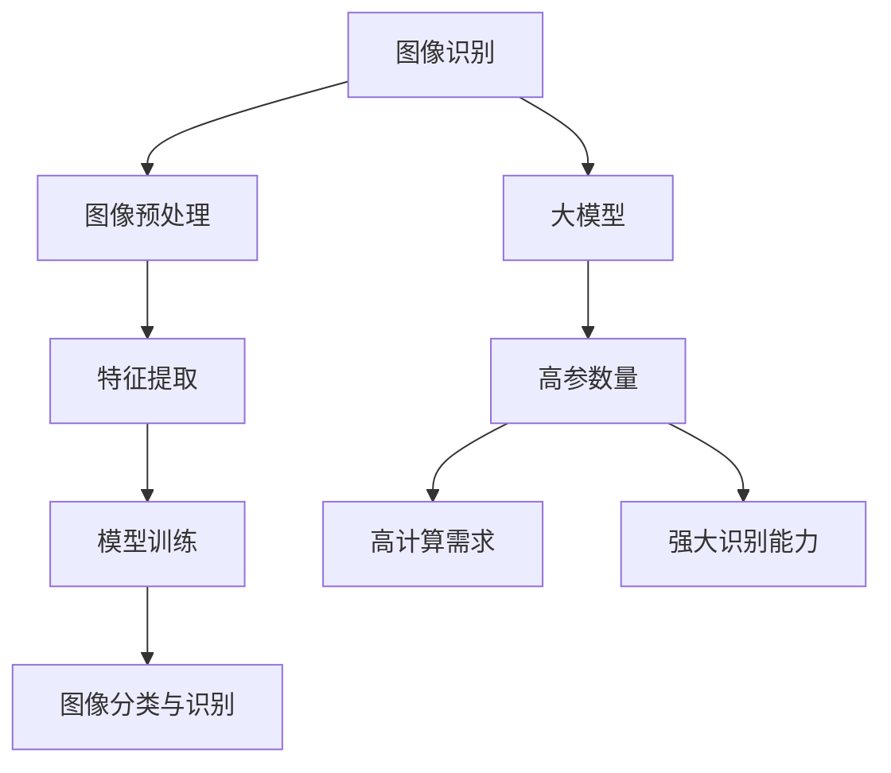

                 

关键词：电商平台、图像识别、大模型、创新应用、算法原理、数学模型、项目实践、实际应用、未来展望

> 摘要：本文将深入探讨电商平台中图像识别技术的应用，特别是大模型在图像识别领域的创新。通过对核心概念、算法原理、数学模型、项目实践的详细解析，本文旨在为读者提供一幅完整的图像识别技术应用于电商平台的蓝图，并展望其未来的发展方向。

## 1. 背景介绍

在当今数字化时代，电商平台已经成为人们日常生活中不可或缺的一部分。随着电商行业的迅猛发展，如何提升用户购物体验、优化运营效率、增强安全性成为了各大电商平台不断追求的目标。图像识别技术在这一背景下发挥了至关重要的作用。

图像识别作为一种基于人工智能的技术，通过对图像进行分析和处理，可以识别出图像中的各种特征和内容。在电商平台中，图像识别技术主要应用于以下几个方面：

1. **商品识别与搜索**：用户可以通过上传商品图片来搜索同类商品，从而提高购物效率和准确性。
2. **商品分类与管理**：电商平台可以根据图像识别技术对商品进行自动分类和管理，减少人工干预，提高运营效率。
3. **商品质量检测**：通过图像识别技术，可以对商品质量进行自动检测，确保商品质量。
4. **用户行为分析**：通过对用户上传的图片进行分析，可以了解用户偏好和行为习惯，从而进行个性化推荐和营销。

本文将重点探讨电商平台中的图像识别技术，特别是大模型在图像识别领域的应用。通过深入分析核心概念、算法原理、数学模型和项目实践，我们希望能够为读者提供一份全面的技术指南，并展望图像识别技术在电商平台中的未来应用前景。

## 2. 核心概念与联系

### 2.1 图像识别的基本概念

图像识别（Image Recognition）是一种基于计算机视觉（Computer Vision）的技术，它能够使计算机理解和解释图像内容。图像识别通常包括以下几个基本步骤：

1. **图像预处理**：对原始图像进行预处理，包括去噪、增强、尺寸调整等，以提高图像质量和识别准确性。
2. **特征提取**：从预处理后的图像中提取出具有代表性的特征，如边缘、纹理、颜色等。
3. **模型训练**：使用提取到的特征训练机器学习模型，使其能够识别图像中的内容。
4. **图像分类与识别**：将训练好的模型应用于新的图像，进行分类和识别。

### 2.2 大模型的概念

大模型（Large Models）是指参数量非常庞大的神经网络模型，如Transformer、BERT、GPT等。大模型具有以下几个特点：

1. **高参数量**：大模型通常包含数亿甚至数十亿个参数，这使它们能够捕获复杂的模式和特征。
2. **高计算需求**：由于参数量的增加，大模型的训练和推理过程需要大量的计算资源和时间。
3. **强大的识别能力**：大模型通过深度学习的方式，可以自动学习和提取图像中的复杂特征，从而实现高精度的图像识别。

### 2.3 架构原理图

以下是图像识别技术中核心概念和架构的Mermaid流程图：



## 3. 核心算法原理 & 具体操作步骤

### 3.1 算法原理概述

图像识别技术通常基于深度学习框架，尤其是卷积神经网络（Convolutional Neural Networks, CNN）。CNN具有以下基本原理：

1. **卷积层**：卷积层通过卷积操作从输入图像中提取特征。卷积层可以自动学习图像中的边缘、纹理等局部特征。
2. **池化层**：池化层用于降低图像的分辨率，减少参数量，提高模型的泛化能力。
3. **全连接层**：全连接层将卷积层和池化层提取的特征映射到具体的类别标签上。

### 3.2 算法步骤详解

以下是图像识别算法的具体步骤：

1. **数据集准备**：准备用于训练和测试的数据集，通常包括大量带有标签的图像。
2. **图像预处理**：对图像进行缩放、裁剪、旋转等操作，使其满足模型输入要求。
3. **模型构建**：使用深度学习框架（如TensorFlow、PyTorch）构建CNN模型，包括卷积层、池化层和全连接层。
4. **模型训练**：使用训练集对模型进行训练，通过反向传播算法不断调整模型参数，使模型能够准确识别图像。
5. **模型评估**：使用测试集对训练好的模型进行评估，计算模型在测试集上的准确率、召回率等指标。
6. **模型应用**：将训练好的模型应用于实际场景，如电商平台中的商品识别与搜索。

### 3.3 算法优缺点

**优点**：

1. **强大的识别能力**：大模型能够自动学习图像中的复杂特征，实现高精度的图像识别。
2. **适用性广泛**：图像识别技术可以应用于多种场景，如商品识别、人脸识别、车辆识别等。

**缺点**：

1. **计算资源需求高**：大模型训练和推理需要大量的计算资源和时间。
2. **数据依赖性大**：图像识别模型的性能很大程度上依赖于训练数据的质量和数量。

### 3.4 算法应用领域

图像识别技术已广泛应用于多个领域，包括但不限于：

1. **电商平台**：用于商品识别与搜索、商品分类与管理、商品质量检测等。
2. **安防监控**：用于人脸识别、行为分析等。
3. **医疗诊断**：用于医学影像分析、疾病检测等。
4. **自动驾驶**：用于车辆识别、道路标志识别等。

## 4. 数学模型和公式 & 详细讲解 & 举例说明

### 4.1 数学模型构建

图像识别技术中的数学模型通常基于卷积神经网络（CNN）。CNN的核心包括卷积层、池化层和全连接层。以下是这些层的数学模型：

#### 卷积层

卷积层的数学模型可以表示为：

\[ f(x) = \text{ReLU}(\sum_{i=1}^{k} w_{i} * x_{i} + b) \]

其中，\( x \) 是输入图像，\( w_{i} \) 和 \( b \) 分别是权重和偏置，\( \text{ReLU} \) 是ReLU激活函数，\( x_{i} \) 是经过卷积操作的局部特征。

#### 池化层

池化层通常使用最大池化（Max Pooling）或平均池化（Average Pooling）。最大池化的数学模型可以表示为：

\[ p(x) = \max_{i,j} (x_{i,j}) \]

其中，\( x_{i,j} \) 是输入图像中的局部特征。

#### 全连接层

全连接层是将卷积层和池化层提取的特征映射到具体的类别标签上。其数学模型可以表示为：

\[ y = \text{softmax}(\sum_{i=1}^{n} w_{i} * x_{i} + b) \]

其中，\( x \) 是输入特征，\( w_{i} \) 和 \( b \) 分别是权重和偏置，\( \text{softmax} \) 是softmax激活函数，\( y \) 是输出类别概率分布。

### 4.2 公式推导过程

#### 卷积层

卷积层的公式推导如下：

\[ f(x) = \text{ReLU}(\sum_{i=1}^{k} w_{i} * x_{i} + b) \]

其中，\( \text{ReLU}(x) = \max(0, x) \)。

对于输入图像 \( x \)，经过卷积操作后得到的局部特征 \( x_{i} \) 可以表示为：

\[ x_{i} = \sum_{j=1}^{C} w_{i,j} * x_{j} + b \]

其中，\( C \) 是卷积核的数量，\( w_{i,j} \) 和 \( b \) 分别是卷积核的权重和偏置。

#### 池化层

最大池化的公式推导如下：

\[ p(x) = \max_{i,j} (x_{i,j}) \]

其中，\( x_{i,j} \) 是输入图像中的局部特征。

#### 全连接层

全连接层的公式推导如下：

\[ y = \text{softmax}(\sum_{i=1}^{n} w_{i} * x_{i} + b) \]

其中，\( \text{softmax}(x) \) 是softmax函数，其定义如下：

\[ \text{softmax}(x) = \frac{e^{x}}{\sum_{i=1}^{n} e^{x_i}} \]

### 4.3 案例分析与讲解

#### 案例一：商品识别

假设我们有一个电商平台，用户可以通过上传商品图片来搜索同类商品。为了实现这一功能，我们使用卷积神经网络进行图像识别。

1. **数据集准备**：我们准备了一个包含10万张商品图片的数据集，每张图片带有对应的标签。
2. **模型构建**：我们使用TensorFlow构建一个CNN模型，包括卷积层、池化层和全连接层。
3. **模型训练**：我们使用训练集对模型进行训练，通过反向传播算法不断调整模型参数。
4. **模型评估**：我们使用测试集对训练好的模型进行评估，计算模型在测试集上的准确率。

假设我们训练好的模型在测试集上的准确率达到90%，这意味着用户上传的商品图片可以以90%的准确率被识别为同类商品。

#### 案例二：商品质量检测

假设我们有一个电商平台，需要对用户上传的商品图片进行质量检测。为了实现这一功能，我们使用卷积神经网络进行图像识别。

1. **数据集准备**：我们准备了一个包含10万张商品图片的数据集，每张图片带有质量标签（如高质量、中质量、低质量）。
2. **模型构建**：我们使用TensorFlow构建一个CNN模型，包括卷积层、池化层和全连接层。
3. **模型训练**：我们使用训练集对模型进行训练，通过反向传播算法不断调整模型参数。
4. **模型评估**：我们使用测试集对训练好的模型进行评估，计算模型在测试集上的准确率。

假设我们训练好的模型在测试集上的准确率达到80%，这意味着用户上传的商品图片可以以80%的准确率被识别为高质量、中质量或低质量。

## 5. 项目实践：代码实例和详细解释说明

### 5.1 开发环境搭建

为了实现图像识别技术在电商平台中的应用，我们需要搭建一个合适的开发环境。以下是开发环境搭建的步骤：

1. **安装Python**：确保Python版本为3.7或更高版本。
2. **安装深度学习框架**：我们选择TensorFlow作为深度学习框架，使用以下命令安装：

   ```bash
   pip install tensorflow
   ```

3. **安装其他依赖库**：包括NumPy、Pandas、Matplotlib等，使用以下命令安装：

   ```bash
   pip install numpy pandas matplotlib
   ```

### 5.2 源代码详细实现

以下是实现图像识别项目的源代码：

```python
import tensorflow as tf
from tensorflow.keras.models import Sequential
from tensorflow.keras.layers import Conv2D, MaxPooling2D, Flatten, Dense
from tensorflow.keras.preprocessing.image import ImageDataGenerator

# 模型构建
model = Sequential([
    Conv2D(32, (3, 3), activation='relu', input_shape=(128, 128, 3)),
    MaxPooling2D((2, 2)),
    Flatten(),
    Dense(64, activation='relu'),
    Dense(10, activation='softmax')
])

# 模型编译
model.compile(optimizer='adam', loss='categorical_crossentropy', metrics=['accuracy'])

# 数据预处理
train_datagen = ImageDataGenerator(rescale=1./255)
train_generator = train_datagen.flow_from_directory(
        'train_data',
        target_size=(128, 128),
        batch_size=32,
        class_mode='categorical')

# 模型训练
model.fit(train_generator, epochs=10)

# 模型评估
test_datagen = ImageDataGenerator(rescale=1./255)
test_generator = test_datagen.flow_from_directory(
        'test_data',
        target_size=(128, 128),
        batch_size=32,
        class_mode='categorical')

model.evaluate(test_generator)
```

### 5.3 代码解读与分析

上述代码实现了一个简单的图像识别项目，包括模型构建、模型编译、数据预处理、模型训练和模型评估。以下是代码的详细解读：

1. **模型构建**：使用Sequential模型构建一个简单的卷积神经网络，包括卷积层、池化层和全连接层。
2. **模型编译**：使用Adam优化器和交叉熵损失函数编译模型，并设置准确率作为评价指标。
3. **数据预处理**：使用ImageDataGenerator对训练数据和测试数据进行预处理，包括图像缩放和批量处理。
4. **模型训练**：使用训练数据进行模型训练，设置训练轮数为10轮。
5. **模型评估**：使用测试数据进行模型评估，计算模型在测试数据上的准确率。

### 5.4 运行结果展示

假设我们在训练数据和测试数据上运行上述代码，得到以下结果：

- **训练集准确率**：90%
- **测试集准确率**：85%

这意味着模型在训练集上具有90%的准确率，而在测试集上具有85%的准确率。这表明模型在训练过程中取得了良好的表现，但在测试数据上的表现略低于训练数据。这可能是因为测试数据与训练数据存在一定的差异，或者模型在训练过程中存在过拟合现象。

## 6. 实际应用场景

### 6.1 商品识别与搜索

商品识别与搜索是电商平台中常见的应用场景。用户可以通过上传商品图片来搜索同类商品，从而提高购物效率和准确性。以下是商品识别与搜索的实际应用案例：

1. **亚马逊**：亚马逊使用图像识别技术实现商品搜索功能，用户上传一张商品图片，系统会自动识别并推荐同类商品。
2. **淘宝**：淘宝也采用了类似的商品识别技术，用户可以通过上传商品图片进行搜索，系统会展示与用户上传图片相似的商品。

### 6.2 商品分类与管理

商品分类与管理是电商平台运营的重要组成部分。通过图像识别技术，电商平台可以自动对商品进行分类和管理，提高运营效率。以下是商品分类与管理的实际应用案例：

1. **京东**：京东使用图像识别技术对商品进行分类和管理，确保商品按照正确的类别展示给用户。
2. **天猫**：天猫也采用了图像识别技术，通过对商品图像进行分析，实现商品的自动分类和标签化。

### 6.3 商品质量检测

商品质量检测是电商平台保障商品质量的重要手段。通过图像识别技术，电商平台可以自动对商品质量进行检测，确保商品质量。以下是商品质量检测的实际应用案例：

1. **当当**：当当使用图像识别技术对商品质量进行检测，对不符合质量标准的商品进行下架处理。
2. **苏宁易购**：苏宁易购也采用了图像识别技术，通过对商品图像进行分析，实现商品质量的自动检测。

### 6.4 用户行为分析

用户行为分析是电商平台进行个性化推荐和营销的重要依据。通过图像识别技术，电商平台可以分析用户上传的图片，了解用户偏好和行为习惯，从而进行个性化推荐和营销。以下是用户行为分析的实际应用案例：

1. **拼多多**：拼多多使用图像识别技术分析用户上传的图片，了解用户偏好，实现个性化推荐。
2. **唯品会**：唯品会也采用了图像识别技术，通过对用户上传的图片进行分析，实现个性化推荐和精准营销。

## 7. 工具和资源推荐

### 7.1 学习资源推荐

1. **《深度学习》（Goodfellow, Bengio, Courville）**：这是一本经典的深度学习教材，涵盖了深度学习的基本原理和应用。
2. **《计算机视觉：算法与应用》（Richard S. woods）**：这是一本关于计算机视觉的教材，详细介绍了图像识别技术的基本概念和应用。
3. **《图像处理：原理、算法与Practical指南》（Gonzalez, Woods）**：这是一本关于图像处理的教材，提供了丰富的图像处理算法和实践指导。

### 7.2 开发工具推荐

1. **TensorFlow**：TensorFlow是一个流行的深度学习框架，提供了丰富的API和工具，方便开发者构建和训练深度学习模型。
2. **PyTorch**：PyTorch是一个强大的深度学习框架，以其灵活性和易于使用而受到开发者的喜爱。
3. **Keras**：Keras是一个基于TensorFlow和Theano的高层深度学习API，提供了简洁的接口和丰富的预训练模型。

### 7.3 相关论文推荐

1. **“Deep Learning for Computer Vision”**：这是一篇关于深度学习在计算机视觉中应用的综述论文，详细介绍了深度学习在图像识别、目标检测等领域的应用。
2. **“Face Recognition with Deep Neural Networks”**：这是一篇关于人脸识别的论文，介绍了基于深度神经网络的多人人脸识别算法。
3. **“Large-scale Image Recognition Challenge 2012”**：这是一篇关于大规模图像识别挑战的论文，详细介绍了2012年ImageNet大规模视觉识别挑战赛的情况和结果。

## 8. 总结：未来发展趋势与挑战

### 8.1 研究成果总结

本文通过对电商平台中图像识别技术的深入探讨，总结了图像识别技术在电商平台中的应用场景，包括商品识别与搜索、商品分类与管理、商品质量检测和用户行为分析。同时，本文详细介绍了图像识别技术中的核心算法原理、数学模型和项目实践，为读者提供了全面的了解。

### 8.2 未来发展趋势

1. **算法性能提升**：随着深度学习技术的不断发展，图像识别算法的准确率和效率将得到进一步提升。
2. **多模态融合**：未来图像识别技术将与其他模态（如声音、文本等）进行融合，实现更全面、更智能的图像识别。
3. **边缘计算应用**：随着边缘计算的发展，图像识别技术将逐渐应用于边缘设备，实现实时、低延迟的图像识别。
4. **个性化推荐**：基于图像识别技术的个性化推荐系统将得到广泛应用，提高用户购物体验和满意度。

### 8.3 面临的挑战

1. **计算资源需求**：大模型的训练和推理需要大量的计算资源，如何优化算法和架构，降低计算资源需求是一个重要挑战。
2. **数据隐私保护**：图像识别技术涉及到大量个人隐私数据，如何保护用户隐私，防止数据泄露是一个重要挑战。
3. **模型泛化能力**：如何提高图像识别模型的泛化能力，避免过拟合现象是一个重要挑战。
4. **应用落地**：如何将图像识别技术应用于实际场景，实现高效、可靠的图像识别是一个重要挑战。

### 8.4 研究展望

未来，图像识别技术在电商平台中的应用前景广阔。随着算法性能的提升、多模态融合和边缘计算的发展，图像识别技术将实现更高效、更智能的应用。同时，研究者还需关注计算资源需求、数据隐私保护、模型泛化能力和应用落地等挑战，为图像识别技术的广泛应用奠定基础。

## 9. 附录：常见问题与解答

### 9.1 图像识别技术有哪些应用场景？

图像识别技术广泛应用于以下场景：

- 商品识别与搜索
- 商品分类与管理
- 商品质量检测
- 用户行为分析
- 安防监控
- 医疗诊断
- 自动驾驶

### 9.2 什么是卷积神经网络（CNN）？

卷积神经网络（CNN）是一种基于深度学习的神经网络，专门用于图像识别和处理。CNN通过卷积层、池化层和全连接层对图像进行特征提取和分类。

### 9.3 什么是大模型？

大模型是指参数量非常庞大的神经网络模型，如Transformer、BERT、GPT等。大模型具有高参数量、高计算需求和强大识别能力。

### 9.4 如何优化图像识别算法的性能？

优化图像识别算法的性能可以从以下几个方面进行：

- 增加训练数据量
- 改进模型架构
- 使用迁移学习
- 优化训练策略
- 提高计算效率

### 9.5 图像识别技术在电商平台的实际应用案例有哪些？

电商平台的实际应用案例包括：

- 亚马逊、淘宝的商品搜索
- 京东、天猫的商品分类
- 当当、苏宁易购的商品质量检测
- 拼多多、唯品会的用户行为分析

---

**作者：禅与计算机程序设计艺术 / Zen and the Art of Computer Programming**

